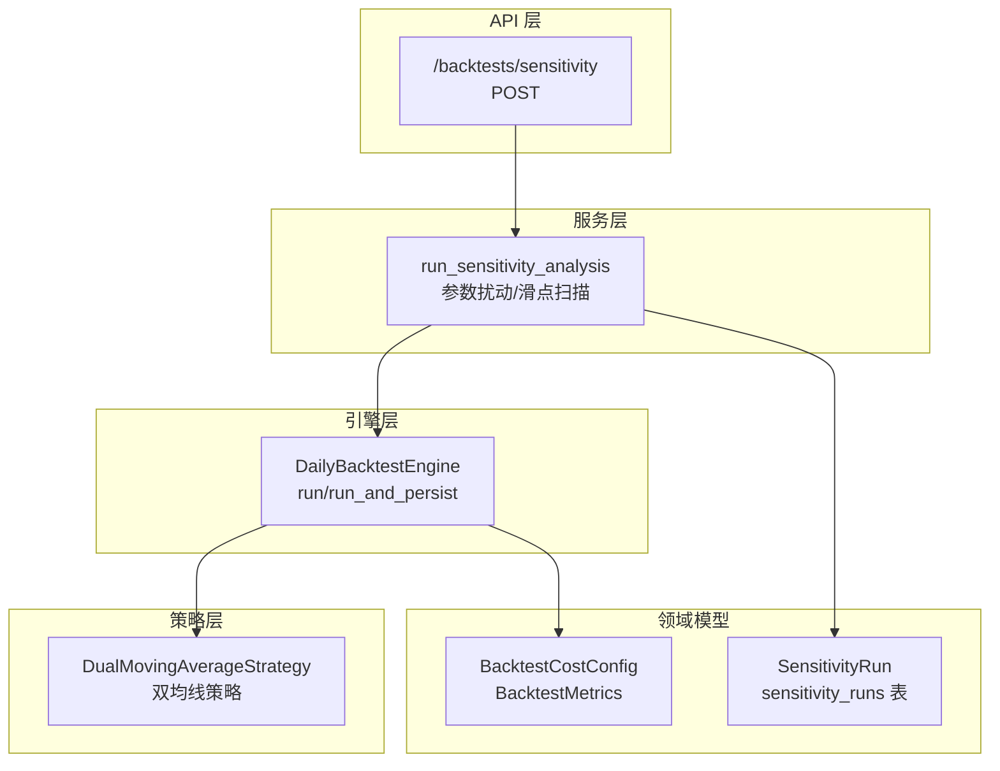
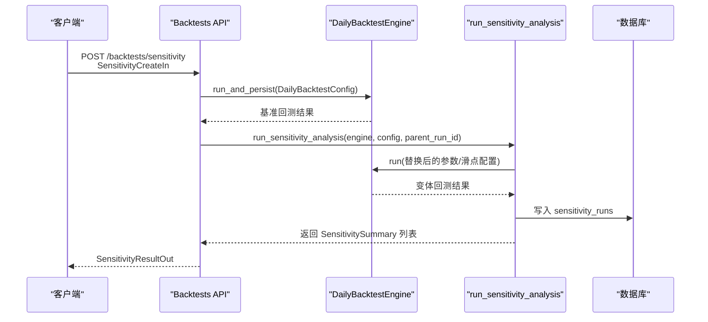
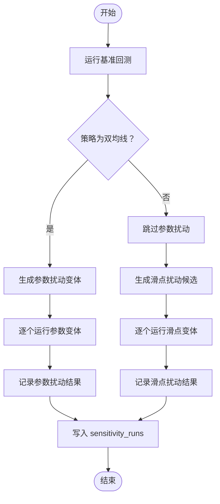
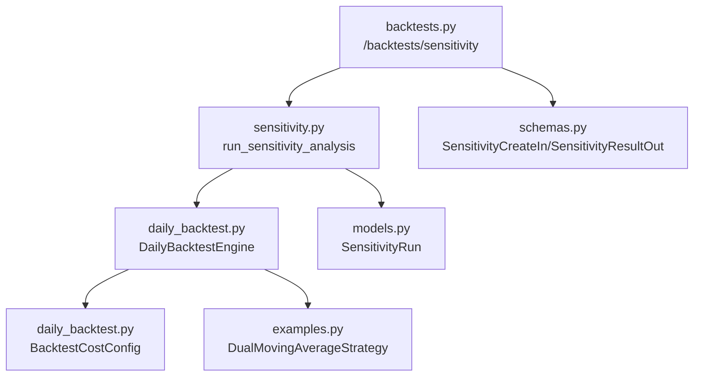

# 敏感性分析

<cite>
**本文档引用的文件**
- [sensitivity.py](file://backend/app/services/sensitivity.py)
- [backtests.py](file://backend/app/api/v1/backtests.py)
- [schemas.py](file://backend/app/domains/backtest/schemas.py)
- [models.py](file://backend/app/domains/backtest/models.py)
- [daily_backtest.py](file://backend/app/services/daily_backtest.py)
- [examples.py](file://backend/app/domains/strategy/examples.py)
- [runtime.py](file://backend/app/domains/strategy/runtime.py)
- [test_sensitivity.py](file://backend/tests/services/test_sensitivity.py)
</cite>

## 目录
1. [简介](#简介)
2. [项目结构](#项目结构)
3. [核心组件](#核心组件)
4. [架构总览](#架构总览)
5. [详细组件分析](#详细组件分析)
6. [依赖关系分析](#依赖关系分析)
7. [性能考量](#性能考量)
8. [故障排查指南](#故障排查指南)
9. [结论](#结论)
10. [附录](#附录)

## 简介
本文件系统性阐述本项目的敏感性分析能力，重点覆盖以下方面：
- 参数扰动：针对双均线策略的短期窗口与长期窗口进行小步扰动，生成若干变体以评估参数稳定性。
- 滑点敏感性：围绕基线滑点水平进行多点扫描，评估交易成本对收益的影响。
- 策略鲁棒性测试：通过基准回测与扰动回测的对比，量化策略在参数与滑点扰动下的稳定性。
- 配置与结果：详细说明 SensitivityCreateIn 配置格式、SensitivityResultOut 结果结构，以及基准与扰动回测的执行流程。
- 实践指南：参数扫描范围设置、多场景测试策略、敏感性指标计算与结果对比分析方法，以及最佳实践与参数选择建议。

## 项目结构
敏感性分析位于后端服务层，围绕每日回测引擎 DailyBacktestEngine 构建，通过 API 提供同步接口，确保在小规模扰动场景下保持响应式体验。

图表来源
- [backtests.py:497-537](file://backend/app/api/v1/backtests.py#L497-L537)
- [sensitivity.py:60-138](file://backend/app/services/sensitivity.py#L60-L138)
- [daily_backtest.py:185-200](file://backend/app/services/daily_backtest.py#L185-L200)
- [models.py:71-93](file://backend/app/domains/backtest/models.py#L71-L93)
- [examples.py:51-200](file://backend/app/domains/strategy/examples.py#L51-L200)

章节来源
- [backtests.py:497-537](file://backend/app/api/v1/backtests.py#L497-L537)
- [sensitivity.py:1-138](file://backend/app/services/sensitivity.py#L1-L138)
- [daily_backtest.py:185-200](file://backend/app/services/daily_backtest.py#L185-L200)

## 核心组件
- 敏感性分析服务：负责生成参数扰动与滑点扰动变体，调用引擎执行回测，并持久化结果到 sensitivity_runs 表。
- API 控制器：提供 /backtests/sensitivity 接口，接收 SensitivityCreateIn 配置，返回 SensitivityResultOut。
- 领域模型：BacktestCostConfig 定义交易成本假设；SensitivityRun 记录每次扰动的结果。
- 引擎与策略：DailyBacktestEngine 执行回测；内置双均线策略用于参数扰动扫描。

章节来源
- [sensitivity.py:23-138](file://backend/app/services/sensitivity.py#L23-L138)
- [backtests.py:497-537](file://backend/app/api/v1/backtests.py#L497-L537)
- [schemas.py:93-119](file://backend/app/domains/backtest/schemas.py#L93-L119)
- [models.py:71-93](file://backend/app/domains/backtest/models.py#L71-L93)
- [daily_backtest.py:33-48](file://backend/app/services/daily_backtest.py#L33-L48)
- [examples.py:51-200](file://backend/app/domains/strategy/examples.py#L51-L200)

## 架构总览
敏感性分析的端到端流程如下：

图表来源
- [backtests.py:497-537](file://backend/app/api/v1/backtests.py#L497-L537)
- [sensitivity.py:60-138](file://backend/app/services/sensitivity.py#L60-L138)
- [daily_backtest.py:185-200](file://backend/app/services/daily_backtest.py#L185-L200)
- [models.py:71-93](file://backend/app/domains/backtest/models.py#L71-L93)

## 详细组件分析

### 敏感性分析服务 run_sensitivity_analysis
- 功能职责
  - 重新运行一次基准回测，确保指标形态一致。
  - 对双均线策略生成参数扰动变体（短期/长期窗口的小步扰动），跳过无效组合。
  - 对交易成本进行滑点扰动扫描，围绕基线滑点生成多个候选点。
  - 将所有变体结果写入 sensitivity_runs 表，并返回内存中的摘要列表。
- 关键实现要点
  - 参数扰动：仅对双均线策略生效，生成最多约 8 个有效变体。
  - 滑点扰动：围绕基线滑点生成候选集，过滤掉与基线相同的点。
  - 错误处理：捕获回测异常并跳过该变体，保证流程稳健。
  - 结果持久化：统一写入 cumulative_return、annual_return、max_drawdown、sharpe_ratio、win_rate、turnover 等指标。

图表来源
- [sensitivity.py:60-138](file://backend/app/services/sensitivity.py#L60-L138)

章节来源
- [sensitivity.py:34-138](file://backend/app/services/sensitivity.py#L34-L138)

### API 控制器 /backtests/sensitivity
- 请求体：SensitivityCreateIn
  - universe：标的列表
  - start_date/end_date：回测起止日期
  - strategy_name：策略名称，默认 dual_ma
  - initial_cash：初始资金
  - strategy_params：策略参数字典
  - cost_config：交易成本配置（commission_rate、min_commission、stamp_tax_rate、slippage_bps）
- 响应体：SensitivityResultOut
  - task_id、run_id
  - runs：SensitivityRunOut 列表，包含 kind、label、is_baseline、各项指标
- 执行流程
  - 构造 DailyBacktestConfig
  - 先运行并持久化基准回测
  - 调用 run_sensitivity_analysis 进行扰动扫描
  - 组装 SensitivityResultOut 返回

章节来源
- [backtests.py:497-537](file://backend/app/api/v1/backtests.py#L497-L537)
- [schemas.py:295-313](file://backend/app/domains/backtest/schemas.py#L295-L313)

### 领域模型与数据库映射
- BacktestCostConfig：定义佣金率、最低佣金、印花税率、滑点（bps）等成本参数。
- SensitivityRun：记录一次扰动回测结果，包括 parent_run_id、kind（param/slippage）、label、variant_json、is_baseline、各项指标。
- DailyBacktestConfig：包含 universe、start_date、end_date、strategy_name、initial_cash、strategy_params、cost_config、in_sample_end_date 等字段。

章节来源
- [schemas.py:93-119](file://backend/app/domains/backtest/schemas.py#L93-L119)
- [models.py:71-93](file://backend/app/domains/backtest/models.py#L71-L93)
- [daily_backtest.py:148-183](file://backend/app/services/daily_backtest.py#L148-L183)

### 策略层：双均线策略
- 双均线策略支持参数 short_window、long_window、max_positions、target_gross。
- 参数扰动扫描依赖这两个窗口参数，生成多种组合以评估参数稳定性。
- 策略信号与再平衡逻辑基于移动平均交叉与目标总杠杆，影响回测收益与风险指标。

章节来源
- [examples.py:21-49](file://backend/app/domains/strategy/examples.py#L21-L49)
- [examples.py:51-200](file://backend/app/domains/strategy/examples.py#L51-L200)

### 测试验证
- 单元测试覆盖了基准回测、参数扰动与滑点扰动的写入行为，断言包含 baseline、kind 为 param/slippage 的结果条目数量与 is_baseline 标记正确性。

章节来源
- [test_sensitivity.py:58-85](file://backend/tests/services/test_sensitivity.py#L58-L85)

## 依赖关系分析
敏感性分析的依赖关系如下：

图表来源
- [backtests.py:497-537](file://backend/app/api/v1/backtests.py#L497-L537)
- [sensitivity.py:60-138](file://backend/app/services/sensitivity.py#L60-L138)
- [daily_backtest.py:185-200](file://backend/app/services/daily_backtest.py#L185-L200)
- [examples.py:51-200](file://backend/app/domains/strategy/examples.py#L51-L200)
- [models.py:71-93](file://backend/app/domains/backtest/models.py#L71-L93)
- [schemas.py:295-313](file://backend/app/domains/backtest/schemas.py#L295-L313)

章节来源
- [backtests.py:497-537](file://backend/app/api/v1/backtests.py#L497-L537)
- [sensitivity.py:60-138](file://backend/app/services/sensitivity.py#L60-L138)
- [daily_backtest.py:185-200](file://backend/app/services/daily_backtest.py#L185-L200)
- [examples.py:51-200](file://backend/app/domains/strategy/examples.py#L51-L200)
- [models.py:71-93](file://backend/app/domains/backtest/models.py#L71-L93)
- [schemas.py:295-313](file://backend/app/domains/backtest/schemas.py#L295-L313)

## 性能考量
- 同步接口设计：扰动规模限制在约 10 次以内，确保 API 保持同步响应，避免长时间阻塞。
- 变体生成策略：参数扰动采用小步增量，滑点扰动采用有限候选集，兼顾覆盖面与性能。
- 异常容错：捕获回测异常并跳过失败变体，保证整体流程稳定。
- 数据库写入：批量提交，减少事务开销。

[本节为通用性能讨论，不直接分析具体文件，无需列出章节来源]

## 故障排查指南
- 常见错误
  - 数据不足：当无法加载足够的市场数据时抛出 BacktestDataError。
  - 参数非法：如滑点过大、窗口参数不合法等，会在配置校验阶段报错。
  - 策略未知：传入不支持的策略名会触发异常。
- 排查步骤
  - 检查输入日期范围与 universe 是否存在有效行情数据。
  - 核对 strategy_params 中关键参数（如 short_window、long_window）是否满足策略约束。
  - 确认 cost_config 中各字段非负且合理。
  - 查看数据库中 sensitivity_runs 表是否成功写入，核对 is_baseline 与 kind 字段。
- 单元测试参考
  - 使用测试用例验证基准与扰动结果的写入行为，定位问题范围。

章节来源
- [daily_backtest.py:29-48](file://backend/app/services/daily_backtest.py#L29-L48)
- [test_sensitivity.py:58-85](file://backend/tests/services/test_sensitivity.py#L58-L85)

## 结论
本项目的敏感性分析通过“基准回测 + 小规模扰动扫描”的方式，快速评估策略在参数与滑点扰动下的稳定性。其设计强调简洁、可控与可解释性，适合在研发与评审阶段进行快速迭代与对比。对于更广泛的参数空间探索，可结合参数扫描与网格搜索等方法，但需注意与同步接口的权衡。

[本节为总结性内容，不直接分析具体文件，无需列出章节来源]

## 附录

### SensitivityCreateIn 配置格式
- 字段说明
  - universe：标的列表
  - start_date/end_date：回测起止日期
  - strategy_name：策略名称，默认 dual_ma
  - initial_cash：初始资金
  - strategy_params：策略参数字典（如双均线的 short_window、long_window 等）
  - cost_config：交易成本配置（commission_rate、min_commission、stamp_tax_rate、slippage_bps）

章节来源
- [schemas.py:295-305](file://backend/app/domains/backtest/schemas.py#L295-L305)

### SensitivityResultOut 结果结构
- 字段说明
  - task_id、run_id：任务与回测运行标识
  - runs：SensitivityRunOut 列表
    - kind：扰动类型（param 或 slippage）
    - label：扰动标签
    - is_baseline：是否为基准回测
    - 指标：cumulative_return、annual_return、max_drawdown、sharpe_ratio、win_rate、turnover

章节来源
- [schemas.py:307-313](file://backend/app/domains/backtest/schemas.py#L307-L313)
- [schemas.py:281-293](file://backend/app/domains/backtest/schemas.py#L281-L293)

### 基准回测与扰动回测执行流程
- 基准回测：由 API 调用 DailyBacktestEngine.run_and_persist 执行并持久化。
- 扰动回测：由 run_sensitivity_analysis 生成变体配置，逐个调用 DailyBacktestEngine.run 执行。
- 结果持久化：将每次扰动的指标写入 sensitivity_runs 表，便于后续对比分析。

章节来源
- [backtests.py:514-516](file://backend/app/api/v1/backtests.py#L514-L516)
- [sensitivity.py:74-137](file://backend/app/services/sensitivity.py#L74-L137)

### 参数扫描范围设置与多场景测试策略
- 参数扫描
  - 双均线策略：对 short_window、long_window 进行小步扰动，跳过无效组合（short >= long）。
  - 建议范围：以策略默认参数为中心，±1/±5 的小步扰动即可覆盖主要参数敏感区域。
- 滑点敏感性
  - 基线滑点周围生成候选点，如 ±5bps、+20bps 等，评估交易成本对收益的影响。
- 多场景测试
  - 可叠加不同成本假设（佣金率、印花税）与滑点组合，形成多维扰动矩阵。
  - 结合时间窗口分割（IS/OOS）评估扰动在不同阶段的稳定性。

章节来源
- [sensitivity.py:34-51](file://backend/app/services/sensitivity.py#L34-L51)
- [sensitivity.py:54-57](file://backend/app/services/sensitivity.py#L54-L57)

### 敏感性指标计算与结果对比分析
- 指标体系
  - 收益类：累计收益、年化收益
  - 风险类：最大回撤
  - 风险调整收益：夏普比率
  - 盈利质量：胜率、换手率
- 对比分析
  - 以基准回测为参照，比较各变体指标偏离程度，识别最敏感的扰动方向。
  - 可绘制参数热力图（如双均线窗口的收益矩阵）辅助决策。

章节来源
- [schemas.py:155-167](file://backend/app/domains/backtest/schemas.py#L155-L167)
- [schemas.py:281-293](file://backend/app/domains/backtest/schemas.py#L281-L293)

### 最佳实践与参数选择建议
- 参数选择
  - 优先关注对策略信号与再平衡影响最大的参数（如双均线窗口、目标总杠杆）。
  - 保持扰动幅度较小，确保变体仍具备策略意义。
- 成本假设
  - 滑点应结合实盘流动性与交易频率设定，避免极端值干扰判断。
  - 佣金与印花税应参考实际交易成本，避免过度乐观或悲观。
- 结果解释
  - 关注指标的相对变化而非绝对数值，结合策略特性解释波动原因。
  - 对于显著偏离的变体，进一步检查参数边界条件与数据质量。

[本节为通用实践建议，不直接分析具体文件，无需列出章节来源]