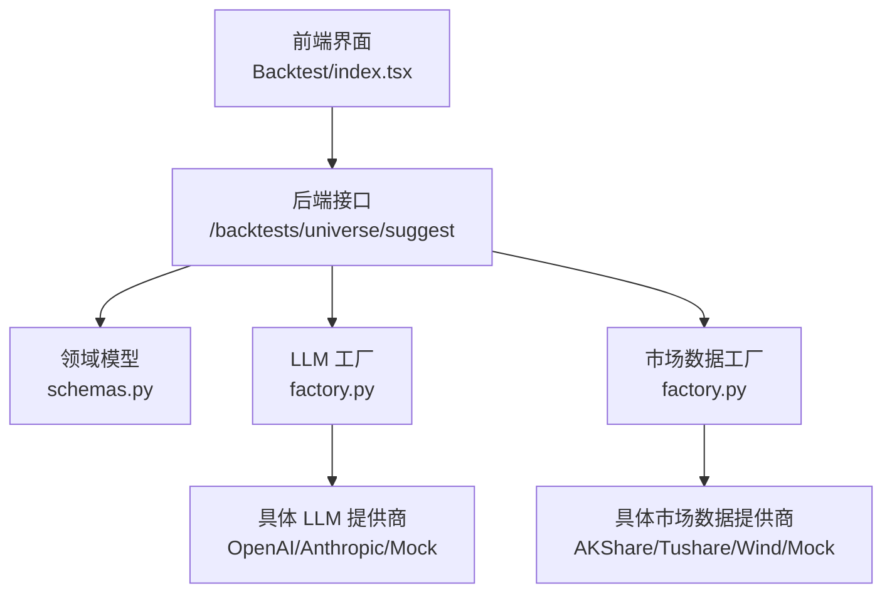
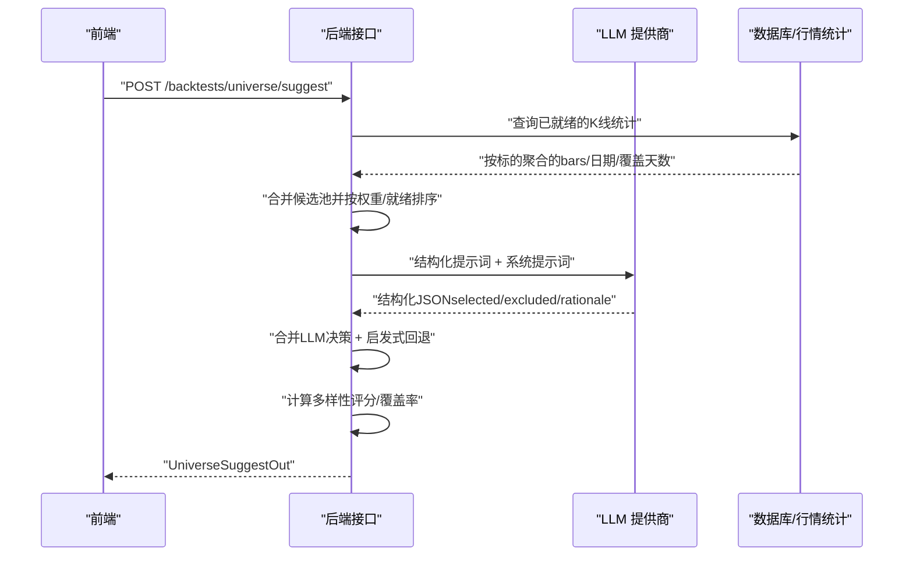
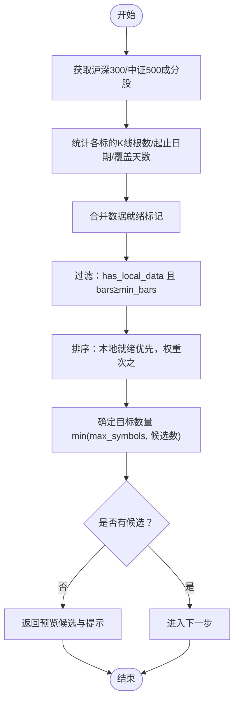
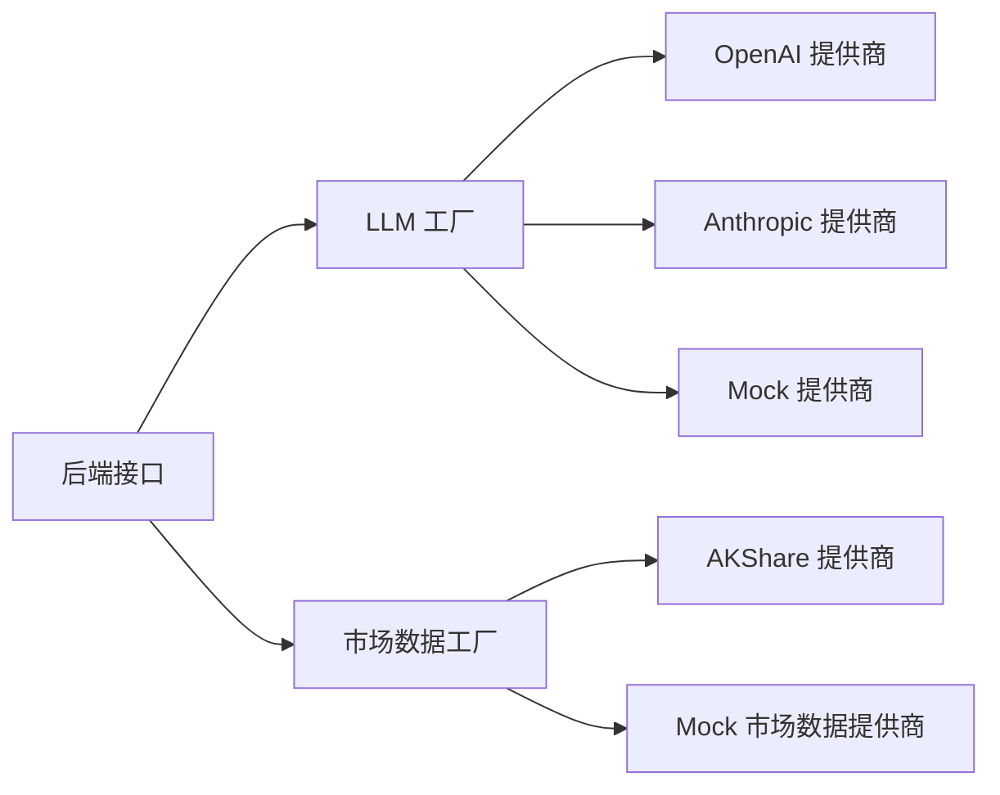

# 股票池选择

<cite>
**本文引用的文件**
- [backend/app/api/v1/backtests.py](file://backend/app/api/v1/backtests.py)
- [backend/app/domains/backtest/schemas.py](file://backend/app/domains/backtest/schemas.py)
- [frontend/src/lib/api.ts](file://frontend/src/lib/api.ts)
- [frontend/src/screens/Backtest/index.tsx](file://frontend/src/screens/Backtest/index.tsx)
- [backend/app/integrations/llm/factory.py](file://backend/app/integrations/llm/factory.py)
- [backend/app/integrations/market_data/factory.py](file://backend/app/integrations/market_data/factory.py)
- [backend/app/integrations/llm/mock.py](file://backend/app/integrations/llm/mock.py)
- [backend/app/integrations/llm/prompts.py](file://backend/app/integrations/llm/prompts.py)
</cite>

## 目录
1. [简介](#简介)
2. [项目结构](#项目结构)
3. [核心组件](#核心组件)
4. [架构总览](#架构总览)
5. [详细组件分析](#详细组件分析)
6. [依赖分析](#依赖分析)
7. [性能考虑](#性能考虑)
8. [故障排查指南](#故障排查指南)
9. [结论](#结论)
10. [附录](#附录)

## 简介
本文件系统性阐述“股票池选择”能力，围绕 AI 驱动的股票池构建算法、候选标的筛选与多样性评估机制展开，覆盖输入参数 UniverseSuggestIn、输出格式 UniverseSuggestOut、AI 推荐逻辑与启发式回退策略，并补充数据质量评估、策略适配性分析、标的多样性计算与覆盖率统计等关键环节。同时提供最佳实践、参数调优建议与结果验证方法，帮助开发者构建高质量的回测标的池。

## 项目结构
该能力由后端 API、领域模型、前端交互与外部集成共同组成：
- 后端 API 提供 /backtests/universe/suggest 接口，负责候选池构建、LLM 结构化输出、多样性评分与覆盖率统计。
- 领域模型定义输入/输出结构 UniverseSuggestIn/UniverseSuggestOut 及候选条目 UniverseCandidate。
- 前端通过 API 客户端调用后端接口，渲染候选列表、推荐理由与多样性指标。
- 外部集成包括 LLM 提供商工厂与市场数据提供商工厂，支持多种供应商与回退策略。

**图表来源**
- [backend/app/api/v1/backtests.py:199-466](file://backend/app/api/v1/backtests.py#L199-L466)
- [backend/app/domains/backtest/schemas.py:121-180](file://backend/app/domains/backtest/schemas.py#L121-L180)
- [frontend/src/screens/Backtest/index.tsx:532-610](file://frontend/src/screens/Backtest/index.tsx#L532-L610)
- [backend/app/integrations/llm/factory.py:11-65](file://backend/app/integrations/llm/factory.py#L11-L65)
- [backend/app/integrations/market_data/factory.py:23-56](file://backend/app/integrations/market_data/factory.py#L23-L56)

**章节来源**
- [backend/app/api/v1/backtests.py:199-466](file://backend/app/api/v1/backtests.py#L199-L466)
- [backend/app/domains/backtest/schemas.py:121-180](file://backend/app/domains/backtest/schemas.py#L121-L180)
- [frontend/src/lib/api.ts:309-336](file://frontend/src/lib/api.ts#L309-L336)
- [frontend/src/screens/Backtest/index.tsx:532-610](file://frontend/src/screens/Backtest/index.tsx#L532-L610)
- [backend/app/integrations/llm/factory.py:11-65](file://backend/app/integrations/llm/factory.py#L11-L65)
- [backend/app/integrations/market_data/factory.py:23-56](file://backend/app/integrations/market_data/factory.py#L23-L56)

## 核心组件
- 输入参数 UniverseSuggestIn
  - 策略族 strategy_family：支持趋势、动量、均值回归等家族，用于指导 AI 的策略适配性判断。
  - 最大标的数 max_symbols：限制最终推荐数量，影响多样性评分与覆盖率统计。
  - 是否多样化 diversify：控制是否强调行业/特征分散。
  - 流动性筛选：index_pool（沪深300/中证500/两者）、min_bars（最少K线根数）、min_avg_turnover_cny（日均成交额门槛）。
  - 波动率筛选：min_volatility/max_volatility（年化波动率带）。
  - 动量筛选：momentum_window_days、min_momentum/max_momentum（动量窗口与阈值）。
- 输出格式 UniverseSuggestOut
  - symbols：最终入选标的列表。
  - candidates：完整候选列表（含每个候选的 bars、日期范围、是否已本地数据就绪、AI 选择/排除理由等）。
  - diversityScore：多样性评分（综合标的数量与平均权重）。
  - coverageDays：覆盖天数（基于入选标的起止日期跨度）。
  - recommendation：总体建议文本（包含数据就绪情况与后续步骤提示）。
  - aiRationale/aiModel：AI 整体理由与所用模型信息（若使用 LLM）。

**章节来源**
- [backend/app/domains/backtest/schemas.py:121-180](file://backend/app/domains/backtest/schemas.py#L121-L180)
- [backend/app/api/v1/backtests.py:292-327](file://backend/app/api/v1/backtests.py#L292-L327)
- [backend/app/api/v1/backtests.py:458-466](file://backend/app/api/v1/backtests.py#L458-L466)

## 架构总览
下图展示了从请求到响应的关键流程：前端发起建议请求 → 后端构建候选池 → 过滤与排序 → LLM 结构化输出 → 合并决策 → 计算多样性与覆盖率 → 返回统一输出。

**图表来源**
- [backend/app/api/v1/backtests.py:200-466](file://backend/app/api/v1/backtests.py#L200-L466)
- [backend/app/integrations/llm/factory.py:11-65](file://backend/app/integrations/llm/factory.py#L11-L65)

**章节来源**
- [backend/app/api/v1/backtests.py:200-466](file://backend/app/api/v1/backtests.py#L200-L466)
- [backend/app/integrations/llm/factory.py:11-65](file://backend/app/integrations/llm/factory.py#L11-L65)

## 详细组件分析

### 输入参数 UniverseSuggestIn 解析
- 策略族 strategy_family：决定 AI 对标的特征偏好（如趋势跟踪偏好权重较大、动量偏好分散等）。
- max_symbols：直接影响最终入选数量与多样性评分权重项。
- diversify：开启时更强调分散性，AI 在理由中会突出行业/特征分散。
- 流动性筛选：
  - index_pool：仅从沪深300/中证500或两者组合中抽取候选。
  - min_bars：本地K线根数门槛，低于则不进入最终候选池。
  - min_avg_turnover_cny：日均成交额门槛，过滤流动性不足标的。
- 波动率筛选：min_volatility/max_volatility 控制年化波动率边界，剔除极端低/高波动标的。
- 动量筛选：momentum_window_days 决定动量窗口长度，min/max_momentum 控制入选阈值。

**章节来源**
- [backend/app/domains/backtest/schemas.py:121-151](file://backend/app/domains/backtest/schemas.py#L121-L151)

### 候选池构建与筛选
- 候选来源：通过 AKShare 获取沪深300/中证500成分股，提取代码、交易所、指数权重与名称。
- 数据就绪标记：通过 MarketBarDaily 统计各标的的 K线根数、起止日期与覆盖天数，并标记 has_local_data。
- 过滤与排序：
  - 仅保留 has_local_data 且 bars ≥ min_bars 的标的。
  - 先按“本地数据就绪”降序，再按“指数权重”降序，确保优先选择数据完整且权重大的标的。
  - 若无候选，返回前若干预览候选及提示信息。

**图表来源**
- [backend/app/api/v1/backtests.py:213-327](file://backend/app/api/v1/backtests.py#L213-L327)

**章节来源**
- [backend/app/api/v1/backtests.py:213-327](file://backend/app/api/v1/backtests.py#L213-L327)

### AI 推荐逻辑与结构化输出
- 系统提示词：强调避免过拟合、数据完整性优先、策略适配性与多样性原则，并要求严格 JSON 输出。
- 上下文构建：将候选标的（含指数权重与本地数据状态）拼接为表格，限定上下文规模。
- LLM 调用：通过工厂模式选择具体提供商（OpenAI/Anthropic/Mock），以结构化 schema 生成 selected/excluded/rationale/diversity_note。
- 结果合并：
  - 若 LLM 返回有效结构化结果，按 selected 顺序取前 target_count 个，去重并填充理由。
  - 将 excluded 中的标的也纳入理由映射，便于 UI 展示。
  - 若 LLM 失败，则启用启发式回退策略（见下一节）。

**章节来源**
- [backend/app/api/v1/backtests.py:188-198](file://backend/app/api/v1/backtests.py#L188-L198)
- [backend/app/api/v1/backtests.py:329-375](file://backend/app/api/v1/backtests.py#L329-L375)
- [backend/app/api/v1/backtests.py:376-400](file://backend/app/api/v1/backtests.py#L376-L400)

### 启发式回退策略
当 LLM 无法生成结构化结果时，采用“本地数据就绪优先 + 指数权重优先”的启发式策略：
- 保持排序不变，遍历候选池，逐个加入，直到达到 target_count 或耗尽。
- 为每个入选标的生成统一的理由模板，强调“本地数据满足门槛、指数权重占比”等客观条件。
- 不生成 ai_rationale，recommendation 由后端统一汇总。

**章节来源**
- [backend/app/api/v1/backtests.py:393-400](file://backend/app/api/v1/backtests.py#L393-L400)

### 多样性评估与覆盖率统计
- 多样性评分：
  - 综合“入选数量占目标比例”与“平均权重占比”，各占 50% 权重，四舍五入至两位小数。
  - 当 n=0 时，多样性评分设为 0。
- 覆盖率统计：
  - 基于入选标的的最早开始日期与最晚结束日期计算覆盖天数。
  - 若无日期信息，覆盖天数为 0。
- 推荐语：
  - 若存在 AI 理由，优先使用；否则生成统一提示，包含“已就绪/待导入”的数量说明。

**章节来源**
- [backend/app/api/v1/backtests.py:431-466](file://backend/app/api/v1/backtests.py#L431-L466)

### 前端集成与可视化
- 前端 API 客户端封装了 suggestUniverse 调用，传入 strategyFamily/maxSymbols/minBars/diversify。
- Backtest 页面渲染候选列表，包含符号、名称、K线根数、数据区间、覆盖天数与 AI 选择理由。
- 支持点击切换标的选中状态，实时反映“推荐入选/当前已选/未选中”。

**章节来源**
- [frontend/src/lib/api.ts:309-336](file://frontend/src/lib/api.ts#L309-L336)
- [frontend/src/lib/api.ts:660-666](file://frontend/src/lib/api.ts#L660-L666)
- [frontend/src/screens/Backtest/index.tsx:532-610](file://frontend/src/screens/Backtest/index.tsx#L532-L610)

## 依赖分析
- LLM 工厂：根据配置动态选择 OpenAI/Anthropic/Mock 提供商，未配置时回退到 Mock。
- 市场数据工厂：优先 AKShare，不可用时回退 Mock，保证候选池构建可用性。
- 前后端契约：前端通过 API 客户端调用后端接口，后端以 Pydantic 模型序列化输出。

**图表来源**
- [backend/app/integrations/llm/factory.py:11-65](file://backend/app/integrations/llm/factory.py#L11-L65)
- [backend/app/integrations/market_data/factory.py:23-56](file://backend/app/integrations/market_data/factory.py#L23-L56)

**章节来源**
- [backend/app/integrations/llm/factory.py:11-65](file://backend/app/integrations/llm/factory.py#L11-L65)
- [backend/app/integrations/market_data/factory.py:23-56](file://backend/app/integrations/market_data/factory.py#L23-L56)

## 性能考虑
- 候选池规模控制：通过 max_symbols 限制最终数量，减少 LLM 上下文与评分开销。
- 上下文裁剪：仅展示前若干候选，避免超出 LLM 上下文长度限制。
- 异步并发：AKShare 成分股权重 API 使用异步 gather 并行拉取，提升候选池构建速度。
- 数据就绪优先：先过滤本地数据就绪标的，减少无效回测准备时间。
- 回退策略：在 LLM 不可用时快速返回启发式结果，保障用户体验。

**章节来源**
- [backend/app/api/v1/backtests.py:220-224](file://backend/app/api/v1/backtests.py#L220-L224)
- [backend/app/api/v1/backtests.py:298-306](file://backend/app/api/v1/backtests.py#L298-L306)
- [backend/app/api/v1/backtests.py:393-400](file://backend/app/api/v1/backtests.py#L393-L400)

## 故障排查指南
- LLM 未返回结构化结果
  - 现象：aiRationale 为空，recommendation 为统一提示。
  - 排查：确认 LLM 配置（模型名、基础地址、超时与最大令牌数）是否正确；检查网络连通性；必要时切换到 Mock 提供商进行功能验证。
  - 参考实现：[LLM 工厂:11-65](file://backend/app/integrations/llm/factory.py#L11-L65)，[Mock 实现:1-30](file://backend/app/integrations/llm/mock.py#L1-L30)。
- 无候选标的
  - 现象：返回空 symbols 与预览候选，recommendation 提示调整 min_bars 或导入数据。
  - 排查：检查 min_bars 是否过高；确认 MarketBarDaily 是否已导入足够历史数据；查看前端数据健康度面板。
  - 参考实现：[候选池构建与过滤:292-327](file://backend/app/api/v1/backtests.py#L292-L327)。
- 多样性评分为 0
  - 现象：n=0 导致 diversityScore=0。
  - 排查：提高 max_symbols 或放宽 min_bars；检查指数权重分布是否过于集中。
  - 参考实现：[多样性评分计算:431-441](file://backend/app/api/v1/backtests.py#L431-L441)。
- 覆盖期为 0
  - 现象：start/end 日期缺失导致 coverageDays=0。
  - 排查：确认 MarketBarDaily 的日期字段是否正确入库；检查数据提供商的可用性。
  - 参考实现：[覆盖率统计:442-446](file://backend/app/api/v1/backtests.py#L442-L446)。

**章节来源**
- [backend/app/integrations/llm/factory.py:11-65](file://backend/app/integrations/llm/factory.py#L11-L65)
- [backend/app/integrations/llm/mock.py:1-30](file://backend/app/integrations/llm/mock.py#L1-L30)
- [backend/app/api/v1/backtests.py:292-327](file://backend/app/api/v1/backtests.py#L292-L327)
- [backend/app/api/v1/backtests.py:431-446](file://backend/app/api/v1/backtests.py#L431-L446)

## 结论
该股票池选择方案以“数据就绪优先 + 策略适配性 + 多样性约束”为核心，结合 LLM 结构化输出与启发式回退，形成稳健的候选池构建流程。通过明确的输入参数、统一的输出格式与完善的多样性/覆盖率指标，开发者可以高效地迭代参数、验证结果并持续优化回测标的池质量。

## 附录

### 参数调优指南
- 策略族 strategy_family：根据策略类型选择合适偏好（趋势跟踪偏向权重大、动量偏好分散）。
- max_symbols：从较小值起步，逐步增加以观察多样性评分与覆盖率变化。
- diversify：在多策略对比场景建议开启，以增强跨策略稳定性。
- min_bars：结合回测周期与滑点成本设置，避免过短导致信号噪声过大。
- min_avg_turnover_cny：根据市场流动性与策略换手率设定，过滤流动性不足标的。
- 波动率带 min_volatility/max_volatility：结合策略风险预算与最大回撤目标设定。
- 动量窗口与阈值：与策略持有期匹配，避免过度敏感或迟滞。

### 结果验证方法
- 多样性评分与覆盖率：核对 diversityScore 与 coverageDays 是否符合预期；关注平均权重与数量的平衡。
- 候选列表一致性：对比不同 min_bars 下的候选变化，确认数据就绪标记与权重排序逻辑。
- LLM vs 启发式：在 LLM 不可用时验证启发式回退是否稳定；比较两类结果的差异与合理性。
- 前端展示一致性：核对 UI 中“推荐入选/当前已选/未选中”状态与后端输出一致。