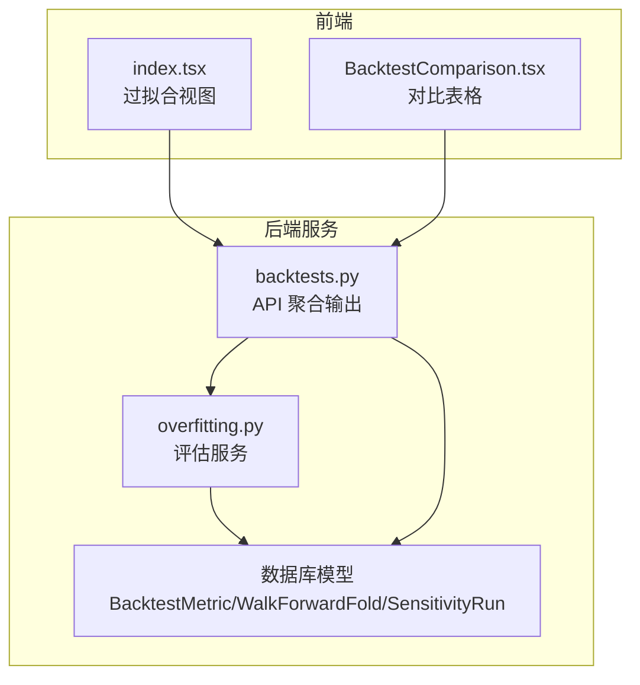
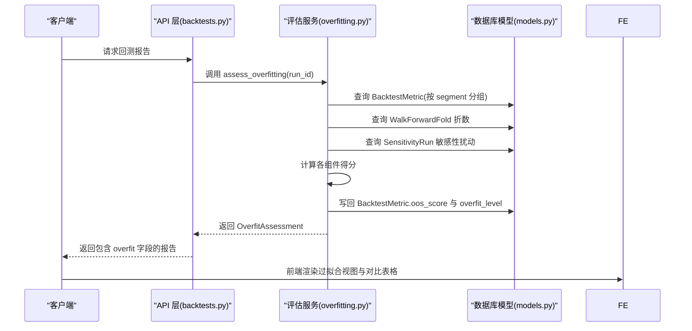
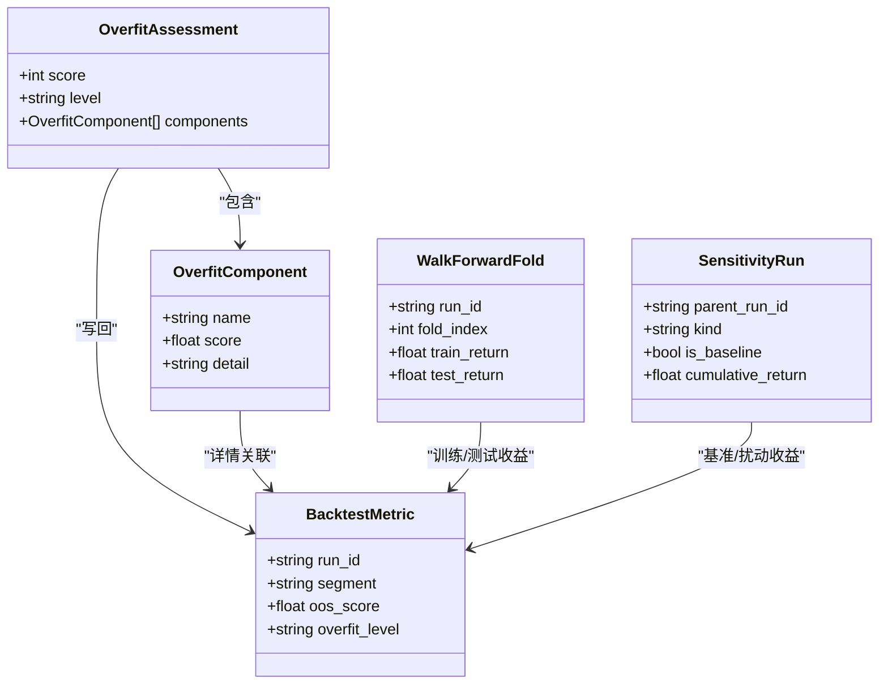
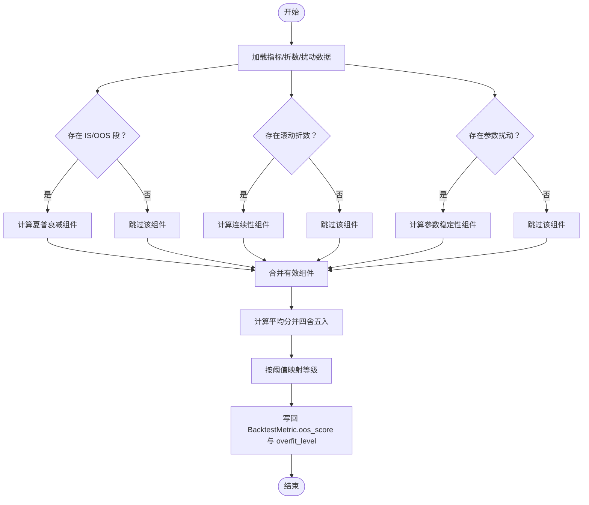

# 过拟合评估

<cite>
**本文档引用的文件**
- [overfitting.py](file://backend/app/services/overfitting.py)
- [test_overfitting.py](file://backend/tests/services/test_overfitting.py)
- [models.py](file://backend/app/domains/backtest/models.py)
- [schemas.py](file://backend/app/domains/backtest/schemas.py)
- [backtests.py](file://backend/app/api/v1/backtests.py)
- [daily_backtest.py](file://backend/app/services/daily_backtest.py)
- [index.tsx](file://frontend/src/screens/Backtest/index.tsx)
- [BacktestComparison.tsx](file://frontend/src/screens/Backtest/BacktestComparison.tsx)
</cite>

## 目录
1. [简介](#简介)
2. [项目结构](#项目结构)
3. [核心组件](#核心组件)
4. [架构总览](#架构总览)
5. [详细组件分析](#详细组件分析)
6. [依赖关系分析](#依赖关系分析)
7. [性能考虑](#性能考虑)
8. [故障排除指南](#故障排除指南)
9. [结论](#结论)
10. [附录](#附录)

## 简介
本文件系统性阐述过拟合评估模块的设计与实现，包括评估算法、指标体系、风险等级判定机制，以及结果格式与前端展示。该模块通过四个维度的信号综合评分，将过拟合风险量化为 0–100 的分数，并按阈值划分为低/中/高三个等级。评估结果会持久化到回测指标表的“全样本”段落中，供后续策略评审与晋级流程使用。

## 项目结构
过拟合评估涉及后端服务、数据库模型、API 接口与前端展示四部分协同工作：
- 服务层：负责从数据库读取回测指标、滚动训练/测试折数与敏感性扰动结果，计算各组件得分并汇总为最终评分。
- 数据模型：定义回测指标、滚动折数与敏感性运行结果的数据结构及字段。
- API 层：提供回测报告聚合输出，包含过拟合评估结果，并在策略晋级门禁中使用该结果进行决策。
- 前端层：展示过拟合评分、等级与各组件详情，支持策略对比视图中的评分与等级显示。

图表来源
- [overfitting.py:129-167](file://backend/app/services/overfitting.py#L129-L167)
- [models.py:33-118](file://backend/app/domains/backtest/models.py#L33-L118)
- [backtests.py:1100-1185](file://backend/app/api/v1/backtests.py#L1100-L1185)
- [index.tsx:1256-1280](file://frontend/src/screens/Backtest/index.tsx#L1256-L1280)
- [BacktestComparison.tsx:138-175](file://frontend/src/screens/Backtest/BacktestComparison.tsx#L138-L175)

章节来源
- [overfitting.py:1-168](file://backend/app/services/overfitting.py#L1-L168)
- [models.py:1-155](file://backend/app/domains/backtest/models.py#L1-L155)
- [backtests.py:1-200](file://backend/app/api/v1/backtests.py#L1-L200)

## 核心组件
- OverfitAssessment：评估结果容器，包含总分（0–100）、风险等级（low/medium/high）与各组件列表。
- OverfitComponent：单个评估组件，包含名称、得分（0..1）与详情字符串。
- 评估服务 assess_overfitting：主入口，聚合 IS/OOS 夏普衰减、IS/OOS 最大回撤一致性、滚动训练/测试连续性、参数扰动稳定性四个信号，计算平均分并分级。

章节来源
- [overfitting.py:29-41](file://backend/app/services/overfitting.py#L29-L41)
- [overfitting.py:129-167](file://backend/app/services/overfitting.py#L129-L167)

## 架构总览
下图展示了从回测数据到评估结果再到前端展示的完整流程：

图表来源
- [backtests.py:1100-1185](file://backend/app/api/v1/backtests.py#L1100-L1185)
- [overfitting.py:129-167](file://backend/app/services/overfitting.py#L129-L167)
- [models.py:33-118](file://backend/app/domains/backtest/models.py#L33-L118)

## 详细组件分析

### OverfitAssessmentOut 评估结果格式
- 字段
  - score: 整数，范围 0–100
  - level: 字符串，取值 low/medium/high
  - components: 列表，元素为 OverfitComponentOut
- 用途
  - 作为 API 输出的一部分，参与策略晋级门禁检查与前端展示。

章节来源
- [schemas.py:302-305](file://backend/app/domains/backtest/schemas.py#L302-L305)

### 评估组件构成与计算逻辑
- IS/OOS 夏普比率衰减（sharpe_decay）
  - 输入：IS/OOS 段的夏普比率
  - 规则：若 IS 夏普非正，则 OOS 夏普不小于 IS 即得高分；否则按 OOS/IS 比值归一到 [0,1]
  - 得分含义：OOS 夏普相对 IS 的衰减程度，越接近 1 越稳定
- IS/OOS 最大回撤一致性（drawdown_consistency）
  - 输入：IS/OOS 段的最大回撤绝对值
  - 规则：以 IS 回撤为分母计算绝对差值比例，得分 = 1 - min(1, ratio)
  - 得分含义：IS 与 OOS 回撤差异越小越好
- 滚动训练/测试连续性（walk_forward_continuity）
  - 输入：多个 Fold 的 train_return/test_return
  - 规则：同号权重更高（sign agreement），幅度比按 test/train 归一加权
  - 得分含义：跨时间窗口收益方向与幅度的一致性
- 参数扰动稳定性（param_stability）
  - 输入：基准运行与若干参数扰动变体的累积收益
  - 规则：以基准收益为参照计算相对偏差，得分 = 1 - min(1, 平均相对偏差)
  - 得分含义：参数微小变化对收益的影响越小越稳定

章节来源
- [overfitting.py:51-69](file://backend/app/services/overfitting.py#L51-L69)
- [overfitting.py:72-84](file://backend/app/services/overfitting.py#L72-L84)
- [overfitting.py:87-106](file://backend/app/services/overfitting.py#L87-L106)
- [overfitting.py:109-126](file://backend/app/services/overfitting.py#L109-L126)

### 风险评分计算与等级划分
- 计算步骤
  - 收集所有可用组件得分（缺失组件跳过）
  - 对有效组件求平均，乘以 100 并四舍五入为整数
  - 按阈值映射到等级：≥70 为 low，[40,70) 为 medium，<40 为 high
- 结果持久化
  - 将平均分写入 BacktestMetric 中 segment 为 "all" 的行（或首个可用行）
  - 同时写入 overfit_level 字段

章节来源
- [overfitting.py:43-48](file://backend/app/services/overfitting.py#L43-L48)
- [overfitting.py:153-167](file://backend/app/services/overfitting.py#L153-L167)

### 数据模型与字段映射
- BacktestMetric
  - segment: all/is/oos
  - oos_score: 浮点型，存储评估平均分
  - overfit_level: 字符串，存储风险等级
- WalkForwardFold
  - 包含每折的 train_return/test_return 等，用于计算连续性
- SensitivityRun
  - 包含基准与扰动变体的累积收益，用于计算参数稳定性

章节来源
- [models.py:33-55](file://backend/app/domains/backtest/models.py#L33-L55)
- [models.py:95-118](file://backend/app/domains/backtest/models.py#L95-L118)
- [models.py:71-92](file://backend/app/domains/backtest/models.py#L71-L92)

### API 聚合与晋级门禁
- API 层在生成回测报告时，将 OverfitAssessment 注入到报告对象中
- 晋级门禁使用 overfit.level 与 overfit.score 进行硬性/警告判定，并给出下一步建议
- 当缺少 IS/OOS 切分、过拟合风险高等问题时，会阻断或要求复核

章节来源
- [backtests.py:1100-1185](file://backend/app/api/v1/backtests.py#L1100-L1185)
- [backtests.py:268-274](file://backend/app/api/v1/backtests.py#L268-L274)

### 前端展示
- 过拟合视图：展示总分、等级与各组件得分与详情
- 对比表格：展示策略的 oosScore 与 overfit 等级标签

章节来源
- [index.tsx:1256-1280](file://frontend/src/screens/Backtest/index.tsx#L1256-L1280)
- [BacktestComparison.tsx:138-175](file://frontend/src/screens/Backtest/BacktestComparison.tsx#L138-L175)

## 依赖关系分析
- 服务层依赖数据库模型进行查询与更新
- API 层依赖服务层生成评估结果，并将其纳入统一报告
- 前端依赖 API 提供的结构化数据进行可视化

图表来源
- [overfitting.py:29-41](file://backend/app/services/overfitting.py#L29-L41)
- [models.py:33-55](file://backend/app/domains/backtest/models.py#L33-L55)
- [models.py:95-118](file://backend/app/domains/backtest/models.py#L95-L118)
- [models.py:71-92](file://backend/app/domains/backtest/models.py#L71-L92)

## 性能考虑
- 评估过程为纯内存计算，主要 I/O 来自数据库查询，查询规模与折数、扰动变体数量相关
- 建议在大规模批量评估时，采用异步并发与分页查询，避免阻塞主线程
- 对于滚动折数较多的场景，可考虑缓存中间结果以减少重复计算

## 故障排除指南
- 缺少 IS/OOS 切分
  - 现象：评估组件为空，返回 high 等级与 0 分
  - 原因：未提供 segment 为 "is"/"oos" 的指标
  - 处理：启用 in_sample_end_date 并重新运行回测
- 缺少滚动折数或敏感性扰动
  - 现象：相应组件被跳过，最终评分为部分组件的平均
  - 建议：补充 Walk-Forward 或 Sensitivity 分析
- 数据异常
  - 现象：某些组件得分为边界值（如 0.3/1.0）
  - 原因：训练/测试收益接近 0 或符号相反
  - 建议：检查数据质量与参数设置
- 前端显示异常
  - 现象：过拟合视图为空或等级不正确
  - 检查：确认 API 是否正确注入 overfit 字段，前端是否正确解析

章节来源
- [test_overfitting.py:89-108](file://backend/tests/services/test_overfitting.py#L89-L108)
- [overfitting.py:153-154](file://backend/app/services/overfitting.py#L153-L154)

## 结论
该过拟合评估模块通过 IS/OOS 夏普衰减、回撤一致性、滚动连续性与参数扰动稳定性四个维度，将过拟合风险量化为直观的 0–100 分与等级标签，并与策略晋级门禁和前端展示无缝衔接。对于开发者而言，应确保回测配置包含 IS/OOS 切分、滚动折数与敏感性扰动，以获得更可靠的评估结果；同时结合收益风险比与交易证据等其他检查项，形成完整的策略质量画像。

## 附录

### 评估算法流程图

图表来源
- [overfitting.py:129-167](file://backend/app/services/overfitting.py#L129-L167)