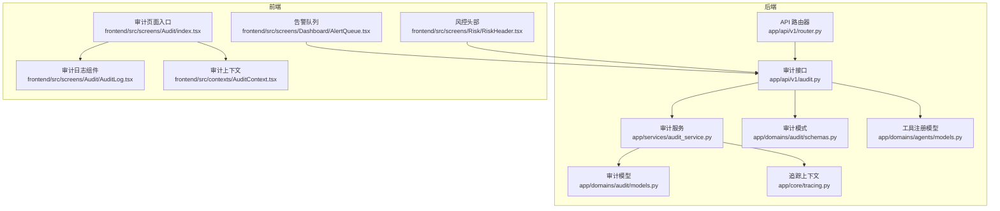
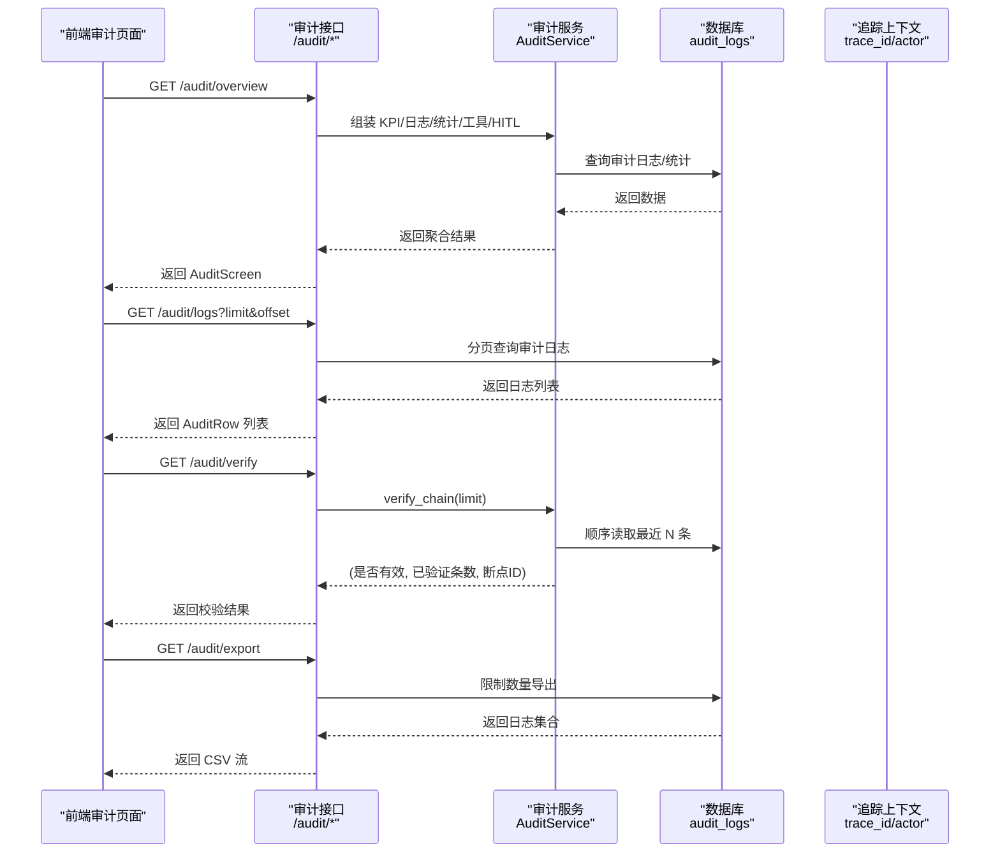
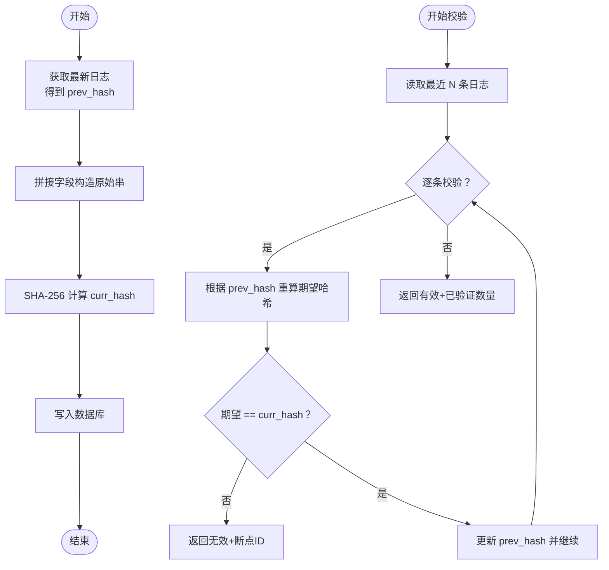
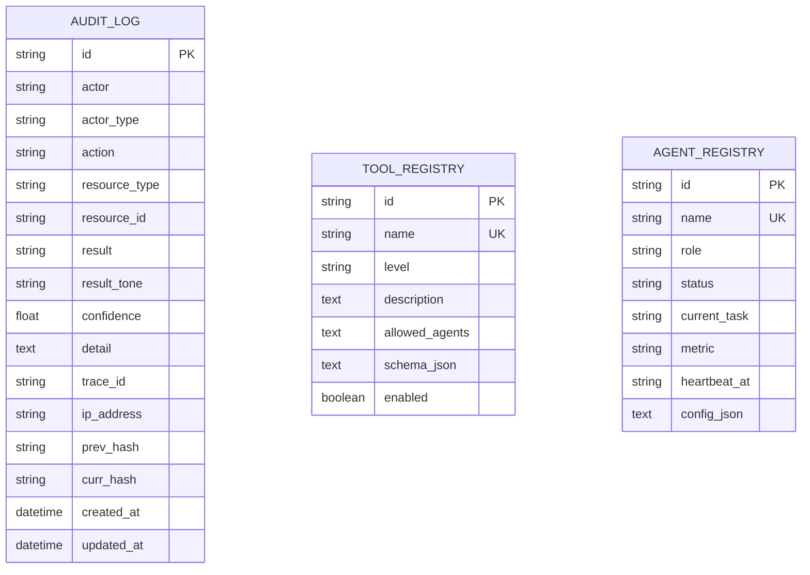
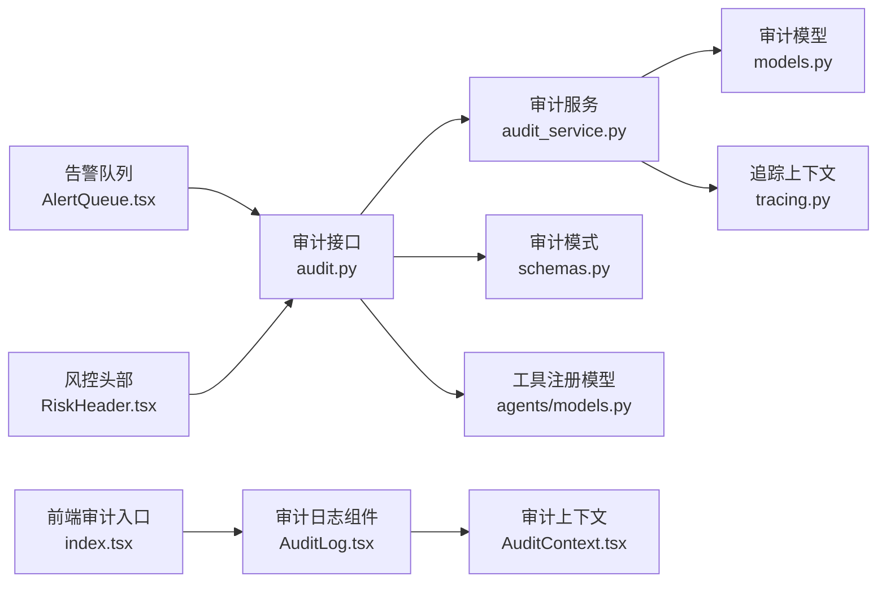

# 审计合规 API

<cite>
**本文引用的文件**
- [backend/app/api/v1/audit.py](file://backend/app/api/v1/audit.py)
- [backend/app/api/v1/router.py](file://backend/app/api/v1/router.py)
- [backend/app/services/audit_service.py](file://backend/app/services/audit_service.py)
- [backend/app/domains/audit/models.py](file://backend/app/domains/audit/models.py)
- [backend/app/domains/audit/schemas.py](file://backend/app/domains/audit/schemas.py)
- [backend/app/domains/agents/models.py](file://backend/app/domains/agents/models.py)
- [backend/app/domains/agents/schemas.py](file://backend/app/domains/agents/schemas.py)
- [backend/app/core/tracing.py](file://backend/app/core/tracing.py)
- [backend/app/db/migrations/versions/20260510_000001_init_identity_and_audit.py](file://backend/app/db/migrations/versions/20260510_000001_init_identity_and_audit.py)
- [backend/app/db/migrations/versions/20260513_000001_execution_risk_portfolio.py](file://backend/app/db/migrations/versions/20260513_000001_execution_risk_portfolio.py)
- [frontend/src/screens/Audit/index.tsx](file://frontend/src/screens/Audit/index.tsx)
- [frontend/src/screens/Audit/AuditLog.tsx](file://frontend/src/screens/Audit/AuditLog.tsx)
- [frontend/src/contexts/AuditContext.tsx](file://frontend/src/contexts/AuditContext.tsx)
- [frontend/src/screens/Dashboard/AlertQueue.tsx](file://frontend/src/screens/Dashboard/AlertQueue.tsx)
- [frontend/src/screens/Risk/RiskHeader.tsx](file://frontend/src/screens/Risk/RiskHeader.tsx)
- [backend/app/api/v1/risk.py](file://backend/app/api/v1/risk.py)
</cite>

## 目录
1. [简介](#简介)
2. [项目结构](#项目结构)
3. [核心组件](#核心组件)
4. [架构总览](#架构总览)
5. [详细组件分析](#详细组件分析)
6. [依赖分析](#依赖分析)
7. [性能考虑](#性能考虑)
8. [故障排查指南](#故障排查指南)
9. [结论](#结论)
10. [附录](#附录)

## 简介
本文件面向开发者，系统化梳理“审计合规 API”的设计与实现，覆盖以下能力：
- 操作日志记录：不可篡改的审计轨迹（追加式日志、哈希链）
- 合规检查：基于规则的自动化检查与告警联动
- 报告生成：导出 CSV、仪表板聚合视图
- 监控告警：与风控、策略审批等模块联动
- 审计证据管理：以 trace_id 关联跨服务调用，支持证据链追踪
- 合规规则配置：工具注册表、人工介入（HITL）规则
- 风险评估与监管报告：结合风控指标与合规状态

该系统采用前后端分离架构，后端基于 FastAPI 提供 RESTful 接口，前端通过上下文与组件化展示审计与合规视图。

## 项目结构
后端 API 路由统一挂载于 v1 根路由，审计相关接口位于 /audit 前缀下；审计数据模型与模式定义位于 domains/audit；服务层负责日志写入与哈希链校验；前端通过上下文提供审计视图的数据来源。

图表来源
- [backend/app/api/v1/router.py:25-39](file://backend/app/api/v1/router.py#L25-L39)
- [backend/app/api/v1/audit.py:26-258](file://backend/app/api/v1/audit.py#L26-L258)
- [backend/app/services/audit_service.py:32-109](file://backend/app/services/audit_service.py#L32-L109)
- [backend/app/domains/audit/models.py:9-51](file://backend/app/domains/audit/models.py#L9-L51)
- [backend/app/domains/audit/schemas.py:6-53](file://backend/app/domains/audit/schemas.py#L6-L53)
- [backend/app/domains/agents/models.py:51-62](file://backend/app/domains/agents/models.py#L51-L62)
- [backend/app/core/tracing.py:13-87](file://backend/app/core/tracing.py#L13-L87)
- [frontend/src/screens/Audit/index.tsx:16-42](file://frontend/src/screens/Audit/index.tsx#L16-L42)
- [frontend/src/screens/Audit/AuditLog.tsx:19-99](file://frontend/src/screens/Audit/AuditLog.tsx#L19-L99)
- [frontend/src/contexts/AuditContext.tsx:1-13](file://frontend/src/contexts/AuditContext.tsx#L1-L13)
- [frontend/src/screens/Dashboard/AlertQueue.tsx:16-27](file://frontend/src/screens/Dashboard/AlertQueue.tsx#L16-L27)
- [frontend/src/screens/Risk/RiskHeader.tsx:1-17](file://frontend/src/screens/Risk/RiskHeader.tsx#L1-L17)

章节来源
- [backend/app/api/v1/router.py:25-39](file://backend/app/api/v1/router.py#L25-L39)
- [backend/app/api/v1/audit.py:26-258](file://backend/app/api/v1/audit.py#L26-L258)

## 核心组件
- 审计接口层：提供概览、日志列表、统计、哈希链校验、导出、工具注册表、HITL 规则等接口。
- 审计服务层：封装不可篡改日志写入与哈希链校验，确保审计证据链完整。
- 数据模型与模式：定义审计日志字段、工具注册表、前端展示模式。
- 追踪上下文：为每次请求注入 trace_id，并在审计日志中关联跨服务调用。
- 前端审计视图：聚合展示 KPI、日志、角色统计、工具与规则。

章节来源
- [backend/app/api/v1/audit.py:153-258](file://backend/app/api/v1/audit.py#L153-L258)
- [backend/app/services/audit_service.py:32-109](file://backend/app/services/audit_service.py#L32-L109)
- [backend/app/domains/audit/models.py:9-51](file://backend/app/domains/audit/models.py#L9-L51)
- [backend/app/domains/audit/schemas.py:6-53](file://backend/app/domains/audit/schemas.py#L6-L53)
- [backend/app/core/tracing.py:13-87](file://backend/app/core/tracing.py#L13-L87)
- [frontend/src/screens/Audit/index.tsx:16-42](file://frontend/src/screens/Audit/index.tsx#L16-L42)

## 架构总览
审计合规 API 的整体流程如下：
- 请求进入后端，中间件注入 trace_id 与 actor 信息
- 业务操作完成后，调用审计服务写入不可篡改日志
- 前端通过 /audit 接口拉取概览与日志，进行可视化展示
- 与风控、审批等模块联动，触发告警与人工介入

图表来源
- [backend/app/api/v1/audit.py:153-258](file://backend/app/api/v1/audit.py#L153-L258)
- [backend/app/services/audit_service.py:83-109](file://backend/app/services/audit_service.py#L83-L109)
- [backend/app/core/tracing.py:49-87](file://backend/app/core/tracing.py#L49-L87)

## 详细组件分析

### 审计接口层（/audit）
- 概览接口：返回 KPI、最新日志、角色统计、工具注册表、HITL 规则
- 日志列表：支持按 actor_type、action 过滤，分页返回
- 角色统计：按 actor 出现频次排序
- 哈希链校验：对最近 N 条日志进行完整性校验
- 导出接口：CSV 下载审计日志
- 工具注册表：返回启用的工具及其风险等级与允许的 Agent
- HITL 规则：内置策略，如审批、提醒、自动暂停等

章节来源
- [backend/app/api/v1/audit.py:153-258](file://backend/app/api/v1/audit.py#L153-L258)

### 审计服务层（AuditService）
- 写入流程：获取上一条日志的 curr_hash 作为 prev_hash，计算新条目的 curr_hash，持久化后返回
- 校验流程：按时间顺序读取最近 N 条，逐条重算哈希并与 curr_hash 对比，返回是否有效、验证数量与首个断点 ID

图表来源
- [backend/app/services/audit_service.py:18-82](file://backend/app/services/audit_service.py#L18-L82)
- [backend/app/services/audit_service.py:83-109](file://backend/app/services/audit_service.py#L83-L109)

章节来源
- [backend/app/services/audit_service.py:32-109](file://backend/app/services/audit_service.py#L32-L109)

### 数据模型与模式
- 审计日志模型：包含 actor、actor_type、action、resource_type、resource_id、result、result_tone、confidence、detail、trace_id、ip_address、prev_hash、curr_hash 等字段
- 工具注册表模型：名称、风险等级、描述、允许的 Agent 列表、启用状态等
- 前端模式：AuditScreen、AuditRow、ActorStat、ToolRegistryItem、HitlRule、AuditKpi 等

图表来源
- [backend/app/domains/audit/models.py:9-51](file://backend/app/domains/audit/models.py#L9-L51)
- [backend/app/domains/agents/models.py:9-62](file://backend/app/domains/agents/models.py#L9-L62)

章节来源
- [backend/app/domains/audit/models.py:9-51](file://backend/app/domains/audit/models.py#L9-L51)
- [backend/app/domains/audit/schemas.py:6-53](file://backend/app/domains/audit/schemas.py#L6-L53)
- [backend/app/domains/agents/models.py:51-62](file://backend/app/domains/agents/models.py#L51-L62)

### 追踪上下文与审计证据链
- 中间件在请求进入时生成或提取 trace_id，并注入响应头
- 审计日志写入时携带 trace_id，便于跨服务调用与证据链追踪
- 前端审计日志展示 trace_id 字段，支持用户定位具体请求链路

章节来源
- [backend/app/core/tracing.py:49-87](file://backend/app/core/tracing.py#L49-L87)
- [backend/app/services/audit_service.py:60-81](file://backend/app/services/audit_service.py#L60-L81)
- [frontend/src/screens/Audit/AuditLog.tsx:68-92](file://frontend/src/screens/Audit/AuditLog.tsx#L68-L92)

### 前端审计视图与联动
- 审计页面入口：加载 /audit/overview，提供上下文给子组件
- 审计日志组件：支持按 actor 类型过滤、展示结果色调、置信度分级
- 告警队列：与审批、风险、系统类告警联动，体现合规状态
- 风控头部：展示健康评分、待审批、活跃违规等指标，与审计数据互补

章节来源
- [frontend/src/screens/Audit/index.tsx:16-42](file://frontend/src/screens/Audit/index.tsx#L16-L42)
- [frontend/src/screens/Audit/AuditLog.tsx:19-99](file://frontend/src/screens/Audit/AuditLog.tsx#L19-L99)
- [frontend/src/contexts/AuditContext.tsx:1-13](file://frontend/src/contexts/AuditContext.tsx#L1-L13)
- [frontend/src/screens/Dashboard/AlertQueue.tsx:16-27](file://frontend/src/screens/Dashboard/AlertQueue.tsx#L16-L27)
- [frontend/src/screens/Risk/RiskHeader.tsx:1-17](file://frontend/src/screens/Risk/RiskHeader.tsx#L1-L17)

## 依赖分析
- 审计接口依赖审计服务与数据库模型，同时依赖追踪上下文以保证 trace_id 一致性
- 工具注册表与审计日志存在耦合：工具风险等级与审计结果色调用于前端展示
- 前端审计视图依赖后端接口返回的聚合数据，与风控、审批等模块通过告警联动

图表来源
- [backend/app/api/v1/audit.py:26-258](file://backend/app/api/v1/audit.py#L26-L258)
- [backend/app/services/audit_service.py:32-109](file://backend/app/services/audit_service.py#L32-L109)
- [backend/app/domains/audit/models.py:9-51](file://backend/app/domains/audit/models.py#L9-L51)
- [backend/app/domains/audit/schemas.py:6-53](file://backend/app/domains/audit/schemas.py#L6-L53)
- [backend/app/domains/agents/models.py:51-62](file://backend/app/domains/agents/models.py#L51-L62)
- [backend/app/core/tracing.py:13-87](file://backend/app/core/tracing.py#L13-L87)
- [frontend/src/screens/Audit/index.tsx:16-42](file://frontend/src/screens/Audit/index.tsx#L16-L42)
- [frontend/src/screens/Audit/AuditLog.tsx:19-99](file://frontend/src/screens/Audit/AuditLog.tsx#L19-L99)
- [frontend/src/contexts/AuditContext.tsx:1-13](file://frontend/src/contexts/AuditContext.tsx#L1-L13)
- [frontend/src/screens/Dashboard/AlertQueue.tsx:16-27](file://frontend/src/screens/Dashboard/AlertQueue.tsx#L16-L27)
- [frontend/src/screens/Risk/RiskHeader.tsx:1-17](file://frontend/src/screens/Risk/RiskHeader.tsx#L1-L17)

章节来源
- [backend/app/api/v1/audit.py:26-258](file://backend/app/api/v1/audit.py#L26-L258)
- [backend/app/services/audit_service.py:32-109](file://backend/app/services/audit_service.py#L32-L109)

## 性能考虑
- 分页与索引：日志查询使用 created_at 降序与 limit/offset，建议在 resource_type、resource_id、actor 等常用过滤字段建立索引
- 导出限制：导出接口限制最大条数，避免大体量 CSV 导出导致内存压力
- 哈希链校验：默认校验最近 N 条，建议按需调整 N，避免全量扫描
- 前端渲染：日志表格按 actor 类型过滤，建议在大数据量场景下增加虚拟滚动或服务端分页

## 故障排查指南
- 哈希链校验失败：接口返回 brokenEntryId，前端可据此定位断点；服务端会返回已验证条数与状态
- 缺失 curr_hash：历史遗留条目可能未计算哈希，服务端会跳过这些条目进行校验
- 导出为空：检查 actor_type 过滤条件与 limit 设置
- trace_id 不一致：确认中间件是否正确注入 X-Trace-ID 响应头，以及前端是否正确展示

章节来源
- [backend/app/api/v1/audit.py:198-213](file://backend/app/api/v1/audit.py#L198-L213)
- [backend/app/services/audit_service.py:97-108](file://backend/app/services/audit_service.py#L97-L108)

## 结论
该审计合规 API 通过不可篡改的日志与哈希链、完善的前端视图与规则配置，实现了从操作日志到合规报告的闭环。结合风控与审批模块，能够支撑自动化合规检查、异常检测与审计证据管理，满足监管与内控要求。

## 附录

### API 定义与参数
- 获取审计概览
  - 方法：GET
  - 路径：/audit/overview
  - 响应：AuditScreen
- 分页列出审计日志
  - 方法：GET
  - 路径：/audit/logs
  - 查询参数：actor_type、action、limit、offset
  - 响应：AuditRow 数组
- 获取角色统计
  - 方法：GET
  - 路径：/audit/actor-stats
  - 查询参数：limit
  - 响应：ActorStat 数组
- 哈希链校验
  - 方法：GET
  - 路径：/audit/verify
  - 查询参数：limit
  - 响应：校验结果对象（valid、verifiedCount、brokenEntryId、status、statusTone）
- 导出审计日志
  - 方法：GET
  - 路径：/audit/export
  - 查询参数：actor_type、limit
  - 响应：CSV 流
- 获取工具注册表
  - 方法：GET
  - 路径：/audit/registry
  - 响应：ToolRegistryItem 数组
- 获取 HITL 规则
  - 方法：GET
  - 路径：/audit/hitl-rules
  - 响应：HitlRule 数组

章节来源
- [backend/app/api/v1/audit.py:153-258](file://backend/app/api/v1/audit.py#L153-L258)

### 数据模型与字段说明
- 审计日志字段
  - actor、actor_type、action、resource_type、resource_id、result、result_tone、confidence、detail、trace_id、ip_address、prev_hash、curr_hash
- 工具注册表字段
  - name、level、description、allowed_agents、schema_json、enabled

章节来源
- [backend/app/domains/audit/models.py:9-51](file://backend/app/domains/audit/models.py#L9-L51)
- [backend/app/domains/agents/models.py:51-62](file://backend/app/domains/agents/models.py#L51-L62)

### 前端展示与交互
- 审计页面入口：加载概览数据，提供上下文
- 审计日志组件：支持 actor 类型过滤、结果色调、置信度分级
- 告警队列：与审批、风险、系统类告警联动
- 风控头部：展示健康评分、待审批、活跃违规等指标

章节来源
- [frontend/src/screens/Audit/index.tsx:16-42](file://frontend/src/screens/Audit/index.tsx#L16-L42)
- [frontend/src/screens/Audit/AuditLog.tsx:19-99](file://frontend/src/screens/Audit/AuditLog.tsx#L19-L99)
- [frontend/src/contexts/AuditContext.tsx:1-13](file://frontend/src/contexts/AuditContext.tsx#L1-L13)
- [frontend/src/screens/Dashboard/AlertQueue.tsx:16-27](file://frontend/src/screens/Dashboard/AlertQueue.tsx#L16-L27)
- [frontend/src/screens/Risk/RiskHeader.tsx:1-17](file://frontend/src/screens/Risk/RiskHeader.tsx#L1-L17)