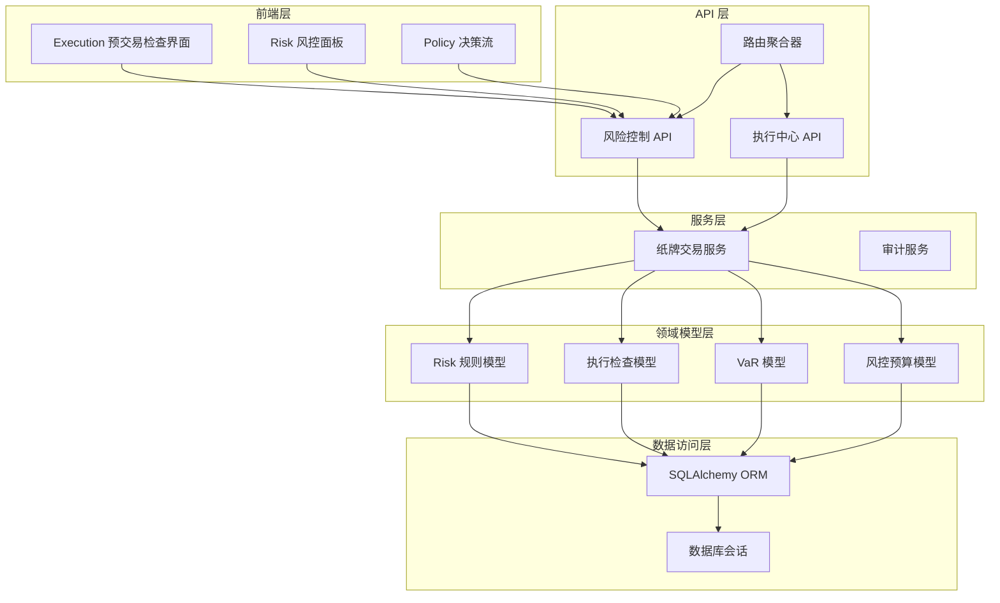
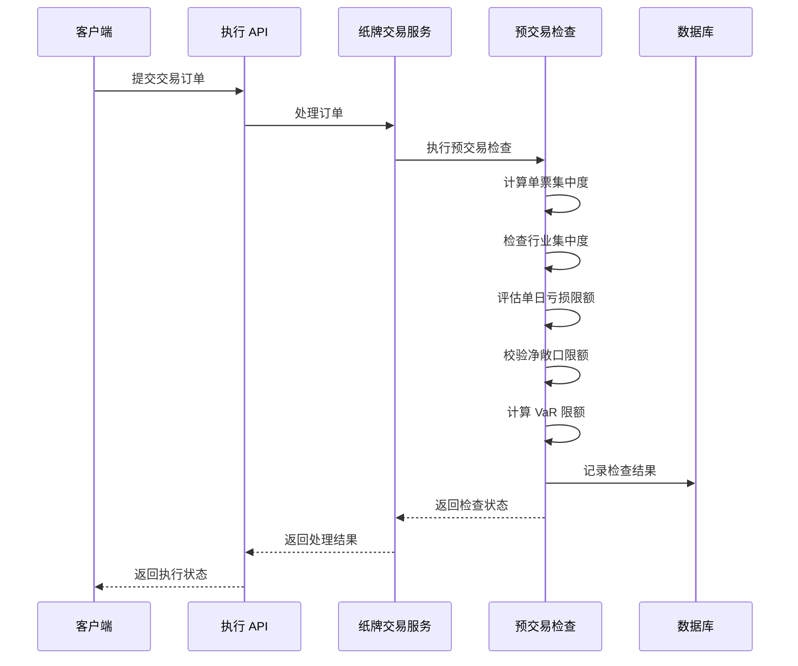
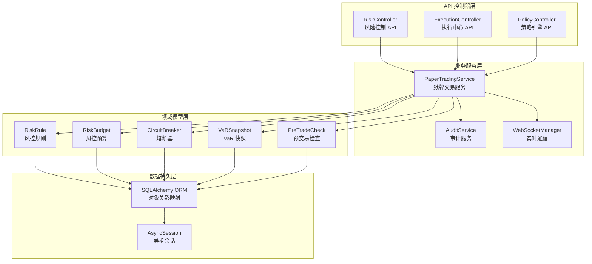
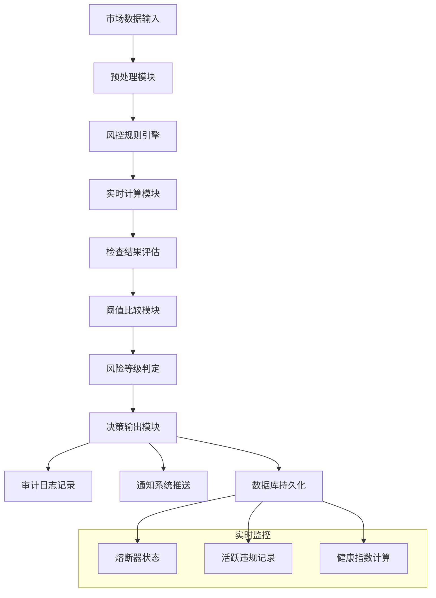
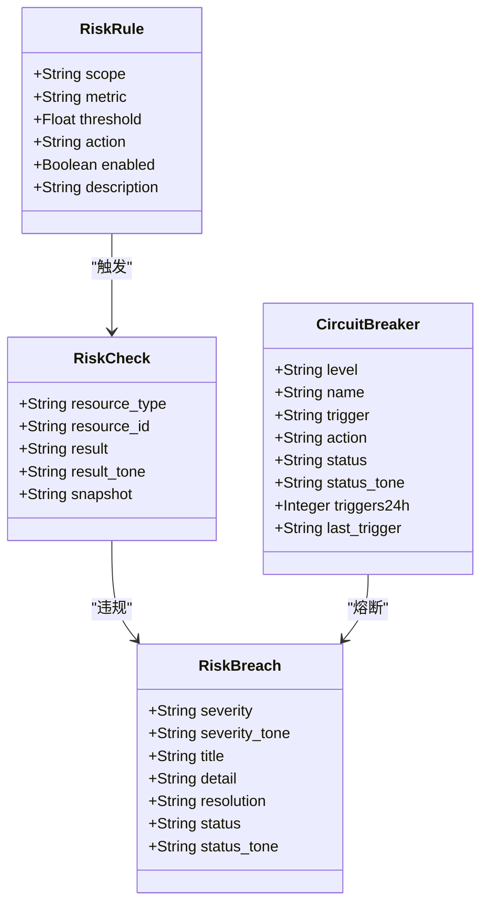
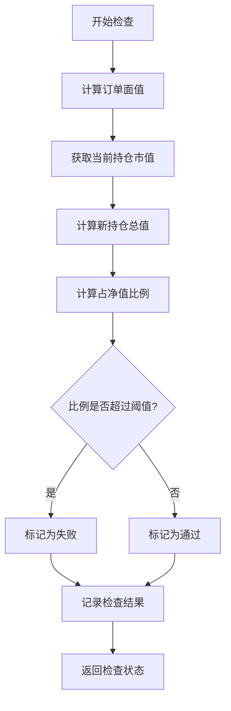
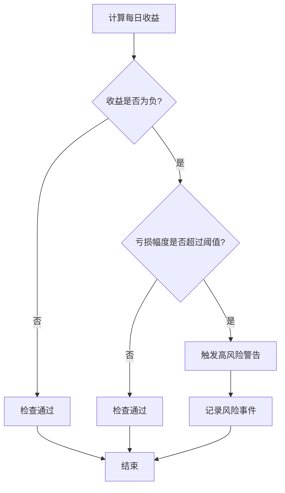
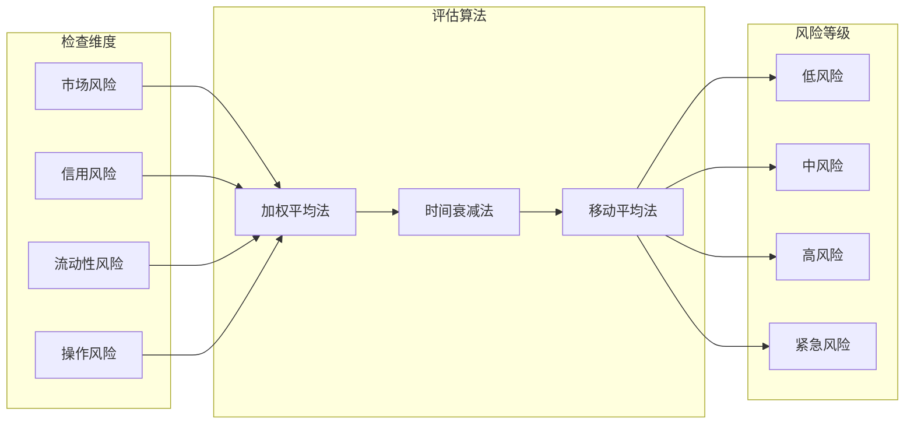
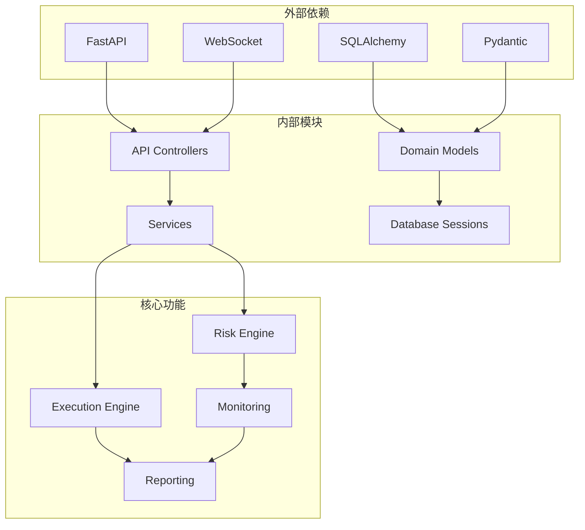
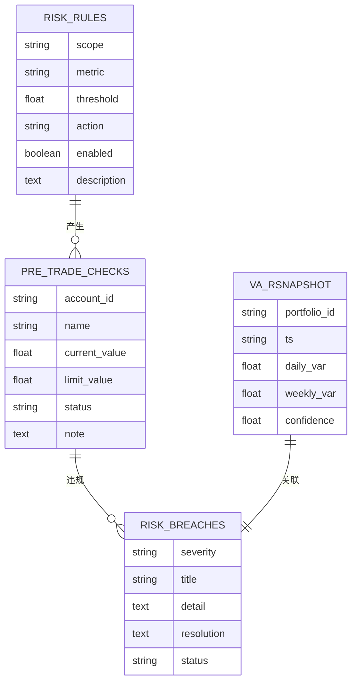

# 事前风控检查 API

<cite>
**本文档引用的文件**
- [backend/app/api/v1/risk.py](file://backend/app/api/v1/risk.py)
- [backend/app/api/v1/execution.py](file://backend/app/api/v1/execution.py)
- [backend/app/domains/risk/models.py](file://backend/app/domains/risk/models.py)
- [backend/app/domains/risk/schemas.py](file://backend/app/domains/risk/schemas.py)
- [backend/app/domains/execution/models.py](file://backend/app/domains/execution/models.py)
- [backend/app/api/v1/router.py](file://backend/app/api/v1/router.py)
- [backend/app/services/paper_trading.py](file://backend/app/services/paper_trading.py)
- [frontend/src/screens/Execution/PreTradeChecks.tsx](file://frontend/src/screens/Execution/PreTradeChecks.tsx)
- [frontend/src/screens/Risk/PolicyStream.tsx](file://frontend/src/screens/Risk/PolicyStream.tsx)
- [backend/app/db/migrations/versions/20260513_000001_execution_risk_portfolio.py](file://backend/app/db/migrations/versions/20260513_000001_execution_risk_portfolio.py)
- [backend/app/db/migrations/versions/49c0724c647e_paper_trading_tables.py](file://backend/app/db/migrations/versions/49c0724c647e_paper_trading_tables.py)
</cite>

## 目录
1. [简介](#简介)
2. [项目结构](#项目结构)
3. [核心组件](#核心组件)
4. [架构概览](#架构概览)
5. [详细组件分析](#详细组件分析)
6. [依赖关系分析](#依赖关系分析)
7. [性能考虑](#性能考虑)
8. [故障排除指南](#故障排除指南)
9. [结论](#结论)

## 简介

本文档详细解析了量化交易系统中的事前风控检查 API，这是一个关键的风险控制组件，负责在交易执行前对投资组合进行实时风险评估。该系统实现了完整的风控检查规则引擎，包括风控规则配置、检查项定义和检查结果评估。

系统支持多种风控检查项目，包括单票集中度、行业集中度、单日亏损限额、净敞口限额、VaR 限额等，并提供了实时评估、动态调整和检查报告生成功能。同时，系统还实现了风控规则的优先级管理、检查权重计算和风险等级评估机制。

## 项目结构

系统采用分层架构设计，主要包含以下核心模块：



**图表来源**
- [backend/app/api/v1/router.py:31](file://backend/app/api/v1/router.py#L31)
- [backend/app/api/v1/risk.py:28](file://backend/app/api/v1/risk.py#L28)
- [backend/app/api/v1/execution.py:27](file://backend/app/api/v1/execution.py#L27)

**章节来源**
- [backend/app/api/v1/router.py:1-40](file://backend/app/api/v1/router.py#L1-L40)
- [backend/app/api/v1/risk.py:1-273](file://backend/app/api/v1/risk.py#L1-L273)
- [backend/app/api/v1/execution.py:1-281](file://backend/app/api/v1/execution.py#L1-L281)

## 核心组件

### 风控规则引擎

系统实现了可配置的风控规则引擎，支持多种风控检查类型和动作级别：

| 风控类型 | 描述 | 阈值类型 | 动作级别 |
|---------|------|----------|----------|
| 单票集中度 | 个股持仓占总净值比例 | 百分比阈值 | 警告/阻断/紧急停止 |
| 行业集中度 | 行业持仓占总净值比例 | 百分比阈值 | 警告/阻断/紧急停止 |
| 单日亏损限额 | 当日最大亏损比例 | 百分比阈值 | 警告/阻断/紧急停止 |
| 净敞口限额 | 净多头/空头敞口比例 | 百分比阈值 | 警告/阻断/紧急停止 |
| VaR 限额 | 日风险价值限额 | 金额/百分比阈值 | 警告/阻断/紧急停止 |

### 预交易检查系统

预交易检查系统在订单执行前进行实时风险评估，确保交易符合所有风控要求：



**图表来源**
- [backend/app/services/paper_trading.py:314](file://backend/app/services/paper_trading.py#L314)
- [backend/app/api/v1/execution.py:188](file://backend/app/api/v1/execution.py#L188)

### 风控检查结果评估

系统提供多层次的风险评估机制，包括：

- **实时评估**：基于当前市场数据和持仓情况的即时计算
- **动态调整**：根据市场波动性和风险状况自动调整阈值
- **风险等级**：从低风险到高风险的分级评估
- **检查权重**：不同检查项目的权重分配和综合评分

**章节来源**
- [backend/app/services/paper_trading.py:314-372](file://backend/app/services/paper_trading.py#L314-L372)
- [backend/app/domains/risk/models.py:9-20](file://backend/app/domains/risk/models.py#L9-L20)

## 架构概览

系统采用模块化设计，各组件职责清晰分离：



**图表来源**
- [backend/app/api/v1/risk.py:28](file://backend/app/api/v1/risk.py#L28)
- [backend/app/api/v1/execution.py:27](file://backend/app/api/v1/execution.py#L27)
- [backend/app/domains/risk/models.py:1-101](file://backend/app/domains/risk/models.py#L1-L101)

### 数据流架构



**图表来源**
- [backend/app/api/v1/risk.py:39](file://backend/app/api/v1/risk.py#L39)
- [backend/app/services/paper_trading.py:536](file://backend/app/services/paper_trading.py#L536)

## 详细组件分析

### 风控规则配置系统

风控规则配置系统提供了灵活的规则管理机制：



**图表来源**
- [backend/app/domains/risk/models.py:9](file://backend/app/domains/risk/models.py#L9)
- [backend/app/domains/risk/models.py:22](file://backend/app/domains/risk/models.py#L22)
- [backend/app/domains/risk/models.py:60](file://backend/app/domains/risk/models.py#L60)
- [backend/app/domains/risk/models.py:75](file://backend/app/domains/risk/models.py#L75)

#### 风控规则配置参数

| 参数名称 | 类型 | 描述 | 默认值 |
|---------|------|------|--------|
| scope | String | 作用范围 | account/portfolio/strategy/order |
| metric | String | 风控指标 | max_drawdown/daily_loss/position_limit/var |
| threshold | Float | 阈值 | - |
| action | String | 处理动作 | alert/block/kill_switch |
| enabled | Boolean | 是否启用 | true |
| description | String | 规则描述 | null |

### 预交易检查项目详解

#### 单票集中度检查

单票集中度检查确保单个证券的持仓不超过设定的上限：



**图表来源**
- [backend/app/services/paper_trading.py:323](file://backend/app/services/paper_trading.py#L323)

#### 行业集中度检查

行业集中度检查监控特定行业的整体风险暴露：

| 检查项目 | 当前值 | 阈值 | 状态 | 说明 |
|---------|--------|------|------|------|
| 单票集中上限 | 8.5% | 10.0% | 通过 | 个股权重 8.5%，低于 10% 上限 |
| 行业集中上限 | 22.0% | 30.0% | 通过 | 新能源行业 22%，低于 30% 上限 |
| 单日亏损限额 | 3.2% | 5.0% | 通过 | 当日已实现+浮亏 3.2%，低于 5% 限额 |
| 净敞口限额 | 65.0% | 80.0% | 通过 | 净多头 65%，低于 80% 上限 |
| VaR 限额 | 1.28% | 2.00% | 通过 | 日 VaR 1.28%，低于 2% 限额 |

#### 单日亏损限额检查

单日亏损限额检查防止重大损失发生：



**图表来源**
- [backend/app/services/paper_trading.py:544](file://backend/app/services/paper_trading.py#L544)

### 风控检查结果评估机制

系统采用多维度评估机制：



**图表来源**
- [backend/app/api/v1/risk.py:39](file://backend/app/api/v1/risk.py#L39)

#### 风险等级计算公式

系统使用综合评分机制计算风险等级：

```
健康指数 = 100 - (活跃违规数 × 10) - (自动阻断数 × 2)
风险等级 = 
    IF 健康指数 ≥ 90: 低风险
    IF 健康指数 ≥ 70: 中风险  
    IF 健康指数 ≥ 50: 高风险
    ELSE: 紧急风险
```

### 实时监控和告警系统

系统提供实时监控功能，包括：

- **熔断器监控**：L1-L4 级别的熔断器状态跟踪
- **违规事件监控**：活跃违规事件的实时追踪
- **健康指数监控**：系统整体健康状况的动态评估
- **决策流监控**：策略引擎的实时决策过程

**章节来源**
- [backend/app/api/v1/risk.py:210](file://backend/app/api/v1/risk.py#L210)
- [backend/app/api/v1/risk.py:242](file://backend/app/api/v1/risk.py#L242)

## 依赖关系分析

系统采用松耦合的设计模式，各组件间依赖关系清晰：



**图表来源**
- [backend/app/api/v1/risk.py:5](file://backend/app/api/v1/risk.py#L5)
- [backend/app/domains/risk/models.py:3](file://backend/app/domains/risk/models.py#L3)

### 数据模型依赖关系



**图表来源**
- [backend/app/domains/risk/models.py:9](file://backend/app/domains/risk/models.py#L9)
- [backend/app/domains/execution/models.py:80](file://backend/app/domains/execution/models.py#L80)

**章节来源**
- [backend/app/api/v1/risk.py:1-273](file://backend/app/api/v1/risk.py#L1-L273)
- [backend/app/domains/risk/models.py:1-101](file://backend/app/domains/risk/models.py#L1-L101)

## 性能考虑

### 查询优化策略

系统采用多种查询优化技术：

- **索引优化**：在常用查询字段上建立索引
- **批量查询**：减少数据库往返次数
- **缓存策略**：热点数据的内存缓存
- **异步处理**：非阻塞的异步数据库操作

### 内存管理

- **连接池管理**：数据库连接的高效复用
- **对象生命周期**：及时释放不再使用的对象
- **批量操作**：大量数据处理时的分批处理

### 并发处理

系统支持高并发场景：

- **异步 API**：非阻塞的请求处理
- **任务队列**：后台任务的异步执行
- **锁机制**：关键资源的并发控制

## 故障排除指南

### 常见问题诊断

#### 预交易检查失败

**症状**：订单被拒绝，显示风控拦截

**可能原因**：
1. 单票集中度超过阈值
2. 资金不足
3. 行业集中度过高
4. VaR 限额超限

**解决步骤**：
1. 检查预交易检查结果
2. 调整订单规模或价格
3. 增加资金或降低仓位
4. 重新评估风险参数

#### 熔断器触发

**症状**：系统进入熔断状态

**诊断方法**：
1. 检查熔断器状态
2. 查看违规事件记录
3. 评估市场异常情况

**恢复步骤**：
1. 等待冷却期结束
2. 人工确认系统状态
3. 手动解除熔断器

### 性能监控指标

| 指标名称 | 正常范围 | 警告阈值 | 异常阈值 |
|---------|----------|----------|----------|
| 响应时间(ms) | < 100 | 100-500 | > 500 |
| 错误率 | < 1% | 1%-5% | > 5% |
| 并发用户数 | 无限制 | 1000+ | 5000+ |
| 数据库连接数 | < 50 | 50-100 | > 100 |

**章节来源**
- [backend/app/api/v1/risk.py:210](file://backend/app/api/v1/risk.py#L210)
- [backend/app/services/paper_trading.py:354](file://backend/app/services/paper_trading.py#L354)

## 结论

事前风控检查 API 是量化交易系统的核心安全组件，通过以下关键特性确保交易安全：

### 主要优势

1. **全面的风险覆盖**：支持多种风控检查类型，涵盖市场、信用、流动性等各类风险
2. **实时响应能力**：毫秒级的实时风险评估和决策
3. **灵活的配置机制**：可动态调整风控参数和阈值
4. **完善的监控体系**：全方位的实时监控和告警机制
5. **强大的扩展性**：模块化的架构设计支持功能扩展

### 技术特色

- **模块化设计**：清晰的职责分离和接口定义
- **异步处理**：高效的异步数据库操作和实时通信
- **数据驱动**：基于配置的数据驱动风控决策
- **可视化监控**：直观的前端界面展示风控状态

### 应用价值

该系统为量化交易提供了可靠的风险保障，通过智能化的风险评估和实时监控，有效降低了交易风险，提高了系统的稳定性和可靠性。同时，灵活的配置机制使得系统能够适应不同的投资策略和市场环境，为用户提供个性化的风险管理解决方案。