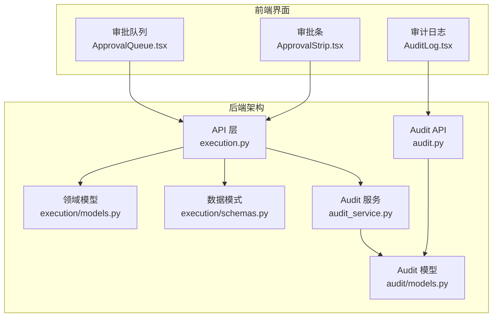
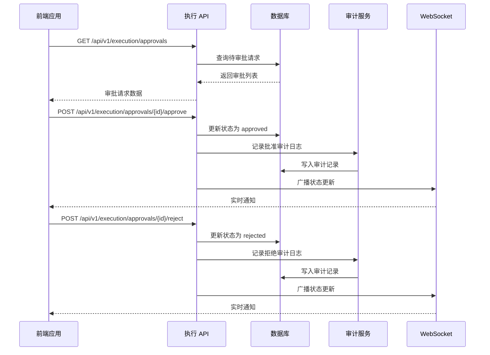
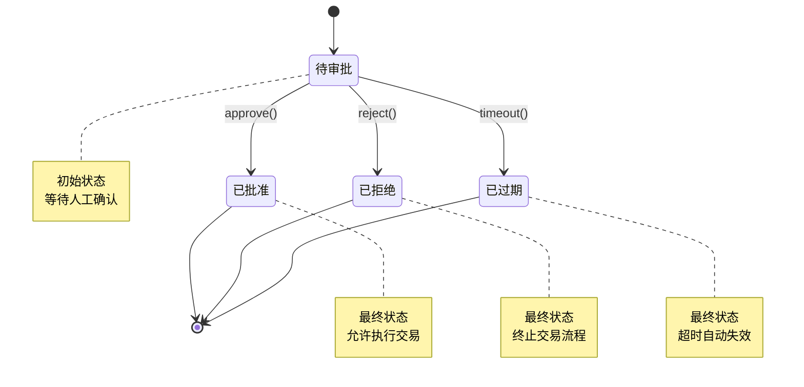
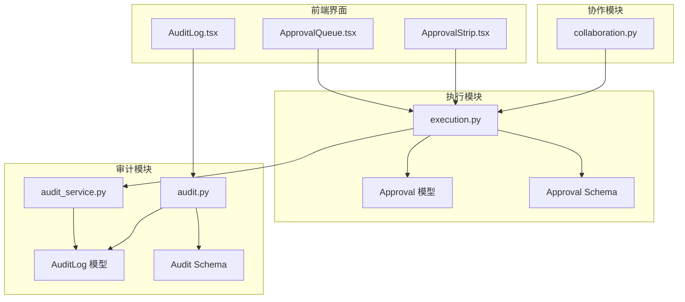

# 交易审批 API

<cite>
**本文档引用的文件**
- [backend/app/api/v1/execution.py](file://backend/app/api/v1/execution.py)
- [backend/app/domains/execution/models.py](file://backend/app/domains/execution/models.py)
- [backend/app/domains/execution/schemas.py](file://backend/app/domains/execution/schemas.py)
- [backend/app/services/audit_service.py](file://backend/app/services/audit_service.py)
- [backend/app/domains/audit/models.py](file://backend/app/domains/audit/models.py)
- [backend/app/domains/audit/schemas.py](file://backend/app/domains/audit/schemas.py)
- [backend/app/api/v1/audit.py](file://backend/app/api/v1/audit.py)
- [backend/app/api/v1/collaboration.py](file://backend/app/api/v1/collaboration.py)
- [frontend/src/screens/Execution/ApprovalQueue.tsx](file://frontend/src/screens/Execution/ApprovalQueue.tsx)
- [frontend/src/screens/Execution/ApprovalStrip.tsx](file://frontend/src/screens/Execution/ApprovalStrip.tsx)
- [frontend/src/screens/Audit/AuditLog.tsx](file://frontend/src/screens/Audit/AuditLog.tsx)
- [doc/ai_quant_trading.html](file://doc/ai_quant_trading.html)
</cite>

## 目录
1. [简介](#简介)
2. [项目结构](#项目结构)
3. [核心组件](#核心组件)
4. [架构概览](#架构概览)
5. [详细组件分析](#详细组件分析)
6. [依赖关系分析](#依赖关系分析)
7. [性能考虑](#性能考虑)
8. [故障排除指南](#故障排除指南)
9. [结论](#结论)
10. [附录](#附录)

## 简介
本文档全面阐述了交易审批 API 的设计与实现，涵盖审批流程的 RESTful 接口、状态机管理、权限控制、数据模型、规则引擎、历史追踪、配置管理、紧急程度分类以及时效管理。系统采用前后端分离架构，后端基于 FastAPI 和 SQLAlchemy，前端使用 React 构建用户界面，提供完整的审批工作流支持。

## 项目结构
交易审批功能分布在后端 API 层、领域模型层和前端界面层：

**图表来源**
- [backend/app/api/v1/execution.py:1-281](file://backend/app/api/v1/execution.py#L1-L281)
- [backend/app/domains/execution/models.py:1-103](file://backend/app/domains/execution/models.py#L1-L103)
- [backend/app/domains/execution/schemas.py:1-107](file://backend/app/domains/execution/schemas.py#L1-L107)

**章节来源**
- [backend/app/api/v1/execution.py:1-281](file://backend/app/api/v1/execution.py#L1-L281)
- [backend/app/domains/execution/models.py:1-103](file://backend/app/domains/execution/models.py#L1-L103)
- [backend/app/domains/execution/schemas.py:1-107](file://backend/app/domains/execution/schemas.py#L1-L107)

## 核心组件
交易审批系统由以下核心组件构成：

### 审批请求实体
审批请求是系统的核心业务对象，包含交易类型、数量、价格、风险等级等关键信息。

### 审批状态机
系统实现了完整的审批状态机，支持四种状态转换：
- pending（待审批）
- approved（已批准）
- rejected（已拒绝）
- expired（已过期）

### 审计追踪服务
提供不可篡改的审计日志记录，支持哈希链验证和导出功能。

**章节来源**
- [backend/app/domains/execution/models.py:9-32](file://backend/app/domains/execution/models.py#L9-L32)
- [backend/app/services/audit_service.py:32-109](file://backend/app/services/audit_service.py#L32-L109)

## 架构概览
系统采用分层架构设计，确保关注点分离和可维护性：

**图表来源**
- [backend/app/api/v1/execution.py:205-281](file://backend/app/api/v1/execution.py#L205-L281)
- [backend/app/services/audit_service.py:38-81](file://backend/app/services/audit_service.py#L38-L81)

## 详细组件分析

### 审批 API 接口设计
系统提供了完整的 RESTful 接口来管理审批流程：

#### 审批请求查询接口
- **GET /api/v1/execution/approvals**
  - 支持按状态过滤（pending、approved、rejected、expired）
  - 支持分页和数量限制
  - 返回标准化的审批请求数据模型

#### 审批操作接口
- **POST /api/v1/execution/approvals/{approval_id}/approve**
  - 批准指定的审批请求
  - 执行状态验证和幂等性检查
  - 记录审计日志并广播实时通知

- **POST /api/v1/execution/approvals/{approval_id}/reject**
  - 拒绝指定的审批请求
  - 执行相同的安全检查和审计流程

**章节来源**
- [backend/app/api/v1/execution.py:205-281](file://backend/app/api/v1/execution.py#L205-L281)

### 审批状态机实现
审批状态机采用有限状态自动机设计，确保状态转换的正确性和一致性：

**图表来源**
- [backend/app/domains/execution/models.py:30-31](file://backend/app/domains/execution/models.py#L30-L31)

### 数据模型设计
审批系统采用清晰的数据模型结构：

#### 审批请求模型（Approval）
| 字段名 | 类型 | 描述 | 约束 |
|--------|------|------|------|
| id | String(36) | 主键标识 | PK |
| portfolio_id | String(36) | 投资组合ID | FK, INDEX |
| strategy_id | String(36) | 策略ID | FK, INDEX |
| type | String(32) | 交易类型 | live/paper/reduce/add/rotate/hedge/pause |
| symbol | String(32) | 交易标的 | 必填 |
| name | String(128) | 标的名称 | 必填 |
| side | String(16) | 买卖方向 | BUY/SELL/PAUSE |
| qty | String(32) | 数量 | 必填 |
| notional | String(32) | 金额 | 必填 |
| notional_pct | Float | 金额占比 | 默认0.0 |
| limit_price | String(32) | 限价 | 可选 |
| stop_loss | String(32) | 止损 | 可选 |
| confidence | Float | 置信度 | 默认0.0 |
| risk_grade | String(16) | 风险等级 | 可选 |
| reason | Text | 交易原因 | 可选 |
| impact | Text | 预期影响 | 可选 |
| expire_sec | Integer | 过期秒数 | 默认300 |
| urgency | String(16) | 紧急程度 | high/medium/low |
| status | String(32) | 审批状态 | pending/approved/rejected/expired |

#### 审计日志模型（AuditLog）
| 字段名 | 类型 | 描述 | 约束 |
|--------|------|------|------|
| id | String(36) | 主键标识 | PK |
| actor | String(128) | 操作者 | 必填, INDEX |
| actor_type | String(32) | 操作者类型 | human/agent/system |
| action | String(128) | 操作动作 | 必填, INDEX |
| resource_type | String(64) | 资源类型 | 必填 |
| resource_id | String(36) | 资源ID | 可选, INDEX |
| result | String(32) | 操作结果 | 默认success |
| result_tone | String(16) | 结果色调 | 默认green |
| confidence | Float | 置信度 | 可选 |
| detail | Text | 详细描述 | 可选 |
| trace_id | String(64) | 链路ID | 必填, INDEX |
| prev_hash | String(128) | 前一哈希 | 可选 |
| curr_hash | String(128) | 当前哈希 | 可选 |

**章节来源**
- [backend/app/domains/execution/models.py:9-32](file://backend/app/domains/execution/models.py#L9-L32)
- [backend/app/domains/audit/models.py:9-27](file://backend/app/domains/audit/models.py#L9-L27)

### 审计追踪与安全
系统实现了企业级的审计追踪机制：

#### 哈希链验证
- 使用 SHA-256 算法确保日志完整性
- 每条日志记录包含前一哈希值
- 支持批量验证和断点检测

#### 实时通知机制
- 基于 WebSocket 的实时消息推送
- 支持审批状态变更的即时通知
- 提供订阅机制以减少不必要的通信

**章节来源**
- [backend/app/services/audit_service.py:18-109](file://backend/app/services/audit_service.py#L18-L109)
- [backend/app/api/v1/execution.py:245-249](file://backend/app/api/v1/execution.py#L245-L249)

### 紧急程度分类与时效管理
系统支持三级紧急程度管理和自动过期机制：

#### 紧急程度分类
- **high（高）**: 红色标识，优先处理
- **medium（中）**: 黄色标识，默认级别
- **low（低）**: 绿色标识，普通处理

#### 时效管理
- 默认过期时间为300秒（5分钟）
- 支持动态调整过期时间
- 自动清理过期审批请求

**章节来源**
- [backend/app/domains/execution/models.py:29-30](file://backend/app/domains/execution/models.py#L29-L30)
- [backend/app/api/v1/execution.py:30-34](file://backend/app/api/v1/execution.py#L30-L34)

### 前端集成与用户体验
前端提供了直观的审批界面：

#### 审批队列界面
- 实时显示待审批请求列表
- 支持快速批准和拒绝操作
- 提供交易详情和风险评估信息

#### 审计日志界面
- 展示完整的操作历史
- 支持按操作者、动作类型筛选
- 提供哈希链完整性验证功能

**章节来源**
- [frontend/src/screens/Execution/ApprovalQueue.tsx](file://frontend/src/screens/Execution/ApprovalQueue.tsx)
- [frontend/src/screens/Audit/AuditLog.tsx](file://frontend/src/screens/Audit/AuditLog.tsx)

## 依赖关系分析

**图表来源**
- [backend/app/api/v1/execution.py:10-25](file://backend/app/api/v1/execution.py#L10-L25)
- [backend/app/services/audit_service.py:13-15](file://backend/app/services/audit_service.py#L13-L15)

**章节来源**
- [backend/app/api/v1/execution.py:1-281](file://backend/app/api/v1/execution.py#L1-L281)
- [backend/app/services/audit_service.py:1-109](file://backend/app/services/audit_service.py#L1-L109)

## 性能考虑
系统在设计时充分考虑了性能优化：

### 数据库优化
- 审批请求和审计日志均建立了适当的索引
- 支持分页查询和数量限制
- 使用异步数据库连接提高并发性能

### 缓存策略
- 审计统计数据可缓存以减少数据库查询
- WebSocket 连接池优化实时通信
- 前端组件状态管理减少重复渲染

### 扩展性设计
- 模块化架构便于功能扩展
- 插件化的规则引擎支持动态配置
- 微服务化架构支持水平扩展

## 故障排除指南

### 常见问题诊断
1. **审批状态异常**
   - 检查数据库连接和事务处理
   - 验证状态转换逻辑的正确性
   - 查看审计日志确认操作历史

2. **实时通知失败**
   - 检查 WebSocket 服务器状态
   - 验证消息队列配置
   - 确认网络连接稳定性

3. **审计日志不完整**
   - 验证哈希链计算逻辑
   - 检查数据库写入权限
   - 确认时间同步机制

**章节来源**
- [backend/app/services/audit_service.py:83-109](file://backend/app/services/audit_service.py#L83-L109)
- [backend/app/api/v1/audit.py:198-212](file://backend/app/api/v1/audit.py#L198-L212)

## 结论
交易审批 API 提供了一个完整、安全、可扩展的审批管理系统。通过清晰的状态机设计、强大的审计追踪、灵活的紧急程度管理和实时通知机制，系统能够满足复杂的金融交易审批需求。模块化的架构设计和完善的错误处理机制确保了系统的稳定性和可靠性。

## 附录

### API 接口规范
- **基础路径**: `/api/v1/execution`
- **认证方式**: 基于令牌的身份验证
- **响应格式**: JSON
- **错误处理**: 标准 HTTP 状态码

### 配置选项
- 审批过期时间：默认300秒
- 最大返回记录数：默认50条
- 紧急程度阈值：可根据业务需求调整

### 监控指标
- 审批处理延迟
- 审批通过率
- 审计日志完整性
- WebSocket 连接状态