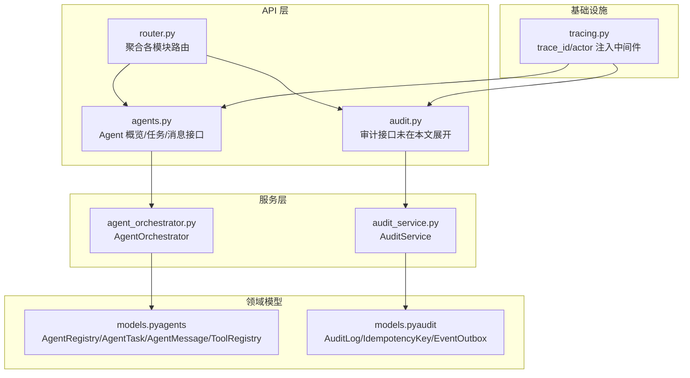
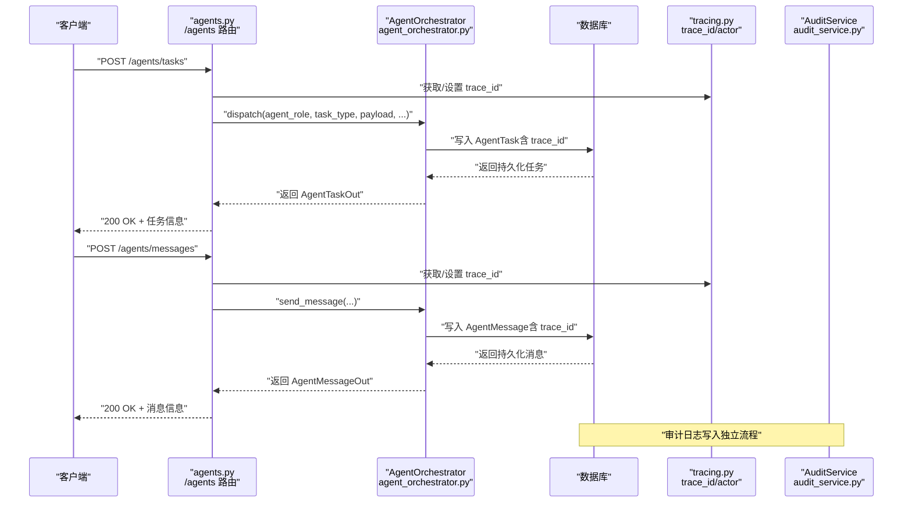
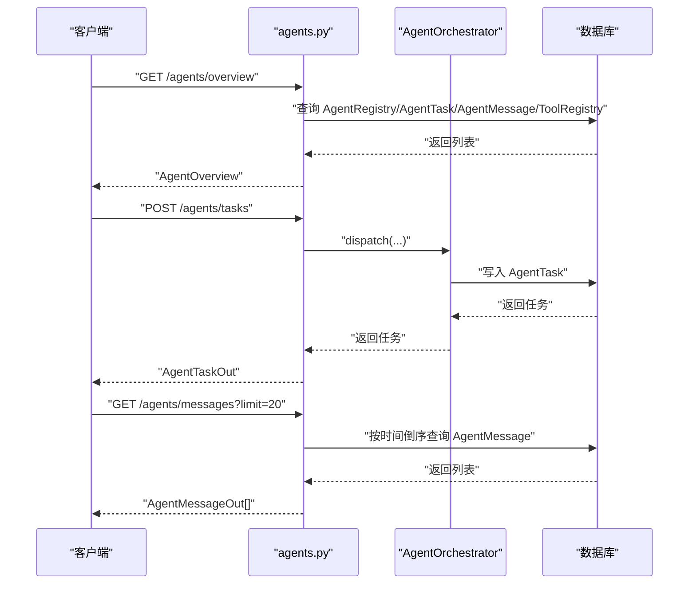
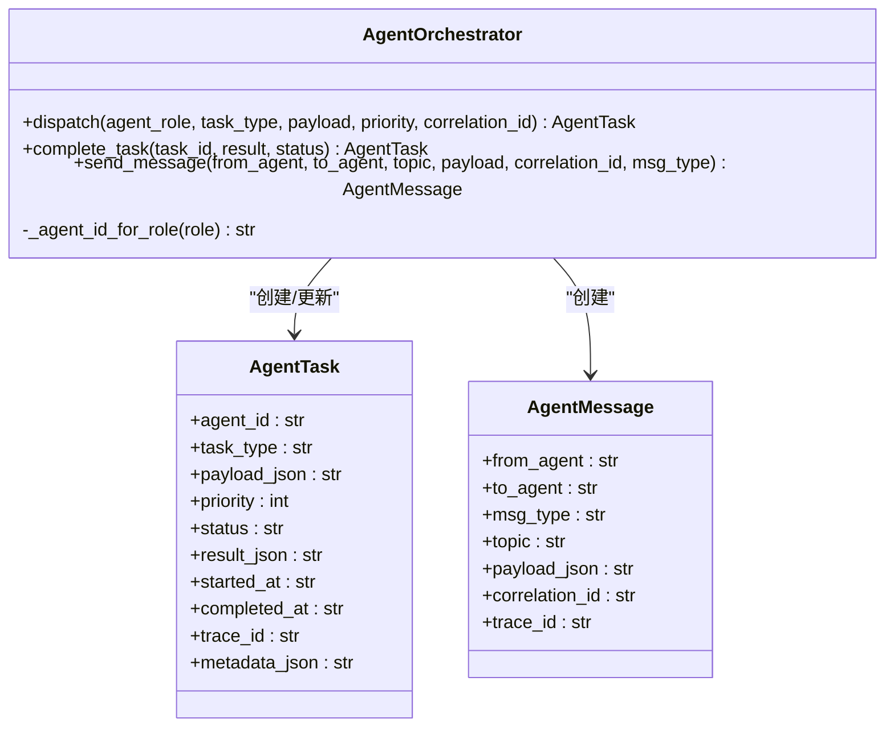
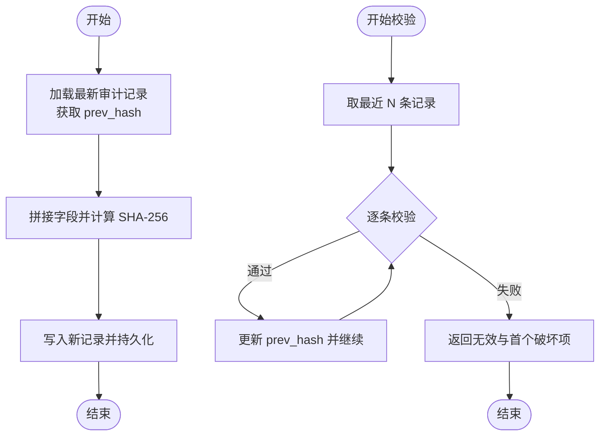
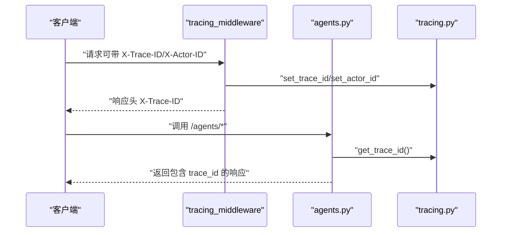
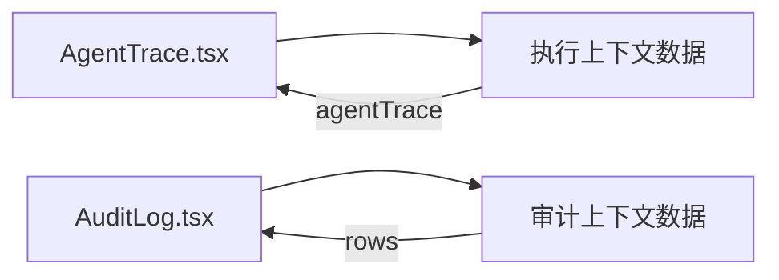
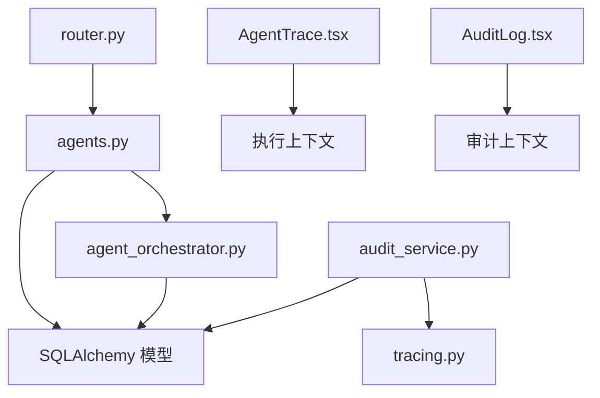

# 代理追踪 API

<cite>
**本文引用的文件**
- [agents.py](file://backend/app/api/v1/agents.py)
- [router.py](file://backend/app/api/v1/router.py)
- [models.py（agents）](file://backend/app/domains/agents/models.py)
- [schemas.py（agents）](file://backend/app/domains/agents/schemas.py)
- [agent_orchestrator.py](file://backend/app/services/agent_orchestrator.py)
- [tracing.py](file://backend/app/core/tracing.py)
- [audit_service.py](file://backend/app/services/audit_service.py)
- [models.py（audit）](file://backend/app/domains/audit/models.py)
- [schemas.py（audit）](file://backend/app/domains/audit/schemas.py)
- [AgentTrace.tsx](file://frontend/src/screens/Execution/AgentTrace.tsx)
- [AuditLog.tsx](file://frontend/src/screens/Audit/AuditLog.tsx)
</cite>

## 目录
1. [简介](#简介)
2. [项目结构](#项目结构)
3. [核心组件](#核心组件)
4. [架构总览](#架构总览)
5. [详细组件分析](#详细组件分析)
6. [依赖分析](#依赖分析)
7. [性能考虑](#性能考虑)
8. [故障排查指南](#故障排查指南)
9. [结论](#结论)
10. [附录](#附录)

## 简介
本文件系统性梳理并解释代理追踪 API 的设计与实现，聚焦于 AI Agent 执行轨迹的记录与查询能力，覆盖以下方面：
- Agent 行为追踪：任务队列、消息传递、工具注册与权限控制
- 决策过程记录：基于审计日志的不可篡改链式记录
- 执行结果追踪：任务状态、结果回填与时间序列信息
- 数据模型与事件类型：Agent 注册表、任务、消息、工具；审计日志与事件盒
- 时间序列分析：按时间倒序的轨迹与审计记录
- 可视化与审计：前端执行流与审计面板的展示
- 异常检测与合规：哈希链验证、幂等键与事件重放

## 项目结构
后端采用 FastAPI + SQLAlchemy 异步 ORM，按领域分层组织：
- API 层：v1 路由聚合，暴露 /agents、/audit 等接口
- 领域模型：agents 与 audit 两个子域的数据模型与 Pydantic 序列化
- 服务层：AgentOrchestrator 协调任务与消息持久化；AuditService 提供审计日志与链式校验
- 核心基础设施：tracing 提供请求级 trace_id 与 actor 上下文注入

图表来源
- [router.py:1-40](file://backend/app/api/v1/router.py#L1-L40)
- [agents.py:1-172](file://backend/app/api/v1/agents.py#L1-L172)
- [agent_orchestrator.py:1-105](file://backend/app/services/agent_orchestrator.py#L1-L105)
- [audit_service.py:1-109](file://backend/app/services/audit_service.py#L1-L109)
- [models.py（agents）:1-62](file://backend/app/domains/agents/models.py#L1-L62)
- [models.py（audit）:1-51](file://backend/app/domains/audit/models.py#L1-L51)
- [tracing.py:1-87](file://backend/app/core/tracing.py#L1-L87)

章节来源
- [router.py:1-40](file://backend/app/api/v1/router.py#L1-L40)
- [agents.py:1-172](file://backend/app/api/v1/agents.py#L1-L172)

## 核心组件
- Agent 概览与实时追踪
  - 接口：GET /agents/overview 返回 Agent 列表、最近任务、最近消息、工具清单
  - 关键字段：任务状态色值、消息相关性标识、工具风险等级与启用状态
- 任务派发与完成
  - 接口：POST /agents/tasks 创建并派发任务；GET /agents/tasks/{task_id} 查询单个任务
  - 关键字段：优先级、状态、开始/完成时间、结果 JSON、trace_id
- 消息传递
  - 接口：POST /agents/messages 发送跨 Agent 消息；GET /agents/messages 列出最近消息
  - 关键字段：消息类型（request/response/event/broadcast）、主题、负载、correlation_id
- 审计日志与链式校验
  - 服务：AuditService 提供日志写入与哈希链校验
  - 模型：AuditLog 包含 actor/actor_type/action/resource/result/confidence/detail/trace_id/prev_hash/curr_hash
- 请求追踪上下文
  - 工具：tracing.py 提供 trace_id 生成与注入，支持 X-Trace-ID 头部透传

章节来源
- [agents.py:93-172](file://backend/app/api/v1/agents.py#L93-L172)
- [agent_orchestrator.py:31-105](file://backend/app/services/agent_orchestrator.py#L31-L105)
- [models.py（agents）:9-62](file://backend/app/domains/agents/models.py#L9-L62)
- [models.py（audit）:9-27](file://backend/app/domains/audit/models.py#L9-L27)
- [audit_service.py:32-109](file://backend/app/services/audit_service.py#L32-L109)
- [tracing.py:13-87](file://backend/app/core/tracing.py#L13-L87)

## 架构总览
下图展示从 API 到服务再到数据库的完整调用链，以及审计日志与请求追踪的集成点。

图表来源
- [agents.py:115-172](file://backend/app/api/v1/agents.py#L115-L172)
- [agent_orchestrator.py:31-105](file://backend/app/services/agent_orchestrator.py#L31-L105)
- [tracing.py:49-87](file://backend/app/core/tracing.py#L49-L87)
- [audit_service.py:38-82](file://backend/app/services/audit_service.py#L38-L82)

## 详细组件分析

### Agent 概览与接口
- 概览接口
  - GET /agents/overview：返回最近任务、消息与工具清单，便于全局态势感知
  - 输出模型：AgentOverview，包含 agents、tasks、messages、tools
- 任务接口
  - POST /agents/tasks：创建并派发任务，内部通过 AgentOrchestrator 将任务持久化
  - GET /agents/tasks/{task_id}：按 ID 查询任务
- 消息接口
  - POST /agents/messages：发送跨 Agent 消息
  - GET /agents/messages：列出最近消息，默认限制条数

图表来源
- [agents.py:93-172](file://backend/app/api/v1/agents.py#L93-L172)
- [agent_orchestrator.py:31-105](file://backend/app/services/agent_orchestrator.py#L31-L105)

章节来源
- [agents.py:93-172](file://backend/app/api/v1/agents.py#L93-L172)

### AgentOrchestrator 服务
- 角色到 ID 解析：根据 agent_role 查找已注册 Agent 的真实 ID
- 任务派发：构造 AgentTask，写入 payload_json、priority、status、trace_id，并可选 metadata_json（如 correlation_id）
- 任务完成：更新状态、结果 JSON、完成时间
- 消息发送：构造 AgentMessage，写入 payload_json、trace_id、correlation_id

图表来源
- [agent_orchestrator.py:15-105](file://backend/app/services/agent_orchestrator.py#L15-L105)
- [models.py（agents）:23-49](file://backend/app/domains/agents/models.py#L23-L49)

章节来源
- [agent_orchestrator.py:15-105](file://backend/app/services/agent_orchestrator.py#L15-L105)

### 审计日志与链式校验
- 日志写入：AuditService.log 自动计算前一节点哈希，形成不可篡改链
- 链式校验：AuditService.verify_chain 对最近 N 条记录进行顺序校验，返回是否有效、校验数量与首个破坏项
- 模型字段：包含 actor/actor_type/action/resource_type/resource_id/result/result_tone/confidence/detail/trace_id/ip_address/prev_hash/curr_hash

图表来源
- [audit_service.py:18-109](file://backend/app/services/audit_service.py#L18-L109)
- [models.py（audit）:9-27](file://backend/app/domains/audit/models.py#L9-L27)

章节来源
- [audit_service.py:32-109](file://backend/app/services/audit_service.py#L32-L109)
- [models.py（audit）:9-27](file://backend/app/domains/audit/models.py#L9-L27)

### 请求追踪与上下文
- 中间件：tracing_middleware 注入 trace_id 与 actor_id，响应头携带 X-Trace-ID
- 工具函数：get_trace_id/get_actor_id/set_trace_id/set_actor_id 提供上下文访问
- 使用场景：Agent 任务与消息均写入 trace_id，便于端到端追踪

图表来源
- [tracing.py:49-87](file://backend/app/core/tracing.py#L49-L87)
- [agents.py:115-172](file://backend/app/api/v1/agents.py#L115-L172)

章节来源
- [tracing.py:13-87](file://backend/app/core/tracing.py#L13-L87)

### 前端可视化与展示
- 执行流展示：AgentTrace 组件消费执行上下文中的 agentTrace，渲染实时 Agent 操作流
- 审计面板：AuditLog 组件渲染审计行，支持按 actor 类型过滤与统计

图表来源
- [AgentTrace.tsx:1-37](file://frontend/src/screens/Execution/AgentTrace.tsx#L1-L37)
- [AuditLog.tsx:1-99](file://frontend/src/screens/Audit/AuditLog.tsx#L1-L99)

章节来源
- [AgentTrace.tsx:1-37](file://frontend/src/screens/Execution/AgentTrace.tsx#L1-L37)
- [AuditLog.tsx:1-99](file://frontend/src/screens/Audit/AuditLog.tsx#L1-L99)

## 依赖分析
- API 聚合：router.py 将 /agents 路由挂载至 agents.py
- 服务依赖：agents.py 通过 AgentOrchestrator 访问数据库并写入 AgentTask/AgentMessage
- 审计依赖：audit_service.py 依赖 tracing.py 获取 trace_id，并依赖数据库模型写入审计日志
- 前端依赖：AgentTrace.tsx/AuditLog.tsx 依赖各自上下文提供数据

图表来源
- [router.py:25-38](file://backend/app/api/v1/router.py#L25-L38)
- [agents.py:11-22](file://backend/app/api/v1/agents.py#L11-L22)
- [agent_orchestrator.py:7-12](file://backend/app/services/agent_orchestrator.py#L7-L12)
- [audit_service.py:13-15](file://backend/app/services/audit_service.py#L13-L15)
- [tracing.py:3-10](file://backend/app/core/tracing.py#L3-L10)

章节来源
- [router.py:1-40](file://backend/app/api/v1/router.py#L1-L40)
- [agents.py:1-25](file://backend/app/api/v1/agents.py#L1-L25)

## 性能考虑
- 查询限制：概览接口对任务与消息默认限制条数，避免一次性拉取过多数据
- 索引策略：AgentTask/AgentMessage/ToolRegistry 等模型关键字段建立索引，提升查询效率
- 异步 I/O：使用 SQLAlchemy 异步会话，降低数据库等待时间
- 哈希链长度：verify_chain 支持限制校验条数，避免全量扫描带来的开销

## 故障排查指南
- 任务不存在
  - 现象：GET /agents/tasks/{task_id} 返回 404
  - 排查：确认 task_id 是否正确，或检查任务是否被清理
- 消息未到达
  - 现象：接收方未收到消息
  - 排查：核对 to_agent 与 msg_type；检查 correlation_id 是否一致；确认 trace_id 是否贯穿请求链
- 审计链异常
  - 现象：verify_chain 返回 false
  - 排查：定位首个破坏项，检查 prev_hash/curr_hash 计算一致性；确认历史记录未被修改
- 前端显示异常
  - 现象：执行流或审计面板空白
  - 排查：确认上下文数据是否正确注入；检查网络请求与响应头 X-Trace-ID

章节来源
- [agents.py:133-141](file://backend/app/api/v1/agents.py#L133-L141)
- [audit_service.py:83-109](file://backend/app/services/audit_service.py#L83-L109)

## 结论
本代理追踪 API 以清晰的领域分层与强追踪上下文为基础，提供了完整的 Agent 行为、决策与执行结果的可观测性闭环。结合不可篡改的审计链与前端可视化组件，能够支撑行为模式分析、性能监控与异常检测等高级需求。

## 附录

### 数据模型与事件类型
- Agent 注册表（AgentRegistry）
  - 字段：name、role、status、current_task、metric、heartbeat_at、config_json
- 任务（AgentTask）
  - 字段：agent_id、task_type、payload_json、priority、status、result_json、started_at、completed_at、trace_id、metadata_json
- 消息（AgentMessage）
  - 字段：from_agent、to_agent、msg_type、topic、payload_json、correlation_id、trace_id
- 工具注册（ToolRegistry）
  - 字段：name、level、description、allowed_agents、schema_json、enabled
- 审计日志（AuditLog）
  - 字段：actor、actor_type、action、resource_type、resource_id、result、result_tone、confidence、detail、trace_id、ip_address、prev_hash、curr_hash
- 事件盒（EventOutbox）
  - 字段：event_type、payload、status、published_at、error

章节来源
- [models.py（agents）:9-62](file://backend/app/domains/agents/models.py#L9-L62)
- [models.py（audit）:9-51](file://backend/app/domains/audit/models.py#L9-L51)

### API 定义与示例路径
- 概览
  - GET /agents/overview → [agents.py:93-112](file://backend/app/api/v1/agents.py#L93-L112)
- 任务
  - POST /agents/tasks → [agents.py:115-129](file://backend/app/api/v1/agents.py#L115-L129)
  - GET /agents/tasks/{task_id} → [agents.py:132-141](file://backend/app/api/v1/agents.py#L132-L141)
- 消息
  - POST /agents/messages → [agents.py:144-159](file://backend/app/api/v1/agents.py#L144-L159)
  - GET /agents/messages → [agents.py:162-171](file://backend/app/api/v1/agents.py#L162-L171)

章节来源
- [agents.py:93-172](file://backend/app/api/v1/agents.py#L93-L172)