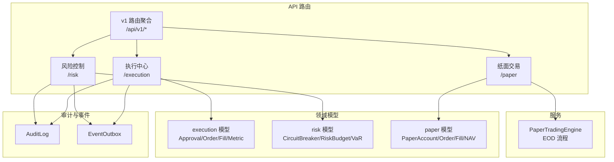
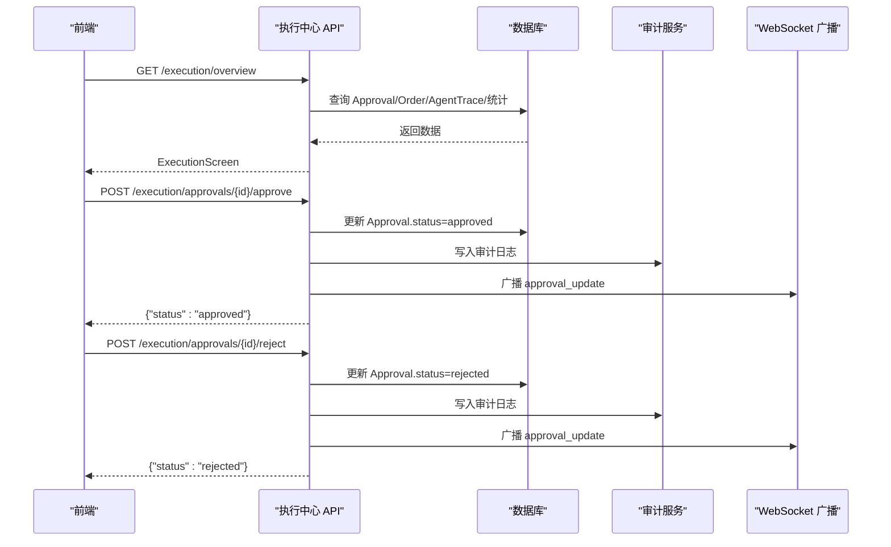
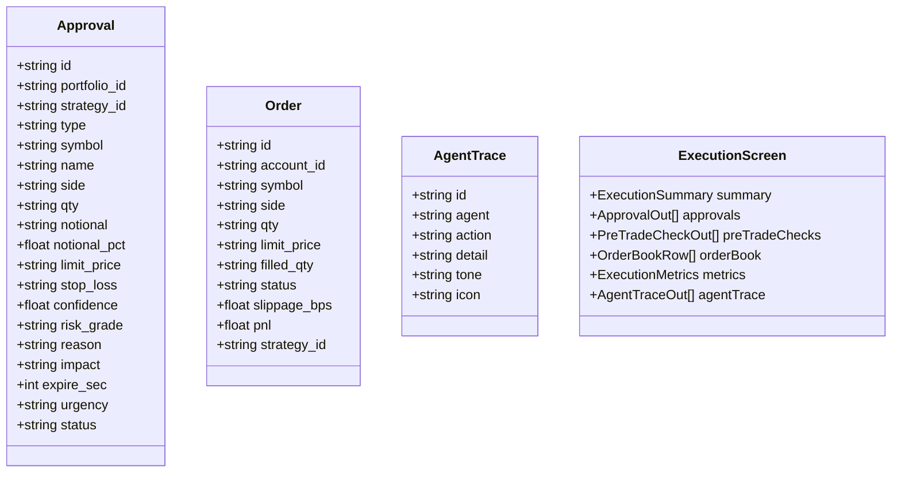
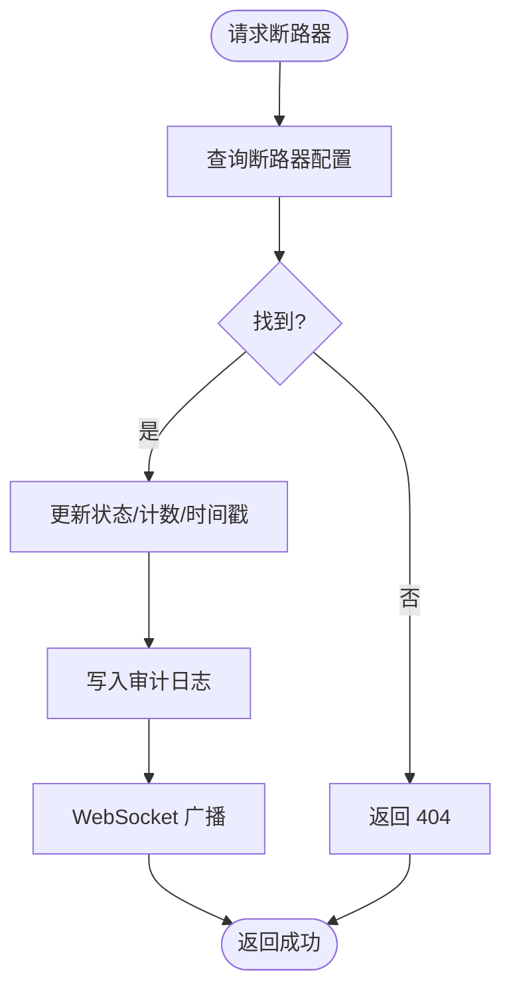
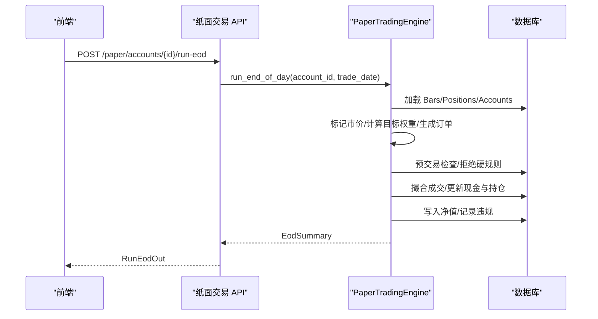
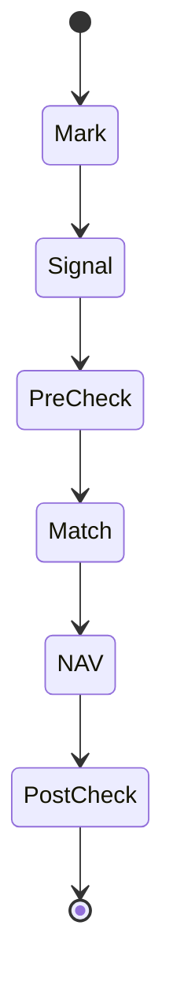
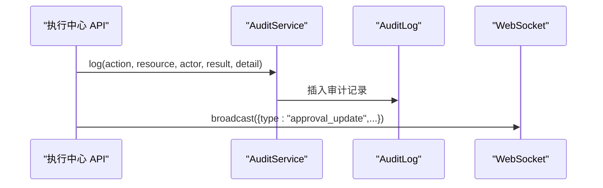
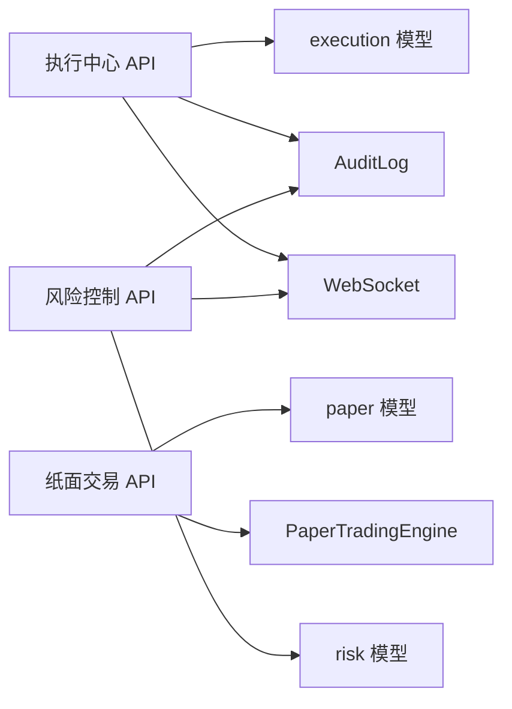

# 执行 API

<cite>
**本文引用的文件**
- [backend/app/api/v1/execution.py](file://backend/app/api/v1/execution.py)
- [backend/app/domains/execution/models.py](file://backend/app/domains/execution/models.py)
- [backend/app/domains/execution/schemas.py](file://backend/app/domains/execution/schemas.py)
- [backend/app/api/v1/risk.py](file://backend/app/api/v1/risk.py)
- [backend/app/domains/risk/models.py](file://backend/app/domains/risk/models.py)
- [backend/app/api/v1/paper.py](file://backend/app/api/v1/paper.py)
- [backend/app/domains/execution/paper_models.py](file://backend/app/domains/execution/paper_models.py)
- [backend/app/services/paper_trading.py](file://backend/app/services/paper_trading.py)
- [backend/app/api/v1/router.py](file://backend/app/api/v1/router.py)
- [backend/app/domains/audit/models.py](file://backend/app/domains/audit/models.py)
</cite>

## 目录
1. [简介](#简介)
2. [项目结构](#项目结构)
3. [核心组件](#核心组件)
4. [架构总览](#架构总览)
5. [详细组件分析](#详细组件分析)
6. [依赖分析](#依赖分析)
7. [性能考量](#性能考量)
8. [故障排查指南](#故障排查指南)
9. [结论](#结论)
10. [附录](#附录)

## 简介
本文件面向开发者，系统化梳理执行 API 的设计与实现，覆盖订单管理、交易执行、风控检查与人工确认等能力。重点解析模拟盘与实盘在 API 层面的差异、支持的订单类型与执行状态、风控检查点、执行报告生成以及错误处理机制。目标是帮助团队快速实现完整的交易执行系统接口。

## 项目结构
后端采用 FastAPI + SQLAlchemy 异步 ORM 架构，按领域分层组织：
- API 层：路由聚合于 v1 路由器，分别暴露执行中心、风险控制、纸面交易等子模块
- 领域模型：execution（实盘）、risk（风控）、paper（纸面）等
- 服务层：paper_trading 提供纸面交易引擎，贯穿 EOD 全流程
- 审计与事件：审计日志与事件出站用于合规与事件广播

图表来源
- [backend/app/api/v1/router.py:1-40](file://backend/app/api/v1/router.py#L1-L40)
- [backend/app/api/v1/execution.py:1-281](file://backend/app/api/v1/execution.py#L1-L281)
- [backend/app/api/v1/risk.py:1-273](file://backend/app/api/v1/risk.py#L1-L273)
- [backend/app/api/v1/paper.py:1-276](file://backend/app/api/v1/paper.py#L1-L276)
- [backend/app/services/paper_trading.py:1-634](file://backend/app/services/paper_trading.py#L1-L634)

章节来源
- [backend/app/api/v1/router.py:1-40](file://backend/app/api/v1/router.py#L1-L40)

## 核心组件
- 执行中心（Execution Center）
  - 订单簿与审批流：Approval、Order、AgentTrace
  - 预交易检查与执行指标：PreTradeCheck、ExecutionMetric
  - API：概览、审批列表、审批通过/拒绝
- 风险控制（Risk Control）
  - 风控预算、VaR、断路器、违规事件、策略决策流
  - API：概览、手动触发/恢复断路器
- 纸面交易（Paper Trading）
  - 账户、持仓、订单、成交、净值、违规事件
  - API：账户 CRUD、持仓/订单/成交/净值/违规查询、EOD 手动运行
- 纸面交易引擎（PaperTradingEngine）
  - EOD 标准流程：标记、信号、预交易检查、撮合、净值、后交易检查

章节来源
- [backend/app/domains/execution/models.py:1-103](file://backend/app/domains/execution/models.py#L1-L103)
- [backend/app/domains/execution/schemas.py:1-107](file://backend/app/domains/execution/schemas.py#L1-L107)
- [backend/app/domains/risk/models.py:1-101](file://backend/app/domains/risk/models.py#L1-L101)
- [backend/app/domains/execution/paper_models.py:1-133](file://backend/app/domains/execution/paper_models.py#L1-L133)

## 架构总览
执行 API 的整体交互围绕“人工确认 + 风控检查 + 执行引擎”的闭环展开。前端通过 API 获取执行概览（审批、订单簿、指标、代理轨迹），人工在执行中心进行审批；审批通过后，系统进入风控检查与执行阶段，并通过审计与事件通道记录与广播。

图表来源
- [backend/app/api/v1/execution.py:188-281](file://backend/app/api/v1/execution.py#L188-L281)
- [backend/app/domains/audit/models.py:1-51](file://backend/app/domains/audit/models.py#L1-L51)

## 详细组件分析

### 执行中心 API 设计
- 概览接口
  - 功能：一次性返回执行概览所需数据（审批、订单簿、代理轨迹、指标、预交易检查）
  - 数据来源：Approval、Order、AgentTrace、ExecutionMetric、PreTradeCheck
  - 输出：ExecutionScreen
- 审批管理
  - 列表：按状态过滤，支持 limit
  - 人工确认：approve/reject，校验状态一致性，写入审计日志，广播 WebSocket 事件
- 订单簿
  - 返回最近订单，映射状态到颜色标签，便于前端展示

图表来源
- [backend/app/domains/execution/models.py:9-103](file://backend/app/domains/execution/models.py#L9-L103)
- [backend/app/domains/execution/schemas.py:6-107](file://backend/app/domains/execution/schemas.py#L6-L107)

章节来源
- [backend/app/api/v1/execution.py:188-281](file://backend/app/api/v1/execution.py#L188-L281)
- [backend/app/domains/execution/models.py:9-103](file://backend/app/domains/execution/models.py#L9-L103)
- [backend/app/domains/execution/schemas.py:6-107](file://backend/app/domains/execution/schemas.py#L6-L107)

### 风险控制 API 设计
- 概览接口
  - 返回健康评分、待审批数、自动阻断数、断路器、策略决策流、违规事件等
- 断路器管理
  - 手动触发：更新状态与 24 小时触发次数，写入审计日志并广播
  - 请求恢复：更新状态为冷却，写入审计日志并广播

图表来源
- [backend/app/api/v1/risk.py:210-273](file://backend/app/api/v1/risk.py#L210-L273)

章节来源
- [backend/app/api/v1/risk.py:188-273](file://backend/app/api/v1/risk.py#L188-L273)
- [backend/app/domains/risk/models.py:60-101](file://backend/app/domains/risk/models.py#L60-L101)

### 纸面交易 API 设计
- 账户管理
  - 创建、列表、详情
- 持仓/订单/成交/净值/违规
  - 支持分页与按日期排序，输出标准化结构
- EOD 手动运行
  - 对指定账户与交易日执行完整 EOD 流程，返回汇总结果

图表来源
- [backend/app/api/v1/paper.py:229-248](file://backend/app/api/v1/paper.py#L229-L248)
- [backend/app/services/paper_trading.py:82-135](file://backend/app/services/paper_trading.py#L82-L135)

章节来源
- [backend/app/api/v1/paper.py:43-248](file://backend/app/api/v1/paper.py#L43-L248)
- [backend/app/domains/execution/paper_models.py:14-133](file://backend/app/domains/execution/paper_models.py#L14-L133)
- [backend/app/services/paper_trading.py:76-135](file://backend/app/services/paper_trading.py#L76-L135)

### 订单类型与执行状态
- 订单类型
  - 执行中心：Approval.type 支持 live、paper、reduce、add、rotate、hedge、pause 等
  - 纸面交易：PaperOrder.side 支持 buy/sell，状态包含 pending/approved/filled/partial/rejected/canceled
- 执行状态
  - 实盘 Order.status：filled/partial/working/rejected/canceled
  - 纸面 PaperOrder.status：同上，含 requires_approval 字段用于审批需求
- 预交易检查
  - 纸面引擎内置硬规则：个股上限、现金底仓、无效市价等，失败直接拒绝并记录 PaperPreTradeCheck

章节来源
- [backend/app/domains/execution/models.py:16-31](file://backend/app/domains/execution/models.py#L16-L31)
- [backend/app/domains/execution/models.py:41-48](file://backend/app/domains/execution/models.py#L41-L48)
- [backend/app/domains/execution/paper_models.py:51-69](file://backend/app/domains/execution/paper_models.py#L51-L69)
- [backend/app/services/paper_trading.py:314-373](file://backend/app/services/paper_trading.py#L314-L373)

### 执行状态机与报告生成
- 纸面 EOD 状态机
  - 标记（Mark）：更新持仓市价与权重
  - 信号（Signal）：根据策略生成目标权重并创建订单
  - 预交易检查（Pre-Trade Check）：硬规则拒绝
  - 撮合（Match）：按收盘价与成本模型成交
  - 净值（NAV）：计算并写入日度净值
  - 后交易检查（Post-Trade Check）：日损/最大回撤等违规
- 报告字段
  - EodSummary：订单创建/成交/拒绝数量、违规数、最终净值
  - PaperNavPoint：日净值、现金、市值、日收益、回撤
  - PaperRiskBreach：违规规则、严重级别、状态

图表来源
- [backend/app/services/paper_trading.py:82-135](file://backend/app/services/paper_trading.py#L82-L135)

章节来源
- [backend/app/services/paper_trading.py:82-135](file://backend/app/services/paper_trading.py#L82-L135)
- [backend/app/domains/execution/paper_models.py:91-133](file://backend/app/domains/execution/paper_models.py#L91-L133)

### 审批流程与审计日志
- 审批流程
  - 前端查看待审批列表
  - 人工批准/拒绝，后端校验状态并更新
  - 写入审计日志，广播 WebSocket 事件
- 审计模型
  - 审计日志包含操作者、动作、资源、结果、追踪信息等
  - 事件出站用于可靠事件发布

图表来源
- [backend/app/api/v1/execution.py:223-281](file://backend/app/api/v1/execution.py#L223-L281)
- [backend/app/domains/audit/models.py:9-27](file://backend/app/domains/audit/models.py#L9-L27)

章节来源
- [backend/app/api/v1/execution.py:223-281](file://backend/app/api/v1/execution.py#L223-L281)
- [backend/app/domains/audit/models.py:9-27](file://backend/app/domains/audit/models.py#L9-L27)

## 依赖分析
- 组件耦合
  - 执行中心依赖 Approval/Order/AgentTrace 模型与审计服务
  - 纸面交易依赖 PaperTradingEngine 与 paper 模型
  - 风险控制依赖 risk 模型与审计服务
- 外部集成
  - WebSocket 广播用于实时通知审批与断路器状态
  - 事件出站用于可靠事件发布

图表来源
- [backend/app/api/v1/execution.py:10-25](file://backend/app/api/v1/execution.py#L10-L25)
- [backend/app/api/v1/risk.py:9-27](file://backend/app/api/v1/risk.py#L9-L27)
- [backend/app/api/v1/paper.py:13-35](file://backend/app/api/v1/paper.py#L13-L35)

章节来源
- [backend/app/api/v1/execution.py:10-25](file://backend/app/api/v1/execution.py#L10-L25)
- [backend/app/api/v1/risk.py:9-27](file://backend/app/api/v1/risk.py#L9-L27)
- [backend/app/api/v1/paper.py:13-35](file://backend/app/api/v1/paper.py#L13-L35)

## 性能考量
- 查询优化
  - 使用 limit 控制返回量，避免全表扫描
  - 对高频查询字段建立索引（如 Approval.status、Order.account_id 等）
- 异步 I/O
  - 使用 SQLAlchemy 异步会话减少阻塞
- 成本模型
  - 纸面交易使用统一成本参数，避免重复计算
- 广播与事件
  - WebSocket 广播仅在状态变更时触发，降低网络压力

## 故障排查指南
- 审批相关
  - 404：审批不存在
  - 409：审批非 pending 状态（已批准/拒绝/过期）
- 断路器相关
  - 404：断路器等级不存在
  - 409：断路器已处于目标状态（如已触发却请求恢复）
- 纸面交易相关
  - 账户不存在或已删除：返回 404
  - EOD 未产生行情数据或账户非活跃：返回空摘要
- 审计与事件
  - 审计日志缺失：检查审计服务是否正确调用
  - 事件未广播：检查 WebSocket 管理器与主题订阅

章节来源
- [backend/app/api/v1/execution.py:223-281](file://backend/app/api/v1/execution.py#L223-L281)
- [backend/app/api/v1/risk.py:210-273](file://backend/app/api/v1/risk.py#L210-L273)
- [backend/app/api/v1/paper.py:82-86](file://backend/app/api/v1/paper.py#L82-L86)
- [backend/app/api/v1/paper.py:236-247](file://backend/app/api/v1/paper.py#L236-L247)

## 结论
该执行 API 以清晰的领域划分与标准的数据模型支撑了从人工确认、风控检查到执行与报告的完整闭环。实盘与纸面在数据模型与执行流程上差异化设计，既满足真实交易的严谨性，又为策略验证与回测提供高效工具。建议在生产环境中强化索引、缓存与事件可靠性，确保高并发下的稳定性与可观测性。

## 附录
- 关键接口一览
  - 执行中心
    - GET /api/v1/execution/overview
    - GET /api/v1/execution/approvals?status=&limit=
    - POST /api/v1/execution/approvals/{approval_id}/approve
    - POST /api/v1/execution/approvals/{approval_id}/reject
  - 风险控制
    - GET /api/v1/risk/overview
    - POST /api/v1/risk/circuit-breakers/{level}/trigger
    - POST /api/v1/risk/circuit-breakers/{level}/recover
  - 纸面交易
    - POST /api/v1/paper/accounts
    - GET /api/v1/paper/accounts/{account_id}/positions
    - GET /api/v1/paper/accounts/{account_id}/orders
    - GET /api/v1/paper/accounts/{account_id}/fills
    - GET /api/v1/paper/accounts/{account_id}/nav
    - GET /api/v1/paper/accounts/{account_id}/breaches
    - POST /api/v1/paper/accounts/{account_id}/run-eod