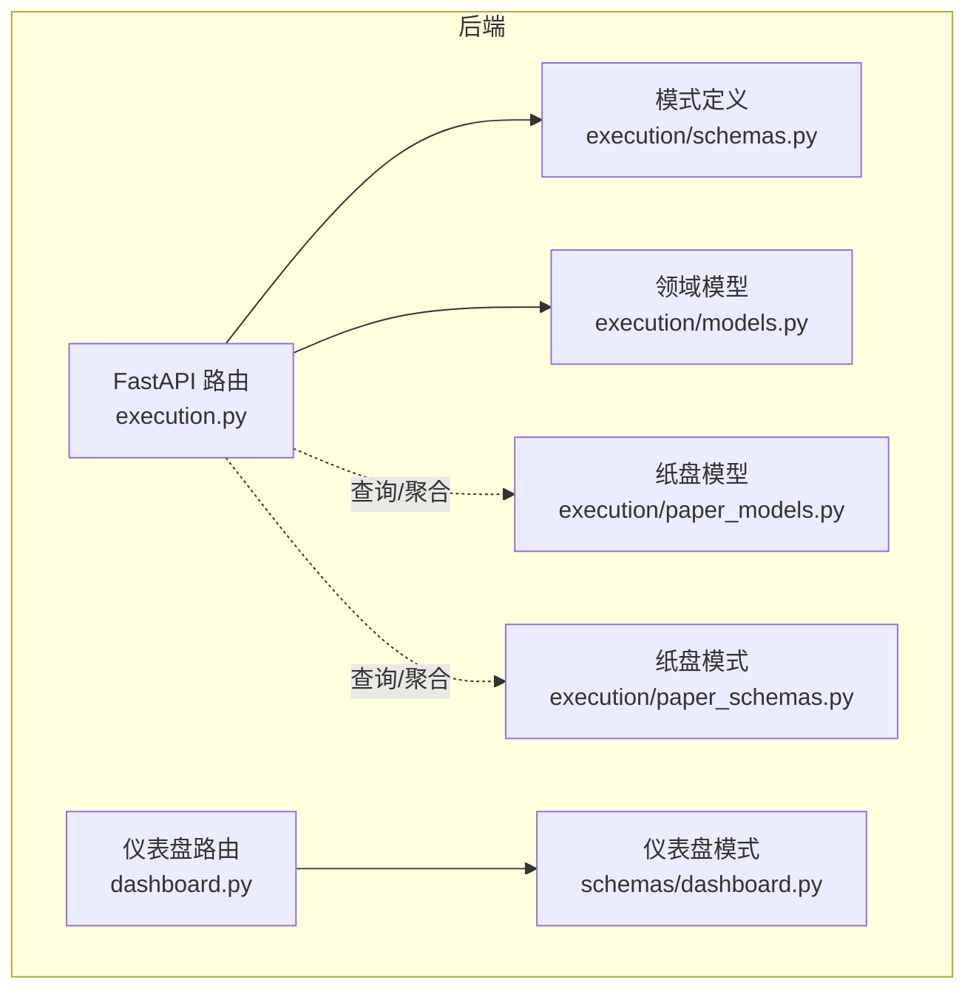
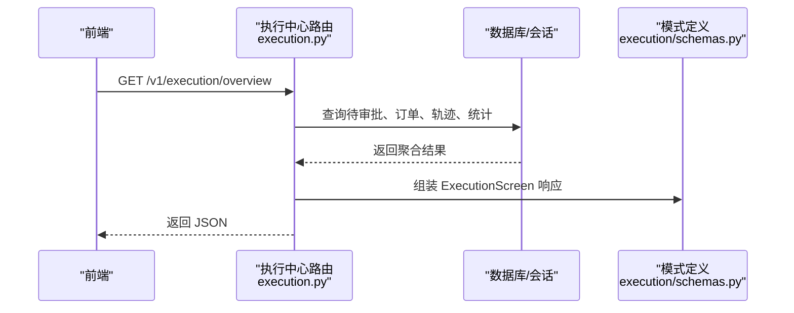
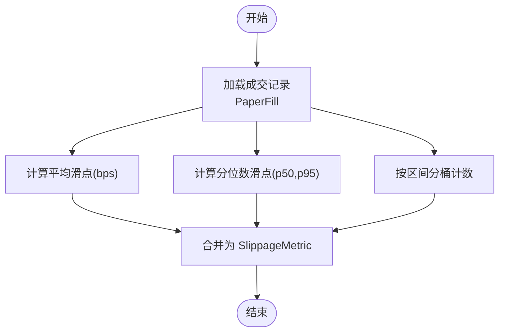
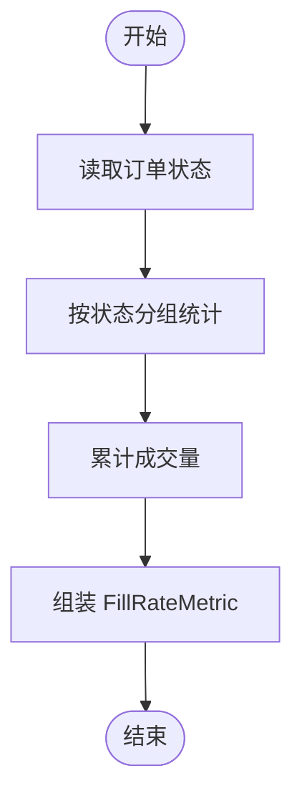
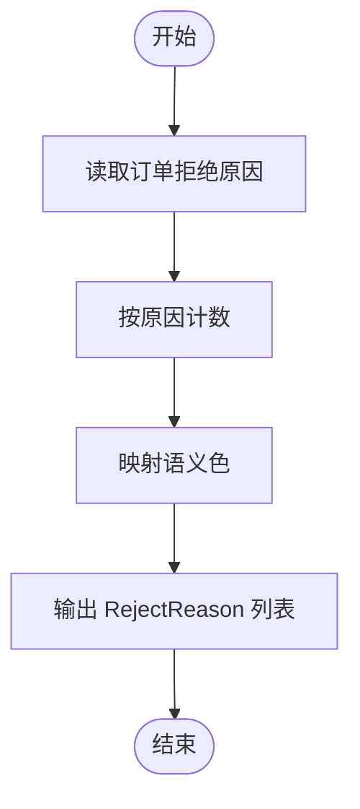
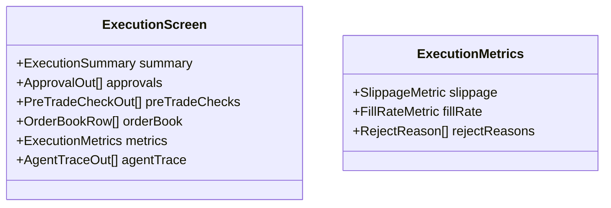
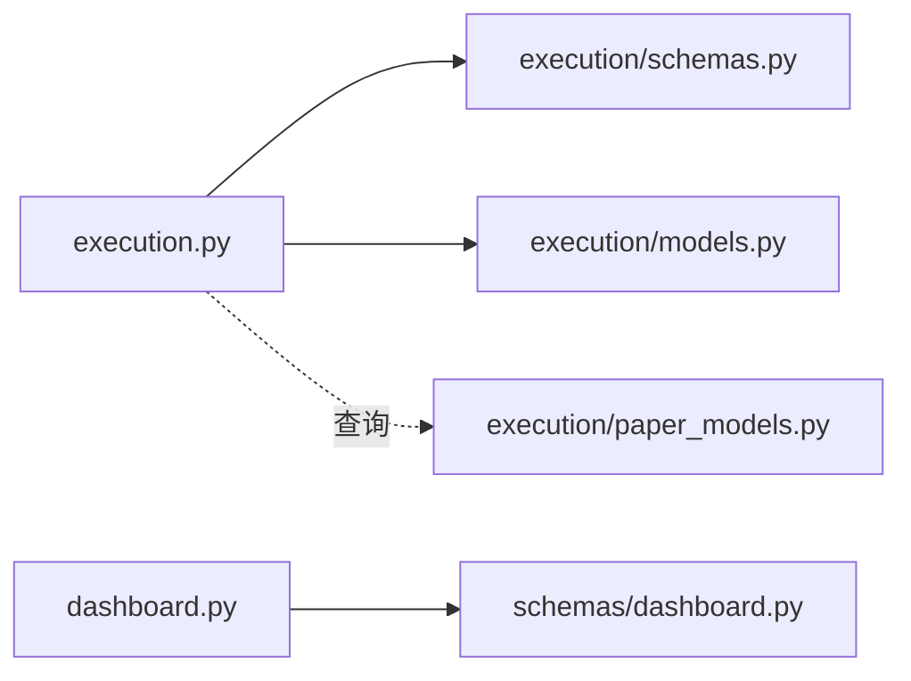

# 执行指标 API

<cite>
**本文引用的文件**
- [backend/app/api/v1/execution.py](file://backend/app/api/v1/execution.py)
- [backend/app/domains/execution/schemas.py](file://backend/app/domains/execution/schemas.py)
- [backend/app/domains/execution/models.py](file://backend/app/domains/execution/models.py)
- [backend/app/domains/execution/paper_models.py](file://backend/app/domains/execution/paper_models.py)
- [backend/app/domains/execution/paper_schemas.py](file://backend/app/domains/execution/paper_schemas.py)
- [backend/app/api/v1/dashboard.py](file://backend/app/api/v1/dashboard.py)
- [backend/app/schemas/dashboard.py](file://backend/app/schemas/dashboard.py)
</cite>

## 目录
1. [简介](#简介)
2. [项目结构](#项目结构)
3. [核心组件](#核心组件)
4. [架构总览](#架构总览)
5. [详细组件分析](#详细组件分析)
6. [依赖分析](#依赖分析)
7. [性能考虑](#性能考虑)
8. [故障排查指南](#故障排查指南)
9. [结论](#结论)
10. [附录](#附录)

## 简介
本文件为“执行指标 API”的综合技术文档，聚焦交易执行的关键指标计算与查询接口，覆盖以下三大类指标：
- 滑点指标：平均滑点、分位数滑点、滑点分布（桶计数）
- 成交率指标：总成交量、已成交、部分成交、拒绝、撤销
- 拒绝原因统计：按原因分类的拒绝次数与语义化颜色标注

同时，文档阐述指标数据的实时计算、历史趋势分析与性能基准对比思路，并给出聚合算法、统计方法、可视化展示建议、预警机制与异常检测实践，以及指标优化建议。

## 项目结构
执行指标 API 主要位于后端 FastAPI 路由层，配合领域模型与模式定义，形成“路由 → 服务/查询 → 模型/模式 → 数据库/内存”的清晰分层。前端仪表盘与执行中心页面通过统一的响应模式对接指标数据。

图表来源
- [backend/app/api/v1/execution.py:1-281](file://backend/app/api/v1/execution.py#L1-L281)
- [backend/app/domains/execution/schemas.py:1-120](file://backend/app/domains/execution/schemas.py#L1-L120)
- [backend/app/domains/execution/models.py:1-120](file://backend/app/domains/execution/models.py#L1-L120)
- [backend/app/domains/execution/paper_models.py:1-133](file://backend/app/domains/execution/paper_models.py#L1-L133)
- [backend/app/domains/execution/paper_schemas.py:1-111](file://backend/app/domains/execution/paper_schemas.py#L1-L111)
- [backend/app/api/v1/dashboard.py:1-148](file://backend/app/api/v1/dashboard.py#L1-L148)
- [backend/app/schemas/dashboard.py:1-94](file://backend/app/schemas/dashboard.py#L1-L94)

章节来源
- [backend/app/api/v1/execution.py:1-281](file://backend/app/api/v1/execution.py#L1-L281)
- [backend/app/domains/execution/schemas.py:1-120](file://backend/app/domains/execution/schemas.py#L1-L120)
- [backend/app/domains/execution/models.py:1-120](file://backend/app/domains/execution/models.py#L1-L120)
- [backend/app/domains/execution/paper_models.py:1-133](file://backend/app/domains/execution/paper_models.py#L1-L133)
- [backend/app/domains/execution/paper_schemas.py:1-111](file://backend/app/domains/execution/paper_schemas.py#L1-L111)
- [backend/app/api/v1/dashboard.py:1-148](file://backend/app/api/v1/dashboard.py#L1-L148)
- [backend/app/schemas/dashboard.py:1-94](file://backend/app/schemas/dashboard.py#L1-L94)

## 核心组件
- 执行中心路由与屏幕聚合
  - 提供执行中心概览接口，返回汇总信息、待审批列表、订单簿、预交易检查、执行指标与代理轨迹等。
  - 关键路径：[overview 接口:188-202](file://backend/app/api/v1/execution.py#L188-L202)
- 执行指标模式与数据结构
  - 定义滑点指标、成交率指标、拒绝原因统计与整体执行指标容器，用于序列化响应。
  - 关键路径：[执行指标模式定义:58-104](file://backend/app/domains/execution/schemas.py#L58-L104)
- 领域模型与纸盘模型
  - 订单、成交、账户、净值等实体模型，支撑滑点与成交率的统计与聚合。
  - 关键路径：[PaperOrder/PaperFill 等模型:51-89](file://backend/app/domains/execution/paper_models.py#L51-L89)
- 仪表盘集成
  - 仪表盘路由提供系统健康、策略、告警等概览，便于将执行指标与大盘联动展示。
  - 关键路径：[仪表盘概览接口:121-135](file://backend/app/api/v1/dashboard.py#L121-L135)

章节来源
- [backend/app/api/v1/execution.py:188-202](file://backend/app/api/v1/execution.py#L188-L202)
- [backend/app/domains/execution/schemas.py:58-104](file://backend/app/domains/execution/schemas.py#L58-L104)
- [backend/app/domains/execution/paper_models.py:51-89](file://backend/app/domains/execution/paper_models.py#L51-L89)
- [backend/app/api/v1/dashboard.py:121-135](file://backend/app/api/v1/dashboard.py#L121-L135)

## 架构总览
执行指标 API 的调用链路如下：

图表来源
- [backend/app/api/v1/execution.py:188-202](file://backend/app/api/v1/execution.py#L188-L202)
- [backend/app/domains/execution/schemas.py:99-104](file://backend/app/domains/execution/schemas.py#L99-L104)

## 详细组件分析

### 滑点指标（Slippage Metrics）
- 指标构成
  - 平均滑点（单位：基点 bps）
  - 分位数滑点（如中位数、95 分位）
  - 滑点分布（按区间分桶计数）
- 数据来源与计算
  - 来源于订单成交明细中的滑点字段，结合纸盘成交记录进行统计。
  - 可通过分组聚合与排序计算分位数；桶计数基于滑点范围划分。
- 模式定义
  - [SlippageMetric:63-67](file://backend/app/domains/execution/schemas.py#L63-L67)
  - [SlippageBucket:58-62](file://backend/app/domains/execution/schemas.py#L58-L62)
- 实时与历史
  - 实时：从最新成交记录流中增量更新滑点统计。
  - 历史：按日/周/月维度存储滑点分布快照，支持趋势对比与基准对比。

图表来源
- [backend/app/domains/execution/schemas.py:58-67](file://backend/app/domains/execution/schemas.py#L58-L67)
- [backend/app/domains/execution/paper_models.py:71-89](file://backend/app/domains/execution/paper_models.py#L71-L89)

章节来源
- [backend/app/domains/execution/schemas.py:58-67](file://backend/app/domains/execution/schemas.py#L58-L67)
- [backend/app/domains/execution/paper_models.py:71-89](file://backend/app/domains/execution/paper_models.py#L71-L89)

### 成交率指标（Fill Rate Metrics）
- 指标构成
  - 总成交量、已成交、部分成交、拒绝、撤销
- 数据来源与计算
  - 以订单状态聚合：pending/working/partial/filled/rejected/canceled
  - 成交量来自已成交与部分成交的累计
- 模式定义
  - [FillRateMetric:70-77](file://backend/app/domains/execution/schemas.py#L70-L77)
- 实时与历史
  - 实时：按分钟/小时窗口滚动统计
  - 历史：按交易日聚合，与基准策略对比

图表来源
- [backend/app/domains/execution/schemas.py:70-77](file://backend/app/domains/execution/schemas.py#L70-L77)
- [backend/app/domains/execution/paper_models.py:51-69](file://backend/app/domains/execution/paper_models.py#L51-L69)

章节来源
- [backend/app/domains/execution/schemas.py:70-77](file://backend/app/domains/execution/schemas.py#L70-L77)
- [backend/app/domains/execution/paper_models.py:51-69](file://backend/app/domains/execution/paper_models.py#L51-L69)

### 拒绝原因统计（Reject Reason Statistics）
- 指标构成
  - 按拒绝原因分类的计数，附带语义化颜色标注
- 数据来源与计算
  - 从订单的拒绝原因字段聚合统计
- 模式定义
  - [RejectReason:78-83](file://backend/app/domains/execution/schemas.py#L78-L83)
- 实时与历史
  - 实时：按分钟窗口统计高频拒绝原因
  - 历史：按日/周聚合，识别异常波动

图表来源
- [backend/app/domains/execution/schemas.py:78-83](file://backend/app/domains/execution/schemas.py#L78-L83)
- [backend/app/domains/execution/paper_models.py:51-69](file://backend/app/domains/execution/paper_models.py#L51-L69)

章节来源
- [backend/app/domains/execution/schemas.py:78-83](file://backend/app/domains/execution/schemas.py#L78-L83)
- [backend/app/domains/execution/paper_models.py:51-69](file://backend/app/domains/execution/paper_models.py#L51-L69)

### 执行中心概览（ExecutionScreen）
- 组成
  - 汇总信息、待审批列表、订单簿、预交易检查、执行指标、代理轨迹
- 接口
  - [GET /v1/execution/overview:188-202](file://backend/app/api/v1/execution.py#L188-L202)
- 模式
  - [ExecutionScreen:99-104](file://backend/app/domains/execution/schemas.py#L99-L104)

图表来源
- [backend/app/domains/execution/schemas.py:99-104](file://backend/app/domains/execution/schemas.py#L99-L104)
- [backend/app/domains/execution/schemas.py:84-87](file://backend/app/domains/execution/schemas.py#L84-L87)

章节来源
- [backend/app/api/v1/execution.py:188-202](file://backend/app/api/v1/execution.py#L188-L202)
- [backend/app/domains/execution/schemas.py:99-104](file://backend/app/domains/execution/schemas.py#L99-L104)

### 审批与事件广播
- 审批接口
  - 列表：[GET /v1/execution/approvals:205-221](file://backend/app/api/v1/execution.py#L205-L221)
  - 批准：[POST /v1/execution/approvals/{approval_id}/approve:223-250](file://backend/app/api/v1/execution.py#L223-L250)
  - 拒绝：[POST /v1/execution/approvals/{approval_id}/reject:253-280](file://backend/app/api/v1/execution.py#L253-L280)
- 事件广播
  - 审批状态变更通过 WebSocket 广播，主题为 "execution-events"

章节来源
- [backend/app/api/v1/execution.py:205-280](file://backend/app/api/v1/execution.py#L205-L280)

## 依赖分析
- 路由层依赖模式层与领域模型，负责组织数据与响应格式
- 执行指标的实时计算依赖数据库查询与聚合
- 仪表盘路由与模式提供系统级概览，便于将执行指标纳入全局视图

图表来源
- [backend/app/api/v1/execution.py:1-281](file://backend/app/api/v1/execution.py#L1-L281)
- [backend/app/domains/execution/schemas.py:1-120](file://backend/app/domains/execution/schemas.py#L1-L120)
- [backend/app/domains/execution/models.py:1-120](file://backend/app/domains/execution/models.py#L1-L120)
- [backend/app/domains/execution/paper_models.py:1-133](file://backend/app/domains/execution/paper_models.py#L1-L133)
- [backend/app/api/v1/dashboard.py:1-148](file://backend/app/api/v1/dashboard.py#L1-L148)
- [backend/app/schemas/dashboard.py:1-94](file://backend/app/schemas/dashboard.py#L1-L94)

章节来源
- [backend/app/api/v1/execution.py:1-281](file://backend/app/api/v1/execution.py#L1-L281)
- [backend/app/domains/execution/schemas.py:1-120](file://backend/app/domains/execution/schemas.py#L1-L120)
- [backend/app/domains/execution/models.py:1-120](file://backend/app/domains/execution/models.py#L1-L120)
- [backend/app/domains/execution/paper_models.py:1-133](file://backend/app/domains/execution/paper_models.py#L1-L133)
- [backend/app/api/v1/dashboard.py:1-148](file://backend/app/api/v1/dashboard.py#L1-L148)
- [backend/app/schemas/dashboard.py:1-94](file://backend/app/schemas/dashboard.py#L1-L94)

## 性能考虑
- 查询优化
  - 对高频查询（订单、审批、轨迹）使用索引列（如状态、时间、符号），限制返回条数
  - 使用分页或滑动窗口减少一次性数据量
- 缓存策略
  - 对静态或低频指标（如预交易检查）可缓存
  - 对实时指标采用短周期缓存并异步刷新
- 聚合与物化
  - 将滑点分布、成交率按日/小时物化，降低在线聚合成本
- 广播与推送
  - 审批状态变更通过 WebSocket 广播，避免轮询带来的压力

## 故障排查指南
- 常见问题
  - 审批状态不一致：检查审批接口的状态校验与事务提交
  - 指标为空或异常：核对数据库中是否存在对应记录，确认聚合逻辑边界条件
  - 拒绝原因缺失：确认订单模型中拒绝原因字段是否正确写入
- 排查步骤
  - 核对请求参数与过滤条件（状态、时间、数量）
  - 查看审计日志与事件广播主题
  - 对比实时与历史指标，定位异常波动

章节来源
- [backend/app/api/v1/execution.py:223-280](file://backend/app/api/v1/execution.py#L223-L280)

## 结论
执行指标 API 已具备滑点、成交率与拒绝原因的完整指标体系与统一响应结构。通过数据库聚合与模式化输出，能够满足实时监控与历史分析需求。建议后续完善：
- 指标数据的物化与缓存
- 异常检测与阈值告警
- 与仪表盘的联动展示与交互
- 指标口径与时间粒度的标准化

## 附录

### 指标数据聚合与统计方法
- 滑点
  - 平均：算术平均
  - 分位数：排序后插值法
  - 分布：等宽/等频分桶
- 成交率
  - 按状态计数，成交量累加
- 拒绝原因
  - 按字符串原因分组计数

### 可视化与展示建议
- 滑点分布：柱状图/热力图
- 成交率：折线图（趋势）、饼图（占比）
- 拒绝原因：堆叠柱状图/环形图
- 仪表盘：将执行指标嵌入系统概览与策略面板

### 预警机制与异常检测
- 阈值告警：滑点均值/分位数、拒绝率、成交率异常
- 异常检测：基于历史分布的离群点检测、移动均值/标准差
- 自适应阈值：随市场波动率动态调整