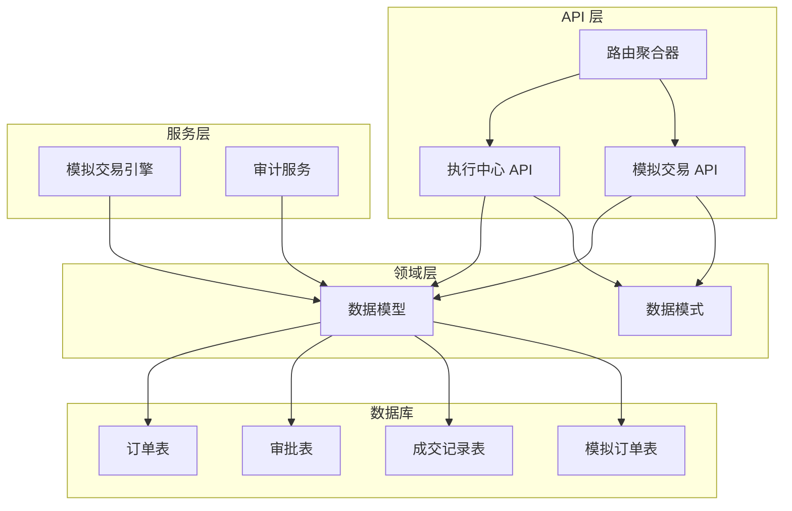
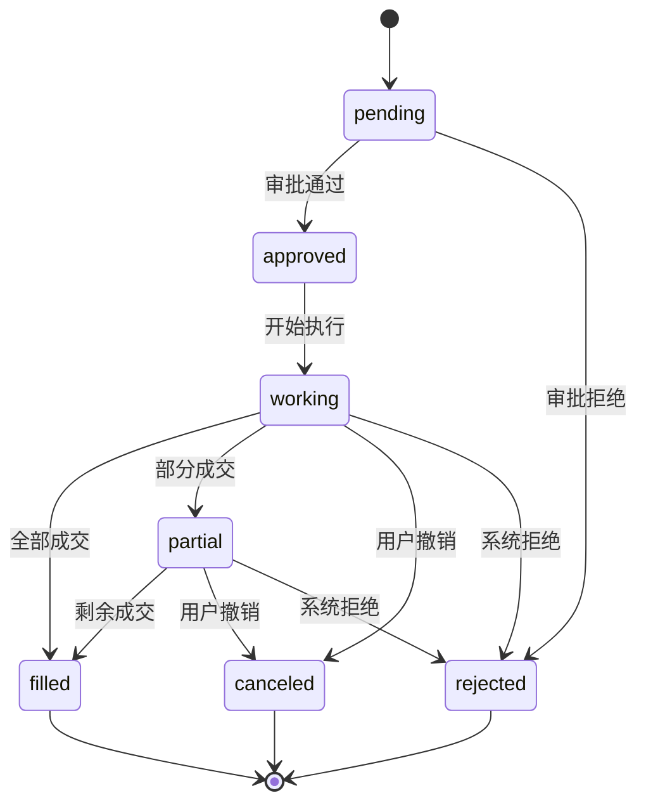
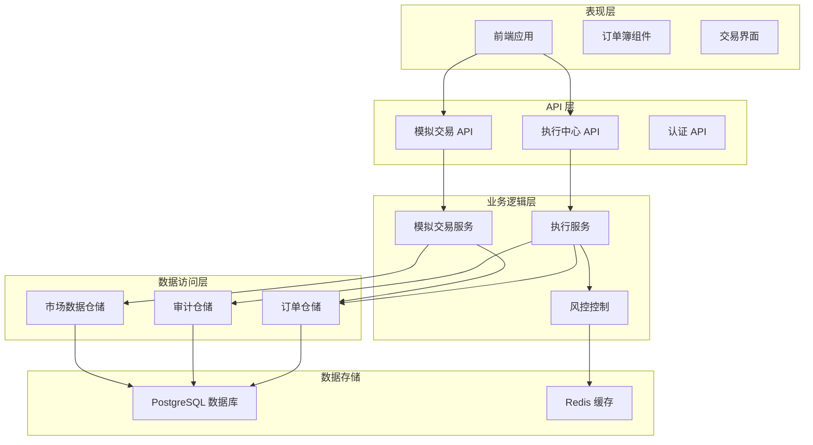
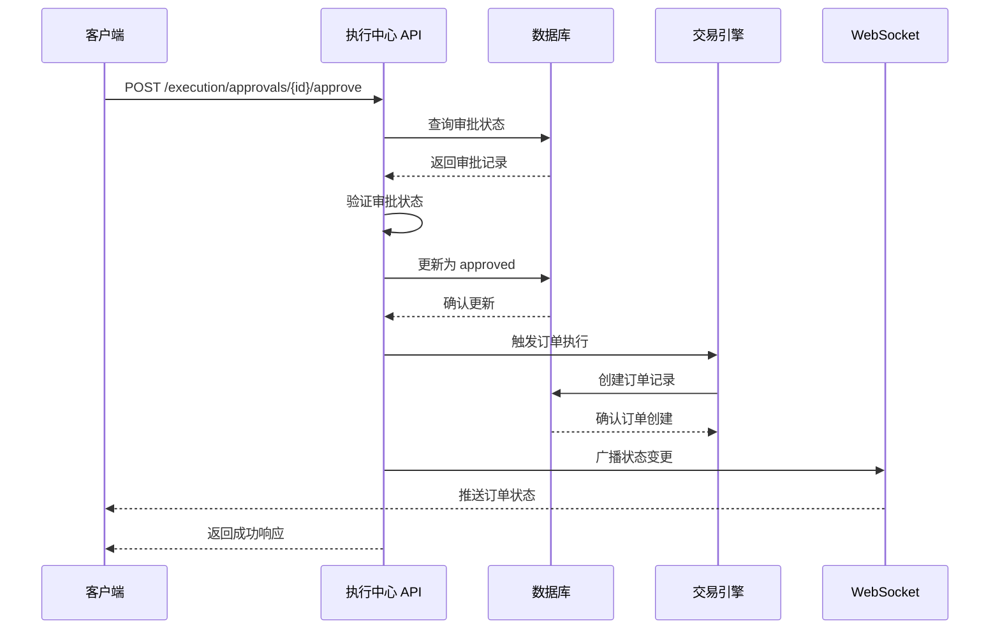
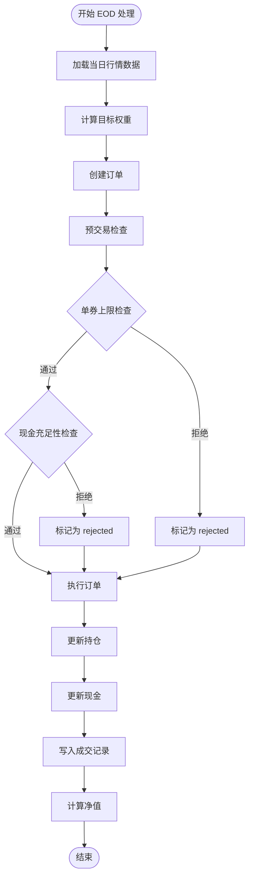
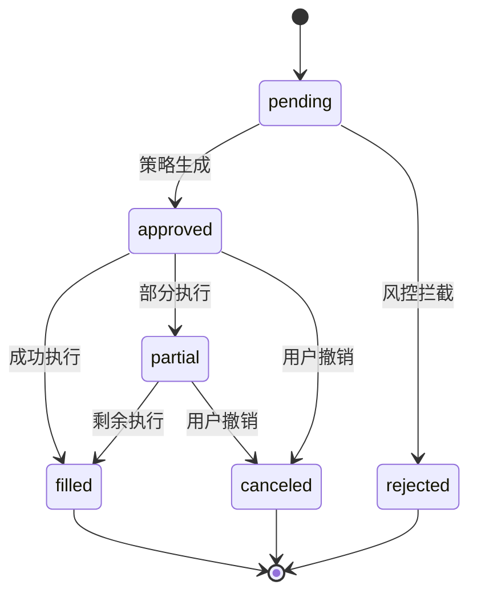
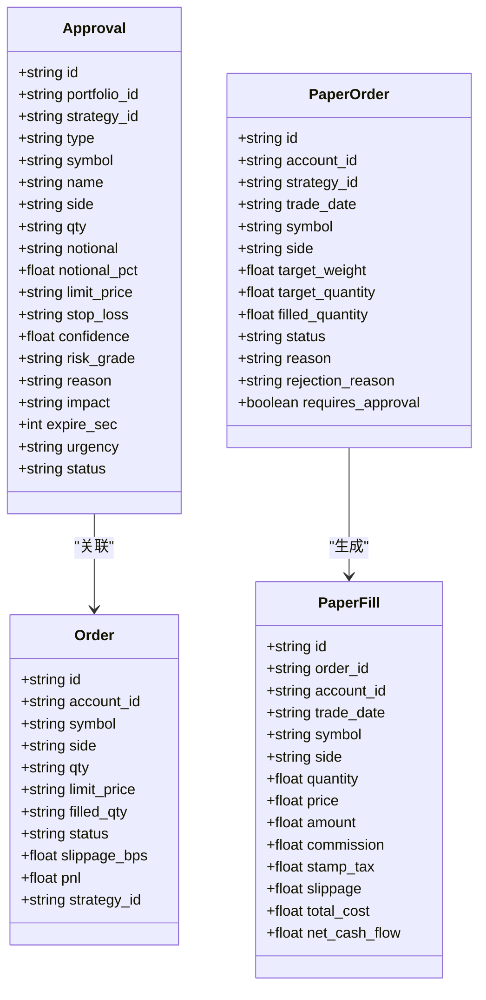
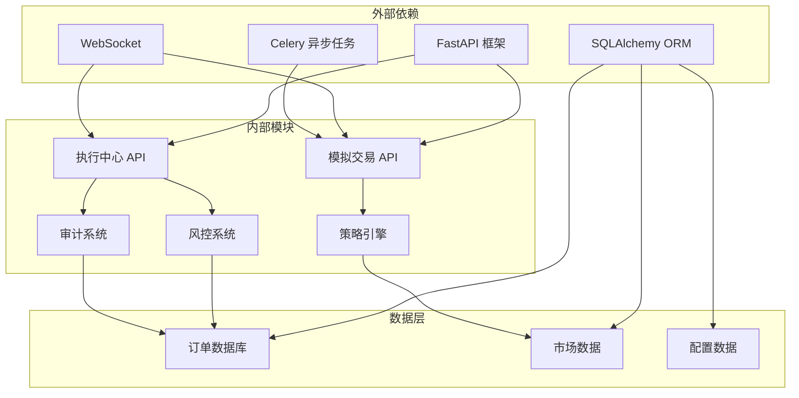

# 订单管理 API

<cite>
**本文档引用的文件**
- [backend/app/api/v1/router.py](file://backend/app/api/v1/router.py)
- [backend/app/api/v1/execution.py](file://backend/app/api/v1/execution.py)
- [backend/app/api/v1/paper.py](file://backend/app/api/v1/paper.py)
- [backend/app/domains/execution/models.py](file://backend/app/domains/execution/models.py)
- [backend/app/domains/execution/schemas.py](file://backend/app/domains/execution/schemas.py)
- [backend/app/domains/execution/paper_models.py](file://backend/app/domains/execution/paper_models.py)
- [backend/app/domains/execution/paper_schemas.py](file://backend/app/domains/execution/paper_schemas.py)
- [backend/app/services/paper_trading.py](file://backend/app/services/paper_trading.py)
- [backend/tests/api/test_screens.py](file://backend/tests/api/test_screens.py)
- [frontend/src/screens/Execution/OrderBook.tsx](file://frontend/src/screens/Execution/OrderBook.tsx)
</cite>

## 目录
1. [简介](#简介)
2. [项目结构](#项目结构)
3. [核心组件](#核心组件)
4. [架构概览](#架构概览)
5. [详细组件分析](#详细组件分析)
6. [依赖关系分析](#依赖关系分析)
7. [性能考虑](#性能考虑)
8. [故障排除指南](#故障排除指南)
9. [结论](#结论)

## 简介

本文件详细描述了量化交易系统中的订单管理 API。该系统支持两种主要的订单类型：实时交易订单和模拟交易订单。订单管理涵盖了完整的生命周期，包括订单创建、审批、执行、状态跟踪和历史查询。

系统采用 FastAPI 构建 RESTful API，使用 SQLAlchemy 进行数据库操作，并通过 WebSocket 实时推送订单状态变更。前端使用 React 构建，提供了直观的订单监控界面。

## 项目结构

订单管理功能分布在以下关键模块中：

**图表来源**
- [backend/app/api/v1/router.py:1-40](file://backend/app/api/v1/router.py#L1-L40)
- [backend/app/api/v1/execution.py:1-281](file://backend/app/api/v1/execution.py#L1-L281)
- [backend/app/api/v1/paper.py:1-276](file://backend/app/api/v1/paper.py#L1-L276)

**章节来源**
- [backend/app/api/v1/router.py:1-40](file://backend/app/api/v1/router.py#L1-L40)

## 核心组件

### 订单类型定义

系统支持多种订单类型，每种类型都有特定的用途和风险特征：

| 订单类型 | 描述 | 风险等级 | 适用场景 |
|---------|------|----------|----------|
| live | 实时交易订单 | 高 | 真实市场交易 |
| paper | 模拟交易订单 | 中 | 策略测试和回测 |
| reduce | 减仓订单 | 低 | 主动降低仓位 |
| add | 增仓订单 | 低 | 主动增加仓位 |
| rotate | 轮换订单 | 中 | 资产配置轮换 |
| hedge | 对冲订单 | 中 | 风险对冲 |
| pause | 暂停订单 | 低 | 临时停止交易 |

### 订单状态转换

订单状态在整个生命周期中会经历以下转换：

**图表来源**
- [backend/app/domains/execution/paper_models.py:64-68](file://backend/app/domains/execution/paper_models.py#L64-L68)
- [backend/app/domains/execution/models.py:45](file://backend/app/domains/execution/models.py#L45)

### 执行质量指标

系统提供全面的执行质量监控指标：

| 指标类别 | 细分指标 | 描述 | 目标值 |
|---------|----------|------|--------|
| 滑点指标 | 平均滑点 | 订单执行价格与市场价格的偏差 | < 5 bps |
| | P50 滑点 | 滑点中位数 | < 3 bps |
| | P95 滑点 | 滑点 95 分位数 | < 15 bps |
| 成交率指标 | 总成交量 | 所有订单的总成交数量 | > 90% |
| | 已成交 | 完全成交的订单比例 | > 70% |
| | 部分成交 | 部分成交的订单比例 | < 15% |
| | 已拒绝 | 被拒绝的订单比例 | < 5% |
| | 已撤销 | 用户主动撤销的订单比例 | < 5% |

**章节来源**
- [backend/app/domains/execution/schemas.py:64-89](file://backend/app/domains/execution/schemas.py#L64-L89)

## 架构概览

订单管理系统采用分层架构设计，确保了清晰的关注点分离和良好的可维护性：

**图表来源**
- [backend/app/api/v1/execution.py:1-281](file://backend/app/api/v1/execution.py#L1-L281)
- [backend/app/api/v1/paper.py:1-276](file://backend/app/api/v1/paper.py#L1-L276)

## 详细组件分析

### 执行中心 API

执行中心负责处理实时交易订单，提供完整的订单生命周期管理：

#### 订单审批流程

**图表来源**
- [backend/app/api/v1/execution.py:223-250](file://backend/app/api/v1/execution.py#L223-L250)

#### 订单簿数据结构

执行中心提供实时订单簿视图，包含以下关键字段：

| 字段名 | 类型 | 描述 | 示例 |
|--------|------|------|------|
| time | string | 订单创建时间 | "14:30:25" |
| symbol | string | 证券代码 | "600036" |
| side | string | 买卖方向 | "BUY" |
| qty | string | 订单数量 | "100" |
| limit | string | 限价价格 | "15.50" |
| filled | string | 已成交数量 | "80" |
| status | string | 订单状态 | "partial" |
| statusTone | string | 状态颜色标识 | "yellow" |
| slippageBps | float | 滑点（基点） | 2.5 |
| pnl | float | 当前盈亏 | 1200.50 |

**章节来源**
- [backend/app/api/v1/execution.py:116-136](file://backend/app/api/v1/execution.py#L116-L136)
- [backend/app/domains/execution/schemas.py:46-57](file://backend/app/domains/execution/schemas.py#L46-L57)

### 模拟交易 API

模拟交易系统提供完整的订单生命周期管理，用于策略测试和验证：

#### EOD 订单生成流程

**图表来源**
- [backend/app/services/paper_trading.py:82-134](file://backend/app/services/paper_trading.py#L82-L134)

#### 模拟订单状态转换

模拟交易中的订单状态转换更加丰富：

**图表来源**
- [backend/app/domains/execution/paper_models.py:64-68](file://backend/app/domains/execution/paper_models.py#L64-L68)

**章节来源**
- [backend/app/api/v1/paper.py:116-147](file://backend/app/api/v1/paper.py#L116-L147)
- [backend/app/services/paper_trading.py:268-312](file://backend/app/services/paper_trading.py#L268-L312)

### 数据模型设计

系统采用 SQLAlchemy ORM 设计，确保了类型安全和良好的性能。

#### 核心数据模型

**图表来源**
- [backend/app/domains/execution/models.py:9-103](file://backend/app/domains/execution/models.py#L9-L103)
- [backend/app/domains/execution/paper_models.py:51-89](file://backend/app/domains/execution/paper_models.py#L51-L89)

**章节来源**
- [backend/app/domains/execution/models.py:34-60](file://backend/app/domains/execution/models.py#L34-L60)
- [backend/app/domains/execution/paper_models.py:51-89](file://backend/app/domains/execution/paper_models.py#L51-L89)

## 依赖关系分析

订单管理系统涉及多个子系统的协作，形成了复杂的依赖关系网络：

**图表来源**
- [backend/app/api/v1/execution.py:1-281](file://backend/app/api/v1/execution.py#L1-L281)
- [backend/app/api/v1/paper.py:1-276](file://backend/app/api/v1/paper.py#L1-L276)

**章节来源**
- [backend/app/api/v1/router.py:5-40](file://backend/app/api/v1/router.py#L5-L40)

## 性能考虑

### 查询优化策略

系统采用了多种查询优化技术来确保高性能：

1. **索引优化**：在常用查询字段上建立数据库索引
2. **分页机制**：默认限制查询结果数量，防止内存溢出
3. **缓存策略**：对热点数据进行缓存
4. **批量操作**：支持批量查询和更新操作

### 并发处理

系统支持高并发场景下的订单处理：

- **异步处理**：使用 asyncio 处理 I/O 密集型操作
- **连接池**：数据库连接池管理
- **限流机制**：防止系统过载
- **超时控制**：设置合理的请求超时时间

## 故障排除指南

### 常见错误类型

| 错误类型 | HTTP 状态码 | 描述 | 解决方案 |
|----------|-------------|------|----------|
| 订单不存在 | 404 | 订单 ID 无效或已被删除 | 验证订单 ID 的有效性 |
| 订单状态错误 | 409 | 订单状态不允许当前操作 | 检查订单当前状态 |
| 参数验证失败 | 422 | 请求参数格式不正确 | 按照 API 文档修正参数 |
| 权限不足 | 403 | 无权访问指定资源 | 检查用户权限设置 |
| 系统内部错误 | 500 | 服务器内部异常 | 查看服务器日志 |

### 调试工具

系统提供了多种调试和监控工具：

1. **审计日志**：完整记录所有订单操作
2. **性能监控**：实时监控系统性能指标
3. **错误追踪**：自动捕获和报告异常
4. **WebSocket 实时推送**：实时获取订单状态变更

**章节来源**
- [backend/app/api/v1/execution.py:223-280](file://backend/app/api/v1/execution.py#L223-L280)
- [backend/tests/api/test_screens.py:192-236](file://backend/tests/api/test_screens.py#L192-L236)

## 结论

订单管理 API 提供了完整的量化交易订单生命周期管理解决方案。系统具有以下优势：

1. **功能完整性**：支持实时和模拟交易，覆盖完整的订单生命周期
2. **架构清晰**：采用分层架构设计，职责明确
3. **性能优秀**：通过多种优化技术确保高并发性能
4. **易于扩展**：模块化设计便于功能扩展和维护
5. **监控完善**：提供全面的监控和审计功能

该系统为量化交易提供了坚实的技术基础，能够满足专业投资者和机构用户的复杂需求。