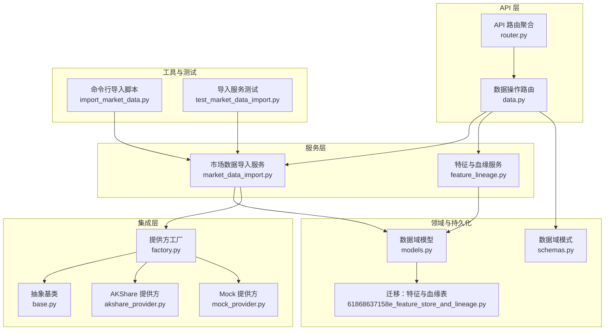
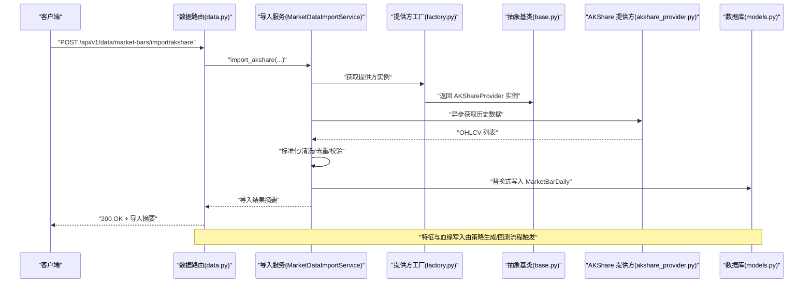
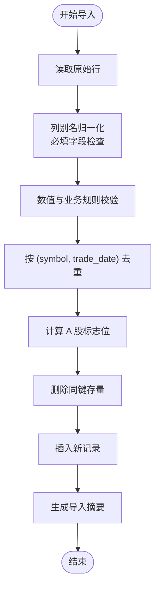
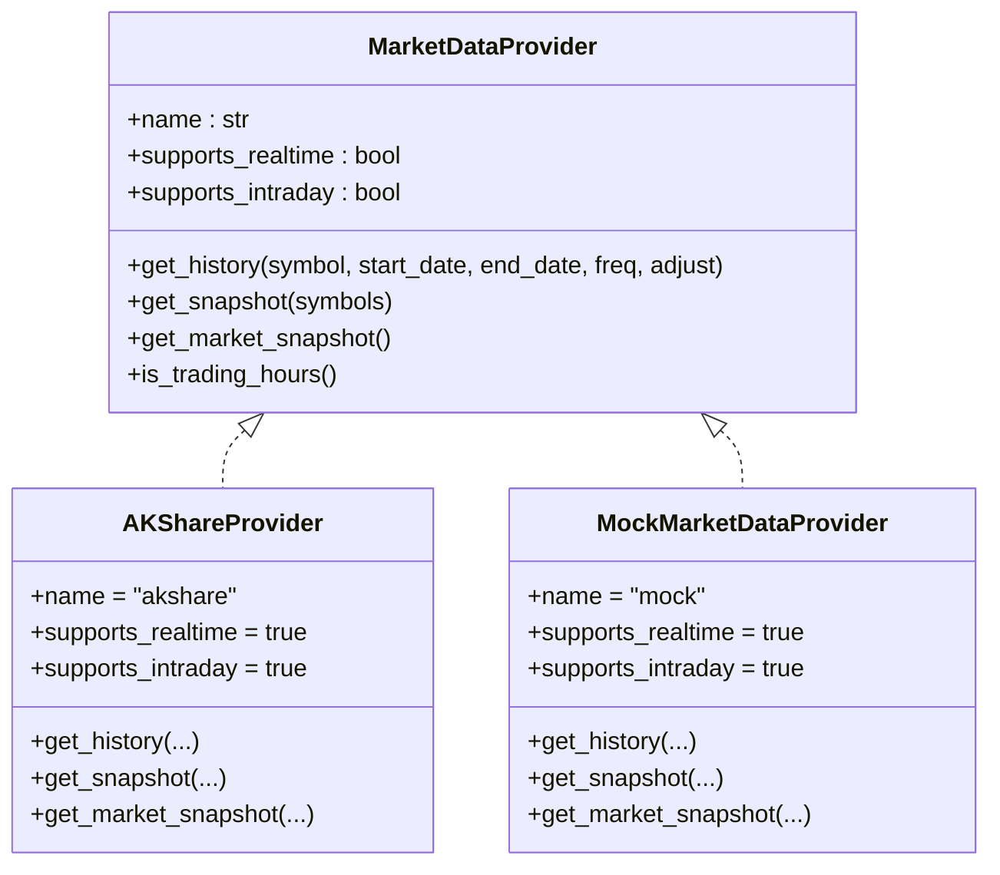
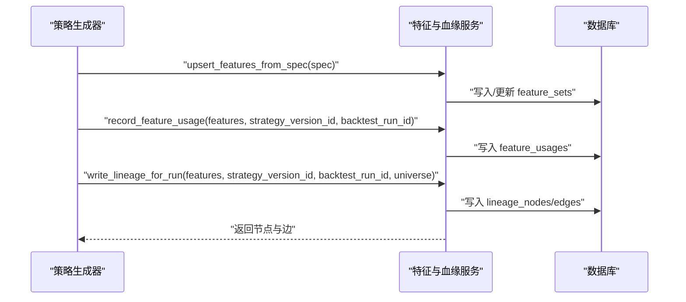
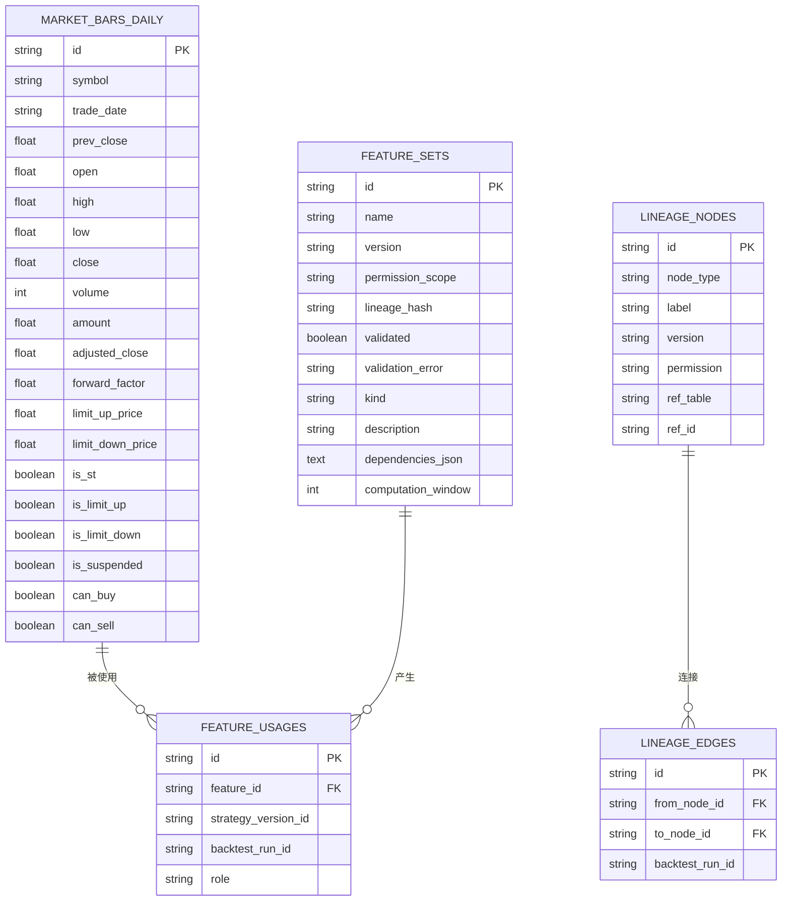
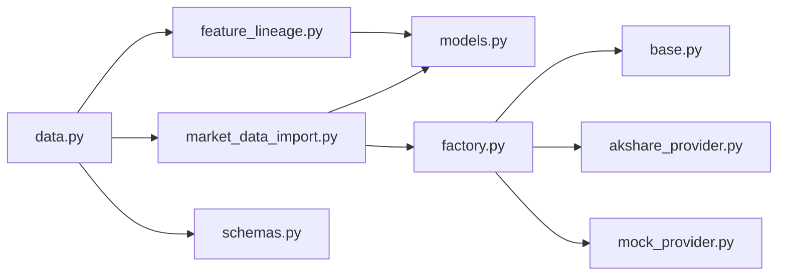

# 数据管理 API

<cite>
**本文引用的文件**   
- [backend/app/api/v1/data.py](file://backend/app/api/v1/data.py)
- [backend/app/services/market_data_import.py](file://backend/app/services/market_data_import.py)
- [backend/app/integrations/market_data/base.py](file://backend/app/integrations/market_data/base.py)
- [backend/app/integrations/market_data/factory.py](file://backend/app/integrations/market_data/factory.py)
- [backend/app/integrations/market_data/akshare_provider.py](file://backend/app/integrations/market_data/akshare_provider.py)
- [backend/app/integrations/market_data/mock_provider.py](file://backend/app/integrations/market_data/mock_provider.py)
- [backend/app/domains/data/models.py](file://backend/app/domains/data/models.py)
- [backend/app/domains/data/schemas.py](file://backend/app/domains/data/schemas.py)
- [backend/app/services/feature_lineage.py](file://backend/app/services/feature_lineage.py)
- [backend/app/db/migrations/versions/61868637158e_feature_store_and_lineage.py](file://backend/app/db/migrations/versions/61868637158e_feature_store_and_lineage.py)
- [backend/app/api/v1/router.py](file://backend/app/api/v1/router.py)
- [backend/app/core/config.py](file://backend/app/core/config.py)
- [backend/scripts/import_market_data.py](file://backend/scripts/import_market_data.py)
- [backend/tests/services/test_market_data_import.py](file://backend/tests/services/test_market_data_import.py)
</cite>

## 目录
1. [简介](#简介)
2. [项目结构](#项目结构)
3. [核心组件](#核心组件)
4. [架构总览](#架构总览)
5. [详细组件分析](#详细组件分析)
6. [依赖分析](#依赖分析)
7. [性能考虑](#性能考虑)
8. [故障排查指南](#故障排查指南)
9. [结论](#结论)
10. [附录](#附录)

## 简介
本文件为“数据管理 API”的权威技术文档，面向需要实现高效数据管理平台接口的开发者。内容覆盖市场数据导入（本地 CSV 与第三方提供商）、清洗与去重、存储与查询、特征存储与数据血缘追踪、数据质量检查、缓存策略与性能优化等主题，并提供数据模型、导入格式与查询接口规范，帮助快速落地生产级数据管线。

## 项目结构
后端采用 FastAPI + SQLAlchemy 异步 ORM 架构，数据域通过领域模型与模式定义清晰分离；市场数据导入由服务层统一处理，提供 CSV 与 AKShare 两种来源；实时行情通过可插拔的市场数据提供方工厂进行抽象与扩展。

**图表来源**
- [backend/app/api/v1/router.py:1-40](file://backend/app/api/v1/router.py#L1-L40)
- [backend/app/api/v1/data.py:1-392](file://backend/app/api/v1/data.py#L1-L392)
- [backend/app/services/market_data_import.py:1-426](file://backend/app/services/market_data_import.py#L1-L426)
- [backend/app/services/feature_lineage.py:1-217](file://backend/app/services/feature_lineage.py#L1-L217)
- [backend/app/integrations/market_data/factory.py:1-57](file://backend/app/integrations/market_data/factory.py#L1-L57)
- [backend/app/integrations/market_data/base.py:1-113](file://backend/app/integrations/market_data/base.py#L1-L113)
- [backend/app/integrations/market_data/akshare_provider.py:1-262](file://backend/app/integrations/market_data/akshare_provider.py#L1-L262)
- [backend/app/integrations/market_data/mock_provider.py:1-109](file://backend/app/integrations/market_data/mock_provider.py#L1-L109)
- [backend/app/domains/data/models.py:1-144](file://backend/app/domains/data/models.py#L1-L144)
- [backend/app/domains/data/schemas.py:1-194](file://backend/app/domains/data/schemas.py#L1-L194)
- [backend/app/db/migrations/versions/61868637158e_feature_store_and_lineage.py:1-112](file://backend/app/db/migrations/versions/61868637158e_feature_store_and_lineage.py#L1-L112)
- [backend/scripts/import_market_data.py:1-53](file://backend/scripts/import_market_data.py#L1-L53)
- [backend/tests/services/test_market_data_import.py:1-134](file://backend/tests/services/test_market_data_import.py#L1-L134)

**章节来源**
- [backend/app/api/v1/router.py:1-40](file://backend/app/api/v1/router.py#L1-L40)
- [backend/app/api/v1/data.py:1-392](file://backend/app/api/v1/data.py#L1-L392)

## 核心组件
- 数据操作路由：提供数据概览、数据源列表、市场日线导入（CSV/AKShare）、市场日线查询、延迟趋势、血缘、符号汇总、特征与使用情况、事件与偏见门等接口。
- 市场数据导入服务：统一 CSV 与 AKShare 的导入流程，包含列别名映射、必填字段校验、数值与日期解析、去重、A 股标志位计算、替换式写入与结果统计。
- 特征存储与血缘：注册特征集、记录特征使用、按回测运行生成血缘链路（raw → cleaned → feature(s) → strategy → run）。
- 市场数据提供方：抽象基类定义历史与快照接口；工厂根据配置选择具体提供方（AKShare、Tushare、Wind 或 Mock）；提供 Sina 批量快照与全市场扫描能力。

**章节来源**
- [backend/app/api/v1/data.py:134-392](file://backend/app/api/v1/data.py#L134-L392)
- [backend/app/services/market_data_import.py:177-426](file://backend/app/services/market_data_import.py#L177-L426)
- [backend/app/services/feature_lineage.py:41-194](file://backend/app/services/feature_lineage.py#L41-L194)
- [backend/app/integrations/market_data/base.py:64-113](file://backend/app/integrations/market_data/base.py#L64-L113)
- [backend/app/integrations/market_data/factory.py:23-57](file://backend/app/integrations/market_data/factory.py#L23-L57)

## 架构总览
下图展示从 API 请求到服务层、提供方与数据库的调用路径，以及特征与血缘的写入流程。

**图表来源**
- [backend/app/api/v1/data.py:175-191](file://backend/app/api/v1/data.py#L175-L191)
- [backend/app/services/market_data_import.py:196-241](file://backend/app/services/market_data_import.py#L196-L241)
- [backend/app/integrations/market_data/factory.py:23-57](file://backend/app/integrations/market_data/factory.py#L23-L57)
- [backend/app/integrations/market_data/akshare_provider.py:152-204](file://backend/app/integrations/market_data/akshare_provider.py#L152-L204)
- [backend/app/domains/data/models.py:40-67](file://backend/app/domains/data/models.py#L40-L67)

## 详细组件分析

### 数据导入与清洗服务
- 支持来源
  - CSV 文件：本地 UTF-8 CSV，自动识别列别名，支持默认符号填充。
  - AKShare：异步抓取 A 股日线，支持复权参数与批量符号。
- 清洗与校验
  - 列别名映射：支持中英文多键名，自动归一化。
  - 必填字段：symbol、trade_date、open、high、low、close、volume。
  - 数值解析：浮点数、成交量、日期格式兼容（含斜杠/点号/8 位数字）。
  - 校验规则：价格必须为正，高低约束，金额非负，复权价格正数。
  - 去重：按 (symbol, trade_date) 去重，保留后者覆盖前者。
  - A 股标志位：前收价、涨停跌停价、是否停牌、是否可买卖。
- 写入策略
  - 先删除同键存量，再插入新记录，保证幂等与一致性。
  - 返回导入摘要：来源、总数、导入数、新增数、更新数、跳过数、符号集合、日期范围、错误明细。

**图表来源**
- [backend/app/services/market_data_import.py:243-290](file://backend/app/services/market_data_import.py#L243-L290)
- [backend/app/services/market_data_import.py:292-422](file://backend/app/services/market_data_import.py#L292-L422)

**章节来源**
- [backend/app/services/market_data_import.py:107-426](file://backend/app/services/market_data_import.py#L107-L426)
- [backend/tests/services/test_market_data_import.py:25-134](file://backend/tests/services/test_market_data_import.py#L25-L134)

### 市场数据提供方与工厂
- 工厂模式：根据配置选择提供方，若未安装或未知则回退至 Mock。
- AKShare 提供方：支持历史、批量快照与全市场扫描；子日线频率通过参数映射。
- Mock 提供方：无网络依赖，生成蓝筹股合成行情，便于测试与演示。

**图表来源**
- [backend/app/integrations/market_data/base.py:64-113](file://backend/app/integrations/market_data/base.py#L64-L113)
- [backend/app/integrations/market_data/akshare_provider.py:145-262](file://backend/app/integrations/market_data/akshare_provider.py#L145-L262)
- [backend/app/integrations/market_data/mock_provider.py:29-109](file://backend/app/integrations/market_data/mock_provider.py#L29-L109)

**章节来源**
- [backend/app/integrations/market_data/factory.py:23-57](file://backend/app/integrations/market_data/factory.py#L23-L57)
- [backend/app/integrations/market_data/akshare_provider.py:1-262](file://backend/app/integrations/market_data/akshare_provider.py#L1-L262)
- [backend/app/integrations/market_data/mock_provider.py:1-109](file://backend/app/integrations/market_data/mock_provider.py#L1-L109)

### 特征存储与数据血缘
- 特征注册：从策略生成规格提取因子，按参数哈希生成版本，写入特征集表。
- 使用记录：将特征与策略版本及回测运行关联，形成使用清单。
- 血缘链路：raw → cleaned → feature(s) → strategy → run，边附加回测运行 ID，支持按运行查询。

**图表来源**
- [backend/app/services/feature_lineage.py:41-194](file://backend/app/services/feature_lineage.py#L41-L194)
- [backend/app/domains/data/models.py:81-144](file://backend/app/domains/data/models.py#L81-L144)
- [backend/app/db/migrations/versions/61868637158e_feature_store_and_lineage.py:33-93](file://backend/app/db/migrations/versions/61868637158e_feature_store_and_lineage.py#L33-L93)

**章节来源**
- [backend/app/services/feature_lineage.py:1-217](file://backend/app/services/feature_lineage.py#L1-L217)
- [backend/app/domains/data/models.py:81-144](file://backend/app/domains/data/models.py#L81-L144)
- [backend/app/db/migrations/versions/61868637158e_feature_store_and_lineage.py:1-112](file://backend/app/db/migrations/versions/61868637158e_feature_store_and_lineage.py#L1-L112)

### 数据模型与查询接口
- 数据模型
  - 市场日线：唯一索引 (symbol, trade_date)，包含前收、开盘、最高、最低、收盘、成交量、成交额、复权价与因子、涨跌停与停牌状态、买卖权限等。
  - 特征集：名称、版本、权限范围、校验状态、类型、描述、依赖 JSON、计算窗口等。
  - 特征使用：关联特征集与策略版本/回测运行。
  - 血缘节点/边：记录数据流链路，支持按回测运行过滤。
- 查询接口
  - GET /api/v1/data/overview：数据概览、分层统计、KPI、事件与偏见门。
  - GET /api/v1/data/sources：数据源列表。
  - GET /api/v1/data/latency-trend：延迟趋势。
  - GET /api/v1/data/lineage：全局血缘图。
  - GET /api/v1/data/incidents：数据事件。
  - GET /api/v1/data/bias-gates：偏见门检查。
  - GET /api/v1/data/symbols：符号汇总（去重计数、起止日期）。
  - GET /api/v1/data/features：特征清单。
  - GET /api/v1/data/features/usages：特征使用清单（可按策略版本/回测运行过滤）。
  - GET /api/v1/data/market-bars：市场日线查询（支持 symbol、日期范围、limit）。
  - POST /api/v1/data/market-bars/import/csv：CSV 导入。
  - POST /api/v1/data/market-bars/import/akshare：AKShare 导入。

**图表来源**
- [backend/app/domains/data/models.py:40-144](file://backend/app/domains/data/models.py#L40-L144)

**章节来源**
- [backend/app/api/v1/data.py:134-392](file://backend/app/api/v1/data.py#L134-L392)
- [backend/app/domains/data/models.py:1-144](file://backend/app/domains/data/models.py#L1-L144)
- [backend/app/domains/data/schemas.py:1-194](file://backend/app/domains/data/schemas.py#L1-L194)

## 依赖分析
- 组件耦合
  - API 路由依赖服务层；服务层依赖领域模型与提供方工厂；提供方工厂依赖抽象基类与具体提供方实现。
  - 特征与血缘服务独立于 API，但与数据库模型紧密耦合。
- 外部依赖
  - 可选依赖：AKShare（用于免费 A 股行情），未安装时回退 Mock。
  - 配置项：市场数据提供方、轮询间隔、Tushare Token 等。
- 循环依赖
  - 未发现循环依赖；模块职责清晰，接口边界明确。

**图表来源**
- [backend/app/api/v1/data.py:1-42](file://backend/app/api/v1/data.py#L1-L42)
- [backend/app/services/market_data_import.py:1-20](file://backend/app/services/market_data_import.py#L1-L20)
- [backend/app/services/feature_lineage.py:1-25](file://backend/app/services/feature_lineage.py#L1-L25)
- [backend/app/integrations/market_data/factory.py:1-20](file://backend/app/integrations/market_data/factory.py#L1-L20)
- [backend/app/integrations/market_data/base.py:1-15](file://backend/app/integrations/market_data/base.py#L1-L15)

**章节来源**
- [backend/app/api/v1/data.py:1-42](file://backend/app/api/v1/data.py#L1-L42)
- [backend/app/services/market_data_import.py:1-20](file://backend/app/services/market_data_import.py#L1-L20)
- [backend/app/services/feature_lineage.py:1-25](file://backend/app/services/feature_lineage.py#L1-L25)
- [backend/app/integrations/market_data/factory.py:1-20](file://backend/app/integrations/market_data/factory.py#L1-L20)

## 性能考虑
- 导入性能
  - 批量导入：先删除同键存量，再一次性 flush，减少事务次数。
  - 异步抓取：AKShare 通过线程池包装同步调用，避免阻塞事件循环。
  - 去重与校验：内存中完成，避免多次 IO。
- 查询性能
  - 市场日线：对 symbol 与 trade_date 建有唯一索引，查询与排序具备良好性能。
  - 分页与限制：默认 limit 1000，最大 5000，避免大结果集。
- 缓存策略
  - 实时行情：建议在应用层或边缘层缓存热点符号的快照，降低第三方 API 压力。
  - 行情预热：全市场扫描仅用于初始化或仪表盘，不应在高频轮询中使用。
- 并发与稳定性
  - 提供方调用设置超时；批量请求合并以降低网络开销。
  - 导入失败与错误明细返回，便于定位问题。

[本节为通用性能指导，不直接分析具体文件]

## 故障排查指南
- 常见错误与处理
  - CSV 文件不存在或非文件：返回 404。
  - 导入失败（如缺少必填字段、数值非法、日期格式错误）：返回 400，并在摘要中列出错误明细。
  - AKShare 未安装：提示安装可选包或改用 CSV 导入。
  - 回测运行无血缘：按运行 ID 查询不到边时返回 404。
- 定位方法
  - 查看导入摘要中的错误列表，逐行定位问题。
  - 使用命令行脚本进行离线导入与验证。
  - 单元测试覆盖了去重、替换、标志位等关键逻辑，可参考断言与期望行为。
- 建议
  - 在导入前对 CSV 进行预检（列名、空值、重复键）。
  - 对长周期回测，优先使用 CSV 导入以规避第三方限流。

**章节来源**
- [backend/app/api/v1/data.py:168-172](file://backend/app/api/v1/data.py#L168-L172)
- [backend/app/services/market_data_import.py:21-23](file://backend/app/services/market_data_import.py#L21-L23)
- [backend/app/services/market_data_import.py:137-141](file://backend/app/services/market_data_import.py#L137-L141)
- [backend/tests/services/test_market_data_import.py:25-134](file://backend/tests/services/test_market_data_import.py#L25-L134)

## 结论
该数据管理 API 以清晰的分层设计实现了从数据源接入、清洗校验、持久化到查询与特征/血缘管理的完整闭环。通过可插拔的提供方工厂与严格的导入校验，既满足研究层的灵活性，又保障生产环境的稳定性。配合完善的查询接口与可观测性指标，可快速搭建高性能、可追溯的数据平台。

[本节为总结性内容，不直接分析具体文件]

## 附录

### 接口规范与示例

- 获取数据概览
  - 方法与路径：GET /api/v1/data/overview
  - 响应：DataScreen（包含 header、tiers、kpis、sources、latencyTrend、biasGate、lineage、incidents）
- 获取数据源列表
  - 方法与路径：GET /api/v1/data/sources
  - 响应：DataSourceOut[]
- 获取延迟趋势
  - 方法与路径：GET /api/v1/data/latency-trend
  - 响应：LatencyTrend
- 获取血缘图
  - 方法与路径：GET /api/v1/data/lineage
  - 响应：LineageOut
- 获取事件
  - 方法与路径：GET /api/v1/data/incidents
  - 响应：DataIncidentOut[]
- 获取偏见门
  - 方法与路径：GET /api/v1/data/bias-gates
  - 响应：BiasGate[]
- 符号汇总
  - 方法与路径：GET /api/v1/data/symbols?limit=500
  - 响应：SymbolSummary[]
- 特征清单
  - 方法与路径：GET /api/v1/data/features?limit=50
  - 响应：FeatureOut[]
- 特征使用清单
  - 方法与路径：GET /api/v1/data/features/usages?strategyVersionId=&backtestRunId=
  - 响应：FeatureUsageOut[]
- 市场日线查询
  - 方法与路径：GET /api/v1/data/market-bars?symbol=&startDate=&endDate=&limit=1000
  - 响应：MarketBarDailyOut[]
- CSV 导入
  - 方法与路径：POST /api/v1/data/market-bars/import/csv
  - 请求体：MarketDataCsvImportIn
  - 响应：MarketDataImportSummary
- AKShare 导入
  - 方法与路径：POST /api/v1/data/market-bars/import/akshare
  - 请求体：MarketDataAkshareImportIn
  - 响应：MarketDataImportSummary

**章节来源**
- [backend/app/api/v1/data.py:134-392](file://backend/app/api/v1/data.py#L134-L392)
- [backend/app/domains/data/schemas.py:128-194](file://backend/app/domains/data/schemas.py#L128-L194)

### 导入格式与字段说明
- CSV 字段别名
  - symbol：symbol/code/ticker/sec_code/股票代码/代码
  - trade_date：trade_date/date/datetime/time/日期/交易日期
  - open/high/low/close：open/open_price/开盘/开盘价 等
  - volume/amount：volume/vol/成交量 与 amount/turnover/成交额
  - adjusted_close/forward_factor/is_st：复权收盘、复权因子、是否 ST
- 必填字段：symbol、trade_date、open、high、low、close、volume
- 日期格式：支持 ISO、斜杠/点号分隔、8 位纯数字（自动补 20xx-xx-xx）
- 数值规则：价格与成交量需为有限正值，amount 与 adjusted_close 非负，低<=高，开盘/收盘不超过最高，不低于最低

**章节来源**
- [backend/app/services/market_data_import.py:90-105](file://backend/app/services/market_data_import.py#L90-L105)
- [backend/app/services/market_data_import.py:292-403](file://backend/app/services/market_data_import.py#L292-L403)

### 配置与运行
- 配置项
  - market_data_provider：akshare（默认）、tushare、wind、mock
  - market_data_poll_interval：交易时段报价轮询间隔（秒）
  - tushare_token：当 provider 为 tushare 时必需
- 命令行导入
  - python scripts/import_market_data.py csv <path> [--default-symbol]
  - python scripts/import_market_data.py akshare --symbols ... --start-date YYYY-MM-DD --end-date YYYY-MM-DD [--adjust qfq|hfq|空]

**章节来源**
- [backend/app/core/config.py:80-86](file://backend/app/core/config.py#L80-L86)
- [backend/scripts/import_market_data.py:14-53](file://backend/scripts/import_market_data.py#L14-L53)