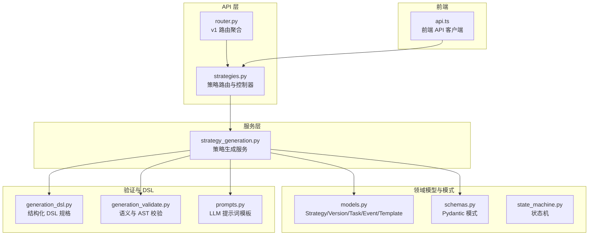
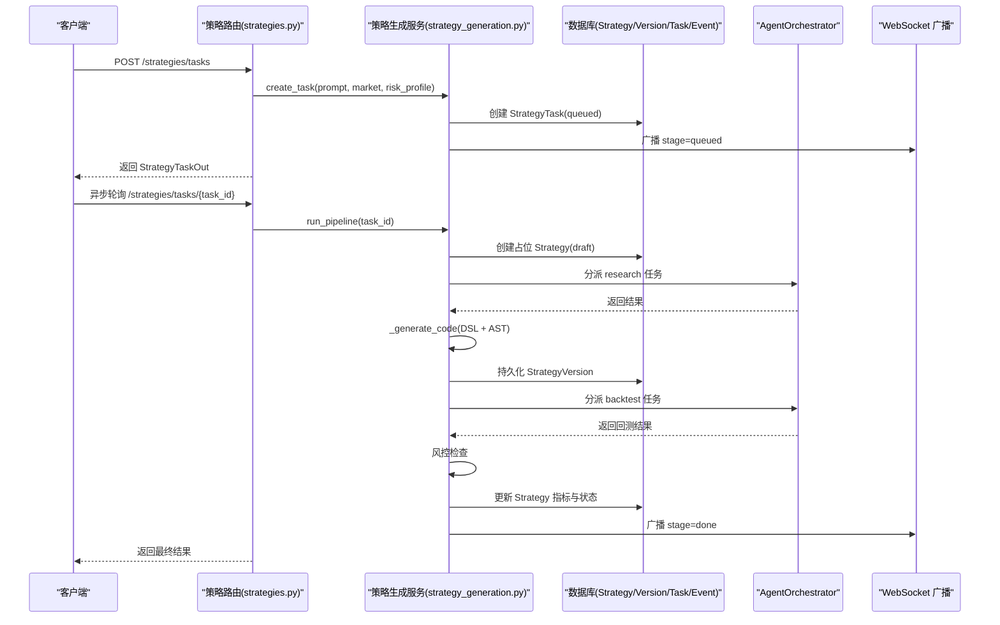
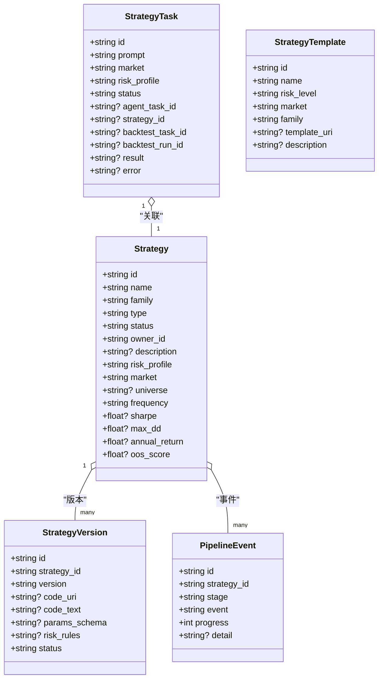
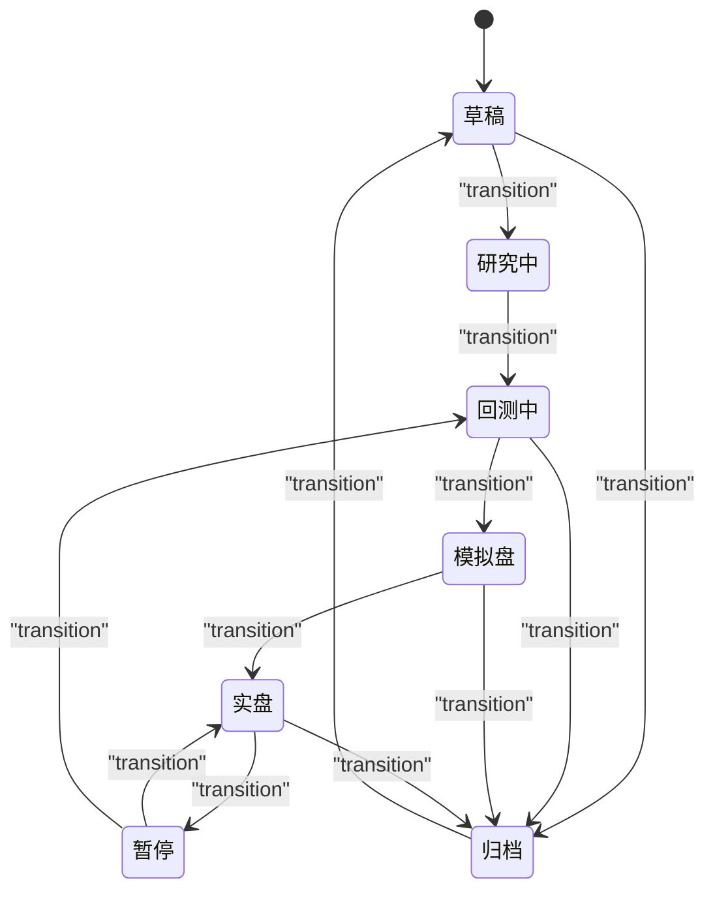
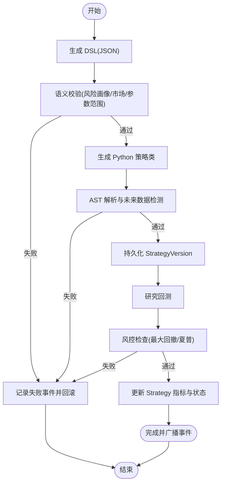
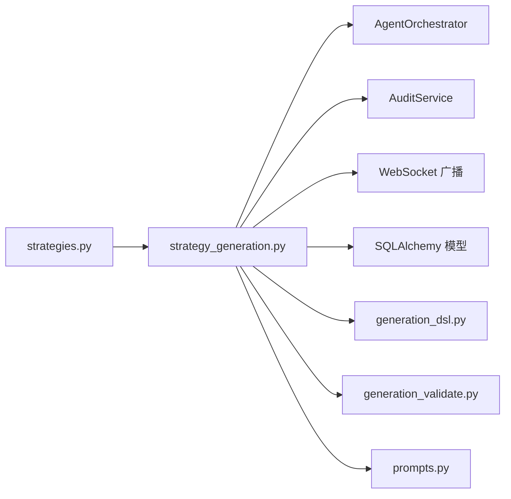

# 策略 API

<cite>
**本文档引用的文件**
- [strategies.py](file://backend/app/api/v1/strategies.py)
- [router.py](file://backend/app/api/v1/router.py)
- [models.py](file://backend/app/domains/strategy/models.py)
- [schemas.py](file://backend/app/domains/strategy/schemas.py)
- [state_machine.py](file://backend/app/domains/strategy/state_machine.py)
- [strategy_generation.py](file://backend/app/services/strategy_generation.py)
- [generation_dsl.py](file://backend/app/domains/strategy/generation_dsl.py)
- [generation_validate.py](file://backend/app/domains/strategy/generation_validate.py)
- [prompts.py](file://backend/app/integrations/llm/prompts.py)
- [api.ts](file://frontend/src/lib/api.ts)
</cite>

## 目录
1. [简介](#简介)
2. [项目结构](#项目结构)
3. [核心组件](#核心组件)
4. [架构总览](#架构总览)
5. [详细组件分析](#详细组件分析)
6. [依赖分析](#依赖分析)
7. [性能考虑](#性能考虑)
8. [故障排查指南](#故障排查指南)
9. [结论](#结论)
10. [附录](#附录)

## 简介
本文件面向开发者与产品人员，系统化梳理“策略工厂”RESTful API 的设计与实现，覆盖策略的创建、更新、删除与查询，策略版本管理、状态流转、审批流程与生命周期管理，并深入解析策略代码生成、自然语言描述处理、AI Agent 协作与策略验证机制。文档同时提供策略数据模型、请求参数规范、响应格式与错误处理说明，帮助快速理解策略工厂的完整 API 接口体系。

## 项目结构
策略 API 位于后端 FastAPI 路由模块中，通过统一的 v1 路由聚合器对外暴露。核心文件组织如下：
- API 层：负责路由定义、请求参数解析、响应序列化与业务异常转换
- 服务层：编排策略生成流水线，协调 Agent、审计与 WebSocket 广播
- 领域模型与模式：定义策略、版本、任务、事件与模板的数据结构与约束
- 验证与 DSL：对自然语言到结构化规格再到代码的多层验证
- 前端对接：提供与前端交互的 API 客户端封装

图表来源
- [router.py:23-40](file://backend/app/api/v1/router.py#L23-L40)
- [strategies.py:45-605](file://backend/app/api/v1/strategies.py#L45-L605)
- [strategy_generation.py:86-584](file://backend/app/services/strategy_generation.py#L86-L584)
- [models.py:9-84](file://backend/app/domains/strategy/models.py#L9-L84)
- [schemas.py:66-208](file://backend/app/domains/strategy/schemas.py#L66-L208)
- [state_machine.py:4-23](file://backend/app/domains/strategy/state_machine.py#L4-L23)
- [generation_dsl.py:78-144](file://backend/app/domains/strategy/generation_dsl.py#L78-L144)
- [generation_validate.py:48-216](file://backend/app/domains/strategy/generation_validate.py#L48-L216)
- [prompts.py:3-94](file://backend/app/integrations/llm/prompts.py#L3-L94)
- [api.ts:582-617](file://frontend/src/lib/api.ts#L582-L617)

章节来源
- [router.py:23-40](file://backend/app/api/v1/router.py#L23-L40)
- [strategies.py:45-605](file://backend/app/api/v1/strategies.py#L45-L605)

## 核心组件
- 策略路由与控制器：提供策略的创建、查询、更新、删除与列表；支持状态流转与事件查询；支持生成任务创建与进度查询；支持模板与流水线看板数据。
- 策略生成服务：编排从自然语言到结构化 DSL、Python 策略类、静态与接口校验、版本持久化、研究回测、风险控制、指标回填与发布。
- 领域模型与模式：Strategy、StrategyVersion、StrategyTask、PipelineEvent、StrategyTemplate；以及与前端对接的 Pydantic 模式。
- 状态机：定义策略生命周期状态与合法转移集合。
- DSL 与验证：结构化策略规格、语义校验（风险画像、市场限制、参数范围）、AST 校验（禁止使用未来数据）。
- 前端对接：提供策略相关 API 的客户端封装，包括任务查询、事件流、过渡与详情等。

章节来源
- [strategies.py:162-605](file://backend/app/api/v1/strategies.py#L162-L605)
- [strategy_generation.py:86-584](file://backend/app/services/strategy_generation.py#L86-L584)
- [models.py:9-84](file://backend/app/domains/strategy/models.py#L9-L84)
- [schemas.py:66-208](file://backend/app/domains/strategy/schemas.py#L66-L208)
- [state_machine.py:4-23](file://backend/app/domains/strategy/state_machine.py#L4-L23)
- [generation_dsl.py:78-144](file://backend/app/domains/strategy/generation_dsl.py#L78-L144)
- [generation_validate.py:48-216](file://backend/app/domains/strategy/generation_validate.py#L48-L216)
- [api.ts:582-617](file://frontend/src/lib/api.ts#L582-L617)

## 架构总览
策略工厂 API 的核心流程围绕“自然语言 -> 结构化规格 -> Python 策略类 -> 静态/语义校验 -> 版本快照 -> 研究回测 -> 风控 -> 指标回填 -> 发布”的流水线展开。API 层负责接收请求、调用服务层执行流水线、持久化结果并广播事件；服务层协调 Agent、审计与 WebSocket 广播；模型与模式确保数据一致性与可追踪性。

图表来源
- [strategies.py:301-335](file://backend/app/api/v1/strategies.py#L301-L335)
- [strategy_generation.py:132-374](file://backend/app/services/strategy_generation.py#L132-L374)
- [strategy_generation.py:445-514](file://backend/app/services/strategy_generation.py#L445-L514)

## 详细组件分析

### 策略 API 路由与端点
- 策略概览与看板
  - GET /strategies/overview：返回流水线状态计数、模板、消息流、矩阵与看板数据
- 模板与消息流
  - GET /strategies/templates：返回策略模板列表
  - GET /strategies/feed：返回最近 Agent 消息流
- 生成任务
  - POST /strategies/tasks：创建生成任务并后台运行流水线
  - GET /strategies/tasks/{task_id}：查询任务状态与进度
- 列表与详情
  - GET /strategies：分页列出策略，支持按状态、家族、市场、关键词过滤
  - GET /strategies/{strategy_id}：返回策略详情（含版本与最近事件）
- 状态流转与事件
  - POST /strategies/{strategy_id}/transition：手动推进策略状态
  - GET /strategies/{strategy_id}/events：查询策略流水线事件
- CRUD
  - POST /strategies：创建策略草稿
  - PUT/PATCH /strategies/{strategy_id}：部分更新策略
  - DELETE /strategies/{strategy_id}：软删除策略

章节来源
- [strategies.py:162-605](file://backend/app/api/v1/strategies.py#L162-L605)

### 策略数据模型与模式
- 模型
  - Strategy：策略主记录，包含名称、家族、类型、状态、风险画像、市场、交易频度、收益指标等
  - StrategyVersion：不可变版本快照，保存代码文本、参数模式、风控规则
  - StrategyTask：自然语言生成任务，记录状态与关联的回测任务
  - PipelineEvent：策略流水线事件，记录阶段、事件、进度与详情
  - StrategyTemplate：预设模板
- 模式
  - Pydantic 模式用于请求体与响应体的序列化与校验，如 StrategyCreate、StrategyUpdate、StrategyDetail、StrategyTaskOut、StrategyVersionOut、PipelineEventOut、StrategyTransition 等

图表来源
- [models.py:9-84](file://backend/app/domains/strategy/models.py#L9-L84)

章节来源
- [models.py:9-84](file://backend/app/domains/strategy/models.py#L9-L84)
- [schemas.py:66-208](file://backend/app/domains/strategy/schemas.py#L66-L208)

### 策略版本管理与生命周期
- 版本管理
  - 生成阶段先持久化 StrategyVersion，确保回测可引用该版本
  - 版本不可变，仅保存代码文本、参数模式与风控规则
- 生命周期与状态机
  - 支持 draft、backtesting、paper、live、paused、archived 状态
  - 状态机定义合法转移，如 draft 可转入 backtesting/archived；backtesting 可转入 paper/draft/archived
- 审批与事件
  - 状态变更会写入 PipelineEvent，便于审计与可视化
  - 手动更新策略时，若状态变化则记录事件并携带 trace_id

图表来源
- [state_machine.py:4-23](file://backend/app/domains/strategy/state_machine.py#L4-L23)
- [strategies.py:422-447](file://backend/app/api/v1/strategies.py#L422-L447)

章节来源
- [state_machine.py:4-23](file://backend/app/domains/strategy/state_machine.py#L4-L23)
- [strategies.py:422-447](file://backend/app/api/v1/strategies.py#L422-L447)

### 自然语言到策略代码的流水线
- 结构化 DSL 生成
  - 使用 LLM 生成符合 StrategyGenerationSpec 的 JSON，随后进行语义校验与参数范围检查
- Python 策略类生成
  - 基于 DSL 与提示词模板生成 Python 类，要求满足合约方法签名与禁止未来数据使用
- 静态与接口校验
  - AST 解析与关键调用模式检测，确保不使用负移位、前向差分等未来数据
- 版本持久化与回测
  - 持久化 StrategyVersion，执行研究回测，提取指标并写回 Strategy
- 风控与发布
  - 基于风险画像上限进行风控检查，通过后进入 backtesting 状态并广播完成事件

图表来源
- [strategy_generation.py:132-374](file://backend/app/services/strategy_generation.py#L132-L374)
- [generation_validate.py:107-216](file://backend/app/domains/strategy/generation_validate.py#L107-L216)
- [prompts.py:3-94](file://backend/app/integrations/llm/prompts.py#L3-L94)

章节来源
- [strategy_generation.py:132-374](file://backend/app/services/strategy_generation.py#L132-L374)
- [generation_validate.py:48-216](file://backend/app/domains/strategy/generation_validate.py#L48-L216)
- [prompts.py:3-94](file://backend/app/integrations/llm/prompts.py#L3-L94)

### 请求参数规范与响应格式
- 创建策略草稿
  - 方法：POST /strategies
  - 请求体：StrategyCreate（name、family、type、description、risk_profile、market、universe、frequency）
  - 响应：{"strategy_id": "...", "status": "draft"}
- 部分更新策略
  - 方法：PUT|PATCH /strategies/{strategy_id}
  - 请求体：StrategyUpdate（可选字段 name、family、description、riskProfile、market、universe、frequency、status）
  - 响应：StrategyDetail
- 删除策略
  - 方法：DELETE /strategies/{strategy_id}
  - 响应：{"strategy_id": "...", "deleted": "true"}
- 创建生成任务
  - 方法：POST /strategies/tasks
  - 请求体：StrategyTaskCreate（prompt、market、riskProfile）
  - 响应：StrategyTaskOut
- 查询任务
  - 方法：GET /strategies/tasks/{task_id}
  - 响应：StrategyTaskOut
- 查询策略详情
  - 方法：GET /strategies/{strategy_id}
  - 响应：StrategyDetail（包含 versions、recentEvents）
- 查询策略列表
  - 方法：GET /strategies
  - 查询参数：status、family、market、q、page、page_size
  - 响应：StrategyListResponse（total、items）
- 状态流转
  - 方法：POST /strategies/{strategy_id}/transition
  - 请求体：StrategyTransition（target、note）
  - 响应：{"strategy_id": "...", "status": "..."}
- 查询事件
  - 方法：GET /strategies/{strategy_id}/events
  - 响应：PipelineEventOut[]

章节来源
- [strategies.py:301-605](file://backend/app/api/v1/strategies.py#L301-L605)
- [schemas.py:66-208](file://backend/app/domains/strategy/schemas.py#L66-L208)

### 错误处理与异常
- HTTP 异常
  - 404：策略或任务不存在时抛出 HTTPException
  - 422：请求体校验失败（Pydantic）
- 流水线异常
  - LLMException：包装 LLM 生成、DSL 校验、AST 校验、回测数据缺失等异常
  - 失败阶段判定：根据异常类型与消息关键字自动映射到 stage/risk/backtest/static_check/pipeline
  - 记录 PipelineEvent 与审计日志，状态回退至 draft
- 前端容错
  - 任务查询失败时返回兜底对象，避免前端崩溃

章节来源
- [strategy_generation.py:308-374](file://backend/app/services/strategy_generation.py#L308-L374)
- [strategies.py:324-334](file://backend/app/api/v1/strategies.py#L324-L334)
- [api.ts:582-592](file://frontend/src/lib/api.ts#L582-L592)

## 依赖分析
- 组件耦合
  - API 路由依赖服务层与领域模式；服务层依赖 AgentOrchestrator、审计服务、WebSocket 广播与回测引擎
  - 领域模型与模式相互独立，通过外键与索引建立关系
- 外部依赖
  - LLM 提供商：用于结构化 DSL 与策略类生成
  - 数据库：SQLAlchemy 异步会话
  - WebSocket：实时事件广播
- 循环依赖
  - 未发现循环导入；各模块职责清晰

图表来源
- [strategies.py:42-43](file://backend/app/api/v1/strategies.py#L42-L43)
- [strategy_generation.py:86-584](file://backend/app/services/strategy_generation.py#L86-L584)

章节来源
- [strategies.py:42-43](file://backend/app/api/v1/strategies.py#L42-L43)
- [strategy_generation.py:86-584](file://backend/app/services/strategy_generation.py#L86-L584)

## 性能考虑
- 异步数据库访问：使用 SQLAlchemy 异步会话，减少阻塞
- 任务异步执行：生成任务在后台协程中运行，API 快速返回
- 事件广播：WebSocket 广播采用异步发送，失败不阻塞主流程
- 分页与过滤：列表接口支持分页与多维过滤，降低单次响应体积
- 风控阈值：基于风险画像的上限控制，避免无效回测

## 故障排查指南
- 任务长时间处于 queued/running
  - 检查 LLM 提供商可用性与限流
  - 查看 AgentOrchestrator 是否成功分派与完成任务
- 生成失败
  - 关注 PipelineEvent 中的 stage 与 detail，定位失败阶段
  - 检查 DSL 语义校验与 AST 校验是否通过
- 回测失败
  - 检查市场数据可用性与回测配置
- 风控不通过
  - 调整风险画像或策略参数，降低最大回撤或提升夏普比率
- 前端无法获取任务详情
  - 使用兜底返回或检查 WebSocket 连接与轮询逻辑

章节来源
- [strategy_generation.py:308-374](file://backend/app/services/strategy_generation.py#L308-L374)
- [api.ts:582-592](file://frontend/src/lib/api.ts#L582-L592)

## 结论
策略工厂 API 以清晰的流水线与严谨的验证机制为核心，实现了从自然语言到可执行策略的自动化生产。通过版本快照、事件追踪与状态机控制，系统保证了策略的可追溯性与合规性。建议在生产环境中进一步完善回测引擎与风控规则的统一，持续优化 LLM 提示词与校验策略，以提升生成质量与稳定性。

## 附录
- 前端 API 客户端
  - 提供策略模板、任务查询、事件流、状态过渡与详情等调用封装
- 提示词模板
  - 包含策略生成与 DSL 生成的系统提示与用户提示，确保输出结构化与合规

章节来源
- [api.ts:582-617](file://frontend/src/lib/api.ts#L582-L617)
- [prompts.py:3-94](file://backend/app/integrations/llm/prompts.py#L3-L94)