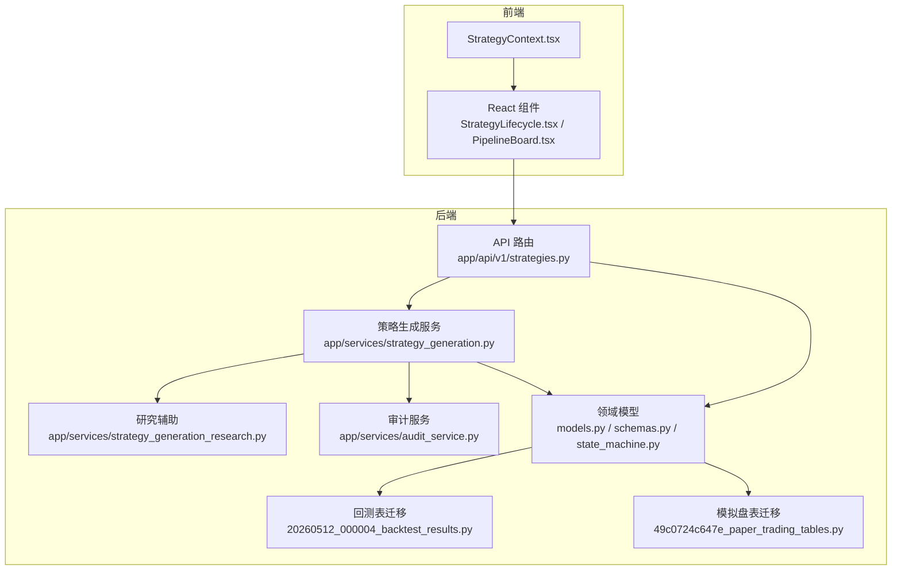
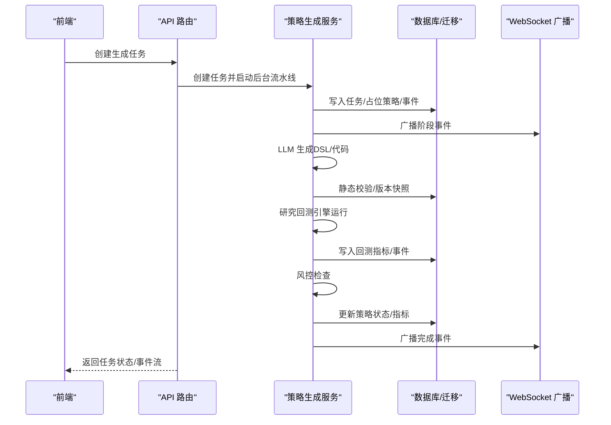
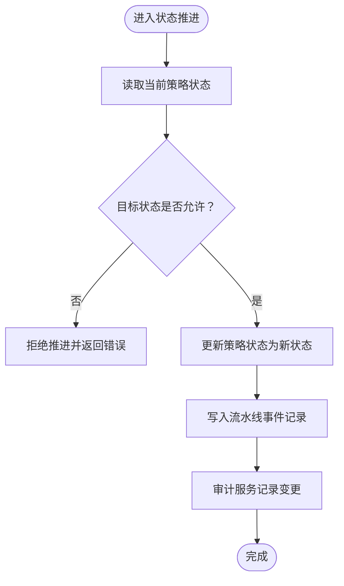
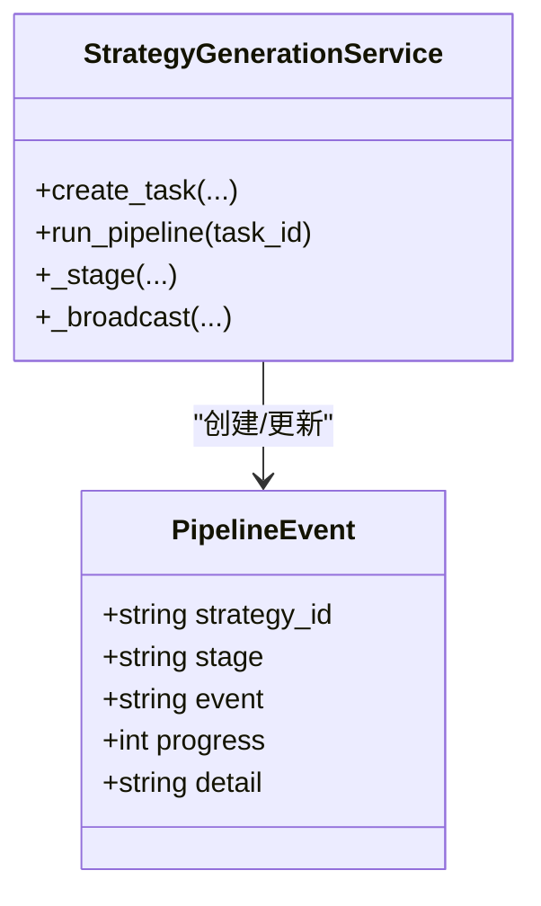
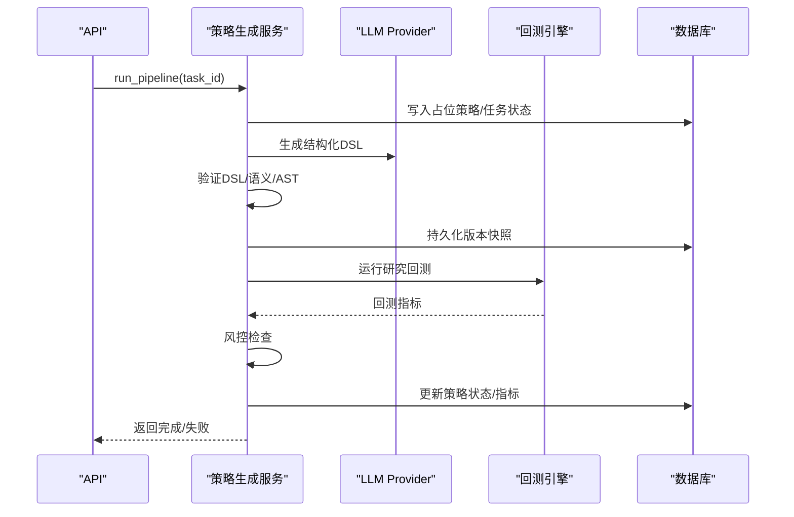
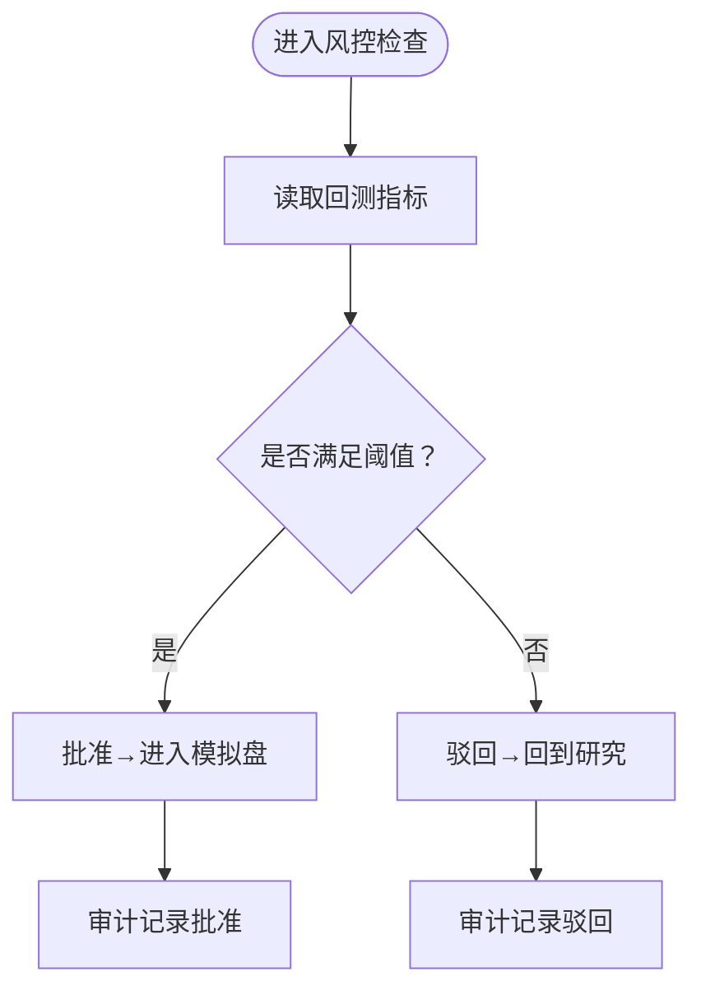
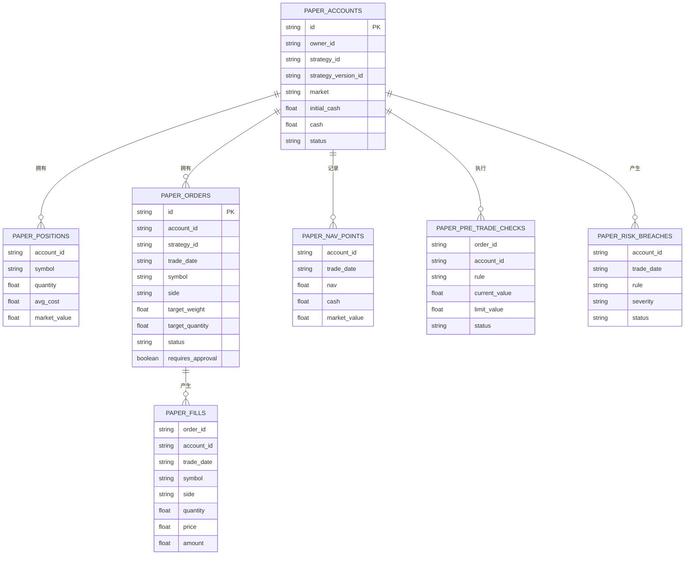
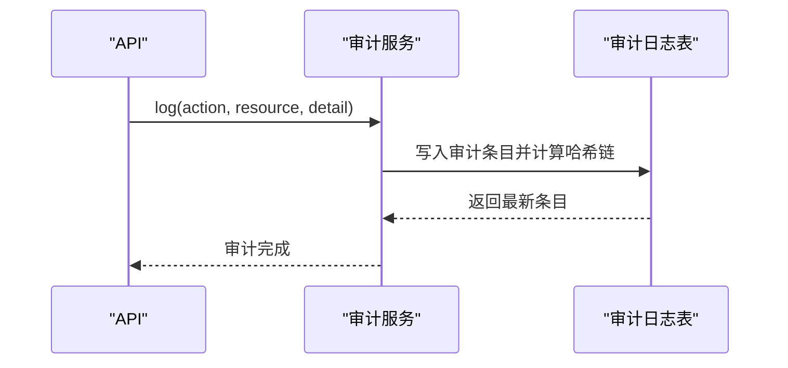
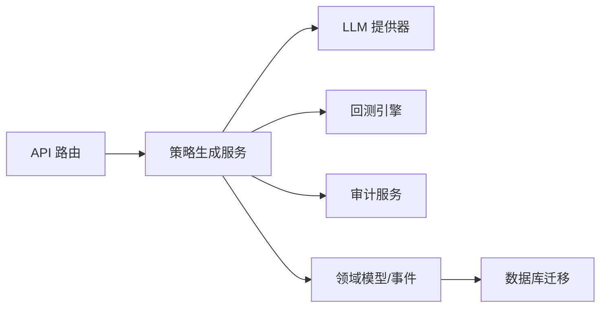

# 策略流水线

<cite>
**本文引用的文件**
- [backend/app/domains/strategy/state_machine.py](file://backend/app/domains/strategy/state_machine.py)
- [backend/app/domains/strategy/models.py](file://backend/app/domains/strategy/models.py)
- [backend/app/domains/strategy/schemas.py](file://backend/app/domains/strategy/schemas.py)
- [backend/app/api/v1/strategies.py](file://backend/app/api/v1/strategies.py)
- [backend/app/services/strategy_generation.py](file://backend/app/services/strategy_generation.py)
- [backend/app/services/strategy_generation_research.py](file://backend/app/services/strategy_generation_research.py)
- [backend/app/services/audit_service.py](file://backend/app/services/audit_service.py)
- [backend/app/domains/strategy/generation_dsl.py](file://backend/app/domains/strategy/generation_dsl.py)
- [backend/app/db/migrations/versions/20260512_000004_backtest_results.py](file://backend/app/db/migrations/versions/20260512_000004_backtest_results.py)
- [backend/app/db/migrations/versions/49c0724c647e_paper_trading_tables.py](file://backend/app/db/migrations/versions/49c0724c647e_paper_trading_tables.py)
- [frontend/src/screens/Strategy/StrategyLifecycle.tsx](file://frontend/src/screens/Strategy/StrategyLifecycle.tsx)
- [frontend/src/screens/Strategy/PipelineBoard.tsx](file://frontend/src/screens/Strategy/PipelineBoard.tsx)
- [frontend/src/contexts/StrategyContext.tsx](file://frontend/src/contexts/StrategyContext.tsx)
</cite>

## 目录
1. [引言](#引言)
2. [项目结构](#项目结构)
3. [核心组件](#核心组件)
4. [架构总览](#架构总览)
5. [详细组件分析](#详细组件分析)
6. [依赖分析](#依赖分析)
7. [性能考虑](#性能考虑)
8. [故障排查指南](#故障排查指南)
9. [结论](#结论)
10. [附录](#附录)

## 引言
本文件面向策略流水线系统，系统性阐述从“概念到实盘”的完整生命周期管理，覆盖以下主题：
- 策略在不同阶段之间的状态流转（草稿、研究、回测、模拟盘、实盘、暂停、归档）
- 流水线事件系统、事件类型与事件处理机制
- 策略状态转换规则、权限控制与审批流程
- 流水线监控、进度跟踪与异常处理
- 帮助开发者与产品人员理解策略从生成、验证、回测、风控、模拟盘到实盘的全链路运作

## 项目结构
后端采用分层架构：API 层负责路由与对外接口；服务层编排流水线与审计；领域模型定义数据结构；迁移脚本定义数据库表结构。前端通过上下文与组件展示流水线状态与推进操作。



**图表来源**
- [backend/app/api/v1/strategies.py:162-280](file://backend/app/api/v1/strategies.py#L162-L280)
- [backend/app/services/strategy_generation.py:86-131](file://backend/app/services/strategy_generation.py#L86-L131)
- [backend/app/services/strategy_generation_research.py:15-46](file://backend/app/services/strategy_generation_research.py#L15-L46)
- [backend/app/services/audit_service.py:32-81](file://backend/app/services/audit_service.py#L32-L81)
- [backend/app/domains/strategy/models.py:9-84](file://backend/app/domains/strategy/models.py#L9-L84)
- [backend/app/domains/strategy/schemas.py:6-64](file://backend/app/domains/strategy/schemas.py#L6-L64)
- [backend/app/domains/strategy/state_machine.py:4-11](file://backend/app/domains/strategy/state_machine.py#L4-L11)
- [backend/app/db/migrations/versions/20260512_000004_backtest_results.py:34-77](file://backend/app/db/migrations/versions/20260512_000004_backtest_results.py#L34-L77)
- [backend/app/db/migrations/versions/49c0724c647e_paper_trading_tables.py:33-172](file://backend/app/db/migrations/versions/49c0724c647e_paper_trading_tables.py#L33-L172)

**章节来源**
- [backend/app/api/v1/strategies.py:162-280](file://backend/app/api/v1/strategies.py#L162-L280)
- [frontend/src/screens/Strategy/StrategyLifecycle.tsx:22-70](file://frontend/src/screens/Strategy/StrategyLifecycle.tsx#L22-L70)
- [frontend/src/screens/Strategy/PipelineBoard.tsx:14-30](file://frontend/src/screens/Strategy/PipelineBoard.tsx#L14-L30)

## 核心组件
- 状态机与模型
  - 状态机定义了策略状态间的合法转换路径，确保状态变更符合业务规则。
  - 领域模型包含策略主表、版本、任务、流水线事件与模板等，支撑全生命周期数据持久化。
- 服务编排
  - 策略生成服务负责端到端流水线：任务创建、LLM 结构化 DSL 生成、静态校验、版本快照、研究回测、风险检查、结果更新与审计日志。
  - 审计服务提供不可篡改的审计链，保障合规与可追溯。
- API 接口
  - 提供流水线概览、模板查询、任务创建与查询、事件查询、策略详情与状态推进等接口。
- 前端展示
  - 生命周期面板与流水线看板，直观呈现策略所处阶段与下一步动作。

**章节来源**
- [backend/app/domains/strategy/state_machine.py:4-22](file://backend/app/domains/strategy/state_machine.py#L4-L22)
- [backend/app/domains/strategy/models.py:9-84](file://backend/app/domains/strategy/models.py#L9-L84)
- [backend/app/domains/strategy/schemas.py:66-127](file://backend/app/domains/strategy/schemas.py#L66-L127)
- [backend/app/services/strategy_generation.py:86-131](file://backend/app/services/strategy_generation.py#L86-L131)
- [backend/app/services/audit_service.py:32-81](file://backend/app/services/audit_service.py#L32-L81)
- [frontend/src/screens/Strategy/StrategyLifecycle.tsx:11-20](file://frontend/src/screens/Strategy/StrategyLifecycle.tsx#L11-L20)
- [frontend/src/screens/Strategy/PipelineBoard.tsx:24-28](file://frontend/src/screens/Strategy/PipelineBoard.tsx#L24-L28)

## 架构总览
策略流水线以“任务驱动 + 事件广播 + 审计链”为核心，贯穿从自然语言到代码、从研究到回测、从风控到模拟盘与实盘的关键节点。



**图表来源**
- [backend/app/api/v1/strategies.py:301-314](file://backend/app/api/v1/strategies.py#L301-L314)
- [backend/app/services/strategy_generation.py:132-373](file://backend/app/services/strategy_generation.py#L132-L373)
- [backend/app/services/strategy_generation.py:377-443](file://backend/app/services/strategy_generation.py#L377-L443)
- [backend/app/services/strategy_generation.py:556-583](file://backend/app/services/strategy_generation.py#L556-L583)

## 详细组件分析

### 状态机与状态流转
- 合法状态转换由状态机集中定义，保证状态变更的确定性与一致性。
- 策略状态推进接口支持手动推进，同时自动记录流水线事件，便于审计与可视化。



**图表来源**
- [backend/app/domains/strategy/state_machine.py:14-22](file://backend/app/domains/strategy/state_machine.py#L14-L22)
- [backend/app/api/v1/strategies.py:422-446](file://backend/app/api/v1/strategies.py#L422-L446)
- [backend/app/services/audit_service.py:38-81](file://backend/app/services/audit_service.py#L38-L81)

**章节来源**
- [backend/app/domains/strategy/state_machine.py:4-11](file://backend/app/domains/strategy/state_machine.py#L4-L11)
- [backend/app/api/v1/strategies.py:422-446](file://backend/app/api/v1/strategies.py#L422-L446)

### 流水线事件系统与事件类型
- 事件载体为流水线事件模型，包含阶段、事件名、进度与详情，用于前端实时展示与历史追踪。
- 事件类型覆盖任务生命周期、代码生成、静态检查、版本创建、回测完成、风控审查、发布成功等。
- 事件通过 WebSocket 广播，前端订阅并渲染流水线看板与生命周期面板。



**图表来源**
- [backend/app/domains/strategy/models.py:61-70](file://backend/app/domains/strategy/models.py#L61-L70)
- [backend/app/services/strategy_generation.py:377-443](file://backend/app/services/strategy_generation.py#L377-L443)
- [backend/app/services/strategy_generation.py:556-583](file://backend/app/services/strategy_generation.py#L556-L583)

**章节来源**
- [backend/app/domains/strategy/models.py:61-70](file://backend/app/domains/strategy/models.py#L61-L70)
- [backend/app/services/strategy_generation.py:377-443](file://backend/app/services/strategy_generation.py#L377-L443)
- [backend/app/api/v1/strategies.py:449-460](file://backend/app/api/v1/strategies.py#L449-L460)

### 策略生成流水线（从概念到回测）
- 任务创建：创建排队中的生成任务，并广播初始事件。
- 研究扫描：触发研究阶段事件，产出研究指标与参数代理。
- 代码生成：基于结构化 DSL 生成策略代码并通过 AST 校验。
- 版本快照：持久化策略版本（含参数与风控规则），供后续回测引用。
- 研究回测：使用内置双均线策略运行研究回测，提取关键指标。
- 风控检查：依据风险等级上限进行阈值检查，不通过则失败回退。
- 发布完成：更新策略状态为“回测中”，记录回测任务与运行标识。



**图表来源**
- [backend/app/services/strategy_generation.py:132-373](file://backend/app/services/strategy_generation.py#L132-L373)
- [backend/app/services/strategy_generation.py:445-514](file://backend/app/services/strategy_generation.py#L445-L514)
- [backend/app/services/strategy_generation_research.py:15-46](file://backend/app/services/strategy_generation_research.py#L15-L46)

**章节来源**
- [backend/app/services/strategy_generation.py:132-373](file://backend/app/services/strategy_generation.py#L132-L373)
- [backend/app/services/strategy_generation_research.py:49-80](file://backend/app/services/strategy_generation_research.py#L49-L80)

### 风控与审批流程
- 风控阈值：根据风险等级设定最大回撤上限与最低夏普比率，未达标则拒绝进入下一阶段。
- 审批入口：前端生命周期面板在“风控审查”阶段提供批准/驳回按钮，批准后进入模拟盘。
- 审计与可追溯：每次状态变更均记录审计日志，形成不可篡改的审计链。



**图表来源**
- [backend/app/services/strategy_generation.py:516-518](file://backend/app/services/strategy_generation.py#L516-L518)
- [frontend/src/screens/Strategy/StrategyLifecycle.tsx:149-161](file://frontend/src/screens/Strategy/StrategyLifecycle.tsx#L149-L161)
- [backend/app/services/audit_service.py:38-81](file://backend/app/services/audit_service.py#L38-L81)

**章节来源**
- [backend/app/services/strategy_generation.py:516-518](file://backend/app/services/strategy_generation.py#L516-L518)
- [frontend/src/screens/Strategy/StrategyLifecycle.tsx:149-161](file://frontend/src/screens/Strategy/StrategyLifecycle.tsx#L149-L161)
- [backend/app/services/audit_service.py:38-81](file://backend/app/services/audit_service.py#L38-L81)

### 模拟盘与实盘准备
- 数据模型：模拟盘账户、持仓、订单、成交、净值点、风控违例等表，支撑模拟交易与风控。
- 实盘准备：策略进入实盘前需完成模拟盘表现评估与风控审批，前端提供导航至执行与监控页面。



**图表来源**
- [backend/app/db/migrations/versions/49c0724c647e_paper_trading_tables.py:33-172](file://backend/app/db/migrations/versions/49c0724c647e_paper_trading_tables.py#L33-L172)

**章节来源**
- [backend/app/db/migrations/versions/49c0724c647e_paper_trading_tables.py:33-172](file://backend/app/db/migrations/versions/49c0724c647e_paper_trading_tables.py#L33-L172)
- [frontend/src/screens/Strategy/StrategyLifecycle.tsx:162-183](file://frontend/src/screens/Strategy/StrategyLifecycle.tsx#L162-L183)

### 回测结果与指标
- 回测任务、运行与指标表结构清晰分离，支持按运行维度聚合关键指标（如年化收益、最大回撤、夏普比率、胜率、换手率、OOS 评分等）。
- 指标映射函数将回测结果转换为策略行与流水线字典格式，便于持久化与前端展示。

```mermaid
classDiagram
class BacktestTasks {
+string strategy_version_id
+string status
+int priority
}
class BacktestRuns {
+string task_id
+string status
+string started_at
+string ended_at
}
class BacktestMetrics {
+string run_id
+float cumulative_return
+float annual_return
+float max_drawdown
+float sharpe_ratio
+float win_rate
+float turnover
+float oos_score
}
BacktestTasks ||--o{ BacktestRuns : "创建"
BacktestRuns ||--|| BacktestMetrics : "产生"
```

**图表来源**
- [backend/app/db/migrations/versions/20260512_000004_backtest_results.py:34-77](file://backend/app/db/migrations/versions/20260512_000004_backtest_results.py#L34-L77)
- [backend/app/services/strategy_generation.py:61-83](file://backend/app/services/strategy_generation.py#L61-L83)

**章节来源**
- [backend/app/db/migrations/versions/20260512_000004_backtest_results.py:34-77](file://backend/app/db/migrations/versions/20260512_000004_backtest_results.py#L34-L77)
- [backend/app/services/strategy_generation.py:61-83](file://backend/app/services/strategy_generation.py#L61-L83)

### 权限控制与审计
- 审计服务提供不可篡改的审计链，记录操作者、动作、资源、结果与置信度等，支持链式校验。
- API 在策略更新时记录审计日志，确保状态变更可追溯。



**图表来源**
- [backend/app/services/audit_service.py:38-81](file://backend/app/services/audit_service.py#L38-L81)
- [backend/app/api/v1/strategies.py:547-552](file://backend/app/api/v1/strategies.py#L547-L552)

**章节来源**
- [backend/app/services/audit_service.py:32-109](file://backend/app/services/audit_service.py#L32-L109)
- [backend/app/api/v1/strategies.py:547-552](file://backend/app/api/v1/strategies.py#L547-L552)

## 依赖分析
- 组件耦合
  - API 依赖服务层与领域模型；服务层依赖 LLM 提供商、回测引擎与审计服务；模型与迁移脚本解耦于业务逻辑。
- 外部依赖
  - LLM 提供器用于结构化 DSL 与代码生成；回测引擎用于研究回测；WebSocket 管理器用于事件广播。
- 可能的循环依赖
  - 当前结构清晰，未发现直接循环依赖；若未来引入跨模块共享工具，应避免双向导入。



**图表来源**
- [backend/app/api/v1/strategies.py:16-44](file://backend/app/api/v1/strategies.py#L16-L44)
- [backend/app/services/strategy_generation.py:31-47](file://backend/app/services/strategy_generation.py#L31-L47)
- [backend/app/domains/strategy/models.py:16-21](file://backend/app/domains/strategy/models.py#L16-L21)

**章节来源**
- [backend/app/api/v1/strategies.py:16-44](file://backend/app/api/v1/strategies.py#L16-L44)
- [backend/app/services/strategy_generation.py:31-47](file://backend/app/services/strategy_generation.py#L31-L47)

## 性能考虑
- 异步执行：流水线在后台任务中运行，避免阻塞 API 请求。
- 事件广播：WebSocket 广播仅在事件发生时触发，减少无效通信。
- 数据库索引：回测任务/运行/指标表均建立必要索引，提升查询与统计效率。
- 风控阈值：通过阈值快速剪枝，避免不必要的回测与计算。

## 故障排查指南
- 任务失败定位
  - 根据异常信息判断失败阶段（回测、静态检查、代码生成、风控或通用流水线），并在对应阶段记录失败事件。
  - 失败事件包含错误摘要与异常类型，便于前端与日志系统检索。
- 状态回退
  - 若风控或回测失败，策略状态会回退到草稿，便于重新调整参数或方向。
- 审计链校验
  - 使用审计服务提供的链式校验方法，验证最近若干条审计记录的完整性。

**章节来源**
- [backend/app/services/strategy_generation.py:308-373](file://backend/app/services/strategy_generation.py#L308-L373)
- [backend/app/services/audit_service.py:83-108](file://backend/app/services/audit_service.py#L83-L108)

## 结论
该策略流水线系统以明确的状态机、完善的事件体系与严格的风控阈值为基础，结合审计链与实时事件广播，实现了从概念到实盘的全生命周期闭环管理。前后端协同通过生命周期面板与流水线看板，提供了直观的进度跟踪与操作入口。建议在后续迭代中持续优化回测性能、扩展多市场与多资产类型的风控规则，并增强异常场景的可视化诊断能力。

## 附录
- 关键术语
  - 草稿：策略概念阶段，尚未进入正式流水线。
  - 研究：利用宏观/板块轮动等信号进行初步探索。
  - 回测：对策略进行历史数据验证，产出关键指标。
  - 风控审查：基于风险阈值的合规审查。
  - 模拟盘：在真实市场数据上进行模拟交易，验证执行与风控。
  - 实盘：接入真实交易通道，进行资金管理与实盘交易。
  - 暂停/归档：暂停运行或归档保留，便于复盘与审计。