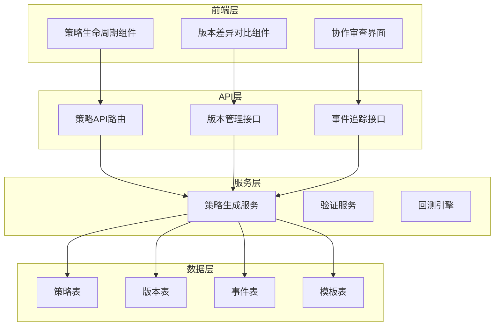
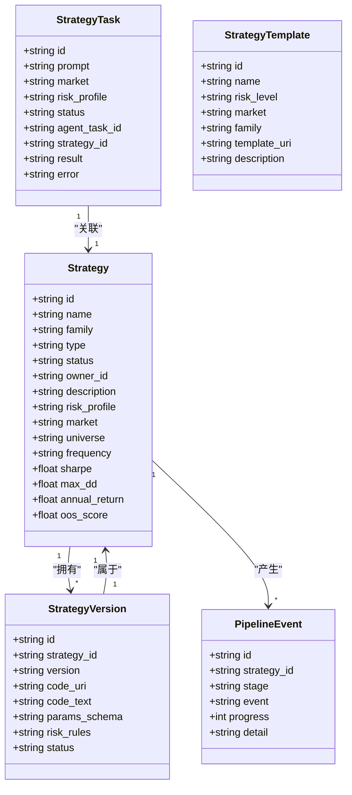
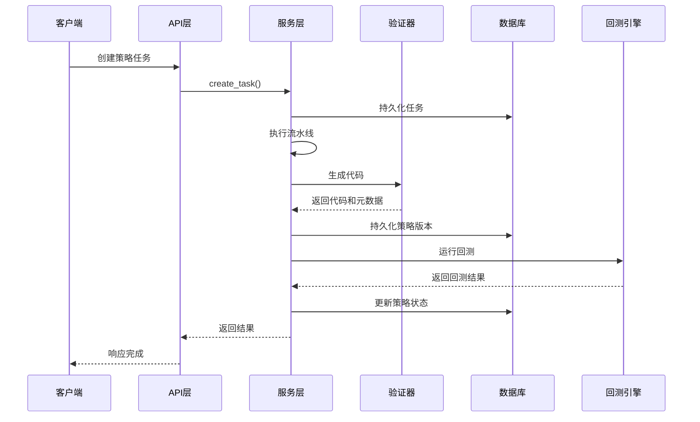
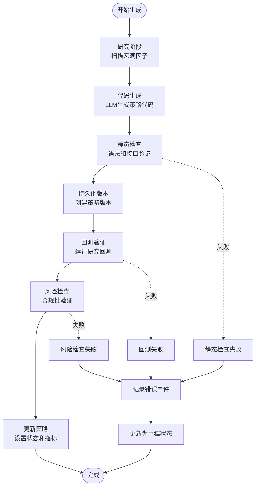
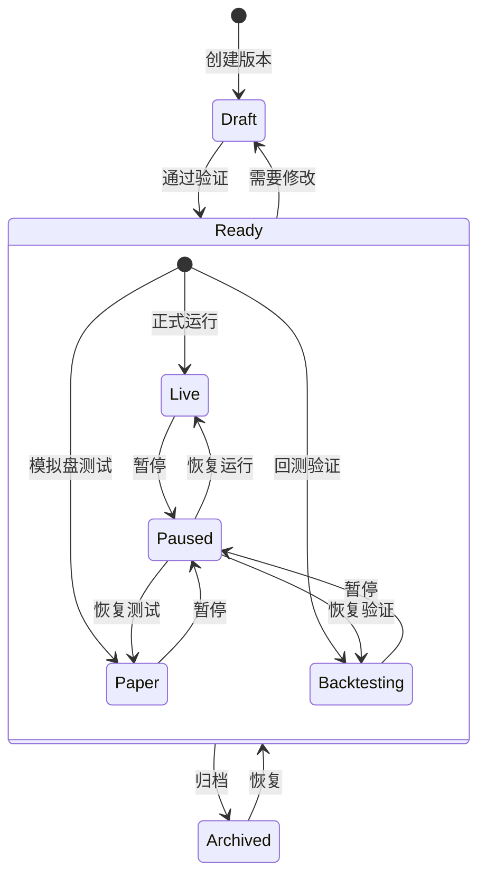
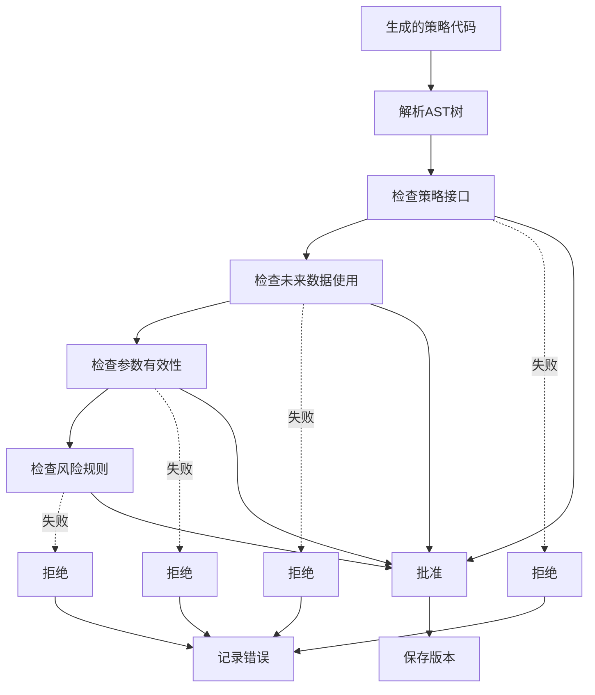
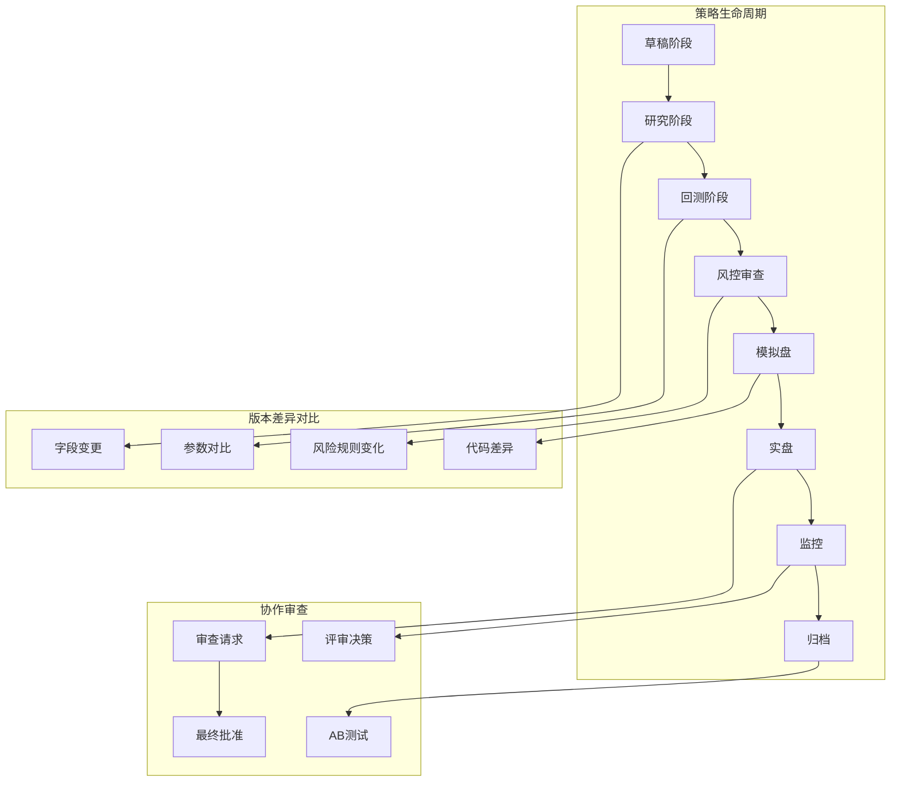
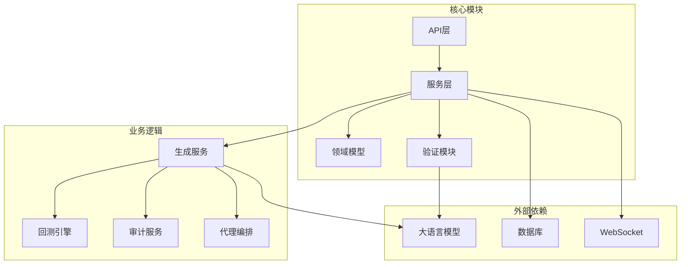

# 策略版本管理

<cite>
**本文档引用的文件**
- [models.py](file://backend/app/domains/strategy/models.py)
- [schemas.py](file://backend/app/domains/strategy/schemas.py)
- [strategies.py](file://backend/app/api/v1/strategies.py)
- [strategy_generation.py](file://backend/app/services/strategy_generation.py)
- [generation_dsl.py](file://backend/app/domains/strategy/generation_dsl.py)
- [generation_validate.py](file://backend/app/domains/strategy/generation_validate.py)
- [20260510_000002_strategy_and_agent_tables.py](file://backend/app/db/migrations/versions/20260510_000002_strategy_and_agent_tables.py)
- [router.py](file://backend/app/api/v1/router.py)
- [StrategyLifecycle.tsx](file://frontend/src/screens/Strategy/StrategyLifecycle.tsx)
- [VersionDiff.tsx](file://frontend/src/screens/Collaboration/VersionDiff.tsx)
</cite>

## 目录
1. [简介](#简介)
2. [项目结构](#项目结构)
3. [核心组件](#核心组件)
4. [架构概览](#架构概览)
5. [详细组件分析](#详细组件分析)
6. [依赖关系分析](#依赖关系分析)
7. [性能考虑](#性能考虑)
8. [故障排除指南](#故障排除指南)
9. [结论](#结论)

## 简介

策略版本管理系统是量化交易平台的核心组件，负责管理策略的生命周期、版本控制和协作审查。该系统实现了从自然语言描述到可执行策略代码的完整流水线，确保策略变更的可追溯性、可审计性和安全性。

系统采用"不可变版本"的设计理念，每个策略版本都是一个独立的代码快照，包含完整的参数配置、风险规则和执行逻辑。通过严格的验证机制和回测流程，确保策略变更经过充分测试和审查。

## 项目结构

策略版本管理系统的整体架构分为四个层次：

**图表来源**
- [router.py:25-40](file://backend/app/api/v1/router.py#L25-L40)
- [strategies.py:45](file://backend/app/api/v1/strategies.py#L45)

**章节来源**
- [router.py:1-40](file://backend/app/api/v1/router.py#L1-L40)
- [strategies.py:1-605](file://backend/app/api/v1/strategies.py#L1-L605)

## 核心组件

### 数据模型架构

系统的核心数据模型围绕策略及其版本展开，采用关系型数据库设计，确保数据的一致性和完整性。

**图表来源**
- [models.py:9-84](file://backend/app/domains/strategy/models.py#L9-L84)

### 版本数据结构

策略版本采用不可变设计，每个版本都是一个完整的代码快照，包含以下关键字段：

- **版本标识**: 使用语义化版本格式（如 v1.0.0）
- **代码存储**: 支持URI引用或直接文本存储
- **参数模式**: JSON格式的参数验证模式
- **风险规则**: JSON格式的风险控制配置
- **状态管理**: draft、ready、archived等状态

**章节来源**
- [models.py:30-42](file://backend/app/domains/strategy/models.py#L30-L42)
- [20260510_000002_strategy_and_agent_tables.py:58-69](file://backend/app/db/migrations/versions/20260510_000002_strategy_and_agent_tables.py#L58-L69)

## 架构概览

策略版本管理系统的整体架构体现了清晰的关注点分离和职责划分：

**图表来源**
- [strategy_generation.py:96-373](file://backend/app/services/strategy_generation.py#L96-L373)
- [strategies.py:301-314](file://backend/app/api/v1/strategies.py#L301-L314)

系统采用异步架构设计，支持高并发处理和非阻塞操作。每个策略任务都通过独立的流水线进行处理，确保系统的可扩展性和稳定性。

## 详细组件分析

### 策略生成流水线

策略生成流水线是系统的核心，负责将自然语言描述转换为可执行的策略代码：

**图表来源**
- [strategy_generation.py:132-373](file://backend/app/services/strategy_generation.py#L132-L373)

#### 流水线阶段详解

1. **研究阶段**: 分析市场环境和宏观因子，为策略生成提供上下文信息
2. **代码生成**: 使用LLM生成符合DSL规范的策略代码
3. **静态检查**: 验证代码语法、接口兼容性和未来数据泄漏防护
4. **版本持久化**: 创建不可变的策略版本快照
5. **回测验证**: 运行研究回测评估策略性能
6. **风险检查**: 确保策略符合风险限额要求
7. **状态更新**: 更新策略状态和相关指标

**章节来源**
- [strategy_generation.py:161-299](file://backend/app/services/strategy_generation.py#L161-L299)

### 版本管理机制

系统实现了完整的版本管理机制，包括版本创建、更新和回滚功能：

**图表来源**
- [models.py:17](file://backend/app/domains/strategy/models.py#L17)
- [models.py:41](file://backend/app/domains/strategy/models.py#L41)

#### 版本创建流程

版本创建遵循严格的流程控制：

1. **代码生成**: 通过LLM生成策略代码
2. **DSL验证**: 验证策略规格的语义正确性
3. **AST验证**: 检查生成代码的语法和接口兼容性
4. **未来数据防护**: 防止策略使用未来数据进行预测
5. **版本持久化**: 将策略代码和元数据保存为不可变版本

**章节来源**
- [strategy_generation.py:537-554](file://backend/app/services/strategy_generation.py#L537-L554)

### 验证和安全机制

系统实现了多层次的安全验证机制，确保策略代码的质量和安全性：

**图表来源**
- [generation_validate.py:107-215](file://backend/app/domains/strategy/generation_validate.py#L107-L215)

#### 验证规则详解

1. **接口验证**: 确保策略类继承自支持的基类并实现必需的方法
2. **未来数据防护**: 检测可能使用未来数据的代码模式
3. **参数验证**: 验证策略参数的范围和类型
4. **风险规则验证**: 确保策略符合预设的风险限额

**章节来源**
- [generation_validate.py:48-86](file://backend/app/domains/strategy/generation_validate.py#L48-L86)

### API接口规范

系统提供了完整的REST API接口，支持策略版本的全生命周期管理：

#### 策略管理接口

| 方法 | 路径 | 描述 |
|------|------|------|
| GET | `/strategies` | 获取策略列表 |
| GET | `/strategies/{strategy_id}` | 获取策略详情 |
| POST | `/strategies` | 创建新策略 |
| PUT/PATCH | `/strategies/{strategy_id}` | 更新策略 |
| DELETE | `/strategies/{strategy_id}` | 删除策略 |

#### 版本管理接口

| 方法 | 路径 | 描述 |
|------|------|------|
| GET | `/strategies/{strategy_id}/versions` | 获取版本列表 |
| GET | `/strategies/{version_id}` | 获取特定版本详情 |
| POST | `/strategies/{strategy_id}/versions` | 创建新版本 |
| GET | `/strategies/{strategy_id}/events` | 获取版本事件日志 |

#### 协作审查接口

| 方法 | 路径 | 描述 |
|------|------|------|
| GET | `/collaboration/reviews` | 获取审查列表 |
| POST | `/collaboration/reviews` | 创建审查请求 |
| GET | `/collaboration/reviews/{review_id}` | 获取审查详情 |
| PUT | `/collaboration/reviews/{review_id}` | 更新审查状态 |

**章节来源**
- [strategies.py:384-605](file://backend/app/api/v1/strategies.py#L384-L605)

### 前端集成

前端组件提供了直观的用户界面，支持策略版本的可视化管理和协作审查：

**图表来源**
- [StrategyLifecycle.tsx:11-20](file://frontend/src/screens/Strategy/StrategyLifecycle.tsx#L11-L20)
- [VersionDiff.tsx:3-33](file://frontend/src/screens/Collaboration/VersionDiff.tsx#L3-L33)

**章节来源**
- [StrategyLifecycle.tsx:22-202](file://frontend/src/screens/Strategy/StrategyLifecycle.tsx#L22-L202)
- [VersionDiff.tsx:3-33](file://frontend/src/screens/Collaboration/VersionDiff.tsx#L3-L33)

## 依赖关系分析

策略版本管理系统展现了清晰的依赖层次结构：

**图表来源**
- [strategy_generation.py:86-93](file://backend/app/services/strategy_generation.py#L86-L93)
- [generation_dsl.py:1-144](file://backend/app/domains/strategy/generation_dsl.py#L1-L144)

系统采用松耦合设计，各组件之间通过明确定义的接口进行交互，便于维护和扩展。

**章节来源**
- [strategy_generation.py:1-584](file://backend/app/services/strategy_generation.py#L1-L584)
- [generation_dsl.py:1-144](file://backend/app/domains/strategy/generation_dsl.py#L1-L144)

## 性能考虑

策略版本管理系统在设计时充分考虑了性能优化：

### 异步处理
- 使用异步数据库连接池提高并发处理能力
- 流水线阶段采用异步执行，避免阻塞等待
- WebSocket广播采用异步消息传递

### 缓存策略
- 策略模板缓存减少重复查询
- 版本元数据缓存提高访问速度
- 回测结果缓存支持快速检索

### 数据库优化
- 合理的索引设计支持高频查询
- 分页查询避免大数据集加载
- 连接池管理优化数据库连接

## 故障排除指南

### 常见问题及解决方案

#### 版本创建失败
**症状**: 策略版本创建过程中出现错误
**可能原因**:
- LLM生成失败
- 代码验证失败
- 数据库连接异常

**解决步骤**:
1. 检查LLM服务可用性
2. 查看验证器错误日志
3. 确认数据库连接状态
4. 重试创建流程

#### 回测执行异常
**症状**: 策略回测无法正常执行
**可能原因**:
- 市场数据缺失
- 参数配置错误
- 计算资源不足

**解决步骤**:
1. 验证市场数据完整性
2. 检查策略参数范围
3. 监控系统资源使用
4. 调整回测配置

#### 版本切换问题
**症状**: 策略版本切换后行为异常
**可能原因**:
- 版本间参数不兼容
- 风险规则冲突
- 回测数据不一致

**解决步骤**:
1. 对比版本间的参数差异
2. 检查风险规则一致性
3. 验证回测数据完整性
4. 执行回归测试

**章节来源**
- [strategy_generation.py:308-373](file://backend/app/services/strategy_generation.py#L308-L373)

## 结论

策略版本管理系统通过精心设计的架构和严格的验证机制，为量化交易提供了可靠的策略管理基础设施。系统的核心优势包括：

1. **完整的生命周期管理**: 从概念到生产的全流程覆盖
2. **严格的质量保证**: 多层次验证确保策略质量
3. **强大的协作功能**: 支持团队协作和审查流程
4. **高度的可扩展性**: 模块化设计便于功能扩展
5. **完善的审计跟踪**: 全面的日志记录支持合规要求

该系统为量化交易团队提供了专业级的策略开发和管理工具，有助于提高策略开发效率和风险管理水平。通过持续的优化和改进，系统将继续为量化交易领域提供强有力的技术支撑。