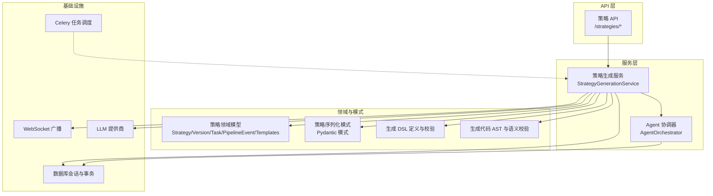
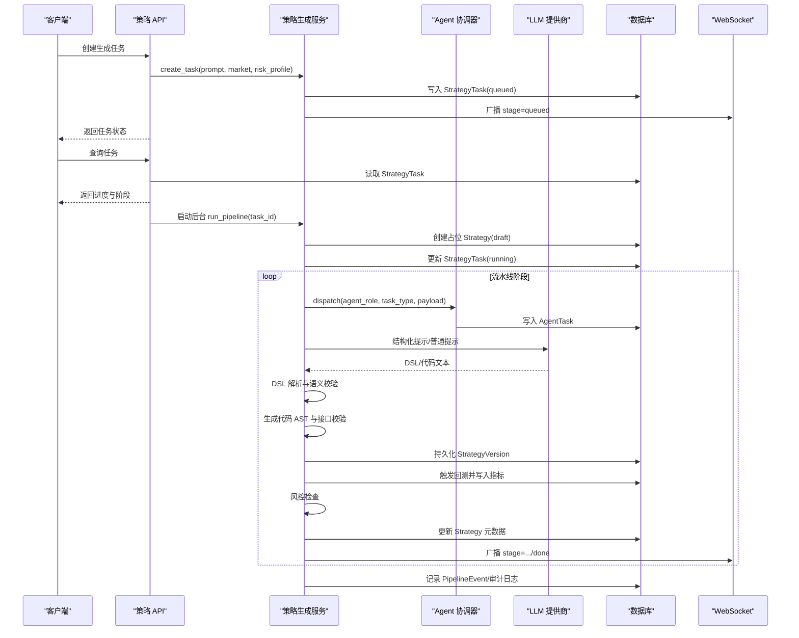
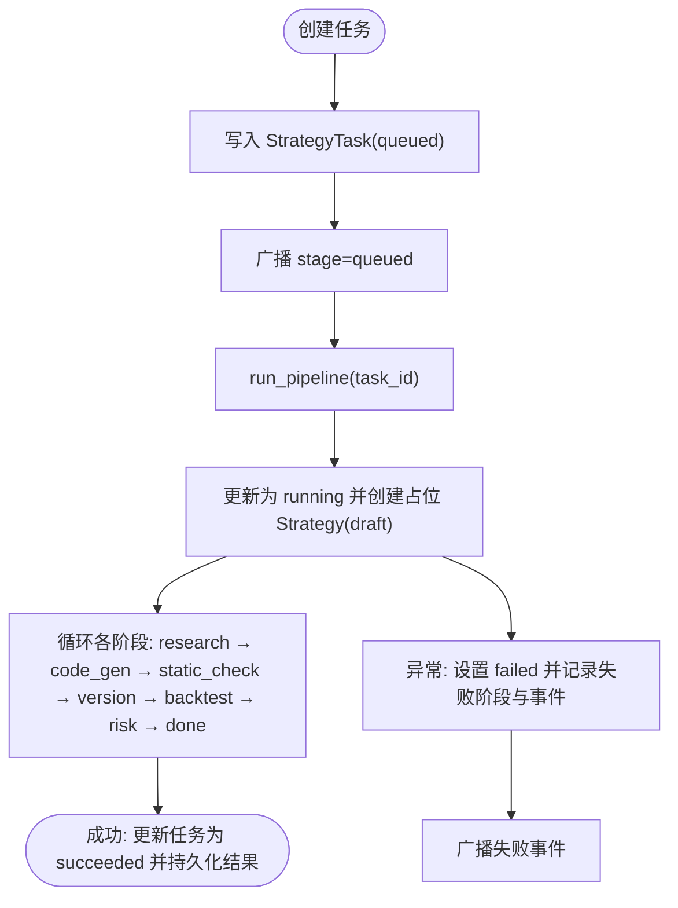
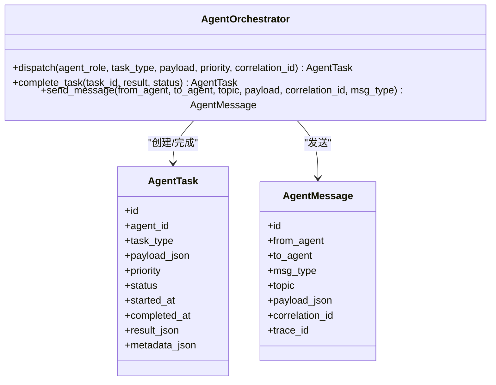
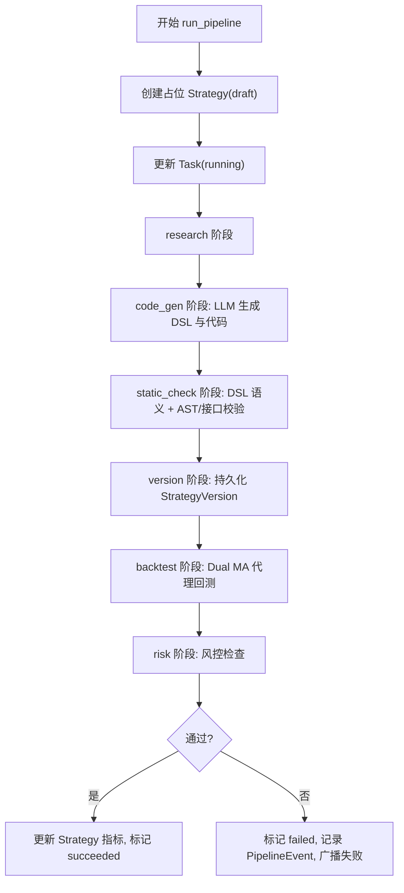
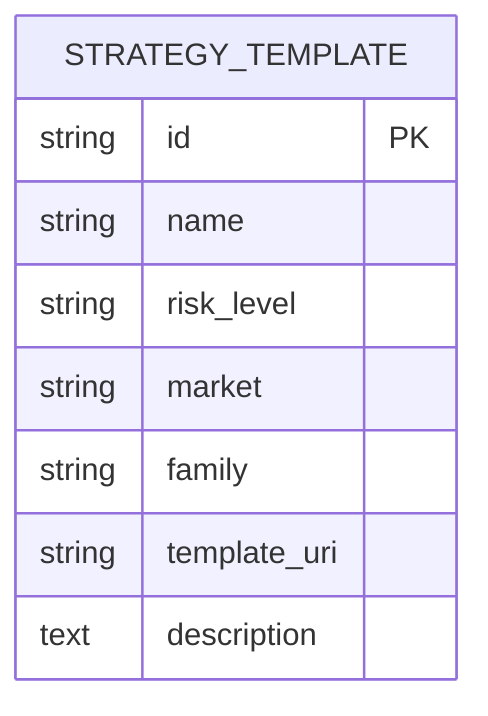
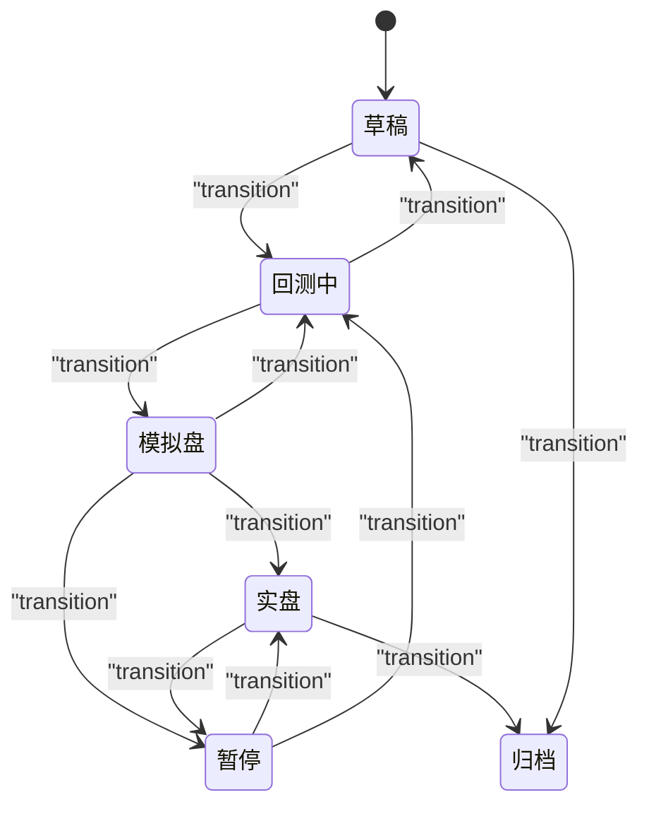
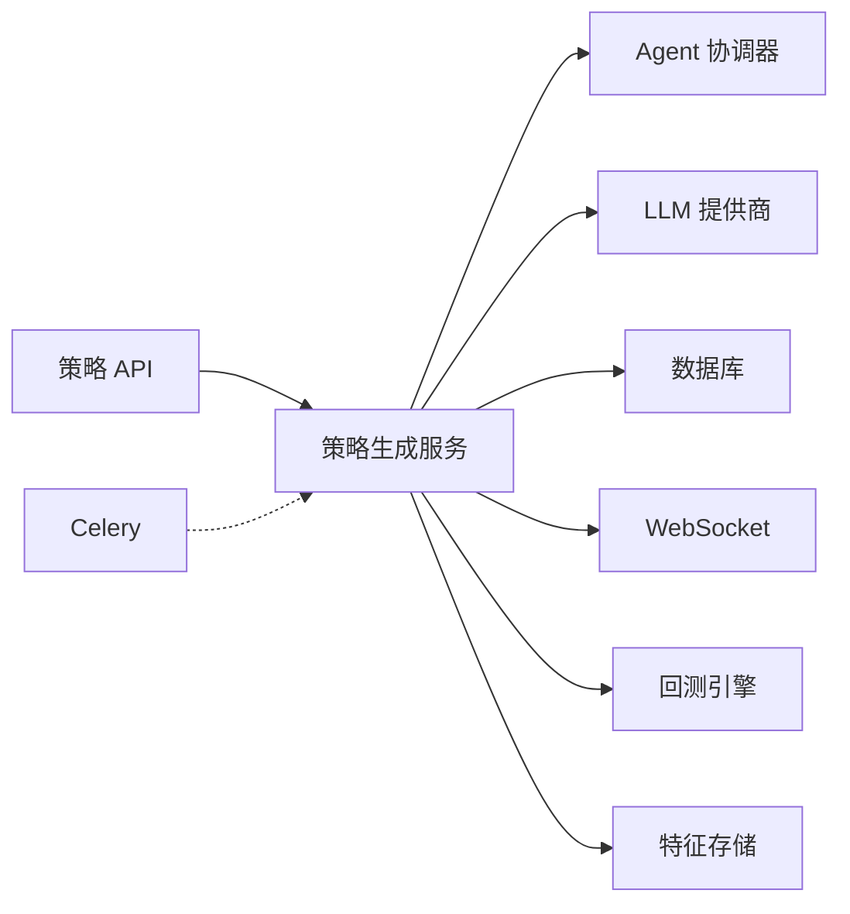

# 策略生成

<cite>
**本文引用的文件**
- [backend/app/api/v1/strategies.py](file://backend/app/api/v1/strategies.py)
- [backend/app/services/strategy_generation.py](file://backend/app/services/strategy_generation.py)
- [backend/app/domains/strategy/generation_dsl.py](file://backend/app/domains/strategy/generation_dsl.py)
- [backend/app/domains/strategy/generation_validate.py](file://backend/app/domains/strategy/generation_validate.py)
- [backend/app/domains/strategy/models.py](file://backend/app/domains/strategy/models.py)
- [backend/app/domains/strategy/schemas.py](file://backend/app/domains/strategy/schemas.py)
- [backend/app/services/agent_orchestrator.py](file://backend/app/services/agent_orchestrator.py)
- [backend/app/tasks/celery_app.py](file://backend/app/tasks/celery_app.py)
- [backend/app/domains/strategy/state_machine.py](file://backend/app/domains/strategy/state_machine.py)
- [backend/app/api/v1/router.py](file://backend/app/api/v1/router.py)
</cite>

## 目录
1. [简介](#简介)
2. [项目结构](#项目结构)
3. [核心组件](#核心组件)
4. [架构总览](#架构总览)
5. [详细组件分析](#详细组件分析)
6. [依赖分析](#依赖分析)
7. [性能考虑](#性能考虑)
8. [故障排查指南](#故障排查指南)
9. [结论](#结论)
10. [附录](#附录)

## 简介
本文件面向“策略生成系统”的使用者与开发者，系统性阐述从自然语言到策略代码的完整转化流程：包含策略任务创建、AI Agent 协作机制、生成进度跟踪、策略模板系统、生成规则验证与代码质量检查、状态管理与错误处理及重试机制等。读者可据此理解 AI 驱动的策略生成完整闭环，以及后端如何通过服务层编排、数据库持久化、WebSocket 广播与 Agent 协调器实现端到端的异步流水线。

## 项目结构
策略生成相关的核心代码集中在后端子系统中，采用按领域分层的组织方式：
- API 层：提供策略工厂相关的 REST 接口（任务查询、模板列表、流水线事件、策略详情等）
- 服务层：策略生成服务负责编排流水线、LLM 结构化提示、静态与语义校验、版本持久化、回测与风控检查、审计与广播
- 领域模型与模式：定义策略、版本、任务、流水线事件、模板等数据模型与序列化模式
- Agent 协调器：负责在不同角色 Agent 之间派发任务与消息
- 任务调度：Celery 应用用于后台任务与周期性作业
- 状态机：约束策略生命周期状态流转

图表来源
- [backend/app/api/v1/strategies.py:160-605](file://backend/app/api/v1/strategies.py#L160-L605)
- [backend/app/services/strategy_generation.py:86-584](file://backend/app/services/strategy_generation.py#L86-L584)
- [backend/app/services/agent_orchestrator.py:15-105](file://backend/app/services/agent_orchestrator.py#L15-L105)
- [backend/app/domains/strategy/models.py:9-84](file://backend/app/domains/strategy/models.py#L9-L84)
- [backend/app/domains/strategy/generation_dsl.py:78-144](file://backend/app/domains/strategy/generation_dsl.py#L78-L144)
- [backend/app/domains/strategy/generation_validate.py:48-216](file://backend/app/domains/strategy/generation_validate.py#L48-L216)
- [backend/app/tasks/celery_app.py:15-42](file://backend/app/tasks/celery_app.py#L15-L42)

章节来源
- [backend/app/api/v1/router.py:23-40](file://backend/app/api/v1/router.py#L23-L40)
- [backend/app/api/v1/strategies.py:160-605](file://backend/app/api/v1/strategies.py#L160-L605)

## 核心组件
- 策略生成服务：负责创建任务、驱动流水线、与 LLM 对话、进行 DSL 解析与校验、生成代码、静态与语义检查、持久化版本、触发回测、风控评估、更新策略元数据、记录审计日志与 WebSocket 广播
- Agent 协调器：为指定角色派发 Agent 任务、完成任务、发送跨 Agent 消息
- 策略 API：提供任务创建、状态查询、流水线事件、策略详情、模板列表、筛选与分页等接口
- 领域模型与模式：策略、版本、任务、流水线事件、模板；以及前端展示所需的序列化模式
- 生成 DSL 与校验：定义策略意图的结构化 DSL，提供 JSON Schema、解析与语义校验；对生成代码进行 AST 与运行时契约检查
- 状态机：约束策略生命周期状态之间的合法转换
- 任务调度：Celery 应用与周期性任务配置

章节来源
- [backend/app/services/strategy_generation.py:86-584](file://backend/app/services/strategy_generation.py#L86-L584)
- [backend/app/services/agent_orchestrator.py:15-105](file://backend/app/services/agent_orchestrator.py#L15-L105)
- [backend/app/domains/strategy/models.py:9-84](file://backend/app/domains/strategy/models.py#L9-L84)
- [backend/app/domains/strategy/schemas.py:66-208](file://backend/app/domains/strategy/schemas.py#L66-L208)
- [backend/app/domains/strategy/generation_dsl.py:78-144](file://backend/app/domains/strategy/generation_dsl.py#L78-L144)
- [backend/app/domains/strategy/generation_validate.py:48-216](file://backend/app/domains/strategy/generation_validate.py#L48-L216)
- [backend/app/domains/strategy/state_machine.py:4-23](file://backend/app/domains/strategy/state_machine.py#L4-L23)
- [backend/app/tasks/celery_app.py:15-42](file://backend/app/tasks/celery_app.py#L15-L42)

## 架构总览
策略生成系统采用“API → 服务 → 领域/模型/模式 → 基础设施”的分层架构。API 层接收请求并委派给服务层；服务层协调 LLM、Agent、数据库与 WebSocket；领域模型与模式确保数据一致性；基础设施提供任务调度与消息通道。

图表来源
- [backend/app/api/v1/strategies.py:301-335](file://backend/app/api/v1/strategies.py#L301-L335)
- [backend/app/services/strategy_generation.py:132-373](file://backend/app/services/strategy_generation.py#L132-L373)
- [backend/app/services/agent_orchestrator.py:31-105](file://backend/app/services/agent_orchestrator.py#L31-L105)

## 详细组件分析

### 组件一：策略任务创建与状态跟踪
- 任务创建：API 接收自然语言描述、市场与风险偏好，创建排队中的任务并立即启动后台流水线
- 状态映射：内部状态到前端展示的 tone 与进度值有固定映射，便于 UI 呈现
- 任务查询：支持按任务 ID 或关联策略 ID 查询最新任务
- 进度跟踪：每个阶段通过 PipelineEvent 记录，同时通过 WebSocket 广播事件，前端可订阅主题实时刷新

图表来源
- [backend/app/api/v1/strategies.py:301-335](file://backend/app/api/v1/strategies.py#L301-L335)
- [backend/app/services/strategy_generation.py:132-373](file://backend/app/services/strategy_generation.py#L132-L373)

章节来源
- [backend/app/api/v1/strategies.py:301-335](file://backend/app/api/v1/strategies.py#L301-L335)
- [backend/app/services/strategy_generation.py:50-83](file://backend/app/services/strategy_generation.py#L50-L83)

### 组件二：AI Agent 协作机制
- 角色派发：根据阶段选择对应角色（如 research、strategy、backtest、risk），协调器查找匹配 Agent 并创建 AgentTask
- 任务完成：在阶段完成后标记 AgentTask 完成并写入结果
- 消息传递：向 Agent 发送主题化的事件消息，携带任务上下文与相关细节
- 关联追踪：使用 correlation_id 将多个阶段的事件串联，便于端到端追踪

图表来源
- [backend/app/services/agent_orchestrator.py:15-105](file://backend/app/services/agent_orchestrator.py#L15-L105)

章节来源
- [backend/app/services/agent_orchestrator.py:31-105](file://backend/app/services/agent_orchestrator.py#L31-L105)

### 组件三：策略生成服务工作原理
- 流水线编排：研究扫描 → 代码生成 → 静态/接口检查 → 版本持久化 → 回测 → 风控 → 成功发布
- LLM 对话：先以结构化提示生成 DSL，再基于 DSL 生成 Python 策略代码；失败时抛出统一异常类型
- 验证体系：DSL 解析与语义校验（位置权重、最大回撤、因子参数范围、未来字段名等）；生成代码 AST 与运行时契约校验（禁止负移位、前视偏差等）
- 数据持久化：创建占位策略、写入 PipelineEvent、持久化 StrategyVersion、更新 Strategy 指标
- 审计与广播：记录审计事件，通过 WebSocket 广播流水线事件，便于前端实时反馈

图表来源
- [backend/app/services/strategy_generation.py:132-373](file://backend/app/services/strategy_generation.py#L132-L373)

章节来源
- [backend/app/services/strategy_generation.py:132-373](file://backend/app/services/strategy_generation.py#L132-L373)

### 组件四：策略模板系统与生成规则验证
- 模板模型：策略模板表支持名称、风险等级、市场、家族、描述等字段
- 生成 DSL：定义策略意图的结构化 DSL，包含因子、过滤条件、再平衡频率、仓位规则、风控规则等；提供 JSON Schema 与解析函数
- 生成规则验证：对 DSL 的语义进行校验（与风险画像、市场匹配），对生成代码进行 AST 分析与接口契约检查，阻断前视泄漏等违规模式

图表来源
- [backend/app/domains/strategy/models.py:73-84](file://backend/app/domains/strategy/models.py#L73-L84)

章节来源
- [backend/app/domains/strategy/models.py:73-84](file://backend/app/domains/strategy/models.py#L73-L84)
- [backend/app/domains/strategy/generation_dsl.py:78-144](file://backend/app/domains/strategy/generation_dsl.py#L78-L144)
- [backend/app/domains/strategy/generation_validate.py:48-216](file://backend/app/domains/strategy/generation_validate.py#L48-L216)

### 组件五：状态管理、错误处理与重试机制
- 状态管理：策略状态机定义了从 draft 到 backtesting/paper/live/paused/archived 的合法转换；API 支持手动过渡并记录流水线事件
- 错误处理：统一捕获异常，依据异常内容判定失败阶段（如 backtest、static_check、code_gen、risk、pipeline），写入 PipelineEvent，必要时回滚策略状态为 draft
- 重试机制：当前实现未内置自动重试；建议在上游任务调度层（如 Celery）或前端轮询策略任务状态以实现“失败后再次触发”；也可扩展在服务层针对特定阶段进行幂等重试

图表来源
- [backend/app/domains/strategy/state_machine.py:4-23](file://backend/app/domains/strategy/state_machine.py#L4-L23)

章节来源
- [backend/app/domains/strategy/state_machine.py:4-23](file://backend/app/domains/strategy/state_machine.py#L4-L23)
- [backend/app/api/v1/strategies.py:422-447](file://backend/app/api/v1/strategies.py#L422-L447)
- [backend/app/services/strategy_generation.py:308-373](file://backend/app/services/strategy_generation.py#L308-L373)

### 组件六：任务队列管理与异步执行
- 异步执行：API 在创建任务后通过 asyncio 创建后台任务，避免阻塞请求；后台任务委托给策略生成服务执行完整流水线
- 任务调度：Celery 应用提供周期性任务（如每日 EOD 模拟盘结算），可作为策略生成系统外部补充任务的参考配置

章节来源
- [backend/app/api/v1/strategies.py:313-314](file://backend/app/api/v1/strategies.py#L313-L314)
- [backend/app/tasks/celery_app.py:15-42](file://backend/app/tasks/celery_app.py#L15-L42)

## 依赖分析
- 组件耦合
  - 策略 API 依赖策略生成服务与审计服务；服务层依赖 Agent 协调器、LLM 提供商、回测引擎、特征存储与流水线工具
  - 领域模型与模式被 API、服务与任务层广泛使用，保持数据契约稳定
- 外部依赖
  - LLM 提供商：用于结构化与非结构化提示
  - Redis/CELERY：用于任务队列与周期性任务
  - WebSocket：用于事件广播

图表来源
- [backend/app/api/v1/strategies.py:301-335](file://backend/app/api/v1/strategies.py#L301-L335)
- [backend/app/services/strategy_generation.py:86-584](file://backend/app/services/strategy_generation.py#L86-L584)
- [backend/app/tasks/celery_app.py:15-42](file://backend/app/tasks/celery_app.py#L15-L42)

章节来源
- [backend/app/api/v1/strategies.py:301-335](file://backend/app/api/v1/strategies.py#L301-L335)
- [backend/app/services/strategy_generation.py:86-584](file://backend/app/services/strategy_generation.py#L86-L584)
- [backend/app/tasks/celery_app.py:15-42](file://backend/app/tasks/celery_app.py#L15-L42)

## 性能考虑
- LLM 调用成本控制：合理设置温度与提示长度；对重复场景复用中间产物（如 DSL）
- 数据库事务：流水线阶段尽量减少长事务；必要时拆分为多段提交，降低锁竞争
- WebSocket 广播：事件粒度适中，避免过于频繁的小事件导致带宽压力
- 回测与特征写入：回测结果写入与特征入库为最佳努力，异常不影响主流程，但需监控失败率
- 任务并发：Celery worker 数量与任务亲和性应结合 CPU/IO 负载调整

## 故障排查指南
- 任务状态异常
  - 现象：任务长时间处于 queued 或 running
  - 排查：确认后台任务是否被正确创建与执行；检查 LLM 提供商可用性与限流
- 生成失败
  - 现象：code_gen/static_check/backtest/risk 阶段失败
  - 排查：查看 PipelineEvent 中的 detail 与错误信息；核对 DSL 语义与生成代码是否符合接口契约
- 风控不通过
  - 现象：maxDD 或 Sharpe 不满足阈值
  - 排查：调整风险画像或策略参数；重新生成
- 事件未广播
  - 现象：前端无实时更新
  - 排查：确认 WebSocket 广播通道与订阅；检查服务层广播调用是否抛错

章节来源
- [backend/app/services/strategy_generation.py:308-373](file://backend/app/services/strategy_generation.py#L308-L373)
- [backend/app/api/v1/strategies.py:123-130](file://backend/app/api/v1/strategies.py#L123-L130)

## 结论
该策略生成系统通过清晰的分层与职责划分，实现了从自然语言到策略代码的自动化流水线。服务层承担编排与校验职责，Agent 协调器保障多智能体协作，数据库与 WebSocket 提供可观测性与可追溯性。结合状态机与审计日志，系统具备良好的可维护性与可演进性。建议后续在任务调度与重试策略上进一步增强，以提升整体可靠性与用户体验。

## 附录
- API 路由聚合：策略 API 路由挂载于 /strategies 前缀下，便于统一管理与其他模块解耦
- 前端对接要点：任务输出包含进度、阶段与颜色映射；流水线事件可用于看板与时间轴展示；模板列表用于引导用户输入

章节来源
- [backend/app/api/v1/router.py:23-40](file://backend/app/api/v1/router.py#L23-L40)
- [backend/app/api/v1/strategies.py:282-298](file://backend/app/api/v1/strategies.py#L282-L298)