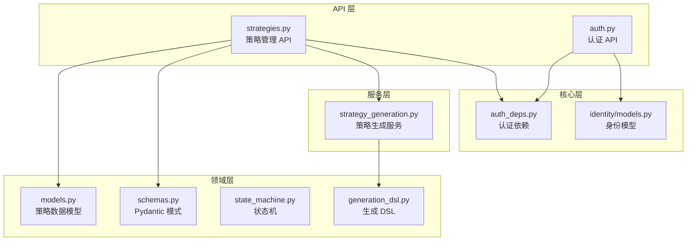
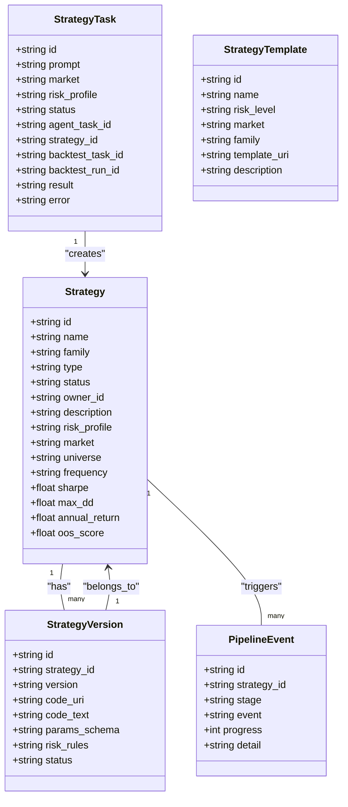
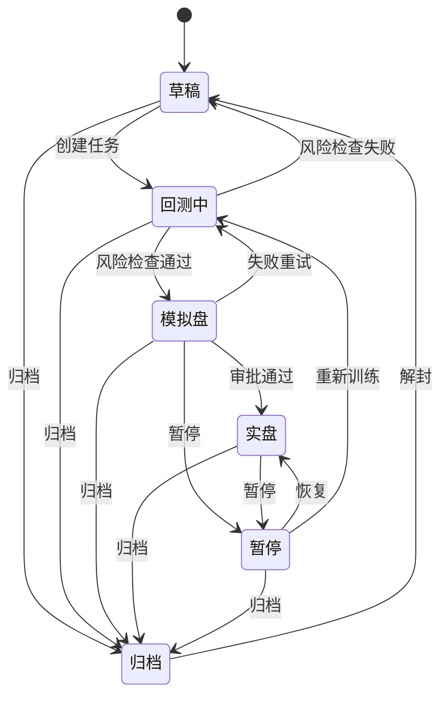
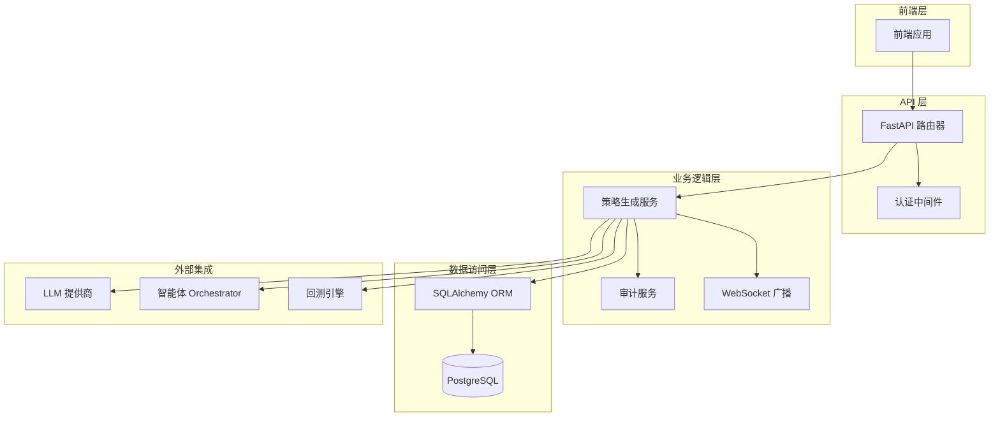
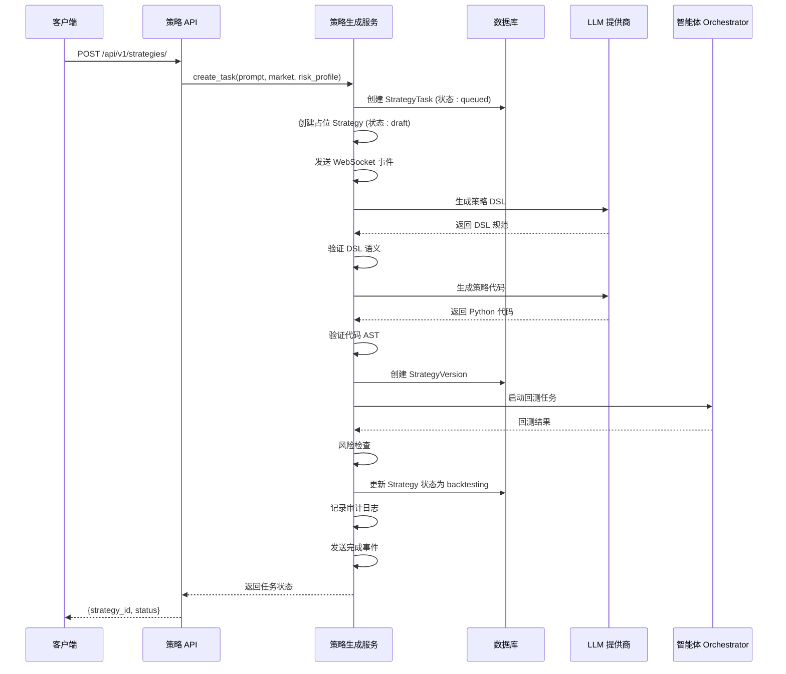
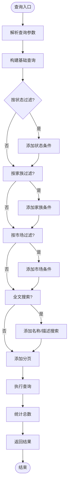
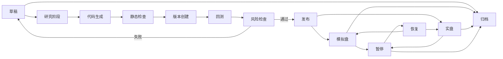
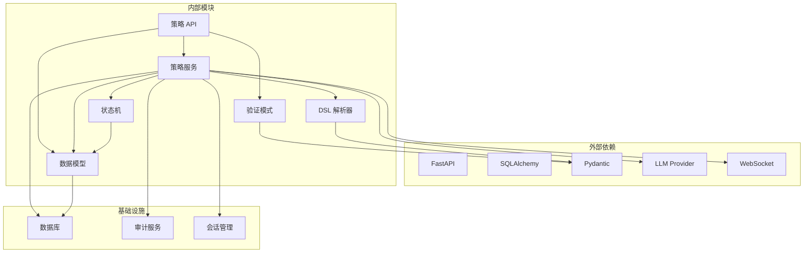

# 策略管理

<cite>
**本文档引用的文件**
- [strategies.py](file://backend/app/api/v1/strategies.py)
- [models.py](file://backend/app/domains/strategy/models.py)
- [schemas.py](file://backend/app/domains/strategy/schemas.py)
- [state_machine.py](file://backend/app/domains/strategy/state_machine.py)
- [generation_dsl.py](file://backend/app/domains/strategy/generation_dsl.py)
- [strategy_generation.py](file://backend/app/services/strategy_generation.py)
- [auth_deps.py](file://backend/app/core/auth_deps.py)
- [auth.py](file://backend/app/api/v1/auth.py)
- [models.py](file://backend/app/domains/identity/models.py)
</cite>

## 目录
1. [简介](#简介)
2. [项目结构](#项目结构)
3. [核心组件](#核心组件)
4. [架构概览](#架构概览)
5. [详细组件分析](#详细组件分析)
6. [依赖关系分析](#依赖关系分析)
7. [性能考虑](#性能考虑)
8. [故障排除指南](#故障排除指南)
9. [结论](#结论)
10. [附录：API 接口规范](#附录api-接口规范)

## 简介

策略管理是量化交易系统的核心功能模块，负责策略的全生命周期管理。本系统实现了从策略创建、生成、验证、回测到部署的完整流程，支持多种策略类型（规则型、机器学习型、组合型）和风险等级配置。

系统采用现代化的架构设计，结合自然语言处理技术，通过LLM生成策略代码，并经过严格的质量控制和风险管理流程。策略状态机确保状态转换的合法性和可追溯性，审计服务记录所有关键操作。

## 项目结构

策略管理功能主要分布在以下目录结构中：



**图表来源**
- [strategies.py:1-605](file://backend/app/api/v1/strategies.py#L1-L605)
- [models.py:1-84](file://backend/app/domains/strategy/models.py#L1-L84)
- [schemas.py:1-208](file://backend/app/domains/strategy/schemas.py#L1-L208)

**章节来源**
- [strategies.py:1-605](file://backend/app/api/v1/strategies.py#L1-L605)
- [models.py:1-84](file://backend/app/domains/strategy/models.py#L1-L84)
- [schemas.py:1-208](file://backend/app/domains/strategy/schemas.py#L1-L208)

## 核心组件

### 数据模型架构

策略管理系统包含以下核心数据模型：



**图表来源**
- [models.py:9-84](file://backend/app/domains/strategy/models.py#L9-L84)

### 策略状态机

系统实现了严格的策略状态转换控制：



**图表来源**
- [state_machine.py:4-11](file://backend/app/domains/strategy/state_machine.py#L4-L11)

**章节来源**
- [models.py:9-84](file://backend/app/domains/strategy/models.py#L9-L84)
- [state_machine.py:1-23](file://backend/app/domains/strategy/state_machine.py#L1-L23)

## 架构概览

策略管理系统的整体架构采用分层设计：



**图表来源**
- [strategies.py:1-605](file://backend/app/api/v1/strategies.py#L1-L605)
- [strategy_generation.py:86-584](file://backend/app/services/strategy_generation.py#L86-L584)

## 详细组件分析

### 策略创建流程

策略创建采用异步流水线模式，确保用户体验和系统可靠性：



**图表来源**
- [strategies.py:301-315](file://backend/app/api/v1/strategies.py#L301-L315)
- [strategy_generation.py:96-373](file://backend/app/services/strategy_generation.py#L96-L373)

### 策略查询接口

系统提供了灵活的查询和筛选功能：



**图表来源**
- [strategies.py:384-420](file://backend/app/api/v1/strategies.py#L384-L420)

### 策略状态管理

状态管理确保策略在整个生命周期中的合规性：



**图表来源**
- [state_machine.py:4-11](file://backend/app/domains/strategy/state_machine.py#L4-L11)
- [strategies.py:422-447](file://backend/app/api/v1/strategies.py#L422-L447)

**章节来源**
- [strategies.py:301-605](file://backend/app/api/v1/strategies.py#L301-L605)
- [strategy_generation.py:132-373](file://backend/app/services/strategy_generation.py#L132-L373)

## 依赖关系分析

策略管理模块的依赖关系如下：



**图表来源**
- [strategies.py:1-605](file://backend/app/api/v1/strategies.py#L1-L605)
- [strategy_generation.py:1-584](file://backend/app/services/strategy_generation.py#L1-L584)

**章节来源**
- [strategies.py:1-605](file://backend/app/api/v1/strategies.py#L1-L605)
- [strategy_generation.py:1-584](file://backend/app/services/strategy_generation.py#L1-L584)

## 性能考虑

### 查询优化策略

1. **索引优化**: 关键字段如 `family`、`type`、`status`、`market` 已建立索引
2. **分页处理**: 默认每页20条记录，最大100条
3. **条件查询**: 支持多条件组合查询，避免全表扫描
4. **软删除**: 使用 `deleted_at` 字段实现软删除，不影响查询性能

### 异步处理

1. **后台任务**: 策略生成采用异步模式，不阻塞主线程
2. **WebSocket 广播**: 实时推送任务状态变化
3. **批量操作**: 支持批量查询和更新操作

## 故障排除指南

### 常见问题及解决方案

1. **策略状态转换失败**
   - 检查状态机允许的转换路径
   - 验证当前策略状态是否正确
   - 查看审计日志获取详细错误信息

2. **LLM 生成失败**
   - 检查 LLM 提供商连接状态
   - 验证提示词格式和内容
   - 查看回测数据可用性

3. **回测任务异常**
   - 确认市场数据完整性
   - 检查策略参数有效性
   - 验证风险规则配置

**章节来源**
- [strategy_generation.py:308-373](file://backend/app/services/strategy_generation.py#L308-L373)
- [state_machine.py:14-23](file://backend/app/domains/strategy/state_machine.py#L14-L23)

## 结论

策略管理系统实现了完整的量化策略生命周期管理，具有以下特点：

1. **模块化设计**: 清晰的分层架构，便于维护和扩展
2. **状态控制**: 严格的策略状态机确保合规性
3. **质量保证**: 多层次的验证和检查机制
4. **可观测性**: 完善的审计日志和实时事件推送
5. **可扩展性**: 支持多种策略类型和市场环境

系统通过LLM驱动的策略生成，结合传统量化方法，为用户提供高效、可靠的策略开发平台。

## 附录：API 接口规范

### 认证机制

系统使用基于 JWT 的 OAuth2 密码流认证：

- **认证端点**: `POST /api/v1/auth/login`
- **令牌格式**: Bearer Token
- **过期时间**: 可配置（默认30分钟）
- **用户信息**: 通过 `GET /api/v1/auth/me` 获取

### 策略管理 API

#### 创建策略草稿
- **方法**: `POST /api/v1/strategies/`
- **请求体**: [StrategyCreate:66-75](file://backend/app/domains/strategy/schemas.py#L66-L75)
- **响应**: `{strategy_id: string, status: string}`
- **权限**: 需要有效 JWT 令牌

#### 列出策略
- **方法**: `GET /api/v1/strategies/`
- **查询参数**:
  - `status`: 策略状态过滤
  - `family`: 策略家族过滤  
  - `market`: 市场过滤
  - `q`: 全文搜索（名称/描述）
  - `page`: 页码，默认1
  - `page_size`: 每页数量，默认20，最大100
- **响应**: [StrategyListResponse:203-208](file://backend/app/domains/strategy/schemas.py#L203-L208)

#### 获取策略详情
- **方法**: `GET /api/v1/strategies/{strategy_id}`
- **路径参数**: `strategy_id` - 策略ID或任务ID
- **响应**: [StrategyDetail:143-167](file://backend/app/domains/strategy/schemas.py#L143-L167)

#### 更新策略
- **方法**: `PUT/PATCH /api/v1/strategies/{strategy_id}`
- **请求体**: [StrategyUpdate:169-182](file://backend/app/domains/strategy/schemas.py#L169-L182)
- **响应**: [StrategyDetail:143-167](file://backend/app/domains/strategy/schemas.py#L143-L167)

#### 删除策略
- **方法**: `DELETE /api/v1/strategies/{strategy_id}`
- **响应**: `{strategy_id: string, deleted: "true"}`
- **注意**: 实施软删除，设置 `deleted_at` 时间戳

#### 策略状态转换
- **方法**: `POST /api/v1/strategies/{strategy_id}/transition`
- **请求体**: [StrategyTransition:122-127](file://backend/app/domains/strategy/schemas.py#L122-L127)
- **响应**: `{strategy_id: string, status: string}`

#### 获取策略事件
- **方法**: `GET /api/v1/strategies/{strategy_id}/events`
- **响应**: [PipelineEventOut:108-119](file://backend/app/domains/strategy/schemas.py#L108-L119) 数组

### 策略生成 API

#### 创建生成任务
- **方法**: `POST /api/v1/strategies/tasks`
- **请求体**: [StrategyTaskCreate:77-82](file://backend/app/domains/strategy/schemas.py#L77-L82)
- **响应**: [StrategyTaskOut:85-106](file://backend/app/domains/strategy/schemas.py#L85-L106)

#### 获取任务状态
- **方法**: `GET /api/v1/strategies/tasks/{task_id}`
- **响应**: [StrategyTaskOut:85-106](file://backend/app/domains/strategy/schemas.py#L85-L106)

### 策略模板 API

#### 获取模板列表
- **方法**: `GET /api/v1/strategies/templates`
- **响应**: [StrategyTemplate:12-19](file://backend/app/domains/strategy/schemas.py#L12-L19) 数组

### 策略工厂仪表板

#### 获取概览数据
- **方法**: `GET /api/v1/strategies/overview`
- **响应**: [StrategyScreen:57-64](file://backend/app/domains/strategy/schemas.py#L57-L64)

### 请求参数规范

#### 策略创建参数
| 参数名 | 类型 | 必填 | 默认值 | 描述 |
|--------|------|------|--------|------|
| name | string | 是 | - | 策略名称 |
| family | string | 否 | "trend" | 策略家族 |
| type | string | 否 | "rule" | 策略类型 |
| description | string | 否 | null | 策略描述 |
| risk_profile | string | 否 | "balanced" | 风险等级 |
| market | string | 否 | "A" | 市场类型 |
| universe | string | 否 | null | 选股范围 |
| frequency | string | 否 | "1d" | 交易频率 |

#### 策略更新参数
支持部分更新，仅更新提供的字段：
- name、family、description、riskProfile、market、universe、frequency、status

#### 查询参数
- status: 策略状态（draft、backtesting、paper、live、paused、archived）
- family: 策略家族（momentum、value、quality、mean_reversion、trend）
- market: 市场类型（A、US、HK、crypto）
- q: 搜索关键词
- page: 页码（≥1）
- page_size: 每页数量（1-100）

### 响应格式

#### 成功响应
所有成功响应遵循统一的响应格式：
```json
{
  "code": 200,
  "message": "success",
  "data": {}
}
```

#### 错误响应
```json
{
  "code": 400,
  "message": "错误描述",
  "data": null
}
```

### 权限验证机制

1. **认证要求**: 所有策略操作需要有效的 JWT 令牌
2. **用户状态**: 用户必须处于激活状态
3. **审计追踪**: 所有关键操作都会记录审计日志
4. **会话管理**: 支持令牌刷新和注销功能

**章节来源**
- [strategies.py:384-605](file://backend/app/api/v1/strategies.py#L384-L605)
- [auth.py:47-194](file://backend/app/api/v1/auth.py#L47-L194)
- [auth_deps.py:15-53](file://backend/app/core/auth_deps.py#L15-L53)