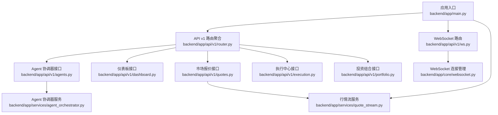
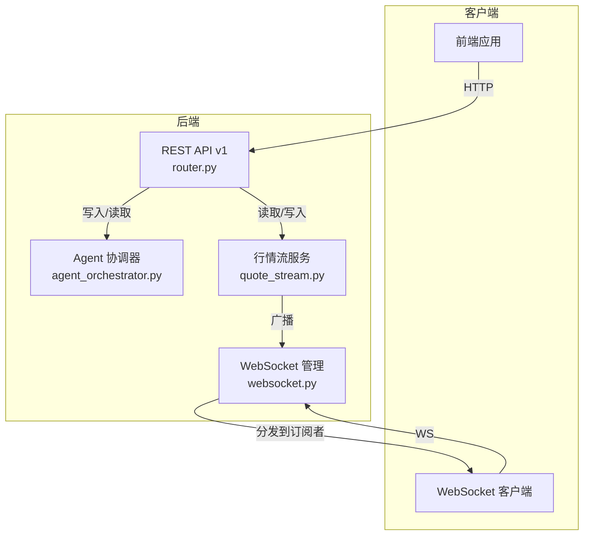
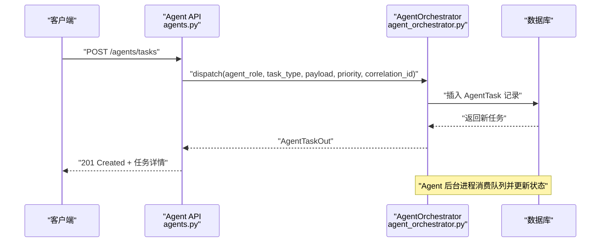
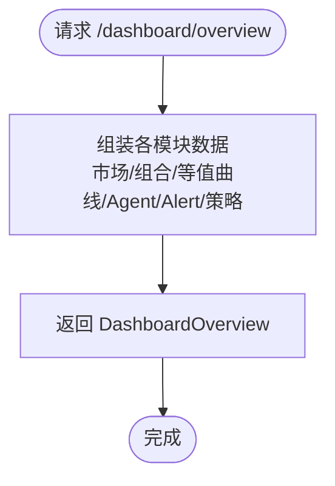
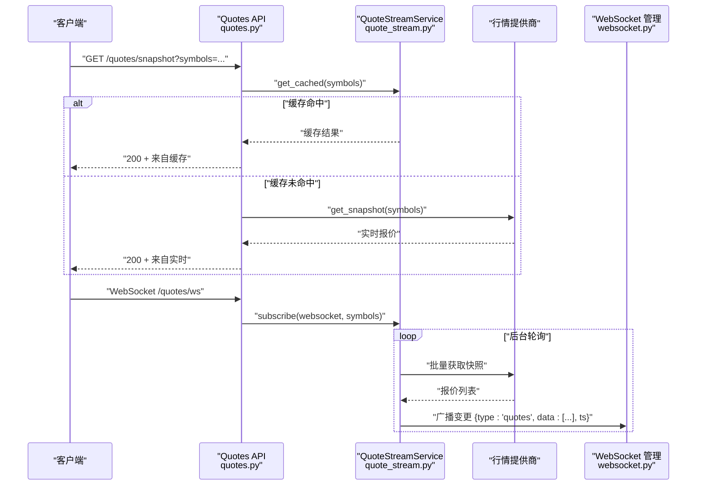
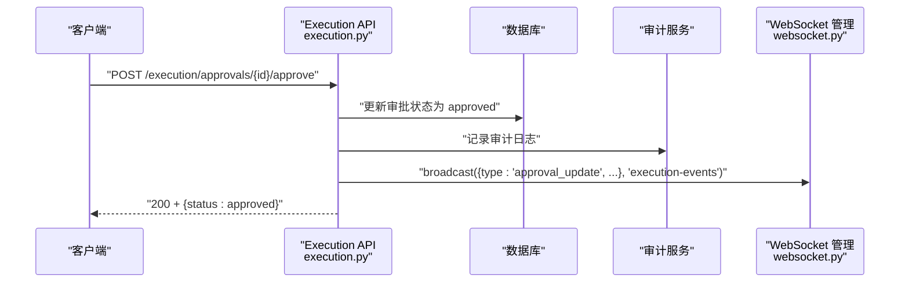
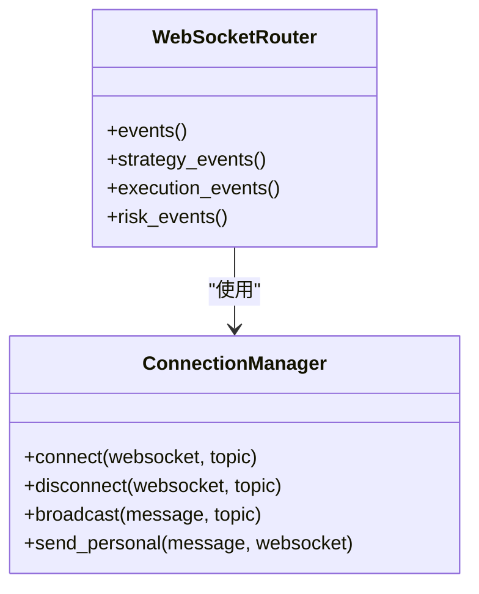
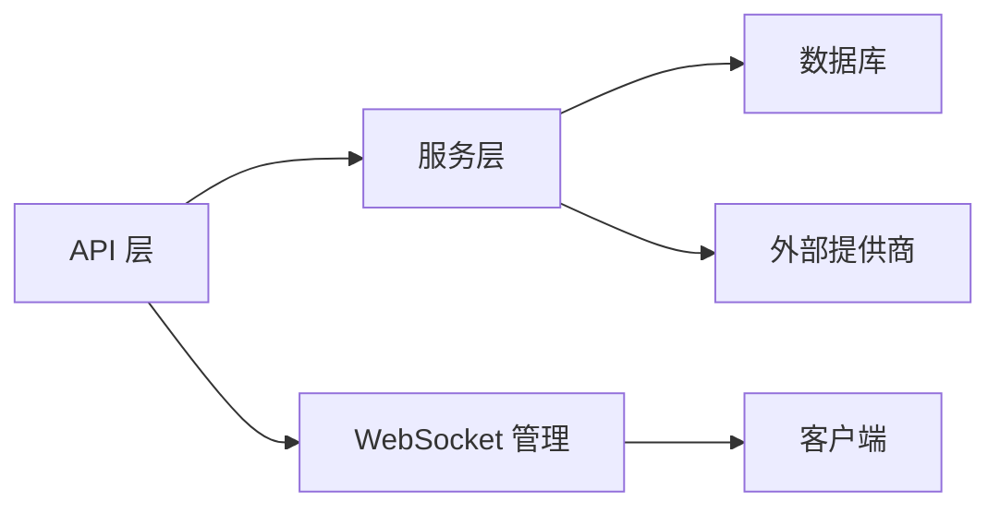

# 系统集成 API

<cite>
**本文引用的文件**
- [main.py](file://backend/app/main.py)
- [router.py](file://backend/app/api/v1/router.py)
- [ws.py](file://backend/app/api/v1/ws.py)
- [agents.py](file://backend/app/api/v1/agents.py)
- [dashboard.py](file://backend/app/api/v1/dashboard.py)
- [quotes.py](file://backend/app/api/v1/quotes.py)
- [execution.py](file://backend/app/api/v1/execution.py)
- [portfolio.py](file://backend/app/api/v1/portfolio.py)
- [agent_orchestrator.py](file://backend/app/services/agent_orchestrator.py)
- [quote_stream.py](file://backend/app/services/quote_stream.py)
- [websocket.py](file://backend/app/core/websocket.py)
- [models.py](file://backend/app/domains/agents/models.py)
- [schemas.py](file://backend/app/domains/agents/schemas.py)
- [dashboard.py](file://backend/app/schemas/dashboard.py)
- [config.py](file://backend/app/core/config.py)
</cite>

## 目录
1. [简介](#简介)
2. [项目结构](#项目结构)
3. [核心组件](#核心组件)
4. [架构总览](#架构总览)
5. [详细组件分析](#详细组件分析)
6. [依赖分析](#依赖分析)
7. [性能考虑](#性能考虑)
8. [故障排查指南](#故障排查指南)
9. [结论](#结论)
10. [附录：接口规范与数据格式](#附录接口规范与数据格式)

## 简介
本文件面向系统集成开发者，提供后端服务的 RESTful API 与实时事件推送接口的完整说明，覆盖 Agent 协调器、仪表板、市场报价、执行中心与投资组合等模块。内容包括：
- 接口定义与请求/响应数据结构
- AI Agent 通信协议与任务消息模型
- 实时数据推送（WebSocket）与事件总线机制
- 状态监控与健康检查
- 组件间通信、事件广播与状态同步流程
- 集成最佳实践与扩展建议

## 项目结构
后端采用 FastAPI 应用入口，统一挂载 API v1 路由与 WebSocket 路由，并在应用生命周期内启动行情流服务。

**图表来源**
- [main.py:39-58](file://backend/app/main.py#L39-L58)
- [router.py:23-40](file://backend/app/api/v1/router.py#L23-L40)
- [ws.py:28-50](file://backend/app/api/v1/ws.py#L28-L50)
- [agents.py:24](file://backend/app/api/v1/agents.py#L24)
- [dashboard.py:20](file://backend/app/api/v1/dashboard.py#L20)
- [quotes.py:10](file://backend/app/api/v1/quotes.py#L10)
- [execution.py:27](file://backend/app/api/v1/execution.py#L27)
- [portfolio.py:26](file://backend/app/api/v1/portfolio.py#L26)
- [agent_orchestrator.py:15](file://backend/app/services/agent_orchestrator.py#L15)
- [quote_stream.py:62](file://backend/app/services/quote_stream.py#L62)
- [websocket.py:10](file://backend/app/core/websocket.py#L10)

**章节来源**
- [main.py:1-65](file://backend/app/main.py#L1-L65)
- [router.py:1-40](file://backend/app/api/v1/router.py#L1-L40)

## 核心组件
- 应用入口与生命周期：负责中间件、异常处理、路由挂载与行情流服务启停。
- API v1 路由聚合：按功能域组织子路由，统一前缀与标签。
- Agent 协调器：提供 Agent 注册、任务派发、消息发送与工具注册能力。
- 仪表板：返回系统概览、健康状态、告警与策略矩阵等前端所需数据。
- 市场报价：提供历史 K 线、快照与 WebSocket 实时推送。
- 执行中心：审批、订单簿、预交易检查、执行指标与审计记录。
- 投资组合：净值、资产配置、相关性、集中度与再平衡提案。
- WebSocket 事件总线：连接管理与主题订阅，支持通用事件与策略/执行/风控事件通道。
- 行情流服务：后台轮询行情、缓存与增量广播。

**章节来源**
- [main.py:19-36](file://backend/app/main.py#L19-L36)
- [router.py:25-40](file://backend/app/api/v1/router.py#L25-L40)
- [agent_orchestrator.py:15-105](file://backend/app/services/agent_orchestrator.py#L15-L105)
- [dashboard.py:121-148](file://backend/app/api/v1/dashboard.py#L121-L148)
- [quotes.py:16-81](file://backend/app/api/v1/quotes.py#L16-L81)
- [execution.py:188-281](file://backend/app/api/v1/execution.py#L188-L281)
- [portfolio.py:140-186](file://backend/app/api/v1/portfolio.py#L140-L186)
- [ws.py:28-50](file://backend/app/api/v1/ws.py#L28-L50)
- [quote_stream.py:62-152](file://backend/app/services/quote_stream.py#L62-L152)
- [websocket.py:10-45](file://backend/app/core/websocket.py#L10-L45)

## 架构总览
系统采用“REST API + WebSocket 实时事件”的双通道架构：
- REST API：提供数据查询、状态变更与批处理操作。
- WebSocket：提供低延迟事件推送与双向心跳保活。
- 事件总线：基于主题的连接管理器，支持多频道广播。

**图表来源**
- [router.py:23-40](file://backend/app/api/v1/router.py#L23-L40)
- [agent_orchestrator.py:15-105](file://backend/app/services/agent_orchestrator.py#L15-L105)
- [quote_stream.py:62-152](file://backend/app/services/quote_stream.py#L62-L152)
- [websocket.py:10-45](file://backend/app/core/websocket.py#L10-L45)

## 详细组件分析

### Agent 协调器 API
- 概述：提供 Agent 注册表、任务队列与跨 Agent 消息的 CRUD 能力；支持工具注册与权限控制。
- 关键接口
  - GET /agents/overview：返回 Agent 列表、最近任务、最近消息与工具清单。
  - POST /agents/tasks：创建并派发任务，支持优先级与关联 ID。
  - GET /agents/tasks/{task_id}：查询单个任务详情。
  - POST /agents/messages：发送跨 Agent 消息（支持类型、主题与关联 ID）。
  - GET /agents/messages：分页查询最近消息。
- 数据模型与协议
  - 任务模型包含 agent_id、task_type、payload、priority、status、result、时间戳与追踪 ID。
  - 消息模型包含 from_agent、to_agent、msg_type、topic、payload、correlation_id 与追踪 ID。
  - 工具模型包含名称、等级、描述、允许 Agent 列表、模式与启用状态。
- 通信协议
  - 任务与消息持久化后，由 Agent 队列或工作进程异步消费。
  - 支持 correlation_id 串联跨 Agent 的请求-响应链路。
- 错误处理
  - 未找到任务返回 404；非法状态变更返回 409。

**图表来源**
- [agents.py:115-130](file://backend/app/api/v1/agents.py#L115-L130)
- [agent_orchestrator.py:31-60](file://backend/app/services/agent_orchestrator.py#L31-L60)

**章节来源**
- [agents.py:93-172](file://backend/app/api/v1/agents.py#L93-L172)
- [agent_orchestrator.py:15-105](file://backend/app/services/agent_orchestrator.py#L15-L105)
- [models.py:9-62](file://backend/app/domains/agents/models.py#L9-L62)
- [schemas.py:6-78](file://backend/app/domains/agents/schemas.py#L6-L78)

### 仪表板 API
- 概述：返回前端所需的系统概览数据，包括市场指标、组合指标、等值曲线、Agent 矩阵、告警与策略网格。
- 关键接口
  - GET /dashboard/overview：返回完整的 DashboardOverview 结构。
  - GET /dashboard/system-health：返回系统健康状态。
  - GET /dashboard/alerts：返回活动告警列表。
- 数据模型：包含市场指数、组合指标、等值曲线点、Agent、Alert、策略与待审批数等字段。

**图表来源**
- [dashboard.py:121-135](file://backend/app/api/v1/dashboard.py#L121-L135)
- [dashboard.py:1-94](file://backend/app/schemas/dashboard.py#L1-L94)

**章节来源**
- [dashboard.py:121-148](file://backend/app/api/v1/dashboard.py#L121-L148)
- [dashboard.py:1-94](file://backend/app/schemas/dashboard.py#L1-L94)

### 市场报价 API
- 概述：提供历史 K 线、实时快照与 WebSocket 实时推送；支持缓存命中与提供商回退。
- 关键接口
  - GET /quotes/history：按日期范围与频率返回历史 OHLCV。
  - GET /quotes/snapshot：返回指定股票的实时快照（优先缓存）。
  - GET /quotes/market：返回全市场快照（优先缓存）。
  - WebSocket /quotes/ws：订阅/退订并接收增量推送。
- WebSocket 协议
  - 客户端发送：{"action": "subscribe"/"unsubscribe"/"ping", "symbols": [...]}
  - 服务端推送：{"type": "snapshot", "data": [...]} 或 {"type": "quotes", "data": [...], "ts": ms}
- 行情流服务
  - 后台仅轮询已订阅的符号，减少网络开销。
  - 交易时段短周期轮询，非交易时段长周期轮询。
  - 只对价格变化的数据进行广播。

**图表来源**
- [quotes.py:16-81](file://backend/app/api/v1/quotes.py#L16-L81)
- [quotes.py:85-129](file://backend/app/api/v1/quotes.py#L85-L129)
- [quote_stream.py:62-152](file://backend/app/services/quote_stream.py#L62-L152)
- [websocket.py:27-41](file://backend/app/core/websocket.py#L27-L41)

**章节来源**
- [quotes.py:16-129](file://backend/app/api/v1/quotes.py#L16-L129)
- [quote_stream.py:62-152](file://backend/app/services/quote_stream.py#L62-L152)
- [websocket.py:10-45](file://backend/app/core/websocket.py#L10-L45)

### 执行中心 API
- 概述：提供交易审批、订单簿、预交易检查、执行指标与 Agent 轨迹。
- 关键接口
  - GET /execution/overview：返回汇总、审批列表、订单簿、指标与轨迹。
  - GET /execution/approvals：按状态与数量分页查询审批。
  - POST /execution/approvals/{approval_id}/approve：批准并记录审计。
  - POST /execution/approvals/{approval_id}/reject：拒绝并记录审计。
- 事件推送
  - 批准/拒绝后向 execution-events 主题广播更新，前端可订阅实时刷新。

**图表来源**
- [execution.py:223-250](file://backend/app/api/v1/execution.py#L223-L250)
- [execution.py:253-280](file://backend/app/api/v1/execution.py#L253-L280)
- [websocket.py:27-41](file://backend/app/core/websocket.py#L27-L41)

**章节来源**
- [execution.py:188-281](file://backend/app/api/v1/execution.py#L188-L281)

### 投资组合 API
- 概述：提供净值、风险预算、资产配置、相关性矩阵、集中度因子与再平衡提案。
- 关键接口
  - GET /portfolio/overview：返回 NAV、风险预算、配置、相关性、集中度与待审批再平衡。
  - GET /portfolio/rebalance：列出待审批再平衡提案。
  - POST /portfolio/rebalance/{proposal_id}/approve：批准再平衡并记录审计。

**章节来源**
- [portfolio.py:140-186](file://backend/app/api/v1/portfolio.py#L140-L186)

### WebSocket 事件总线
- 连接管理：按主题维护连接列表，支持连接/断开与个人消息发送。
- 主题广播：支持 events、strategy-events、execution-events、risk-events 等主题。
- 心跳保活：服务端对 ping 返回 pong，维持连接活跃。

**图表来源**
- [websocket.py:10-45](file://backend/app/core/websocket.py#L10-L45)
- [ws.py:28-50](file://backend/app/api/v1/ws.py#L28-L50)

**章节来源**
- [ws.py:12-50](file://backend/app/api/v1/ws.py#L12-L50)
- [websocket.py:10-45](file://backend/app/core/websocket.py#L10-L45)

## 依赖分析
- 组件耦合
  - API 层仅依赖服务层与数据库会话，职责清晰。
  - Agent 协调器与行情流服务分别与数据库与外部提供商交互。
  - WebSocket 管理器独立于业务逻辑，便于复用。
- 外部依赖
  - 数据库：异步 SQLAlchemy。
  - Redis：配置项存在但当前未在上述文件中直接使用。
  - LLM 提供商：Anthropic/OpenAI/Mock，用于 Agent 通信。
  - 市场数据提供商：AkShare/Tushare/Wind/Mock，通过工厂模式注入。
- 循环依赖
  - 未发现直接循环导入；服务层与 API 层通过依赖注入解耦。

**图表来源**
- [router.py:25-40](file://backend/app/api/v1/router.py#L25-L40)
- [agent_orchestrator.py:18](file://backend/app/services/agent_orchestrator.py#L18)
- [quote_stream.py:34](file://backend/app/services/quote_stream.py#L34)
- [websocket.py:10](file://backend/app/core/websocket.py#L10)

**章节来源**
- [config.py:80-104](file://backend/app/core/config.py#L80-L104)

## 性能考虑
- 行情轮询优化
  - 仅轮询已订阅符号，避免全市场扫描。
  - 交易时段短周期轮询，非交易时段长周期轮询。
- 缓存命中优先
  - 快照接口优先返回缓存，降低实时提供商压力。
- WebSocket 广播
  - 仅对价格变化的数据进行广播，减少无效推送。
- 数据库访问
  - 使用分页与索引字段（如 created_at、agent_id、to_agent 等）提升查询效率。
- 异常与资源释放
  - 生命周期中正确启动/停止后台任务，捕获异常避免服务中断。

[本节为通用性能指导，无需特定文件引用]

## 故障排查指南
- 健康检查
  - GET /health：返回服务状态与版本信息，用于容器编排与负载均衡探活。
- WebSocket 连接问题
  - 确认客户端发送 ping 并收到 pong；检查主题订阅是否正确。
  - 查看连接管理器日志中的连接数变化。
- 行情推送异常
  - 检查提供商可用性与令牌配置；确认轮询间隔与交易时间设置。
  - 核对订阅符号集合与缓存命中情况。
- 审批与再平衡状态冲突
  - 若返回 409，表示状态已变更，请重新拉取最新状态。
- 日志定位
  - 应用启动日志包含环境、提供商与版本信息；WebSocket 与行情服务均有独立日志上下文。

**章节来源**
- [main.py:61-65](file://backend/app/main.py#L61-L65)
- [ws.py:12-25](file://backend/app/api/v1/ws.py#L12-L25)
- [quote_stream.py:118-123](file://backend/app/services/quote_stream.py#L118-L123)
- [execution.py:229-230](file://backend/app/api/v1/execution.py#L229-L230)
- [portfolio.py:169-170](file://backend/app/api/v1/portfolio.py#L169-L170)

## 结论
本系统以清晰的模块划分与 REST + WebSocket 的混合架构，实现了 Agent 协调、仪表板展示、市场报价与执行/组合管理的协同。通过事件总线与状态同步机制，前端可获得低延迟的实时数据与一致的状态视图。建议在生产环境中完善数据库索引、接入真实行情与 LLM 提供商，并结合审计与监控体系保障稳定性与可追溯性。

[本节为总结性内容，无需特定文件引用]

## 附录：接口规范与数据格式

### 通用约定
- 基础路径：/api/v1
- 认证：部分路由包含认证标签，具体鉴权方式见认证模块。
- 分页：默认每页 20 条，最大 100 条。
- 时间格式：ISO 8601 字符串（任务与消息创建时间）。

### Agent 协调器
- GET /agents/overview
  - 响应：包含 agents、tasks、messages、tools 的聚合视图。
- POST /agents/tasks
  - 请求体：agent_role、task_type、payload、priority、correlation_id。
  - 响应：AgentTaskOut。
- GET /agents/tasks/{task_id}
  - 响应：AgentTaskOut；未找到返回 404。
- POST /agents/messages
  - 请求体：from_agent、to_agent、msg_type、topic、payload、correlation_id。
  - 响应：AgentMessageOut。
- GET /agents/messages
  - 查询参数：limit（默认 20）。
  - 响应：AgentMessageOut 列表。

**章节来源**
- [agents.py:93-172](file://backend/app/api/v1/agents.py#L93-L172)
- [schemas.py:52-78](file://backend/app/domains/agents/schemas.py#L52-L78)

### 仪表板
- GET /dashboard/overview
  - 响应：DashboardOverview。
- GET /dashboard/system-health
  - 响应：SystemHealth。
- GET /dashboard/alerts
  - 响应：Alert 列表。

**章节来源**
- [dashboard.py:121-148](file://backend/app/api/v1/dashboard.py#L121-L148)
- [dashboard.py:1-94](file://backend/app/schemas/dashboard.py#L1-L94)

### 市场报价
- GET /quotes/history
  - 查询参数：symbol、startDate、endDate、freq（1d/1w/1m/60min/30min/15min/5min/1min）、adjust（qfq/hfq/none）。
  - 响应：包含 bars（含日期、开盘/最高/最低/收盘/成交量/成交额/涨跌幅）。
- GET /quotes/snapshot
  - 查询参数：symbols（逗号分隔）。
  - 响应：quotes（含名称、价格、涨跌、成交量、换手率、市盈率、市值等），并标注来源（cache/live）。
- GET /quotes/market
  - 响应：全市场快照与计数，优先缓存。
- WebSocket /quotes/ws
  - 订阅/退订/心跳：{"action": "subscribe"/"unsubscribe"/"ping", "symbols": [...]}
  - 推送：snapshot（首次订阅的快照）与 quotes（增量推送，含时间戳）。

**章节来源**
- [quotes.py:16-129](file://backend/app/api/v1/quotes.py#L16-L129)
- [quote_stream.py:42-59](file://backend/app/services/quote_stream.py#L42-L59)

### 执行中心
- GET /execution/overview
  - 响应：ExecutionScreen（汇总、审批、订单簿、指标、轨迹）。
- GET /execution/approvals
  - 查询参数：status（默认 pending）、limit（1-200，默认 50）。
  - 响应：ApprovalOut 列表。
- POST /execution/approvals/{approval_id}/approve
  - 响应：{"approval_id": "...", "status": "approved"}。
- POST /execution/approvals/{approval_id}/reject
  - 响应：{"approval_id": "...", "status": "rejected"}。

**章节来源**
- [execution.py:188-281](file://backend/app/api/v1/execution.py#L188-L281)

### 投资组合
- GET /portfolio/overview
  - 响应：PortfolioScreen（NAV、风险预算、配置、相关性、集中度、待审批再平衡）。
- GET /portfolio/rebalance
  - 响应：RebalanceAction 列表。
- POST /portfolio/rebalance/{proposal_id}/approve
  - 响应：{"proposal_id": "...", "status": "approved"}。

**章节来源**
- [portfolio.py:140-186](file://backend/app/api/v1/portfolio.py#L140-L186)

### WebSocket 事件总线
- /events：通用事件。
- /strategy-events：策略流水线事件。
- /execution-events：执行审批事件。
- /risk-events：风控/熔断事件。
- 协议要点：连接后发送 ping，收到 pong；订阅时可获取 snapshot。

**章节来源**
- [ws.py:28-50](file://backend/app/api/v1/ws.py#L28-L50)
- [websocket.py:10-45](file://backend/app/core/websocket.py#L10-L45)