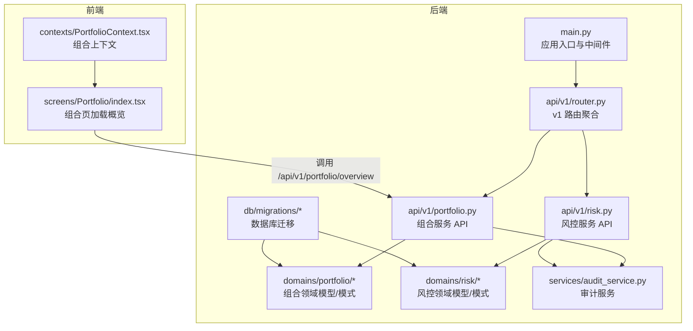
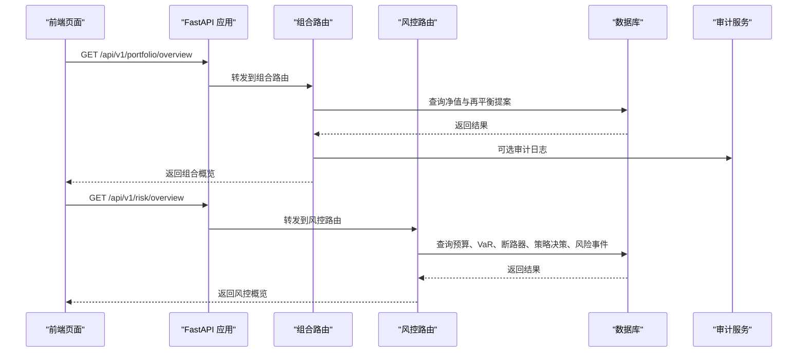
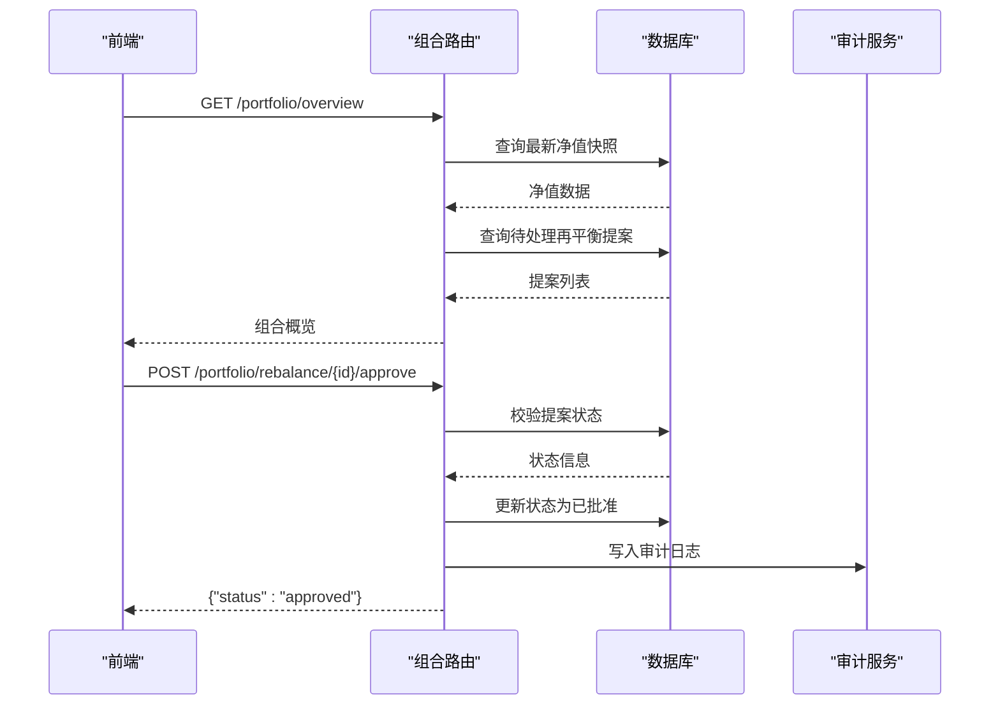
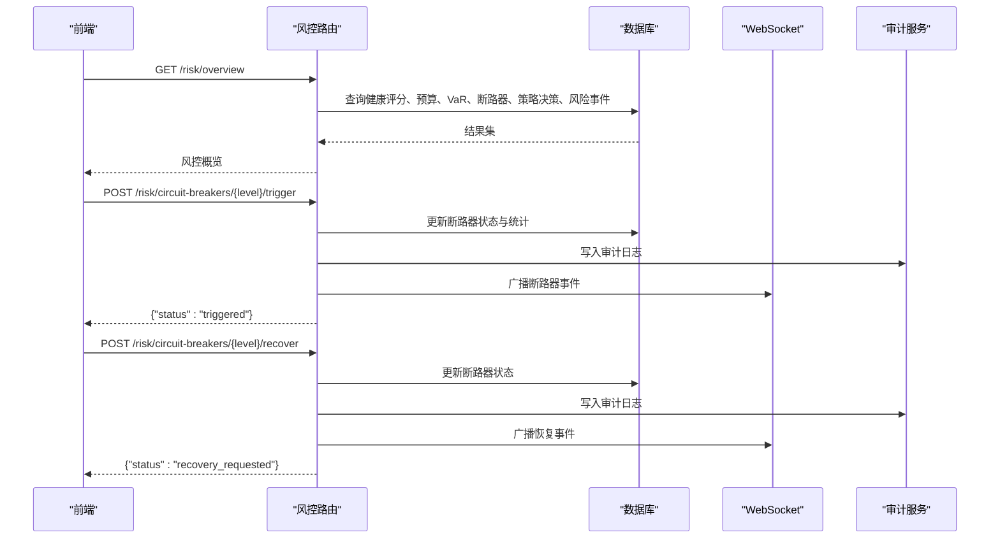
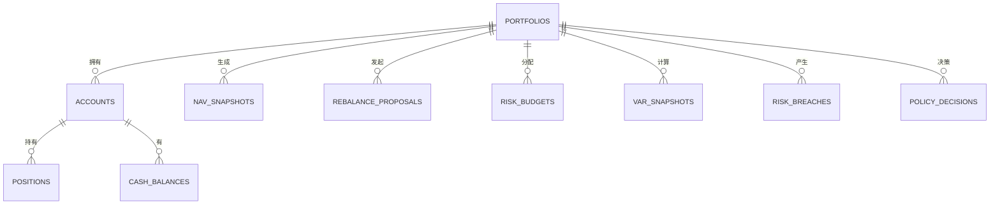
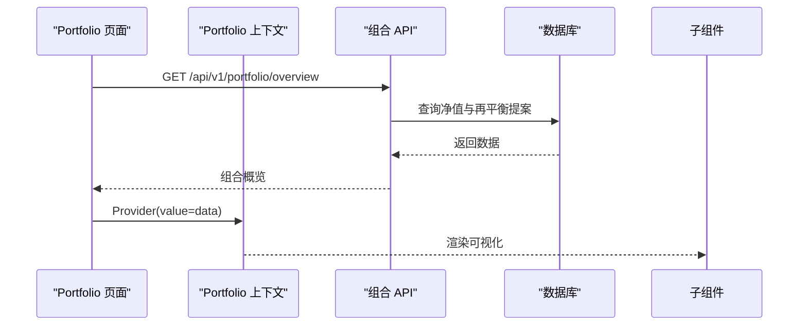
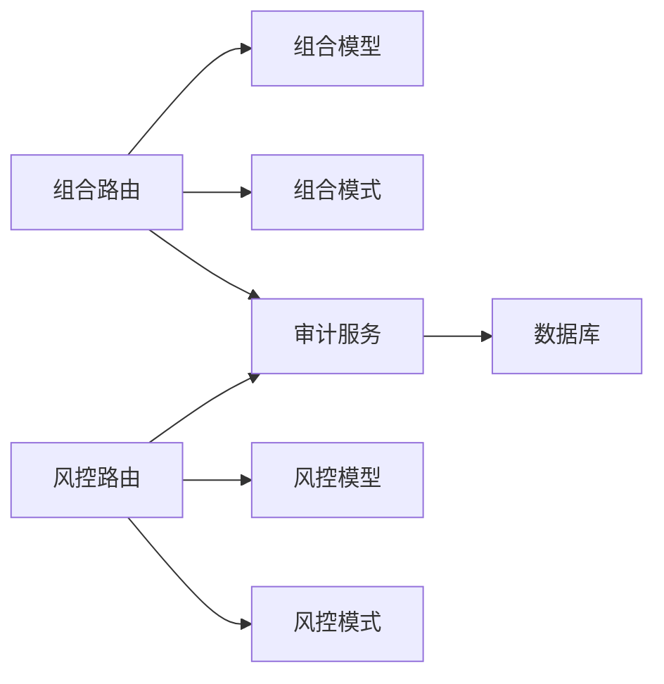

# 组合 API

<cite>
**本文引用的文件**
- [backend/app/api/v1/router.py](file://backend/app/api/v1/router.py)
- [backend/app/main.py](file://backend/app/main.py)
- [backend/app/api/v1/portfolio.py](file://backend/app/api/v1/portfolio.py)
- [backend/app/domains/portfolio/models.py](file://backend/app/domains/portfolio/models.py)
- [backend/app/domains/portfolio/schemas.py](file://backend/app/domains/portfolio/schemas.py)
- [backend/app/api/v1/risk.py](file://backend/app/api/v1/risk.py)
- [backend/app/domains/risk/models.py](file://backend/app/domains/risk/models.py)
- [backend/app/domains/risk/schemas.py](file://backend/app/domains/risk/schemas.py)
- [backend/app/services/audit_service.py](file://backend/app/services/audit_service.py)
- [backend/app/db/migrations/versions/20260513_000001_execution_risk_portfolio.py](file://backend/app/db/migrations/versions/20260513_000001_execution_risk_portfolio.py)
- [frontend/src/screens/Portfolio/index.tsx](file://frontend/src/screens/Portfolio/index.tsx)
- [frontend/src/contexts/PortfolioContext.tsx](file://frontend/src/contexts/PortfolioContext.tsx)
</cite>

## 目录
1. [简介](#简介)
2. [项目结构](#项目结构)
3. [核心组件](#核心组件)
4. [架构总览](#架构总览)
5. [详细组件分析](#详细组件分析)
6. [依赖分析](#依赖分析)
7. [性能考虑](#性能考虑)
8. [故障排查指南](#故障排查指南)
9. [结论](#结论)
10. [附录](#附录)

## 简介
本文件为“组合 API”的综合技术文档，聚焦于投资组合管理、资产配置、绩效分析与风险预算的 RESTful 接口设计与实现。内容覆盖组合构建、权重调整、收益计算与风险度量，同时包含多组合管理、资产类别分析、相关性矩阵与投资建议等能力。文档提供数据模型、分析指标与报告格式说明，帮助开发者快速实现专业级投资组合管理系统的接口。

## 项目结构
后端采用 FastAPI + SQLAlchemy 异步 ORM 架构，API v1 路由聚合器统一挂载各领域路由；前端通过 React + TypeScript 使用 API 获取组合概览与风控面板数据。数据库迁移脚本定义了组合、执行、风控相关的核心表结构。

**图表来源**
- [backend/app/main.py:1-65](file://backend/app/main.py#L1-L65)
- [backend/app/api/v1/router.py:1-40](file://backend/app/api/v1/router.py#L1-L40)
- [backend/app/api/v1/portfolio.py:1-186](file://backend/app/api/v1/portfolio.py#L1-L186)
- [backend/app/api/v1/risk.py:1-273](file://backend/app/api/v1/risk.py#L1-L273)
- [backend/app/domains/portfolio/models.py:1-83](file://backend/app/domains/portfolio/models.py#L1-L83)
- [backend/app/domains/risk/models.py:1-101](file://backend/app/domains/risk/models.py#L1-L101)
- [backend/app/services/audit_service.py:1-109](file://backend/app/services/audit_service.py#L1-L109)
- [backend/app/db/migrations/versions/20260513_000001_execution_risk_portfolio.py:1-316](file://backend/app/db/migrations/versions/20260513_000001_execution_risk_portfolio.py#L1-L316)
- [frontend/src/screens/Portfolio/index.tsx:1-43](file://frontend/src/screens/Portfolio/index.tsx#L1-L43)
- [frontend/src/contexts/PortfolioContext.tsx:1-13](file://frontend/src/contexts/PortfolioContext.tsx#L1-L13)

**章节来源**
- [backend/app/main.py:1-65](file://backend/app/main.py#L1-L65)
- [backend/app/api/v1/router.py:1-40](file://backend/app/api/v1/router.py#L1-L40)

## 核心组件
- 组合服务 API：提供组合概览（净值、再平衡建议）、资产配置、相关性矩阵、集中度分析与风险预算展示。
- 风控服务 API：提供风控概览（健康评分、预算使用、VaR、断路器、策略决策流、风险事件）。
- 审计服务：记录操作审计并维护不可篡改的哈希链。
- 数据模型与模式：定义组合、账户、头寸、现金、净值快照、再平衡提案等实体及序列化结构。
- 前端集成：组合页通过 API 拉取概览数据并渲染可视化组件。

**章节来源**
- [backend/app/api/v1/portfolio.py:140-152](file://backend/app/api/v1/portfolio.py#L140-L152)
- [backend/app/api/v1/risk.py:188-207](file://backend/app/api/v1/risk.py#L188-L207)
- [backend/app/services/audit_service.py:32-81](file://backend/app/services/audit_service.py#L32-L81)
- [backend/app/domains/portfolio/models.py:9-83](file://backend/app/domains/portfolio/models.py#L9-L83)
- [backend/app/domains/risk/models.py:9-101](file://backend/app/domains/risk/models.py#L9-L101)
- [frontend/src/screens/Portfolio/index.tsx:17-24](file://frontend/src/screens/Portfolio/index.tsx#L17-L24)

## 架构总览
组合 API 与风控 API 共享相同的路由前缀与异常处理机制，均通过异步数据库会话访问持久层，并在关键动作（如批准再平衡、触发断路器）时写入审计日志并通过 WebSocket 广播事件。

**图表来源**
- [backend/app/main.py:56-58](file://backend/app/main.py#L56-L58)
- [backend/app/api/v1/router.py:25-40](file://backend/app/api/v1/router.py#L25-L40)
- [backend/app/api/v1/portfolio.py:140-152](file://backend/app/api/v1/portfolio.py#L140-L152)
- [backend/app/api/v1/risk.py:188-207](file://backend/app/api/v1/risk.py#L188-L207)
- [backend/app/services/audit_service.py:38-81](file://backend/app/services/audit_service.py#L38-L81)

## 详细组件分析

### 组合服务 API
- 路由与端点
  - GET /api/v1/portfolio/overview：返回组合驾驶舱（净值、风险预算、资产配置、相关性、集中度、再平衡建议）。
  - GET /api/v1/portfolio/rebalance：列出待处理再平衡提案。
  - POST /api/v1/portfolio/rebalance/{proposal_id}/approve：批准再平衡提案并记录审计日志。
- 关键流程
  - 获取最新净值快照并计算当日收益与收益率。
  - 查询待处理再平衡提案并映射为前端可用的数据结构。
  - 批准流程包含状态校验与审计日志写入。
- 数据模型与模式
  - 模型：净值快照、再平衡提案。
  - 模式：净值、风险预算、资产配置、相关性、集中度、再平衡动作、组合概览。
- 复杂度与性能
  - 查询均为轻量级聚合或分页查询，复杂度 O(1) 或 O(n)（n 为返回条目数）。
  - 建议缓存热点数据（如最近净值）以降低数据库压力。
- 错误处理
  - 未找到提案时返回 404；非待处理状态返回 409。
- 审计与合规
  - 批准动作写入审计日志，便于合规追溯。

**图表来源**
- [backend/app/api/v1/portfolio.py:140-152](file://backend/app/api/v1/portfolio.py#L140-L152)
- [backend/app/api/v1/portfolio.py:155-158](file://backend/app/api/v1/portfolio.py#L155-L158)
- [backend/app/api/v1/portfolio.py:161-185](file://backend/app/api/v1/portfolio.py#L161-L185)
- [backend/app/services/audit_service.py:38-81](file://backend/app/services/audit_service.py#L38-L81)

**章节来源**
- [backend/app/api/v1/portfolio.py:140-185](file://backend/app/api/v1/portfolio.py#L140-L185)
- [backend/app/domains/portfolio/models.py:56-83](file://backend/app/domains/portfolio/models.py#L56-L83)
- [backend/app/domains/portfolio/schemas.py:6-94](file://backend/app/domains/portfolio/schemas.py#L6-L94)

### 风控服务 API
- 路由与端点
  - GET /api/v1/risk/overview：返回风控概览（健康评分、预算、VaR、断路器、策略决策流、风险事件）。
  - POST /api/v1/risk/circuit-breakers/{level}/trigger：手动触发指定级别的断路器。
  - POST /api/v1/risk/circuit-breakers/{level}/recover：请求断路器恢复。
- 关键流程
  - 计算健康评分（基于活跃风险事件与自动阻断次数）。
  - 汇总风险预算使用情况与 VaR 历史。
  - 断路器触发与恢复更新状态并广播事件。
- 数据模型与模式
  - 模型：风险规则、检查、预算、VaR 快照、断路器、风险事件、策略决策。
  - 模式：风控头部、KPI、预算行、VaR 面板、断路器、策略决策输出、风险事件输出、风控概览。
- 复杂度与性能
  - 查询为固定数量限制的分页查询，复杂度 O(1)。
- 错误处理
  - 断路器不存在返回 404；已触发恢复请求返回 409。
- 审计与合规
  - 触发与恢复动作写入审计日志并广播至 WebSocket 主题。

**图表来源**
- [backend/app/api/v1/risk.py:188-207](file://backend/app/api/v1/risk.py#L188-L207)
- [backend/app/api/v1/risk.py:210-239](file://backend/app/api/v1/risk.py#L210-L239)
- [backend/app/api/v1/risk.py:242-272](file://backend/app/api/v1/risk.py#L242-L272)
- [backend/app/services/audit_service.py:38-81](file://backend/app/services/audit_service.py#L38-L81)

**章节来源**
- [backend/app/api/v1/risk.py:188-272](file://backend/app/api/v1/risk.py#L188-L272)
- [backend/app/domains/risk/models.py:9-101](file://backend/app/domains/risk/models.py#L9-L101)
- [backend/app/domains/risk/schemas.py:6-96](file://backend/app/domains/risk/schemas.py#L6-L96)

### 数据模型与模式
- 组合领域
  - 实体：组合、账户、头寸、现金余额、净值快照、再平衡提案。
  - 模式：净值、风险预算、资产配置、相关性、集中度、再平衡动作、组合概览。
- 风控领域
  - 实体：风险规则、检查、预算、VaR 快照、断路器、风险事件、策略决策。
  - 模式：风控头部、KPI、预算行、VaR 面板、断路器、策略决策输出、风险事件输出、风控概览。
- 迁移脚本
  - 定义上述实体对应的数据库表结构与索引。

**图表来源**
- [backend/app/db/migrations/versions/20260513_000001_execution_risk_portfolio.py:220-291](file://backend/app/db/migrations/versions/20260513_000001_execution_risk_portfolio.py#L220-L291)
- [backend/app/domains/portfolio/models.py:9-83](file://backend/app/domains/portfolio/models.py#L9-L83)
- [backend/app/domains/risk/models.py:9-101](file://backend/app/domains/risk/models.py#L9-L101)

**章节来源**
- [backend/app/domains/portfolio/models.py:9-83](file://backend/app/domains/portfolio/models.py#L9-L83)
- [backend/app/domains/portfolio/schemas.py:6-94](file://backend/app/domains/portfolio/schemas.py#L6-L94)
- [backend/app/domains/risk/models.py:9-101](file://backend/app/domains/risk/models.py#L9-L101)
- [backend/app/domains/risk/schemas.py:6-96](file://backend/app/domains/risk/schemas.py#L6-L96)
- [backend/app/db/migrations/versions/20260513_000001_execution_risk_portfolio.py:32-316](file://backend/app/db/migrations/versions/20260513_000001_execution_risk_portfolio.py#L32-L316)

### 前端集成与使用
- 组合页在挂载时调用组合概览接口，拉取数据后通过上下文传递给子组件（净值条、资产配置环形图、风险预算仪表、相关性矩阵、集中度柱状图、再平衡动作）进行渲染。
- 前端上下文确保子组件可直接访问组合数据，简化数据流。

**图表来源**
- [frontend/src/screens/Portfolio/index.tsx:17-24](file://frontend/src/screens/Portfolio/index.tsx#L17-L24)
- [frontend/src/contexts/PortfolioContext.tsx:4-12](file://frontend/src/contexts/PortfolioContext.tsx#L4-L12)
- [backend/app/api/v1/portfolio.py:140-152](file://backend/app/api/v1/portfolio.py#L140-L152)

**章节来源**
- [frontend/src/screens/Portfolio/index.tsx:17-42](file://frontend/src/screens/Portfolio/index.tsx#L17-L42)
- [frontend/src/contexts/PortfolioContext.tsx:4-12](file://frontend/src/contexts/PortfolioContext.tsx#L4-L12)

## 依赖分析
- 组件耦合
  - 组合与风控路由分别依赖各自领域的模型与模式，耦合度低，职责清晰。
  - 审计服务被组合与风控的关键动作调用，形成横切关注点。
- 外部依赖
  - FastAPI、SQLAlchemy 异步 ORM、Alembic 迁移。
  - WebSocket 管理器用于风控事件广播。
- 循环依赖
  - 当前结构未发现循环依赖。

**图表来源**
- [backend/app/api/v1/portfolio.py:10-24](file://backend/app/api/v1/portfolio.py#L10-L24)
- [backend/app/api/v1/risk.py:9-26](file://backend/app/api/v1/risk.py#L9-L26)
- [backend/app/services/audit_service.py:10-16](file://backend/app/services/audit_service.py#L10-L16)

**章节来源**
- [backend/app/api/v1/portfolio.py:10-24](file://backend/app/api/v1/portfolio.py#L10-L24)
- [backend/app/api/v1/risk.py:9-26](file://backend/app/api/v1/risk.py#L9-L26)
- [backend/app/services/audit_service.py:10-16](file://backend/app/services/audit_service.py#L10-L16)

## 性能考虑
- 查询优化
  - 使用索引列（如组合 ID、状态、时间戳）加速查询。
  - 对返回列表设置上限（如 20 条），避免大结果集。
- 缓存策略
  - 对热点数据（如最新净值、断路器状态）增加缓存层。
- 并发与连接池
  - 合理配置数据库连接池大小与超时参数。
- 日志与追踪
  - 使用中间件记录请求耗时与错误，辅助性能分析。

## 故障排查指南
- 组合 API
  - 404：再平衡提案不存在；确认 proposal_id 是否正确。
  - 409：提案状态非待处理；检查当前状态是否为 pending。
  - 审计日志缺失：确认审计服务初始化与提交成功。
- 风控 API
  - 404：断路器级别不存在；确认 level 是否为 L1-L4。
  - 409：断路器已处于目标状态；例如已触发却再次触发。
  - 事件未广播：检查 WebSocket 管理器与主题订阅。
- 通用
  - 数据库连接失败：检查 Alembic 迁移是否完成，表结构是否存在。
  - 健康评分异常：核对活跃风险事件与自动阻断计数是否正确。

**章节来源**
- [backend/app/api/v1/portfolio.py:167-170](file://backend/app/api/v1/portfolio.py#L167-L170)
- [backend/app/api/v1/risk.py:218-219](file://backend/app/api/v1/risk.py#L218-L219)
- [backend/app/api/v1/risk.py:252-253](file://backend/app/api/v1/risk.py#L252-L253)

## 结论
组合 API 与风控 API 在当前版本中提供了完整且可扩展的投资组合管理与风险控制能力。通过清晰的领域模型、严格的审计与事件广播机制，以及前端友好的数据结构，开发者可以在此基础上快速实现更复杂的组合构建、权重调整、收益与风险度量功能，并进一步接入回测与实盘执行流水线。

## 附录

### 接口清单与示例路径
- 组合概览
  - GET /api/v1/portfolio/overview → [backend/app/api/v1/portfolio.py:140-152](file://backend/app/api/v1/portfolio.py#L140-L152)
- 再平衡列表
  - GET /api/v1/portfolio/rebalance → [backend/app/api/v1/portfolio.py:155-158](file://backend/app/api/v1/portfolio.py#L155-L158)
- 批准再平衡
  - POST /api/v1/portfolio/rebalance/{proposal_id}/approve → [backend/app/api/v1/portfolio.py:161-185](file://backend/app/api/v1/portfolio.py#L161-L185)
- 风控概览
  - GET /api/v1/risk/overview → [backend/app/api/v1/risk.py:188-207](file://backend/app/api/v1/risk.py#L188-L207)
- 触发断路器
  - POST /api/v1/risk/circuit-breakers/{level}/trigger → [backend/app/api/v1/risk.py:210-239](file://backend/app/api/v1/risk.py#L210-L239)
- 请求断路器恢复
  - POST /api/v1/risk/circuit-breakers/{level}/recover → [backend/app/api/v1/risk.py:242-272](file://backend/app/api/v1/risk.py#L242-L272)

### 数据模型与字段说明
- 组合模型
  - 净值快照：包含组合 ID、时间戳、净值、当日损益、杠杆等。
  - 再平衡提案：包含类型、标的、方向、原因、影响、紧急度、状态等。
- 风控模型
  - 风险预算：指标名称、限额、使用量、单位、色调描述。
  - VaR 快照：日/周 VaR、置信度、时间戳。
  - 断路器：级别、名称、触发条件、动作、状态、24 小时触发次数、最后触发时间。
  - 风险事件：严重程度、标题、详情、处置方案、状态。
  - 策略决策：执行者、请求、决策、原因、耗时、快照。

**章节来源**
- [backend/app/domains/portfolio/models.py:56-83](file://backend/app/domains/portfolio/models.py#L56-L83)
- [backend/app/domains/risk/models.py:34-101](file://backend/app/domains/risk/models.py#L34-L101)