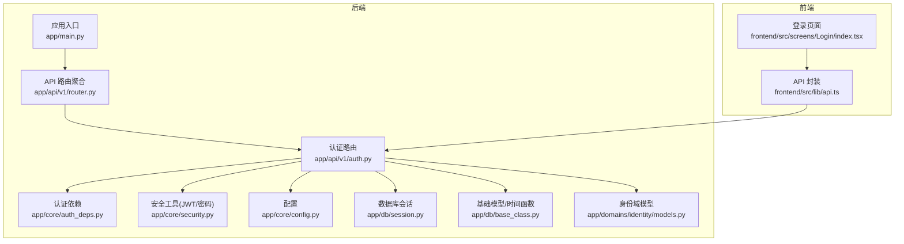
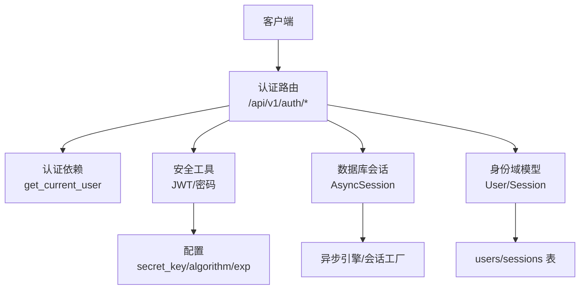
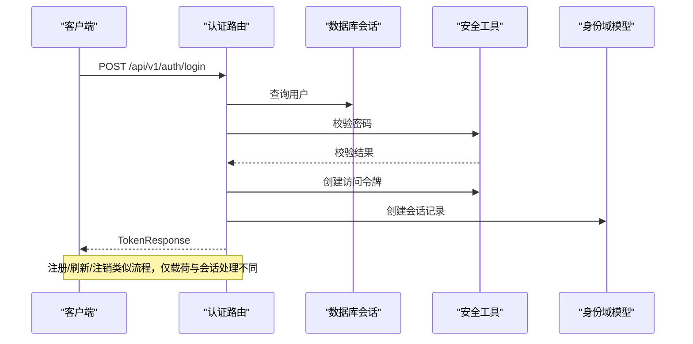
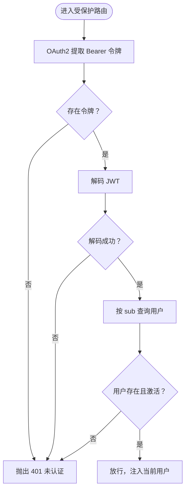
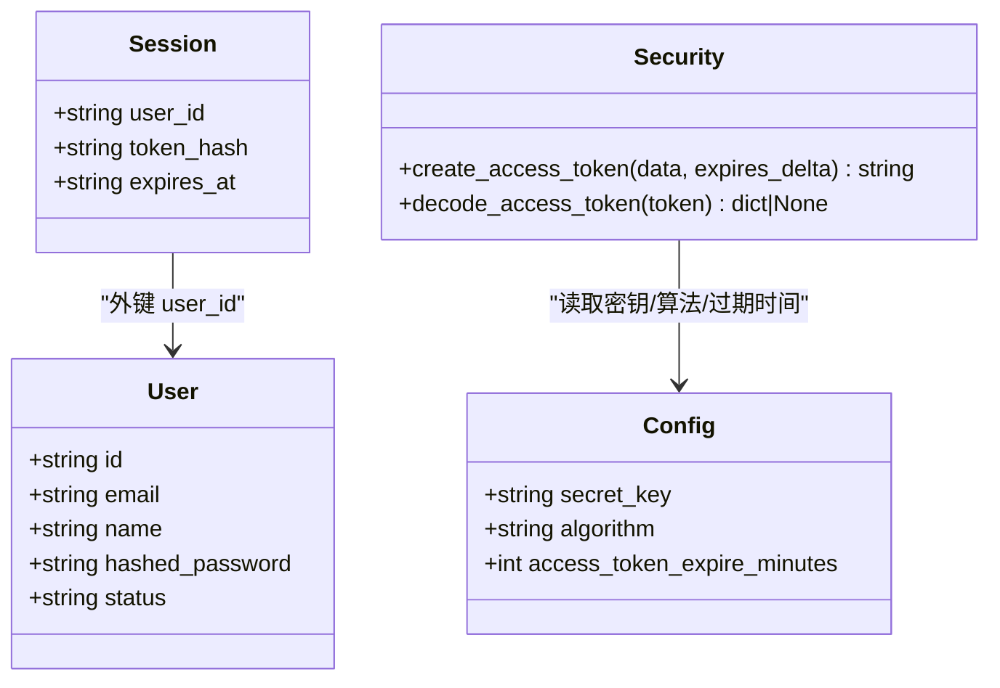
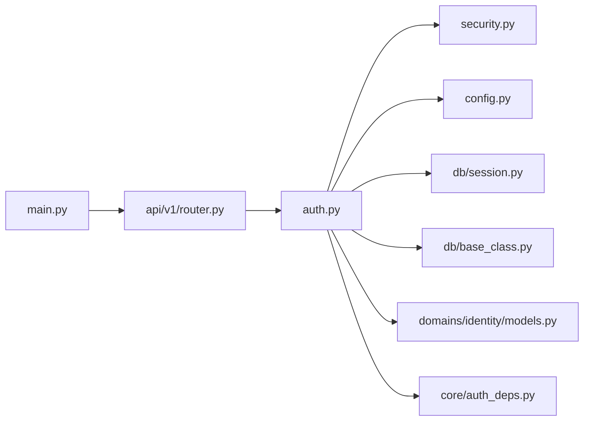

# 认证 API

<cite>
**本文档引用的文件**
- [backend/app/api/v1/auth.py](file://backend/app/api/v1/auth.py)
- [backend/app/core/auth_deps.py](file://backend/app/core/auth_deps.py)
- [backend/app/core/security.py](file://backend/app/core/security.py)
- [backend/app/domains/identity/models.py](file://backend/app/domains/identity/models.py)
- [backend/app/api/v1/router.py](file://backend/app/api/v1/router.py)
- [backend/app/core/config.py](file://backend/app/core/config.py)
- [backend/app/db/session.py](file://backend/app/db/session.py)
- [backend/app/db/base_class.py](file://backend/app/db/base_class.py)
- [backend/app/main.py](file://backend/app/main.py)
- [frontend/src/lib/api.ts](file://frontend/src/lib/api.ts)
- [frontend/src/screens/Login/index.tsx](file://frontend/src/screens/Login/index.tsx)
- [backend/tests/api/test_screens.py](file://backend/tests/api/test_screens.py)
- [backend/app/core/errors.py](file://backend/app/core/errors.py)
- [backend/app/core/tracing.py](file://backend/app/core/tracing.py)
</cite>

## 目录
1. [简介](#简介)
2. [项目结构](#项目结构)
3. [核心组件](#核心组件)
4. [架构总览](#架构总览)
5. [详细组件分析](#详细组件分析)
6. [依赖分析](#依赖分析)
7. [性能考虑](#性能考虑)
8. [故障排除指南](#故障排除指南)
9. [结论](#结论)
10. [附录](#附录)

## 简介
本文件系统化梳理后端认证 API 的设计与实现，覆盖用户登录、注册、令牌刷新与注销等 RESTful 接口；深入解析 JWT 令牌机制、会话管理、密码加密与安全策略；阐述认证中间件与权限验证流程，并提供请求/响应示例、错误处理机制与安全最佳实践，帮助开发者正确实现用户身份认证与访问控制。

## 项目结构
认证相关代码集中在后端应用的 API v1 层，配合核心安全工具、数据库会话管理与身份域模型共同构成完整的认证体系。前端通过统一的 API 封装调用认证接口。

**图表来源**
- [backend/app/api/v1/router.py:25](file://backend/app/api/v1/router.py#L25)
- [backend/app/api/v1/auth.py:20](file://backend/app/api/v1/auth.py#L20)
- [backend/app/core/auth_deps.py:12](file://backend/app/core/auth_deps.py#L12)
- [backend/app/core/security.py:24](file://backend/app/core/security.py#L24)
- [backend/app/core/config.py:65](file://backend/app/core/config.py#L65)
- [backend/app/db/session.py:24](file://backend/app/db/session.py#L24)
- [backend/app/db/base_class.py:12](file://backend/app/db/base_class.py#L12)
- [backend/app/domains/identity/models.py:19](file://backend/app/domains/identity/models.py#L19)
- [backend/app/main.py:57](file://backend/app/main.py#L57)
- [frontend/src/lib/api.ts:516](file://frontend/src/lib/api.ts#L516)
- [frontend/src/screens/Login/index.tsx:10](file://frontend/src/screens/Login/index.tsx#L10)

**章节来源**
- [backend/app/api/v1/router.py:25](file://backend/app/api/v1/router.py#L25)
- [backend/app/main.py:57](file://backend/app/main.py#L57)

## 核心组件
- 认证路由与接口：提供登录、注册、刷新、注销与当前用户查询接口，返回标准化 TokenResponse。
- 认证依赖：OAuth2 密码流方案，从 Authorization 头提取 Bearer 令牌，解码并校验有效性，加载用户信息。
- 安全工具：密码哈希（PBKDF2）、JWT 编解码（HS256），支持过期时间控制。
- 会话模型：记录用户登录会话，基于令牌哈希进行撤销与管理。
- 配置：密钥、算法、令牌有效期、CORS 等安全参数集中管理。
- 数据库会话：异步 SQLAlchemy 会话工厂与生命周期管理。
- 基础模型：统一审计字段与 UTC 时间工具。
- 错误处理与追踪：统一异常封装与请求追踪头注入。

**章节来源**
- [backend/app/api/v1/auth.py:24](file://backend/app/api/v1/auth.py#L24)
- [backend/app/core/auth_deps.py:15](file://backend/app/core/auth_deps.py#L15)
- [backend/app/core/security.py:14](file://backend/app/core/security.py#L14)
- [backend/app/domains/identity/models.py:51](file://backend/app/domains/identity/models.py#L51)
- [backend/app/core/config.py:65](file://backend/app/core/config.py#L65)
- [backend/app/db/session.py:24](file://backend/app/db/session.py#L24)
- [backend/app/db/base_class.py:12](file://backend/app/db/base_class.py#L12)
- [backend/app/core/errors.py:13](file://backend/app/core/errors.py#L13)
- [backend/app/core/tracing.py:49](file://backend/app/core/tracing.py#L49)

## 架构总览
认证 API 采用 FastAPI + SQLAlchemy 异步 ORM + JWT 的典型架构。认证流程通过 OAuth2 密码流完成，令牌在服务端以会话记录形式进行可撤销管理；安全策略由配置中心统一管控。

**图表来源**
- [backend/app/api/v1/auth.py:47](file://backend/app/api/v1/auth.py#L47)
- [backend/app/core/auth_deps.py:15](file://backend/app/core/auth_deps.py#L15)
- [backend/app/core/security.py:24](file://backend/app/core/security.py#L24)
- [backend/app/db/session.py:16](file://backend/app/db/session.py#L16)
- [backend/app/domains/identity/models.py:19](file://backend/app/domains/identity/models.py#L19)

## 详细组件分析

### 认证路由与接口
- 登录接口：接收表单数据（用户名/密码），校验用户状态与凭据，签发 JWT 并记录会话。
- 注册接口：检查邮箱唯一性，创建激活用户，签发 JWT 并记录会话。
- 刷新接口：基于有效旧令牌签发新令牌，更新会话。
- 注销接口：根据令牌哈希删除会话记录，实现即时撤销。
- 当前用户接口：通过认证依赖获取用户信息。

**图表来源**
- [backend/app/api/v1/auth.py:47](file://backend/app/api/v1/auth.py#L47)
- [backend/app/api/v1/auth.py:92](file://backend/app/api/v1/auth.py#L92)
- [backend/app/api/v1/auth.py:134](file://backend/app/api/v1/auth.py#L134)
- [backend/app/api/v1/auth.py:172](file://backend/app/api/v1/auth.py#L172)

**章节来源**
- [backend/app/api/v1/auth.py:47](file://backend/app/api/v1/auth.py#L47)
- [backend/app/api/v1/auth.py:92](file://backend/app/api/v1/auth.py#L92)
- [backend/app/api/v1/auth.py:134](file://backend/app/api/v1/auth.py#L134)
- [backend/app/api/v1/auth.py:172](file://backend/app/api/v1/auth.py#L172)
- [backend/app/api/v1/auth.py:185](file://backend/app/api/v1/auth.py#L185)

### 认证依赖与中间件
- OAuth2PasswordBearer：定义令牌端点，自动从 Authorization 头提取 Bearer 令牌。
- get_current_user：若缺少或无效令牌抛出 401；解码后查询用户并校验状态。
- get_optional_user：用于公开接口，令牌缺失或无效时返回空，便于匿名访问。

**图表来源**
- [backend/app/core/auth_deps.py:15](file://backend/app/core/auth_deps.py#L15)

**章节来源**
- [backend/app/core/auth_deps.py:12](file://backend/app/core/auth_deps.py#L12)
- [backend/app/core/auth_deps.py:15](file://backend/app/core/auth_deps.py#L15)
- [backend/app/core/auth_deps.py:42](file://backend/app/core/auth_deps.py#L42)

### JWT 令牌机制与会话管理
- 令牌签发：携带 sub/email/name，设置 exp，使用 HS256 算法签名。
- 令牌解码：校验签名与过期，异常则判定为无效或过期。
- 会话记录：登录/刷新时写入 sessions 表，注销时按 token_hash 删除，实现撤销。
- 令牌哈希：使用 SHA-256 对完整 JWT 进行哈希存储，便于快速匹配与撤销。

**图表来源**
- [backend/app/domains/identity/models.py:19](file://backend/app/domains/identity/models.py#L19)
- [backend/app/domains/identity/models.py:51](file://backend/app/domains/identity/models.py#L51)
- [backend/app/core/security.py:24](file://backend/app/core/security.py#L24)
- [backend/app/core/config.py:65](file://backend/app/core/config.py#L65)

**章节来源**
- [backend/app/core/security.py:24](file://backend/app/core/security.py#L24)
- [backend/app/core/security.py:32](file://backend/app/core/security.py#L32)
- [backend/app/domains/identity/models.py:51](file://backend/app/domains/identity/models.py#L51)
- [backend/app/api/v1/auth.py:43](file://backend/app/api/v1/auth.py#L43)

### 密码加密与安全策略
- 密码哈希：使用 PBKDF2 算法，确保不可逆存储。
- 登录校验：先查用户是否存在且有哈希，再比对明文与哈希。
- 令牌安全：生产环境必须更换默认密钥，建议使用强随机密钥；合理设置过期时间；启用 HTTPS 传输。

**章节来源**
- [backend/app/core/security.py:14](file://backend/app/core/security.py#L14)
- [backend/app/core/security.py:19](file://backend/app/core/security.py#L19)
- [backend/app/api/v1/auth.py:57](file://backend/app/api/v1/auth.py#L57)
- [backend/app/core/config.py:65](file://backend/app/core/config.py#L65)

### 权限验证与 API 访问控制
- 受保护路由：通过依赖注入 get_current_user 自动校验令牌与用户状态。
- 公开路由：可使用 get_optional_user 放宽限制，便于首页、登录页等场景。
- CORS：允许指定前端源，避免跨域问题。
- 异常处理：统一捕获自定义异常与通用异常，返回结构化错误信息并附带追踪 ID。

**章节来源**
- [backend/app/core/auth_deps.py:15](file://backend/app/core/auth_deps.py#L15)
- [backend/app/core/auth_deps.py:42](file://backend/app/core/auth_deps.py#L42)
- [backend/app/main.py:49](file://backend/app/main.py#L49)
- [backend/app/core/errors.py:73](file://backend/app/core/errors.py#L73)

### 请求与响应示例
以下示例展示常见交互路径，具体字段以实际返回为准。

- 登录
  - 方法与路径：POST /api/v1/auth/login
  - 请求头：Content-Type: application/x-www-form-urlencoded
  - 请求体：username=邮箱&password=密码
  - 成功响应：TokenResponse（包含 access_token、expires_in、user_id、name、email）
  - 失败响应：401 未授权（凭据错误或账户非激活）

- 注册
  - 方法与路径：POST /api/v1/auth/register
  - 请求头：Content-Type: application/json
  - 请求体：{ name, email, password }
  - 成功响应：TokenResponse（201 Created）
  - 失败响应：409 冲突（邮箱已存在）

- 刷新
  - 方法与路径：POST /api/v1/auth/refresh
  - 请求体：{ access_token }
  - 成功响应：新的 TokenResponse
  - 失败响应：401 未授权（令牌无效或过期）

- 注销
  - 方法与路径：POST /api/v1/auth/logout
  - 请求体：{ access_token }
  - 成功响应：{"status": "logged_out"}

- 当前用户
  - 方法与路径：GET /api/v1/auth/me
  - 请求头：Authorization: Bearer <access_token>
  - 成功响应：{ user_id, email, name, status }

前端调用参考：
- 前端 API 封装中包含 login/register/logout/refresh/me 的调用方式与错误处理逻辑。

**章节来源**
- [frontend/src/lib/api.ts:516](file://frontend/src/lib/api.ts#L516)
- [frontend/src/lib/api.ts:529](file://frontend/src/lib/api.ts#L529)
- [frontend/src/lib/api.ts:541](file://frontend/src/lib/api.ts#L541)
- [frontend/src/lib/api.ts:543](file://frontend/src/lib/api.ts#L543)
- [frontend/src/lib/api.ts:545](file://frontend/src/lib/api.ts#L545)
- [frontend/src/screens/Login/index.tsx:28](file://frontend/src/screens/Login/index.tsx#L28)

## 依赖分析
认证模块内部依赖清晰，耦合度低，职责明确：

**图表来源**
- [backend/app/api/v1/auth.py:13](file://backend/app/api/v1/auth.py#L13)
- [backend/app/core/security.py:9](file://backend/app/core/security.py#L9)
- [backend/app/core/config.py:48](file://backend/app/core/config.py#L48)
- [backend/app/db/session.py:3](file://backend/app/db/session.py#L3)
- [backend/app/db/base_class.py:6](file://backend/app/db/base_class.py#L6)
- [backend/app/domains/identity/models.py:6](file://backend/app/domains/identity/models.py#L6)
- [backend/app/core/auth_deps.py:8](file://backend/app/core/auth_deps.py#L8)
- [backend/app/api/v1/router.py:25](file://backend/app/api/v1/router.py#L25)
- [backend/app/main.py:57](file://backend/app/main.py#L57)

**章节来源**
- [backend/app/api/v1/auth.py:13](file://backend/app/api/v1/auth.py#L13)
- [backend/app/core/auth_deps.py:8](file://backend/app/core/auth_deps.py#L8)
- [backend/app/api/v1/router.py:25](file://backend/app/api/v1/router.py#L25)
- [backend/app/main.py:57](file://backend/app/main.py#L57)

## 性能考虑
- 异步数据库：使用 SQLAlchemy 异步引擎与会话，降低 I/O 阻塞。
- 令牌过期：合理设置 access_token_expire_minutes，平衡安全性与用户体验。
- 会话撤销：基于 token_hash 的 O(1) 查找与删除，适合高并发场景。
- 中间件：CORS 与追踪中间件开销较小，建议保留以提升可观测性。

[本节为通用指导，无需特定文件来源]

## 故障排除指南
- 401 未认证
  - 检查 Authorization 头是否包含正确的 Bearer 令牌。
  - 确认令牌未过期，且签名算法与密钥一致。
  - 核对用户状态是否为 active。
- 403 禁止访问
  - 账户状态非 active 时触发。
- 409 冲突
  - 注册时邮箱重复。
- 404 未找到
  - 路由或资源不存在。
- 500 内部错误
  - 统一异常处理器会返回结构化错误与追踪 ID，便于定位问题。

**章节来源**
- [backend/app/api/v1/auth.py:57](file://backend/app/api/v1/auth.py#L57)
- [backend/app/api/v1/auth.py:63](file://backend/app/api/v1/auth.py#L63)
- [backend/app/api/v1/auth.py:98](file://backend/app/api/v1/auth.py#L98)
- [backend/app/core/errors.py:73](file://backend/app/core/errors.py#L73)
- [backend/app/core/tracing.py:49](file://backend/app/core/tracing.py#L49)

## 结论
该认证体系以 JWT 为核心，结合 OAuth2 密码流与服务端会话记录，实现了可撤销、可追踪、可扩展的身份认证能力。通过统一的安全工具、配置中心与异常处理，满足生产环境的安全与可靠性要求。建议在生产环境中强化密钥管理、启用 HTTPS、定期轮换密钥，并结合前端存储策略（如 HttpOnly Cookie 或安全存储）进一步提升安全性。

[本节为总结性内容，无需特定文件来源]

## 附录

### API 规范概览
- 基础路径：/api/v1/auth
- 认证方式：OAuth2 密码流（Authorization: Bearer <access_token>）
- 令牌算法：HS256
- 默认过期时间：可通过配置调整

**章节来源**
- [backend/app/api/v1/router.py:25](file://backend/app/api/v1/router.py#L25)
- [backend/app/core/config.py:65](file://backend/app/core/config.py#L65)

### 测试参考
- 登录接口测试覆盖了成功、密码错误与未知用户三种情形。
- 建议在本地开发与 CI 环境中补充注册、刷新、注销与权限拦截的集成测试。

**章节来源**
- [backend/tests/api/test_screens.py:297](file://backend/tests/api/test_screens.py#L297)