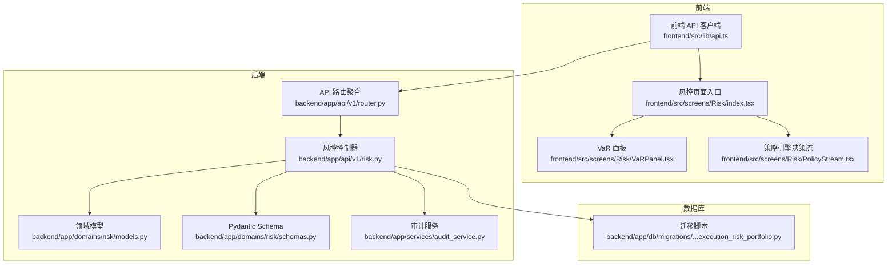
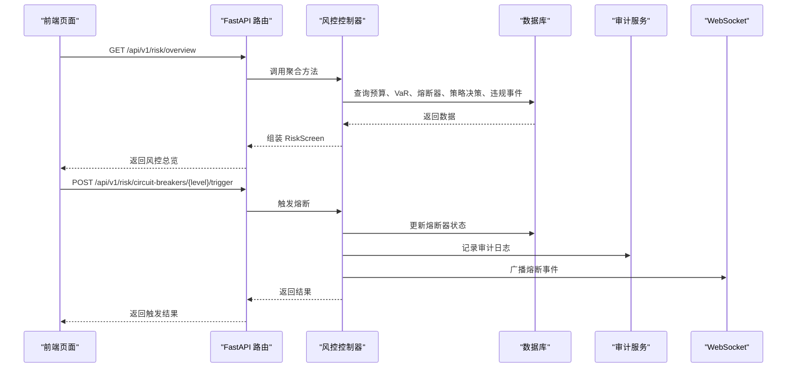
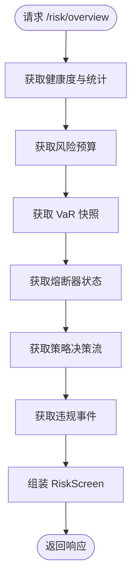
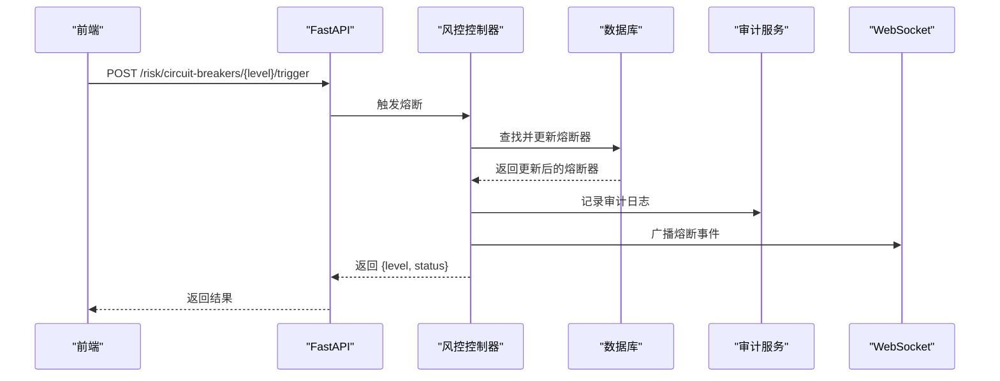
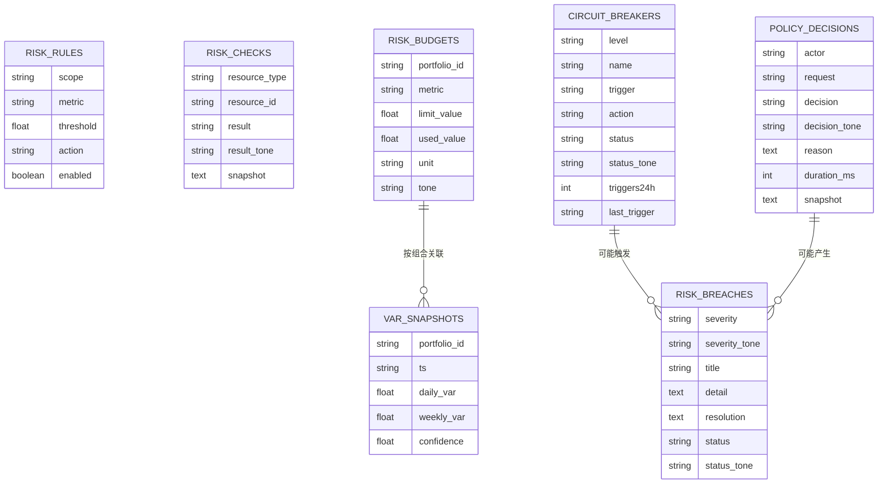
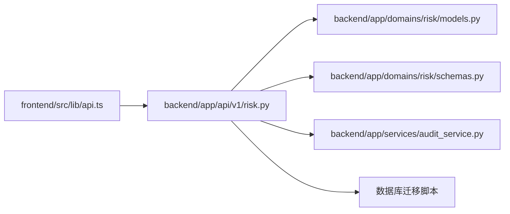

# 风控 API

<cite>
**本文档引用的文件**
- [backend/app/api/v1/risk.py](file://backend/app/api/v1/risk.py)
- [backend/app/api/v1/router.py](file://backend/app/api/v1/router.py)
- [backend/app/domains/risk/models.py](file://backend/app/domains/risk/models.py)
- [backend/app/domains/risk/schemas.py](file://backend/app/domains/risk/schemas.py)
- [backend/app/db/migrations/versions/20260513_000001_execution_risk_portfolio.py](file://backend/app/db/migrations/versions/20260513_000001_execution_risk_portfolio.py)
- [frontend/src/lib/api.ts](file://frontend/src/lib/api.ts)
- [frontend/src/screens/Risk/index.tsx](file://frontend/src/screens/Risk/index.tsx)
- [frontend/src/screens/Risk/VaRPanel.tsx](file://frontend/src/screens/Risk/VaRPanel.tsx)
- [frontend/src/screens/Risk/PolicyStream.tsx](file://frontend/src/screens/Risk/PolicyStream.tsx)
- [backend/app/services/audit_service.py](file://backend/app/services/audit_service.py)
- [doc/07-后端项目设计说明书.md](file://doc/07-后端项目设计说明书.md)
</cite>

## 目录
1. [简介](#简介)
2. [项目结构](#项目结构)
3. [核心组件](#核心组件)
4. [架构总览](#架构总览)
5. [详细组件分析](#详细组件分析)
6. [依赖分析](#依赖分析)
7. [性能考虑](#性能考虑)
8. [故障排查指南](#故障排查指南)
9. [结论](#结论)
10. [附录](#附录)

## 简介
本文件面向企业级量化交易风控系统，系统化梳理风控 API 的 RESTful 设计与实现，覆盖风险规则配置、实时监控、熔断触发与报警通知等能力。重点包括：
- 风险指标计算与阈值设置（VaR、最大回撤、组合Beta、杠杆等）
- 策略级与账户级风控管理
- 风险预算分配与使用跟踪
- 自动熔断与手动熔断机制
- 实时监控面板与告警格式
- 前后端数据契约与集成方式

## 项目结构
风控 API 位于后端 FastAPI 应用的 v1 版本路由下，采用“领域模型 + Pydantic Schema + API 控制器”的分层设计；前端通过统一的 API 客户端封装调用。

**图表来源**
- [backend/app/api/v1/router.py:1-40](file://backend/app/api/v1/router.py#L1-L40)
- [backend/app/api/v1/risk.py:1-273](file://backend/app/api/v1/risk.py#L1-L273)
- [backend/app/domains/risk/models.py:1-101](file://backend/app/domains/risk/models.py#L1-L101)
- [backend/app/domains/risk/schemas.py:1-96](file://backend/app/domains/risk/schemas.py#L1-L96)
- [backend/app/db/migrations/versions/20260513_000001_execution_risk_portfolio.py:153-203](file://backend/app/db/migrations/versions/20260513_000001_execution_risk_portfolio.py#L153-L203)

**章节来源**
- [backend/app/api/v1/router.py:1-40](file://backend/app/api/v1/router.py#L1-L40)
- [backend/app/api/v1/risk.py:1-273](file://backend/app/api/v1/risk.py#L1-L273)
- [backend/app/domains/risk/models.py:1-101](file://backend/app/domains/risk/models.py#L1-L101)
- [backend/app/domains/risk/schemas.py:1-96](file://backend/app/domains/risk/schemas.py#L1-L96)
- [backend/app/db/migrations/versions/20260513_000001_execution_risk_portfolio.py:153-203](file://backend/app/db/migrations/versions/20260513_000001_execution_risk_portfolio.py#L153-L203)

## 核心组件
- 风控控制器（FastAPI Router）：提供风控总览、熔断器触发/恢复等接口
- 领域模型（SQLAlchemy）：定义风险规则、检查记录、预算、VaR快照、熔断器、违规事件、策略决策等持久化结构
- Pydantic Schema：前后端数据契约，确保响应结构一致
- 审计服务：为风控操作（如熔断触发）生成审计日志并支持哈希链校验
- 前端 API 客户端：封装 /api/v1/risk/* 请求，供风控页面使用

**章节来源**
- [backend/app/api/v1/risk.py:1-273](file://backend/app/api/v1/risk.py#L1-L273)
- [backend/app/domains/risk/models.py:1-101](file://backend/app/domains/risk/models.py#L1-L101)
- [backend/app/domains/risk/schemas.py:1-96](file://backend/app/domains/risk/schemas.py#L1-L96)
- [backend/app/services/audit_service.py:1-109](file://backend/app/services/audit_service.py#L1-L109)
- [frontend/src/lib/api.ts:692-704](file://frontend/src/lib/api.ts#L692-L704)

## 架构总览
风控 API 采用“查询型聚合”模式：前端通过 GET /risk/overview 获取完整风控视图；熔断器相关操作通过 POST 接口进行状态变更，并记录审计日志与广播 WebSocket 事件。

**图表来源**
- [backend/app/api/v1/risk.py:188-273](file://backend/app/api/v1/risk.py#L188-L273)
- [backend/app/services/audit_service.py:32-81](file://backend/app/services/audit_service.py#L32-L81)

**章节来源**
- [backend/app/api/v1/risk.py:188-273](file://backend/app/api/v1/risk.py#L188-L273)
- [frontend/src/lib/api.ts:692-704](file://frontend/src/lib/api.ts#L692-L704)

## 详细组件分析

### 风控总览接口
- 路径：GET /api/v1/risk/overview
- 功能：返回风控仪表板所需的所有数据，包括健康度、预算、VaR、熔断器、策略决策流、违规事件等
- 数据来源：聚合多个查询方法，组装 RiskScreen
- 输出契约：RiskScreen（包含 header、kpis、budgets、var、circuits、policyStream、breaches）

**图表来源**
- [backend/app/api/v1/risk.py:188-207](file://backend/app/api/v1/risk.py#L188-L207)

**章节来源**
- [backend/app/api/v1/risk.py:188-207](file://backend/app/api/v1/risk.py#L188-L207)
- [backend/app/domains/risk/schemas.py:88-96](file://backend/app/domains/risk/schemas.py#L88-L96)

### 熔断器接口
- 触发熔断：POST /api/v1/risk/circuit-breakers/{level}/trigger
  - 参数：level（L1-L4）
  - 行为：更新对应熔断器状态为 triggered，累计 24 小时触发次数，记录审计日志，广播 WebSocket 事件
- 恢复熔断：POST /api/v1/risk/circuit-breakers/{level}/recover
  - 参数：level（L1-L4）
  - 行为：若状态非 armed，则更新为 cooldown；记录审计日志并广播事件

**图表来源**
- [backend/app/api/v1/risk.py:210-273](file://backend/app/api/v1/risk.py#L210-L273)
- [backend/app/services/audit_service.py:32-81](file://backend/app/services/audit_service.py#L32-L81)

**章节来源**
- [backend/app/api/v1/risk.py:210-273](file://backend/app/api/v1/risk.py#L210-L273)
- [frontend/src/lib/api.ts:694-703](file://frontend/src/lib/api.ts#L694-L703)

### 风控数据模型与关系

**图表来源**
- [backend/app/domains/risk/models.py:9-101](file://backend/app/domains/risk/models.py#L9-L101)
- [backend/app/db/migrations/versions/20260513_000001_execution_risk_portfolio.py:153-203](file://backend/app/db/migrations/versions/20260513_000001_execution_risk_portfolio.py#L153-L203)

**章节来源**
- [backend/app/domains/risk/models.py:1-101](file://backend/app/domains/risk/models.py#L1-L101)
- [doc/07-后端项目设计说明书.md:489-518](file://doc/07-后端项目设计说明书.md#L489-L518)

### 风控指标与阈值
- 指标类型：日 VaR、周 VaR、最大回撤、组合 Beta、杠杆
- 阈值设置：通过风险规则（scope、metric、threshold、action、enabled）配置
- 预算管理：按组合维度记录 limit_value/used_value，单位可为百分比等
- VaR 计算：从 VaR 快照表读取 daily_var、weekly_var、confidence，并提供历史序列

**章节来源**
- [backend/app/api/v1/risk.py:179-185](file://backend/app/api/v1/risk.py#L179-L185)
- [backend/app/domains/risk/models.py:14-18](file://backend/app/domains/risk/models.py#L14-L18)
- [backend/app/domains/risk/models.py:34-45](file://backend/app/domains/risk/models.py#L34-L45)
- [backend/app/domains/risk/models.py:48-58](file://backend/app/domains/risk/models.py#L48-L58)

### 风控预算分配与使用
- 预算维度：按组合（portfolio_id）划分
- 使用追踪：used_value 累计使用，结合 limit_value 判断是否越线
- 前端展示：RiskBudgetRow 提供名称、使用量、限额、单位、色调与描述

**章节来源**
- [backend/app/domains/risk/models.py:34-45](file://backend/app/domains/risk/models.py#L34-L45)
- [backend/app/domains/risk/schemas.py:24-31](file://backend/app/domains/risk/schemas.py#L24-L31)

### VaR 计算与分解
- 历史序列：最近 30 天的 VaR 快照，用于绘制曲线与统计峰值、均值
- 分解贡献：策略级 VaR 贡献度（含正负），用于定位风险来源
- 前端渲染：VaRPanel 展示日/周 VaR、置信度、历史曲线与分解列表

**章节来源**
- [backend/app/api/v1/risk.py:91-116](file://backend/app/api/v1/risk.py#L91-L116)
- [backend/app/domains/risk/schemas.py:33-53](file://backend/app/domains/risk/schemas.py#L33-L53)
- [frontend/src/screens/Risk/VaRPanel.tsx:1-119](file://frontend/src/screens/Risk/VaRPanel.tsx#L1-L119)

### 策略级风控管理（Policy Engine）
- 决策流：记录策略引擎的实时决策（allowed/denied/approval_required/modified），包含耗时与原因
- 前端展示：PolicyStream 统计各类决策数量与平均耗时

**章节来源**
- [backend/app/domains/risk/models.py:89-101](file://backend/app/domains/risk/models.py#L89-L101)
- [backend/app/domains/risk/schemas.py:67-75](file://backend/app/domains/risk/schemas.py#L67-L75)
- [frontend/src/screens/Risk/PolicyStream.tsx:1-42](file://frontend/src/screens/Risk/PolicyStream.tsx#L1-L42)

### 自动熔断与手动熔断
- 自动熔断：由策略引擎或风控规则触发（此处通过手动接口演示）
- 手动熔断：管理员可直接触发/恢复熔断器，状态变更并记录审计日志
- 熔断等级：L1-L4，支持 24 小时触发次数统计与最后触发时间

**章节来源**
- [backend/app/domains/risk/models.py:60-73](file://backend/app/domains/risk/models.py#L60-L73)
- [backend/app/api/v1/risk.py:210-273](file://backend/app/api/v1/risk.py#L210-L273)

### 报警与审计
- 审计日志：每次风控操作（如熔断触发）都会写入审计表，并生成哈希链
- 前端联动：控制器在熔断触发后通过 WebSocket 广播事件，前端可订阅主题进行实时提醒

**章节来源**
- [backend/app/services/audit_service.py:32-81](file://backend/app/services/audit_service.py#L32-L81)
- [backend/app/api/v1/risk.py:225-238](file://backend/app/api/v1/risk.py#L225-L238)

## 依赖分析
- 控制器依赖：AsyncSession 注入、领域模型查询、审计服务、WebSocket 管理器
- 前端依赖：统一 API 客户端封装，路由前缀 /api/v1，认证头携带
- 数据库依赖：迁移脚本定义了风险相关表结构与索引

**图表来源**
- [frontend/src/lib/api.ts:692-704](file://frontend/src/lib/api.ts#L692-L704)
- [backend/app/api/v1/risk.py:1-273](file://backend/app/api/v1/risk.py#L1-L273)
- [backend/app/db/migrations/versions/20260513_000001_execution_risk_portfolio.py:153-203](file://backend/app/db/migrations/versions/20260513_000001_execution_risk_portfolio.py#L153-L203)

**章节来源**
- [frontend/src/lib/api.ts:692-704](file://frontend/src/lib/api.ts#L692-L704)
- [backend/app/api/v1/risk.py:1-273](file://backend/app/api/v1/risk.py#L1-L273)
- [backend/app/db/migrations/versions/20260513_000001_execution_risk_portfolio.py:153-203](file://backend/app/db/migrations/versions/20260513_000001_execution_risk_portfolio.py#L153-L203)

## 性能考虑
- 查询聚合：/risk/overview 一次请求聚合多个查询，建议在数据库侧建立必要索引（如组合维度索引）以优化查询
- 历史数据截断：VaR 历史限制为最近 30 条，避免大结果集影响响应时间
- 异步访问：使用 SQLAlchemy 异步会话，减少阻塞
- 审计写入：审计日志写入与熔断状态更新在同一事务内，保证一致性

[本节为通用指导，无需特定文件引用]

## 故障排查指南
- 熔断器不存在：触发接口返回 404，检查 level 是否正确
- 状态冲突：恢复接口要求当前状态非 armed，否则返回 409
- 未授权：前端 API 客户端在 401 时清理本地 token 并触发登出事件
- 审计链校验：可通过审计服务提供的链校验方法验证日志完整性

**章节来源**
- [backend/app/api/v1/risk.py:218-219](file://backend/app/api/v1/risk.py#L218-L219)
- [backend/app/api/v1/risk.py:252-253](file://backend/app/api/v1/risk.py#L252-L253)
- [frontend/src/lib/api.ts:27-30](file://frontend/src/lib/api.ts#L27-L30)
- [backend/app/services/audit_service.py:83-109](file://backend/app/services/audit_service.py#L83-L109)

## 结论
本风控 API 以清晰的数据契约与稳定的后端实现，提供了企业级风控所需的监控、预算、VaR、熔断与审计能力。通过策略引擎决策流与实时面板，能够有效支撑策略级与账户级风控管理，并为自动熔断与人工干预提供统一接口。

[本节为总结，无需特定文件引用]

## 附录

### 接口清单与数据契约

- GET /api/v1/risk/overview
  - 响应：RiskScreen
  - 字段：header、kpis、budgets、var、circuits、policyStream、breaches

- POST /api/v1/risk/circuit-breakers/{level}/trigger
  - 路径参数：level ∈ {L1,L2,L3,L4}
  - 响应：{level, status}

- POST /api/v1/risk/circuit-breakers/{level}/recover
  - 路径参数：level ∈ {L1,L2,L3,L4}
  - 响应：{level, status}

- 前端调用封装
  - 前缀：/api/v1
  - 认证：Authorization: Bearer <token>
  - 方法：getJson/postJson/putJson/deleteJson

**章节来源**
- [backend/app/api/v1/risk.py:188-273](file://backend/app/api/v1/risk.py#L188-L273)
- [frontend/src/lib/api.ts:692-704](file://frontend/src/lib/api.ts#L692-L704)

### 风控数据模型字段参考
- 风控规则：scope、metric、threshold、action、enabled
- 风控检查：resource_type、resource_id、result、result_tone、snapshot
- 风控预算：portfolio_id、metric、limit_value、used_value、unit、tone、description
- VaR 快照：portfolio_id、ts、daily_var、weekly_var、confidence
- 熔断器：level、name、trigger、action、status、status_tone、triggers24h、last_trigger
- 违规事件：severity、severity_tone、title、detail、resolution、status、status_tone
- 策略决策：actor、request、decision、decision_tone、reason、duration_ms、snapshot

**章节来源**
- [doc/07-后端项目设计说明书.md:489-518](file://doc/07-后端项目设计说明书.md#L489-L518)