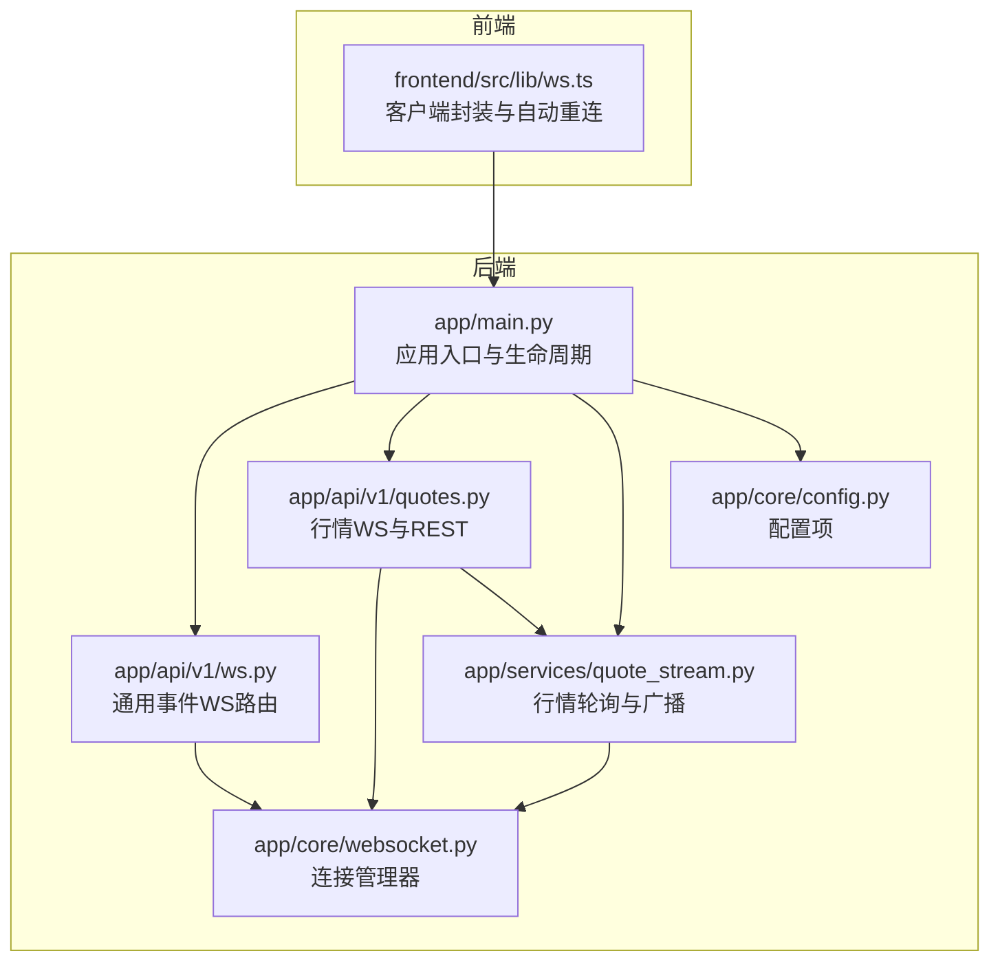
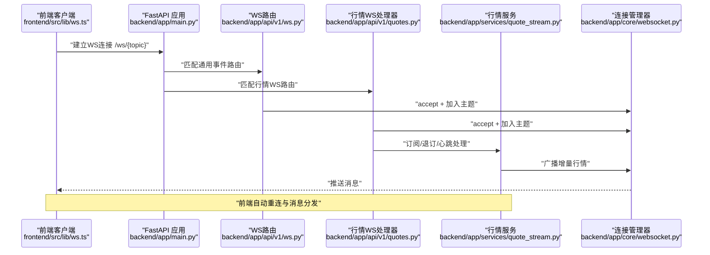
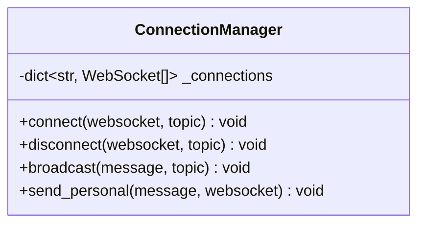
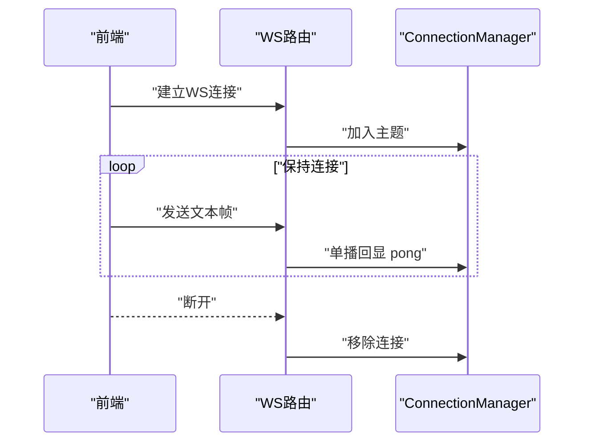
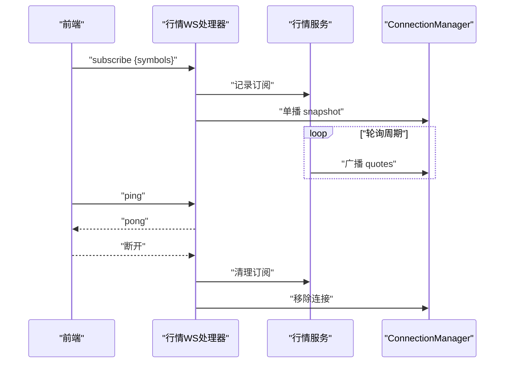
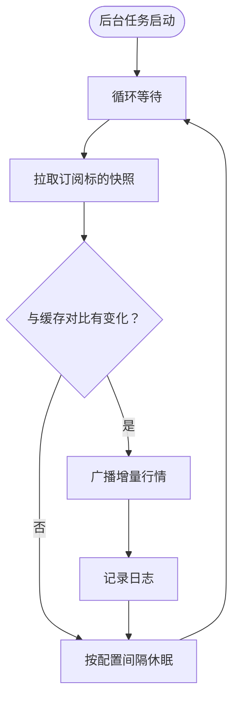
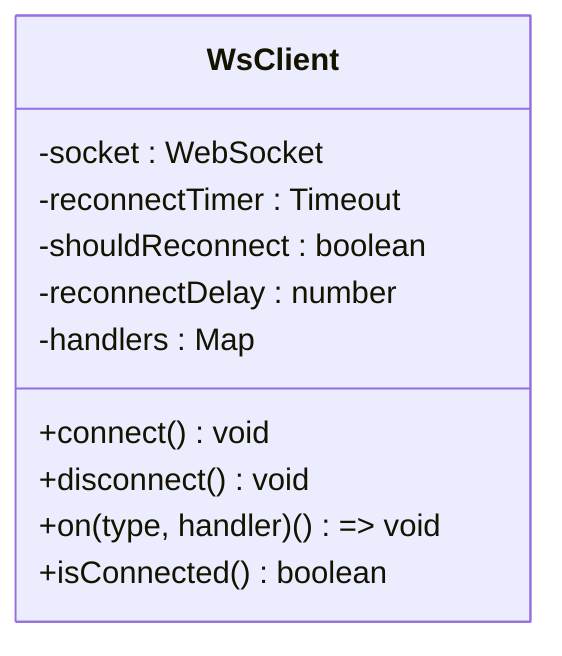
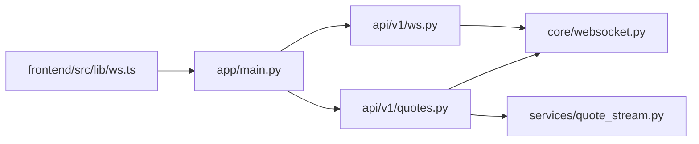

# WebSocket 通信

<cite>
**本文引用的文件**
- [backend/app/core/websocket.py](file://backend/app/core/websocket.py)
- [backend/app/api/v1/ws.py](file://backend/app/api/v1/ws.py)
- [backend/app/api/v1/quotes.py](file://backend/app/api/v1/quotes.py)
- [backend/app/services/quote_stream.py](file://backend/app/services/quote_stream.py)
- [backend/app/main.py](file://backend/app/main.py)
- [frontend/src/lib/ws.ts](file://frontend/src/lib/ws.ts)
- [backend/app/core/config.py](file://backend/app/core/config.py)
</cite>

## 目录
1. [简介](#简介)
2. [项目结构](#项目结构)
3. [核心组件](#核心组件)
4. [架构总览](#架构总览)
5. [详细组件分析](#详细组件分析)
6. [依赖关系分析](#依赖关系分析)
7. [性能考量](#性能考量)
8. [故障排查指南](#故障排查指南)
9. [结论](#结论)
10. [附录：开发示例与最佳实践](#附录开发示例与最佳实践)

## 简介
本文件系统性梳理 llmine-quant 后端的 WebSocket 通信体系，覆盖实时事件广播、连接管理、消息路由、心跳与订阅机制、以及前端客户端封装与自动重连策略。文档同时给出架构图、序列图、流程图与排障建议，帮助开发者快速构建稳定可靠的实时通信能力。

## 项目结构
WebSocket 相关代码主要分布在以下位置：
- 后端核心连接管理器：backend/app/core/websocket.py
- 通用事件 WebSocket 路由：backend/app/api/v1/ws.py
- 行情 WebSocket 与订阅：backend/app/api/v1/quotes.py
- 行情后台轮询与广播服务：backend/app/services/quote_stream.py
- 应用入口与生命周期挂载：backend/app/main.py
- 前端 WebSocket 客户端封装与自动重连：frontend/src/lib/ws.ts
- 配置项（轮询间隔等）：backend/app/core/config.py

图表来源
- [backend/app/main.py:39-58](file://backend/app/main.py#L39-L58)
- [backend/app/api/v1/ws.py:28-49](file://backend/app/api/v1/ws.py#L28-L49)
- [backend/app/api/v1/quotes.py:85-128](file://backend/app/api/v1/quotes.py#L85-L128)
- [backend/app/services/quote_stream.py:62-151](file://backend/app/services/quote_stream.py#L62-L151)
- [backend/app/core/websocket.py:10-44](file://backend/app/core/websocket.py#L10-L44)
- [frontend/src/lib/ws.ts:27-95](file://frontend/src/lib/ws.ts#L27-L95)

章节来源
- [backend/app/main.py:39-58](file://backend/app/main.py#L39-L58)
- [backend/app/api/v1/ws.py:28-49](file://backend/app/api/v1/ws.py#L28-L49)
- [backend/app/api/v1/quotes.py:85-128](file://backend/app/api/v1/quotes.py#L85-L128)
- [backend/app/services/quote_stream.py:62-151](file://backend/app/services/quote_stream.py#L62-L151)
- [backend/app/core/websocket.py:10-44](file://backend/app/core/websocket.py#L10-L44)
- [frontend/src/lib/ws.ts:27-95](file://frontend/src/lib/ws.ts#L27-L95)

## 核心组件
- 连接管理器 ConnectionManager：负责按主题(topic)维护 WebSocket 列表，提供接入、断开、广播与单播能力。
- 通用事件 WebSocket 路由：定义多条通用事件通道（如 events、strategy-events、execution-events、risk-events），统一心跳与断线处理。
- 行情 WebSocket 与订阅：支持订阅/退订、心跳 ping/pong、首次快照推送；配合后台轮询服务实现增量推送。
- 行情后台轮询服务：周期拉取市场快照，缓存并对比价格变化，仅对变更的标的进行广播。
- 前端客户端封装：基于原生 WebSocket 封装，支持按主题订阅、消息分发、指数退避自动重连。

章节来源
- [backend/app/core/websocket.py:10-44](file://backend/app/core/websocket.py#L10-L44)
- [backend/app/api/v1/ws.py:12-25](file://backend/app/api/v1/ws.py#L12-L25)
- [backend/app/api/v1/quotes.py:85-128](file://backend/app/api/v1/quotes.py#L85-L128)
- [backend/app/services/quote_stream.py:62-151](file://backend/app/services/quote_stream.py#L62-L151)
- [frontend/src/lib/ws.ts:27-95](file://frontend/src/lib/ws.ts#L27-L95)

## 架构总览
下图展示从浏览器到后端的典型交互路径：前端通过不同主题连接到后端，后端根据主题进行消息分发或业务处理（行情订阅/心跳等）。

图表来源
- [backend/app/main.py:39-58](file://backend/app/main.py#L39-L58)
- [backend/app/api/v1/ws.py:28-49](file://backend/app/api/v1/ws.py#L28-L49)
- [backend/app/api/v1/quotes.py:85-128](file://backend/app/api/v1/quotes.py#L85-L128)
- [backend/app/services/quote_stream.py:142-147](file://backend/app/services/quote_stream.py#L142-L147)
- [backend/app/core/websocket.py:16-41](file://backend/app/core/websocket.py#L16-L41)
- [frontend/src/lib/ws.ts:40-88](file://frontend/src/lib/ws.ts#L40-L88)

## 详细组件分析

### 连接管理器 ConnectionManager
- 角色：以主题为单位维护连接集合，提供接入、断开、广播、单播。
- 关键点：
  - 接入时记录连接并打印日志，便于监控连接数。
  - 广播时遍历该主题所有连接，异常连接会被移除，避免阻塞后续广播。
  - 单播用于回显心跳等场景。

图表来源
- [backend/app/core/websocket.py:10-44](file://backend/app/core/websocket.py#L10-L44)

章节来源
- [backend/app/core/websocket.py:10-44](file://backend/app/core/websocket.py#L10-L44)

### 通用事件 WebSocket 路由
- 提供多条通用事件通道：/events、/strategy-events、/execution-events、/risk-events。
- 统一处理心跳与断线：接收文本帧后回显 pong；捕获断线与异常并清理连接。
- 主题即通道名，便于前端按需订阅。

图表来源
- [backend/app/api/v1/ws.py:12-25](file://backend/app/api/v1/ws.py#L12-L25)
- [backend/app/api/v1/ws.py:28-49](file://backend/app/api/v1/ws.py#L28-L49)
- [backend/app/core/websocket.py:16-41](file://backend/app/core/websocket.py#L16-L41)

章节来源
- [backend/app/api/v1/ws.py:12-25](file://backend/app/api/v1/ws.py#L12-L25)
- [backend/app/api/v1/ws.py:28-49](file://backend/app/api/v1/ws.py#L28-L49)

### 行情 WebSocket 与订阅
- 支持的消息类型：
  - 订阅/退订：{"action": "subscribe"|"unsubscribe", "symbols": [...]}
  - 心跳：{"action": "ping"} → {"type": "pong"}
- 首次订阅推送快照：从内存缓存中返回已有的报价，提升体验。
- 断线与异常：捕获断线与异常，清理订阅并断开连接。

图表来源
- [backend/app/api/v1/quotes.py:85-128](file://backend/app/api/v1/quotes.py#L85-L128)
- [backend/app/services/quote_stream.py:86-100](file://backend/app/services/quote_stream.py#L86-L100)
- [backend/app/services/quote_stream.py:142-147](file://backend/app/services/quote_stream.py#L142-L147)
- [backend/app/core/websocket.py:16-41](file://backend/app/core/websocket.py#L16-L41)

章节来源
- [backend/app/api/v1/quotes.py:85-128](file://backend/app/api/v1/quotes.py#L85-L128)
- [backend/app/services/quote_stream.py:86-100](file://backend/app/services/quote_stream.py#L86-L100)
- [backend/app/services/quote_stream.py:142-147](file://backend/app/services/quote_stream.py#L142-L147)

### 行情后台轮询与广播
- 生命周期：在应用启动时启动后台任务，在关闭时停止。
- 订阅感知：仅对至少被一个客户端订阅的标的发起网络请求，避免全市场扫描。
- 增量推送：对比缓存中的价格，仅对发生变化的标的生成消息并广播。
- 轮询策略：交易时段按配置间隔轮询，非交易时段延长轮询间隔以节省资源。

图表来源
- [backend/app/services/quote_stream.py:73-82](file://backend/app/services/quote_stream.py#L73-L82)
- [backend/app/services/quote_stream.py:112-123](file://backend/app/services/quote_stream.py#L112-L123)
- [backend/app/services/quote_stream.py:125-147](file://backend/app/services/quote_stream.py#L125-L147)
- [backend/app/core/config.py:84](file://backend/app/core/config.py#L84)

章节来源
- [backend/app/services/quote_stream.py:73-82](file://backend/app/services/quote_stream.py#L73-L82)
- [backend/app/services/quote_stream.py:112-123](file://backend/app/services/quote_stream.py#L112-L123)
- [backend/app/services/quote_stream.py:125-147](file://backend/app/services/quote_stream.py#L125-L147)
- [backend/app/core/config.py:84](file://backend/app/core/config.py#L84)

### 前端 WebSocket 客户端封装
- 自动重连：指数退避，最大延迟上限，避免风暴重连。
- 消息分发：按消息 type 分派到对应处理器，支持通配符监听。
- 主题订阅：构造 ws://host/ws/{topic}，按主题隔离连接。
- 连接状态：暴露 isConnected 以便 UI 控制。

图表来源
- [frontend/src/lib/ws.ts:14-89](file://frontend/src/lib/ws.ts#L14-L89)

章节来源
- [frontend/src/lib/ws.ts:27-95](file://frontend/src/lib/ws.ts#L27-L95)

## 依赖关系分析
- 应用入口在 lifespan 中启动行情后台服务，并将 WS 路由注册到 /ws 前缀。
- 通用事件路由与行情路由均依赖连接管理器进行主题化广播。
- 行情路由依赖行情服务进行订阅管理与缓存快照推送。
- 前端通过 /ws/{topic} 与后端建立连接，自动重连与消息分发在前端完成。

图表来源
- [backend/app/main.py:39-58](file://backend/app/main.py#L39-L58)
- [backend/app/api/v1/ws.py:28-49](file://backend/app/api/v1/ws.py#L28-L49)
- [backend/app/api/v1/quotes.py:85-128](file://backend/app/api/v1/quotes.py#L85-L128)
- [backend/app/services/quote_stream.py:62-151](file://backend/app/services/quote_stream.py#L62-L151)
- [backend/app/core/websocket.py:10-44](file://backend/app/core/websocket.py#L10-L44)
- [frontend/src/lib/ws.ts:27-95](file://frontend/src/lib/ws.ts#L27-L95)

章节来源
- [backend/app/main.py:39-58](file://backend/app/main.py#L39-L58)
- [backend/app/api/v1/ws.py:28-49](file://backend/app/api/v1/ws.py#L28-L49)
- [backend/app/api/v1/quotes.py:85-128](file://backend/app/api/v1/quotes.py#L85-L128)
- [backend/app/services/quote_stream.py:62-151](file://backend/app/services/quote_stream.py#L62-L151)
- [backend/app/core/websocket.py:10-44](file://backend/app/core/websocket.py#L10-L44)
- [frontend/src/lib/ws.ts:27-95](file://frontend/src/lib/ws.ts#L27-L95)

## 性能考量
- 轮询策略：交易时段按配置间隔轮询，非交易时段延长轮询间隔，减少无效请求。
- 订阅感知：仅对有订阅的标的发起请求，避免全市场扫描。
- 增量推送：仅广播价格变化的标的，降低广播负载。
- 连接清理：广播失败会移除异常连接，避免连接列表膨胀。
- 前端重连：指数退避与上限控制，避免雪崩式重连。

章节来源
- [backend/app/services/quote_stream.py:112-123](file://backend/app/services/quote_stream.py#L112-L123)
- [backend/app/services/quote_stream.py:125-147](file://backend/app/services/quote_stream.py#L125-L147)
- [backend/app/core/websocket.py:27-41](file://backend/app/core/websocket.py#L27-L41)
- [frontend/src/lib/ws.ts:57-67](file://frontend/src/lib/ws.ts#L57-L67)

## 故障排查指南
- 常见问题与定位
  - 连接无法建立：检查 /ws 前缀是否正确注册，CORS 是否允许前端域名。
  - 无消息推送：确认客户端是否订阅了正确的主题；检查后台轮询是否运行；查看连接管理器是否仍有该主题连接。
  - 心跳无效：确认客户端发送的是 ping 动作；后端是否回显 pong；网络是否存在中间层导致帧丢失。
  - 退订无效：确认客户端发送 unsubscribe 消息；后端是否清理订阅；检查异常分支是否提前断开。
- 日志与可观测性
  - 后端连接/断开日志包含主题与当前连接数，便于观察连接健康。
  - 行情广播日志包含更新数量与观察标的数，便于评估推送规模。
- 处理步骤
  - 在前端开启调试，确认 onmessage 是否收到消息。
  - 在后端查看 ws 与 quote_stream 相关日志。
  - 检查应用生命周期是否正常启动/停止行情服务。
  - 如出现异常，确认断线捕获与清理逻辑是否执行。

章节来源
- [backend/app/core/websocket.py:16-25](file://backend/app/core/websocket.py#L16-L25)
- [backend/app/services/quote_stream.py:142-147](file://backend/app/services/quote_stream.py#L142-L147)
- [backend/app/api/v1/quotes.py:122-128](file://backend/app/api/v1/quotes.py#L122-L128)
- [backend/app/api/v1/ws.py:19-23](file://backend/app/api/v1/ws.py#L19-L23)

## 结论
llmine-quant 的 WebSocket 体系以主题化连接管理为核心，结合通用事件路由与行情专用路由，实现了可扩展的实时通信能力。通过订阅感知、增量推送与指数退避重连，系统在性能与可靠性之间取得平衡。开发者可基于现有模式快速扩展新的实时事件通道与业务推送。

## 附录：开发示例与最佳实践
- 建立连接
  - 通用事件：ws://host/ws/events 或 strategy-events 等
  - 行情：ws://host/ws/quotes
- 心跳与保活
  - 通用事件：发送文本帧触发 pong 回显
  - 行情：发送 {"action": "ping"} 获取 {"type": "pong"}
- 订阅与退订
  - 行情：{"action": "subscribe", "symbols": ["000001.SZ","600519.SH"]}
  - 行情：{"action": "unsubscribe", "symbols": ["000001.SZ"]}
- 前端封装使用
  - 创建客户端：createWsClient('strategy-events')
  - 订阅事件：ws.on('strategy_update', payload => ...)
  - 连接/断开：connect()/disconnect()
- 最佳实践
  - 为不同业务域划分主题，避免消息混杂
  - 对高频推送采用增量策略，减少广播体积
  - 前端实现指数退避与去抖，避免重复订阅风暴
  - 在网关/代理层确保 WebSocket 协议透传与长连接维持

章节来源
- [backend/app/api/v1/ws.py:28-49](file://backend/app/api/v1/ws.py#L28-L49)
- [backend/app/api/v1/quotes.py:85-128](file://backend/app/api/v1/quotes.py#L85-L128)
- [frontend/src/lib/ws.ts:27-95](file://frontend/src/lib/ws.ts#L27-L95)