# 后端开发指南

<cite>
**本文引用的文件**
- [backend/app/main.py](file://backend/app/main.py)
- [backend/app/api/v1/router.py](file://backend/app/api/v1/router.py)
- [backend/app/api/v1/strategies.py](file://backend/app/api/v1/strategies.py)
- [backend/app/api/v1/ws.py](file://backend/app/api/v1/ws.py)
- [backend/app/core/config.py](file://backend/app/core/config.py)
- [backend/app/core/websocket.py](file://backend/app/core/websocket.py)
- [backend/app/db/base.py](file://backend/app/db/base.py)
- [backend/app/integrations/llm/factory.py](file://backend/app/integrations/llm/factory.py)
- [backend/app/integrations/market_data/factory.py](file://backend/app/integrations/market_data/factory.py)
- [backend/app/services/paper_trading.py](file://backend/app/services/paper_trading.py)
- [backend/app/services/strategy_generation.py](file://backend/app/services/strategy_generation.py)
- [backend/app/tasks/celery_app.py](file://backend/app/tasks/celery_app.py)
- [backend/pyproject.toml](file://backend/pyproject.toml)
- [backend/README.md](file://backend/README.md)
</cite>

## 目录
1. [简介](#简介)
2. [项目结构](#项目结构)
3. [核心组件](#核心组件)
4. [架构总览](#架构总览)
5. [详细组件分析](#详细组件分析)
6. [依赖分析](#依赖分析)
7. [性能考虑](#性能考虑)
8. [故障排查指南](#故障排查指南)
9. [结论](#结论)
10. [附录](#附录)

## 简介
本指南面向 llmine-quant 后端开发者，系统性讲解 Python 后端的开发环境搭建、项目结构组织、核心模块设计与开发规范；深入解析 FastAPI 应用的路由设计、数据库模型定义、服务层业务逻辑与异步任务处理；覆盖 LLM 集成架构、市场数据适配器、WebSocket 实时通信等关键技术实现细节，并提供调试技巧与性能优化建议，帮助开发者高效完成功能开发与维护。

## 项目结构
后端采用分层与领域驱动相结合的组织方式：
- 应用入口与中间件：FastAPI 应用在应用入口文件中初始化生命周期、中间件、异常处理器与路由挂载。
- API 层：按版本聚合路由，每个子模块负责一组资源接口。
- 核心层：配置、日志、安全、追踪、WebSocket 管理等横切关注点。
- 数据访问层：SQLAlchemy 异步 ORM 基类与会话管理。
- 领域模型与 Schema：各业务域（策略、回测、执行、组合等）的模型与输入输出结构。
- 服务层：业务编排与流程控制，如策略生成流水线、纸交易引擎等。
- 集成层：LLM 提供商工厂、市场数据提供商工厂。
- 任务层：Celery 应用与定时任务调度。
- 脚本与测试：数据导入、种子数据、单元与集成测试。

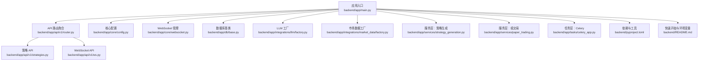

图表来源
- [backend/app/main.py:1-65](file://backend/app/main.py#L1-L65)
- [backend/app/api/v1/router.py:1-40](file://backend/app/api/v1/router.py#L1-L40)
- [backend/app/api/v1/strategies.py:1-200](file://backend/app/api/v1/strategies.py#L1-L200)
- [backend/app/api/v1/ws.py:1-50](file://backend/app/api/v1/ws.py#L1-L50)
- [backend/app/core/config.py:1-196](file://backend/app/core/config.py#L1-L196)
- [backend/app/core/websocket.py:1-45](file://backend/app/core/websocket.py#L1-L45)
- [backend/app/db/base.py:1-10](file://backend/app/db/base.py#L1-L10)
- [backend/app/integrations/llm/factory.py:1-66](file://backend/app/integrations/llm/factory.py#L1-L66)
- [backend/app/integrations/market_data/factory.py:1-57](file://backend/app/integrations/market_data/factory.py#L1-L57)
- [backend/app/services/strategy_generation.py:1-200](file://backend/app/services/strategy_generation.py#L1-L200)
- [backend/app/services/paper_trading.py:1-634](file://backend/app/services/paper_trading.py#L1-L634)
- [backend/app/tasks/celery_app.py:1-42](file://backend/app/tasks/celery_app.py#L1-L42)
- [backend/pyproject.toml:1-78](file://backend/pyproject.toml#L1-L78)
- [backend/README.md:1-45](file://backend/README.md#L1-L45)

章节来源
- [backend/app/main.py:1-65](file://backend/app/main.py#L1-L65)
- [backend/app/api/v1/router.py:1-40](file://backend/app/api/v1/router.py#L1-L40)
- [backend/README.md:1-45](file://backend/README.md#L1-L45)

## 核心组件
- 应用入口与生命周期：定义 FastAPI 实例、CORS 中间件、追踪中间件、全局异常处理器、健康检查端点，并在 lifespan 中启动行情流、优雅关闭时停止。
- API 路由聚合：统一挂载认证、仪表盘、数据、策略、回测、报价、风控、组合、执行、解释、安全、协作、审计、Agent 等路由。
- 配置中心：集中管理数据库、Redis、安全、CORS、API 前缀、分页、市场数据与 LLM 提供商等配置项，并支持从用户主目录自动加载代理凭据。
- WebSocket 管理：基于主题的连接管理器，支持广播与单播消息。
- 数据库基类：SQLAlchemy 异步 ORM 基类，为所有模型提供统一基类。
- LLM 工厂：根据配置动态选择 Mock、Anthropic 或 OpenAI 提供商。
- 市场数据工厂：根据配置选择 AkShare、TuShare、Wind 或 Mock 提供商。
- 服务层：
  - 策略生成流水线：从自然语言到代码、静态校验、持久化版本、回测、特征谱系记录与审计事件广播。
  - 纸交易引擎：按日执行标记、信号、预交易检查、撮合、净值写入与事后风控检查。
- 任务层：Celery 应用与定时任务（如每日盘后纸交易）。
- 开发工具链：pytest、ruff、mypy、基于 pydantic-settings 的配置与类型提示。

章节来源
- [backend/app/main.py:1-65](file://backend/app/main.py#L1-L65)
- [backend/app/api/v1/router.py:1-40](file://backend/app/api/v1/router.py#L1-L40)
- [backend/app/core/config.py:1-196](file://backend/app/core/config.py#L1-L196)
- [backend/app/core/websocket.py:1-45](file://backend/app/core/websocket.py#L1-L45)
- [backend/app/db/base.py:1-10](file://backend/app/db/base.py#L1-L10)
- [backend/app/integrations/llm/factory.py:1-66](file://backend/app/integrations/llm/factory.py#L1-L66)
- [backend/app/integrations/market_data/factory.py:1-57](file://backend/app/integrations/market_data/factory.py#L1-L57)
- [backend/app/services/strategy_generation.py:1-200](file://backend/app/services/strategy_generation.py#L1-L200)
- [backend/app/services/paper_trading.py:1-634](file://backend/app/services/paper_trading.py#L1-L634)
- [backend/app/tasks/celery_app.py:1-42](file://backend/app/tasks/celery_app.py#L1-L42)
- [backend/pyproject.toml:1-78](file://backend/pyproject.toml#L1-L78)

## 架构总览
下图展示 llmine-quant 后端的整体架构：FastAPI 作为入口，通过路由聚合暴露 REST 与 WebSocket 接口；服务层协调 LLM 与市场数据集成；数据库与 Redis 支撑状态存储与任务队列；Celery 执行周期性任务。

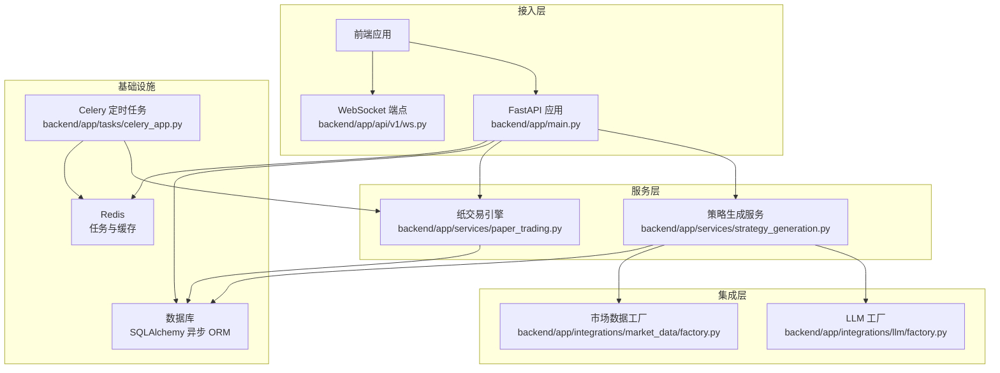

图表来源
- [backend/app/main.py:1-65](file://backend/app/main.py#L1-L65)
- [backend/app/api/v1/ws.py:1-50](file://backend/app/api/v1/ws.py#L1-L50)
- [backend/app/services/strategy_generation.py:1-200](file://backend/app/services/strategy_generation.py#L1-L200)
- [backend/app/services/paper_trading.py:1-634](file://backend/app/services/paper_trading.py#L1-L634)
- [backend/app/integrations/llm/factory.py:1-66](file://backend/app/integrations/llm/factory.py#L1-L66)
- [backend/app/integrations/market_data/factory.py:1-57](file://backend/app/integrations/market_data/factory.py#L1-L57)
- [backend/app/tasks/celery_app.py:1-42](file://backend/app/tasks/celery_app.py#L1-L42)

## 详细组件分析

### FastAPI 应用与路由设计
- 应用入口负责：
  - 初始化日志、追踪中间件、CORS、异常处理器。
  - 在 lifespan 中启动行情流并在关闭时停止。
  - 挂载 API v1 路由与 WebSocket 路由。
  - 提供健康检查端点。
- 路由聚合：
  - 将认证、仪表盘、数据、策略、回测、报价、风控、组合、执行、解释、安全、协作、审计、Agent、纸交易等路由按前缀与标签组织。
- 策略 API：
  - 提供策略概览、列表、详情、任务管理、流水线事件等接口。
  - 内部封装任务出参、列表项、版本出参与流水线事件出参的转换函数。
  - 提供后台运行流水线的任务执行器，使用独立会话避免并发问题。
  - 支持通过策略或任务 ID 解析真实策略与规范策略 ID。

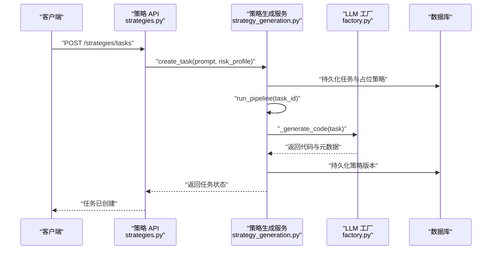

图表来源
- [backend/app/api/v1/strategies.py:125-130](file://backend/app/api/v1/strategies.py#L125-L130)
- [backend/app/services/strategy_generation.py:96-131](file://backend/app/services/strategy_generation.py#L96-L131)
- [backend/app/integrations/llm/factory.py:11-66](file://backend/app/integrations/llm/factory.py#L11-L66)

章节来源
- [backend/app/main.py:1-65](file://backend/app/main.py#L1-L65)
- [backend/app/api/v1/router.py:1-40](file://backend/app/api/v1/router.py#L1-L40)
- [backend/app/api/v1/strategies.py:1-200](file://backend/app/api/v1/strategies.py#L1-L200)
- [backend/app/services/strategy_generation.py:1-200](file://backend/app/services/strategy_generation.py#L1-L200)

### 数据库模型与会话
- 数据库基类：统一的 SQLAlchemy 异步 ORM 基类，所有模型继承该基类以获得一致的表映射与字段定义能力。
- 策略域模型：包含策略主表、版本表、任务表、流水线事件表与模板表，涵盖状态、指标、风险规则与描述等字段。
- 会话管理：通过异步会话在 API 与服务层注入，确保事务一致性与并发安全。

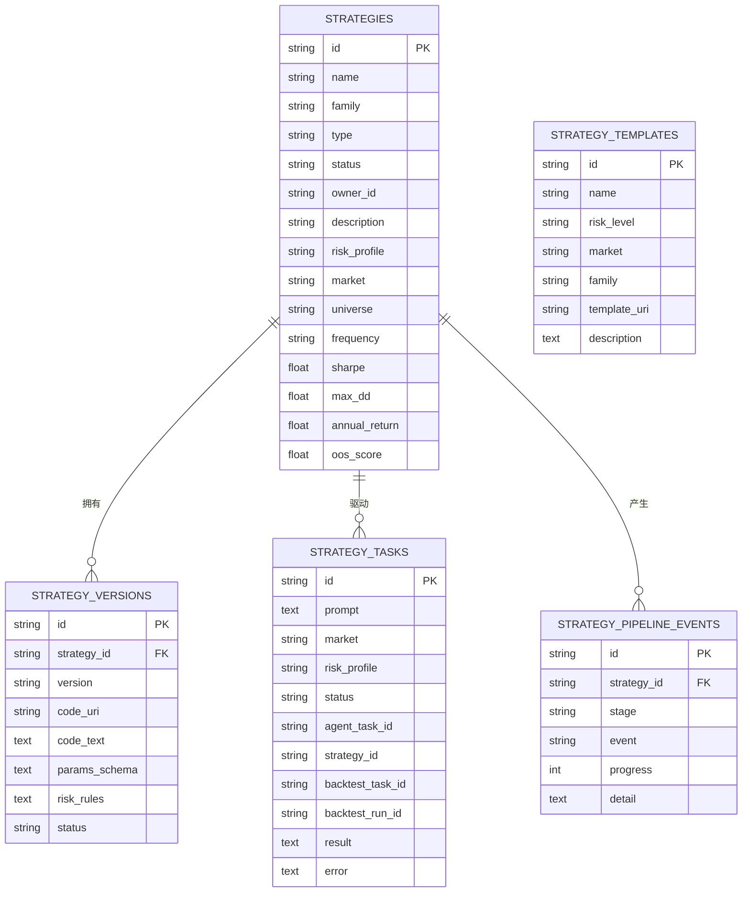

图表来源
- [backend/app/domains/strategy/models.py:1-84](file://backend/app/domains/strategy/models.py#L1-L84)

章节来源
- [backend/app/db/base.py:1-10](file://backend/app/db/base.py#L1-L10)
- [backend/app/domains/strategy/models.py:1-84](file://backend/app/domains/strategy/models.py#L1-L84)

### 服务层业务逻辑：策略生成流水线
- 流水线阶段：
  - 占位策略创建与任务状态更新。
  - 研究扫描（宏观、板块轮动等）。
  - 代码生成（调用 LLM 工厂）、静态检查（AST、DSL 语义、接口约束、未来数据防护）。
  - 持久化策略版本（快照代码与参数模式），并记录特征谱系与审计事件。
  - 回测与指标汇总（夏普、最大回撤、年化收益、胜率、换手等），用于策略状态更新与前端展示。
- 事件广播：通过 WebSocket 管理器向订阅者推送流水线事件，支持实时反馈。

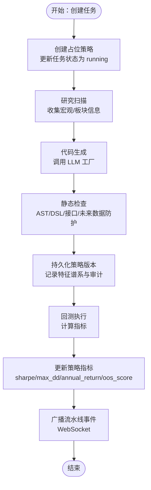

图表来源
- [backend/app/services/strategy_generation.py:132-200](file://backend/app/services/strategy_generation.py#L132-L200)
- [backend/app/integrations/llm/factory.py:11-66](file://backend/app/integrations/llm/factory.py#L11-L66)
- [backend/app/core/websocket.py:27-41](file://backend/app/core/websocket.py#L27-L41)

章节来源
- [backend/app/services/strategy_generation.py:1-200](file://backend/app/services/strategy_generation.py#L1-L200)
- [backend/app/core/websocket.py:1-45](file://backend/app/core/websocket.py#L1-L45)

### 服务层业务逻辑：纸交易引擎
- 日终处理流程：
  - 标记：按收盘价重估持仓市值与权重。
  - 信号：基于内置双均线策略（由生成规范投影而来）计算目标权重。
  - 预交易检查：单只头寸上限、现金底仓、当日亏损与最大回撤等硬规则。
  - 撮合：按滑点与手续费模型成交，更新资金与持仓。
  - 净值：写入日度净值点，计算日收益与回撤，并进行事后风控检查。
- 并发与幂等：对账户最后处理日期进行幂等判断，避免重复处理。

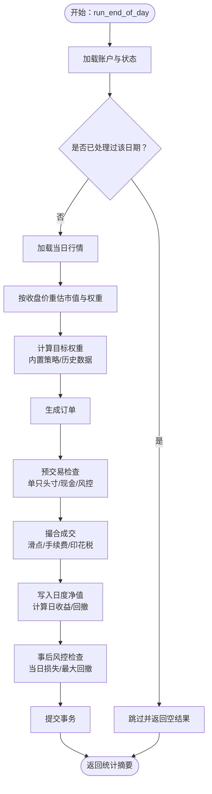

图表来源
- [backend/app/services/paper_trading.py:82-134](file://backend/app/services/paper_trading.py#L82-L134)
- [backend/app/services/paper_trading.py:314-372](file://backend/app/services/paper_trading.py#L314-L372)
- [backend/app/services/paper_trading.py:374-498](file://backend/app/services/paper_trading.py#L374-L498)
- [backend/app/services/paper_trading.py:500-577](file://backend/app/services/paper_trading.py#L500-L577)

章节来源
- [backend/app/services/paper_trading.py:1-634](file://backend/app/services/paper_trading.py#L1-L634)

### 异步任务与定时调度
- Celery 应用：配置 Broker/Backend、序列化、时区、任务跟踪与并发策略。
- Beat 调度：每日盘后（A 股 15:00 后）触发纸交易任务，指定队列与时间窗口。
- 任务入口：paper_trading 模块提供批量账户的日终处理任务。

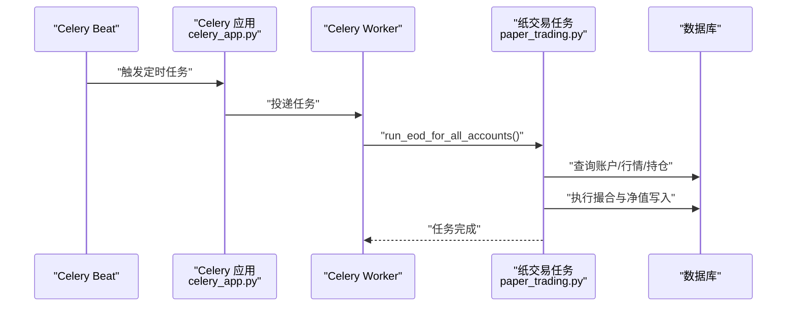

图表来源
- [backend/app/tasks/celery_app.py:35-41](file://backend/app/tasks/celery_app.py#L35-L41)
- [backend/app/tasks/celery_app.py:15-31](file://backend/app/tasks/celery_app.py#L15-L31)

章节来源
- [backend/app/tasks/celery_app.py:1-42](file://backend/app/tasks/celery_app.py#L1-L42)

### LLM 集成架构
- 工厂模式：根据配置选择 Mock、Anthropic 或 OpenAI 提供商；当未显式配置时，优先从用户主目录自动检测 Claude/Codex 凭证，再回退到 Mock。
- 错误处理：未知提供商抛出 LLM 异常，缺失必要配置（如模型/基础地址）时给出明确错误信息。
- 使用场景：策略生成流水线中用于代码生成与规范生成。

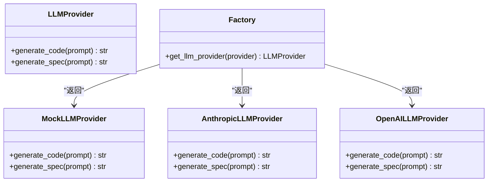

图表来源
- [backend/app/integrations/llm/factory.py:11-66](file://backend/app/integrations/llm/factory.py#L11-L66)

章节来源
- [backend/app/integrations/llm/factory.py:1-66](file://backend/app/integrations/llm/factory.py#L1-L66)

### 市场数据适配器
- 工厂模式：根据配置选择 AkShare、TuShare、Wind 或 Mock 提供商；若 AkShare 未安装则回退到 Mock。
- 日常轮询：通过行情流组件在交易时段按固定间隔轮询报价，支持实时事件广播。
- 适配扩展：新增商业提供商只需实现 MarketDataProvider 接口并在工厂中添加分支。

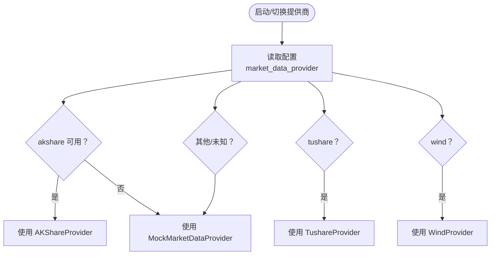

图表来源
- [backend/app/integrations/market_data/factory.py:23-56](file://backend/app/integrations/market_data/factory.py#L23-L56)

章节来源
- [backend/app/integrations/market_data/factory.py:1-57](file://backend/app/integrations/market_data/factory.py#L1-L57)

### WebSocket 实时通信
- 连接管理：基于主题的连接管理器，支持多主题订阅与广播。
- 端点：提供通用事件流与策略、执行、风控主题的专用端点。
- 使用场景：策略流水线事件、执行审批、风控告警等实时推送。

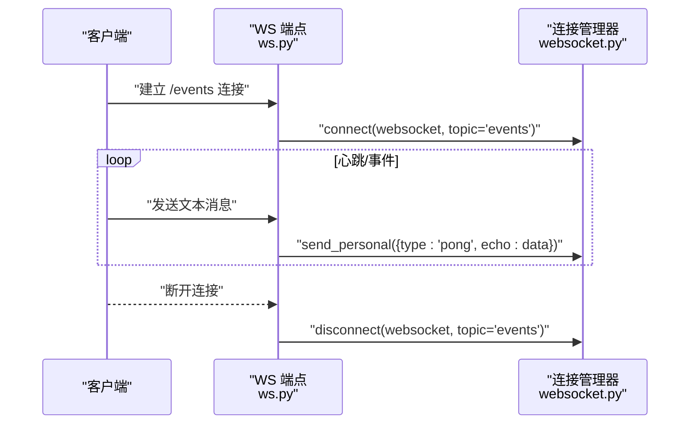

图表来源
- [backend/app/api/v1/ws.py:28-31](file://backend/app/api/v1/ws.py#L28-L31)
- [backend/app/core/websocket.py:16-25](file://backend/app/core/websocket.py#L16-L25)

章节来源
- [backend/app/api/v1/ws.py:1-50](file://backend/app/api/v1/ws.py#L1-L50)
- [backend/app/core/websocket.py:1-45](file://backend/app/core/websocket.py#L1-L45)

## 依赖分析
- 依赖清单：FastAPI、Uvicorn、WebSockets、Pydantic、SQLAlchemy[asyncio]、Alembic、HTTPX、structlog、orjson、JW3、Passlib、bcrypt、Prometheus、Celery、Redis 等。
- 可选依赖：dev（测试与质量工具）、llm（Anthropic、OpenAI）、market-data（AkShare、Pandas）。
- 工具链：Ruff（lint）、Mypy（静态类型检查）、pytest（测试覆盖率）、基于 pyright 的工作区设置。

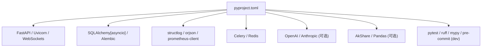

图表来源
- [backend/pyproject.toml:1-78](file://backend/pyproject.toml#L1-L78)

章节来源
- [backend/pyproject.toml:1-78](file://backend/pyproject.toml#L1-L78)

## 性能考虑
- 异步与并发
  - 使用 SQLAlchemy 异步会话与 FastAPI 异步路由，避免阻塞 IO。
  - 服务层方法按需批量查询与更新，减少往返次数。
- 任务与队列
  - Celery 任务开启延迟确认与最大任务数限制，降低内存压力。
  - 定时任务仅在交易日盘后执行，避免高峰时段负载。
- 缓存与索引
  - 对高频查询字段（如策略状态、任务状态、主题订阅）建立索引。
  - Redis 用于任务状态与短期缓存，注意键空间管理。
- 日志与监控
  - structlog 结构化日志，结合 Prometheus 指标导出便于观测。
- LLM 与市场数据
  - LLM 请求超时与最大令牌限制，避免长尾请求拖慢服务。
  - 市场数据轮询间隔可配置，平衡实时性与成本。

## 故障排查指南
- 健康检查
  - 访问健康端点确认应用启动状态与版本。
- 配置问题
  - LLM 提供商未配置或模型/基础地址缺失：检查环境变量或主目录自动检测结果。
  - 市场数据提供商不可用：确认依赖安装与令牌配置。
- 数据库与迁移
  - 使用 Alembic 升级到最新版本，核对迁移脚本与数据库连接。
- WebSocket
  - 连接断开：检查客户端心跳与服务端异常捕获日志。
- 任务失败
  - 查看 Celery 日志与 Redis 状态；确认任务序列化与时区设置。
- 策略生成
  - 代码生成失败：检查 LLM 返回与静态检查日志；必要时降级到 Mock 提供商验证流程。

章节来源
- [backend/app/main.py:61-64](file://backend/app/main.py#L61-L64)
- [backend/app/core/config.py:110-171](file://backend/app/core/config.py#L110-L171)
- [backend/app/integrations/llm/factory.py:31-65](file://backend/app/integrations/llm/factory.py#L31-L65)
- [backend/app/integrations/market_data/factory.py:32-53](file://backend/app/integrations/market_data/factory.py#L32-L53)
- [backend/app/tasks/celery_app.py:22-31](file://backend/app/tasks/celery_app.py#L22-L31)

## 结论
本指南从架构、模块与流程三个维度梳理了 llmine-quant 后端的关键实现，强调了异步 IO、工厂模式、流水线编排与实时通信的设计要点。遵循本文档的开发规范与最佳实践，可显著提升开发效率与系统稳定性。

## 附录
- 快速开始
  - 安装开发依赖、执行数据库迁移、填充开发数据、启动 API 服务器与 Celery Worker。
- 环境变量
  - DATABASE_URL、REDIS_URL、SECRET_KEY、ENV、LOG_LEVEL 等关键配置项说明。

章节来源
- [backend/README.md:1-45](file://backend/README.md#L1-L45)