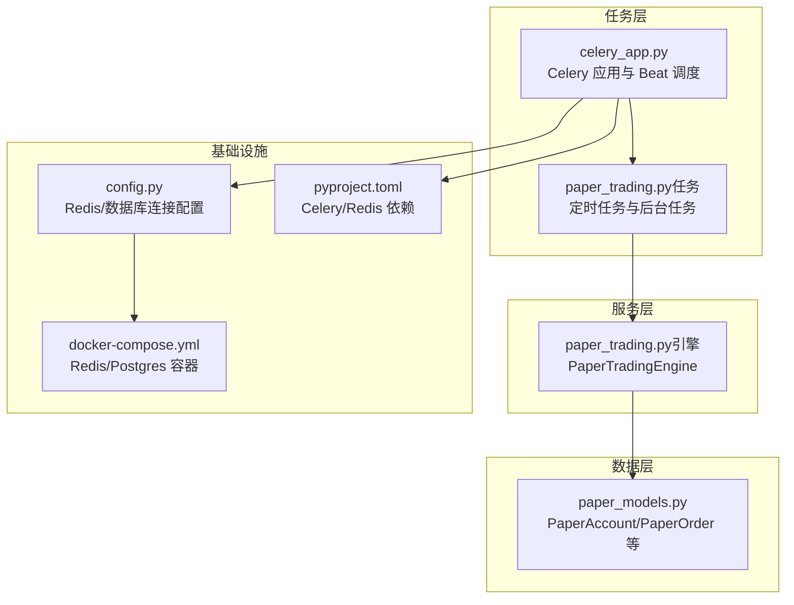
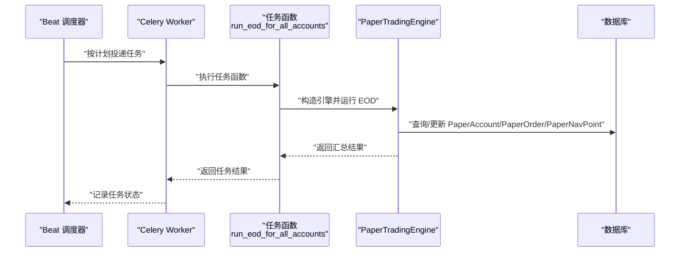
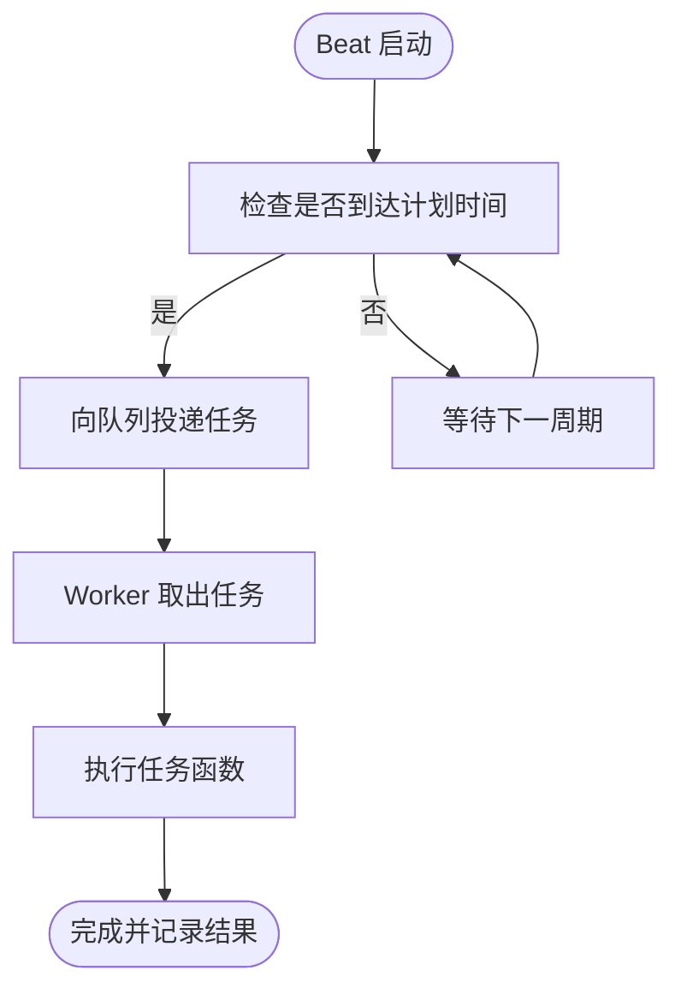
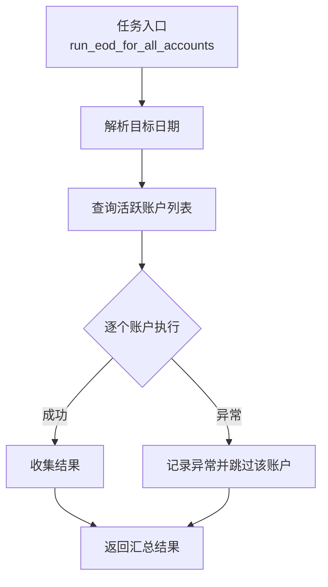
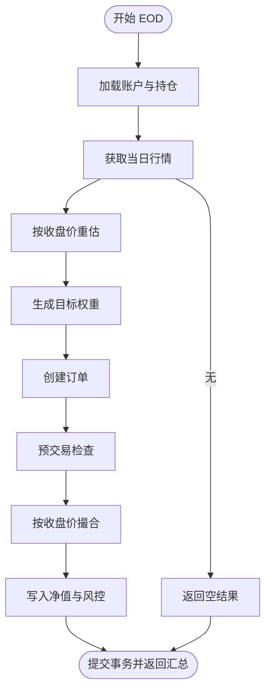
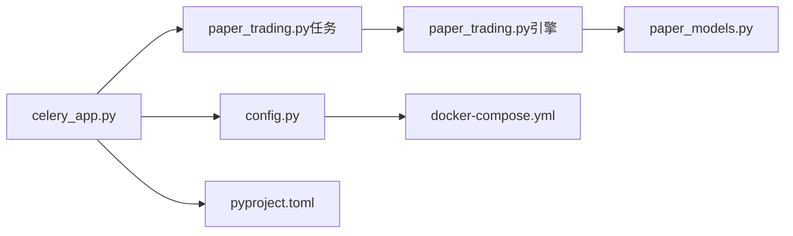

# 异步任务系统

<cite>
**本文引用的文件**
- [celery_app.py](file://backend/app/tasks/celery_app.py)
- [paper_trading.py（任务）](file://backend/app/tasks/paper_trading.py)
- [paper_trading.py（引擎）](file://backend/app/services/paper_trading.py)
- [paper_models.py](file://backend/app/domains/execution/paper_models.py)
- [config.py](file://backend/app/core/config.py)
- [docker-compose.yml](file://deploy/docker-compose.yml)
- [pyproject.toml](file://backend/pyproject.toml)
- [main.py](file://backend/app/main.py)
</cite>

## 目录
1. [简介](#简介)
2. [项目结构](#项目结构)
3. [核心组件](#核心组件)
4. [架构总览](#架构总览)
5. [详细组件分析](#详细组件分析)
6. [依赖分析](#依赖分析)
7. [性能考虑](#性能考虑)
8. [故障排除指南](#故障排除指南)
9. [结论](#结论)
10. [附录](#附录)

## 简介
本文件系统性梳理 llmine-quant 后端中的异步任务体系，聚焦 Celery 分布式任务框架在项目中的配置与使用，覆盖任务定义、队列管理、定时调度、任务监控与错误处理等主题。文档同时解释定时任务、后台任务与异步任务的实现模式，给出任务生命周期管理、重试与超时策略建议，并提供开发示例路径、性能调优技巧与故障排除方法，帮助开发者高效利用异步任务系统提升系统性能与可靠性。

## 项目结构
围绕异步任务系统的关键目录与文件如下：
- 任务应用与调度：backend/app/tasks/celery_app.py、backend/app/tasks/paper_trading.py
- 业务引擎：backend/app/services/paper_trading.py
- 数据模型：backend/app/domains/execution/paper_models.py
- 配置中心：backend/app/core/config.py
- 部署编排：deploy/docker-compose.yml
- 依赖声明：backend/pyproject.toml
- 应用入口：backend/app/main.py

图表来源
- [celery_app.py:15-41](file://backend/app/tasks/celery_app.py#L15-L41)
- [paper_trading.py（任务）:19-33](file://backend/app/tasks/paper_trading.py#L19-L33)
- [paper_trading.py（引擎）:76-134](file://backend/app/services/paper_trading.py#L76-L134)
- [paper_models.py:14-133](file://backend/app/domains/execution/paper_models.py#L14-L133)
- [config.py:61-62](file://backend/app/core/config.py#L61-L62)
- [docker-compose.yml:21-54](file://deploy/docker-compose.yml#L21-L54)
- [pyproject.toml:25-26](file://backend/pyproject.toml#L25-L26)

章节来源
- [celery_app.py:1-42](file://backend/app/tasks/celery_app.py#L1-L42)
- [paper_trading.py（任务）:1-73](file://backend/app/tasks/paper_trading.py#L1-L73)
- [paper_trading.py（引擎）:1-634](file://backend/app/services/paper_trading.py#L1-L634)
- [paper_models.py:1-133](file://backend/app/domains/execution/paper_models.py#L1-L133)
- [config.py:1-196](file://backend/app/core/config.py#L1-L196)
- [docker-compose.yml:1-59](file://deploy/docker-compose.yml#L1-L59)
- [pyproject.toml:1-78](file://backend/pyproject.toml#L1-L78)

## 核心组件
- Celery 应用与配置
  - 应用名称、Broker/Backend 地址、序列化格式、时区、UTC 开关、任务跟踪、延迟确认、每工作者最大任务数等均在 celery_app.py 中集中配置。
  - Beat 调度通过字典配置，包含每日 EOD 批处理任务的计划与队列选项。
- 任务定义
  - paper_trading 模块定义了两类任务：全账户 EOD 批处理与单账户 EOD 处理；两者均通过装饰器注册到 Celery 应用。
  - 任务内部通过 asyncio.run 将协程包装为同步函数，以便 Celery 执行。
- 业务引擎
  - PaperTradingEngine 提供统一的 EOD 生命周期：标记、信号、预交易检查、撮合、净值写入与事后风控检查。
  - 引擎对幂等性、空数据、无效价格等边界条件进行处理，保证任务稳健运行。
- 数据模型
  - PaperAccount、PaperOrder、PaperFill、PaperNavPoint、PaperPreTradeCheck、PaperRiskBreach 等模型支撑 EOD 全流程的数据流转。
- 配置与基础设施
  - config.py 提供 redis_url 等关键配置项；docker-compose.yml 提供 Redis/Postgres 的容器化环境；pyproject.toml 声明 Celery 与 Redis 依赖。

章节来源
- [celery_app.py:15-41](file://backend/app/tasks/celery_app.py#L15-L41)
- [paper_trading.py（任务）:19-33](file://backend/app/tasks/paper_trading.py#L19-L33)
- [paper_trading.py（引擎）:76-134](file://backend/app/services/paper_trading.py#L76-L134)
- [paper_models.py:14-133](file://backend/app/domains/execution/paper_models.py#L14-L133)
- [config.py:61-62](file://backend/app/core/config.py#L61-L62)
- [docker-compose.yml:21-54](file://deploy/docker-compose.yml#L21-L54)
- [pyproject.toml:25-26](file://backend/pyproject.toml#L25-L26)

## 架构总览
下图展示从 Beat 触发到任务执行、业务引擎处理与数据库交互的整体流程。

图表来源
- [celery_app.py:35-41](file://backend/app/tasks/celery_app.py#L35-L41)
- [paper_trading.py（任务）:19-33](file://backend/app/tasks/paper_trading.py#L19-L33)
- [paper_trading.py（引擎）:82-134](file://backend/app/services/paper_trading.py#L82-L134)

## 详细组件分析

### 组件一：Celery 应用与 Beat 调度
- 应用初始化
  - Broker/Backend 使用 redis_url 或默认本地 Redis；include 指定任务模块。
  - 序列化与时区设置确保跨语言/时区一致性。
  - task_track_started、task_acks_late、worker_max_tasks_per_child 等参数提升稳定性与资源控制。
- Beat 调度
  - 每周一至周五 15:30（CST）触发全账户 EOD 批处理。
  - 任务绑定到专用队列，便于隔离与扩展。

图表来源
- [celery_app.py:35-41](file://backend/app/tasks/celery_app.py#L35-L41)
- [celery_app.py:22-31](file://backend/app/tasks/celery_app.py#L22-L31)

章节来源
- [celery_app.py:15-41](file://backend/app/tasks/celery_app.py#L15-L41)

### 组件二：任务定义与执行模式
- 任务类型
  - 全账户批处理：遍历所有活跃账户，逐个执行 EOD 流程；异常单独记录但不影响其他账户。
  - 单账户处理：支持回填或按需执行。
- 执行模式
  - 任务函数通过 asyncio.run 运行协程，确保与 Celery 的同步接口兼容。
  - 协程内部使用异步会话访问数据库，避免阻塞。

图表来源
- [paper_trading.py（任务）:19-33](file://backend/app/tasks/paper_trading.py#L19-L33)
- [paper_trading.py（任务）:39-57](file://backend/app/tasks/paper_trading.py#L39-L57)

章节来源
- [paper_trading.py（任务）:19-33](file://backend/app/tasks/paper_trading.py#L19-L33)
- [paper_trading.py（任务）:39-73](file://backend/app/tasks/paper_trading.py#L39-L73)

### 组件三：PaperTradingEngine（EOD 生命周期）
- 生命周期阶段
  - 标记：按收盘价重估持仓市值与权重。
  - 信号：基于内置策略生成目标权重。
  - 预交易检查：单只头寸上限、现金底仓等规则拦截。
  - 撮合：按收盘价与成本模型成交，更新资金与持仓。
  - 净值与风控：写入日度净值点，计算当日收益与最大回撤，记录风险事件。
- 幂等性与边界处理
  - 若已处理过该日期则直接返回；若无行情数据也安全返回。
  - 对无效价格、无持仓卖出、现金不足等情况进行拒绝并记录原因。

图表来源
- [paper_trading.py（引擎）:82-134](file://backend/app/services/paper_trading.py#L82-L134)
- [paper_trading.py（引擎）:179-196](file://backend/app/services/paper_trading.py#L179-L196)
- [paper_trading.py（引擎）:268-312](file://backend/app/services/paper_trading.py#L268-L312)
- [paper_trading.py（引擎）:314-372](file://backend/app/services/paper_trading.py#L314-L372)
- [paper_trading.py（引擎）:374-498](file://backend/app/services/paper_trading.py#L374-L498)
- [paper_trading.py（引擎）:500-534](file://backend/app/services/paper_trading.py#L500-L534)
- [paper_trading.py（引擎）:536-577](file://backend/app/services/paper_trading.py#L536-L577)

章节来源
- [paper_trading.py（引擎）:76-134](file://backend/app/services/paper_trading.py#L76-L134)
- [paper_trading.py（引擎）:179-196](file://backend/app/services/paper_trading.py#L179-L196)
- [paper_trading.py（引擎）:268-312](file://backend/app/services/paper_trading.py#L268-L312)
- [paper_trading.py（引擎）:314-372](file://backend/app/services/paper_trading.py#L314-L372)
- [paper_trading.py（引擎）:374-498](file://backend/app/services/paper_trading.py#L374-L498)
- [paper_trading.py（引擎）:500-534](file://backend/app/services/paper_trading.py#L500-L534)
- [paper_trading.py（引擎）:536-577](file://backend/app/services/paper_trading.py#L536-L577)

### 组件四：数据模型与任务结果
- 关键模型
  - PaperAccount：账户基础信息、初始/当前现金、成本配置、状态与最后处理日期。
  - PaperOrder/PaperFill：订单与成交明细，含方向、目标/已成交数量、费用与总成本。
  - PaperNavPoint：日度净值快照，含 NAV、现金、市值、日收益与最大回撤。
  - PaperPreTradeCheck/PaperRiskBreach：预交易检查与风险事件记录。
- 任务结果
  - 任务返回每个账户的汇总指标（创建/成交/拒绝订单数、头寸违约次数、净值等），便于监控与审计。

章节来源
- [paper_models.py:14-133](file://backend/app/domains/execution/paper_models.py#L14-L133)
- [paper_trading.py（任务）:60-72](file://backend/app/tasks/paper_trading.py#L60-L72)

### 组件五：配置与基础设施
- 配置
  - redis_url 用于 Celery 的 Broker/Backend；数据库 URL 在配置中统一管理。
- 基础设施
  - docker-compose 提供 Redis 与 Postgres 容器，确保任务系统与数据存储可用。
- 依赖
  - pyproject.toml 明确 Celery 与 Redis 依赖版本，保障兼容性。

章节来源
- [config.py:61-62](file://backend/app/core/config.py#L61-L62)
- [docker-compose.yml:21-54](file://deploy/docker-compose.yml#L21-L54)
- [pyproject.toml:25-26](file://backend/pyproject.toml#L25-L26)

## 依赖分析
- 组件耦合
  - celery_app.py 作为任务应用入口，被任务模块与引擎共同依赖。
  - 任务模块依赖引擎进行业务处理，引擎依赖数据库模型与会话。
  - 配置模块为应用提供 Redis/数据库连接参数，部署编排文件提供外部服务。
- 外部依赖
  - Celery 与 Redis 为分布式任务与消息传输的核心；Postgres 为持久化存储。

图表来源
- [celery_app.py:15-41](file://backend/app/tasks/celery_app.py#L15-L41)
- [paper_trading.py（任务）:19-33](file://backend/app/tasks/paper_trading.py#L19-L33)
- [paper_trading.py（引擎）:76-134](file://backend/app/services/paper_trading.py#L76-L134)
- [paper_models.py:14-133](file://backend/app/domains/execution/paper_models.py#L14-L133)
- [config.py:61-62](file://backend/app/core/config.py#L61-L62)
- [docker-compose.yml:21-54](file://deploy/docker-compose.yml#L21-L54)
- [pyproject.toml:25-26](file://backend/pyproject.toml#L25-L26)

章节来源
- [celery_app.py:15-41](file://backend/app/tasks/celery_app.py#L15-L41)
- [paper_trading.py（任务）:19-33](file://backend/app/tasks/paper_trading.py#L19-L33)
- [paper_trading.py（引擎）:76-134](file://backend/app/services/paper_trading.py#L76-L134)
- [paper_models.py:14-133](file://backend/app/domains/execution/paper_models.py#L14-L133)
- [config.py:61-62](file://backend/app/core/config.py#L61-L62)
- [docker-compose.yml:21-54](file://deploy/docker-compose.yml#L21-L54)
- [pyproject.toml:25-26](file://backend/pyproject.toml#L25-L26)

## 性能考虑
- 任务并发与资源控制
  - 通过 worker_max_tasks_per_child 控制进程生命周期，降低内存泄漏风险；结合任务延迟确认（acks_late）提升容错能力。
- 队列隔离
  - 将 EOD 任务放入专用队列，避免与其他任务争抢资源；可按需横向扩展该队列 Worker。
- I/O 密集优化
  - 任务与引擎均采用异步数据库访问，减少阻塞；批量处理账户时注意异常隔离，避免连锁失败。
- 数据库与缓存
  - Redis 作为 Broker/Backend，建议开启持久化与合理内存上限；数据库连接池与索引优化有助于吞吐提升。
- 监控与可观测性
  - 结合任务跟踪与日志输出，建立任务耗时、失败率与队列积压的监控指标。

## 故障排除指南
- 常见问题定位
  - 任务未执行：检查 Beat 是否启动、计划时间是否正确、队列是否匹配。
  - 任务报错：查看任务日志与异常堆栈；关注单账户异常是否被记录但未中断整体流程。
  - 数据不一致：确认事务提交顺序与幂等性判断；检查最后处理日期字段是否正确更新。
- 排查步骤
  - 确认 Redis/Postgres 可用且网络连通。
  - 检查 Celery Worker 日志，定位具体异常来源。
  - 验证任务函数与引擎方法签名与参数传递是否一致。
  - 如需回填，优先使用单账户任务接口进行验证。
- 错误处理要点
  - 任务层：对单账户异常进行捕获与记录，保证批处理的健壮性。
  - 引擎层：对无效价格、无持仓卖出、现金不足等场景进行拒绝并记录原因，避免脏数据。

章节来源
- [celery_app.py:35-41](file://backend/app/tasks/celery_app.py#L35-L41)
- [paper_trading.py（任务）:52-56](file://backend/app/tasks/paper_trading.py#L52-L56)
- [paper_trading.py（引擎）:89-93](file://backend/app/services/paper_trading.py#L89-L93)
- [paper_trading.py（引擎）:393-396](file://backend/app/services/paper_trading.py#L393-L396)
- [paper_trading.py（引擎）:407-411](file://backend/app/services/paper_trading.py#L407-L411)
- [paper_trading.py（引擎）:458-462](file://backend/app/services/paper_trading.py#L458-L462)

## 结论
llmine-quant 的异步任务系统以 Celery 为核心，结合 Beat 定时调度与专用队列，实现了稳定可靠的每日 EOD 批处理。通过 PaperTradingEngine 的完整生命周期管理与严格的错误处理，系统在高并发与复杂金融业务场景下仍保持稳健。建议在生产环境中进一步完善监控告警、任务重试与超时策略，并根据业务增长动态扩展 Worker 与队列资源。

## 附录
- 开发示例路径
  - 任务定义与注册：[paper_trading.py（任务）:19-33](file://backend/app/tasks/paper_trading.py#L19-L33)
  - 定时调度配置：[celery_app.py:35-41](file://backend/app/tasks/celery_app.py#L35-L41)
  - 业务引擎主流程：[paper_trading.py（引擎）:82-134](file://backend/app/services/paper_trading.py#L82-L134)
  - 数据模型参考：[paper_models.py:14-133](file://backend/app/domains/execution/paper_models.py#L14-L133)
- 部署与依赖
  - Redis/Postgres 编排：[docker-compose.yml:21-54](file://deploy/docker-compose.yml#L21-L54)
  - Celery/Redis 依赖：[pyproject.toml:25-26](file://backend/pyproject.toml#L25-L26)
- 应用入口与生命周期
  - FastAPI 应用入口与生命周期：[main.py:20-36](file://backend/app/main.py#L20-L36)