# 协作与审计模型

<cite>
**本文档引用的文件**
- [backend/app/domains/collaboration/models.py](file://backend/app/domains/collaboration/models.py)
- [backend/app/domains/collaboration/schemas.py](file://backend/app/domains/collaboration/schemas.py)
- [backend/app/api/v1/collaboration.py](file://backend/app/api/v1/collaboration.py)
- [backend/app/domains/audit/models.py](file://backend/app/domains/audit/models.py)
- [backend/app/domains/audit/schemas.py](file://backend/app/domains/audit/schemas.py)
- [backend/app/api/v1/audit.py](file://backend/app/api/v1/audit.py)
- [backend/app/services/audit_service.py](file://backend/app/services/audit_service.py)
- [backend/app/domains/strategy/models.py](file://backend/app/domains/strategy/models.py)
- [backend/app/domains/identity/models.py](file://backend/app/domains/identity/models.py)
- [backend/app/db/migrations/versions/20260513_000002_security_collaboration_explain.py](file://backend/app/db/migrations/versions/20260513_000002_security_collaboration_explain.py)
- [backend/app/db/migrations/versions/20260513_000001_execution_risk_portfolio.py](file://backend/app/db/migrations/versions/20260513_000001_execution_risk_portfolio.py)
- [backend/app/api/v1/router.py](file://backend/app/api/v1/router.py)
- [frontend/src/screens/Collaboration/index.tsx](file://frontend/src/screens/Collaboration/index.tsx)
- [frontend/src/screens/Collaboration/ActiveReviews.tsx](file://frontend/src/screens/Collaboration/ActiveReviews.tsx)
- [frontend/src/screens/Collaboration/ApprovalFlow.tsx](file://frontend/src/screens/Collaboration/ApprovalFlow.tsx)
- [frontend/src/data/types.ts](file://frontend/src/data/types.ts)
</cite>

## 目录
1. [简介](#简介)
2. [项目结构](#项目结构)
3. [核心组件](#核心组件)
4. [架构概览](#架构概览)
5. [详细组件分析](#详细组件分析)
6. [依赖分析](#依赖分析)
7. [性能考虑](#性能考虑)
8. [故障排除指南](#故障排除指南)
9. [结论](#结论)
10. [附录](#附录)

## 简介
本文件系统性阐述后端协作与审计模型的设计与实现，涵盖以下方面：
- 协作评审模型：策略版本评审、评审决策与优先级管理
- 版本比较模型：字段级差异展示与影响评估
- 评论系统模型：评审线程与角色标注
- 审计日志模型：不可变审计链、幂等键与事件外发
- 安全控制模型：用户身份、组织角色与访问控制
- 数据血缘追踪：解释性模型中的步骤、归属项与血缘记录
- 审计要求：合规统计、导出与完整性校验

该模型以 FastAPI + SQLAlchemy 为基础，采用异步数据库会话与分层架构（API → 服务 → 模型），确保可扩展性与可观测性。

## 项目结构
后端采用按领域划分的目录结构，协作与审计相关的核心文件分布如下：
- 后端 API 层：提供协作与审计的对外接口
- 领域模型层：定义协作与审计的数据库实体
- 服务层：封装审计日志的哈希链验证与写入
- 前端集成：协作页面的数据结构与渲染组件

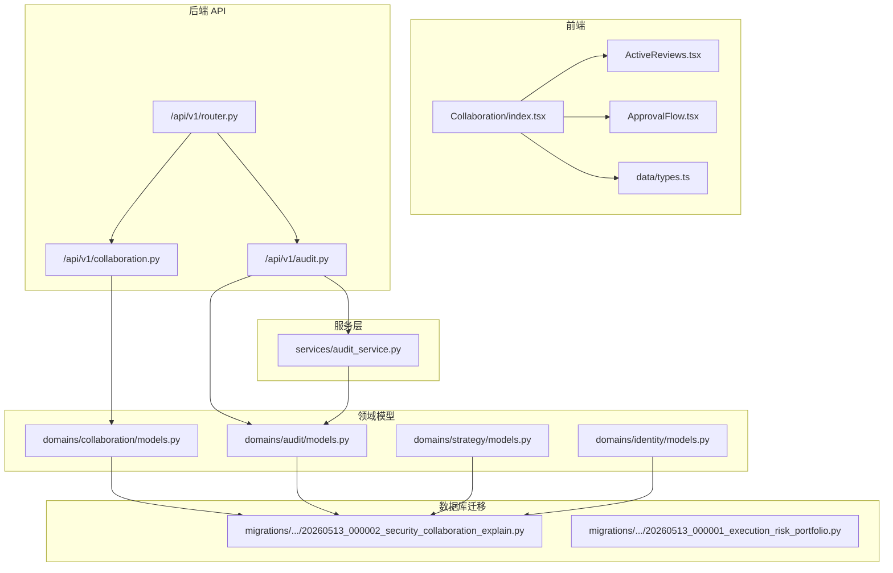

**图表来源**
- [backend/app/api/v1/router.py:25-39](file://backend/app/api/v1/router.py#L25-L39)
- [backend/app/api/v1/collaboration.py:1-112](file://backend/app/api/v1/collaboration.py#L1-L112)
- [backend/app/api/v1/audit.py:1-258](file://backend/app/api/v1/audit.py#L1-L258)
- [backend/app/services/audit_service.py:1-109](file://backend/app/services/audit_service.py#L1-L109)
- [backend/app/domains/collaboration/models.py:1-44](file://backend/app/domains/collaboration/models.py#L1-L44)
- [backend/app/domains/audit/models.py:1-51](file://backend/app/domains/audit/models.py#L1-L51)
- [backend/app/domains/strategy/models.py:1-84](file://backend/app/domains/strategy/models.py#L1-L84)
- [backend/app/domains/identity/models.py:1-60](file://backend/app/domains/identity/models.py#L1-L60)
- [backend/app/db/migrations/versions/20260513_000002_security_collaboration_explain.py:1-202](file://backend/app/db/migrations/versions/20260513_000002_security_collaboration_explain.py#L1-L202)
- [backend/app/db/migrations/versions/20260513_000001_execution_risk_portfolio.py:1-316](file://backend/app/db/migrations/versions/20260513_000001_execution_risk_portfolio.py#L1-L316)

**章节来源**
- [backend/app/api/v1/router.py:25-39](file://backend/app/api/v1/router.py#L25-L39)
- [backend/app/api/v1/collaboration.py:1-112](file://backend/app/api/v1/collaboration.py#L1-L112)
- [backend/app/api/v1/audit.py:1-258](file://backend/app/api/v1/audit.py#L1-L258)

## 核心组件
本节聚焦协作与审计模型的关键数据结构与处理流程。

- 协作评审模型
  - 策略评审请求：关联策略、起止版本、状态与优先级
  - 评审决策：按角色记录审批结果
  - A/B 测试实验：对照组与实验组、运行状态与指标

- 审计日志模型
  - 不可变审计链：基于 SHA-256 的 prev_hash/curr_hash 连接
  - 幂等键：防止重复请求
  - 事件外发：可靠事件发布队列

- 解释性模型（与审计关联）
  - 决策步骤、归属项与血缘记录，支撑数据血缘追踪

- 身份与权限模型
  - 组织、用户、角色与会话，支撑 RBAC 与审计主体识别

**章节来源**
- [backend/app/domains/collaboration/models.py:9-44](file://backend/app/domains/collaboration/models.py#L9-L44)
- [backend/app/domains/audit/models.py:9-51](file://backend/app/domains/audit/models.py#L9-L51)
- [backend/app/domains/strategy/models.py:9-84](file://backend/app/domains/strategy/models.py#L1-L84)
- [backend/app/domains/identity/models.py:9-60](file://backend/app/domains/identity/models.py#L1-L60)
- [backend/app/db/migrations/versions/20260513_000002_security_collaboration_explain.py:78-182](file://backend/app/db/migrations/versions/20260513_000002_security_collaboration_explain.py#L78-L182)

## 架构概览
协作与审计模块在后端采用清晰的分层：
- API 层：提供协作与审计的 REST 接口，负责参数校验与响应序列化
- 服务层：封装审计日志写入与哈希链校验
- 领域模型层：定义数据库表结构与索引
- 前端：消费 API 返回的结构化数据，渲染协作面板与审计看板

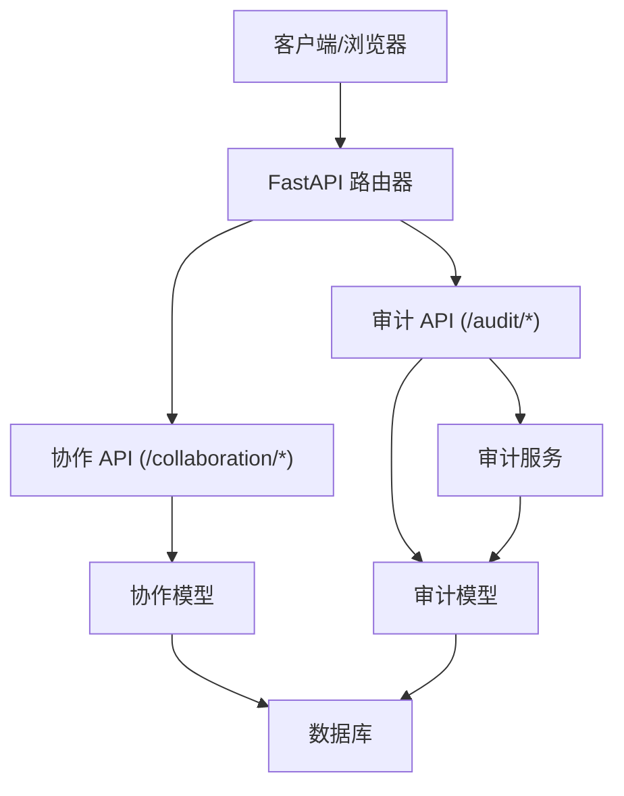

**图表来源**
- [backend/app/api/v1/router.py:25-39](file://backend/app/api/v1/router.py#L25-L39)
- [backend/app/api/v1/collaboration.py:1-112](file://backend/app/api/v1/collaboration.py#L1-L112)
- [backend/app/api/v1/audit.py:1-258](file://backend/app/api/v1/audit.py#L1-L258)
- [backend/app/services/audit_service.py:32-109](file://backend/app/services/audit_service.py#L32-L109)

## 详细组件分析

### 协作评审模型
协作评审围绕“策略版本评审”“评审决策”“A/B 测试”展开，前端通过统一的协作屏幕对象聚合展示。

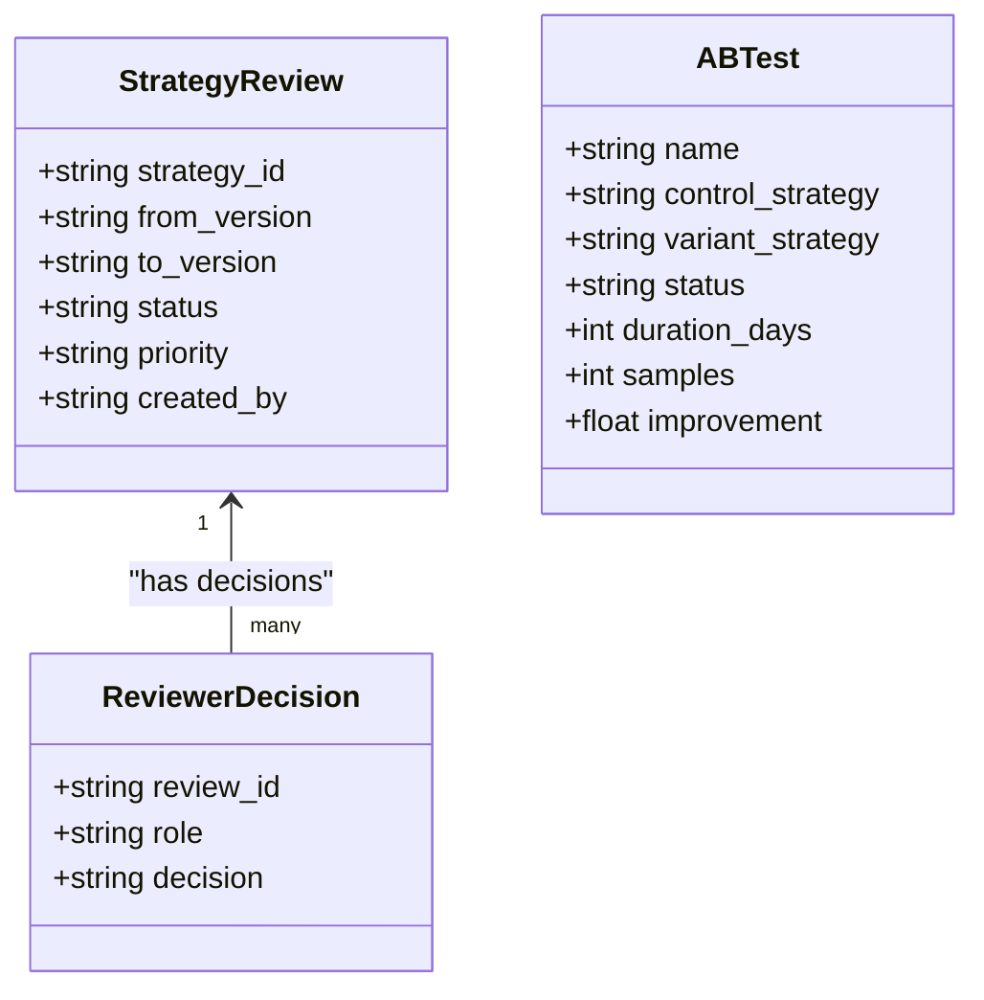

- 数据结构要点
  - 策略评审状态：待评审、评审中、已通过、已驳回
  - 评审决策：批准、要求修改、待定
  - A/B 测试状态：运行中、已完成、待启动
- 前端协作屏幕
  - KPI、活动评审、差异面板、评审线程、A/B 测试、审批流、页脚卡片

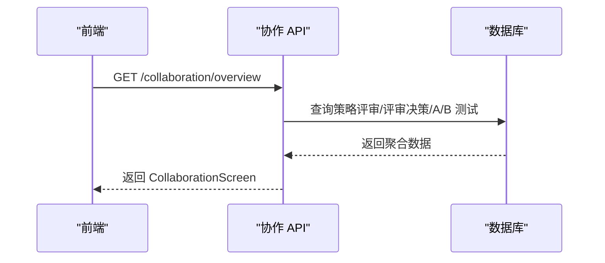

**图表来源**
- [backend/app/api/v1/collaboration.py:94-105](file://backend/app/api/v1/collaboration.py#L94-L105)
- [backend/app/domains/collaboration/models.py:9-44](file://backend/app/domains/collaboration/models.py#L9-L44)

**章节来源**
- [backend/app/domains/collaboration/models.py:9-44](file://backend/app/domains/collaboration/models.py#L9-L44)
- [backend/app/domains/collaboration/schemas.py:19-87](file://backend/app/domains/collaboration/schemas.py#L19-L87)
- [backend/app/api/v1/collaboration.py:22-105](file://backend/app/api/v1/collaboration.py#L22-L105)
- [frontend/src/screens/Collaboration/index.tsx:18-45](file://frontend/src/screens/Collaboration/index.tsx#L18-L45)
- [frontend/src/screens/Collaboration/ActiveReviews.tsx:16-18](file://frontend/src/screens/Collaboration/ActiveReviews.tsx#L16-L18)
- [frontend/src/screens/Collaboration/ApprovalFlow.tsx:1-40](file://frontend/src/screens/Collaboration/ApprovalFlow.tsx#L1-L40)
- [frontend/src/data/types.ts:560-594](file://frontend/src/data/types.ts#L560-L594)

### 版本比较模型
版本比较以字段级差异为核心，支持影响评估与可视化展示。

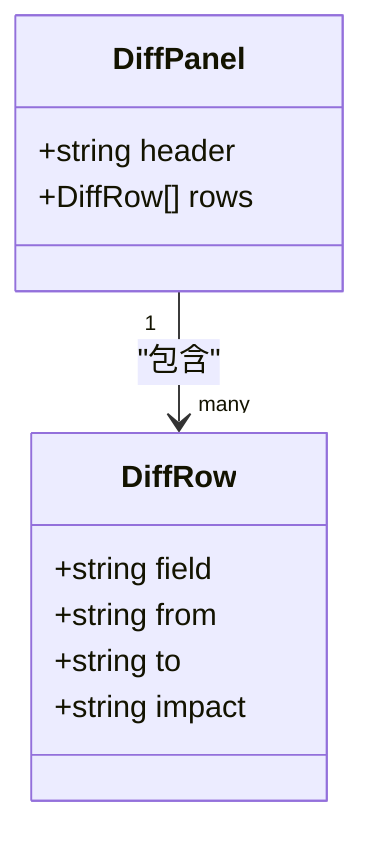

- 差异面板用于展示“从版本 → 到版本”的字段变更及影响
- 前端通过 DiffRow 渲染差异列表，支持字段、变更前后值与影响说明

**章节来源**
- [backend/app/domains/collaboration/schemas.py:32-42](file://backend/app/domains/collaboration/schemas.py#L32-L42)
- [backend/app/api/v1/collaboration.py:51-59](file://backend/app/api/v1/collaboration.py#L51-L59)

### 评论系统模型
评审线程以角色、文本与标签形式记录评审过程中的交互。

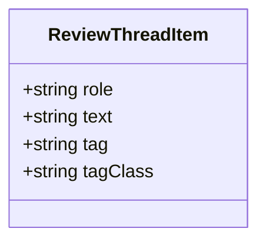

- 支持不同角色（如策略 Agent、风控 Agent、人类评审者）的标注与跟进
- 前端通过 ReviewThreadItem 渲染评审对话流

**章节来源**
- [backend/app/domains/collaboration/schemas.py:44-49](file://backend/app/domains/collaboration/schemas.py#L44-L49)
- [backend/app/api/v1/collaboration.py:61-66](file://backend/app/api/v1/collaboration.py#L61-L66)

### 审计日志模型
审计日志采用不可变链式结构，确保完整性与可追溯性；同时提供幂等键与事件外发能力。

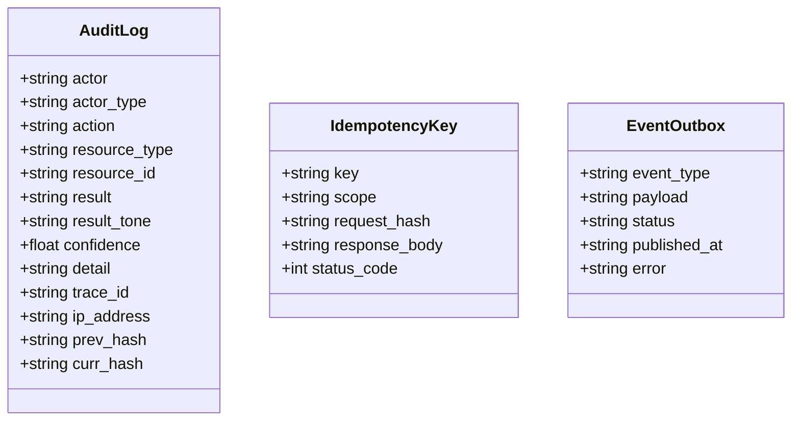

- 审计链：每条日志携带前一记录的 curr_hash，形成链式校验
- 幂等键：防止重复请求导致的日志重复
- 事件外发：支持可靠事件发布与重试

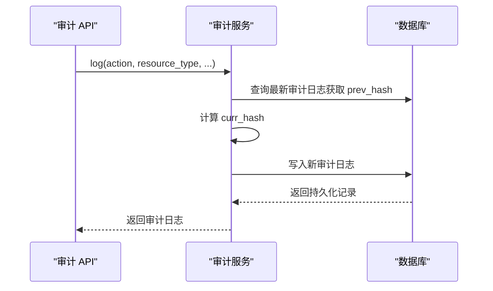

**图表来源**
- [backend/app/services/audit_service.py:38-81](file://backend/app/services/audit_service.py#L38-L81)
- [backend/app/domains/audit/models.py:9-51](file://backend/app/domains/audit/models.py#L9-L51)

**章节来源**
- [backend/app/domains/audit/models.py:9-51](file://backend/app/domains/audit/models.py#L9-L51)
- [backend/app/api/v1/audit.py:153-168](file://backend/app/api/v1/audit.py#L153-L168)
- [backend/app/api/v1/audit.py:198-212](file://backend/app/api/v1/audit.py#L198-L212)
- [backend/app/api/v1/audit.py:215-245](file://backend/app/api/v1/audit.py#L215-L245)
- [backend/app/services/audit_service.py:83-109](file://backend/app/services/audit_service.py#L83-L109)

### 数据血缘追踪模型
解释性模型包含决策步骤、归属项与血缘记录，支撑数据血缘追踪与合规审计。

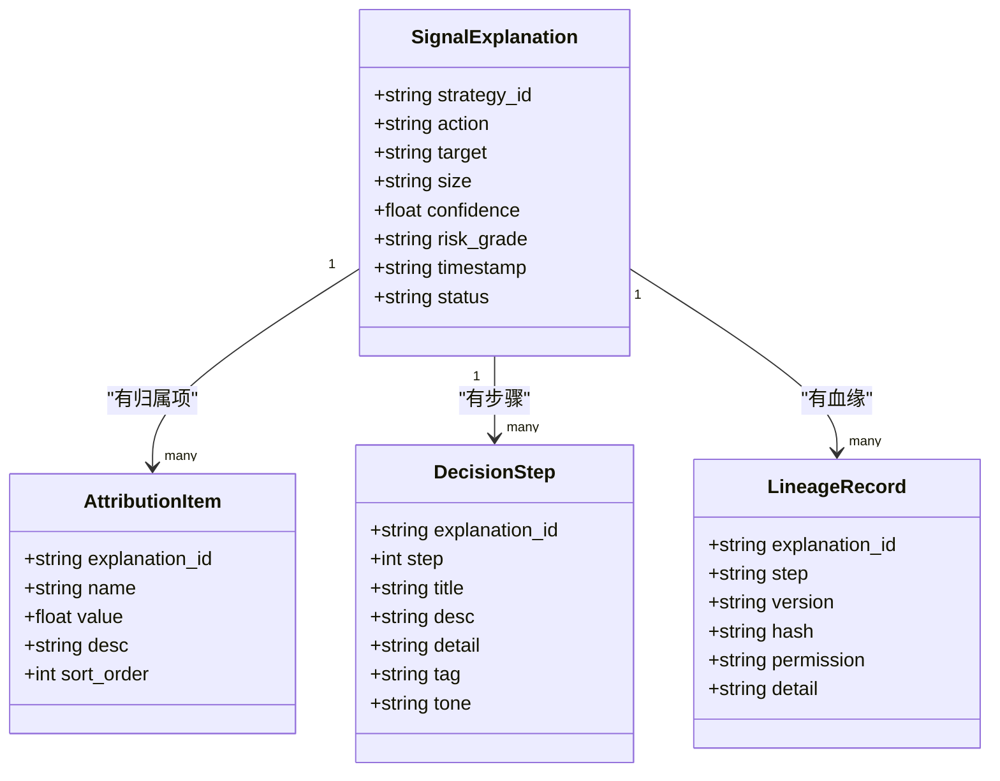

- 血缘记录包含步骤、版本、哈希与权限，便于审计与溯源
- 决策步骤与归属项支撑解释性报告与合规检查

**章节来源**
- [backend/app/db/migrations/versions/20260513_000002_security_collaboration_explain.py:112-182](file://backend/app/db/migrations/versions/20260513_000002_security_collaboration_explain.py#L112-L182)

### 安全控制模型
安全控制涉及身份、组织、角色与会话，支撑审计主体识别与访问控制。

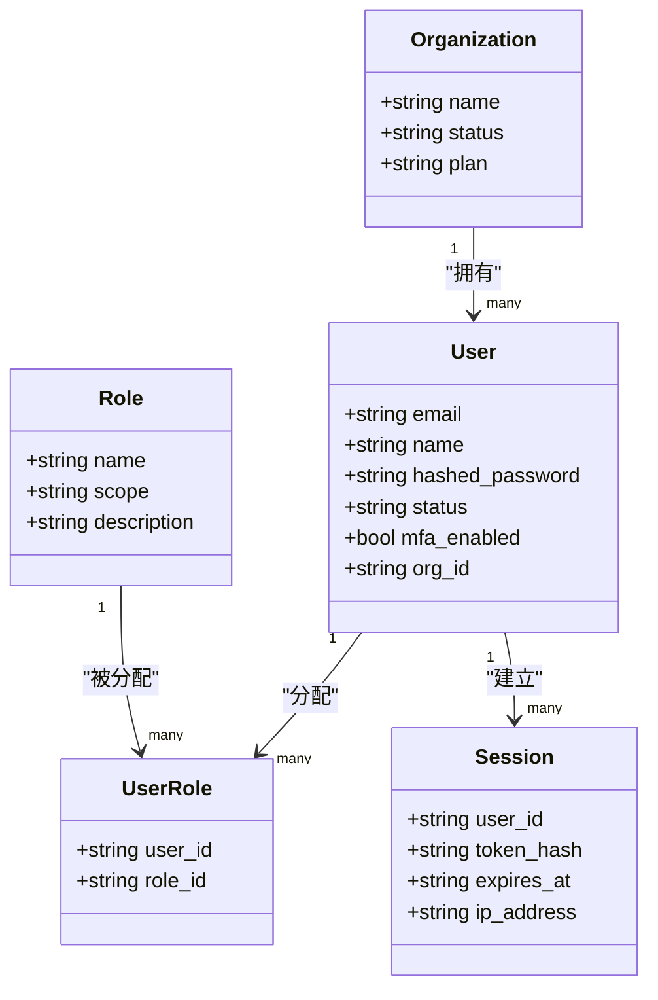

- 用户与组织：标识与租户边界
- 角色与用户角色：RBAC 权限映射
- 会话：登录态与 IP 追踪

**章节来源**
- [backend/app/domains/identity/models.py:9-60](file://backend/app/domains/identity/models.py#L9-L60)

## 依赖分析
- API 路由聚合：协作与审计路由挂载于统一路由器
- 协作 API 依赖协作模型与前端类型定义
- 审计 API 依赖审计模型与审计服务
- 审计服务依赖审计模型与时间/追踪工具

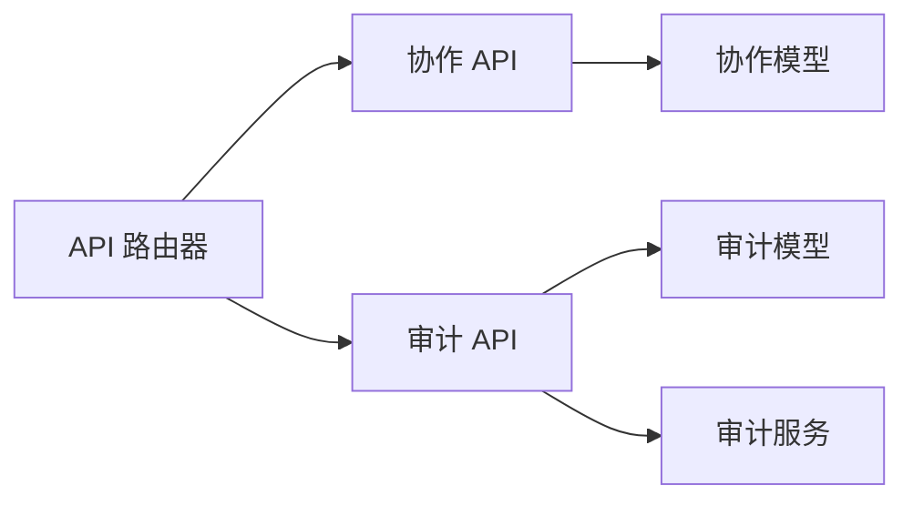

**图表来源**
- [backend/app/api/v1/router.py:25-39](file://backend/app/api/v1/router.py#L25-L39)
- [backend/app/api/v1/collaboration.py:1-112](file://backend/app/api/v1/collaboration.py#L1-L112)
- [backend/app/api/v1/audit.py:1-258](file://backend/app/api/v1/audit.py#L1-L258)
- [backend/app/services/audit_service.py:1-109](file://backend/app/services/audit_service.py#L1-L109)

**章节来源**
- [backend/app/api/v1/router.py:25-39](file://backend/app/api/v1/router.py#L25-L39)

## 性能考虑
- 审计链校验：verify_chain 限制验证条数，避免大规模扫描
- 分页查询：审计日志列表支持 limit/offset，前端按需加载
- 索引设计：关键字段（如资源类型、状态、时间戳）建立索引，提升查询性能
- 异步数据库：使用异步会话，提高并发处理能力

[本节为通用指导，不直接分析具体文件]

## 故障排除指南
- 审计链完整性
  - 使用“哈希链验证”接口检查最近 N 条日志的链式一致性
  - 若返回 broken，定位第一个破坏点并核查对应记录
- 日志导出
  - 使用 CSV 导出接口下载指定条数与类型的审计日志，便于离线分析
- 审计统计
  - 关注“哈希链完整”KPI，若低于阈值，可能存在历史未哈希记录或篡改风险

**章节来源**
- [backend/app/api/v1/audit.py:198-212](file://backend/app/api/v1/audit.py#L198-L212)
- [backend/app/api/v1/audit.py:215-245](file://backend/app/api/v1/audit.py#L215-L245)
- [backend/app/services/audit_service.py:83-109](file://backend/app/services/audit_service.py#L83-L109)

## 结论
本协作与审计模型通过清晰的领域建模与分层架构，实现了：
- 协作评审的流程化与可视化
- 版本差异的结构化展示与影响评估
- 审计日志的不可变链与可验证性
- 数据血缘的可追溯性与合规支持
- 身份与权限的 RBAC 基础设施

这些能力共同满足金融场景下的合规、审计与协作需求。

[本节为总结性内容，不直接分析具体文件]

## 附录

### 协作流程示例
- 创建评审任务：前端触发创建评审，后端返回评审 ID
- 评审进行：多角色依次审批，状态流转
- A/B 测试：对照组与实验组并行验证收益指标
- 上线审批：按阶段完成审批，最终批准上线

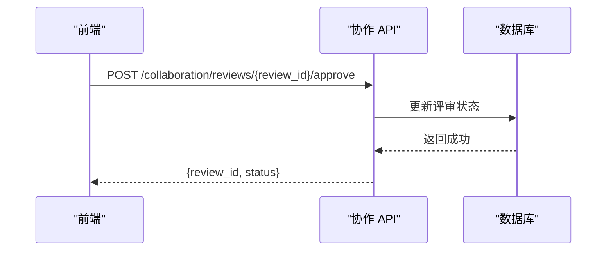

**图表来源**
- [backend/app/api/v1/collaboration.py:108-111](file://backend/app/api/v1/collaboration.py#L108-L111)

### 审计要求说明
- 操作日志：记录 actor、action、resource、result、trace_id、ip_address
- 合规检查：通过哈希链完整性与 KPI 统计评估
- 数据血缘：通过解释性模型的步骤、归属项与血缘记录实现

**章节来源**
- [backend/app/domains/audit/models.py:14-26](file://backend/app/domains/audit/models.py#L14-L26)
- [backend/app/api/v1/audit.py:73-106](file://backend/app/api/v1/audit.py#L73-L106)
- [backend/app/db/migrations/versions/20260513_000002_security_collaboration_explain.py:112-182](file://backend/app/db/migrations/versions/20260513_000002_security_collaboration_explain.py#L112-L182)