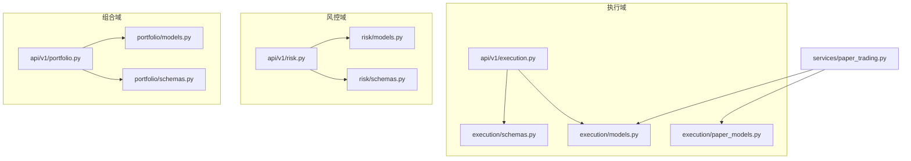
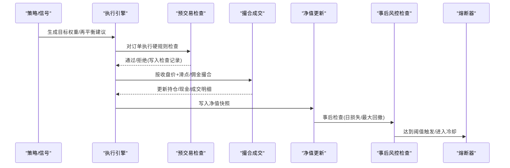
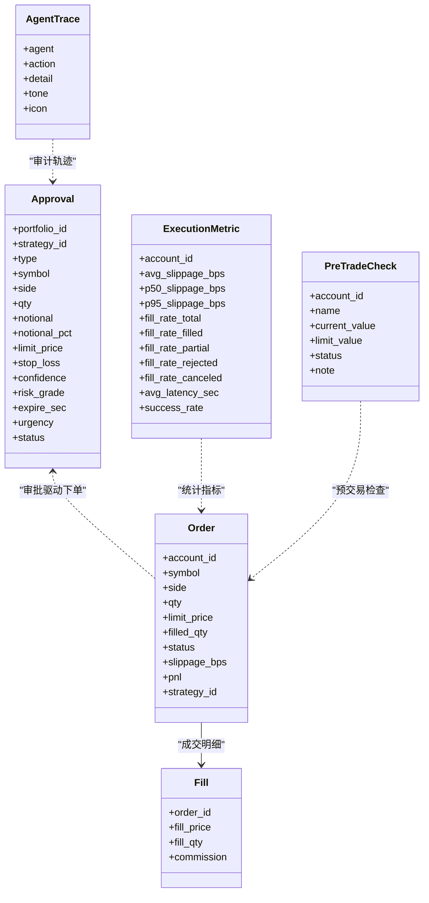
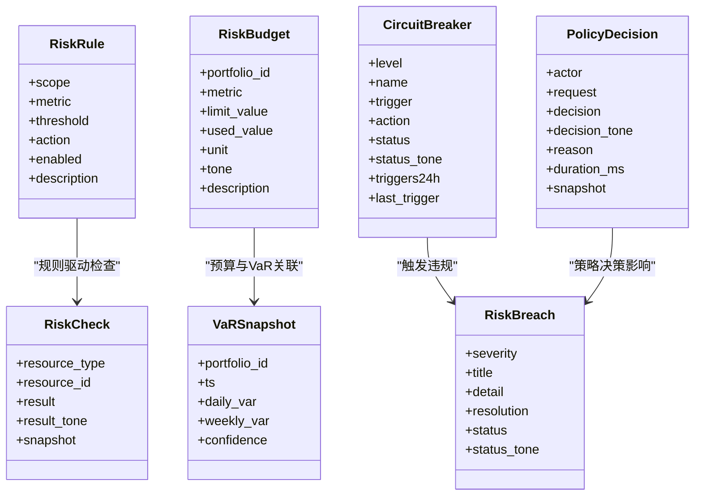
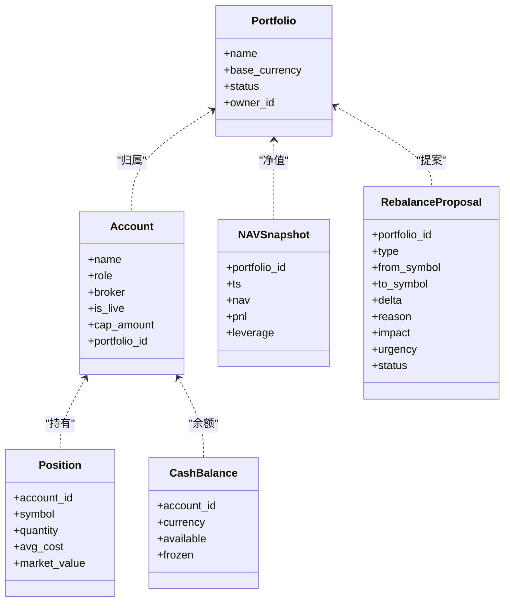
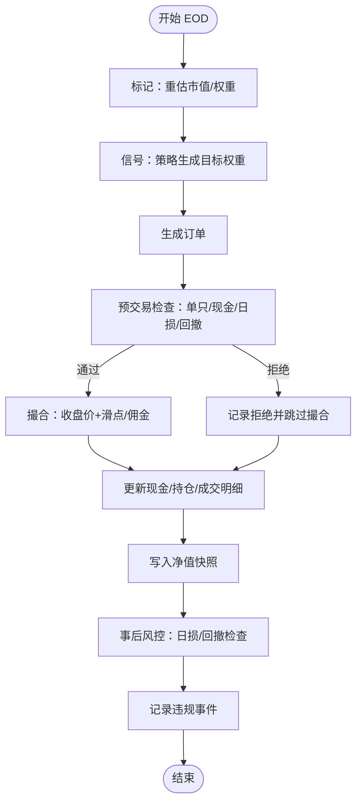
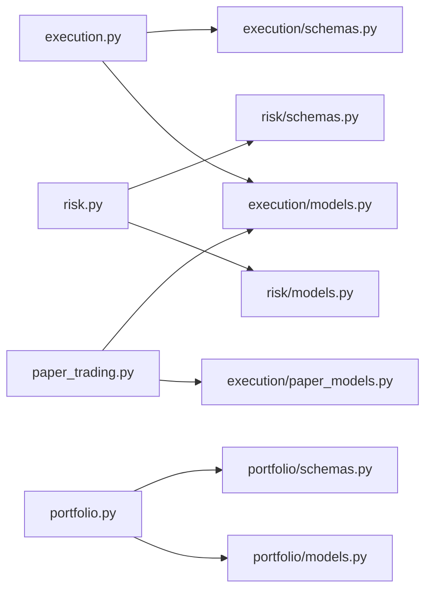

# 执行与风控模型

<cite>
**本文引用的文件**
- [backend/app/domains/execution/models.py](file://backend/app/domains/execution/models.py)
- [backend/app/domains/execution/schemas.py](file://backend/app/domains/execution/schemas.py)
- [backend/app/api/v1/execution.py](file://backend/app/api/v1/execution.py)
- [backend/app/domains/risk/models.py](file://backend/app/domains/risk/models.py)
- [backend/app/domains/risk/schemas.py](file://backend/app/domains/risk/schemas.py)
- [backend/app/api/v1/risk.py](file://backend/app/api/v1/risk.py)
- [backend/app/domains/portfolio/models.py](file://backend/app/domains/portfolio/models.py)
- [backend/app/domains/portfolio/schemas.py](file://backend/app/domains/portfolio/schemas.py)
- [backend/app/api/v1/portfolio.py](file://backend/app/api/v1/portfolio.py)
- [backend/app/services/paper_trading.py](file://backend/app/services/paper_trading.py)
- [backend/app/domains/execution/paper_models.py](file://backend/app/domains/execution/paper_models.py)
- [frontend/src/contexts/ExecutionContext.tsx](file://frontend/src/contexts/ExecutionContext.tsx)
- [frontend/src/contexts/RiskContext.tsx](file://frontend/src/contexts/RiskContext.tsx)
- [frontend/src/contexts/PortfolioContext.tsx](file://frontend/src/contexts/PortfolioContext.tsx)
</cite>

## 目录
1. [简介](#简介)
2. [项目结构](#项目结构)
3. [核心组件](#核心组件)
4. [架构总览](#架构总览)
5. [详细组件分析](#详细组件分析)
6. [依赖分析](#依赖分析)
7. [性能考虑](#性能考虑)
8. [故障排查指南](#故障排查指南)
9. [结论](#结论)
10. [附录](#附录)

## 简介
本文件系统化梳理执行与风控模型，覆盖以下主题：
- 订单模型：审批、订单、成交明细、执行指标、预交易检查、代理轨迹
- 交易执行流程：从策略信号到订单生成、预交易风控检查、撮合成交、净值更新与事后风控检查
- 风控规则模型：规则、检查结果、预算、VaR、熔断器、违规事件、策略决策
- 风险限额模型：限额阈值、动作策略（告警/阻断/强关）、预算占用与单位
- 投资组合模型：组合、账户、持仓、现金、净值快照、再平衡提案
- 前端集成：上下文与屏幕数据结构映射
- 实际使用示例与最佳实践

## 项目结构
后端采用按领域分层的组织方式，执行、风控、组合三个域分别定义了模型与序列化结构，并通过 FastAPI 路由暴露接口；纸模式引擎作为执行域的运行时支撑，贯穿“标记—信号—预检—撮合—净值”的端到端流程。

图表来源
- [backend/app/api/v1/execution.py:1-281](file://backend/app/api/v1/execution.py#L1-L281)
- [backend/app/domains/execution/models.py:1-103](file://backend/app/domains/execution/models.py#L1-L103)
- [backend/app/domains/execution/schemas.py:1-107](file://backend/app/domains/execution/schemas.py#L1-L107)
- [backend/app/domains/execution/paper_models.py:1-133](file://backend/app/domains/execution/paper_models.py#L1-L133)
- [backend/app/api/v1/risk.py:1-273](file://backend/app/api/v1/risk.py#L1-L273)
- [backend/app/domains/risk/models.py:1-101](file://backend/app/domains/risk/models.py#L1-L101)
- [backend/app/domains/risk/schemas.py:1-96](file://backend/app/domains/risk/schemas.py#L1-L96)
- [backend/app/api/v1/portfolio.py:1-186](file://backend/app/api/v1/portfolio.py#L1-L186)
- [backend/app/domains/portfolio/models.py:1-83](file://backend/app/domains/portfolio/models.py#L1-L83)
- [backend/app/domains/portfolio/schemas.py:1-94](file://backend/app/domains/portfolio/schemas.py#L1-L94)
- [backend/app/services/paper_trading.py:1-634](file://backend/app/services/paper_trading.py#L1-L634)

章节来源
- [backend/app/api/v1/execution.py:1-281](file://backend/app/api/v1/execution.py#L1-L281)
- [backend/app/api/v1/risk.py:1-273](file://backend/app/api/v1/risk.py#L1-L273)
- [backend/app/api/v1/portfolio.py:1-186](file://backend/app/api/v1/portfolio.py#L1-L186)

## 核心组件
- 执行域
  - 审批请求：用于人工/半自动化放行交易，含类型、方向、数量、报价、风险等级、时效等
  - 订单：委托簿条目，含已成交数量、状态、滑点、盈亏、策略标识
  - 成交明细：单笔成交记录，含成交价、成交量、手续费
  - 执行指标：滑点、成交率、拒绝原因、平均延迟、成功率
  - 预交易检查：对单只/行业集中度、单日亏损、净敞口、VaR等进行检查
  - 代理轨迹：执行过程中的审计轨迹
- 风控域
  - 风控规则：作用范围（账户/组合/策略/订单）、指标、阈值、动作（告警/阻断/强关）、启用状态
  - 检查结果：资源类型与ID、结果、色调、快照
  - 风控预算：组合级限额分配与使用，单位与色调
  - VaR 快照：日/周 VaR 及置信度
  - 熔断器：分级（L1-L4）、触发条件、动作、状态与24小时触发次数
  - 违规事件：严重性、标题、详情、处置、状态
  - 策略决策：策略引擎的决策日志
- 组合域
  - 组合：名称、币种、状态、所有者
  - 账户：角色（托管/实盘/仿真/沙盒）、是否实盘、额度、所属组合
  - 持仓：当前持有数量、成本均价、市值
  - 现金：按币种的可用/冻结
  - 净值快照：时间戳、净值、当日损益、杠杆
  - 再平衡提案：类型、标的、delta、原因、影响、紧急度、状态

章节来源
- [backend/app/domains/execution/models.py:9-103](file://backend/app/domains/execution/models.py#L9-L103)
- [backend/app/domains/risk/models.py:9-101](file://backend/app/domains/risk/models.py#L9-L101)
- [backend/app/domains/portfolio/models.py:9-83](file://backend/app/domains/portfolio/models.py#L9-L83)

## 架构总览
下图展示执行与风控的关键交互：策略/信号→预交易检查→订单生成→撮合成交→净值更新→事后风控检查→熔断器联动。

图表来源
- [backend/app/services/paper_trading.py:82-134](file://backend/app/services/paper_trading.py#L82-L134)
- [backend/app/services/paper_trading.py:314-372](file://backend/app/services/paper_trading.py#L314-L372)
- [backend/app/services/paper_trading.py:374-498](file://backend/app/services/paper_trading.py#L374-L498)
- [backend/app/services/paper_trading.py:500-534](file://backend/app/services/paper_trading.py#L500-L534)
- [backend/app/services/paper_trading.py:536-577](file://backend/app/services/paper_trading.py#L536-L577)
- [backend/app/api/v1/risk.py:210-272](file://backend/app/api/v1/risk.py#L210-L272)

## 详细组件分析

### 订单模型与执行流程
- 数据模型要点
  - 审批：类型（实盘/仿真/增减仓/轮动/对冲/暂停）、方向、数量、名义金额、限价、止损、置信度、风险等级、时效、紧急度、状态
  - 订单：账户、标的、方向、数量、限价、已成交、状态、滑点、盈亏、策略ID
  - 成交：订单ID、成交价、成交量、手续费
  - 执行指标：平均/中位/95分位滑点、成交率统计、拒绝原因分布
  - 预交易检查：指标名、当前值、阈值、状态、备注
  - 代理轨迹：代理名、动作、详情、色调、图标
- 流程要点
  - 审批状态机：pending → approved/rejected/expired
  - 订单状态机：working → filled/partial/rejected/canceled
  - 预交易检查：单只上限、行业集中度、单日亏损、净敞口、VaR限额
  - 撮合：按收盘价、滑点、佣金/印花税建模，区分买卖方向
  - 净值：计算日收益、历史峰值、回撤
  - 事后风控：日损失超阈值、最大回撤超阈值，记录违规事件

图表来源
- [backend/app/domains/execution/models.py:9-103](file://backend/app/domains/execution/models.py#L9-L103)

章节来源
- [backend/app/domains/execution/models.py:9-103](file://backend/app/domains/execution/models.py#L9-L103)
- [backend/app/domains/execution/schemas.py:6-107](file://backend/app/domains/execution/schemas.py#L6-L107)
- [backend/app/api/v1/execution.py:188-281](file://backend/app/api/v1/execution.py#L188-L281)

### 风控规则与熔断机制
- 风控规则模型
  - 作用域：账户/组合/策略/订单
  - 指标：最大回撤、日损失、头寸限额、VaR
  - 阈值与动作：告警/阻断/强关
  - 启用状态与描述
- 风控预算
  - 组合级限额分配与使用，单位（百分比/金额），色调提示
- VaR 快照
  - 日/周 VaR、置信度、历史序列
- 熔断器
  - 分级（L1-L4）、触发条件、动作、状态（已布防/已触发/冷却/禁用）、24小时触发次数、最近触发时间
- 违规事件
  - 严重性、标题、详情、处置、状态（已解决/进行中/待复核）
- 策略决策
  - 执行主体、请求、决策（允许/拒绝/需审批/修改）、原因、耗时、快照

图表来源
- [backend/app/domains/risk/models.py:9-101](file://backend/app/domains/risk/models.py#L9-L101)

章节来源
- [backend/app/domains/risk/models.py:9-101](file://backend/app/domains/risk/models.py#L9-L101)
- [backend/app/domains/risk/schemas.py:6-96](file://backend/app/domains/risk/schemas.py#L6-L96)
- [backend/app/api/v1/risk.py:188-273](file://backend/app/api/v1/risk.py#L188-L273)

### 投资组合管理
- 组合与账户
  - 组合：名称、币种、状态、所有者
  - 账户：角色、是否实盘、额度、所属组合
- 持仓与现金
  - 持仓：数量、成本均价、市值
  - 现金：可用/冻结
- 净值快照
  - 时间戳、净值、当日损益、杠杆
- 再平衡提案
  - 类型、来源/去向、delta、原因、影响、紧急度、状态

图表来源
- [backend/app/domains/portfolio/models.py:9-83](file://backend/app/domains/portfolio/models.py#L9-L83)

章节来源
- [backend/app/domains/portfolio/models.py:9-83](file://backend/app/domains/portfolio/models.py#L9-L83)
- [backend/app/domains/portfolio/schemas.py:6-94](file://backend/app/domains/portfolio/schemas.py#L6-L94)
- [backend/app/api/v1/portfolio.py:140-186](file://backend/app/api/v1/portfolio.py#L140-L186)

### 纸模式执行引擎（端到端流程）
- 关键阶段
  - 标记：按收盘价重估持仓市值，记录再平衡前权益
  - 信号：基于内置策略生成目标权重，生成待处理订单
  - 预交易检查：单只上限、现金底仓、单日亏损、最大回撤等硬规则
  - 撮合：按收盘价+滑点/佣金建模，更新现金与持仓
  - 净值：计算日收益、历史峰值、回撤
  - 事后风控：日损失/最大回撤阈值检查，记录违规事件
- 数据模型
  - 纸牌账户、位置、订单、成交、净值点、预交易检查、违规事件

图表来源
- [backend/app/services/paper_trading.py:82-134](file://backend/app/services/paper_trading.py#L82-L134)
- [backend/app/services/paper_trading.py:314-372](file://backend/app/services/paper_trading.py#L314-L372)
- [backend/app/services/paper_trading.py:374-498](file://backend/app/services/paper_trading.py#L374-L498)
- [backend/app/services/paper_trading.py:500-534](file://backend/app/services/paper_trading.py#L500-L534)
- [backend/app/services/paper_trading.py:536-577](file://backend/app/services/paper_trading.py#L536-L577)

章节来源
- [backend/app/services/paper_trading.py:1-634](file://backend/app/services/paper_trading.py#L1-L634)
- [backend/app/domains/execution/paper_models.py:14-133](file://backend/app/domains/execution/paper_models.py#L14-L133)

### 前端集成与数据结构
- 执行中心
  - 屏幕结构：概要、审批列表、预交易检查、委托簿、执行指标、代理轨迹
  - 审批：类型、方向、数量、限价、止损、置信度、风险等级、时效、紧急度、策略
  - 委托簿：时间、标的、方向、数量、限价、已成交、状态、滑点、盈亏
  - 指标：滑点分布、成交率、拒绝原因
- 风控看板
  - 头部健康评分、杀开关、24小时自动阻断数、待审批数、活跃违规数
  - KPI、预算、VaR、熔断器、策略决策流、违规事件
- 组合驾驶舱
  - 净值、风险预算、资产配置、相关矩阵、集中度、再平衡动作

章节来源
- [backend/app/domains/execution/schemas.py:6-107](file://backend/app/domains/execution/schemas.py#L6-L107)
- [backend/app/domains/risk/schemas.py:6-96](file://backend/app/domains/risk/schemas.py#L6-L96)
- [backend/app/domains/portfolio/schemas.py:6-94](file://backend/app/domains/portfolio/schemas.py#L6-L94)
- [frontend/src/contexts/ExecutionContext.tsx:1-13](file://frontend/src/contexts/ExecutionContext.tsx#L1-L13)
- [frontend/src/contexts/RiskContext.tsx:1-13](file://frontend/src/contexts/RiskContext.tsx#L1-L13)
- [frontend/src/contexts/PortfolioContext.tsx:1-13](file://frontend/src/contexts/PortfolioContext.tsx#L1-L13)

## 依赖分析
- 执行域
  - API 路由依赖模型与序列化结构，负责汇总审批、订单、代理轨迹、静态预交易检查与执行指标
  - 与审计服务集成，记录审批与熔断器操作
- 风控域
  - API 路由依赖规则、预算、VaR、熔断器、违规事件、策略决策模型
  - 提供熔断器手动触发/恢复接口，广播到风险事件主题
- 组合域
  - API 路由依赖净值与再平衡提案模型，提供组合概览与审批接口
- 纸模式引擎
  - 依赖市场行情、策略运行器、成本配置，串联预交易检查、撮合、净值与事后风控

图表来源
- [backend/app/api/v1/execution.py:1-281](file://backend/app/api/v1/execution.py#L1-L281)
- [backend/app/domains/execution/models.py:1-103](file://backend/app/domains/execution/models.py#L1-L103)
- [backend/app/domains/execution/schemas.py:1-107](file://backend/app/domains/execution/schemas.py#L1-L107)
- [backend/app/api/v1/risk.py:1-273](file://backend/app/api/v1/risk.py#L1-L273)
- [backend/app/domains/risk/models.py:1-101](file://backend/app/domains/risk/models.py#L1-L101)
- [backend/app/domains/risk/schemas.py:1-96](file://backend/app/domains/risk/schemas.py#L1-L96)
- [backend/app/api/v1/portfolio.py:1-186](file://backend/app/api/v1/portfolio.py#L1-L186)
- [backend/app/domains/portfolio/models.py:1-83](file://backend/app/domains/portfolio/models.py#L1-L83)
- [backend/app/domains/portfolio/schemas.py:1-94](file://backend/app/domains/portfolio/schemas.py#L1-L94)
- [backend/app/services/paper_trading.py:1-634](file://backend/app/services/paper_trading.py#L1-L634)
- [backend/app/domains/execution/paper_models.py:1-133](file://backend/app/domains/execution/paper_models.py#L1-L133)

章节来源
- [backend/app/api/v1/execution.py:1-281](file://backend/app/api/v1/execution.py#L1-L281)
- [backend/app/api/v1/risk.py:1-273](file://backend/app/api/v1/risk.py#L1-L273)
- [backend/app/api/v1/portfolio.py:1-186](file://backend/app/api/v1/portfolio.py#L1-L186)
- [backend/app/services/paper_trading.py:1-634](file://backend/app/services/paper_trading.py#L1-L634)

## 性能考虑
- 查询优化
  - 在高频读取场景（概览页）优先使用聚合查询与限制返回条数，避免全表扫描
  - 对常用过滤字段（状态、时间、组合/账户索引）建立数据库索引
- 序列化与缓存
  - 将静态或低频变更的预交易检查与指标以常量或短期缓存形式提供，减少数据库压力
- 批处理与异步
  - 使用异步会话与批量写入，降低事务开销
- 成本建模
  - 滑点、佣金、印花税参数化，便于在不同市场/品种间快速切换

## 故障排查指南
- 审批相关
  - 已非“pending”状态无法再次审批，检查状态流转与幂等性
  - 审批通过/拒绝后应记录审计日志并广播事件
- 订单相关
  - 订单状态异常（如未成交但已过期）需检查到期逻辑与清理任务
  - 成交明细缺失或不一致，核查撮合流程与事务提交
- 预交易检查
  - 单只/行业集中度检查失败导致拒绝，核对当前权重与阈值
  - 现金不足导致拒绝，检查成本建模与可用资金计算
- 熔断器
  - 手动触发/恢复需校验当前状态，防止重复操作
  - 状态变更后广播至风险事件主题，确保前端及时更新
- 纸模式引擎
  - 若某日未处理，检查账户最后处理日期与行情数据是否存在
  - 事后风控未触发，核对阈值与计算逻辑

章节来源
- [backend/app/api/v1/execution.py:223-281](file://backend/app/api/v1/execution.py#L223-L281)
- [backend/app/api/v1/risk.py:210-272](file://backend/app/api/v1/risk.py#L210-L272)
- [backend/app/services/paper_trading.py:314-372](file://backend/app/services/paper_trading.py#L314-L372)
- [backend/app/services/paper_trading.py:536-577](file://backend/app/services/paper_trading.py#L536-L577)

## 结论
该系统以清晰的领域划分实现了从策略信号到执行、风控与组合管理的闭环：执行域提供审批、订单、成交与执行指标；风控域提供规则、预算、VaR、熔断器与违规事件；组合域提供账户、持仓、现金与净值；纸模式引擎贯穿端到端流程，验证风控与成本建模的有效性。通过 API 路由与前端上下文，形成统一的监控与交互界面。

## 附录
- 实际使用示例
  - 执行概览：获取审批、订单、代理轨迹、执行指标与预交易检查
  - 风控概览：获取健康评分、预算、VaR、熔断器、策略决策与违规事件
  - 组合概览：获取净值、风险预算、资产配置、集中度与再平衡提案
  - 审批操作：批准/拒绝交易，记录审计并广播事件
  - 熔断器操作：手动触发/恢复熔断器，记录审计并广播事件
- 最佳实践
  - 明确审批类型与紧急度，合理设置时效与阈值
  - 将硬规则（单只/行业/日损/回撤）纳入预交易检查，减少事后风险
  - 参数化成本模型，适配不同市场与品种
  - 保持审计日志与事件广播，确保可观测性与可追溯性