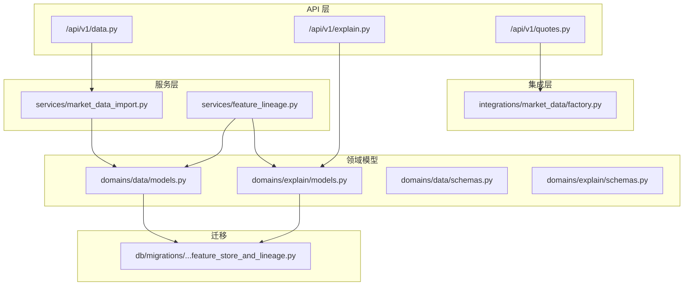
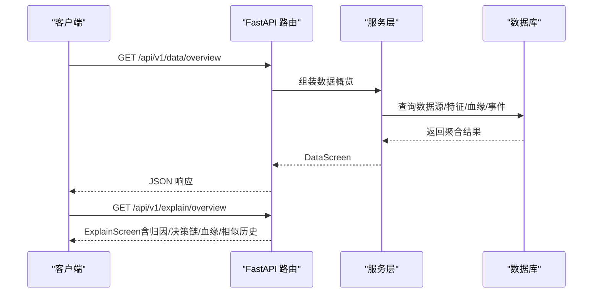
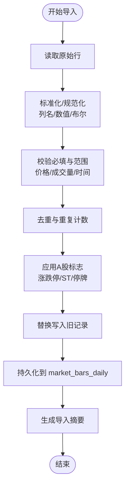
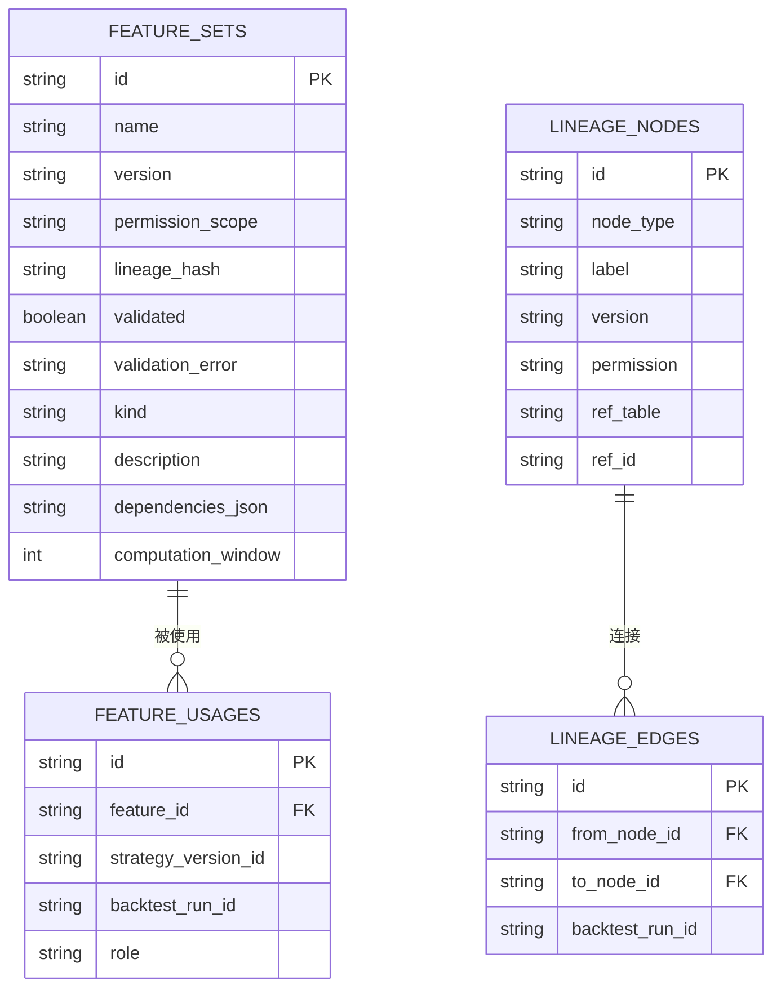
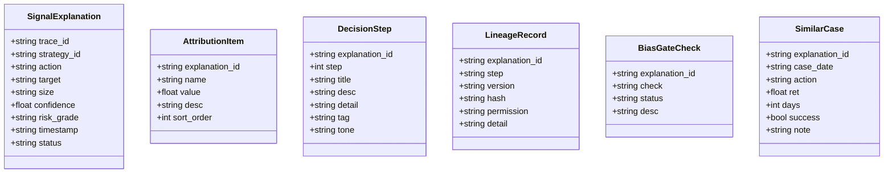
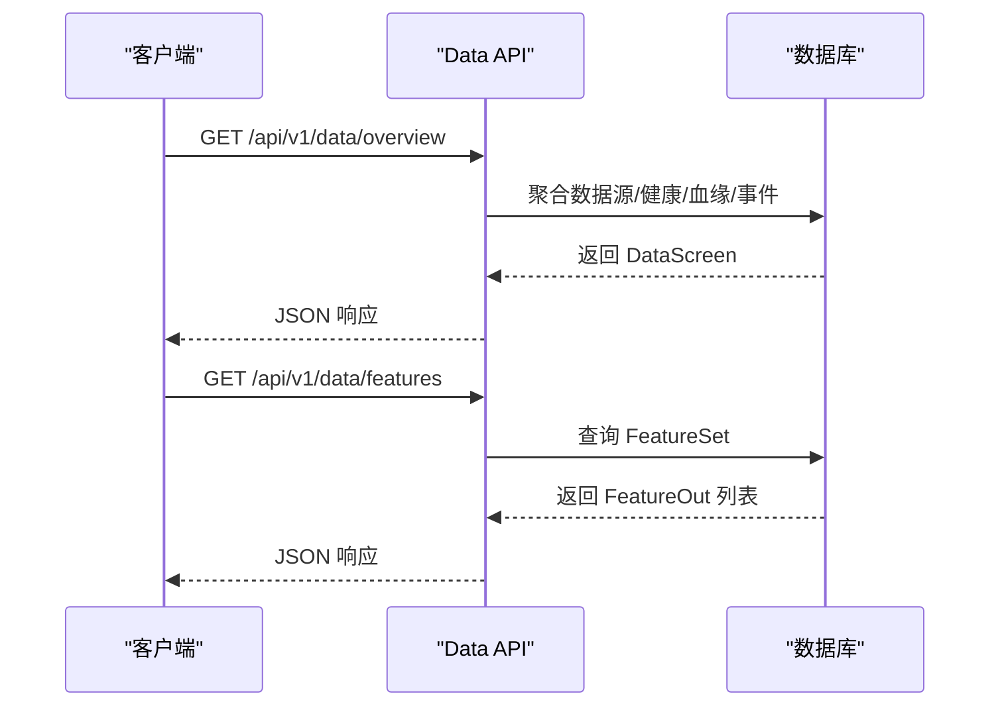
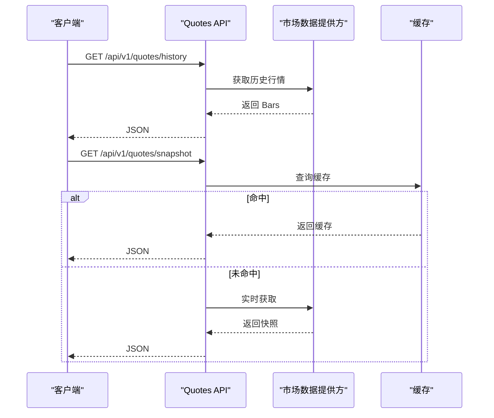
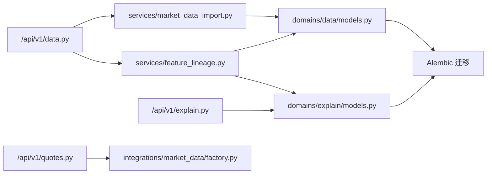

# 数据与解释模型

<cite>
**本文引用的文件**
- [backend/app/domains/data/models.py](file://backend/app/domains/data/models.py)
- [backend/app/domains/data/schemas.py](file://backend/app/domains/data/schemas.py)
- [backend/app/domains/explain/models.py](file://backend/app/domains/explain/models.py)
- [backend/app/domains/explain/schemas.py](file://backend/app/domains/explain/schemas.py)
- [backend/app/services/market_data_import.py](file://backend/app/services/market_data_import.py)
- [backend/app/services/feature_lineage.py](file://backend/app/services/feature_lineage.py)
- [backend/app/api/v1/data.py](file://backend/app/api/v1/data.py)
- [backend/app/api/v1/explain.py](file://backend/app/api/v1/explain.py)
- [backend/app/api/v1/quotes.py](file://backend/app/api/v1/quotes.py)
- [backend/app/integrations/market_data/factory.py](file://backend/app/integrations/market_data/factory.py)
- [backend/app/db/migrations/versions/61868637158e_feature_store_and_lineage.py](file://backend/app/db/migrations/versions/61868637158e_feature_store_and_lineage.py)
- [backend/README.md](file://backend/README.md)
- [doc/07-后端项目设计说明书.md](file://doc/07-后端项目设计说明书.md)
- [doc/03-核心模块设计.md](file://doc/03-核心模块设计.md)
</cite>

## 目录
1. [简介](#简介)
2. [项目结构](#项目结构)
3. [核心组件](#核心组件)
4. [架构总览](#架构总览)
5. [详细组件分析](#详细组件分析)
6. [依赖分析](#依赖分析)
7. [性能考量](#性能考量)
8. [故障排查指南](#故障排查指南)
9. [结论](#结论)
10. [附录](#附录)

## 简介
本文件聚焦于量化交易系统中的“数据与解释模型”，系统性梳理市场数据模型、特征存储模型、数据血缘模型与解释性分析模型的设计与实现。内容涵盖：
- 数据导入与存储：市场数据格式、特征工程输出、数据质量监控
- 解释性分析：特征重要性、信号归因、决策链追踪
- 数据血缘追踪：特征来源、处理步骤与影响分析
- 数据质量管理与解释性报告生成流程

## 项目结构
后端采用模块化单体架构，围绕“领域”划分目录，数据与解释相关的核心位于 domains、services、api 与 integrations 下，并通过 Alembic 迁移管理数据库结构演进。

**图表来源**
- [backend/app/api/v1/data.py:1-392](file://backend/app/api/v1/data.py#L1-L392)
- [backend/app/api/v1/explain.py:1-110](file://backend/app/api/v1/explain.py#L1-L110)
- [backend/app/api/v1/quotes.py:1-129](file://backend/app/api/v1/quotes.py#L1-L129)
- [backend/app/services/market_data_import.py:1-426](file://backend/app/services/market_data_import.py#L1-L426)
- [backend/app/services/feature_lineage.py:1-217](file://backend/app/services/feature_lineage.py#L1-L217)
- [backend/app/domains/data/models.py:1-144](file://backend/app/domains/data/models.py#L1-L144)
- [backend/app/domains/explain/models.py:1-87](file://backend/app/domains/explain/models.py#L1-L87)
- [backend/app/integrations/market_data/factory.py:1-57](file://backend/app/integrations/market_data/factory.py#L1-L57)
- [backend/app/db/migrations/versions/61868637158e_feature_store_and_lineage.py:1-112](file://backend/app/db/migrations/versions/61868637158e_feature_store_and_lineage.py#L1-L112)

**章节来源**
- [backend/README.md:1-45](file://backend/README.md#L1-L45)
- [doc/07-后端项目设计说明书.md:388-539](file://doc/07-后端项目设计说明书.md#L388-L539)

## 核心组件
- 数据域模型与模式：定义数据源、健康度、日线行情、公司行动、特征集、特征使用、血缘节点/边、数据事件等核心实体与字段。
- 解释域模型与模式：定义信号解释、归因项、决策链、血缘记录、偏见门检查、相似案例等解释性分析所需的数据结构。
- 特征存储与血缘服务：提供特征注册、使用关联与回测运行的血缘链路构建。
- 市场数据导入服务：支持本地 CSV 与 AKShare 两种导入路径，含规范化、清洗、去重、校验与替换写入逻辑。
- API 屏幕：数据概览与特征查询、血缘查询、偏见门检查；解释概览与信号解释。

**章节来源**
- [backend/app/domains/data/models.py:1-144](file://backend/app/domains/data/models.py#L1-L144)
- [backend/app/domains/explain/models.py:1-87](file://backend/app/domains/explain/models.py#L1-L87)
- [backend/app/domains/data/schemas.py:1-194](file://backend/app/domains/data/schemas.py#L1-L194)
- [backend/app/domains/explain/schemas.py:1-93](file://backend/app/domains/explain/schemas.py#L1-L93)
- [backend/app/services/feature_lineage.py:1-217](file://backend/app/services/feature_lineage.py#L1-L217)
- [backend/app/services/market_data_import.py:1-426](file://backend/app/services/market_data_import.py#L1-L426)
- [backend/app/api/v1/data.py:1-392](file://backend/app/api/v1/data.py#L1-L392)
- [backend/app/api/v1/explain.py:1-110](file://backend/app/api/v1/explain.py#L1-L110)

## 架构总览
系统通过 API 屏幕聚合数据与解释视图，服务层负责数据导入与特征/血缘持久化，领域模型承载业务语义，集成层抽象市场数据提供方，迁移脚本确保数据库结构演进。

**图表来源**
- [backend/app/api/v1/data.py:134-146](file://backend/app/api/v1/data.py#L134-L146)
- [backend/app/api/v1/explain.py:98-109](file://backend/app/api/v1/explain.py#L98-L109)

**章节来源**
- [doc/07-后端项目设计说明书.md:388-539](file://doc/07-后端项目设计说明书.md#L388-L539)

## 详细组件分析

### 市场数据模型与导入流程
- 市场数据模型
  - 日线行情：唯一索引（股票代码+交易日），包含开盘/最高/最低/收盘、成交量、复权因子、涨跌停/停牌标记等。
  - 数据源与健康度：记录提供商、层级、许可证范围、状态、延迟、缺失率、漂移分等。
  - 公司行动：分红送股等复权调整因子与类型。
- 导入流程
  - CSV 导入：读取 UTF-8 CSV，标准化列名，规范化数值与布尔值，校验必填字段与价格范围，去重，应用 A 股特殊规则（涨跌停、ST、停牌等），替换写入。
  - AKShare 导入：异步抓取 A 股日线行情，自动补全符号字段，批量写入。
  - 结果汇总：统计导入条数、插入/更新/跳过数量、错误明细、时间范围与覆盖标的。

**图表来源**
- [backend/app/services/market_data_import.py:213-241](file://backend/app/services/market_data_import.py#L213-L241)
- [backend/app/services/market_data_import.py:243-268](file://backend/app/services/market_data_import.py#L243-L268)
- [backend/app/services/market_data_import.py:292-422](file://backend/app/services/market_data_import.py#L292-L422)

**章节来源**
- [backend/app/domains/data/models.py:40-67](file://backend/app/domains/data/models.py#L40-L67)
- [backend/app/domains/data/models.py:9-27](file://backend/app/domains/data/models.py#L9-L27)
- [backend/app/services/market_data_import.py:1-426](file://backend/app/services/market_data_import.py#L1-L426)
- [backend/app/api/v1/data.py:155-191](file://backend/app/api/v1/data.py#L155-L191)

### 特征存储模型与血缘追踪
- 特征集与使用
  - 特征集：名称、版本、权限范围、校验状态、种类、描述、依赖 JSON、计算窗口等。
  - 特征使用：将策略版本与特征集建立关联，可标注角色（因子/过滤器/信号）与回测运行 ID。
- 血缘模型
  - 血缘节点：类型（原始/清洗/特征/模型/信号/订单）、标签、版本、权限、引用表与 ID。
  - 血缘边：连接前后节点，并可绑定回测运行 ID。
- 血缘构建
  - 在回测运行时，构建“原始行情→清洗→特征→策略→运行”的链路，节点按类型与引用进行建模，边连接相邻阶段。

**图表来源**
- [backend/app/domains/data/models.py:81-107](file://backend/app/domains/data/models.py#L81-L107)
- [backend/app/domains/data/models.py:109-130](file://backend/app/domains/data/models.py#L109-L130)
- [backend/app/db/migrations/versions/61868637158e_feature_store_and_lineage.py:33-93](file://backend/app/db/migrations/versions/61868637158e_feature_store_and_lineage.py#L33-L93)

**章节来源**
- [backend/app/domains/data/models.py:81-130](file://backend/app/domains/data/models.py#L81-L130)
- [backend/app/services/feature_lineage.py:100-194](file://backend/app/services/feature_lineage.py#L100-L194)
- [backend/app/db/migrations/versions/61868637158e_feature_store_and_lineage.py:1-112](file://backend/app/db/migrations/versions/61868637158e_feature_store_and_lineage.py#L1-L112)

### 解释性分析模型
- 信号解释：包含策略标识、动作（买入/卖出/持有）、目标、规模、置信度、风险等级、时间戳与状态。
- 归因项：单个归因因子的名称、数值、描述与排序。
- 决策链：步骤编号、标题、描述、细节、标签与语气。
- 血缘记录：步骤、版本、哈希、权限与细节。
- 偏见门检查：检查名称、状态与描述。
- 相似案例：历史相似信号的日期、动作、收益、天数、成败与备注。
- 前端模式：对上述结构进行序列化包装，形成 ExplainScreen。

**图表来源**
- [backend/app/domains/explain/models.py:9-86](file://backend/app/domains/explain/models.py#L9-L86)

**章节来源**
- [backend/app/domains/explain/models.py:1-87](file://backend/app/domains/explain/models.py#L1-L87)
- [backend/app/domains/explain/schemas.py:1-93](file://backend/app/domains/explain/schemas.py#L1-L93)
- [backend/app/api/v1/explain.py:23-95](file://backend/app/api/v1/explain.py#L23-L95)

### 数据质量监控与 API 屏幕
- 数据概览：总数据源、活跃数、错误数、平均/95 分位延迟、缺失率、24 小时事件数、健康评分与状态。
- 数据源矩阵：提供商、层级、类型、覆盖率、延迟、缺失率、漂移分、许可证、状态与最后更新。
- 偏见门：未来函数检测、幸存者偏差、数据完整性与时效性、一致性等检查。
- 血缘图：节点与边的可视化，按层级着色。
- 事件：数据延迟、缺失、漂移、许可证、停机等事件及其状态与解决进展。
- 特征查询：列出特征集与使用情况，支持按策略版本或回测运行过滤。

**图表来源**
- [backend/app/api/v1/data.py:134-146](file://backend/app/api/v1/data.py#L134-L146)
- [backend/app/api/v1/data.py:252-270](file://backend/app/api/v1/data.py#L252-L270)

**章节来源**
- [backend/app/api/v1/data.py:46-146](file://backend/app/api/v1/data.py#L46-L146)
- [backend/app/domains/data/schemas.py:115-137](file://backend/app/domains/data/schemas.py#L115-L137)
- [backend/app/domains/data/schemas.py:1-194](file://backend/app/domains/data/schemas.py#L1-L194)

### 市场报价与实时流
- 历史行情：按符号、日期范围、频率与复权方式获取 OHLCV。
- 实时快照：优先缓存，否则调用提供商。
- 市场快照：全市场 A 股快照，优先缓存。
- WebSocket：订阅/退订与心跳响应，推送快照与报价流。

**图表来源**
- [backend/app/api/v1/quotes.py:16-80](file://backend/app/api/v1/quotes.py#L16-L80)
- [backend/app/integrations/market_data/factory.py:23-56](file://backend/app/integrations/market_data/factory.py#L23-L56)

**章节来源**
- [backend/app/api/v1/quotes.py:1-129](file://backend/app/api/v1/quotes.py#L1-L129)
- [backend/app/integrations/market_data/factory.py:1-57](file://backend/app/integrations/market_data/factory.py#L1-L57)

## 依赖分析
- 模块耦合
  - API 层依赖服务层与领域模式；服务层依赖领域模型与数据库会话；集成层抽象外部提供方。
  - 特征血缘服务依赖特征集与使用表，以及回测运行 ID；解释 API 依赖解释模型与模式。
- 外部依赖
  - 数据导入支持本地 CSV 与可选的 AKShare；提供方工厂根据配置选择具体实现。
- 迁移与结构
  - 特征存储与血缘表通过 Alembic 迁移创建，包含基础字段、索引与回测运行关联。

**图表来源**
- [backend/app/api/v1/data.py:1-43](file://backend/app/api/v1/data.py#L1-L43)
- [backend/app/api/v1/explain.py:1-21](file://backend/app/api/v1/explain.py#L1-L21)
- [backend/app/api/v1/quotes.py:1-11](file://backend/app/api/v1/quotes.py#L1-L11)
- [backend/app/services/market_data_import.py:1-20](file://backend/app/services/market_data_import.py#L1-L20)
- [backend/app/services/feature_lineage.py:1-25](file://backend/app/services/feature_lineage.py#L1-L25)
- [backend/app/integrations/market_data/factory.py:1-20](file://backend/app/integrations/market_data/factory.py#L1-L20)
- [backend/app/db/migrations/versions/61868637158e_feature_store_and_lineage.py:1-112](file://backend/app/db/migrations/versions/61868637158e_feature_store_and_lineage.py#L1-L112)

**章节来源**
- [backend/app/db/migrations/versions/61868637158e_feature_store_and_lineage.py:33-93](file://backend/app/db/migrations/versions/61868637158e_feature_store_and_lineage.py#L33-L93)

## 性能考量
- 数据导入
  - 批量去重与替换写入：先查询现有键集合，删除后再持久化，减少重复写入。
  - 异步抓取：AKShare 导入使用线程池异步调用，避免阻塞事件循环。
- 血缘构建
  - 大型股票池合并为单一“原始”节点，仅记录前若干标的 ID，降低图复杂度。
- API 查询
  - 对关键字段建立索引（如唯一索引、索引列），配合分页与过滤，提升查询效率。
- 缓存与实时
  - 快照优先从缓存返回，降低对外部提供方的压力；WebSocket 推送增量消息。

[本节为通用指导，无需特定文件引用]

## 故障排查指南
- 市场数据导入错误
  - 常见原因：列名不匹配、必填字段缺失、数值非法、日期格式错误、价格范围异常、成交量为负、复权价格非正。
  - 处理建议：核对 CSV 字段别名映射、检查数据清洗规则、确认时间范围与符号格式。
- 血缘缺失
  - 确认回测运行 ID 是否正确传入；检查节点与边是否按“原始→清洗→特征→策略→运行”顺序写入。
- 解释性数据为空
  - 检查解释 ID 是否正确；确认归因项、决策链与相似案例是否已生成并持久化。
- 提供方不可用
  - 切换到 mock 提供方或启用降级逻辑；检查环境变量与令牌配置。

**章节来源**
- [backend/app/services/market_data_import.py:292-403](file://backend/app/services/market_data_import.py#L292-L403)
- [backend/app/api/v1/data.py:299-327](file://backend/app/api/v1/data.py#L299-L327)
- [backend/app/api/v1/explain.py:98-109](file://backend/app/api/v1/explain.py#L98-L109)
- [backend/app/integrations/market_data/factory.py:23-56](file://backend/app/integrations/market_data/factory.py#L23-L56)

## 结论
本系统通过清晰的领域模型与服务层，实现了从市场数据导入、清洗、特征存储到解释性分析与血缘追踪的完整闭环。数据概览与偏见门检查保障数据质量，特征与血缘模型支撑可追溯与合规，解释性 API 提供可解释的信号与决策链，为策略研发、风控与审计提供坚实基础。

[本节为总结性内容，无需特定文件引用]

## 附录
- 数据模型与 API 设计参考：后端项目设计说明书与核心模块设计文档提供了数据库表清单、API 路径与字段规范，可作为扩展与二次开发的权威依据。

**章节来源**
- [doc/07-后端项目设计说明书.md:388-539](file://doc/07-后端项目设计说明书.md#L388-L539)
- [doc/03-核心模块设计.md:49-122](file://doc/03-核心模块设计.md#L49-L122)