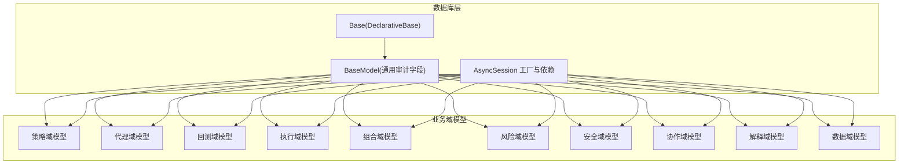
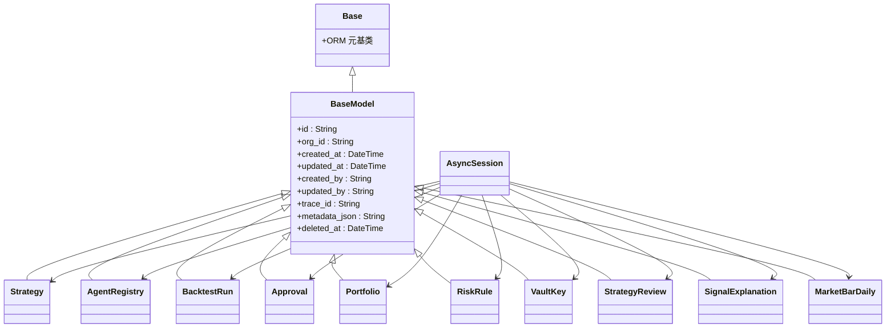
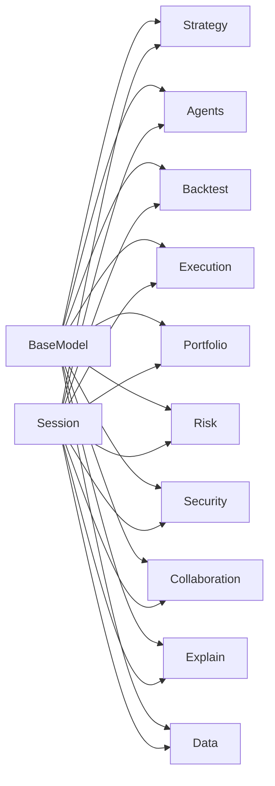

# 数据库模型

<cite>
**本文引用的文件**
- [backend/app/db/base.py](file://backend/app/db/base.py)
- [backend/app/db/base_class.py](file://backend/app/db/base_class.py)
- [backend/app/db/session.py](file://backend/app/db/session.py)
- [backend/alembic.ini](file://backend/alembic.ini)
- [backend/app/db/migrations/script.py.mako](file://backend/app/db/migrations/script.py.mako)
- [backend/app/domains/strategy/models.py](file://backend/app/domains/strategy/models.py)
- [backend/app/domains/agents/models.py](file://backend/app/domains/agents/models.py)
- [backend/app/domains/backtest/models.py](file://backend/app/domains/backtest/models.py)
- [backend/app/domains/execution/models.py](file://backend/app/domains/execution/models.py)
- [backend/app/domains/portfolio/models.py](file://backend/app/domains/portfolio/models.py)
- [backend/app/domains/risk/models.py](file://backend/app/domains/risk/models.py)
- [backend/app/domains/security/models.py](file://backend/app/domains/security/models.py)
- [backend/app/domains/collaboration/models.py](file://backend/app/domains/collaboration/models.py)
- [backend/app/domains/explain/models.py](file://backend/app/domains/explain/models.py)
- [backend/app/domains/data/models.py](file://backend/app/domains/data/models.py)
</cite>

## 目录
1. [简介](#简介)
2. [项目结构](#项目结构)
3. [核心组件](#核心组件)
4. [架构总览](#架构总览)
5. [详细组件分析](#详细组件分析)
6. [依赖分析](#依赖分析)
7. [性能考虑](#性能考虑)
8. [故障排查指南](#故障排查指南)
9. [结论](#结论)
10. [附录](#附录)

## 简介
本文件系统性梳理 llmine-quant 后端的数据库模型与迁移体系，重点覆盖 SQLAlchemy 异步 ORM 基类、通用审计字段、各业务域模型（策略、代理、回测、执行、组合、风险、安全、协作、解释、数据）的表结构、字段约束与索引策略，并给出模型使用范式、查询优化建议与数据完整性保障措施。文档同时解释 Alembic 迁移机制、版本控制与演进路径，帮助开发者正确使用与扩展数据模型。

## 项目结构
数据库相关代码主要分布在以下位置：
- ORM 基类与会话管理：backend/app/db
- 各业务域模型：backend/app/domains/*/models.py
- 迁移配置与脚手架：backend/app/db/migrations 与 alembic.ini
- 模型使用示例与服务层调用：backend/app/api/v1/* 与 backend/app/services/*

图表来源
- [backend/app/db/base.py:6-9](file://backend/app/db/base.py#L6-L9)
- [backend/app/db/base_class.py:17-30](file://backend/app/db/base_class.py#L17-L30)
- [backend/app/db/session.py:14-21](file://backend/app/db/session.py#L14-L21)
- [backend/app/domains/strategy/models.py:9-84](file://backend/app/domains/strategy/models.py#L9-L84)
- [backend/app/domains/agents/models.py:9-62](file://backend/app/domains/agents/models.py#L9-L62)
- [backend/app/domains/backtest/models.py:9-155](file://backend/app/domains/backtest/models.py#L9-L155)
- [backend/app/domains/execution/models.py:9-103](file://backend/app/domains/execution/models.py#L9-L103)
- [backend/app/domains/portfolio/models.py:9-83](file://backend/app/domains/portfolio/models.py#L9-L83)
- [backend/app/domains/risk/models.py:9-101](file://backend/app/domains/risk/models.py#L9-L101)
- [backend/app/domains/security/models.py:9-59](file://backend/app/domains/security/models.py#L9-L59)
- [backend/app/domains/collaboration/models.py:9-44](file://backend/app/domains/collaboration/models.py#L9-L44)
- [backend/app/domains/explain/models.py:9-87](file://backend/app/domains/explain/models.py#L9-L87)
- [backend/app/domains/data/models.py:9-144](file://backend/app/domains/data/models.py#L9-L144)

章节来源
- [backend/app/db/base.py:1-10](file://backend/app/db/base.py#L1-L10)
- [backend/app/db/base_class.py:1-31](file://backend/app/db/base_class.py#L1-L31)
- [backend/app/db/session.py:1-34](file://backend/app/db/session.py#L1-L34)

## 核心组件
- ORM 基类与会话
  - Base：继承 SQLAlchemy 的 DeclarativeBase，作为所有模型的元基类。
  - BaseModel：继承自 Base，统一提供审计字段（id、org_id、created_at、updated_at、created_by、updated_by、trace_id、metadata_json、deleted_at），并默认主键为 UUID 字符串类型。
  - AsyncSession：通过异步引擎创建，支持自动回滚与关闭；提供依赖注入函数以在请求生命周期内提供会话。
- 迁移与版本控制
  - alembic.ini：配置迁移脚本目录、日志级别、数据库连接字符串等。
  - script.py.mako：迁移脚手架模板，生成升级/降级函数占位。

章节来源
- [backend/app/db/base.py:6-9](file://backend/app/db/base.py#L6-L9)
- [backend/app/db/base_class.py:17-30](file://backend/app/db/base_class.py#L17-L30)
- [backend/app/db/session.py:14-21](file://backend/app/db/session.py#L14-L21)
- [backend/alembic.ini:58](file://backend/alembic.ini#L58)
- [backend/app/db/migrations/script.py.mako:19-24](file://backend/app/db/migrations/script.py.mako#L19-L24)

## 架构总览
下图展示数据库层与各业务域模型的关系，以及会话依赖注入如何贯穿到 API 层。

图表来源
- [backend/app/db/base.py:6-9](file://backend/app/db/base.py#L6-L9)
- [backend/app/db/base_class.py:17-30](file://backend/app/db/base_class.py#L17-L30)
- [backend/app/domains/strategy/models.py:9-27](file://backend/app/domains/strategy/models.py#L9-L27)
- [backend/app/domains/agents/models.py:9-20](file://backend/app/domains/agents/models.py#L9-L20)
- [backend/app/domains/backtest/models.py:20-30](file://backend/app/domains/backtest/models.py#L20-L30)
- [backend/app/domains/execution/models.py:9-31](file://backend/app/domains/execution/models.py#L9-L31)
- [backend/app/domains/portfolio/models.py:9-17](file://backend/app/domains/portfolio/models.py#L9-L17)
- [backend/app/domains/risk/models.py:9-18](file://backend/app/domains/risk/models.py#L9-L18)
- [backend/app/domains/security/models.py:9-22](file://backend/app/domains/security/models.py#L9-L22)
- [backend/app/domains/collaboration/models.py:9-18](file://backend/app/domains/collaboration/models.py#L9-L18)
- [backend/app/domains/explain/models.py:9-22](file://backend/app/domains/explain/models.py#L9-L22)
- [backend/app/domains/data/models.py:40-66](file://backend/app/domains/data/models.py#L40-L66)
- [backend/app/db/session.py:24-33](file://backend/app/db/session.py#L24-L33)

## 详细组件分析

### 策略域模型
- 表与字段要点
  - 策略主表：包含名称、家族、类型、状态、所有者、描述、风险偏好、市场、标的池、频率、收益指标等。
  - 版本表：不可变版本记录，保存代码 URI/文本、参数模式、风控规则等。
  - 任务表：自然语言生成任务，跟踪提示、市场、风险偏好、状态、关联策略/回测任务等。
  - 流水线事件表：记录策略生命周期阶段变更事件。
  - 模板表：预置策略模板，便于快速生成。
- 约束与索引
  - 多处字段建立索引以支持高频查询（如 family、type、status、owner_id、agent_task_id、backtest_* 等）。
  - 部分数值字段允许空值，便于增量演进。
- 使用建议
  - 生成任务完成后，优先通过 backtest_task_id 关联回测任务，再通过 run_id 关联回测结果。
  - 使用 status 字段进行工作流状态机驱动。

章节来源
- [backend/app/domains/strategy/models.py:9-84](file://backend/app/domains/strategy/models.py#L9-L84)

### 代理域模型
- 表与字段要点
  - 注册表：AI 代理注册信息，含角色、状态、心跳、配置等。
  - 任务队列表：任务类型、优先级、状态、结果时间戳等。
  - 消息表：跨代理通信，支持广播与点对点，带相关性标识。
  - 工具注册表：工具权限与启用状态。
- 约束与索引
  - name 唯一约束，避免重复注册。
  - 多字段建立索引，提升查询效率。
- 使用建议
  - 通过 correlation_id 关联消息链路，便于审计与追踪。

章节来源
- [backend/app/domains/agents/models.py:9-62](file://backend/app/domains/agents/models.py#L9-L62)

### 回测域模型
- 表与字段要点
  - 任务表：回测任务配置、优先级、状态。
  - 运行表：单次运行参数、起止时间、状态、报告地址。
  - 指标表：按时间段（全样本/样本内/样本外）记录收益、最大回撤、夏普等。
  - 净值点表：等时点净值、基准、回撤与阶段标识。
  - 敏感性分析表：参数扰动或滑点扰动的结果对比。
  - 走势分析表：多折线训练/测试窗口指标。
  - 交易明细表：逐笔模拟交易及原因说明。
  - 应急场景表：压力测试结果与建议。
- 约束与索引
  - 大量字段建立索引，尤其是 run_id、trade_date、symbol、kind、fold_index 等。
  - equity_points 与 backtest_trades 采用复合唯一约束（如 symbol/trade_date）。
- 使用建议
  - 指标按 segment 划分，便于区分 IS/OOS 分析。
  - 敏感性分析与走势分析结合，形成稳健评估。

章节来源
- [backend/app/domains/backtest/models.py:9-155](file://backend/app/domains/backtest/models.py#L9-L155)

### 执行域模型
- 表与字段要点
  - 审批表：人工在环审批请求，含组合、策略、方向、数量、限价、止损、置信度、影响、时效与状态。
  - 订单表：订单簿条目，含已成交数量、滑点、盈亏、策略关联。
  - 成交表：单笔成交记录。
  - 执行指标表：滑点、成交率、延迟、成功率等快照。
  - 事前风控检查表：账户维度的风控阈值与状态。
  - 代理轨迹表：执行过程中的动作日志。
- 约束与索引
  - 多字段建立索引，支撑高频查询与过滤。
- 使用建议
  - 结合 PreTradeCheck 与 Approval 实现“先审后投”的合规流程。

章节来源
- [backend/app/domains/execution/models.py:9-103](file://backend/app/domains/execution/models.py#L9-L103)

### 组合域模型
- 表与字段要点
  - 组合主表：名称、币种、状态、所有者。
  - 账户表：角色（托管/实盘/仿真）、是否实盘、额度、所属组合。
  - 持仓表：按账户与标的统计数量、成本、市值。
  - 现金余额表：按币种统计可用/冻结金额。
  - 净值快照表：按时间点记录净值、盈亏、杠杆。
  - 再平衡提案表：类型、方向、原因、影响、紧急度与状态。
- 约束与索引
  - positions 与 cash_balances 均按 account_id + symbol 建立索引。
- 使用建议
  - NAV 快照用于可视化与风控阈值计算。

章节来源
- [backend/app/domains/portfolio/models.py:9-83](file://backend/app/domains/portfolio/models.py#L9-L83)

### 风域模型
- 表与字段要点
  - 风控规则表：作用范围、指标、阈值、动作（告警/阻断/强关）、启用状态与描述。
  - 风控检查表：资源类型/ID、结果与快照。
  - 风控预算表：组合维度的预算分配与使用情况。
  - VaR 快照表：日/周 VaR 及置信度。
  - 闸门器表：分级触发条件、动作、状态与统计。
  - 风险违约表：严重程度、标题、详情、处置状态与状态色调。
  - 策略决策表：策略引擎决策日志。
- 约束与索引
  - 多字段建立索引，便于快速筛选与聚合。
- 使用建议
  - 将策略决策与风控检查联动，形成闭环。

章节来源
- [backend/app/domains/risk/models.py:9-101](file://backend/app/domains/risk/models.py#L9-L101)

### 安全域模型
- 表与字段要点
  - 密钥表：标签、类型、提供商、轮换/过期时间、状态、作用域与加密存储。
  - AI 权限表：类别、接口名、允许状态与原因。
  - 提现规则表：名称、描述与状态。
  - 安全事件表：事件类型、严重等级、标题、参与者、详情、处置与状态。
- 约束与索引
  - 多字段建立索引，支持审计与检索。
- 使用建议
  - 密钥轮换与过期提醒纳入自动化流程。

章节来源
- [backend/app/domains/security/models.py:9-59](file://backend/app/domains/security/models.py#L9-L59)

### 协作域模型
- 表与字段要点
  - 策略评审表：版本前后对比、优先级、创建人与状态。
  - 评审决策表：评审角色与决策状态。
  - A/B 实验表：对照组与实验组策略、持续天数、样本量与改进幅度。
- 约束与索引
  - 多字段建立索引，便于工作流推进。
- 使用建议
  - 评审与 A/B 实验并行推进，提高策略迭代效率。

章节来源
- [backend/app/domains/collaboration/models.py:9-44](file://backend/app/domains/collaboration/models.py#L9-L44)

### 解释域模型
- 表与字段要点
  - 信号解释表：解释 trace_id、策略、动作、目标、规模、置信度、风险等级、时间戳与状态。
  - 归因因子表：归因项、取值、描述与排序。
  - 决策链表：步骤、标题、描述、标签与色调。
  - 血缘记录表：步骤、版本、哈希、权限与详情。
  - 偏见闸门检查表：检查项、状态与描述。
  - 相似案例表：历史相似信号的回报、天数、成功与否与备注。
- 约束与索引
  - explanation_id 建立索引，支撑解释链的高效查询。
- 使用建议
  - 将解释链与血缘记录结合，形成可追溯的决策证据链。

章节来源
- [backend/app/domains/explain/models.py:9-87](file://backend/app/domains/explain/models.py#L9-L87)

### 数据域模型
- 表与字段要点
  - 数据源表：名称、提供商、等级、许可范围、类型、覆盖范围、健康状态、延迟、缺失率、漂移分数与最后更新。
  - 数据源健康快照表：按周期记录延迟、缺失率、漂移分数。
  - 日线行情表：唯一约束（symbol, trade_date），包含开盘/最高/最低/收盘、成交量、复权因子、涨跌停/停牌/买卖限制等。
  - 事件表：拆分/分红/配股等调整因子。
  - 特征集表：名称/版本、许可范围、血缘哈希、校验状态、种类与描述、依赖与计算窗口。
  - 特征使用表：策略版本与特征消费关系，支持回测运行级关联。
  - 血缘节点表：原始/清洗/特征/模型/信号/订单等节点类型、标签、版本、权限与引用。
  - 血缘边表：父子节点关系与回测运行级关联。
  - 数据事件表：延迟/缺失/漂移/许可/停机/模式变更等事件，含严重等级与状态。
- 约束与索引
  - market_bars_daily 建立唯一约束，确保日频数据唯一性。
  - 多字段建立索引，支撑高频查询。
- 使用建议
  - 血缘记录与特征使用表配合，实现特征溯源与回测可复现。

章节来源
- [backend/app/domains/data/models.py:9-144](file://backend/app/domains/data/models.py#L9-L144)

## 依赖分析
- 组件耦合与内聚
  - 所有模型均继承自 BaseModel，具备统一审计字段，降低重复代码，提升内聚性。
  - 业务域之间通过外键字段弱耦合（如 backtest_runs.run_id 关联 backtest_metrics.run_id），避免强耦合。
- 直接与间接依赖
  - 模型依赖 SQLAlchemy 的 mapped_column 与 Mapped 类型注解。
  - 会话依赖由 session.py 提供，API 层通过依赖注入使用。
- 外部依赖与集成点
  - Alembic 作为迁移框架，通过 alembic.ini 指定脚本位置与数据库连接。
  - script.py.mako 为迁移脚手架，生成升级/降级函数。
- 接口契约与实现细节
  - BaseModel 默认主键为 UUID 字符串，统一 id 生成策略。
  - 多表建立索引，满足高频查询需求。

图表来源
- [backend/app/db/base_class.py:17-30](file://backend/app/db/base_class.py#L17-L30)
- [backend/app/db/session.py:24-33](file://backend/app/db/session.py#L24-L33)
- [backend/app/domains/strategy/models.py:9-84](file://backend/app/domains/strategy/models.py#L9-L84)
- [backend/app/domains/agents/models.py:9-62](file://backend/app/domains/agents/models.py#L9-L62)
- [backend/app/domains/backtest/models.py:9-155](file://backend/app/domains/backtest/models.py#L9-L155)
- [backend/app/domains/execution/models.py:9-103](file://backend/app/domains/execution/models.py#L9-L103)
- [backend/app/domains/portfolio/models.py:9-83](file://backend/app/domains/portfolio/models.py#L9-L83)
- [backend/app/domains/risk/models.py:9-101](file://backend/app/domains/risk/models.py#L9-L101)
- [backend/app/domains/security/models.py:9-59](file://backend/app/domains/security/models.py#L9-L59)
- [backend/app/domains/collaboration/models.py:9-44](file://backend/app/domains/collaboration/models.py#L9-L44)
- [backend/app/domains/explain/models.py:9-87](file://backend/app/domains/explain/models.py#L9-L87)
- [backend/app/domains/data/models.py:9-144](file://backend/app/domains/data/models.py#L9-L144)

## 性能考虑
- 索引策略
  - 对高频过滤字段（family、type、status、owner_id、agent_task_id、backtest_*、run_id、trade_date、symbol、kind、fold_index 等）建立索引，显著降低查询成本。
  - 对唯一约束（如 market_bars_daily 的 symbol/trade_date）减少重复写入与冲突。
- 查询优化
  - 使用 selectinload/joinload 控制关联加载，避免 N+1 查询。
  - 对大表分页查询时，优先基于索引列排序与过滤。
- 写入优化
  - 批量插入/更新，减少事务次数。
  - 对只读报表类查询使用只读副本或物化视图（如适用）。
- 存储与压缩
  - TimescaleDB 场景下的日线行情表，建议开启压缩与分区策略（在数据库层面）。

## 故障排查指南
- 迁移失败
  - 检查 alembic.ini 中数据库连接字符串与脚本路径。
  - 使用脚手架模板确认升级/降级函数是否完整生成。
- 会话异常
  - 确认 get_db 依赖在请求生命周期中被正确调用，异常时会自动回滚并关闭会话。
- 数据重复或不一致
  - 核对唯一约束（如 market_bars_daily）与索引字段，避免并发写入冲突。
  - 对关键写入操作使用事务包裹，确保原子性。

章节来源
- [backend/alembic.ini:58](file://backend/alembic.ini#L58)
- [backend/app/db/migrations/script.py.mako:19-24](file://backend/app/db/migrations/script.py.mako#L19-L24)
- [backend/app/db/session.py:24-33](file://backend/app/db/session.py#L24-L33)
- [backend/app/domains/data/models.py:44-46](file://backend/app/domains/data/models.py#L44-L46)

## 结论
本数据库模型以 BaseModel 为核心，统一了审计字段与主键策略，通过清晰的业务域划分与索引设计，支撑从策略生成、回测评估、组合管理、风险控制到执行落地的全流程。Alembic 迁移体系与脚手架模板确保了模型演进的可控性与可追溯性。建议在实际开发中遵循统一的索引策略、查询优化与事务边界，确保系统的稳定性与可维护性。

## 附录
- 模型使用示例（路径）
  - 创建策略版本：参考 [backend/app/domains/strategy/models.py:30-42](file://backend/app/domains/strategy/models.py#L30-L42)
  - 提交回测任务：参考 [backend/app/domains/backtest/models.py:9-18](file://backend/app/domains/backtest/models.py#L9-L18)
  - 发起交易审批：参考 [backend/app/domains/execution/models.py:9-31](file://backend/app/domains/execution/models.py#L9-L31)
  - 新增持仓：参考 [backend/app/domains/portfolio/models.py:33-43](file://backend/app/domains/portfolio/models.py#L33-L43)
  - 配置风控规则：参考 [backend/app/domains/risk/models.py:9-18](file://backend/app/domains/risk/models.py#L9-L18)
  - 记录数据事件：参考 [backend/app/domains/data/models.py:132-144](file://backend/app/domains/data/models.py#L132-L144)
- 查询优化技巧（路径）
  - 基于索引的过滤与排序：参考各模型的索引字段定义
  - 关联加载策略：参考 [backend/app/db/session.py:24-33](file://backend/app/db/session.py#L24-L33)
- 数据完整性保证（路径）
  - 唯一约束与非空约束：参考 [backend/app/domains/data/models.py:44-46](file://backend/app/domains/data/models.py#L44-L46)
  - 审计字段一致性：参考 [backend/app/db/base_class.py:17-30](file://backend/app/db/base_class.py#L17-L30)