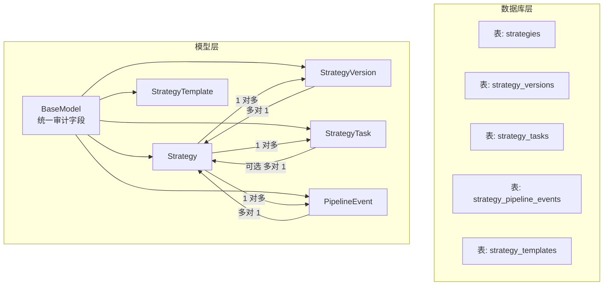
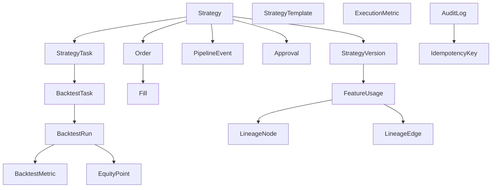
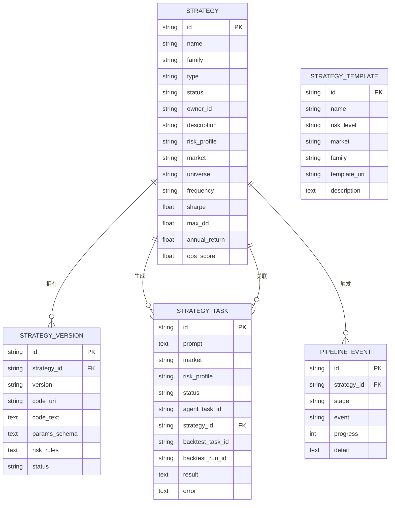
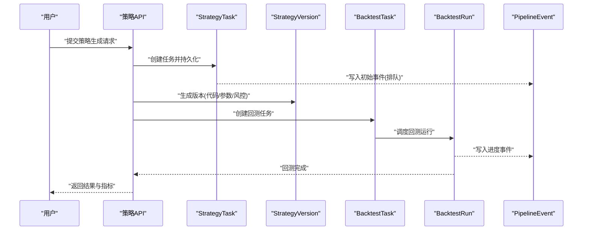
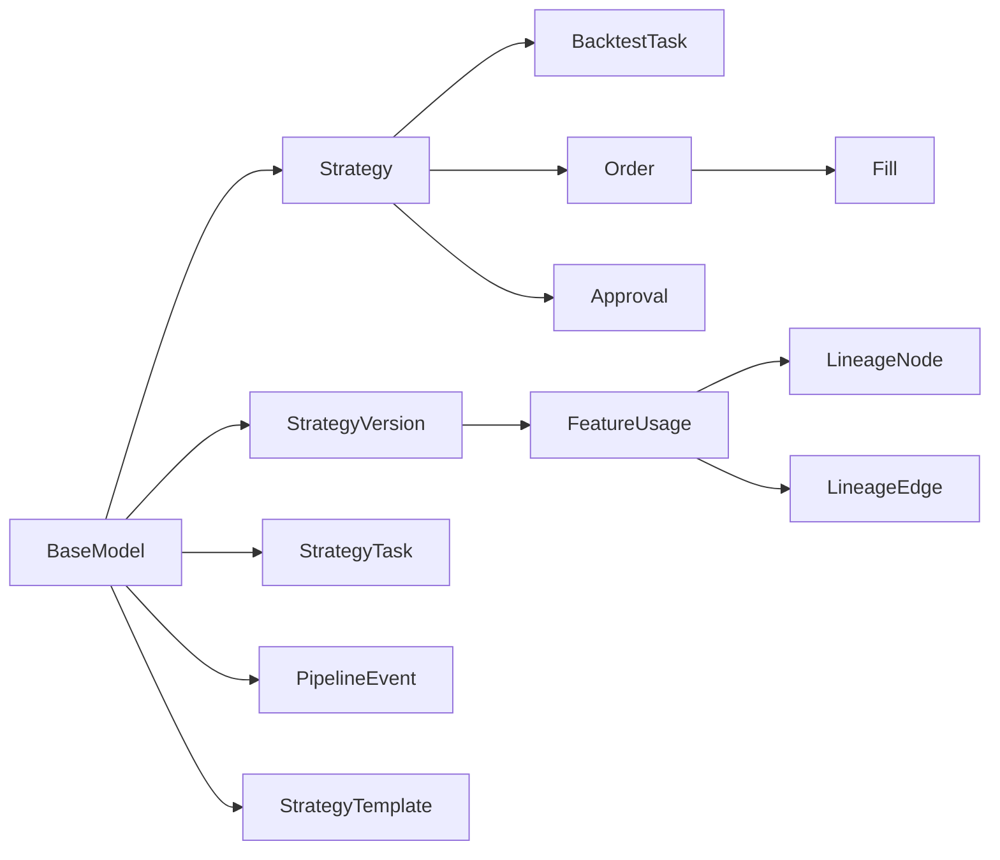

# 核心领域模型

<cite>
**本文引用的文件**
- [backend/app/domains/strategy/models.py](file://backend/app/domains/strategy/models.py)
- [backend/app/db/base_class.py](file://backend/app/db/base_class.py)
- [backend/app/db/base.py](file://backend/app/db/base.py)
- [backend/app/api/v1/strategies.py](file://backend/app/api/v1/strategies.py)
- [backend/app/db/migrations/versions/20260510_000002_strategy_and_agent_tables.py](file://backend/app/db/migrations/versions/20260510_000002_strategy_and_agent_tables.py)
- [backend/app/domains/backtest/models.py](file://backend/app/domains/backtest/models.py)
- [backend/app/domains/execution/models.py](file://backend/app/domains/execution/models.py)
- [backend/app/domains/data/models.py](file://backend/app/domains/data/models.py)
- [backend/app/domains/audit/models.py](file://backend/app/domains/audit/models.py)
- [backend/app/domains/collaboration/models.py](file://backend/app/domains/collaboration/models.py)
</cite>

## 目录
1. [简介](#简介)
2. [项目结构](#项目结构)
3. [核心组件](#核心组件)
4. [架构总览](#架构总览)
5. [详细组件分析](#详细组件分析)
6. [依赖分析](#依赖分析)
7. [性能考虑](#性能考虑)
8. [故障排查指南](#故障排查指南)
9. [结论](#结论)
10. [附录](#附录)

## 简介
本文件聚焦于系统的核心领域模型：策略模型(Strategy)、策略版本模型(StrategyVersion)、策略任务模型(StrategyTask)、管道事件模型(PipelineEvent)和策略模板模型(StrategyTemplate)。我们将从字段定义、数据类型、约束与索引策略入手，解释模型间的关系映射（外键、一对多、多对多），并提供使用示例、查询优化技巧与数据完整性保障措施，帮助开发者正确理解与高效使用这些模型。

## 项目结构
核心模型位于后端域层的策略子域中，采用统一的基类扩展审计字段，并通过 SQLAlchemy ORM 映射到关系型数据库表。API 层提供对这些模型的访问与业务流程编排。

图表来源
- [backend/app/domains/strategy/models.py:9-84](file://backend/app/domains/strategy/models.py#L9-L84)
- [backend/app/db/base_class.py:17-31](file://backend/app/db/base_class.py#L17-L31)
- [backend/app/db/migrations/versions/20260510_000002_strategy_and_agent_tables.py:39-106](file://backend/app/db/migrations/versions/20260510_000002_strategy_and_agent_tables.py#L39-L106)

章节来源
- [backend/app/domains/strategy/models.py:1-84](file://backend/app/domains/strategy/models.py#L1-L84)
- [backend/app/db/base_class.py:1-31](file://backend/app/db/base_class.py#L1-L31)
- [backend/app/db/migrations/versions/20260510_000002_strategy_and_agent_tables.py:37-106](file://backend/app/db/migrations/versions/20260510_000002_strategy_and_agent_tables.py#L37-L106)

## 核心组件
本节对五个核心模型进行逐项说明，包含字段、类型、约束与索引策略。

- Strategy（策略主记录）
  - 字段与类型
    - 名称: 字符串(最大长度128)，必填
    - 家族: 字符串(最大长度64)，必填，已建立索引
    - 类型: 字符串(最大长度32)，必填，已建立索引（规则/机器学习/组合等）
    - 状态: 字符串(最大长度32)，默认“draft”，已建立索引（草稿/回测/模拟/实盘/暂停/归档）
    - 所有者ID: 字符串(最大长度36)，必填，已建立索引
    - 描述: 文本，可空
    - 风险偏好: 字符串(最大长度32)，默认“balanced”（保守/均衡/激进）
    - 市场: 字符串(最大长度32)，默认“A”（A股/美股/港股/加密）
    - 选股池: 字符串(最大长度512)，可空
    - 频率: 字符串(最大长度16)，默认“1d”
    - 夏普比率: 浮点数，可空
    - 最大回撤: 浮点数，可空
    - 年化收益: 浮点数，可空
    - OOS评分: 浮点数，可空
  - 约束与索引
    - 主键: 统一审计字段中的字符串UUID
    - 全局审计字段: org_id(索引)、created_at、updated_at、created_by、updated_by、trace_id、metadata_json、deleted_at
    - 业务索引: family、type、status、owner_id
  - 数据完整性
    - 使用统一审计基类确保软删除与审计轨迹一致

- StrategyVersion（策略不可变版本）
  - 字段与类型
    - 策略ID: 字符串(最大长度36)，必填，已建立索引
    - 版本号: 字符串(最大长度32)，必填
    - 代码URI: 字符串(最大长度512)，可空
    - 代码文本: 文本，可空
    - 参数模式: 文本(JSON)，可空
    - 风控规则: 文本(JSON)，可空
    - 状态: 字符串(最大长度32)，默认“draft”
  - 约束与索引
    - 主键: 统一审计字段中的字符串UUID
    - 索引: strategy_id
  - 关系
    - 多对1: 关联至 Strategy

- StrategyTask（自然语言策略生成任务）
  - 字段与类型
    - 提示词: 文本，必填
    - 市场: 字符串(最大长度32)，默认“A”
    - 风险偏好: 字符串(最大长度32)，默认“balanced”
    - 状态: 字符串(最大长度32)，默认“queued”，已建立索引（排队/运行/等待人工/阻塞/成功/失败/取消）
    - 代理任务ID: 字符串(最大长度36)，可空
    - 策略ID: 字符串(最大长度36)，可空，已建立索引
    - 回测任务ID: 字符串(最大长度36)，可空，已建立索引
    - 回测运行ID: 字符串(最大长度36)，可空，已建立索引
    - 结果: 文本，可空
    - 错误: 文本，可空
  - 约束与索引
    - 主键: 统一审计字段中的字符串UUID
    - 索引: status、strategy_id、backtest_task_id、backtest_run_id
  - 关系
    - 可选多对1: 关联至 Strategy
    - 可选多对1: 关联至 BacktestTask
    - 可选多对1: 关联至 BacktestRun

- PipelineEvent（策略流水线状态变更事件）
  - 字段与类型
    - 策略ID: 字符串(最大长度36)，必填，已建立索引
    - 阶段: 字符串(最大长度32)，必填，已建立索引（研究/回测/模拟/实盘/归档）
    - 事件: 字符串(最大长度64)，必填
    - 进度: 整数，默认0
    - 细节: 文本，可空
  - 约束与索引
    - 主键: 统一审计字段中的字符串UUID
    - 索引: strategy_id、stage
  - 关系
    - 多对1: 关联至 Strategy

- StrategyTemplate（预置策略模板）
  - 字段与类型
    - 名称: 字符串(最大长度128)，必填
    - 风险等级: 字符串(最大长度32)，默认“balanced”
    - 市场: 字符串(最大长度32)，默认“A”
    - 家族: 字符串(最大长度64)，必填
    - 模板URI: 字符串(最大长度512)，可空
    - 描述: 文本，可空
  - 约束与索引
    - 主键: 统一审计字段中的字符串UUID

章节来源
- [backend/app/domains/strategy/models.py:9-84](file://backend/app/domains/strategy/models.py#L9-L84)
- [backend/app/db/base_class.py:17-31](file://backend/app/db/base_class.py#L17-L31)
- [backend/app/db/migrations/versions/20260510_000002_strategy_and_agent_tables.py:39-106](file://backend/app/db/migrations/versions/20260510_000002_strategy_and_agent_tables.py#L39-L106)

## 架构总览
下图展示策略域内核心模型与外部相关模型的关系，包括回测、执行、数据与审计域的关键实体，体现跨域协作与数据流。

图表来源
- [backend/app/domains/strategy/models.py:9-84](file://backend/app/domains/strategy/models.py#L9-L84)
- [backend/app/domains/backtest/models.py:9-155](file://backend/app/domains/backtest/models.py#L9-L155)
- [backend/app/domains/execution/models.py:9-103](file://backend/app/domains/execution/models.py#L9-L103)
- [backend/app/domains/data/models.py:98-130](file://backend/app/domains/data/models.py#L98-L130)
- [backend/app/domains/audit/models.py:9-51](file://backend/app/domains/audit/models.py#L9-L51)

## 详细组件分析

### Strategy（策略主记录）
- 设计要点
  - 作为策略生命周期的根实体，承载策略元数据与关键指标。
  - 通过 family/type/status/owner_id 建立高频查询维度。
- 使用示例路径
  - 列表与概览接口中对 Strategy 的聚合统计与分页查询。
- 查询优化建议
  - 在按 family/type/status/owner_id 过滤时，优先使用复合索引或覆盖索引以减少回表。
  - 对于指标字段（夏普、最大回撤、年化收益、OOS评分）的排序与筛选，建议在业务层做缓存或物化视图。

章节来源
- [backend/app/domains/strategy/models.py:9-28](file://backend/app/domains/strategy/models.py#L9-L28)
- [backend/app/api/v1/strategies.py:162-186](file://backend/app/api/v1/strategies.py#L162-L186)

### StrategyVersion（策略版本）
- 设计要点
  - 不可变性：版本一经创建即不可修改，便于审计与回溯。
  - 存储代码与参数模式，支持后续回测与部署。
- 使用示例路径
  - API 中将版本对象转换为对外输出结构，用于前端展示与选择。
- 查询优化建议
  - 通过 strategy_id + version 唯一性约束避免重复版本；必要时在查询中显式限定版本范围。

章节来源
- [backend/app/domains/strategy/models.py:30-42](file://backend/app/domains/strategy/models.py#L30-L42)
- [backend/app/api/v1/strategies.py:101-110](file://backend/app/api/v1/strategies.py#L101-L110)

### StrategyTask（策略生成任务）
- 设计要点
  - 记录从自然语言到策略代码的生成过程，贯穿代理任务、回测任务与运行ID。
  - 状态机驱动：排队/运行/等待人工/阻塞/成功/失败/取消。
- 使用示例路径
  - 将任务对象映射为对外输出结构，包含进度与阶段转换。
- 查询优化建议
  - 对 status、strategy_id、backtest_task_id、backtest_run_id 建立复合索引，提升任务状态与关联查询效率。

章节来源
- [backend/app/domains/strategy/models.py:44-58](file://backend/app/domains/strategy/models.py#L44-L58)
- [backend/app/api/v1/strategies.py:50-81](file://backend/app/api/v1/strategies.py#L50-L81)

### PipelineEvent（策略流水线事件）
- 设计要点
  - 记录策略在不同阶段的状态变化与进度，支撑可视化看板与告警。
  - 支持按策略与阶段快速检索。
- 使用示例路径
  - 将事件对象映射为对外输出结构，用于前端流水线面板展示。
- 查询优化建议
  - 对 strategy_id + stage 建立联合索引，加速按策略与阶段过滤。

章节来源
- [backend/app/domains/strategy/models.py:61-71](file://backend/app/domains/strategy/models.py#L61-L71)
- [backend/app/api/v1/strategies.py:113-122](file://backend/app/api/v1/strategies.py#L113-L122)

### StrategyTemplate（策略模板）
- 设计要点
  - 提供开箱即用的策略模板，降低用户入门成本。
  - 通过家族与市场维度分类管理。
- 使用示例路径
  - 列表模板接口返回最近创建的模板集合，用于策略工厂界面。

章节来源
- [backend/app/domains/strategy/models.py:73-84](file://backend/app/domains/strategy/models.py#L73-L84)
- [backend/app/api/v1/strategies.py:188-200](file://backend/app/api/v1/strategies.py#L188-L200)

### 关系映射与外键约束
- Strategy 与 StrategyVersion：一对多（一个策略可有多个版本）
- Strategy 与 StrategyTask：一对多（一个策略可对应多个生成任务）
- Strategy 与 PipelineEvent：一对多（一个策略可产生多条流水线事件）
- StrategyTask 与 Strategy：多对一（任务可指向某个策略）
- StrategyTask 与 BacktestTask/BacktestRun：多对一（任务可关联回测任务与运行）
- StrategyVersion 与 FeatureUsage：多对一（版本与特征使用关联）
- FeatureUsage 与 LineageNode/LineageEdge：多对多（通过中间表建立）

图表来源
- [backend/app/domains/strategy/models.py:9-84](file://backend/app/domains/strategy/models.py#L9-L84)

章节来源
- [backend/app/domains/strategy/models.py:9-84](file://backend/app/domains/strategy/models.py#L9-L84)

### 复杂逻辑与数据流示例
以下序列图展示从自然语言到策略生成、回测与事件记录的典型流程。

图表来源
- [backend/app/domains/strategy/models.py:44-71](file://backend/app/domains/strategy/models.py#L44-L71)
- [backend/app/domains/backtest/models.py:9-31](file://backend/app/domains/backtest/models.py#L9-L31)
- [backend/app/api/v1/strategies.py:125-130](file://backend/app/api/v1/strategies.py#L125-L130)

## 依赖分析
- 继承关系
  - 所有模型继承自统一的 BaseModel，后者提供 id、org_id、created_at、updated_at、created_by、updated_by、trace_id、metadata_json、deleted_at 等审计字段。
- 外部依赖
  - SQLAlchemy ORM 与 DeclarativeBase 提供声明式映射能力。
  - Alembic 迁移脚本定义表结构与索引。
- 跨域依赖
  - 回测域：BacktestTask/BacktestRun/BacktestMetric/EquityPoint 与 StrategyTask/StrategyVersion 关联。
  - 执行域：Approval/Order/Fill/ExecutionMetric 与 Strategy 关联。
  - 数据域：FeatureUsage/LineageNode/LineageEdge 与 StrategyVersion 关联。
  - 审计域：AuditLog/IdempotencyKey 与各模型的审计与幂等需求。

图表来源
- [backend/app/db/base_class.py:17-31](file://backend/app/db/base_class.py#L17-L31)
- [backend/app/domains/strategy/models.py:9-84](file://backend/app/domains/strategy/models.py#L9-L84)
- [backend/app/domains/backtest/models.py:9-31](file://backend/app/domains/backtest/models.py#L9-L31)
- [backend/app/domains/data/models.py:98-130](file://backend/app/domains/data/models.py#L98-L130)
- [backend/app/domains/execution/models.py:9-49](file://backend/app/domains/execution/models.py#L9-L49)

章节来源
- [backend/app/db/base.py:6-9](file://backend/app/db/base.py#L6-L9)
- [backend/app/db/base_class.py:17-31](file://backend/app/db/base_class.py#L17-L31)
- [backend/app/domains/strategy/models.py:9-84](file://backend/app/domains/strategy/models.py#L9-L84)
- [backend/app/domains/backtest/models.py:9-31](file://backend/app/domains/backtest/models.py#L9-L31)
- [backend/app/domains/execution/models.py:9-49](file://backend/app/domains/execution/models.py#L9-L49)
- [backend/app/domains/data/models.py:98-130](file://backend/app/domains/data/models.py#L98-L130)
- [backend/app/domains/audit/models.py:9-51](file://backend/app/domains/audit/models.py#L9-L51)

## 性能考虑
- 索引策略
  - 高频过滤字段（family、type、status、owner_id、strategy_id、stage、backtest_task_id、backtest_run_id）应建立单列或复合索引。
  - 对时间序列字段（如 created_at、updated_at）建立索引以支持排序与范围查询。
- 查询优化
  - 使用 select 加载策略详情时，避免 N+1 查询；优先使用 join 或预先加载关联对象。
  - 对流水线事件与任务状态的聚合查询，建议使用物化视图或缓存。
- 写入优化
  - 事件写入采用追加写模式，避免更新与删除，降低锁竞争。
- 存储与压缩
  - 大文本字段（如代码文本、参数模式、风控规则、回测报告URI）建议启用数据库压缩或外部存储（如对象存储）。

## 故障排查指南
- 常见问题
  - 无法按状态过滤：检查 status 字段是否建立索引，确认查询条件大小写与枚举值一致。
  - 任务状态异常：核对 StrategyTask 的状态机转换逻辑与事件写入顺序。
  - 版本冲突：确认 StrategyVersion 的版本号唯一性与不可变性约束。
- 排查步骤
  - 使用审计日志（AuditLog）定位操作轨迹与错误上下文。
  - 检查幂等键（IdempotencyKey）防止重复请求导致的数据不一致。
  - 对关键查询添加 trace_id，结合服务端日志定位慢查询与异常。

章节来源
- [backend/app/domains/audit/models.py:9-51](file://backend/app/domains/audit/models.py#L9-L51)
- [backend/app/domains/strategy/models.py:44-71](file://backend/app/domains/strategy/models.py#L44-L71)

## 结论
上述五个核心模型构成了策略生命周期的完整数据骨架：从策略主记录、版本管理、任务编排、流水线事件到模板复用，配合统一的审计基类与跨域模型关系，形成清晰、可扩展且易于维护的数据模型体系。遵循本文的字段定义、索引策略与查询优化建议，可显著提升系统的稳定性与性能表现。

## 附录
- 字段与索引速查
  - Strategy: family/type/status/owner_id 索引；指标字段用于排序与筛选。
  - StrategyVersion: strategy_id 索引；版本号唯一性约束。
  - StrategyTask: status/strategy_id/backtest_task_id/backtest_run_id 索引。
  - PipelineEvent: strategy_id/stage 索引。
  - StrategyTemplate: 无显式索引（可根据查询模式评估）。
- 迁移参考
  - 初次创建策略相关表与种子模板数据的迁移脚本。

章节来源
- [backend/app/db/migrations/versions/20260510_000002_strategy_and_agent_tables.py:37-106](file://backend/app/db/migrations/versions/20260510_000002_strategy_and_agent_tables.py#L37-L106)