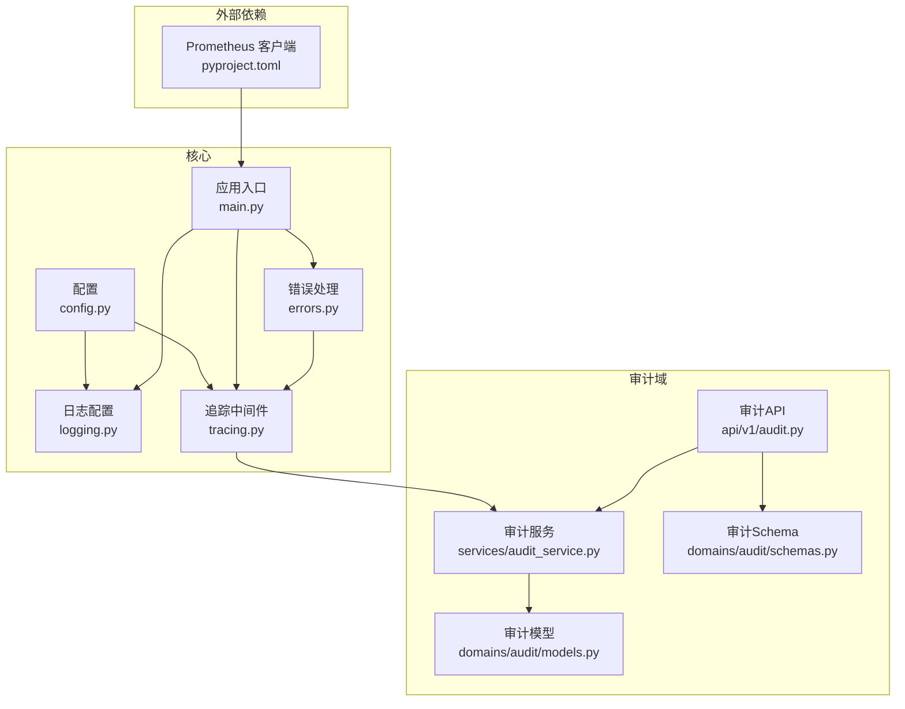
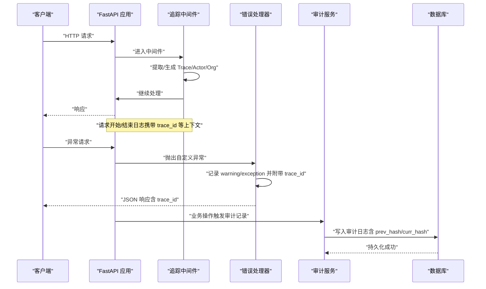
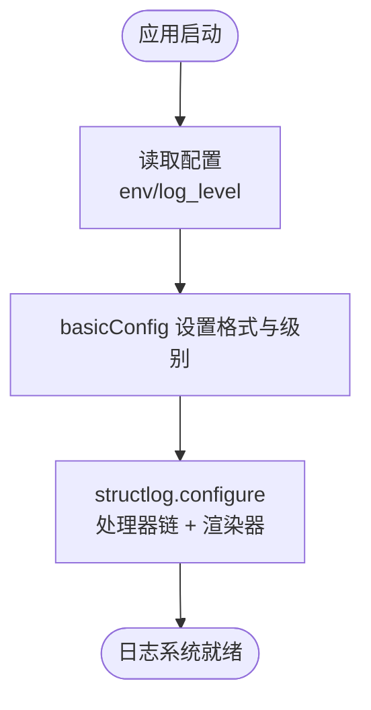
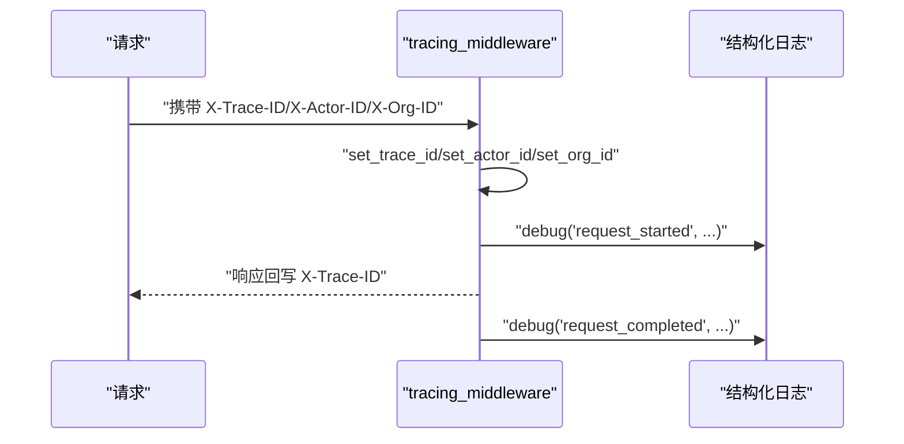
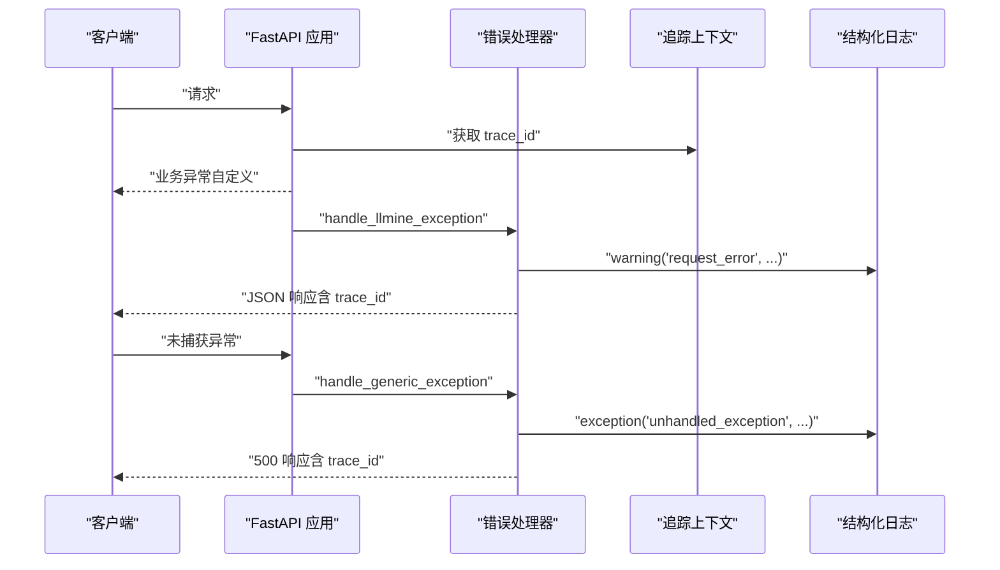
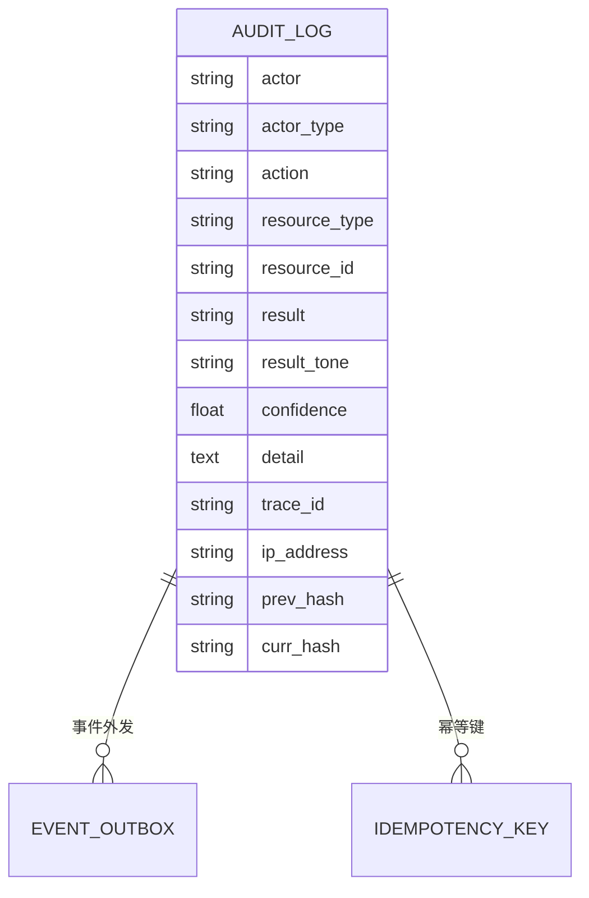
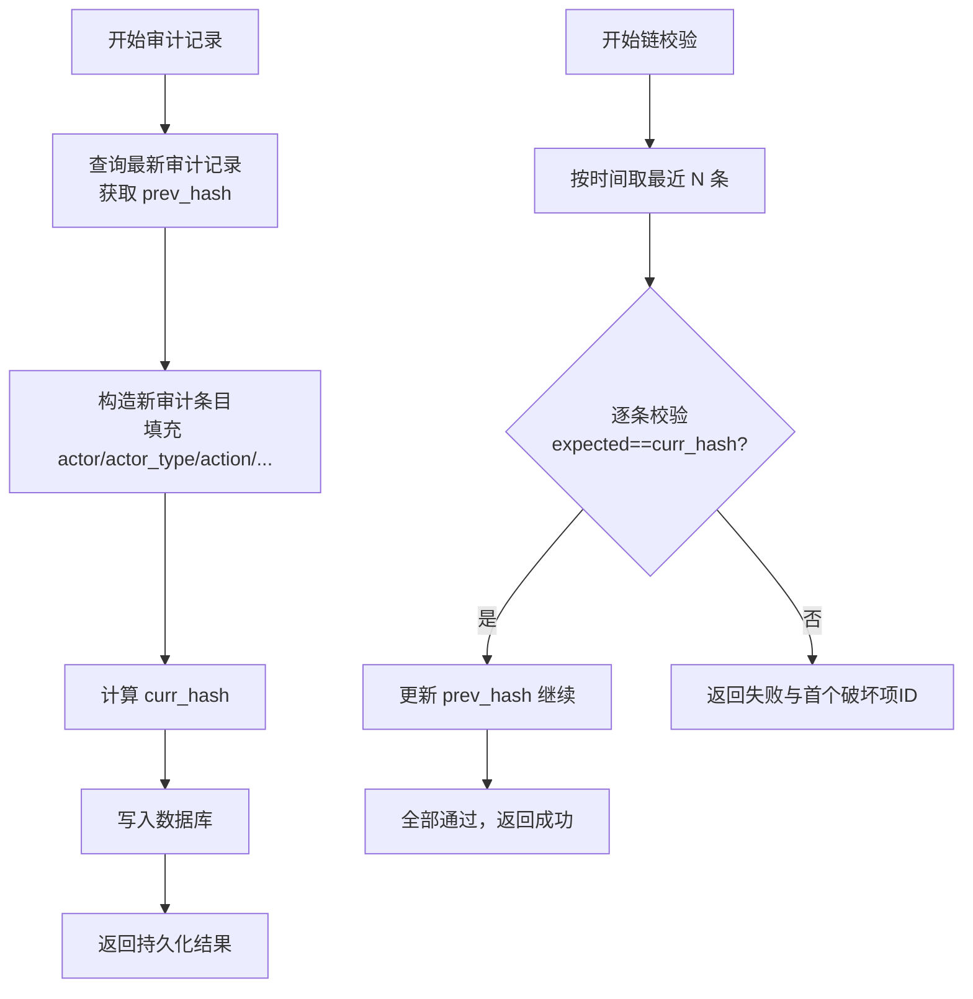
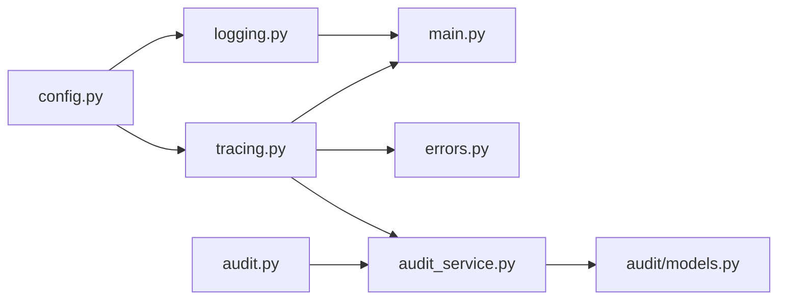

# 日志记录与监控

<cite>
**本文引用的文件**
- [backend/app/core/logging.py](file://backend/app/core/logging.py)
- [backend/app/core/tracing.py](file://backend/app/core/tracing.py)
- [backend/app/core/config.py](file://backend/app/core/config.py)
- [backend/app/core/errors.py](file://backend/app/core/errors.py)
- [backend/app/main.py](file://backend/app/main.py)
- [backend/app/api/v1/audit.py](file://backend/app/api/v1/audit.py)
- [backend/app/services/audit_service.py](file://backend/app/services/audit_service.py)
- [backend/app/domains/audit/models.py](file://backend/app/domains/audit/models.py)
- [backend/app/domains/audit/schemas.py](file://backend/app/domains/audit/schemas.py)
- [backend/pyproject.toml](file://backend/pyproject.toml)
</cite>

## 目录
1. [简介](#简介)
2. [项目结构](#项目结构)
3. [核心组件](#核心组件)
4. [架构总览](#架构总览)
5. [详细组件分析](#详细组件分析)
6. [依赖关系分析](#依赖关系分析)
7. [性能考量](#性能考量)
8. [故障排查指南](#故障排查指南)
9. [结论](#结论)
10. [附录](#附录)

## 简介
本文件面向 llmine-quant 后端的日志记录与监控体系，系统性解析以下主题：
- 日志配置与日志级别管理
- 日志格式标准化（结构化 JSON/控制台）
- 分布式追踪机制（请求级 Trace ID、Actor/Org 上下文注入）
- 安全审计日志（不可篡改链式审计、哈希校验）
- 性能监控指标与可观测性建议
- 日志聚合、告警与监控仪表板集成思路
- 开发示例、性能分析技巧与最佳实践

## 项目结构
围绕日志与监控的关键文件分布如下：
- 核心日志与追踪：backend/app/core/logging.py、backend/app/core/tracing.py、backend/app/core/config.py
- 应用入口与中间件：backend/app/main.py
- 错误处理与统一异常日志：backend/app/core/errors.py
- 审计域：backend/app/api/v1/audit.py、backend/app/services/audit_service.py、backend/app/domains/audit/models.py、backend/app/domains/audit/schemas.py
- 依赖与指标库：backend/pyproject.toml（包含 prometheus-client）

图表来源
- [backend/app/core/config.py:48-108](file://backend/app/core/config.py#L48-L108)
- [backend/app/core/logging.py:11-41](file://backend/app/core/logging.py#L11-L41)
- [backend/app/core/tracing.py:49-87](file://backend/app/core/tracing.py#L49-L87)
- [backend/app/core/errors.py:73-119](file://backend/app/core/errors.py#L73-L119)
- [backend/app/main.py:16-65](file://backend/app/main.py#L16-L65)
- [backend/app/api/v1/audit.py:153-258](file://backend/app/api/v1/audit.py#L153-L258)
- [backend/app/services/audit_service.py:32-109](file://backend/app/services/audit_service.py#L32-L109)
- [backend/app/domains/audit/models.py:9-51](file://backend/app/domains/audit/models.py#L9-L51)
- [backend/app/domains/audit/schemas.py:6-53](file://backend/app/domains/audit/schemas.py#L6-L53)
- [backend/pyproject.toml:24](file://backend/pyproject.toml#L24)

章节来源
- [backend/app/core/logging.py:11-41](file://backend/app/core/logging.py#L11-L41)
- [backend/app/core/tracing.py:49-87](file://backend/app/core/tracing.py#L49-L87)
- [backend/app/core/config.py:48-108](file://backend/app/core/config.py#L48-L108)
- [backend/app/main.py:16-65](file://backend/app/main.py#L16-L65)
- [backend/app/core/errors.py:73-119](file://backend/app/core/errors.py#L73-L119)
- [backend/app/api/v1/audit.py:153-258](file://backend/app/api/v1/audit.py#L153-L258)
- [backend/app/services/audit_service.py:32-109](file://backend/app/services/audit_service.py#L32-L109)
- [backend/app/domains/audit/models.py:9-51](file://backend/app/domains/audit/models.py#L9-L51)
- [backend/app/domains/audit/schemas.py:6-53](file://backend/app/domains/audit/schemas.py#L6-L53)
- [backend/pyproject.toml:24](file://backend/pyproject.toml#L24)

## 核心组件
- 结构化日志配置：基于 structlog，支持生产环境 JSON 输出与开发环境控制台输出，统一时间戳、堆栈信息、异常信息渲染。
- 分布式追踪：通过 FastAPI 中间件注入 Trace ID、Actor ID、Org ID，贯穿请求生命周期并在日志中携带上下文。
- 错误处理与统一日志：自定义异常类型与处理器，统一记录 trace_id、路径、方法、状态码等关键信息。
- 安全审计：不可篡改链式审计日志，支持哈希链完整性验证，提供查询、导出、统计与可视化接口。

章节来源
- [backend/app/core/logging.py:11-41](file://backend/app/core/logging.py#L11-L41)
- [backend/app/core/tracing.py:49-87](file://backend/app/core/tracing.py#L49-L87)
- [backend/app/core/errors.py:73-119](file://backend/app/core/errors.py#L73-L119)
- [backend/app/services/audit_service.py:32-109](file://backend/app/services/audit_service.py#L32-L109)

## 架构总览
下图展示日志与监控在系统中的交互关系：应用启动时初始化日志；请求进入时注入追踪上下文；错误发生时统一记录；审计服务负责链式日志持久化与校验。

图表来源
- [backend/app/main.py:16-65](file://backend/app/main.py#L16-L65)
- [backend/app/core/tracing.py:49-87](file://backend/app/core/tracing.py#L49-L87)
- [backend/app/core/errors.py:73-119](file://backend/app/core/errors.py#L73-L119)
- [backend/app/services/audit_service.py:32-109](file://backend/app/services/audit_service.py#L32-L109)

## 详细组件分析

### 日志配置与日志级别管理
- 初始化方式：通过基础日志库设置根格式与级别；同时配置 structlog，绑定过滤级别与渲染器。
- 环境差异化：
  - 生产环境：使用 JSON 渲染器，便于日志收集与检索。
  - 开发环境：使用控制台渲染器，便于本地调试。
- 日志级别：由配置项决定，默认 INFO；可通过环境变量调整。

图表来源
- [backend/app/core/logging.py:11-41](file://backend/app/core/logging.py#L11-L41)
- [backend/app/core/config.py:52-55](file://backend/app/core/config.py#L52-L55)

章节来源
- [backend/app/core/logging.py:11-41](file://backend/app/core/logging.py#L11-L41)
- [backend/app/core/config.py:52-55](file://backend/app/core/config.py#L52-L55)

### 分布式追踪机制
- 上下文变量：trace_id、actor_id、org_id 使用 contextvars 存储，保证异步与并发安全。
- 中间件流程：从请求头提取或生成 trace_id，注入 actor_id、org_id；在请求开始与结束分别记录 debug 日志，并将 trace_id 回写响应头。
- 日志标准化：追踪日志包含 trace_id、方法、路径、状态码等关键字段，便于跨服务串联。

图表来源
- [backend/app/core/tracing.py:49-87](file://backend/app/core/tracing.py#L49-L87)
- [backend/app/core/logging.py:38-41](file://backend/app/core/logging.py#L38-L41)

章节来源
- [backend/app/core/tracing.py:13-46](file://backend/app/core/tracing.py#L13-L46)
- [backend/app/core/tracing.py:49-87](file://backend/app/core/tracing.py#L49-L87)

### 错误处理与统一日志
- 自定义异常：定义多种业务异常类型，统一返回结构包含 code、message、details、trace_id。
- 异常处理器：
  - 自定义异常：记录 warning，包含 trace_id、路径、方法、状态码。
  - 未捕获异常：记录 exception，包含 trace_id、路径、方法、错误摘要。
- 与追踪联动：异常处理器从上下文获取 trace_id，确保日志与请求一一对应。

图表来源
- [backend/app/core/errors.py:73-119](file://backend/app/core/errors.py#L73-L119)
- [backend/app/core/tracing.py:13-16](file://backend/app/core/tracing.py#L13-L16)

章节来源
- [backend/app/core/errors.py:73-119](file://backend/app/core/errors.py#L73-L119)

### 安全审计日志（不可篡改链）
- 数据模型：审计日志表包含 actor、actor_type、action、resource_type、resource_id、result、result_tone、confidence、detail、trace_id、prev_hash、curr_hash 等字段。
- 服务逻辑：
  - 记录审计：计算并写入 curr_hash，prev_hash 来自最新记录。
  - 链校验：按时间顺序验证哈希链，返回是否有效、验证数量、首个破坏项 ID。
- API 能力：提供概览、分页查询、导出 CSV、工具注册表、HITL 规则等接口，支撑合规与可视化。

图表来源
- [backend/app/domains/audit/models.py:9-51](file://backend/app/domains/audit/models.py#L9-L51)

图表来源
- [backend/app/services/audit_service.py:32-109](file://backend/app/services/audit_service.py#L32-L109)

章节来源
- [backend/app/api/v1/audit.py:153-258](file://backend/app/api/v1/audit.py#L153-L258)
- [backend/app/services/audit_service.py:32-109](file://backend/app/services/audit_service.py#L32-L109)
- [backend/app/domains/audit/models.py:9-51](file://backend/app/domains/audit/models.py#L9-L51)
- [backend/app/domains/audit/schemas.py:6-53](file://backend/app/domains/audit/schemas.py#L6-L53)

### 性能监控指标与可观测性建议
- Prometheus 客户端依赖已引入，可用于暴露自定义指标（如请求耗时、错误率、队列长度等）。
- 建议：
  - 在中间件中埋点：记录请求耗时、状态码分布、路由维度指标。
  - 在关键服务（如市场数据拉取、策略执行）增加指标采集。
  - 将指标与日志关联：通过 trace_id 实现日志与指标的交叉检索。
  - 与告警平台集成：基于指标阈值触发告警，结合审计日志定位问题。

章节来源
- [backend/pyproject.toml:24](file://backend/pyproject.toml#L24)

## 依赖关系分析
- 日志与配置：logging.py 依赖 config.py 的 env 与 log_level；tracing.py 依赖 logging.py 获取结构化 logger。
- 应用入口：main.py 初始化日志与追踪中间件，注册异常处理器与路由。
- 错误处理：errors.py 依赖 tracing.py 获取 trace_id，统一记录异常上下文。
- 审计服务：audit_service.py 依赖 tracing.py 获取 actor_id/trace_id，依赖数据库模型持久化。

图表来源
- [backend/app/core/config.py:48-108](file://backend/app/core/config.py#L48-L108)
- [backend/app/core/logging.py:11-41](file://backend/app/core/logging.py#L11-L41)
- [backend/app/core/tracing.py:49-87](file://backend/app/core/tracing.py#L49-L87)
- [backend/app/main.py:16-65](file://backend/app/main.py#L16-L65)
- [backend/app/core/errors.py:73-119](file://backend/app/core/errors.py#L73-L119)
- [backend/app/api/v1/audit.py:153-258](file://backend/app/api/v1/audit.py#L153-L258)
- [backend/app/services/audit_service.py:32-109](file://backend/app/services/audit_service.py#L32-L109)
- [backend/app/domains/audit/models.py:9-51](file://backend/app/domains/audit/models.py#L9-L51)

章节来源
- [backend/app/core/logging.py:11-41](file://backend/app/core/logging.py#L11-L41)
- [backend/app/core/tracing.py:49-87](file://backend/app/core/tracing.py#L49-L87)
- [backend/app/core/errors.py:73-119](file://backend/app/core/errors.py#L73-L119)
- [backend/app/api/v1/audit.py:153-258](file://backend/app/api/v1/audit.py#L153-L258)
- [backend/app/services/audit_service.py:32-109](file://backend/app/services/audit_service.py#L32-L109)
- [backend/app/domains/audit/models.py:9-51](file://backend/app/domains/audit/models.py#L9-L51)

## 性能考量
- 日志开销控制：
  - 生产环境使用 JSON 渲染器，减少格式化成本。
  - 控制高频 debug 日志，优先保留 info/warning/exception。
- 追踪上下文：
  - 仅在必要处设置 actor_id/org_id，避免过度上下文污染。
- 审计链写入：
  - 审计记录涉及数据库写入与哈希计算，建议批量或异步化（当前实现为同步，后续可评估优化）。
- 指标采集：
  - 使用 Prometheus 客户端暴露关键指标，避免在热路径中进行复杂计算。

## 故障排查指南
- 快速定位：
  - 通过响应体中的 trace_id 在日志中检索该请求的完整链路。
  - 查看错误处理器记录的 warning/exception，确认异常类型与上下文。
- 审计链完整性：
  - 使用审计 API 的哈希链校验接口，快速判断是否存在篡改或异常。
  - 导出 CSV 进行离线分析，核对关键字段一致性。
- 常见问题：
  - 缺失 trace_id：检查客户端是否正确传递 X-Trace-ID 或等待服务端生成。
  - 审计链中断：根据校验返回的首个破坏项 ID，回溯对应时间窗口内的异常。

章节来源
- [backend/app/core/errors.py:73-119](file://backend/app/core/errors.py#L73-L119)
- [backend/app/api/v1/audit.py:198-213](file://backend/app/api/v1/audit.py#L198-L213)
- [backend/app/services/audit_service.py:83-109](file://backend/app/services/audit_service.py#L83-L109)

## 结论
llmine-quant 的日志与监控体系以结构化日志为基础，结合分布式追踪与不可篡改审计，形成从请求到事件的完整可观测闭环。配合 Prometheus 指标与前端审计界面，可满足合规、排障与性能优化的多维需求。建议在现有基础上进一步完善指标埋点与告警策略，持续提升系统的稳定性与可维护性。

## 附录
- 开发示例（路径指引）：
  - 获取结构化 logger：[backend/app/core/logging.py:get_logger:38-41](file://backend/app/core/logging.py#L38-L41)
  - 注入追踪上下文：[backend/app/core/tracing.py:tracing_middleware:49-87](file://backend/app/core/tracing.py#L49-L87)
  - 记录审计日志：[backend/app/services/audit_service.py:log:38-82](file://backend/app/services/audit_service.py#L38-L82)
  - 查询审计日志：[backend/app/api/v1/audit.py:list_audit_logs:171-187](file://backend/app/api/v1/audit.py#L171-L187)
  - 导出审计日志：[backend/app/api/v1/audit.py:export_audit_logs:215-245](file://backend/app/api/v1/audit.py#L215-L245)
  - 哈希链校验：[backend/app/api/v1/audit.py:verify_hash_chain:198-213](file://backend/app/api/v1/audit.py#L198-L213)
- 性能分析技巧：
  - 使用 trace_id 关联日志与指标，定位慢请求。
  - 在关键路径埋点，统计 P50/P95 响应时间与错误率。
  - 审计链校验作为完整性探针，定期巡检。
- 最佳实践：
  - 统一日志字段命名与结构，确保跨服务一致性。
  - 限制 debug 级别日志频率，避免影响性能。
  - 将审计日志与合规要求对齐，定期导出与归档。