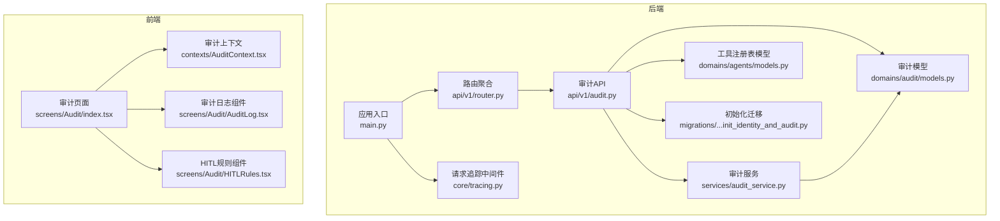
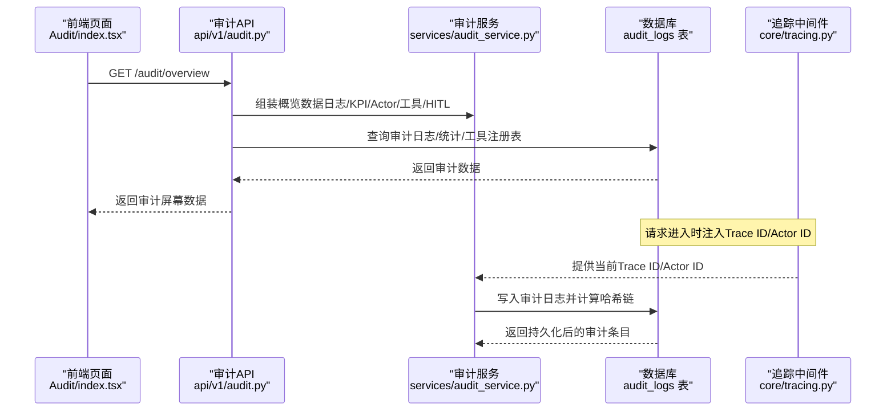
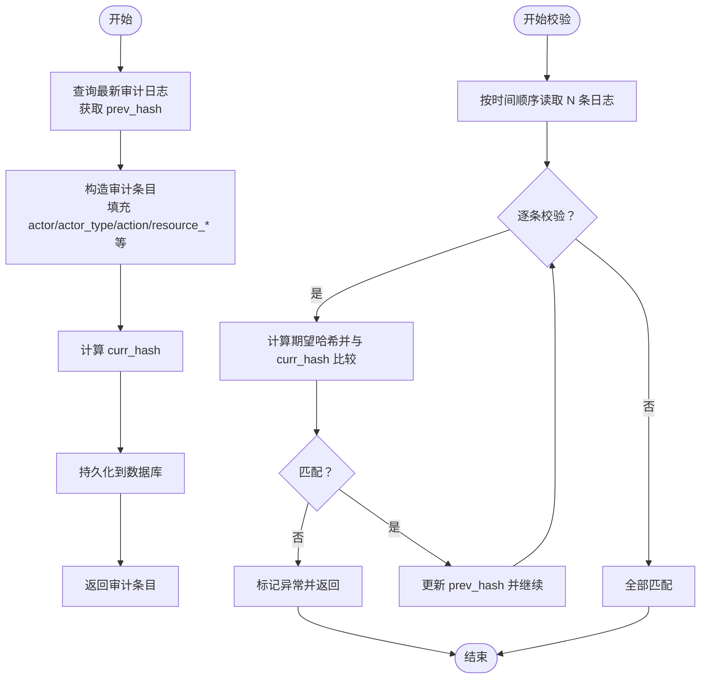
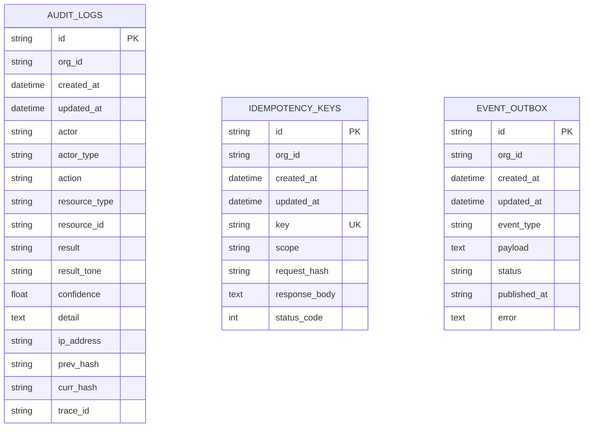
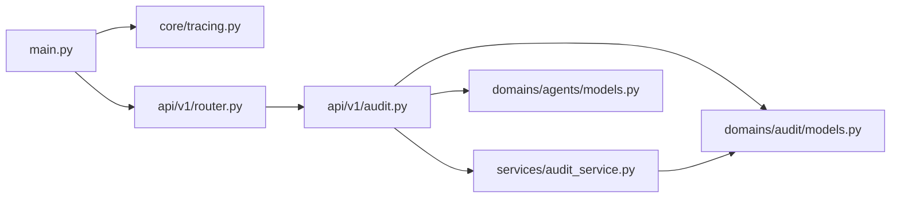

# 审计服务

<cite>
**本文引用的文件**
- [backend/app/api/v1/audit.py](file://backend/app/api/v1/audit.py)
- [backend/app/services/audit_service.py](file://backend/app/services/audit_service.py)
- [backend/app/domains/audit/models.py](file://backend/app/domains/audit/models.py)
- [backend/app/domains/audit/schemas.py](file://backend/app/domains/audit/schemas.py)
- [backend/app/db/migrations/versions/20260510_000001_init_identity_and_audit.py](file://backend/app/db/migrations/versions/20260510_000001_init_identity_and_audit.py)
- [backend/app/domains/agents/models.py](file://backend/app/domains/agents/models.py)
- [backend/app/core/tracing.py](file://backend/app/core/tracing.py)
- [backend/app/api/v1/router.py](file://backend/app/api/v1/router.py)
- [backend/app/main.py](file://backend/app/main.py)
- [frontend/src/screens/Audit/index.tsx](file://frontend/src/screens/Audit/index.tsx)
- [frontend/src/screens/Audit/AuditLog.tsx](file://frontend/src/screens/Audit/AuditLog.tsx)
- [frontend/src/screens/Audit/HITLRules.tsx](file://frontend/src/screens/Audit/HITLRules.tsx)
- [frontend/src/contexts/AuditContext.tsx](file://frontend/src/contexts/AuditContext.tsx)
</cite>

## 目录
1. [简介](#简介)
2. [项目结构](#项目结构)
3. [核心组件](#核心组件)
4. [架构总览](#架构总览)
5. [详细组件分析](#详细组件分析)
6. [依赖分析](#依赖分析)
7. [性能考虑](#性能考虑)
8. [故障排查指南](#故障排查指南)
9. [结论](#结论)
10. [附录](#附录)

## 简介
本文件为“审计服务”的综合开发文档，聚焦于操作审计、合规追踪与安全监控的实现机制。内容涵盖审计日志记录、事件分类与存储策略；审计规则配置、实时告警与合规报告能力；审计数据查询、分析与可视化展示方案；以及审计性能优化、数据保留策略与隐私保护的最佳实践。文档以代码为依据，结合前后端交互与数据库模式，帮助开发者与运维人员快速理解与扩展审计体系。

## 项目结构
审计服务由后端 API、领域模型与服务层、前端展示三部分组成，并通过中间件注入跟踪上下文，确保审计事件具备可追溯性与一致性。

图表来源
- [backend/app/main.py:1-65](file://backend/app/main.py#L1-L65)
- [backend/app/api/v1/router.py:1-40](file://backend/app/api/v1/router.py#L1-L40)
- [backend/app/api/v1/audit.py:1-258](file://backend/app/api/v1/audit.py#L1-L258)
- [backend/app/services/audit_service.py:1-109](file://backend/app/services/audit_service.py#L1-L109)
- [backend/app/domains/audit/models.py:1-51](file://backend/app/domains/audit/models.py#L1-L51)
- [backend/app/domains/agents/models.py:1-62](file://backend/app/domains/agents/models.py#L1-L62)
- [backend/app/core/tracing.py:1-87](file://backend/app/core/tracing.py#L1-L87)
- [backend/app/db/migrations/versions/20260510_000001_init_identity_and_audit.py:1-180](file://backend/app/db/migrations/versions/20260510_000001_init_identity_and_audit.py#L1-L180)
- [frontend/src/screens/Audit/index.tsx:1-43](file://frontend/src/screens/Audit/index.tsx#L1-L43)
- [frontend/src/screens/Audit/AuditLog.tsx:1-99](file://frontend/src/screens/Audit/AuditLog.tsx#L1-L99)
- [frontend/src/screens/Audit/HITLRules.tsx:1-38](file://frontend/src/screens/Audit/HITLRules.tsx#L1-L38)
- [frontend/src/contexts/AuditContext.tsx:1-13](file://frontend/src/contexts/AuditContext.tsx#L1-L13)

章节来源
- [backend/app/api/v1/audit.py:1-258](file://backend/app/api/v1/audit.py#L1-L258)
- [backend/app/services/audit_service.py:1-109](file://backend/app/services/audit_service.py#L1-L109)
- [backend/app/domains/audit/models.py:1-51](file://backend/app/domains/audit/models.py#L1-L51)
- [backend/app/domains/agents/models.py:1-62](file://backend/app/domains/agents/models.py#L1-L62)
- [backend/app/core/tracing.py:1-87](file://backend/app/core/tracing.py#L1-L87)
- [backend/app/db/migrations/versions/20260510_000001_init_identity_and_audit.py:1-180](file://backend/app/db/migrations/versions/20260510_000001_init_identity_and_audit.py#L1-L180)
- [frontend/src/screens/Audit/index.tsx:1-43](file://frontend/src/screens/Audit/index.tsx#L1-L43)
- [frontend/src/screens/Audit/AuditLog.tsx:1-99](file://frontend/src/screens/Audit/AuditLog.tsx#L1-L99)
- [frontend/src/screens/Audit/HITLRules.tsx:1-38](file://frontend/src/screens/Audit/HITLRules.tsx#L1-L38)
- [frontend/src/contexts/AuditContext.tsx:1-13](file://frontend/src/contexts/AuditContext.tsx#L1-L13)

## 核心组件
- 审计 API：提供概览、日志列表、统计、哈希链验证、导出、工具注册表与HITL规则等接口。
- 审计服务：封装不可变审计日志写入与哈希链校验，保证不可篡改性。
- 领域模型：定义审计日志、幂等键、事件外发箱等数据结构。
- 工具注册表：记录工具风险等级、允许的Agent角色等，支撑合规与权限控制。
- 请求追踪：中间件注入Trace ID与Actor ID，贯穿审计事件的可追溯性。
- 前端展示：审计页面聚合概览、日志表格、Actor分布、工具注册表与HITL规则。

章节来源
- [backend/app/api/v1/audit.py:153-258](file://backend/app/api/v1/audit.py#L153-L258)
- [backend/app/services/audit_service.py:32-109](file://backend/app/services/audit_service.py#L32-L109)
- [backend/app/domains/audit/models.py:9-51](file://backend/app/domains/audit/models.py#L9-L51)
- [backend/app/domains/agents/models.py:51-62](file://backend/app/domains/agents/models.py#L51-L62)
- [backend/app/core/tracing.py:49-86](file://backend/app/core/tracing.py#L49-L86)
- [frontend/src/screens/Audit/index.tsx:16-42](file://frontend/src/screens/Audit/index.tsx#L16-L42)

## 架构总览
审计服务采用“不可变日志 + 哈希链 + 追踪上下文”的设计，确保审计事件的完整性与可追溯性。后端通过FastAPI路由暴露REST接口，服务层负责计算哈希并持久化；前端通过上下文与组件渲染审计概览与日志。

图表来源
- [backend/app/api/v1/audit.py:153-168](file://backend/app/api/v1/audit.py#L153-L168)
- [backend/app/services/audit_service.py:38-81](file://backend/app/services/audit_service.py#L38-L81)
- [backend/app/core/tracing.py:49-86](file://backend/app/core/tracing.py#L49-L86)
- [backend/app/db/migrations/versions/20260510_000001_init_identity_and_audit.py:106-130](file://backend/app/db/migrations/versions/20260510_000001_init_identity_and_audit.py#L106-L130)

## 详细组件分析

### 审计API（后端）
- 职责：聚合审计概览、分页查询日志、统计Actor、哈希链验证、CSV导出、工具注册表与HITL规则。
- 关键接口：
  - GET /audit/overview：返回KPI、最近日志、Actor统计、工具注册表与HITL规则。
  - GET /audit/logs：支持按Actor类型与动作过滤、分页。
  - GET /audit/verify：验证最新N条日志的哈希链完整性。
  - GET /audit/export：导出审计日志为CSV。
  - GET /audit/registry 与 GET /audit/hitl-rules：返回工具注册表与规则。
- 数据转换：将数据库实体映射为前端Schema对象，统一输出格式。

章节来源
- [backend/app/api/v1/audit.py:153-258](file://backend/app/api/v1/audit.py#L153-L258)
- [backend/app/domains/audit/schemas.py:6-53](file://backend/app/domains/audit/schemas.py#L6-L53)

### 审计服务（后端）
- 职责：提供不可变审计日志写入与哈希链校验。
- 核心流程：
  - 写入：读取最新日志的curr_hash作为前驱哈希，构造新条目并计算curr_hash，提交事务后返回。
  - 校验：按时间顺序读取限定数量的日志，逐条比对计算哈希与curr_hash，返回是否有效、验证数量与首个异常项ID。
- 哈希算法：基于字段拼接与SHA-256，包含Actor、Actor类型、动作、资源类型、资源ID、结果、时间与前驱哈希。

图表来源
- [backend/app/services/audit_service.py:38-81](file://backend/app/services/audit_service.py#L38-L81)
- [backend/app/services/audit_service.py:83-109](file://backend/app/services/audit_service.py#L83-L109)

章节来源
- [backend/app/services/audit_service.py:18-29](file://backend/app/services/audit_service.py#L18-L29)
- [backend/app/services/audit_service.py:32-109](file://backend/app/services/audit_service.py#L32-L109)

### 审计模型与存储策略
- 审计日志表（audit_logs）：包含Actor、Actor类型、动作、资源类型/ID、结果、置信度、详情、Trace ID、IP地址、前驱与当前哈希等字段，并建立索引以支持查询与统计。
- 幂等键表（idempotency_keys）：用于重复请求去重，保障审计事件的幂等性。
- 事件外发箱（event_outbox）：用于可靠事件发布，可与审计联动触发合规告警或外部审计平台同步。
- 初始化迁移：一次性创建上述表结构，包含基础索引与约束。

图表来源
- [backend/app/domains/audit/models.py:9-51](file://backend/app/domains/audit/models.py#L9-L51)
- [backend/app/db/migrations/versions/20260510_000001_init_identity_and_audit.py:106-168](file://backend/app/db/migrations/versions/20260510_000001_init_identity_and_audit.py#L106-L168)

章节来源
- [backend/app/domains/audit/models.py:9-51](file://backend/app/domains/audit/models.py#L9-L51)
- [backend/app/db/migrations/versions/20260510_000001_init_identity_and_audit.py:106-168](file://backend/app/db/migrations/versions/20260510_000001_init_identity_and_audit.py#L106-L168)

### 工具注册表与HITL规则
- 工具注册表（tool_registry）：记录工具名称、风险等级、描述、允许的Agent角色、启用状态等，支持按风险分级与权限控制。
- HITL规则：内置多项规则（如实盘审批、策略上线审批、大额交易提醒、数据异常处理、熔断恢复、资金变动审计确认），用于指导人工介入与自动化控制。

章节来源
- [backend/app/domains/agents/models.py:51-62](file://backend/app/domains/agents/models.py#L51-L62)
- [backend/app/api/v1/audit.py:29-36](file://backend/app/api/v1/audit.py#L29-L36)

### 前端展示与交互
- 审计页面：首次加载调用 /audit/overview 获取完整数据，使用上下文在子组件间传递。
- 审计日志组件：支持按Actor类型筛选、显示时间、Actor、动作、资源、结果、置信度、详情与Trace ID。
- HITL规则组件：展示规则标题、描述与状态（自动/复核/审批）及其视觉标识。
- 上下文：提供审计数据的全局访问能力，避免深层传参。

章节来源
- [frontend/src/screens/Audit/index.tsx:16-42](file://frontend/src/screens/Audit/index.tsx#L16-L42)
- [frontend/src/screens/Audit/AuditLog.tsx:19-99](file://frontend/src/screens/Audit/AuditLog.tsx#L19-L99)
- [frontend/src/screens/Audit/HITLRules.tsx:9-38](file://frontend/src/screens/Audit/HITLRules.tsx#L9-L38)
- [frontend/src/contexts/AuditContext.tsx:1-13](file://frontend/src/contexts/AuditContext.tsx#L1-L13)

## 依赖分析
- 中间件依赖：应用启动时注入追踪中间件，确保每个请求携带Trace ID与Actor ID，审计写入时可直接获取。
- 路由依赖：审计API被聚合到v1路由中，统一前缀与标签管理。
- 模型依赖：审计API依赖审计模型与工具注册表模型进行查询与序列化。
- 服务依赖：审计API依赖审计服务完成日志写入与哈希链校验。

图表来源
- [backend/app/main.py:49-50](file://backend/app/main.py#L49-L50)
- [backend/app/api/v1/router.py:37](file://backend/app/api/v1/router.py#L37)
- [backend/app/api/v1/audit.py:13-24](file://backend/app/api/v1/audit.py#L13-L24)
- [backend/app/services/audit_service.py:10-15](file://backend/app/services/audit_service.py#L10-L15)

章节来源
- [backend/app/main.py:49-50](file://backend/app/main.py#L49-L50)
- [backend/app/api/v1/router.py:37](file://backend/app/api/v1/router.py#L37)
- [backend/app/api/v1/audit.py:13-24](file://backend/app/api/v1/audit.py#L13-L24)
- [backend/app/services/audit_service.py:10-15](file://backend/app/services/audit_service.py#L10-L15)

## 性能考虑
- 查询优化
  - 审计日志表已针对 actor、action、resource_id、trace_id 等常用查询字段建立索引，建议在高频过滤场景（如按Actor类型、动作关键字）优先使用这些字段。
  - 分页查询限制最大条数与偏移上限，避免超大数据量扫描。
- 写入优化
  - 哈希计算为CPU密集型，建议在高并发场景下评估批量写入策略与数据库连接池配置。
  - 使用事务一次性提交，减少锁竞争与回滚成本。
- 存储与归档
  - 建议按月/季度归档旧日志至冷存储，保留热数据在高性能SSD。
  - 对历史数据建立只读副本，降低在线查询压力。
- 前端渲染
  - 日志表格支持按Actor类型筛选，建议在大数据量时启用虚拟滚动与懒加载。
  - 导出CSV时限制最大导出条数，防止内存溢出。

## 故障排查指南
- 哈希链验证失败
  - 现象：/audit/verify 返回 broken 或 valid=false。
  - 排查：检查返回的 brokenEntryId，定位异常条目；确认该条目是否被修改或缺失curr_hash。
  - 处理：修复或重建哈希链，必要时回溯到上一个有效节点。
- 导出数据异常
  - 现象：导出CSV列不完整或包含换行符。
  - 排查：确认detail字段是否包含换行符，导出时已做替换处理。
- 权限与规则
  - 现象：工具调用未触发预期审批或告警。
  - 排查：核对工具注册表中的风险等级与允许的Agent角色；检查HITL规则状态与阈值设置。
- 前端数据为空
  - 现象：审计页面加载后无数据。
  - 排查：确认 /audit/overview 是否返回成功；检查网络请求与跨域配置。

章节来源
- [backend/app/api/v1/audit.py:198-212](file://backend/app/api/v1/audit.py#L198-L212)
- [backend/app/api/v1/audit.py:215-245](file://backend/app/api/v1/audit.py#L215-L245)
- [backend/app/api/v1/audit.py:29-36](file://backend/app/api/v1/audit.py#L29-L36)

## 结论
审计服务通过不可变日志与哈希链实现了强一致的审计证据链，结合追踪中间件与前端可视化组件，提供了完整的操作审计、合规追踪与安全监控能力。建议在生产环境中配合数据归档、性能优化与规则治理，持续提升系统的可靠性与可维护性。

## 附录
- 审计规则配置建议
  - 将规则集中管理，支持动态开关与阈值调整。
  - 对高风险动作（如实盘下单、策略切换）强制审批或提醒。
- 合规报告
  - 支持按日/周/月生成合规报告，包含事件总数、异常占比、Actor分布与工具使用情况。
- 隐私保护
  - 对敏感字段（如IP地址、详情）进行脱敏处理；仅在必要范围内保留与使用。
- 实时告警
  - 基于事件结果与置信度触发告警；与安全事件面板联动，形成闭环处置流程。