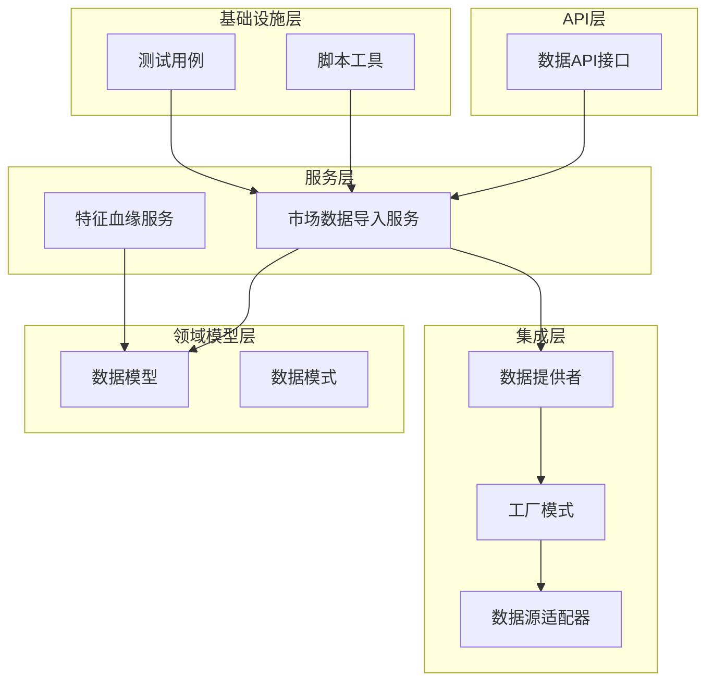
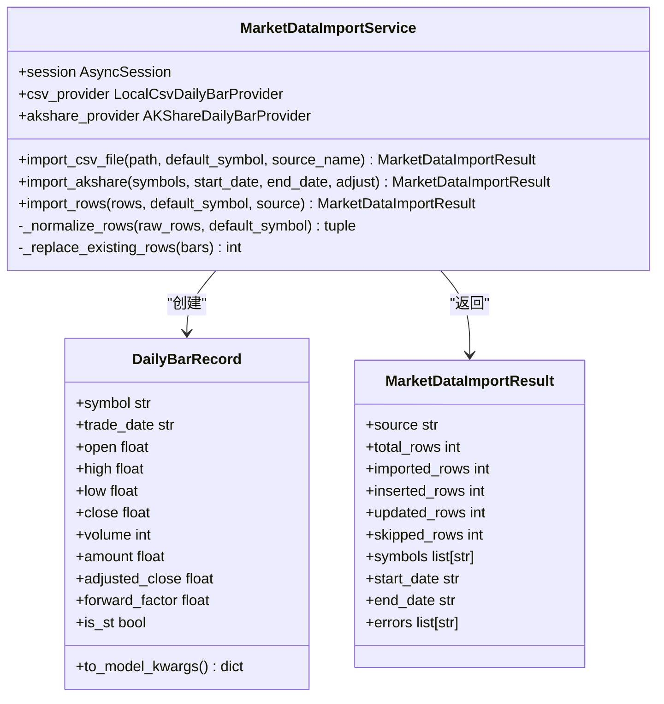
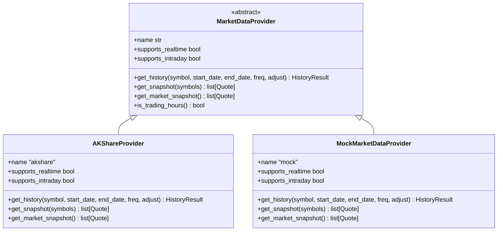
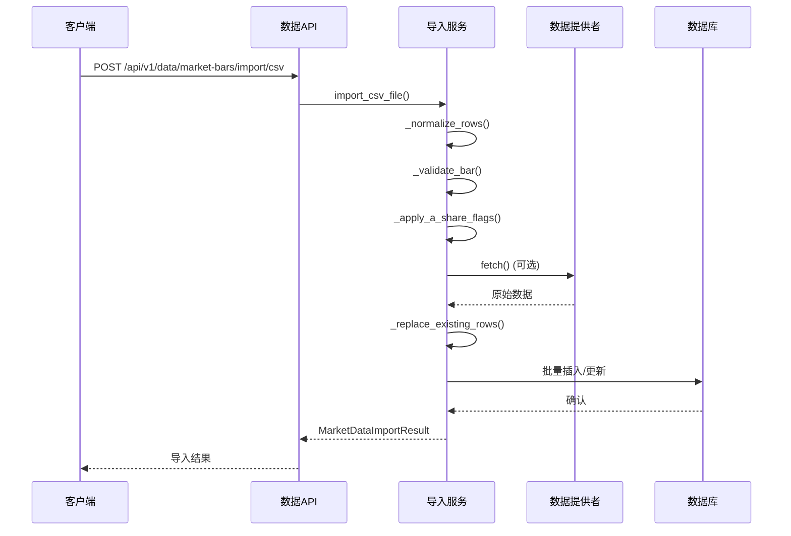
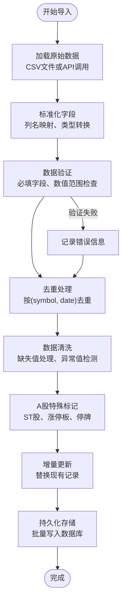
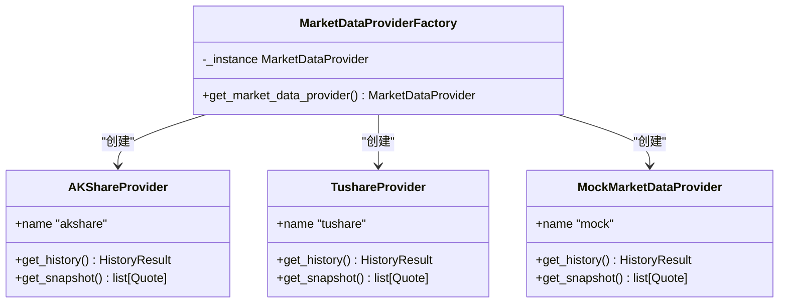
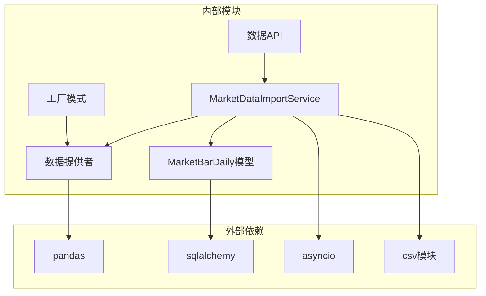
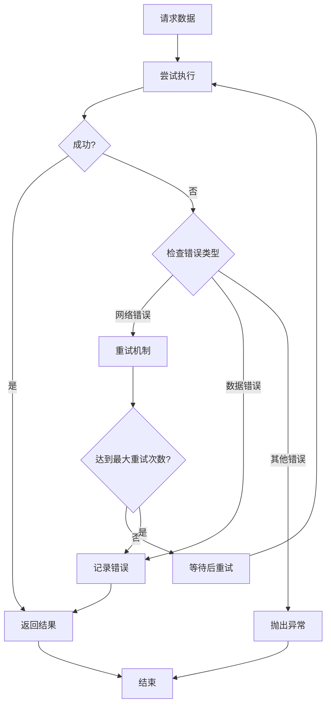

# 市场数据导入服务

<cite>
**本文档引用的文件**
- [market_data_import.py](file://backend/app/services/market_data_import.py)
- [adapter.py](file://backend/app/integrations/market_data/adapter.py)
- [base.py](file://backend/app/integrations/market_data/base.py)
- [factory.py](file://backend/app/integrations/market_data/factory.py)
- [akshare_provider.py](file://backend/app/integrations/market_data/akshare_provider.py)
- [mock_provider.py](file://backend/app/integrations/market_data/mock_provider.py)
- [models.py](file://backend/app/domains/data/models.py)
- [data.py](file://backend/app/api/v1/data.py)
- [import_market_data.py](file://backend/scripts/import_market_data.py)
- [config.py](file://backend/app/core/config.py)
- [test_market_data_import.py](file://backend/tests/services/test_market_data_import.py)
- [feature_lineage.py](file://backend/app/services/feature_lineage.py)
</cite>

## 目录
1. [简介](#简介)
2. [项目结构](#项目结构)
3. [核心组件](#核心组件)
4. [架构概览](#架构概览)
5. [详细组件分析](#详细组件分析)
6. [依赖关系分析](#依赖关系分析)
7. [性能考虑](#性能考虑)
8. [故障排除指南](#故障排除指南)
9. [结论](#结论)

## 简介

市场数据导入服务是量化交易系统的核心基础设施，负责从多种数据源（CSV文件、AKShare免费数据源、Tushare付费数据源等）导入高质量的市场数据。该服务提供了完整的数据清洗、验证、标准化和持久化功能，确保研究级日线行情数据的质量和一致性。

本服务采用模块化设计，支持多数据源适配器模式，具备强大的数据清洗规则和质量控制机制，能够处理缺失值、异常值和重复数据，同时提供增量更新和批量处理能力。

## 项目结构

市场数据导入服务位于后端应用的多个层次中，形成了清晰的分层架构：

**图表来源**
- [market_data_import.py:1-426](file://backend/app/services/market_data_import.py#L1-L426)
- [data.py:1-392](file://backend/app/api/v1/data.py#L1-L392)
- [factory.py:1-57](file://backend/app/integrations/market_data/factory.py#L1-L57)

**章节来源**
- [market_data_import.py:1-426](file://backend/app/services/market_data_import.py#L1-L426)
- [data.py:1-392](file://backend/app/api/v1/data.py#L1-L392)
- [factory.py:1-57](file://backend/app/integrations/market_data/factory.py#L1-L57)

## 核心组件

### 市场数据导入服务

市场数据导入服务是整个系统的核心组件，负责协调数据导入的完整流程：

**图表来源**
- [market_data_import.py:177-426](file://backend/app/services/market_data_import.py#L177-L426)

### 数据提供者适配器

系统支持多种数据源提供者，通过统一的适配器接口实现：

**图表来源**
- [base.py:64-113](file://backend/app/integrations/market_data/base.py#L64-L113)
- [akshare_provider.py:145-262](file://backend/app/integrations/market_data/akshare_provider.py#L145-L262)
- [mock_provider.py:29-109](file://backend/app/integrations/market_data/mock_provider.py#L29-L109)

**章节来源**
- [market_data_import.py:177-426](file://backend/app/services/market_data_import.py#L177-L426)
- [base.py:64-113](file://backend/app/integrations/market_data/base.py#L64-L113)
- [akshare_provider.py:145-262](file://backend/app/integrations/market_data/akshare_provider.py#L145-L262)
- [mock_provider.py:29-109](file://backend/app/integrations/market_data/mock_provider.py#L29-L109)

## 架构概览

市场数据导入服务采用分层架构设计，实现了高度的模块化和可扩展性：

**图表来源**
- [data.py:155-191](file://backend/app/api/v1/data.py#L155-L191)
- [market_data_import.py:185-241](file://backend/app/services/market_data_import.py#L185-L241)

系统架构的关键特点：

1. **多数据源支持**：通过工厂模式支持AKShare、Tushare、Wind等多种数据源
2. **异步处理**：所有数据操作都是异步的，避免阻塞事件循环
3. **数据标准化**：统一的数据格式和字段映射
4. **质量控制**：完整的数据验证和清洗机制
5. **增量更新**：支持现有数据的替换和更新

## 详细组件分析

### 数据导入流程

数据导入流程包含多个阶段，每个阶段都有明确的职责和质量控制点：

**图表来源**
- [market_data_import.py:243-268](file://backend/app/services/market_data_import.py#L243-L268)
- [market_data_import.py:292-323](file://backend/app/services/market_data_import.py#L292-L323)

### 数据清洗规则

系统实现了严格的数据清洗规则，确保数据质量：

#### 字段标准化规则
- **符号标准化**：统一转换为大写，去除前后空格
- **日期标准化**：支持多种日期格式，统一转换为ISO格式
- **数值标准化**：处理千分位分隔符，验证数值有效性

#### 数据验证规则
- **必填字段检查**：symbol、trade_date、open、high、low、close、volume
- **数值范围检查**：价格必须为正数，低不能大于高，开盘/收盘不能超出当日范围
- **逻辑一致性检查**：成交量不能为负数，成交额不能为负数

#### 缺失值处理
- **可选字段**：amount、adjusted_close、forward_factor允许为空
- **默认值填充**：未提供adjusted_close时使用close作为默认值
- **布尔值处理**：支持多种真值表示（1、true、t、yes、y、是、st）

**章节来源**
- [market_data_import.py:90-105](file://backend/app/services/market_data_import.py#L90-L105)
- [market_data_import.py:389-403](file://backend/app/services/market_data_import.py#L389-L403)
- [market_data_import.py:355-387](file://backend/app/services/market_data_import.py#L355-L387)

### 多数据源适配器设计

系统采用适配器模式支持多种数据源：

#### 工厂模式实现

**图表来源**
- [factory.py:23-56](file://backend/app/integrations/market_data/factory.py#L23-L56)

#### 数据源配置管理
- **环境变量配置**：通过`MARKET_DATA_PROVIDER`选择数据源
- **自动降级**：当首选数据源不可用时自动切换到备用数据源
- **健康检查**：定期检查数据源可用性和性能指标

**章节来源**
- [factory.py:1-57](file://backend/app/integrations/market_data/factory.py#L1-L57)
- [config.py:80-86](file://backend/app/core/config.py#L80-L86)

### 批量处理策略

系统实现了高效的批量处理策略以优化性能：

#### 批量写入优化
- **事务管理**：单次导入在一个数据库事务中完成
- **批量插入**：使用ORM批量操作减少数据库往返
- **内存管理**：分批处理大型CSV文件，避免内存溢出

#### 增量更新机制
- **唯一约束**：基于(symbol, trade_date)的唯一约束
- **智能替换**：自动检测并替换已存在的记录
- **冲突解决**：优先保留最新数据，避免数据冲突

**章节来源**
- [market_data_import.py:270-289](file://backend/app/services/market_data_import.py#L270-L289)
- [models.py:44-46](file://backend/app/domains/data/models.py#L44-L46)

### 数据格式转换

系统支持多种数据格式的转换和标准化：

#### 时间序列对齐
- **日期格式统一**：支持YYYY-MM-DD、YYYY/MM/DD、YYYY.MM.DD等多种格式
- **时区处理**：统一转换为ISO格式的日期字符串
- **工作日过滤**：自动跳过周末和节假日

#### 缺失值处理方法
- **条件填充**：根据业务逻辑智能填充缺失值
- **默认值策略**：为可选字段设置合理的默认值
- **异常值检测**：识别并标记异常数据点

**章节来源**
- [market_data_import.py:337-353](file://backend/app/services/market_data_import.py#L337-L353)
- [market_data_import.py:362-371](file://backend/app/services/market_data_import.py#L362-L371)

## 依赖关系分析

系统各组件之间的依赖关系清晰且松耦合：

**图表来源**
- [market_data_import.py:1-18](file://backend/app/services/market_data_import.py#L1-L18)
- [data.py:1-41](file://backend/app/api/v1/data.py#L1-L41)

### 组件耦合度分析

- **低耦合**：各组件通过明确定义的接口交互
- **高内聚**：每个组件专注于特定的功能领域
- **可测试性**：良好的抽象使得单元测试和集成测试成为可能

**章节来源**
- [market_data_import.py:1-18](file://backend/app/services/market_data_import.py#L1-L18)
- [data.py:1-41](file://backend/app/api/v1/data.py#L1-L41)

## 性能考虑

### 导入性能优化

系统在多个层面实现了性能优化：

#### 异步处理优化
- **非阻塞I/O**：CSV文件读取和数据库操作都是异步的
- **并发处理**：支持多符号并行获取数据
- **内存效率**：流式处理大型文件，避免内存峰值

#### 数据库性能优化
- **批量操作**：使用批量插入和更新减少数据库往返
- **索引优化**：在常用查询字段上建立索引
- **事务管理**：合理使用事务边界提高写入性能

#### 缓存策略
- **内存缓存**：缓存已处理的数据避免重复计算
- **数据库缓存**：利用数据库的查询缓存机制
- **结果缓存**：缓存常见的查询结果

### 错误处理和重试机制

系统实现了完善的错误处理和重试机制：

**图表来源**
- [market_data_import.py:125-157](file://backend/app/services/market_data_import.py#L125-L157)

## 故障排除指南

### 常见问题诊断

#### 数据导入失败
- **CSV文件格式错误**：检查CSV文件编码（UTF-8-SIG）和字段分隔符
- **数据类型不匹配**：确认数值字段没有文本字符
- **日期格式问题**：确保日期字段符合YYYY-MM-DD格式

#### 数据验证错误
- **必填字段缺失**：检查symbol、trade_date、open、high、low、close、volume字段
- **数值范围异常**：验证价格字段为正数，低不能大于高
- **重复数据**：检查是否存在相同(symbol, trade_date)的重复记录

#### 数据源连接问题
- **网络连接超时**：检查网络连接和防火墙设置
- **API限制**：确认API调用频率不超过限制
- **认证失败**：验证API密钥和权限设置

### 监控和告警

系统提供了全面的监控和告警功能：

#### 数据质量监控
- **完整性检查**：监控关键字段的缺失率
- **一致性检查**：监控多源数据的一致性
- **及时性检查**：监控数据更新的及时性

#### 性能监控
- **延迟监控**：监控数据获取和处理的延迟
- **吞吐量监控**：监控数据导入的吞吐量
- **资源使用监控**：监控CPU、内存和磁盘使用情况

#### 健康检查
- **数据源健康**：定期检查数据源的可用性和性能
- **系统健康**：监控系统的整体运行状态
- **业务指标**：监控关键业务指标的变化趋势

**章节来源**
- [test_market_data_import.py:25-134](file://backend/tests/services/test_market_data_import.py#L25-L134)

## 结论

市场数据导入服务是一个设计精良、功能完备的量化数据基础设施。它通过模块化的架构设计、严格的数据质量控制和高效的性能优化，为量化交易系统提供了可靠的数据基础。

### 主要优势

1. **高度模块化**：清晰的分层架构和接口设计
2. **强大的数据处理能力**：完整的数据清洗、验证和标准化流程
3. **灵活的扩展性**：支持多种数据源和自定义扩展
4. **优秀的性能表现**：异步处理、批量操作和缓存策略
5. **完善的监控体系**：全面的监控、告警和故障诊断能力

### 未来改进方向

1. **分布式处理**：支持更大规模数据的分布式处理
2. **实时数据流**：增强实时数据流处理能力
3. **机器学习集成**：集成机器学习模型进行数据质量预测
4. **云原生优化**：更好地支持容器化和微服务部署

该服务为量化交易系统的数据基础设施奠定了坚实的基础，能够满足从研究到生产的各种数据需求。