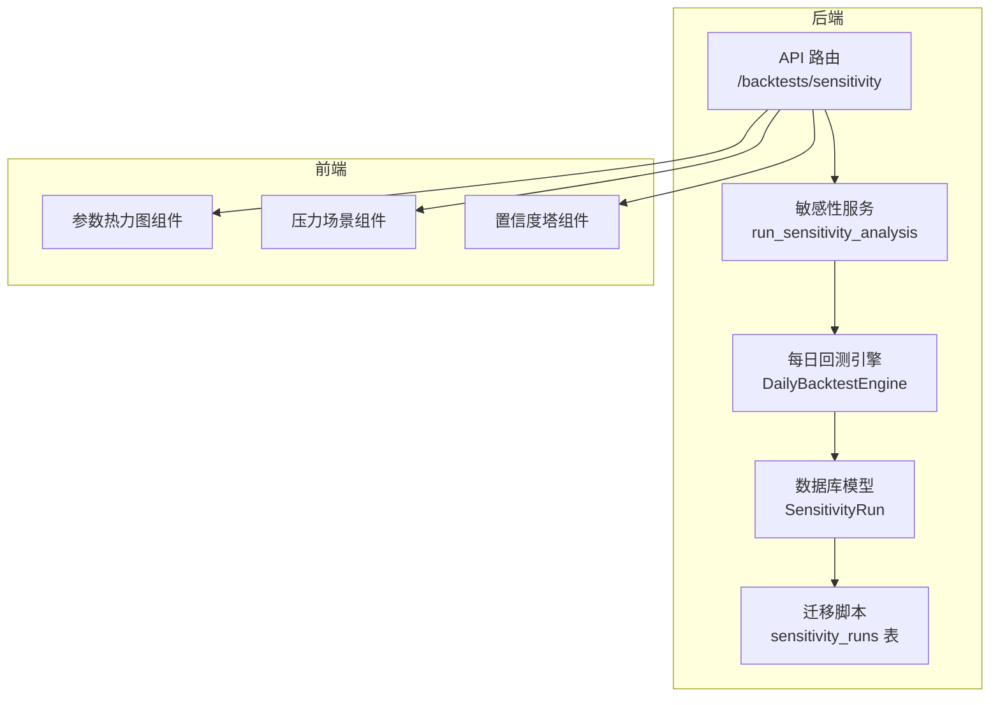
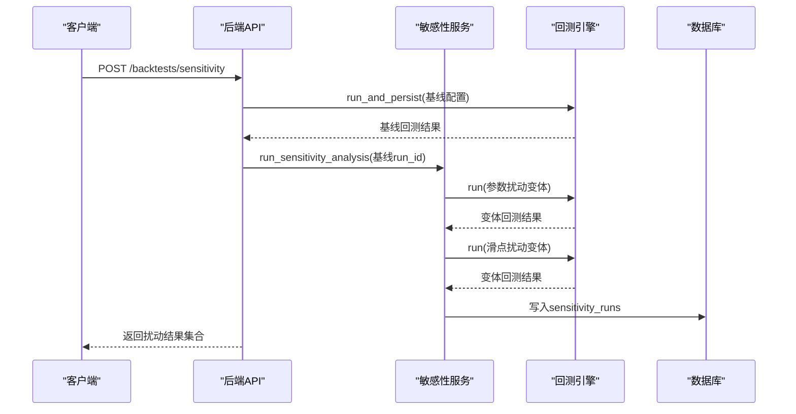
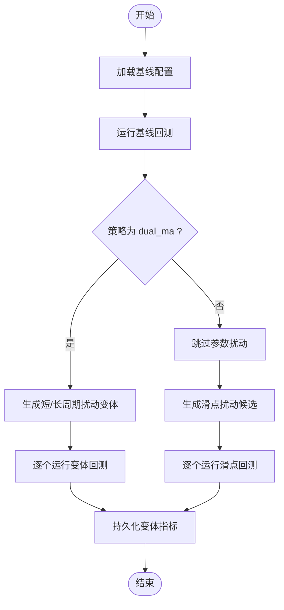
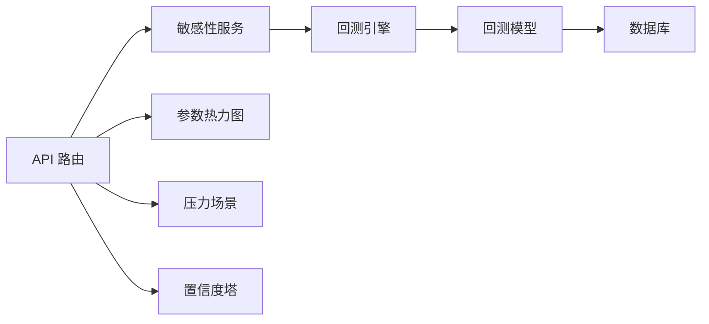

# 敏感性分析服务

<cite>
**本文档引用的文件**
- [backend/app/services/sensitivity.py](file://backend/app/services/sensitivity.py)
- [backend/app/services/daily_backtest.py](file://backend/app/services/daily_backtest.py)
- [backend/app/domains/backtest/models.py](file://backend/app/domains/backtest/models.py)
- [backend/app/db/migrations/versions/a00a9a166a85_sensitivity_runs.py](file://backend/app/db/migrations/versions/a00a9a166a85_sensitivity_runs.py)
- [backend/app/api/v1/backtests.py](file://backend/app/api/v1/backtests.py)
- [backend/app/domains/backtest/schemas.py](file://backend/app/domains/backtest/schemas.py)
- [backend/tests/services/test_sensitivity.py](file://backend/tests/services/test_sensitivity.py)
- [frontend/src/screens/Backtest/ParameterHeatmap.tsx](file://frontend/src/screens/Backtest/ParameterHeatmap.tsx)
- [frontend/src/screens/Backtest/StressScenarios.tsx](file://frontend/src/screens/Backtest/StressScenarios.tsx)
- [frontend/src/screens/Backtest/ConfidenceTower.tsx](file://frontend/src/screens/Backtest/ConfidenceTower.tsx)
</cite>

## 目录
1. [简介](#简介)
2. [项目结构](#项目结构)
3. [核心组件](#核心组件)
4. [架构总览](#架构总览)
5. [详细组件分析](#详细组件分析)
6. [依赖分析](#依赖分析)
7. [性能考虑](#性能考虑)
8. [故障排查指南](#故障排查指南)
9. [结论](#结论)
10. [附录](#附录)

## 简介
本指南围绕“敏感性分析服务”展开，系统性阐述参数敏感性分析、风险因子评估与稳健性检验在本项目中的实现机制与使用方式。内容涵盖：
- 多参数扰动与滑点扰动的算法逻辑
- 蒙特卡洛模拟与压力测试的扩展思路
- 敏感性指标计算、统计显著性检验与结果可视化
- 配置项、性能优化与大规模计算的实现方案
- 结果解读、风险预警与决策支持的实用工具

## 项目结构
敏感性分析服务位于后端服务层，围绕“每日回测引擎”进行参数与成本扰动，产出可持久化的敏感性运行记录，并通过API对外提供查询与报告聚合。

**图表来源**
- [backend/app/api/v1/backtests.py:459-500](file://backend/app/api/v1/backtests.py#L459-L500)
- [backend/app/services/sensitivity.py:60-139](file://backend/app/services/sensitivity.py#L60-L139)
- [backend/app/services/daily_backtest.py:185-284](file://backend/app/services/daily_backtest.py#L185-L284)
- [backend/app/domains/backtest/models.py:71-93](file://backend/app/domains/backtest/models.py#L71-L93)
- [backend/app/db/migrations/versions/a00a9a166a85_sensitivity_runs.py:33-51](file://backend/app/db/migrations/versions/a00a9a166a85_sensitivity_runs.py#L33-L51)
- [frontend/src/screens/Backtest/ParameterHeatmap.tsx:1-88](file://frontend/src/screens/Backtest/ParameterHeatmap.tsx#L1-L88)
- [frontend/src/screens/Backtest/StressScenarios.tsx:1-65](file://frontend/src/screens/Backtest/StressScenarios.tsx#L1-L65)
- [frontend/src/screens/Backtest/ConfidenceTower.tsx:1-60](file://frontend/src/screens/Backtest/ConfidenceTower.tsx#L1-L60)

**章节来源**
- [backend/app/api/v1/backtests.py:459-500](file://backend/app/api/v1/backtests.py#L459-L500)
- [backend/app/services/sensitivity.py:1-139](file://backend/app/services/sensitivity.py#L1-L139)
- [backend/app/services/daily_backtest.py:185-284](file://backend/app/services/daily_backtest.py#L185-L284)
- [backend/app/domains/backtest/models.py:71-93](file://backend/app/domains/backtest/models.py#L71-L93)
- [backend/app/db/migrations/versions/a00a9a166a85_sensitivity_runs.py:33-51](file://backend/app/db/migrations/versions/a00a9a166a85_sensitivity_runs.py#L33-L51)
- [frontend/src/screens/Backtest/ParameterHeatmap.tsx:1-88](file://frontend/src/screens/Backtest/ParameterHeatmap.tsx#L1-L88)
- [frontend/src/screens/Backtest/StressScenarios.tsx:1-65](file://frontend/src/screens/Backtest/StressScenarios.tsx#L1-L65)
- [frontend/src/screens/Backtest/ConfidenceTower.tsx:1-60](file://frontend/src/screens/Backtest/ConfidenceTower.tsx#L1-L60)

## 核心组件
- 敏感性服务 run_sensitivity_analysis
  - 功能：在已有基线回测的基础上，执行参数扰动与滑点扰动，收集并持久化每种变体的指标。
  - 关键点：仅针对“dual_ma”策略执行参数扰动；滑点扰动按候选集执行；异常容忍，保证基线与扰动均可入库。
- 每日回测引擎 DailyBacktestEngine
  - 功能：加载日级行情、驱动策略、执行交易仿真、计算指标、持久化等。
  - 关键点：支持成本配置（佣金、印花税、滑点）、分段指标（IS/OOS）、走子分析等。
- 数据模型与迁移
  - 敏感性运行记录表 sensitivity_runs：存储每次扰动的指标与元信息。
  - 迁移脚本：定义字段、索引与约束，确保查询与聚合效率。
- API 路由
  - 提供“创建敏感性分析任务”的接口，返回扰动结果集合，便于前端可视化与报告生成。

**章节来源**
- [backend/app/services/sensitivity.py:60-139](file://backend/app/services/sensitivity.py#L60-L139)
- [backend/app/services/daily_backtest.py:185-284](file://backend/app/services/daily_backtest.py#L185-L284)
- [backend/app/domains/backtest/models.py:71-93](file://backend/app/domains/backtest/models.py#L71-L93)
- [backend/app/db/migrations/versions/a00a9a166a85_sensitivity_runs.py:33-51](file://backend/app/db/migrations/versions/a00a9a166a85_sensitivity_runs.py#L33-L51)
- [backend/app/api/v1/backtests.py:459-500](file://backend/app/api/v1/backtests.py#L459-L500)

## 架构总览
敏感性分析以“基线回测 + 小规模扰动”为核心，保持API同步响应能力。整体流程如下：

**图表来源**
- [backend/app/api/v1/backtests.py:459-500](file://backend/app/api/v1/backtests.py#L459-L500)
- [backend/app/services/sensitivity.py:60-139](file://backend/app/services/sensitivity.py#L60-L139)
- [backend/app/services/daily_backtest.py:285-372](file://backend/app/services/daily_backtest.py#L285-L372)
- [backend/app/domains/backtest/models.py:71-93](file://backend/app/domains/backtest/models.py#L71-L93)

## 详细组件分析

### 参数敏感性分析（dual_ma）
- 扰动策略
  - 短周期与长周期窗口的±步长扰动，过滤无效组合（短≥长），生成标签化的变体参数集。
- 实现要点
  - 使用替换后的配置调用引擎，捕获异常以保证鲁棒性。
  - 记录变体参数字典与指标，统一写入数据库。
- 指标使用
  - 累计收益、年化收益、最大回撤、夏普比率、胜率、换手率等。

**图表来源**
- [backend/app/services/sensitivity.py:34-51](file://backend/app/services/sensitivity.py#L34-L51)
- [backend/app/services/sensitivity.py:85-119](file://backend/app/services/sensitivity.py#L85-L119)
- [backend/app/services/daily_backtest.py:191-283](file://backend/app/services/daily_backtest.py#L191-L283)

**章节来源**
- [backend/app/services/sensitivity.py:34-51](file://backend/app/services/sensitivity.py#L34-L51)
- [backend/app/services/sensitivity.py:85-119](file://backend/app/services/sensitivity.py#L85-L119)
- [backend/app/services/daily_backtest.py:191-283](file://backend/app/services/daily_backtest.py#L191-L283)

### 滑点敏感性分析
- 扰动策略
  - 在基线滑点基础上，构造候选滑点集（包含基线自身），避免重复写入。
- 实现要点
  - 通过成本配置替换执行回测，记录每次扰动的指标。
- 指标使用
  - 同上，便于对比滑点变化对收益与风险的影响。

**章节来源**
- [backend/app/services/sensitivity.py:54-57](file://backend/app/services/sensitivity.py#L54-L57)
- [backend/app/services/sensitivity.py:98-119](file://backend/app/services/sensitivity.py#L98-L119)
- [backend/app/services/daily_backtest.py:33-53](file://backend/app/services/daily_backtest.py#L33-L53)

### 指标计算与统计显著性
- 指标计算
  - 累计收益、年化收益、最大回撤、夏普比率、胜率、换手率、Calmar比率、Sortino比率、波动率、利润因子等。
- 显著性检验（建议实现）
  - 对于参数扰动，可采用非参数检验（如置换检验）评估指标差异是否显著。
  - 对于滑点扰动，可比较扰动前后指标的置信区间重叠情况。
- 本仓库现状
  - 指标计算已完备；显著性检验尚未内置实现，可在上层服务或报告阶段补充。

**章节来源**
- [backend/app/services/daily_backtest.py:97-110](file://backend/app/services/daily_backtest.py#L97-L110)
- [backend/app/services/daily_backtest.py:702-799](file://backend/app/services/daily_backtest.py#L702-L799)

### 蒙特卡洛模拟与压力测试（扩展建议）
- 蒙特卡洛模拟
  - 基于历史收益率分布或残差分布，生成路径集合，评估收益分布与尾部风险。
- 压力测试
  - 定义极端场景（如2015股灾、2018熊市、疫情等），注入冲击因子（如流动性枯竭、波动率跳跃），评估组合损失与最大回撤。
- 与现有模块的衔接
  - 压力测试结果可映射到风险域模型（如 VaR、熔断器、风险事件）并联动前端“压力场景”组件。

[本节为概念性扩展，不直接对应具体源码文件]

### 结果可视化与解读
- 参数热力图
  - 以夏普比率等指标为颜色强度，标注最佳参数组合，辅助参数选择与稳健性判断。
- 压力场景
  - 展示不同严重程度下的组合损失、最大回撤与建议措施，支持风险预警与处置提示。
- 置信度塔
  - 综合数据质量、稳定性、滑点抗压等维度，输出综合置信评分，辅助决策。

**章节来源**
- [frontend/src/screens/Backtest/ParameterHeatmap.tsx:1-88](file://frontend/src/screens/Backtest/ParameterHeatmap.tsx#L1-L88)
- [frontend/src/screens/Backtest/StressScenarios.tsx:1-65](file://frontend/src/screens/Backtest/StressScenarios.tsx#L1-L65)
- [frontend/src/screens/Backtest/ConfidenceTower.tsx:1-60](file://frontend/src/screens/Backtest/ConfidenceTower.tsx#L1-L60)
- [backend/app/api/v1/backtests.py:104-154](file://backend/app/api/v1/backtests.py#L104-L154)

### 风险预警与决策支持
- 风险规则与熔断器
  - 可将敏感性分析中的关键阈值（如最大回撤、夏普比率骤降、滑点敏感性恶化）映射为风险规则，触发熔断器或告警。
- 决策流
  - 基于敏感性结果与风险规则，形成自动/半自动的处置建议（如减仓、暂停开仓、调整滑点假设）。

[本节为概念性扩展，不直接对应具体源码文件]

## 依赖分析
- 组件耦合
  - 敏感性服务依赖回测引擎与数据库模型；API路由负责编排与结果封装。
- 外部依赖
  - 前端组件通过上下文消费后端提供的数据结构（如参数热力图、压力场景、置信度塔）。
- 潜在循环依赖
  - 当前模块间为单向依赖，无明显循环。

**图表来源**
- [backend/app/api/v1/backtests.py:459-500](file://backend/app/api/v1/backtests.py#L459-L500)
- [backend/app/services/sensitivity.py:60-139](file://backend/app/services/sensitivity.py#L60-L139)
- [backend/app/services/daily_backtest.py:185-284](file://backend/app/services/daily_backtest.py#L185-L284)
- [backend/app/domains/backtest/models.py:71-93](file://backend/app/domains/backtest/models.py#L71-L93)
- [frontend/src/screens/Backtest/ParameterHeatmap.tsx:1-88](file://frontend/src/screens/Backtest/ParameterHeatmap.tsx#L1-L88)
- [frontend/src/screens/Backtest/StressScenarios.tsx:1-65](file://frontend/src/screens/Backtest/StressScenarios.tsx#L1-L65)
- [frontend/src/screens/Backtest/ConfidenceTower.tsx:1-60](file://frontend/src/screens/Backtest/ConfidenceTower.tsx#L1-L60)

**章节来源**
- [backend/app/api/v1/backtests.py:459-500](file://backend/app/api/v1/backtests.py#L459-L500)
- [backend/app/services/sensitivity.py:60-139](file://backend/app/services/sensitivity.py#L60-L139)
- [backend/app/services/daily_backtest.py:185-284](file://backend/app/services/daily_backtest.py#L185-L284)
- [backend/app/domains/backtest/models.py:71-93](file://backend/app/domains/backtest/models.py#L71-L93)
- [frontend/src/screens/Backtest/ParameterHeatmap.tsx:1-88](file://frontend/src/screens/Backtest/ParameterHeatmap.tsx#L1-L88)
- [frontend/src/screens/Backtest/StressScenarios.tsx:1-65](file://frontend/src/screens/Backtest/StressScenarios.tsx#L1-L65)
- [frontend/src/screens/Backtest/ConfidenceTower.tsx:1-60](file://frontend/src/screens/Backtest/ConfidenceTower.tsx#L1-L60)

## 性能考虑
- 并发与批处理
  - 当前实现为小规模扰动（≤~10次），保持同步API；若扩展为大规模扰动，建议引入异步任务队列与批处理。
- 数据访问
  - 利用索引（parent_run_id、kind）加速查询；批量写入减少事务开销。
- 指标计算
  - 对日度序列的滚动指标可缓存中间结果；避免重复计算。
- 前端渲染
  - 热力图与折线图仅渲染必要数据，避免全量传输。

[本节提供通用指导，不直接分析具体文件]

## 故障排查指南
- 常见问题
  - 基线回测失败：检查日期范围、资金与参数合法性。
  - 行情缺失：确认目标标的在指定日期范围内存在K线数据。
  - 扰动异常：服务层已捕获异常并继续执行其他扰动，但需关注日志与结果完整性。
- 单元测试参考
  - 测试覆盖了基线写入、参数扰动与滑点扰动的组合，验证记录条数与种类。

**章节来源**
- [backend/tests/services/test_sensitivity.py:58-86](file://backend/tests/services/test_sensitivity.py#L58-L86)
- [backend/app/services/sensitivity.py:88-91](file://backend/app/services/sensitivity.py#L88-L91)
- [backend/app/services/sensitivity.py:107-110](file://backend/app/services/sensitivity.py#L107-L110)

## 结论
本敏感性分析服务以“基线 + 小扰动”的轻量策略，实现了参数与滑点扰动的快速评估与持久化，配合前端可视化组件，能够有效支撑策略稳健性检验与风险预警。后续可在显著性检验、蒙特卡洛与压力测试方面进一步扩展，以满足更复杂的实证与风控需求。

## 附录

### API 定义（摘要）
- 创建敏感性分析任务
  - 方法：POST /backtests/sensitivity
  - 请求体：包含标的、时间窗、策略名、初始资金、策略参数、成本配置
  - 响应体：包含任务ID、回测ID与各扰动变体的指标集合

**章节来源**
- [backend/app/api/v1/backtests.py:459-500](file://backend/app/api/v1/backtests.py#L459-L500)
- [backend/app/domains/backtest/schemas.py:295-313](file://backend/app/domains/backtest/schemas.py#L295-L313)

### 数据模型（摘要）
- 敏感性运行记录表（sensitivity_runs）
  - 字段：父运行ID、扰动类型(kind)、标签、变体JSON、是否基线、各类指标
  - 索引：parent_run_id、kind

**章节来源**
- [backend/app/domains/backtest/models.py:71-93](file://backend/app/domains/backtest/models.py#L71-L93)
- [backend/app/db/migrations/versions/a00a9a166a85_sensitivity_runs.py:33-51](file://backend/app/db/migrations/versions/a00a9a166a85_sensitivity_runs.py#L33-L51)