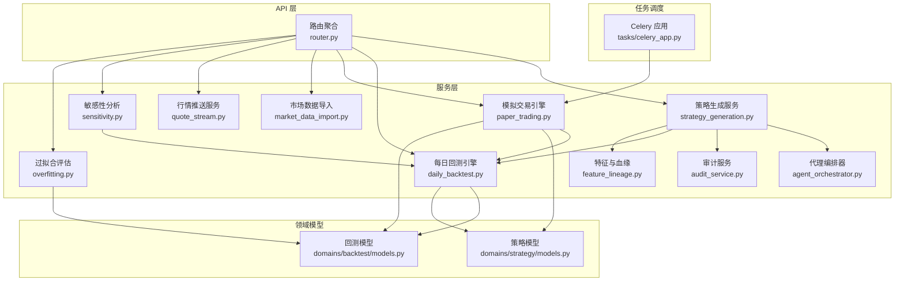
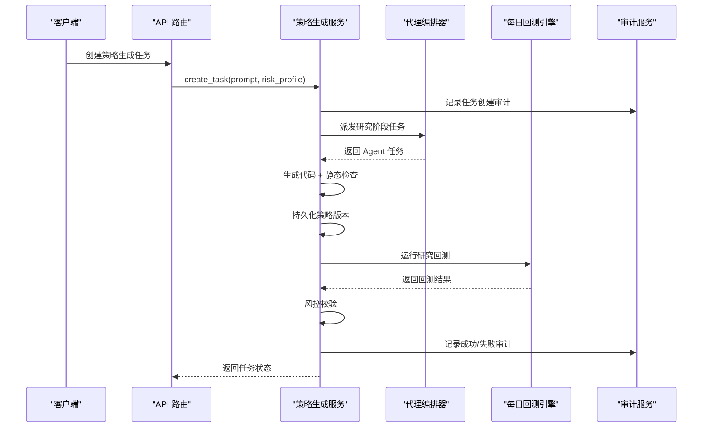
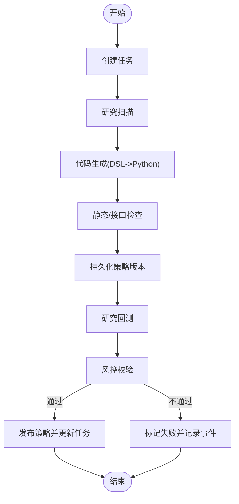
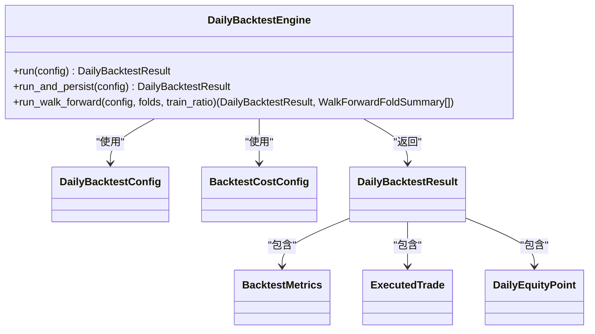
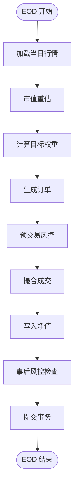
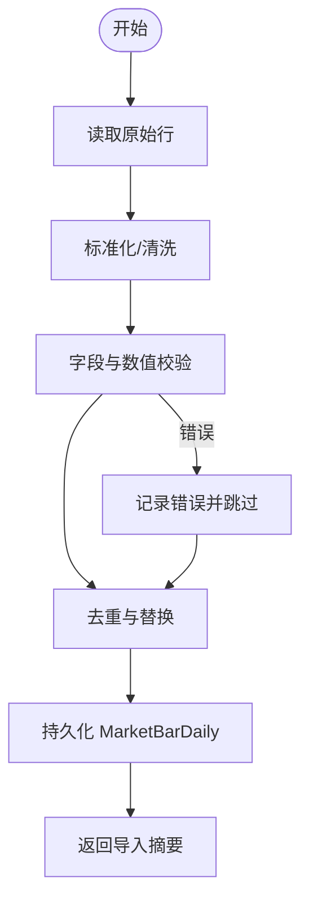
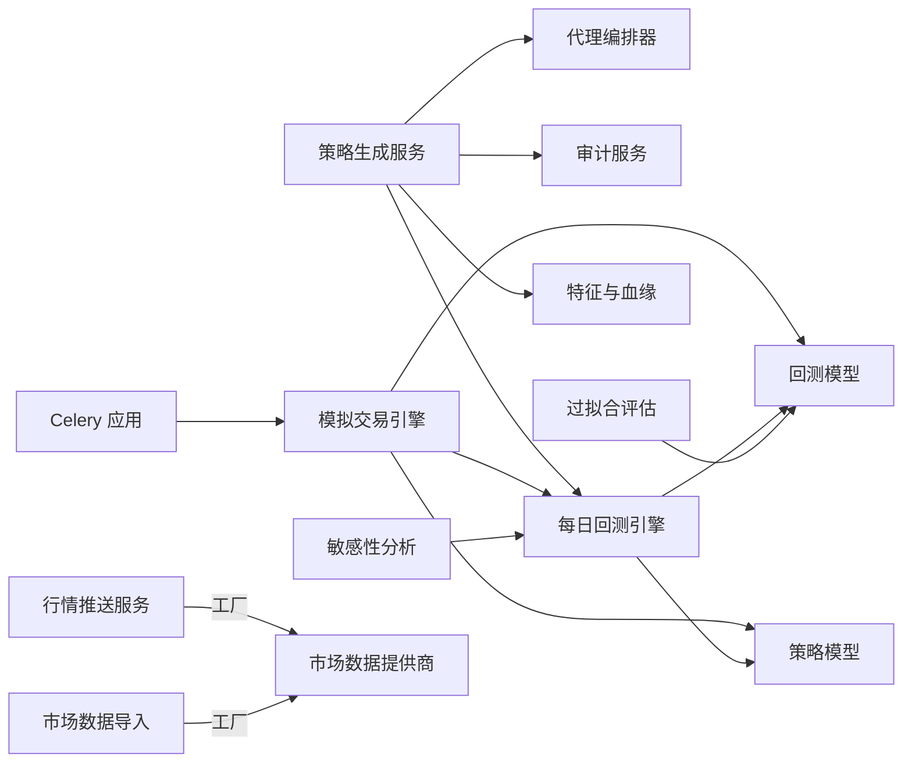

# 服务层开发

<cite>
**本文档引用的文件**
- [backend/app/services/__init__.py](file://backend/app/services/__init__.py)
- [backend/app/services/strategy_generation.py](file://backend/app/services/strategy_generation.py)
- [backend/app/services/daily_backtest.py](file://backend/app/services/daily_backtest.py)
- [backend/app/services/paper_trading.py](file://backend/app/services/paper_trading.py)
- [backend/app/services/market_data_import.py](file://backend/app/services/market_data_import.py)
- [backend/app/services/agent_orchestrator.py](file://backend/app/services/agent_orchestrator.py)
- [backend/app/services/audit_service.py](file://backend/app/services/audit_service.py)
- [backend/app/services/quote_stream.py](file://backend/app/services/quote_stream.py)
- [backend/app/services/feature_lineage.py](file://backend/app/services/feature_lineage.py)
- [backend/app/services/sensitivity.py](file://backend/app/services/sensitivity.py)
- [backend/app/services/overfitting.py](file://backend/app/services/overfitting.py)
- [backend/app/domains/strategy/models.py](file://backend/app/domains/strategy/models.py)
- [backend/app/domains/backtest/models.py](file://backend/app/domains/backtest/models.py)
- [backend/app/api/v1/router.py](file://backend/app/api/v1/router.py)
- [backend/app/tasks/celery_app.py](file://backend/app/tasks/celery_app.py)
- [backend/tests/services/test_daily_backtest.py](file://backend/tests/services/test_daily_backtest.py)
</cite>

## 目录
1. [引言](#引言)
2. [项目结构](#项目结构)
3. [核心组件](#核心组件)
4. [架构总览](#架构总览)
5. [详细组件分析](#详细组件分析)
6. [依赖关系分析](#依赖关系分析)
7. [性能考虑](#性能考虑)
8. [故障排查指南](#故障排查指南)
9. [结论](#结论)
10. [附录](#附录)

## 引言
本指南面向 llmine-quant 后端服务层开发者，系统性阐述业务逻辑封装、服务接口设计与事务管理机制。文档聚焦以下核心服务模块：策略生成服务、每日回测服务、模拟交易服务、市场数据导入服务，并深入解释服务间依赖关系、异步处理与错误处理策略。同时提供服务开发示例、性能优化建议与测试策略，帮助构建高质量、可维护的服务层代码。

## 项目结构
服务层位于 backend/app/services，围绕“每个服务持有一个 AsyncSession 并在请求范围内实例化”的原则组织，确保事务边界清晰、避免重复提交。服务通过领域模型（domains）与数据库交互，通过 API 路由暴露能力，并通过任务调度器（Celery）支持后台周期性任务。

图表来源
- [backend/app/api/v1/router.py:1-40](file://backend/app/api/v1/router.py#L1-L40)
- [backend/app/services/__init__.py:1-18](file://backend/app/services/__init__.py#L1-L18)
- [backend/app/services/strategy_generation.py:1-584](file://backend/app/services/strategy_generation.py#L1-L584)
- [backend/app/services/daily_backtest.py:1-899](file://backend/app/services/daily_backtest.py#L1-L899)
- [backend/app/services/paper_trading.py:1-634](file://backend/app/services/paper_trading.py#L1-L634)
- [backend/app/services/market_data_import.py:1-426](file://backend/app/services/market_data_import.py#L1-L426)
- [backend/app/services/agent_orchestrator.py:1-105](file://backend/app/services/agent_orchestrator.py#L1-L105)
- [backend/app/services/audit_service.py:1-109](file://backend/app/services/audit_service.py#L1-L109)
- [backend/app/services/quote_stream.py:1-152](file://backend/app/services/quote_stream.py#L1-L152)
- [backend/app/services/feature_lineage.py:1-217](file://backend/app/services/feature_lineage.py#L1-L217)
- [backend/app/services/sensitivity.py:1-139](file://backend/app/services/sensitivity.py#L1-L139)
- [backend/app/services/overfitting.py:1-168](file://backend/app/services/overfitting.py#L1-L168)
- [backend/app/domains/strategy/models.py:1-84](file://backend/app/domains/strategy/models.py#L1-L84)
- [backend/app/domains/backtest/models.py:1-155](file://backend/app/domains/backtest/models.py#L1-L155)
- [backend/app/tasks/celery_app.py:1-42](file://backend/app/tasks/celery_app.py#L1-L42)

章节来源
- [backend/app/services/__init__.py:1-18](file://backend/app/services/__init__.py#L1-L18)
- [backend/app/api/v1/router.py:1-40](file://backend/app/api/v1/router.py#L1-L40)

## 核心组件
- 策略生成服务：负责从自然语言到代码再到回测的完整流水线编排，包含研究扫描、代码生成、静态检查、版本持久化、研究回测、风险校验与发布。
- 每日回测引擎：基于日级行情进行策略回测，计算核心指标，支持 IS/OOS 分割、走查分析与敏感性分析。
- 模拟交易引擎：按日执行模拟下单、风控预检查、撮合成交与净值记录，支持 A 股特殊规则。
- 市场数据导入：支持本地 CSV 与 AKShare 数据源，标准化清洗并去重替换入库。
- 代理编排器：统一派发 Agent 任务与消息，串联策略流水线各阶段。
- 审计服务：不可篡改的审计链，支持哈希链验证。
- 行情推送服务：后台轮询订阅标的行情并广播至 WebSocket。
- 特征与血缘：将策略使用的特征写入特征集并建立从原始行情到策略运行的血缘链。
- 敏感性分析：对参数与滑点进行小范围扰动评估。
- 过拟合评估：基于 IS/OOS、走查连续性与参数稳定性综合评分。

章节来源
- [backend/app/services/strategy_generation.py:86-584](file://backend/app/services/strategy_generation.py#L86-L584)
- [backend/app/services/daily_backtest.py:185-899](file://backend/app/services/daily_backtest.py#L185-L899)
- [backend/app/services/paper_trading.py:76-634](file://backend/app/services/paper_trading.py#L76-L634)
- [backend/app/services/market_data_import.py:177-426](file://backend/app/services/market_data_import.py#L177-L426)
- [backend/app/services/agent_orchestrator.py:15-105](file://backend/app/services/agent_orchestrator.py#L15-L105)
- [backend/app/services/audit_service.py:32-109](file://backend/app/services/audit_service.py#L32-L109)
- [backend/app/services/quote_stream.py:62-152](file://backend/app/services/quote_stream.py#L62-L152)
- [backend/app/services/feature_lineage.py:41-217](file://backend/app/services/feature_lineage.py#L41-L217)
- [backend/app/services/sensitivity.py:60-139](file://backend/app/services/sensitivity.py#L60-L139)
- [backend/app/services/overfitting.py:129-168](file://backend/app/services/overfitting.py#L129-L168)

## 架构总览
服务层采用“职责单一 + 明确事务边界”的设计，所有服务均以 AsyncSession 注入，保证每个请求内的操作在一个事务上下文中完成。服务之间通过领域模型与事件/消息解耦，通过代理编排器与审计服务贯穿全链路。

图表来源
- [backend/app/services/strategy_generation.py:96-373](file://backend/app/services/strategy_generation.py#L96-L373)
- [backend/app/services/agent_orchestrator.py:31-60](file://backend/app/services/agent_orchestrator.py#L31-L60)
- [backend/app/services/daily_backtest.py:285-371](file://backend/app/services/daily_backtest.py#L285-L371)
- [backend/app/services/audit_service.py:38-81](file://backend/app/services/audit_service.py#L38-L81)

## 详细组件分析

### 策略生成服务
- 公共接口
  - create_task：创建排队中的策略任务，写入追踪 ID 与创建者信息。
  - run_pipeline：端到端执行流水线，包含研究、代码生成、静态检查、版本持久化、研究回测、风险校验与发布。
- 关键流程
  - 研究阶段：通过代理编排器派发研究任务，记录阶段事件。
  - 代码生成：先生成 DSL 规范，再生成 Python 策略类；随后进行语义与 AST 校验。
  - 版本持久化：将代码快照与参数模式写入策略版本表。
  - 研究回测：使用内置双均线代理策略在默认研究区间运行回测，提取指标用于风控。
  - 风控校验：根据风险画像设定最大回撤与夏普阈值。
  - 发布：更新策略元数据与任务结果，记录完成事件与审计。
- 错误处理
  - 将异常映射为失败阶段（如静态检查、代码生成、回测、风险、流水线），写入流水线事件并回滚未提交的变更。
- 事务管理
  - 在每个阶段提交一次，确保中间状态可见；最终一次性提交或回滚。

图表来源
- [backend/app/services/strategy_generation.py:132-373](file://backend/app/services/strategy_generation.py#L132-L373)

章节来源
- [backend/app/services/strategy_generation.py:96-373](file://backend/app/services/strategy_generation.py#L96-L373)

### 每日回测服务
- 功能要点
  - 支持按日回测循环，计算组合价值、头寸快照与交易明细。
  - 核心指标：累计收益、年化收益、最大回撤、夏普比率、胜率、换手率等。
  - IS/OOS 分割与走查分析：支持将回测曲线切分为多折，分别计算训练/测试指标。
  - 敏感性分析：对参数与滑点进行小扰动评估。
- 数据结构
  - 配置类、成本配置、交易与净值点、指标类、走查汇总等。
- 事务管理
  - run_and_persist 将任务、运行、指标与净值点一次性持久化，失败时回滚并标记状态。

图表来源
- [backend/app/services/daily_backtest.py:185-452](file://backend/app/services/daily_backtest.py#L185-L452)
- [backend/app/services/daily_backtest.py:148-183](file://backend/app/services/daily_backtest.py#L148-L183)
- [backend/app/services/daily_backtest.py:125-146](file://backend/app/services/daily_backtest.py#L125-L146)

章节来源
- [backend/app/services/daily_backtest.py:185-452](file://backend/app/services/daily_backtest.py#L185-L452)

### 模拟交易服务
- 生命周期
  - 每日 EOD：标记市值、信号重算、预交易风控、撮合成交、净值记录与事后风控检查。
  - 支持账户级成本配置与 A 股特殊规则（涨跌停、ST、印花税等）。
- 关键步骤
  - 市值重估与组合价值计算。
  - 使用内置策略代理（双均线）计算目标权重并生成订单。
  - 预交易检查：单只上限、现金保留、当日亏损与最大回撤阈值。
  - 成交撮合：按滑点、佣金与印花税模型执行，更新头寸与现金。
  - 净值写入与事后风控告警。
- 事务管理
  - 保证每日处理幂等（同日跳过），最终一次性提交。

图表来源
- [backend/app/services/paper_trading.py:82-134](file://backend/app/services/paper_trading.py#L82-L134)
- [backend/app/services/paper_trading.py:374-498](file://backend/app/services/paper_trading.py#L374-L498)

章节来源
- [backend/app/services/paper_trading.py:76-634](file://backend/app/services/paper_trading.py#L76-L634)

### 市场数据导入服务
- 支持来源
  - 本地 CSV：UTF-8-BOM 自动识别，列名别名映射，缺失字段校验。
  - AKShare：可选安装，批量抓取 A 股日线，自动补全符号格式。
- 处理流程
  - 标准化与清洗：数值类型转换、日期规范化、布尔值映射、涨跌停与 ST 标记。
  - 去重与替换：按 symbol+trade_date 去重，旧记录替换。
  - 写入数据库并返回导入摘要。
- 错误处理
  - 对每行错误记录，不影响整体导入流程；缺失必要字段直接抛出异常。

图表来源
- [backend/app/services/market_data_import.py:185-241](file://backend/app/services/market_data_import.py#L185-L241)
- [backend/app/services/market_data_import.py:292-323](file://backend/app/services/market_data_import.py#L292-L323)

章节来源
- [backend/app/services/market_data_import.py:177-426](file://backend/app/services/market_data_import.py#L177-L426)

### 代理编排器与审计服务
- 代理编排器
  - 统一派发 Agent 任务与消息，支持相关性 ID 与追踪 ID。
- 审计服务
  - 追加式审计链，SHA-256 哈希链校验，支持链验证。

章节来源
- [backend/app/services/agent_orchestrator.py:15-105](file://backend/app/services/agent_orchestrator.py#L15-L105)
- [backend/app/services/audit_service.py:32-109](file://backend/app/services/audit_service.py#L32-L109)

### 行情推送服务
- 单例后台服务，仅对已订阅的标的发起轮询，交易时段短间隔、非交易时段长间隔，命中变更即广播。

章节来源
- [backend/app/services/quote_stream.py:62-152](file://backend/app/services/quote_stream.py#L62-L152)

### 特征与血缘
- 将策略 DSL 中的因子写入特征集，记录使用关系并建立从原始行情到策略运行的血缘链。

章节来源
- [backend/app/services/feature_lineage.py:41-194](file://backend/app/services/feature_lineage.py#L41-L194)

### 敏感性分析与过拟合评估
- 敏感性分析：对参数与滑点进行小扰动，记录指标差异。
- 过拟合评估：基于 IS/OOS、走查连续性与参数稳定性综合评分并分级。

章节来源
- [backend/app/services/sensitivity.py:60-139](file://backend/app/services/sensitivity.py#L60-L139)
- [backend/app/services/overfitting.py:129-168](file://backend/app/services/overfitting.py#L129-L168)

## 依赖关系分析
- 服务内聚与耦合
  - 策略生成服务高内聚地封装流水线，依赖代理编排器、审计服务、每日回测引擎与特征血缘。
  - 回测服务独立于策略实现，仅依赖领域模型与成本配置。
  - 模拟交易服务依赖回测成本配置与策略代理，同时与账户与头寸模型强关联。
  - 市场数据导入服务与外部数据源解耦，内部通过标准化流程与领域模型对接。
- 外部集成
  - LLM 提供商：策略生成服务通过工厂获取 LLM 提供商。
  - 市场数据提供商：行情推送服务与数据导入服务通过工厂获取具体实现。
  - 任务调度：Celery 应用注册模拟交易任务，定时触发 EOD 批处理。

图表来源
- [backend/app/services/strategy_generation.py:39-56](file://backend/app/services/strategy_generation.py#L39-L56)
- [backend/app/services/paper_trading.py:49-51](file://backend/app/services/paper_trading.py#L49-L51)
- [backend/app/services/quote_stream.py:34-35](file://backend/app/services/quote_stream.py#L34-L35)
- [backend/app/services/market_data_import.py:122-123](file://backend/app/services/market_data_import.py#L122-L123)
- [backend/app/tasks/celery_app.py:19-41](file://backend/app/tasks/celery_app.py#L19-L41)

章节来源
- [backend/app/services/strategy_generation.py:39-56](file://backend/app/services/strategy_generation.py#L39-L56)
- [backend/app/services/paper_trading.py:49-51](file://backend/app/services/paper_trading.py#L49-L51)
- [backend/app/services/quote_stream.py:34-35](file://backend/app/services/quote_stream.py#L34-L35)
- [backend/app/services/market_data_import.py:122-123](file://backend/app/services/market_data_import.py#L122-L123)
- [backend/app/tasks/celery_app.py:19-41](file://backend/app/tasks/celery_app.py#L19-L41)

## 性能考虑
- 回测性能
  - 使用分组与缓存减少重复查询，避免全市场扫描；IS/OOS 与走查分析需足够的样本长度。
  - 成本模型参数（佣金、印花税、滑点）应结合实盘经验校准，避免过度拟合。
- 导入性能
  - 导入前先替换旧记录，减少重复写入；CSV 读取使用流式 DictReader，内存友好。
  - 对超大标的集合限制历史窗口长度，避免内存膨胀。
- 模拟交易性能
  - 预交易检查优先于撮合，减少无效成交；按卖后买顺序处理，释放现金优先。
  - A 股特殊规则（涨跌停、ST）提前标注，降低运行期判断开销。
- 服务并发
  - 服务实例与 AsyncSession 绑定，避免跨请求共享会话；合理设置连接池与超时。
  - 异步任务队列（Celery）按任务类型分区，避免阻塞关键路径。

## 故障排查指南
- 回测无数据
  - 现象：抛出“无市场行情”异常。
  - 排查：确认标的与日期范围存在有效行情；检查数据导入是否成功。
- 风控拦截
  - 现象：流水线在风控阶段失败。
  - 排查：核对风险画像阈值与回测指标；调整策略参数或风控规则。
- 代码/DSL 校验失败
  - 现象：静态检查或语义校验抛错。
  - 排查：检查生成的策略类是否符合接口规范；修正 DSL 参数。
- 导入异常
  - 现象：部分行被跳过并记录错误。
  - 排查：检查必填字段、数值合法性与日期格式；修复后重新导入。
- 审计链异常
  - 现象：链验证失败。
  - 排查：检查最近条目哈希是否正确；定位首个断裂项并恢复。

章节来源
- [backend/app/services/daily_backtest.py:29-30](file://backend/app/services/daily_backtest.py#L29-L30)
- [backend/app/services/strategy_generation.py:308-372](file://backend/app/services/strategy_generation.py#L308-L372)
- [backend/app/services/market_data_import.py:21-23](file://backend/app/services/market_data_import.py#L21-L23)
- [backend/app/services/audit_service.py:83-109](file://backend/app/services/audit_service.py#L83-L109)

## 结论
本指南系统梳理了 llmine-quant 服务层的设计与实现，强调“事务边界清晰、职责单一、可观测与可测试”的原则。通过策略生成、回测、模拟交易、数据导入与周边服务的协同，形成从创意到验证再到实盘模拟的闭环。建议在新增服务时遵循现有模式：以 AsyncSession 为中心、通过领域模型解耦、利用代理编排与审计贯穿全链路，并配套完善的测试与监控。

## 附录
- 测试策略
  - 单元测试：针对核心算法（指标计算、撮合、风控）编写独立测试，覆盖边界条件与异常路径。
  - 集成测试：使用内存数据库与真实服务对象，验证端到端流程（如策略生成流水线）。
  - 示例参考：回测服务测试用例展示了如何构造种子行情、断言交易行为与指标结果。

章节来源
- [backend/tests/services/test_daily_backtest.py:1-200](file://backend/tests/services/test_daily_backtest.py#L1-L200)