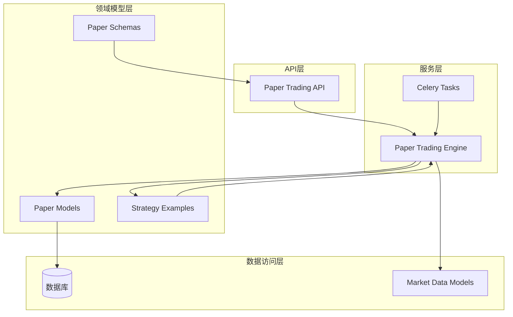
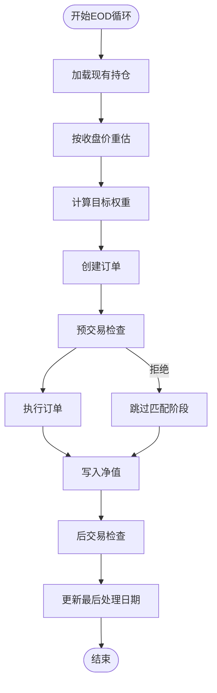
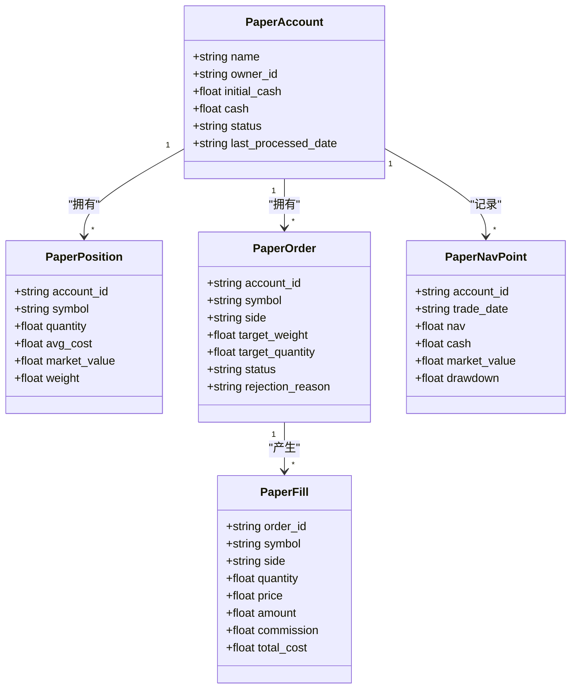
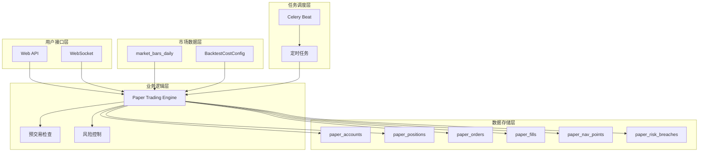
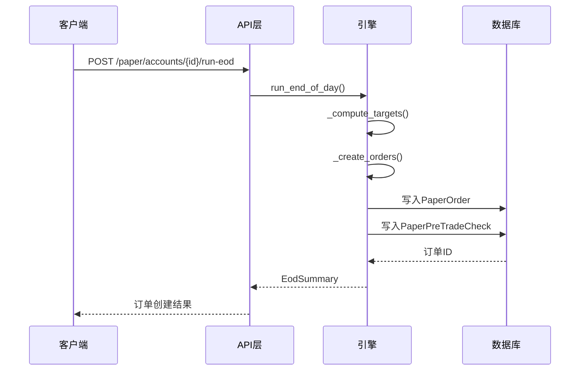
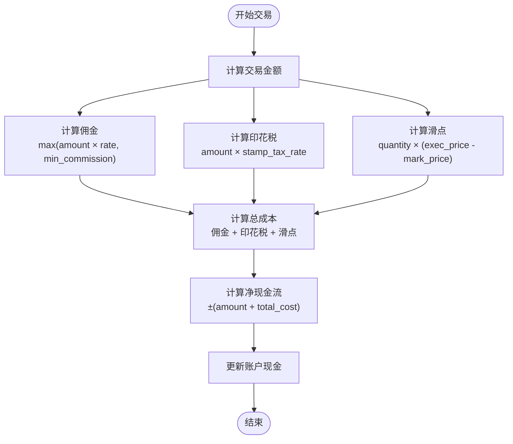
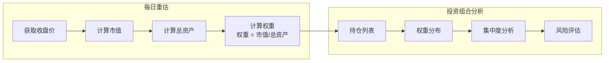
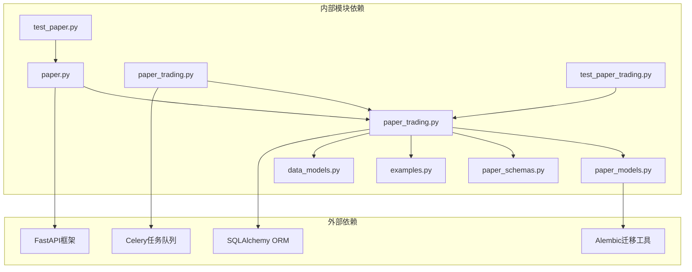

# 模拟交易服务

<cite>
**本文档引用的文件**
- [paper.py](file://backend/app/api/v1/paper.py)
- [paper_trading.py](file://backend/app/services/paper_trading.py)
- [paper_models.py](file://backend/app/domains/execution/paper_models.py)
- [paper_schemas.py](file://backend/app/domains/execution/paper_schemas.py)
- [paper_trading.py](file://backend/app/tasks/paper_trading.py)
- [examples.py](file://backend/app/domains/strategy/examples.py)
- [daily_backtest.py](file://backend/app/services/daily_backtest.py)
- [models.py](file://backend/app/domains/data/models.py)
- [49c0724c647e_paper_trading_tables.py](file://backend/app/db/migrations/versions/49c0724c647e_paper_trading_tables.py)
- [test_paper.py](file://backend/tests/api/test_paper.py)
- [test_paper_trading.py](file://backend/tests/services/test_paper_trading.py)
</cite>

## 目录
1. [简介](#简介)
2. [项目结构](#项目结构)
3. [核心组件](#核心组件)
4. [架构概览](#架构概览)
5. [详细组件分析](#详细组件分析)
6. [依赖关系分析](#依赖关系分析)
7. [性能考虑](#性能考虑)
8. [故障排除指南](#故障排除指南)
9. [结论](#结论)
10. [附录](#附录)

## 简介

模拟交易服务是量化交易系统中的核心组件，为用户提供一个安全、可控的交易环境，允许在不使用真实资金的情况下测试交易策略。该服务实现了完整的交易生命周期管理，包括订单管理、资金管理、持仓跟踪和交易执行，并集成了风险控制和实时监控功能。

模拟交易服务基于A-share市场的特殊规则设计，支持多种内置策略（双移动平均线、动量策略、均值回归策略），并通过成本模型精确模拟真实交易的成本结构，包括佣金、印花税和滑点。

## 项目结构

模拟交易服务采用分层架构设计，主要包含以下核心模块：



**图表来源**
- [paper.py:1-276](file://backend/app/api/v1/paper.py#L1-L276)
- [paper_trading.py:76-135](file://backend/app/services/paper_trading.py#L76-L135)
- [paper_models.py:14-133](file://backend/app/domains/execution/paper_models.py#L14-L133)

**章节来源**
- [paper.py:1-276](file://backend/app/api/v1/paper.py#L1-L276)
- [paper_trading.py:1-634](file://backend/app/services/paper_trading.py#L1-L634)

## 核心组件

### 模拟交易引擎 (PaperTradingEngine)

PaperTradingEngine是模拟交易系统的核心协调器，负责执行完整的日终交易循环。该引擎实现了经典的"标记-信号-预检查-匹配-净值"流程：



**图表来源**
- [paper_trading.py:82-135](file://backend/app/services/paper_trading.py#L82-L135)

### 数据模型体系

模拟交易系统定义了完整的数据模型体系，确保所有交易活动都被准确记录和追踪：



**图表来源**
- [paper_models.py:14-133](file://backend/app/domains/execution/paper_models.py#L14-L133)

**章节来源**
- [paper_trading.py:76-135](file://backend/app/services/paper_trading.py#L76-L135)
- [paper_models.py:14-133](file://backend/app/domains/execution/paper_models.py#L14-L133)

## 架构概览

模拟交易服务采用事件驱动的异步架构，支持手动触发和定时任务两种执行模式：



**图表来源**
- [paper.py:36-276](file://backend/app/api/v1/paper.py#L36-L276)
- [paper_trading.py:76-135](file://backend/app/services/paper_trading.py#L76-L135)
- [paper_trading.py:19-73](file://backend/app/tasks/paper_trading.py#L19-L73)

## 详细组件分析

### 订单管理系统

订单管理系统实现了完整的订单生命周期管理，从创建到执行再到结算的全过程追踪：

#### 订单创建流程



**图表来源**
- [paper_trading.py:268-312](file://backend/app/services/paper_trading.py#L268-L312)
- [paper_trading.py:314-372](file://backend/app/services/paper_trading.py#L314-L372)

#### 预交易检查机制

预交易检查确保所有订单都符合既定的风险控制规则：

| 检查类型 | 规则 | 阈值 | 处理方式 |
|---------|------|------|----------|
| 单只股票限额 | single_name_cap | 10% | 拒绝超限订单 |
| 现金保留 | cash_floor | 1% | 确保最低现金余额 |
| 日损失限制 | daily_loss | -5% | 触发风险警报 |
| 最大回撤 | max_drawdown | -15% | 触发严重风险警报 |

**章节来源**
- [paper_trading.py:314-372](file://backend/app/services/paper_trading.py#L314-L372)
- [paper_trading.py:536-577](file://backend/app/services/paper_trading.py#L536-L577)

### 资金管理系统

资金管理系统精确模拟真实的交易成本结构，确保模拟结果与实际交易行为一致：

#### 成本计算模型



**图表来源**
- [paper_trading.py:374-498](file://backend/app/services/paper_trading.py#L374-L498)
- [daily_backtest.py:34-53](file://backend/app/services/daily_backtest.py#L34-L53)

#### 资产负债表更新

每次交易后，系统自动更新账户的资产负债状况：

**章节来源**
- [paper_trading.py:374-498](file://backend/app/services/paper_trading.py#L374-L498)
- [daily_backtest.py:675-700](file://backend/app/services/daily_backtest.py#L675-L700)

### 持仓跟踪系统

持仓跟踪系统实时监控每个账户的持仓变化，提供精确的投资组合分析：

#### 持仓权重计算



**图表来源**
- [paper_trading.py:179-196](file://backend/app/services/paper_trading.py#L179-L196)

**章节来源**
- [paper_trading.py:179-196](file://backend/app/services/paper_trading.py#L179-L196)

### 风险控制系统

风险控制系统在交易前、交易中和交易后三个阶段提供全面的风险监控：

#### 风险规则矩阵

| 风险类别 | 触发条件 | 严重程度 | 响应措施 |
|---------|----------|----------|----------|
| 单只股票风险 | 单只股票占比 > 10% | 中等 | 拒绝订单 |
| 现金不足风险 | 买入后现金 < 1% | 高 | 拒绝订单 |
| 日损失风险 | 当日净值跌幅 > 5% | 高 | 发出警告 |
| 最大回撤风险 | 回撤幅度 > 15% | 严重 | 暂停交易 |

**章节来源**
- [paper_trading.py:314-372](file://backend/app/services/paper_trading.py#L314-L372)
- [paper_trading.py:536-577](file://backend/app/services/paper_trading.py#L536-L577)

### 实时监控功能

实时监控功能提供多维度的交易状态追踪和性能指标展示：

#### 监控指标体系

| 指标类型 | 计算公式 | 正常范围 | 监控意义 |
|---------|----------|----------|----------|
| 净值(NET) | 现金 + 持仓市值 | > 0 | 账户价值衡量 |
| 日收益率 | NAV今日/昨日 - 1 | 变化 | 收益稳定性 |
| 最大回撤 | 1 - min(净值)/峰值 | ≤ 0 | 风险暴露度 |
| 现金比率 | 现金/净值 | 0-1 | 流动性状况 |
| 持仓集中度 | Σ(单只权重²) | 0-1 | 分散化程度 |

**章节来源**
- [paper_trading.py:500-534](file://backend/app/services/paper_trading.py#L500-L534)

## 依赖关系分析

模拟交易服务的依赖关系清晰明确，遵循分层架构原则：



**图表来源**
- [paper.py:13-34](file://backend/app/api/v1/paper.py#L13-L34)
- [paper_trading.py:29-52](file://backend/app/services/paper_trading.py#L29-L52)

**章节来源**
- [paper.py:13-34](file://backend/app/api/v1/paper.py#L13-L34)
- [paper_trading.py:29-52](file://backend/app/services/paper_trading.py#L29-L52)

## 性能考虑

### 数据库性能优化

模拟交易系统针对高频查询进行了专门的索引优化：

| 表名 | 关键索引 | 查询场景 | 性能收益 |
|------|----------|----------|----------|
| paper_accounts | status, last_processed_date | 账户筛选和批量处理 | 显著提升查询速度 |
| paper_orders | status, trade_date | 订单状态统计 | 支持实时监控 |
| paper_positions | symbol, account_id | 持仓查询 | 快速定位持仓 |
| paper_nav_points | trade_date | 净值序列查询 | 支持历史回溯 |

### 内存管理策略

系统采用渐进式数据加载和缓存策略，避免大规模数据操作时的内存压力：

- **分页查询**：订单和成交记录默认限制返回数量
- **增量处理**：按日期批次处理市场数据
- **对象池**：复用策略运行器实例
- **批量写入**：合并多个数据库操作

### 并发处理能力

系统支持高并发场景下的稳定运行：

- **异步I/O**：数据库操作采用异步模式
- **连接池**：数据库连接复用和管理
- **任务队列**：Celery分布式任务处理
- **锁机制**：防止重复处理同一日期的数据

## 故障排除指南

### 常见问题诊断

#### 1. 订单被意外拒绝

**症状**：订单状态显示为"rejected"且有拒绝原因

**可能原因**：
- 单只股票占比超过10%限制
- 现金不足以覆盖交易成本
- 市场数据缺失或无效

**解决方法**：
```python
# 检查预交易检查结果
pre_trade_checks = session.query(PaperPreTradeCheck).filter_by(order_id=order_id).all()
for check in pre_trade_checks:
    print(f"规则: {check.rule}, 状态: {check.status}")
```

#### 2. 净值计算异常

**症状**：净值与预期不符或出现负值

**排查步骤**：
1. 验证市场数据完整性
2. 检查交易成本配置
3. 确认持仓数量准确性

#### 3. 任务执行失败

**症状**：Celery任务长时间未完成

**解决方法**：
- 检查数据库连接状态
- 验证市场数据可用性
- 查看任务队列积压情况

**章节来源**
- [test_paper_trading.py:154-179](file://backend/tests/services/test_paper_trading.py#L154-L179)
- [test_paper_trading.py:191-231](file://backend/tests/services/test_paper_trading.py#L191-L231)

### 调试技巧

#### 开发环境调试

```python
# 启用详细日志
import logging
logging.basicConfig(level=logging.DEBUG)

# 检查数据库状态
from app.db.session import get_db
async def debug_account_status():
    async with get_db() as session:
        account = await session.get(PaperAccount, account_id)
        print(f"账户状态: {account.status}")
        print(f"最后处理日期: {account.last_processed_date}")
```

#### 生产环境监控

- **健康检查**：定期验证数据库连接和市场数据可用性
- **性能监控**：跟踪查询响应时间和任务执行时间
- **错误日志**：收集异常堆栈信息用于问题定位

## 结论

模拟交易服务通过精心设计的架构和完善的风控机制，为量化交易提供了可靠的安全测试环境。系统的主要优势包括：

1. **完整功能覆盖**：从订单管理到风险控制的全流程支持
2. **精确成本模拟**：真实反映交易成本对收益的影响
3. **灵活配置**：支持多种策略和参数调整
4. **高性能设计**：优化的数据库索引和缓存策略
5. **强健性保障**：完善的错误处理和监控机制

该服务为策略研发、性能测试和风险管理提供了重要的基础设施支撑，是量化交易系统不可或缺的核心组件。

## 附录

### 配置选项参考

| 配置项 | 类型 | 默认值 | 描述 |
|--------|------|--------|------|
| commission_rate | float | 0.0003 | 佣金费率 |
| min_commission | float | 5.0 | 最低佣金 |
| stamp_tax_rate | float | 0.001 | 印花税率 |
| slippage_bps | float | 1.0 | 滑点(基点) |
| single_name_cap | float | 0.10 | 单只股票上限 |
| cash_floor | float | 0.01 | 现金保留比例 |
| daily_loss_limit | float | 0.05 | 日损失限制 |
| max_drawdown_limit | float | 0.15 | 最大回撤限制 |

### API接口规范

| 接口 | 方法 | 参数 | 返回值 | 描述 |
|------|------|------|--------|------|
| /paper/accounts | POST | PaperAccountCreateIn | PaperAccountOut | 创建模拟账户 |
| /paper/accounts | GET | 无 | List[PaperAccountOut] | 获取账户列表 |
| /paper/accounts/{id} | GET | account_id | PaperAccountOut | 获取指定账户 |
| /paper/accounts/{id}/run-eod | POST | RunEodIn | RunEodOut | 执行日终处理 |
| /paper/accounts/{id}/positions | GET | account_id | List[PaperPositionOut] | 获取持仓列表 |
| /paper/accounts/{id}/orders | GET | account_id | List[PaperOrderOut] | 获取订单列表 |
| /paper/accounts/{id}/fills | GET | account_id | List[PaperFillOut] | 获取成交记录 |
| /paper/accounts/{id}/nav | GET | account_id | List[PaperNavPointOut] | 获取净值序列 |
| /paper/accounts/{id}/breaches | GET | account_id | List[PaperRiskBreachOut] | 获取风险事件 |

### 测试最佳实践

1. **单元测试**：针对每个组件的功能进行独立测试
2. **集成测试**：验证组件间的交互和数据流
3. **性能测试**：评估大数据量下的系统表现
4. **压力测试**：检验系统在极端条件下的稳定性
5. **回归测试**：确保新功能不影响现有功能