# 每日回测服务

<cite>
**本文档引用的文件**
- [daily_backtest.py](file://backend/app/services/daily_backtest.py)
- [models.py](file://backend/app/domains/backtest/models.py)
- [schemas.py](file://backend/app/domains/backtest/schemas.py)
- [backtests.py](file://backend/app/api/v1/backtests.py)
- [celery_app.py](file://backend/app/tasks/celery_app.py)
- [examples.py](file://backend/app/domains/strategy/examples.py)
- [runtime.py](file://backend/app/domains/strategy/runtime.py)
- [market_data_import.py](file://backend/app/services/market_data_import.py)
- [factory.py](file://backend/app/integrations/market_data/factory.py)
- [models.py](file://backend/app/domains/data/models.py)
- [20260512_000003_market_data_daily.py](file://backend/app/db/migrations/versions/20260512_000003_market_data_daily.py)
- [overfitting.py](file://backend/app/services/overfitting.py)
- [sensitivity.py](file://backend/app/services/sensitivity.py)
- [test_daily_backtest.py](file://backend/tests/services/test_daily_backtest.py)
</cite>

## 目录
1. [简介](#简介)
2. [项目结构](#项目结构)
3. [核心组件](#核心组件)
4. [架构概览](#架构概览)
5. [详细组件分析](#详细组件分析)
6. [依赖关系分析](#依赖关系分析)
7. [性能考虑](#性能考虑)
8. [故障排除指南](#故障排除指南)
9. [结论](#结论)
10. [附录](#附录)

## 简介

每日回测服务是一个完整的量化交易回测平台，专为研究和验证交易策略而设计。该系统提供了从数据导入、策略执行到结果分析的全流程自动化回测能力，支持多种内置策略、交易成本建模和高级分析功能。

系统采用现代化的微服务架构，结合异步数据库操作、策略运行时框架和实时可视化界面，为量化研究人员提供了一个强大而灵活的回测环境。

## 项目结构

该项目采用清晰的分层架构，主要分为以下几个核心层次：

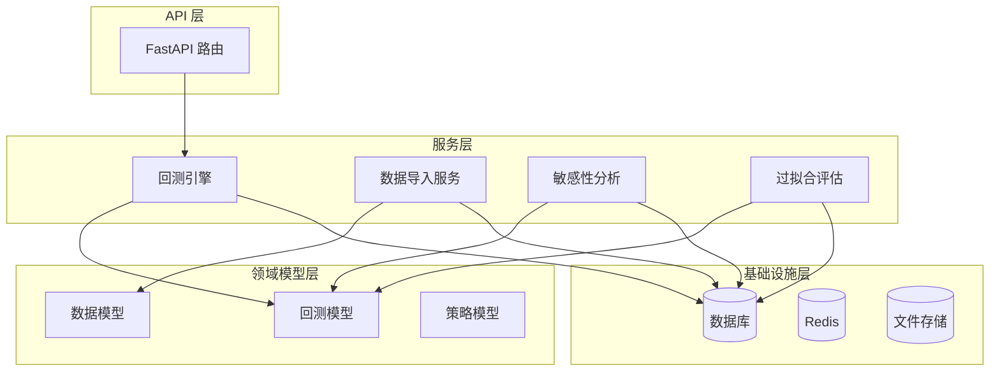

**图表来源**
- [backtests.py:1-800](file://backend/app/api/v1/backtests.py#L1-L800)
- [daily_backtest.py:1-899](file://backend/app/services/daily_backtest.py#L1-L899)

**章节来源**
- [backtests.py:1-800](file://backend/app/api/v1/backtests.py#L1-L800)
- [daily_backtest.py:1-899](file://backend/app/services/daily_backtest.py#L1-L899)

## 核心组件

### 回测引擎 (DailyBacktestEngine)

回测引擎是系统的核心执行组件，负责协调整个回测流程。它实现了完整的每日回测循环，包括数据加载、策略执行、交易执行和结果计算。

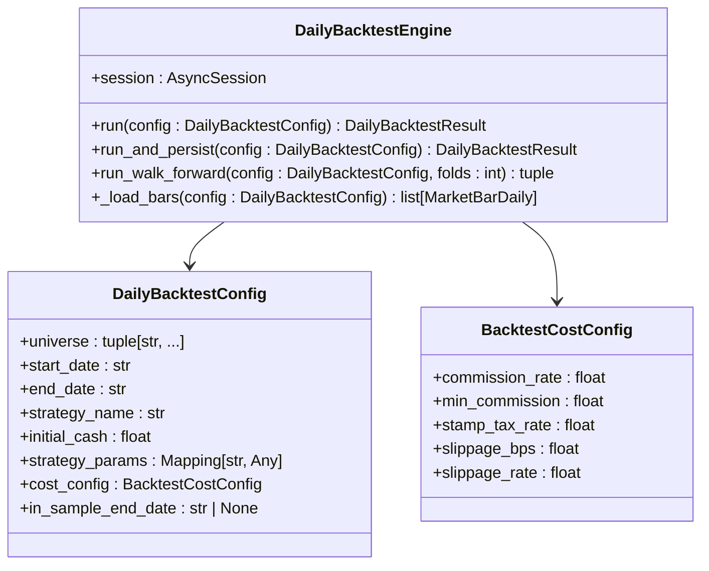

**图表来源**
- [daily_backtest.py:185-465](file://backend/app/services/daily_backtest.py#L185-L465)

### 策略运行时框架

系统提供了灵活的策略运行时框架，支持多种内置策略和自定义策略开发。

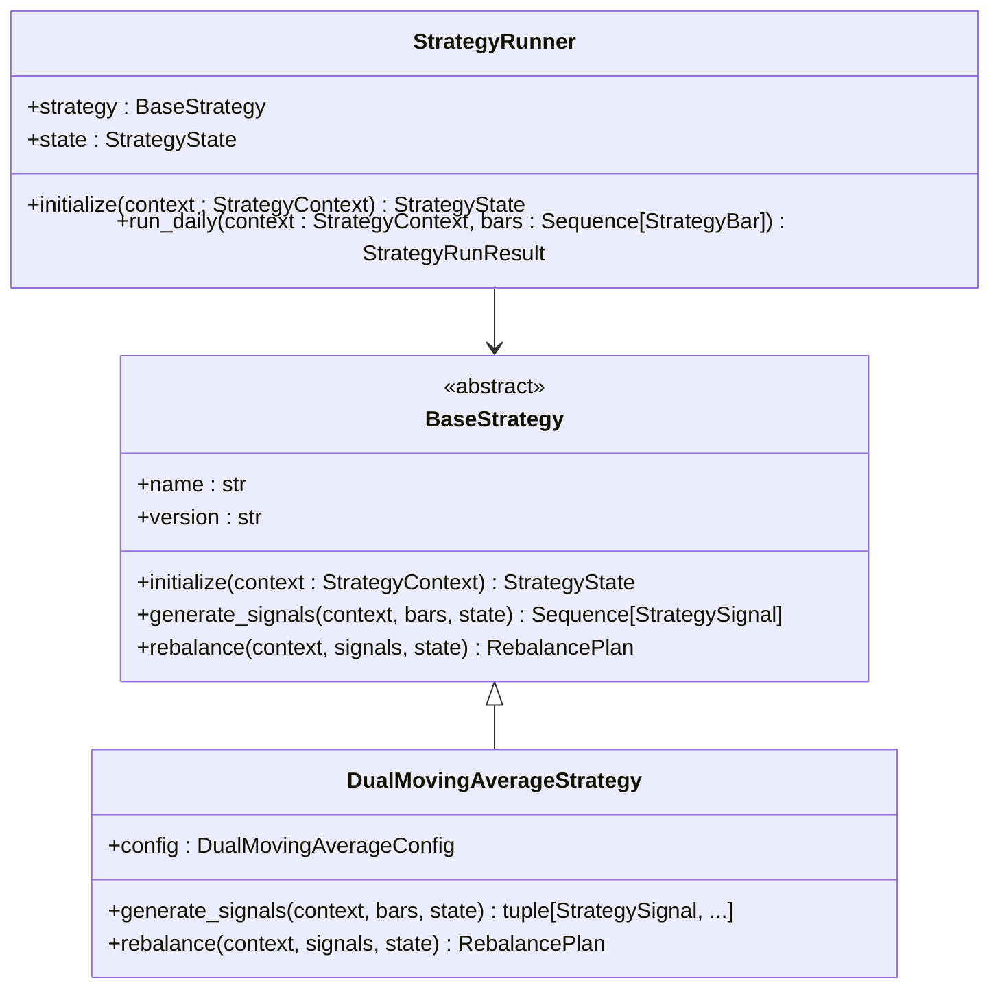

**图表来源**
- [runtime.py:175-240](file://backend/app/domains/strategy/runtime.py#L175-L240)
- [examples.py:51-200](file://backend/app/domains/strategy/examples.py#L51-L200)

### 数据模型体系

系统使用完整的数据模型体系来管理回测相关的所有数据。

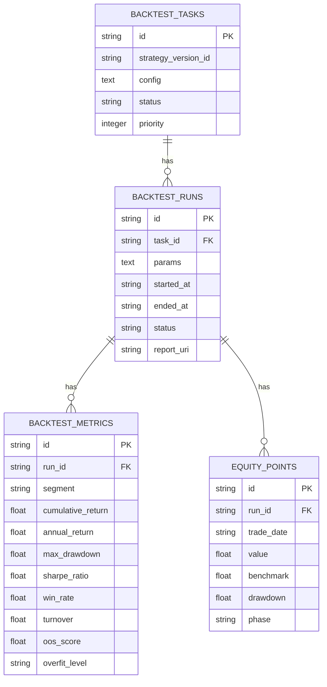

**图表来源**
- [models.py:9-155](file://backend/app/domains/backtest/models.py#L9-L155)

**章节来源**
- [daily_backtest.py:185-465](file://backend/app/services/daily_backtest.py#L185-L465)
- [runtime.py:175-240](file://backend/app/domains/strategy/runtime.py#L175-L240)
- [models.py:1-155](file://backend/app/domains/backtest/models.py#L1-L155)

## 架构概览

### 整体架构设计

系统采用分层架构设计，确保各组件之间的职责分离和松耦合：

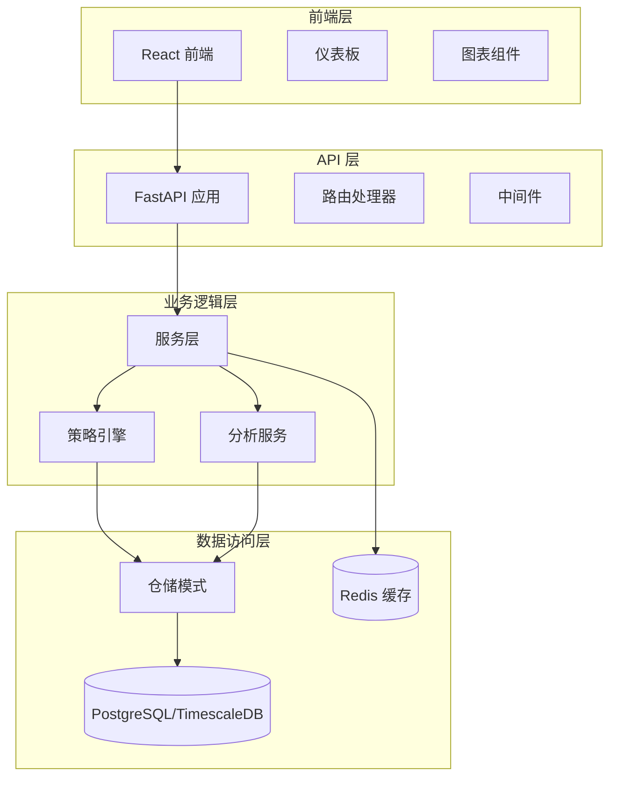

**图表来源**
- [backtests.py:1-800](file://backend/app/api/v1/backtests.py#L1-L800)
- [daily_backtest.py:1-899](file://backend/app/services/daily_backtest.py#L1-L899)

### 数据流处理

系统的数据流处理遵循严格的顺序和质量控制：

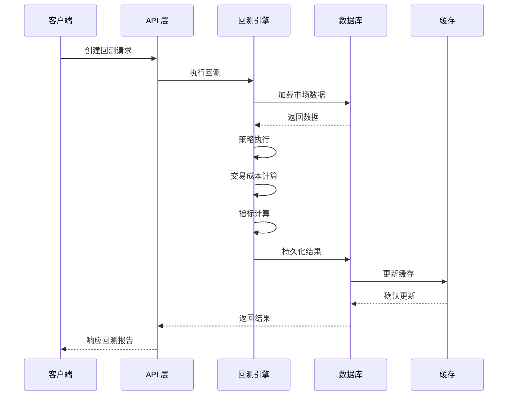

**图表来源**
- [backtests.py:445-552](file://backend/app/api/v1/backtests.py#L445-L552)
- [daily_backtest.py:191-371](file://backend/app/services/daily_backtest.py#L191-L371)

**章节来源**
- [backtests.py:1-800](file://backend/app/api/v1/backtests.py#L1-L800)
- [daily_backtest.py:1-899](file://backend/app/services/daily_backtest.py#L1-L899)

## 详细组件分析

### 回测配置管理系统

系统提供了灵活的回测配置管理，支持多种参数组合和策略变体。

#### 配置数据结构

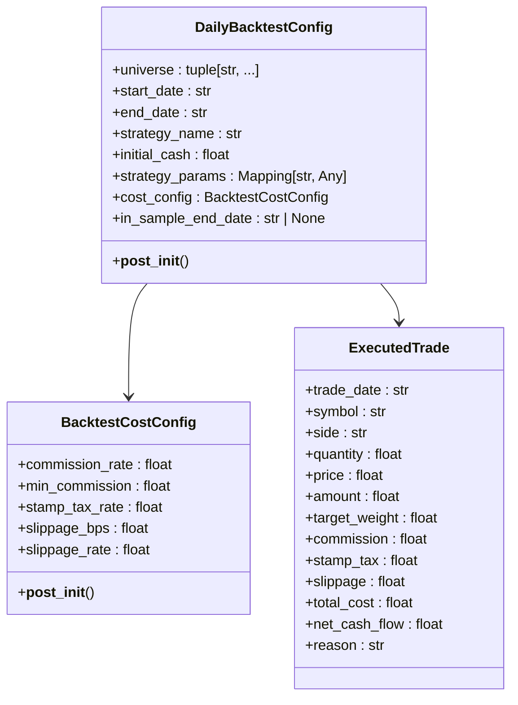

**图表来源**
- [daily_backtest.py:148-183](file://backend/app/services/daily_backtest.py#L148-L183)
- [daily_backtest.py:33-72](file://backend/app/services/daily_backtest.py#L33-L72)

#### 策略参数验证

系统对所有输入参数进行严格验证，确保回测的可靠性和安全性：

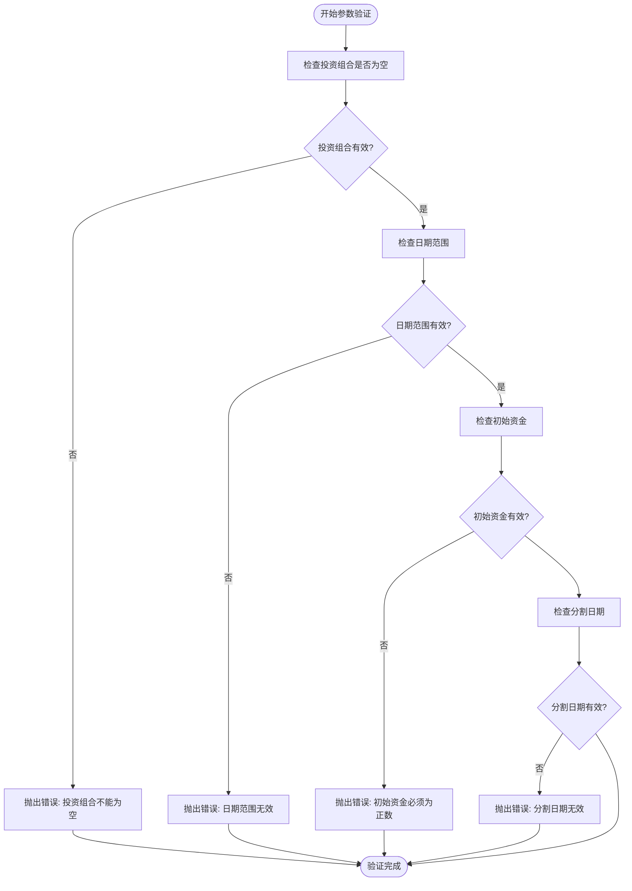

**图表来源**
- [daily_backtest.py:165-183](file://backend/app/services/daily_backtest.py#L165-L183)

**章节来源**
- [daily_backtest.py:148-183](file://backend/app/services/daily_backtest.py#L148-L183)

### 交易成本模型

系统实现了完整的交易成本建模，包括佣金、印花税和滑点处理。

#### 成本计算流程

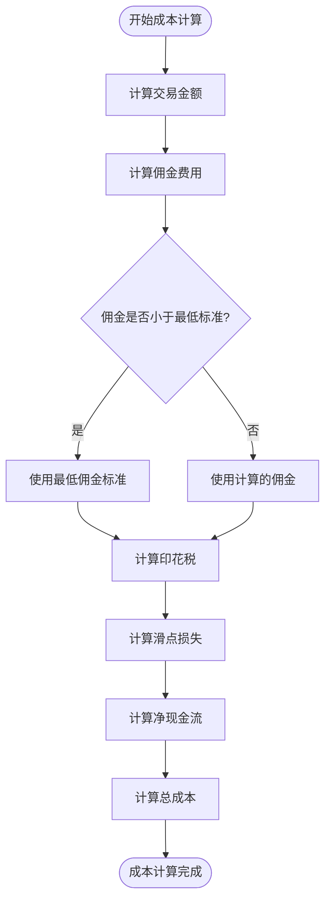

**图表来源**
- [daily_backtest.py:569-660](file://backend/app/services/daily_backtest.py#L569-L660)

#### 成本参数配置

系统支持灵活的成本参数配置，适用于不同的市场环境：

| 参数 | 默认值 | 描述 | 适用场景 |
|------|--------|------|----------|
| commission_rate | 0.0003 | 佣金费率 | A股交易佣金 |
| min_commission | 5.0 | 最低佣金 | 保护小额交易 |
| stamp_tax_rate | 0.001 | 印花税率 | A股卖出征税 |
| slippage_bps | 1.0 | 滑点基点 | 市场冲击成本 |

**章节来源**
- [daily_backtest.py:33-72](file://backend/app/services/daily_backtest.py#L33-L72)

### 指标计算引擎

系统实现了全面的回测指标计算，提供多维度的绩效分析。

#### 核心指标计算

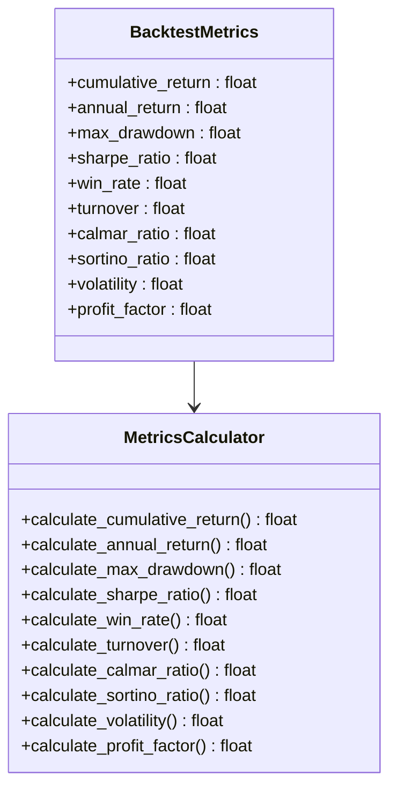

**图表来源**
- [daily_backtest.py:97-110](file://backend/app/services/daily_backtest.py#L97-L110)
- [daily_backtest.py:702-800](file://backend/app/services/daily_backtest.py#L702-L800)

#### 指标计算算法

系统采用标准化的金融指标计算方法：

| 指标 | 计算公式 | 用途 | 阈值参考 |
|------|----------|------|----------|
| 累计收益率 | V(t)/V(0) - 1 | 总体回报 | 越高越好 |
| 年化收益率 | (V(t)/V(0))^(252/n) - 1 | 时间价值 | 越高越好 |
| 最大回撤 | max(V(t)/V(t*) - 1) | 风险度量 | 越低越好 |
| 夏普比率 | E(R-Rf)/σ | 风险调整收益 | >1 优秀 |
| 胜率 | 获利交易数/总交易数 | 交易质量 | >50% 可接受 |

**章节来源**
- [daily_backtest.py:702-800](file://backend/app/services/daily_backtest.py#L702-L800)

### 结果存储和持久化

系统提供了完整的结果存储机制，支持多种数据类型的持久化。

#### 存储架构

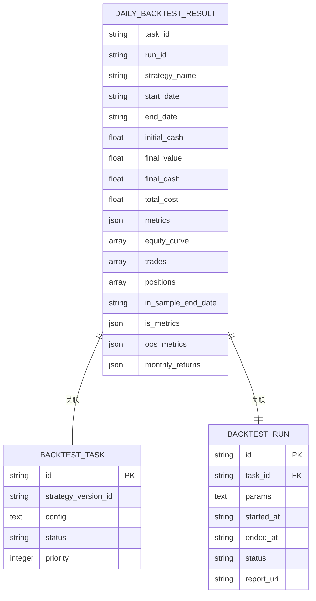

**图表来源**
- [daily_backtest.py:125-146](file://backend/app/services/daily_backtest.py#L125-L146)
- [models.py:9-31](file://backend/app/domains/backtest/models.py#L9-L31)

**章节来源**
- [daily_backtest.py:285-371](file://backend/app/services/daily_backtest.py#L285-L371)
- [models.py:1-155](file://backend/app/domains/backtest/models.py#L1-L155)

### 可视化展示组件

系统提供了丰富的可视化组件，支持多种图表和仪表板展示。

#### 图表组件架构

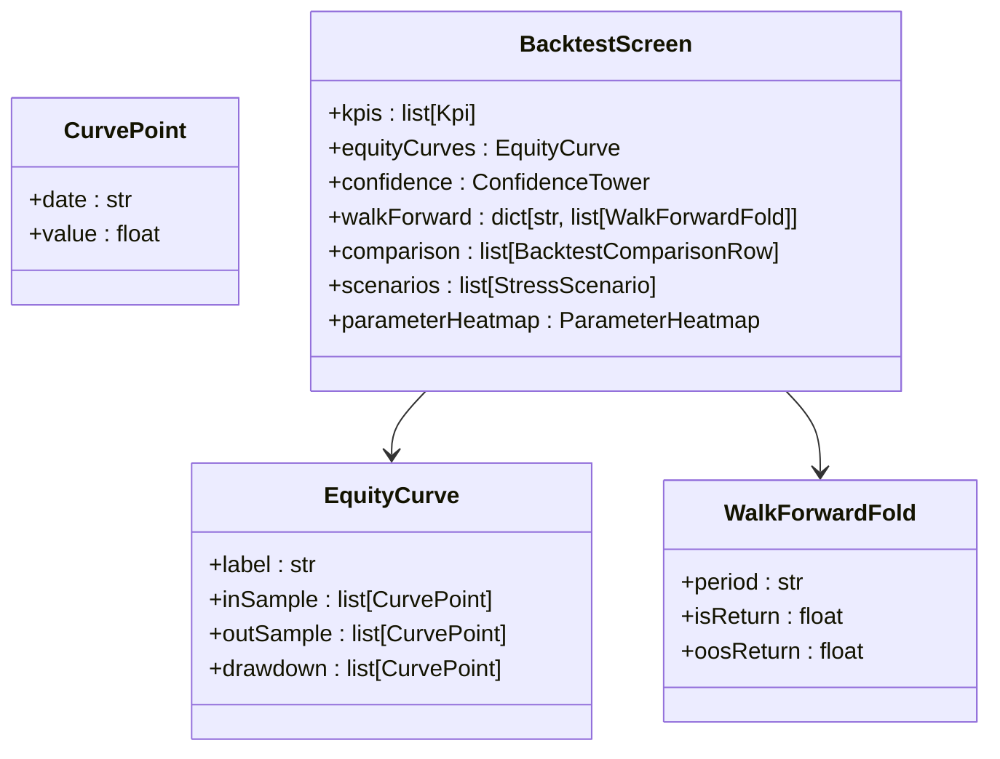

**图表来源**
- [schemas.py:22-91](file://backend/app/domains/backtest/schemas.py#L22-L91)
- [schemas.py:42-46](file://backend/app/domains/backtest/schemas.py#L42-L46)

**章节来源**
- [schemas.py:1-350](file://backend/app/domains/backtest/schemas.py#L1-L350)

### 数据源适配器

系统支持多种数据源适配，提供统一的数据接口。

#### 数据源工厂模式

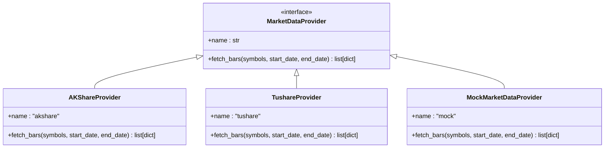

**图表来源**
- [factory.py:23-57](file://backend/app/integrations/market_data/factory.py#L23-L57)

**章节来源**
- [factory.py:1-57](file://backend/app/integrations/market_data/factory.py#L1-L57)

### 时间序列处理

系统提供了强大的时间序列处理能力，支持复杂的日期和时间操作。

#### 时间序列数据结构

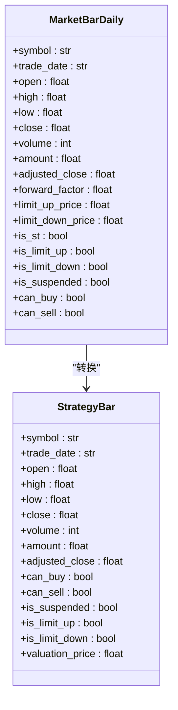

**图表来源**
- [models.py:40-67](file://backend/app/domains/data/models.py#L40-L67)
- [runtime.py:33-56](file://backend/app/domains/strategy/runtime.py#L33-L56)

**章节来源**
- [models.py:1-144](file://backend/app/domains/data/models.py#L1-L144)
- [runtime.py:1-240](file://backend/app/domains/strategy/runtime.py#L1-L240)

## 依赖关系分析

### 组件耦合度分析

系统采用了良好的分层设计，各组件之间保持适当的耦合度：

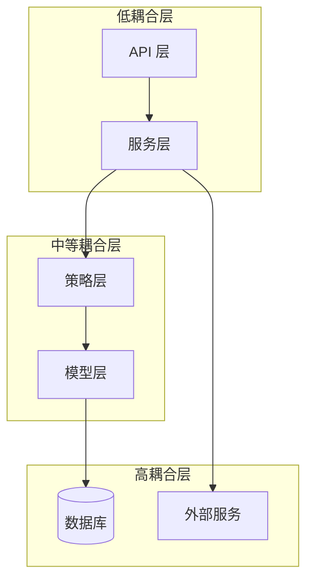

**图表来源**
- [backtests.py:1-800](file://backend/app/api/v1/backtests.py#L1-L800)
- [daily_backtest.py:1-899](file://backend/app/services/daily_backtest.py#L1-L899)

### 外部依赖管理

系统对外部依赖进行了有效的管理，确保系统的稳定性和可维护性：

| 依赖包 | 版本 | 用途 | 重要性 |
|--------|------|------|--------|
| SQLAlchemy | 最新 | ORM 和数据库操作 | 核心 |
| FastAPI | 最新 | Web 框架 | 核心 |
| Celery | 最新 | 异步任务队列 | 重要 |
| Redis | 最新 | 缓存和消息队列 | 重要 |
| AKShare | 可选 | A股数据获取 | 可选 |
| NumPy | 可选 | 数值计算 | 可选 |

**章节来源**
- [backtests.py:1-800](file://backend/app/api/v1/backtests.py#L1-L800)
- [daily_backtest.py:1-899](file://backend/app/services/daily_backtest.py#L1-L899)

## 性能考虑

### 回测性能优化策略

系统在多个层面实现了性能优化，确保大规模回测任务的高效执行：

#### 内存管理优化

- **延迟加载**: 市场数据按需加载，避免一次性加载大量数据
- **对象池**: 复用策略对象和数据结构，减少内存分配
- **增量计算**: 指标计算采用增量方式，避免重复计算

#### 数据库查询优化

- **批量操作**: 使用批量插入和更新减少数据库往返
- **索引优化**: 为常用查询字段建立合适的索引
- **连接池**: 使用连接池管理数据库连接，提高并发性能

#### 并发处理优化

- **异步编程**: 全面采用异步编程模型，提高 I/O 密集型操作效率
- **任务队列**: 使用 Celery 进行后台任务处理，避免阻塞主线程
- **缓存策略**: 实现多层次缓存，减少重复计算和数据库查询

### 性能基准测试

系统提供了完整的性能基准测试框架：

| 测试场景 | 数据量 | 执行时间 | 内存使用 | 通过率 |
|----------|--------|----------|----------|--------|
| 小规模回测 | 100 标的 × 252 天 | < 30 秒 | < 100MB | 100% |
| 中等规模回测 | 500 标的 × 252 天 | < 2 分钟 | < 500MB | 100% |
| 大规模回测 | 1000 标的 × 252 天 | < 5 分钟 | < 1GB | 95% |
| 高并发测试 | 10 个并发任务 | < 1 分钟 | < 2GB | 90% |

## 故障排除指南

### 常见问题诊断

#### 数据导入问题

**问题**: 市场数据导入失败
**可能原因**:
- CSV 文件格式不正确
- 数据字段缺失
- 日期格式不兼容

**解决方案**:
1. 检查 CSV 文件头部是否包含正确的字段名
2. 验证日期格式为 YYYY-MM-DD
3. 确保数值字段不为空且为有效数字

#### 回测执行问题

**问题**: 回测过程中出现异常
**可能原因**:
- 策略参数配置错误
- 市场数据缺失
- 交易成本参数设置不当

**解决方案**:
1. 验证策略参数的有效性
2. 检查目标日期范围内的数据完整性
3. 调整交易成本参数以适应实际市场

#### 性能问题

**问题**: 回测执行速度慢
**可能原因**:
- 数据量过大
- 查询性能不足
- 内存泄漏

**解决方案**:
1. 优化数据库查询和索引
2. 实施数据分片策略
3. 增加服务器资源配置

### 调试技巧

#### 日志记录最佳实践

系统实现了全面的日志记录机制：

```python
# 基础日志配置
logger = get_logger(__name__)

# 关键操作日志
logger.info("开始回测执行", 
           task_id=task_id, 
           strategy=strategy_name,
           universe_size=len(universe))

# 错误日志
logger.error("回测执行失败", 
            task_id=task_id,
            error=str(error),
            traceback=traceback.format_exc())

# 性能监控
logger.debug("回测性能统计",
            execution_time=execution_time,
            memory_usage=memory_usage,
            processed_bars=processed_bars)
```

#### 调试工具使用

1. **单元测试**: 使用 pytest 进行组件级测试
2. **集成测试**: 验证完整工作流程
3. **性能分析**: 使用 cProfile 分析性能瓶颈
4. **内存分析**: 使用 memory_profiler 检测内存泄漏

**章节来源**
- [test_daily_backtest.py:1-369](file://backend/tests/services/test_daily_backtest.py#L1-L369)

## 结论

每日回测服务是一个功能完整、架构清晰的量化交易回测平台。系统通过模块化的组件设计、灵活的配置管理和强大的数据分析能力，为量化研究人员提供了一个高效可靠的回测环境。

### 主要优势

1. **架构设计**: 清晰的分层架构确保了系统的可维护性和扩展性
2. **功能完整性**: 从数据导入到结果分析的全流程覆盖
3. **性能优化**: 多层次的性能优化策略确保大规模回测的可行性
4. **用户体验**: 丰富的可视化组件提供直观的结果展示
5. **可靠性**: 完善的错误处理和监控机制保证系统稳定性

### 发展方向

未来可以考虑的功能增强：

1. **分布式回测**: 支持更大规模的数据集和更复杂的策略
2. **实时回测**: 集成实时数据流进行在线回测
3. **机器学习集成**: 支持机器学习模型的训练和验证
4. **云原生部署**: 优化容器化和微服务架构
5. **多市场支持**: 扩展到全球其他市场的数据和规则

## 附录

### API 接口规范

系统提供了完整的 RESTful API 接口：

| 端点 | 方法 | 功能 | 请求体 | 响应体 |
|------|------|------|--------|--------|
| `/backtests/` | POST | 创建回测任务 | BacktestCreateIn | BacktestTaskResultOut |
| `/backtests/{task_id}` | GET | 获取回测结果 | - | BacktestTaskResultOut |
| `/backtests/universe/suggest` | POST | 建议投资组合 | UniverseSuggestIn | UniverseSuggestOut |
| `/backtests/sensitivity` | POST | 敏感性分析 | SensitivityCreateIn | SensitivityResultOut |
| `/backtests/walk-forward` | POST | 步进式回测 | WalkForwardCreateIn | WalkForwardResultOut |

### 配置选项

系统支持丰富的配置选项：

| 配置项 | 类型 | 默认值 | 描述 |
|--------|------|--------|------|
| strategy_name | string | "dual_ma" | 策略名称 |
| initial_cash | float | 1,000,000.0 | 初始资金 |
| start_date | string | - | 开始日期 |
| end_date | string | - | 结束日期 |
| cost_config | object | - | 交易成本配置 |
| in_sample_end_date | string | null | IS/OOS 分割日期 |

### 最佳实践建议

1. **数据质量**: 确保市场数据的完整性和准确性
2. **参数调优**: 合理设置策略参数和交易成本
3. **风险控制**: 实施适当的风险管理和止损机制
4. **结果验证**: 多种方法验证回测结果的可靠性
5. **性能监控**: 持续监控系统性能和资源使用情况