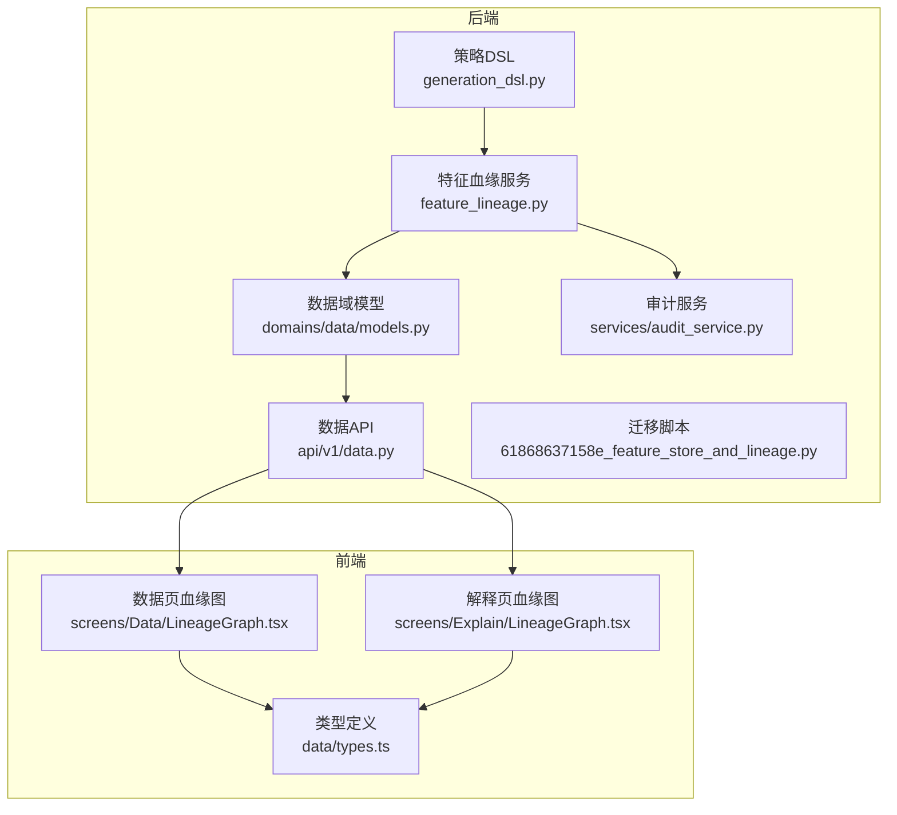
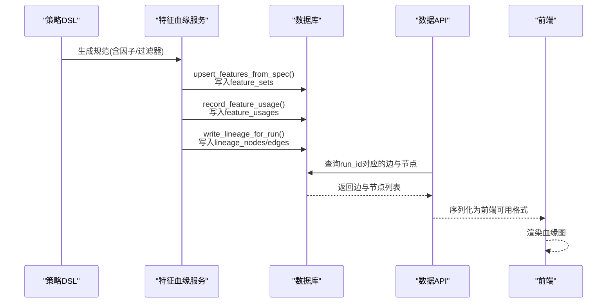
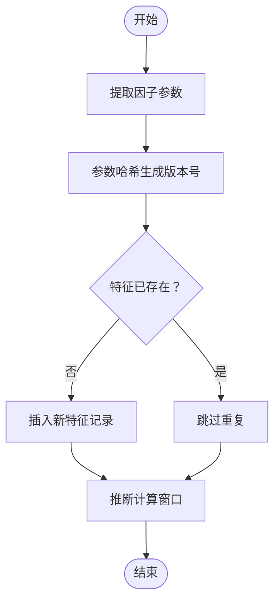
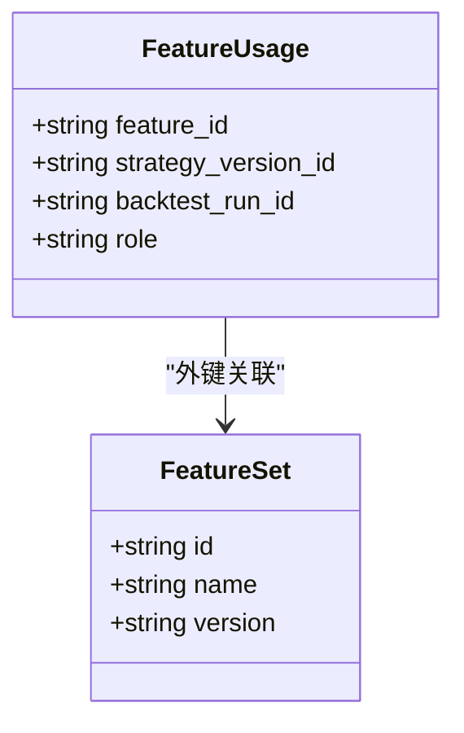
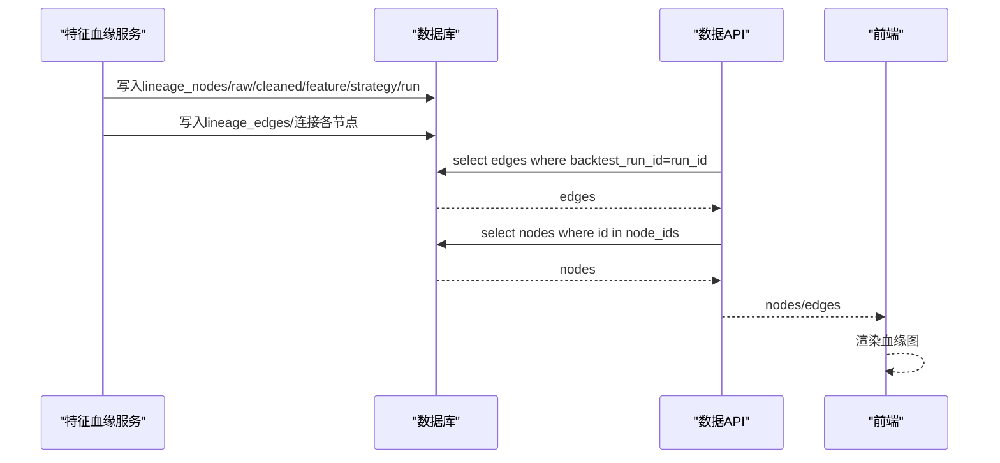
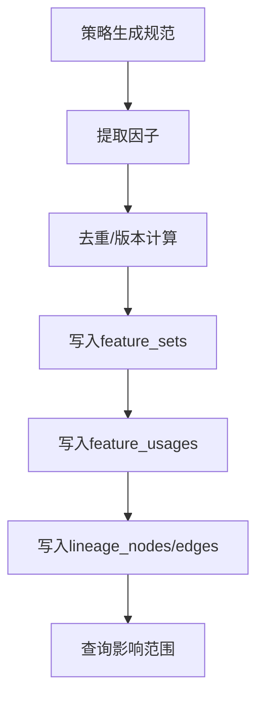
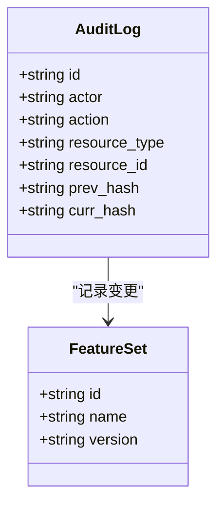
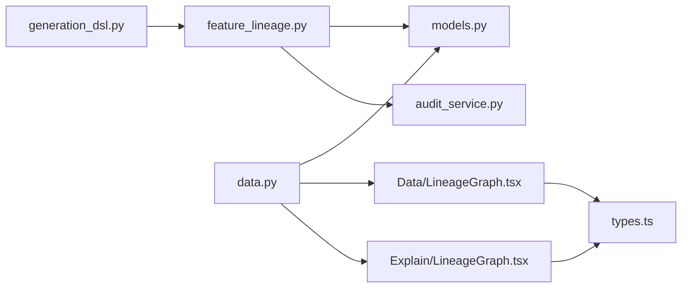
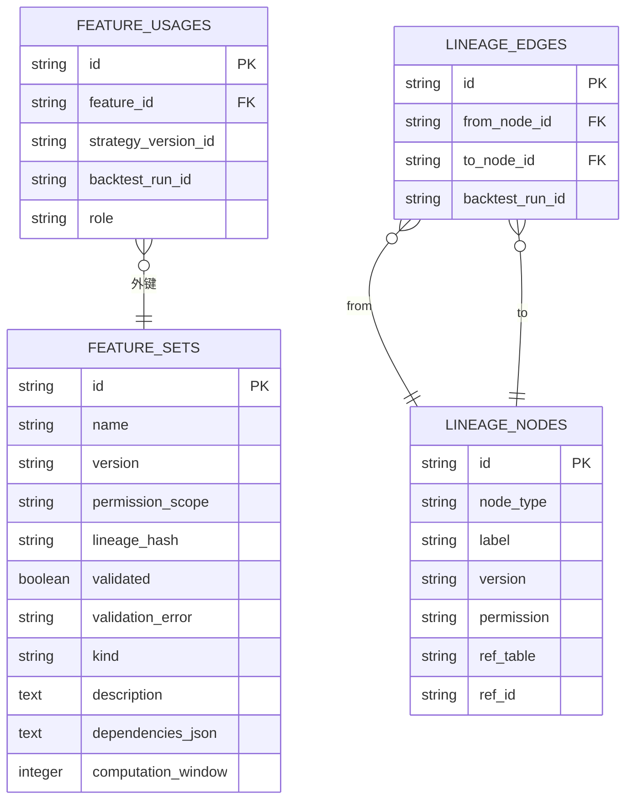

# 特征血缘服务

<cite>
**本文引用的文件**
- [feature_lineage.py](file://backend/app/services/feature_lineage.py)
- [61868637158e_feature_store_and_lineage.py](file://backend/app/db/migrations/versions/61868637158e_feature_store_and_lineage.py)
- [models.py](file://backend/app/domains/data/models.py)
- [schemas.py](file://backend/app/domains/data/schemas.py)
- [data.py](file://backend/app/api/v1/data.py)
- [generation_dsl.py](file://backend/app/domains/strategy/generation_dsl.py)
- [runtime.py](file://backend/app/domains/strategy/runtime.py)
- [audit_service.py](file://backend/app/services/audit_service.py)
- [LineageGraph.tsx](file://frontend/src/screens/Data/LineageGraph.tsx)
- [LineageGraph.tsx](file://frontend/src/screens/Explain/LineageGraph.tsx)
- [types.ts](file://frontend/src/data/types.ts)
</cite>

## 目录
1. [简介](#简介)
2. [项目结构](#项目结构)
3. [核心组件](#核心组件)
4. [架构总览](#架构总览)
5. [详细组件分析](#详细组件分析)
6. [依赖关系分析](#依赖关系分析)
7. [性能考虑](#性能考虑)
8. [故障排查指南](#故障排查指南)
9. [结论](#结论)
10. [附录](#附录)

## 简介
本指南围绕“特征血缘服务”展开，系统性阐述特征存储、血缘追踪与特征使用记录的实现机制，覆盖特征发现、特征映射与血缘关系建立的算法逻辑；解释特征版本管理、依赖关系追踪与影响分析能力；提供特征血缘查询、可视化展示与性能优化方案，并给出特征质量监控、变更追踪与合规审计的实用工具建议。

## 项目结构
特征血缘相关的核心代码分布在后端服务层、数据库迁移、领域模型与前端可视化组件中，形成“DSL定义 → 特征注册与使用记录 → 血缘图谱写入 → API 查询 → 前端展示”的完整闭环。

图表来源
- [generation_dsl.py:78-100](file://backend/app/domains/strategy/generation_dsl.py#L78-L100)
- [feature_lineage.py:41-194](file://backend/app/services/feature_lineage.py#L41-L194)
- [models.py:81-130](file://backend/app/domains/data/models.py#L81-L130)
- [61868637158e_feature_store_and_lineage.py:33-92](file://backend/app/db/migrations/versions/61868637158e_feature_store_and_lineage.py#L33-L92)
- [data.py:299-339](file://backend/app/api/v1/data.py#L299-L339)
- [LineageGraph.tsx:1-138](file://frontend/src/screens/Data/LineageGraph.tsx#L1-L138)
- [LineageGraph.tsx:1-43](file://frontend/src/screens/Explain/LineageGraph.tsx#L1-L43)
- [types.ts:448-458](file://frontend/src/data/types.ts#L448-L458)

章节来源
- [feature_lineage.py:1-217](file://backend/app/services/feature_lineage.py#L1-L217)
- [61868637158e_feature_store_and_lineage.py:1-112](file://backend/app/db/migrations/versions/61868637158e_feature_store_and_lineage.py#L1-L112)
- [models.py:1-144](file://backend/app/domains/data/models.py#L1-L144)
- [data.py:290-392](file://backend/app/api/v1/data.py#L290-L392)
- [generation_dsl.py:1-144](file://backend/app/domains/strategy/generation_dsl.py#L1-L144)
- [runtime.py:1-240](file://backend/app/domains/strategy/runtime.py#L1-L240)
- [audit_service.py:1-109](file://backend/app/services/audit_service.py#L1-L109)
- [LineageGraph.tsx:1-138](file://frontend/src/screens/Data/LineageGraph.tsx#L1-L138)
- [LineageGraph.tsx:1-43](file://frontend/src/screens/Explain/LineageGraph.tsx#L1-L43)
- [types.ts:424-472](file://frontend/src/data/types.ts#L424-L472)

## 核心组件
- 特征存储与版本管理：通过特征集表记录特征名称、版本、依赖参数、计算窗口等元信息，版本号由参数哈希稳定生成，确保相同参数产生相同版本，不同参数产生新版本。
- 特征使用记录：在特征使用表中记录策略版本与特征的关联，支持标注角色（因子/过滤器/信号）以及可选的回测运行标识。
- 血缘图谱：通过节点表与边表构建有向无环图（DAG），记录从原始市场数据到清洗数据、特征、策略版本、运行实例的完整链路。
- API查询：提供按运行ID检索血缘图的接口，返回节点与边集合，供前端渲染。
- 前端可视化：提供数据页与解释页的血缘图组件，分别以横向分层布局与线性流程展示血缘信息。
- 审计与合规：审计服务提供不可篡改的审计日志链，可用于特征与策略变更的合规审计。

章节来源
- [feature_lineage.py:41-217](file://backend/app/services/feature_lineage.py#L41-L217)
- [models.py:81-130](file://backend/app/domains/data/models.py#L81-L130)
- [data.py:299-339](file://backend/app/api/v1/data.py#L299-L339)
- [LineageGraph.tsx:1-138](file://frontend/src/screens/Data/LineageGraph.tsx#L1-L138)
- [LineageGraph.tsx:1-43](file://frontend/src/screens/Explain/LineageGraph.tsx#L1-L43)
- [audit_service.py:18-109](file://backend/app/services/audit_service.py#L18-L109)

## 架构总览
特征血缘服务贯穿策略生成、特征注册、回测运行与血缘写入、查询与可视化的全链路。

图表来源
- [generation_dsl.py:78-100](file://backend/app/domains/strategy/generation_dsl.py#L78-L100)
- [feature_lineage.py:41-194](file://backend/app/services/feature_lineage.py#L41-L194)
- [data.py:299-339](file://backend/app/api/v1/data.py#L299-L339)
- [models.py:81-130](file://backend/app/domains/data/models.py#L81-L130)

## 详细组件分析

### 组件A：特征存储与版本管理
- 功能要点
  - 从策略生成规范中提取每个因子，计算版本号（基于参数哈希），去重并写入特征集表。
  - 将特征参数序列化保存，便于后续依赖关系追踪与影响分析。
  - 计算窗口推断：优先从参数中提取窗口，否则采用默认窗口字典。
- 复杂度与性能
  - 单次写入时间复杂度近似 O(n)，n 为因子数量；版本号计算为 O(p)（p 为参数键值对数）。
  - 建议批量处理与索引优化（按名称与版本查询）。
- 错误处理
  - 参数为空时采用固定版本前缀，保证可追溯性。
  - 参数解析失败或类型异常时降级为默认窗口。

图表来源
- [feature_lineage.py:41-74](file://backend/app/services/feature_lineage.py#L41-L74)
- [feature_lineage.py:200-217](file://backend/app/services/feature_lineage.py#L200-L217)

章节来源
- [feature_lineage.py:41-74](file://backend/app/services/feature_lineage.py#L41-L74)
- [feature_lineage.py:200-217](file://backend/app/services/feature_lineage.py#L200-L217)
- [61868637158e_feature_store_and_lineage.py:33-47](file://backend/app/db/migrations/versions/61868637158e_feature_store_and_lineage.py#L33-L47)

### 组件B：特征使用记录
- 功能要点
  - 将策略版本与使用特征建立关联，支持标注角色（因子/过滤器/信号）与回测运行标识。
  - 用于回溯某策略版本使用了哪些特征及其用途。
- 性能与索引
  - 在特征ID、策略版本ID与回测运行ID上建立索引，加速查询与影响分析。

图表来源
- [models.py:98-107](file://backend/app/domains/data/models.py#L98-L107)
- [models.py:81-96](file://backend/app/domains/data/models.py#L81-L96)

章节来源
- [feature_lineage.py:77-97](file://backend/app/services/feature_lineage.py#L77-L97)
- [models.py:98-107](file://backend/app/domains/data/models.py#L98-L107)
- [61868637158e_feature_store_and_lineage.py:50-66](file://backend/app/db/migrations/versions/61868637158e_feature_store_and_lineage.py#L50-L66)

### 组件C：血缘关系建立与查询
- 血缘链路
  - 原始数据 → 清洗数据 → 特征 → 策略版本 → 运行实例。
  - 对于大规模股票池，原始节点合并为一个节点并记录符号数量，保持链路紧凑。
- 查询接口
  - 按运行ID查询边表，收集所有涉及的节点ID，再批量查询节点表，返回节点与边集合。
- 可视化
  - 数据页血缘图按层级分列布局，解释页血缘图按线性流程展示。

图表来源
- [feature_lineage.py:100-194](file://backend/app/services/feature_lineage.py#L100-L194)
- [data.py:299-327](file://backend/app/api/v1/data.py#L299-L327)
- [models.py:109-130](file://backend/app/domains/data/models.py#L109-L130)

章节来源
- [feature_lineage.py:100-194](file://backend/app/services/feature_lineage.py#L100-L194)
- [data.py:299-339](file://backend/app/api/v1/data.py#L299-L339)
- [LineageGraph.tsx:24-137](file://frontend/src/screens/Data/LineageGraph.tsx#L24-L137)
- [LineageGraph.tsx:3-42](file://frontend/src/screens/Explain/LineageGraph.tsx#L3-L42)

### 组件D：特征发现、映射与依赖追踪
- 特征发现
  - 来自策略生成规范中的因子列表，逐项去重并写入特征集表。
- 映射与依赖
  - 使用表记录特征与策略版本的映射，依赖参数序列化保存，便于后续依赖分析与影响评估。
- 影响分析
  - 可通过反查使用表与血缘边表，定位受影响的策略版本与回测运行。

图表来源
- [generation_dsl.py:78-100](file://backend/app/domains/strategy/generation_dsl.py#L78-L100)
- [feature_lineage.py:41-97](file://backend/app/services/feature_lineage.py#L41-L97)
- [models.py:81-130](file://backend/app/domains/data/models.py#L81-L130)

章节来源
- [generation_dsl.py:78-100](file://backend/app/domains/strategy/generation_dsl.py#L78-L100)
- [feature_lineage.py:41-97](file://backend/app/services/feature_lineage.py#L41-L97)
- [models.py:81-130](file://backend/app/domains/data/models.py#L81-L130)

### 组件E：特征质量监控与变更追踪
- 特征质量
  - 可扩展在特征集表中增加质量指标字段（如缺失率、漂移分数、验证错误），并在迁移脚本中添加相应列。
- 变更追踪
  - 结合审计服务记录特征与策略版本的关键操作（创建、更新、删除），并利用哈希链验证完整性。
- 合规审计
  - 审计服务提供不可篡改的日志链，支持校验最近N条记录的链式一致性。

图表来源
- [audit_service.py:32-109](file://backend/app/services/audit_service.py#L32-L109)
- [models.py:81-96](file://backend/app/domains/data/models.py#L81-L96)

章节来源
- [audit_service.py:1-109](file://backend/app/services/audit_service.py#L1-L109)
- [61868637158e_feature_store_and_lineage.py:33-47](file://backend/app/db/migrations/versions/61868637158e_feature_store_and_lineage.py#L33-L47)

## 依赖关系分析
- 组件耦合
  - 特征血缘服务依赖数据域模型与策略DSL；API依赖模型进行查询与序列化；前端依赖API返回的数据结构。
- 外部依赖
  - SQLAlchemy异步会话用于持久化；Alembic迁移用于表结构演进。
- 潜在循环依赖
  - 当前模块间为单向依赖，未见循环。

图表来源
- [generation_dsl.py:78-100](file://backend/app/domains/strategy/generation_dsl.py#L78-L100)
- [feature_lineage.py:41-194](file://backend/app/services/feature_lineage.py#L41-L194)
- [models.py:81-130](file://backend/app/domains/data/models.py#L81-L130)
- [data.py:299-339](file://backend/app/api/v1/data.py#L299-L339)
- [LineageGraph.tsx:1-138](file://frontend/src/screens/Data/LineageGraph.tsx#L1-L138)
- [LineageGraph.tsx:1-43](file://frontend/src/screens/Explain/LineageGraph.tsx#L1-L43)
- [types.ts:448-458](file://frontend/src/data/types.ts#L448-L458)
- [audit_service.py:1-109](file://backend/app/services/audit_service.py#L1-L109)

章节来源
- [feature_lineage.py:1-217](file://backend/app/services/feature_lineage.py#L1-L217)
- [models.py:1-144](file://backend/app/domains/data/models.py#L1-L144)
- [data.py:290-392](file://backend/app/api/v1/data.py#L290-L392)
- [LineageGraph.tsx:1-138](file://frontend/src/screens/Data/LineageGraph.tsx#L1-L138)
- [LineageGraph.tsx:1-43](file://frontend/src/screens/Explain/LineageGraph.tsx#L1-L43)
- [types.ts:424-472](file://frontend/src/data/types.ts#L424-L472)
- [audit_service.py:1-109](file://backend/app/services/audit_service.py#L1-L109)

## 性能考虑
- 数据库层面
  - 为特征集、使用记录与血缘表建立必要索引，提升查询效率（按名称、版本、策略版本ID、回测运行ID）。
  - 批量写入与flush时机控制，减少事务开销。
- 查询层面
  - 血缘查询先查边表再聚合节点ID，避免全表扫描。
  - 对于大股票池场景，原始节点合并策略有效降低边数与渲染复杂度。
- 前端层面
  - 血缘图采用分层布局与SVG路径绘制，合理设置视口与渐变箭头，兼顾清晰度与性能。

## 故障排查指南
- 血缘查询为空
  - 检查回测运行ID是否正确，确认边表中是否存在对应记录。
  - 确认节点ID集合是否为空，避免空查询导致的404。
- 版本不一致
  - 核对特征参数哈希生成逻辑，确保相同参数得到相同版本号。
  - 若版本频繁变化，检查参数字典的排序与序列化行为。
- 性能问题
  - 检查索引是否生效；对高频查询字段建立复合索引。
  - 限制单次查询的节点/边数量，必要时分页或缓存热点数据。

章节来源
- [data.py:299-339](file://backend/app/api/v1/data.py#L299-L339)
- [feature_lineage.py:200-217](file://backend/app/services/feature_lineage.py#L200-L217)
- [61868637158e_feature_store_and_lineage.py:48-92](file://backend/app/db/migrations/versions/61868637158e_feature_store_and_lineage.py#L48-L92)

## 结论
特征血缘服务通过“特征存储 + 版本管理 + 使用记录 + 血缘图谱 + API查询 + 前端可视化 + 审计链”的完整体系，实现了从策略生成到回测运行的全流程可追溯与可解释。该方案具备良好的扩展性与可维护性，适合在金融量化场景中落地应用。

## 附录
- 数据模型概览

图表来源
- [models.py:81-130](file://backend/app/domains/data/models.py#L81-L130)
- [61868637158e_feature_store_and_lineage.py:33-92](file://backend/app/db/migrations/versions/61868637158e_feature_store_and_lineage.py#L33-L92)