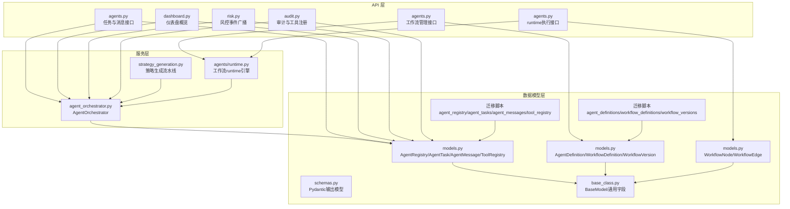
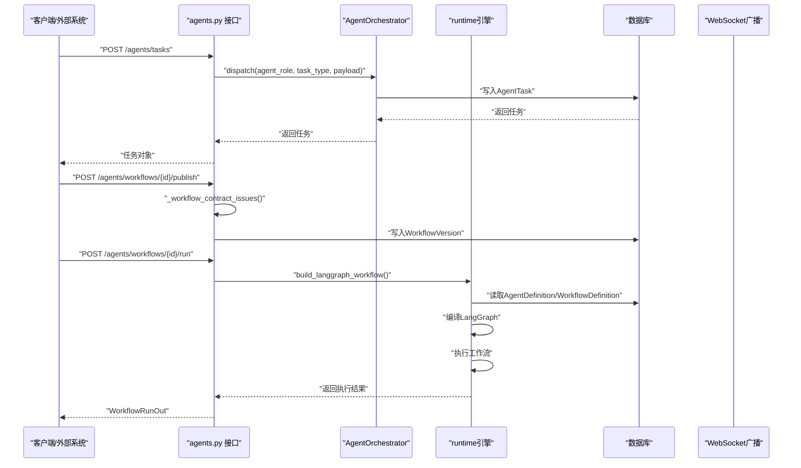
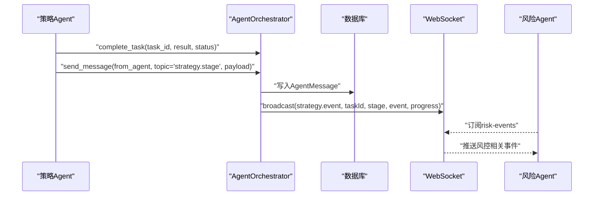
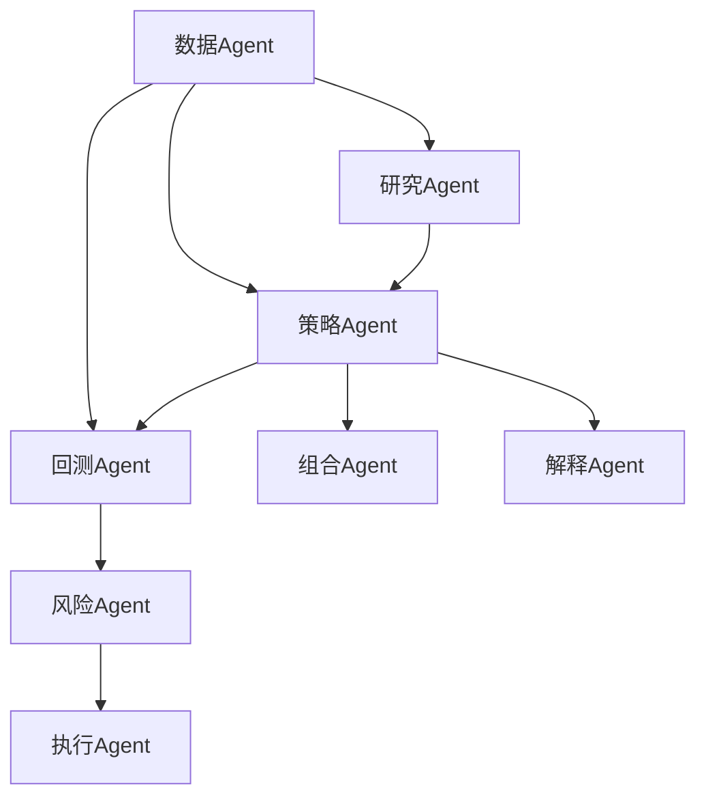
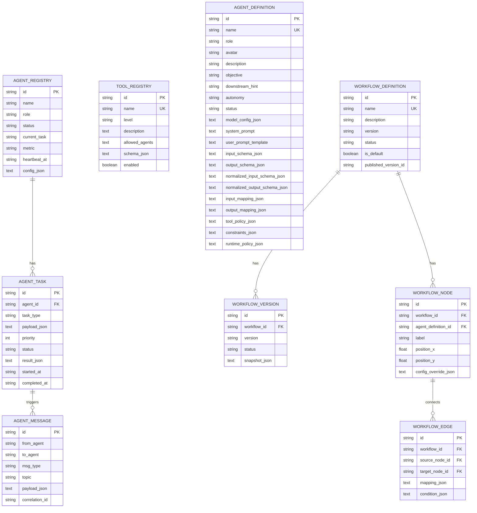
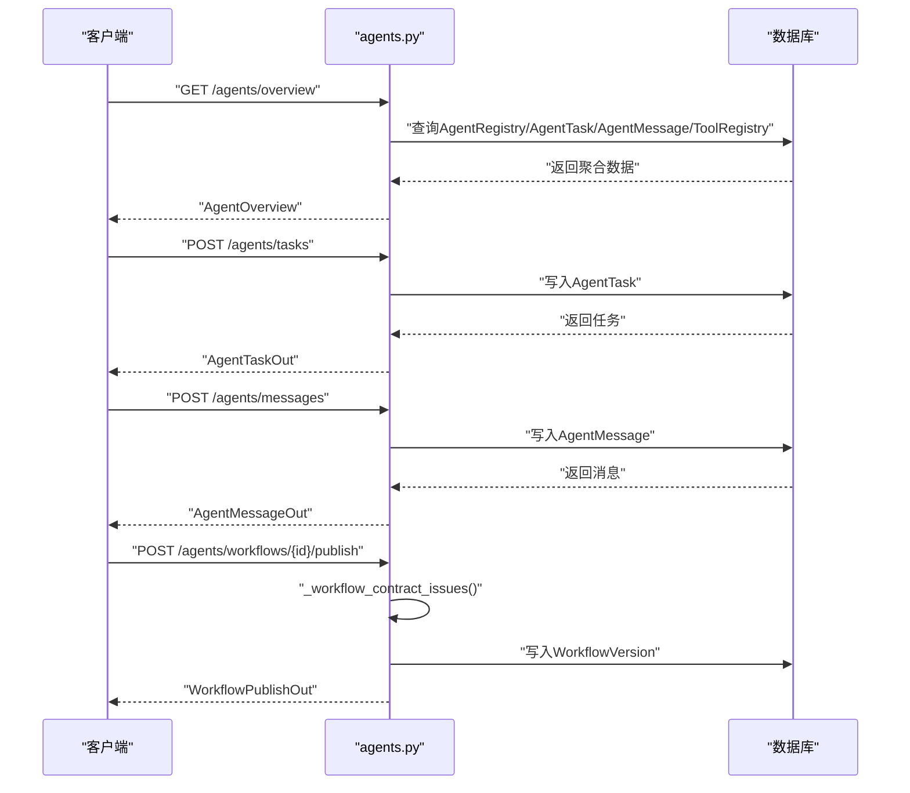
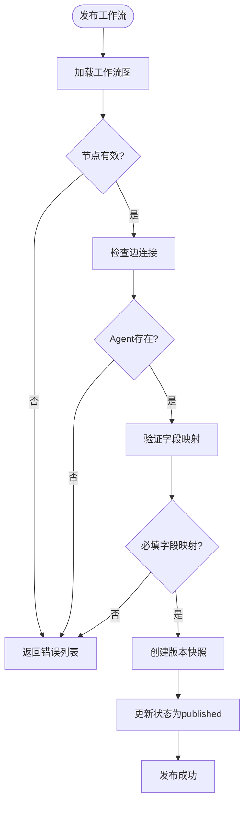
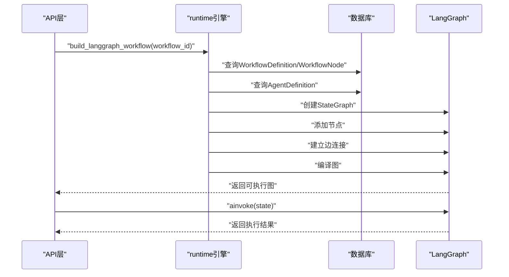
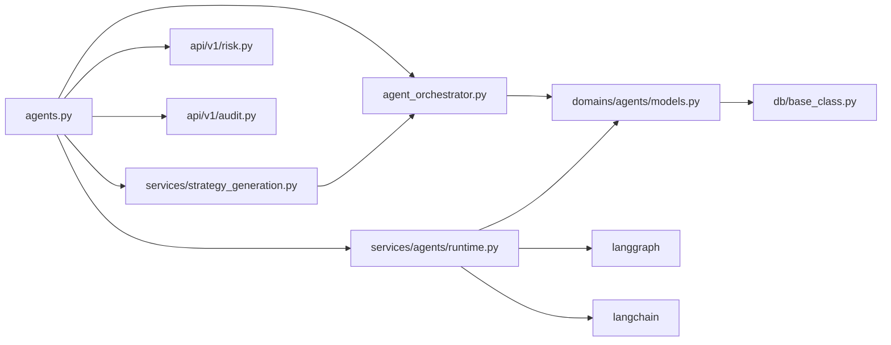

# AI Agent协调机制

<cite>
**本文档引用的文件**
- [backend/app/services/agent_orchestrator.py](file://backend/app/services/agent_orchestrator.py)
- [backend/app/domains/agents/models.py](file://backend/app/domains/agents/models.py)
- [backend/app/domains/agents/schemas.py](file://backend/app/domains/agents/schemas.py)
- [backend/app/api/v1/agents.py](file://backend/app/api/v1/agents.py)
- [backend/app/db/base_class.py](file://backend/app/db/base_class.py)
- [backend/app/db/migrations/versions/20260510_000002_strategy_and_agent_tables.py](file://backend/app/db/migrations/versions/20260510_000002_strategy_and_agent_tables.py)
- [backend/app/db/migrations/versions/20260516_000001_workflow_versions.py](file://backend/app/db/migrations/versions/20260516_000001_workflow_versions.py)
- [backend/app/services/strategy_generation.py](file://backend/app/services/strategy_generation.py)
- [backend/app/api/v1/dashboard.py](file://backend/app/api/v1/dashboard.py)
- [backend/app/api/v1/risk.py](file://backend/app/api/v1/risk.py)
- [backend/app/api/v1/audit.py](file://backend/app/api/v1/audit.py)
- [backend/app/domains/strategy/state_machine.py](file://backend/app/domains/strategy/state_machine.py)
- [backend/app/domains/strategy/runtime.py](file://backend/app/domains/strategy/runtime.py)
- [backend/app/services/agents/runtime.py](file://backend/app/services/agents/runtime.py)
- [backend/tests/api/test_agent_workflow_publish.py](file://backend/tests/api/test_agent_workflow_publish.py)
</cite>

## 更新摘要
**变更内容**
- 新增工作流编排系统：引入Agent定义管理、工作流创建与发布、合约验证功能
- 新增runtime引擎支持：基于LangGraph的可配置Agent运行时
- 扩展数据模型：新增AgentDefinition、WorkflowDefinition、WorkflowVersion、WorkflowNode、WorkflowEdge实体
- 增强API接口：新增工作流管理、运行时编译、合约验证等接口

## 目录
1. [简介](#简介)
2. [项目结构](#项目结构)
3. [核心组件](#核心组件)
4. [架构总览](#架构总览)
5. [详细组件分析](#详细组件分析)
6. [工作流编排系统](#工作流编排系统)
7. [新的runtime引擎](#新的runtime引擎)
8. [依赖分析](#依赖分析)
9. [性能考虑](#性能考虑)
10. [故障排除指南](#故障排除指南)
11. [结论](#结论)
12. [附录](#附录)

## 简介
本文件系统化阐述AI Agent协调机制的设计与实现，重点围绕AgentOrchestrator的调度算法、任务分配策略、消息传递协议与状态同步机制展开。文档同时明确各Agent角色的职责边界：研究Agent、策略Agent、回测Agent、风险Agent、执行Agent、组合Agent、解释Agent与数据Agent，并给出消息格式、事件驱动模式、并发控制与错误传播机制的技术细节。**更新**后的内容还涵盖了新增的工作流编排系统、Agent定义管理、合约验证机制以及基于LangGraph的新runtime引擎支持。

## 项目结构
本项目的Agent协调机制由三层组成：
- 数据模型层：定义Agent注册表、任务队列、消息表、Agent定义、工作流定义与版本等，统一承载状态与元数据。
- 服务层：AgentOrchestrator负责任务派发、结果收尾与跨Agent消息写入；新增的runtime服务负责工作流编译与执行。
- API层：对外暴露Agent编排接口、工作流管理接口与runtime执行接口，支持任务创建、消息发送、工作流发布与运行。

**图表来源**
- [backend/app/api/v1/agents.py:1-172](file://backend/app/api/v1/agents.py#L1-L172)
- [backend/app/services/agent_orchestrator.py:15-104](file://backend/app/services/agent_orchestrator.py#L15-L104)
- [backend/app/domains/agents/models.py:9-138](file://backend/app/domains/agents/models.py#L9-L138)
- [backend/app/domains/agents/schemas.py:1-187](file://backend/app/domains/agents/schemas.py#L1-L187)
- [backend/app/db/base_class.py:17-31](file://backend/app/db/base_class.py#L17-L31)
- [backend/app/db/migrations/versions/20260510_000002_strategy_and_agent_tables.py:121-293](file://backend/app/db/migrations/versions/20260510_000002_strategy_and_agent_tables.py#L121-L293)
- [backend/app/db/migrations/versions/20260516_000001_workflow_versions.py:31-131](file://backend/app/db/migrations/versions/20260516_000001_workflow_versions.py#L31-L131)

**章节来源**
- [backend/app/api/v1/agents.py:1-172](file://backend/app/api/v1/agents.py#L1-L172)
- [backend/app/services/agent_orchestrator.py:15-104](file://backend/app/services/agent_orchestrator.py#L15-L104)
- [backend/app/domains/agents/models.py:9-138](file://backend/app/domains/agents/models.py#L9-L138)
- [backend/app/domains/agents/schemas.py:1-187](file://backend/app/domains/agents/schemas.py#L1-L187)
- [backend/app/db/base_class.py:17-31](file://backend/app/db/base_class.py#L17-L31)
- [backend/app/db/migrations/versions/20260510_000002_strategy_and_agent_tables.py:121-293](file://backend/app/db/migrations/versions/20260510_000002_strategy_and_agent_tables.py#L121-L293)
- [backend/app/db/migrations/versions/20260516_000001_workflow_versions.py:31-131](file://backend/app/db/migrations/versions/20260516_000001_workflow_versions.py#L31-L131)

## 核心组件
- AgentOrchestrator：封装任务持久化与角色解析，提供任务派发、任务完成标记与跨Agent消息写入能力。
- **新增** AgentDefinition：可重用的Agent定义，包含模型配置、系统提示、输入输出模式、映射规则等。
- **新增** WorkflowDefinition/WorkflowVersion：工作流定义与版本管理，支持草稿到发布的完整生命周期。
- **新增** WorkflowNode/WorkflowEdge：工作流节点与边，定义Agent实例与数据流关系。
- **新增** runtime引擎：基于LangGraph的可配置Agent运行时，支持动态编译和执行工作流。
- AgentRegistry/AgentTask/AgentMessage/ToolRegistry：四类核心数据模型，分别记录Agent身份与状态、任务队列、跨Agent消息与工具权限。
- API接口：提供任务创建、消息发送、概览查询、工作流管理与runtime执行等REST接口；配合WebSocket进行事件广播。
- 策略生成流水线：以事件驱动方式串联各Agent，完成从研究到回测再到风控的闭环。

**章节来源**
- [backend/app/services/agent_orchestrator.py:15-104](file://backend/app/services/agent_orchestrator.py#L15-L104)
- [backend/app/domains/agents/models.py:64-138](file://backend/app/domains/agents/models.py#L64-L138)
- [backend/app/api/v1/agents.py:93-171](file://backend/app/api/v1/agents.py#L93-L171)
- [backend/app/services/strategy_generation.py:86-289](file://backend/app/services/strategy_generation.py#L86-L289)

## 架构总览
Agent协调机制采用"数据库驱动"的轻量级编排架构：所有任务与消息均持久化至关系型数据库，通过API读写，由策略流水线或外部系统触发事件。Agent角色通过注册表进行绑定，消息类型支持请求/响应/事件/广播，topic用于语义分组，correlation_id用于关联同一流程的多次交互。**更新**后架构增加了工作流编排层，通过Agent定义和工作流定义实现可配置的多Agent协作。

**图表来源**
- [backend/app/api/v1/agents.py:115-159](file://backend/app/api/v1/agents.py#L115-L159)
- [backend/app/services/agent_orchestrator.py:31-104](file://backend/app/services/agent_orchestrator.py#L31-L104)
- [backend/app/services/agents/runtime.py:160-200](file://backend/app/services/agents/runtime.py#L160-L200)
- [backend/app/api/v1/agents.py:514-570](file://backend/app/api/v1/agents.py#L514-L570)

## 详细组件分析

### AgentOrchestrator调度与任务分配
- 角色解析：根据agent_role在AgentRegistry中查找首个匹配的agent_id，若未找到则直接使用传入的agent_role作为目标ID。
- 任务派发：构造AgentTask，设置状态为运行中、记录开始时间与追踪ID，可选写入correlation_id到metadata_json。
- 任务完成：按task_id加载任务，更新状态与结果JSON，记录完成时间。
- 消息发送：构造AgentMessage，支持指定to_agent、msg_type与topic，便于事件驱动与广播。

**图表来源**
- [backend/app/services/agent_orchestrator.py:21-60](file://backend/app/services/agent_orchestrator.py#L21-L60)

**章节来源**
- [backend/app/services/agent_orchestrator.py:21-104](file://backend/app/services/agent_orchestrator.py#L21-L104)

### 消息传递协议与事件驱动
- 消息类型：request、response、event、broadcast，分别用于请求应答、事件通知与全量广播。
- 主题topic：按语义分组，如strategy.{stage}、risk.*、execution.*等，便于订阅与过滤。
- 关联ID：correlation_id贯穿同一流程的多条消息，便于端到端追踪。
- 广播机制：策略流水线在阶段完成后通过WebSocket广播事件，前端实时渲染。

**图表来源**
- [backend/app/services/agent_orchestrator.py:62-104](file://backend/app/services/agent_orchestrator.py#L62-L104)
- [backend/app/services/strategy_generation.py:417-443](file://backend/app/services/strategy_generation.py#L417-L443)
- [backend/app/api/v1/risk.py:235-238](file://backend/app/api/v1/risk.py#L235-L238)

**章节来源**
- [backend/app/services/agent_orchestrator.py:81-104](file://backend/app/services/agent_orchestrator.py#L81-L104)
- [backend/app/services/strategy_generation.py:417-443](file://backend/app/services/strategy_generation.py#L417-L443)
- [backend/app/api/v1/risk.py:235-238](file://backend/app/api/v1/risk.py#L235-L238)

### Agent角色职责与流水线
- 研究Agent：扫描市场结构，产出候选特征与信号。
- 策略Agent：生成/修改策略代码，进行静态校验与结构化生成。
- 回测Agent：执行样本内/样本外回测与滚动测试，输出回测指标。
- 风险Agent：实时风控审批与熔断管理，对回测指标进行阈值检查。
- 执行Agent：订单路由与执行，支持TWAP/VWAP等执行算法。
- 组合Agent：组合优化与再平衡建议，输出资产配置方案。
- 解释Agent：决策解释与信号溯源，提供可解释性分析。
- 数据Agent：数据质量与偏差检测，保障数据一致性。

**图表来源**
- [backend/app/db/migrations/versions/20260510_000002_strategy_and_agent_tables.py:159-213](file://backend/app/db/migrations/versions/20260510_000002_strategy_and_agent_tables.py#L159-L213)
- [backend/app/api/v1/dashboard.py:96-110](file://backend/app/api/v1/dashboard.py#L96-L110)

**章节来源**
- [backend/app/db/migrations/versions/20260510_000002_strategy_and_agent_tables.py:159-213](file://backend/app/db/migrations/versions/20260510_000002_strategy_and_agent_tables.py#L159-L213)
- [backend/app/api/v1/dashboard.py:96-110](file://backend/app/api/v1/dashboard.py#L96-L110)

### 数据模型与状态同步
- AgentRegistry：记录Agent名称、角色、状态、当前任务、指标、心跳与配置。
- AgentTask：任务队列项，包含agent_id、task_type、payload、优先级、状态、结果与时间戳。
- AgentMessage：跨Agent消息，包含from_agent、to_agent、msg_type、topic、payload与correlation_id。
- ToolRegistry：工具注册表，记录工具名称、风险等级、允许的Agent角色与Schema。
- **新增** AgentDefinition：可重用的Agent定义，包含模型配置、系统提示、输入输出模式、映射规则等。
- **新增** WorkflowDefinition：工作流定义，包含名称、描述、版本、状态等。
- **新增** WorkflowVersion：工作流版本，存储不可变的快照。
- **新增** WorkflowNode：工作流节点，表示Agent实例及其位置。
- **新增** WorkflowEdge：工作流边，定义节点间的连接关系和数据映射。

**图表来源**
- [backend/app/domains/agents/models.py:9-138](file://backend/app/domains/agents/models.py#L9-L138)
- [backend/app/db/base_class.py:17-31](file://backend/app/db/base_class.py#L17-L31)

**章节来源**
- [backend/app/domains/agents/models.py:9-138](file://backend/app/domains/agents/models.py#L9-L138)
- [backend/app/db/base_class.py:17-31](file://backend/app/db/base_class.py#L17-L31)

### API与序列流程
- 任务创建：POST /agents/tasks，接收agent_role、task_type、payload与priority，返回AgentTaskOut。
- 消息发送：POST /agents/messages，接收from_agent、to_agent、topic、payload与msg_type，返回AgentMessageOut。
- 概览查询：GET /agents/overview，返回Agent、任务、消息与工具的聚合视图。
- **新增** Agent定义管理：GET/POST/PUT /agents/definitions，管理Agent定义。
- **新增** 工作流管理：GET/POST/PUT /agents/workflows，管理工作流定义。
- **新增** 工作流发布：POST /agents/workflows/{id}/publish，发布工作流版本。
- **新增** 工作流运行：POST /agents/workflows/{id}/run，执行工作流。

**图表来源**
- [backend/app/api/v1/agents.py:93-171](file://backend/app/api/v1/agents.py#L93-L171)
- [backend/app/api/v1/agents.py:514-570](file://backend/app/api/v1/agents.py#L514-L570)

**章节来源**
- [backend/app/api/v1/agents.py:93-171](file://backend/app/api/v1/agents.py#L93-L171)

### 并发控制与错误传播
- 并发控制：AgentRegistry.status字段用于表达Agent的活跃/空闲/错误/暂停状态；API层通过状态映射提供可视化提示。
- 错误传播：策略生成流水线根据异常信息推断失败阶段（如risk、backtest、code.validation、code.generation），并发出对应失败事件，确保上层可观测与可追溯。
- 事务与一致性：AgentOrchestrator在任务与消息写入时使用异步会话提交，保证原子性；BaseModel统一注入trace_id与metadata_json，便于端到端追踪。

**章节来源**
- [backend/app/services/agent_orchestrator.py:15-104](file://backend/app/services/agent_orchestrator.py#L15-L104)
- [backend/app/domains/agents/models.py:9-21](file://backend/app/domains/agents/models.py#L9-L21)
- [backend/app/services/strategy_generation.py:313-334](file://backend/app/services/strategy_generation.py#L313-L334)
- [backend/app/db/base_class.py:17-31](file://backend/app/db/base_class.py#L17-L31)

## 工作流编排系统

### Agent定义管理
**新增** AgentDefinition实体提供了可重用的Agent配置模板，包含以下关键字段：
- 基础信息：name、role、avatar、description、objective
- 自主性配置：autonomy（supervised/semi-autonomous/fully-autonomous）
- 状态管理：status（active/paused/inactive）
- LLM配置：model_config_json（provider、model、temperature、maxTokens等）
- 提示词配置：system_prompt、user_prompt_template
- 数据模式：input_schema_json、output_schema_json、normalized_input_schema_json、normalized_output_schema_json
- 映射规则：input_mapping_json、output_mapping_json
- 权限策略：tool_policy_json、constraints_json、runtime_policy_json

### 工作流定义与版本管理
**新增** 工作流系统支持完整的生命周期管理：
- 草稿状态：draft，允许编辑和修改
- 发布状态：published，生成不可变版本快照
- 版本控制：自动递增版本号（主.次.补丁）
- 不可变快照：发布时保存工作流和Agent定义的完整快照

### 合约验证机制
**新增** 工作流发布前的合约验证确保数据流的正确性：
- 节点完整性：检查工作流至少包含一个节点
- 边的有效性：验证边连接的节点存在
- Agent存在性：验证引用的Agent定义存在
- 字段映射验证：检查上游输出字段与下游输入字段的映射关系
- 必填字段检查：确保下游必需字段都被正确映射

**图表来源**
- [backend/app/api/v1/agents.py:232-269](file://backend/app/api/v1/agents.py#L232-L269)
- [backend/app/api/v1/agents.py:514-549](file://backend/app/api/v1/agents.py#L514-L549)

**章节来源**
- [backend/app/domains/agents/models.py:64-138](file://backend/app/domains/agents/models.py#L64-L138)
- [backend/app/api/v1/agents.py:232-269](file://backend/app/api/v1/agents.py#L232-L269)
- [backend/app/api/v1/agents.py:514-549](file://backend/app/api/v1/agents.py#L514-L549)
- [backend/tests/api/test_agent_workflow_publish.py:85-94](file://backend/tests/api/test_agent_workflow_publish.py#L85-L94)

## 新的runtime引擎

### LangGraph集成
**新增** 基于LangGraph的runtime引擎提供了强大的工作流执行能力：
- 动态编译：将持久化的工作流定义编译为LangGraph图
- 可配置Agent：每个Agent节点可独立配置模型参数和行为
- 数据映射：支持复杂的字段映射和数据转换
- 状态管理：维护执行历史和中间结果
- 异步执行：支持异步工作流执行和并发处理

### Agent运行时编译
**新增** `build_langchain_runnable`函数负责将Agent定义编译为可执行的Runnable：
- 模型初始化：根据配置选择LLM提供商和模型
- 输入映射：将上游输出映射到Agent输入
- Schema验证：验证输入输出数据结构
- Prompt构建：生成系统和用户提示
- 输出处理：标准化Agent输出并进行Schema验证

### 工作流执行流程
**新增** `build_langgraph_workflow`函数编译完整的工作流：
- 图构建：创建StateGraph并添加节点
- 边连接：根据边定义建立节点间连接
- 起始结束：自动处理根节点和叶子节点
- 编译执行：返回可执行的LangGraph对象

**图表来源**
- [backend/app/services/agents/runtime.py:160-200](file://backend/app/services/agents/runtime.py#L160-L200)
- [backend/app/api/v1/agents.py:552-570](file://backend/app/api/v1/agents.py#L552-L570)

**章节来源**
- [backend/app/services/agents/runtime.py:1-200](file://backend/app/services/agents/runtime.py#L1-L200)
- [backend/app/domains/strategy/runtime.py:1-240](file://backend/app/domains/strategy/runtime.py#L1-L240)
- [backend/app/api/v1/agents.py:552-570](file://backend/app/api/v1/agents.py#L552-L570)

## 依赖分析
- 组件耦合：AgentOrchestrator仅依赖数据模型与通用时间/追踪工具，保持低耦合；API层通过依赖注入获取数据库会话，职责清晰。
- 外部集成：策略流水线通过WebSocket广播事件，与前端/监控系统解耦；风险API支持熔断触发与恢复广播。
- **新增** 外部依赖：runtime引擎依赖LangGraph、LangChain等第三方库。
- 潜在循环：未发现循环依赖；数据模型与服务层分离良好。

**图表来源**
- [backend/app/api/v1/agents.py:1-172](file://backend/app/api/v1/agents.py#L1-L172)
- [backend/app/services/agent_orchestrator.py:15-104](file://backend/app/services/agent_orchestrator.py#L15-L104)
- [backend/app/domains/agents/models.py:9-138](file://backend/app/domains/agents/models.py#L9-L138)
- [backend/app/db/base_class.py:17-31](file://backend/app/db/base_class.py#L17-L31)
- [backend/app/services/strategy_generation.py:86-289](file://backend/app/services/strategy_generation.py#L86-L289)
- [backend/app/api/v1/risk.py:225-272](file://backend/app/api/v1/risk.py#L225-L272)
- [backend/app/api/v1/audit.py:1-258](file://backend/app/api/v1/audit.py#L1-L258)
- [backend/app/services/agents/runtime.py:17-18](file://backend/app/services/agents/runtime.py#L17-L18)

**章节来源**
- [backend/app/api/v1/agents.py:1-172](file://backend/app/api/v1/agents.py#L1-L172)
- [backend/app/services/agent_orchestrator.py:15-104](file://backend/app/services/agent_orchestrator.py#L15-L104)
- [backend/app/domains/agents/models.py:9-138](file://backend/app/domains/agents/models.py#L9-L138)
- [backend/app/db/base_class.py:17-31](file://backend/app/db/base_class.py#L17-L31)
- [backend/app/services/strategy_generation.py:86-289](file://backend/app/services/strategy_generation.py#L86-L289)
- [backend/app/api/v1/risk.py:225-272](file://backend/app/api/v1/risk.py#L225-L272)
- [backend/app/api/v1/audit.py:1-258](file://backend/app/api/v1/audit.py#L1-L258)

## 性能考虑
- 数据库索引：AgentTask与AgentMessage均对关键字段建立索引（agent_id、to_agent、correlation_id等），提升查询与广播效率。
- 任务优先级：AgentTask支持priority字段，可在消费端按优先级调度，避免高优任务被低优任务阻塞。
- 异步会话：AgentOrchestrator使用异步数据库会话，减少I/O等待；建议在高并发场景下结合连接池与限流策略。
- 广播开销：WebSocket广播仅在事件发生时触发，topic与correlation_id有助于前端侧过滤，降低带宽压力。
- **新增** 工作流缓存：runtime引擎可缓存编译后的LangGraph图，避免重复编译开销。
- **新增** Schema验证：在Agent运行时进行Schema验证，提前发现数据结构问题，减少后续处理成本。
- 迁移与种子：迁移脚本一次性写入Agent与工具种子数据，减少运行期初始化成本。

## 故障排除指南
- 任务未出现：检查AgentRegistry中对应角色的Agent是否处于idle或active状态；确认API返回的任务ID是否正确。
- 消息未到达：核对AgentMessage的to_agent与topic；确认WebSocket订阅是否正确；检查correlation_id是否一致。
- 风控拦截：查看策略流水线是否发出risk.failed事件；核对回测指标是否超出阈值；必要时手动触发熔断恢复。
- 审计与合规：通过审计API导出CSV并校验哈希链完整性；关注工具注册表中的风险等级与授权范围。
- 策略状态机：确认策略状态转换是否符合预定义的合法路径，避免非法跳转导致流程中断。
- **新增** 工作流发布失败：检查合约验证错误列表，确认字段映射和必填字段配置正确。
- **新增** Agent定义问题：验证AgentDefinition的Schema配置，确保输入输出模式与映射规则正确。
- **新增** runtime执行错误：检查LangGraph编译过程，确认节点配置和边连接关系正确。

**章节来源**
- [backend/app/api/v1/audit.py:198-245](file://backend/app/api/v1/audit.py#L198-L245)
- [backend/app/domains/strategy/state_machine.py:4-23](file://backend/app/domains/strategy/state_machine.py#L4-L23)
- [backend/app/services/strategy_generation.py:313-334](file://backend/app/services/strategy_generation.py#L313-L334)
- [backend/tests/api/test_agent_workflow_publish.py:85-94](file://backend/tests/api/test_agent_workflow_publish.py#L85-L94)

## 结论
该Agent协调机制以数据库为核心，结合事件驱动与WebSocket广播，实现了低耦合、可扩展且可观测的多Agent协作框架。**更新**后的内容通过新增的工作流编排系统、Agent定义管理和runtime引擎支持，进一步增强了系统的灵活性和可配置性。通过标准化的消息格式、明确的角色分工、完善的审计与风控集成以及强大的工作流执行能力，系统能够在复杂量化交易场景中稳定运行。建议在生产环境中进一步完善任务优先级调度、消息去重与幂等处理、工作流版本管理以及runtime性能优化，并持续优化广播粒度与前端渲染性能。

## 附录

### Agent配置参数与字段说明
- AgentRegistry
  - name：Agent名称
  - role：角色（research、strategy、backtest、risk、execution、portfolio、explain、data）
  - status：状态（active/idle/error/paused）
  - current_task：当前任务描述
  - metric：指标字符串
  - heartbeat_at：心跳时间
  - config_json：配置JSON
- AgentTask
  - agent_id：目标Agent ID
  - task_type：任务类型
  - payload_json：任务载荷
  - priority：优先级
  - status：状态（pending/running/completed/failed）
  - result_json：结果JSON
  - started_at/ended_at：时间戳
- AgentMessage
  - from_agent/to_agent：发送方/接收方
  - msg_type：消息类型（request/response/event/broadcast）
  - topic：主题
  - payload_json：消息体
  - correlation_id：关联ID
- ToolRegistry
  - name：工具名称（唯一）
  - level：风险等级（low/medium/high）
  - description：描述
  - allowed_agents：允许的Agent角色数组（JSON）
  - schema_json：Schema定义
  - enabled：是否启用
- **新增** AgentDefinition
  - name：Agent定义名称（唯一）
  - role：Agent角色
  - avatar：头像标识
  - description/objective/downstream_hint：描述、目标、下游提示
  - autonomy：自主性级别
  - status：状态（active/paused/inactive）
  - model_config_json：模型配置
  - system_prompt/user_prompt_template：系统和用户提示
  - input_schema_json/output_schema_json：输入输出Schema
  - normalized_input_schema_json/normalized_output_schema_json：标准化Schema
  - input_mapping_json/output_mapping_json：输入输出映射
  - tool_policy_json/constraints_json/runtime_policy_json：策略、约束、运行时策略
- **新增** WorkflowDefinition
  - name：工作流名称（唯一）
  - description：描述
  - version：版本号
  - status：状态（draft/published）
  - is_default：是否默认
  - published_version_id：已发布版本ID
- **新增** WorkflowVersion
  - workflow_id：工作流ID
  - version：版本号
  - status：状态（published）
  - snapshot_json：快照JSON
- **新增** WorkflowNode
  - workflow_id：工作流ID
  - agent_definition_id：Agent定义ID
  - label：标签
  - position_x/position_y：位置坐标
  - config_override_json：配置覆盖
- **新增** WorkflowEdge
  - workflow_id：工作流ID
  - source_node_id：源节点ID
  - target_node_id：目标节点ID
  - mapping_json：映射配置
  - condition_json：条件配置

**章节来源**
- [backend/app/domains/agents/models.py:9-138](file://backend/app/domains/agents/models.py#L9-L138)
- [backend/app/domains/agents/schemas.py:6-187](file://backend/app/domains/agents/schemas.py#L6-L187)