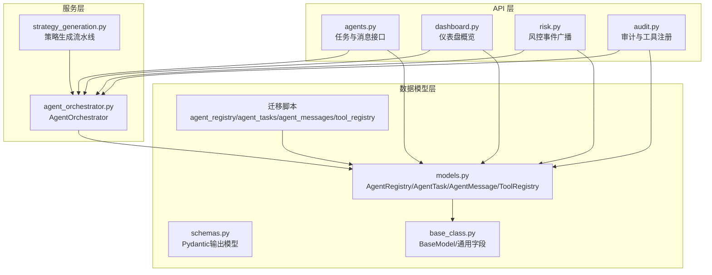
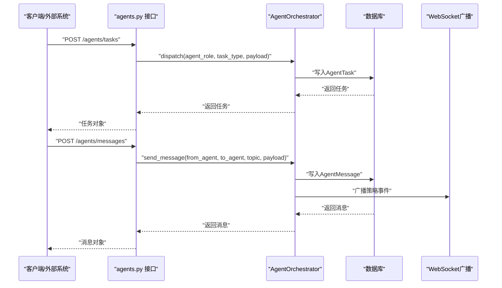
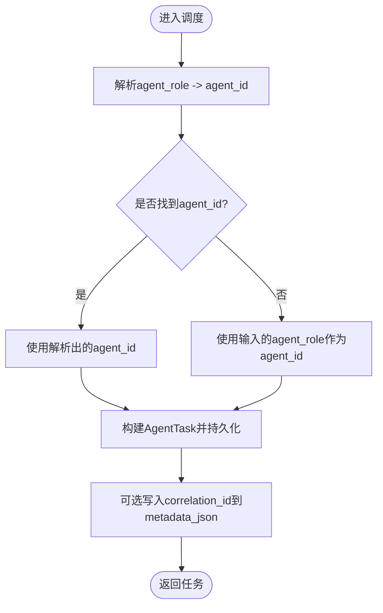
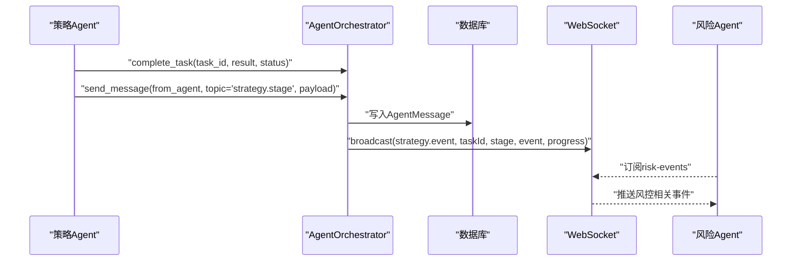
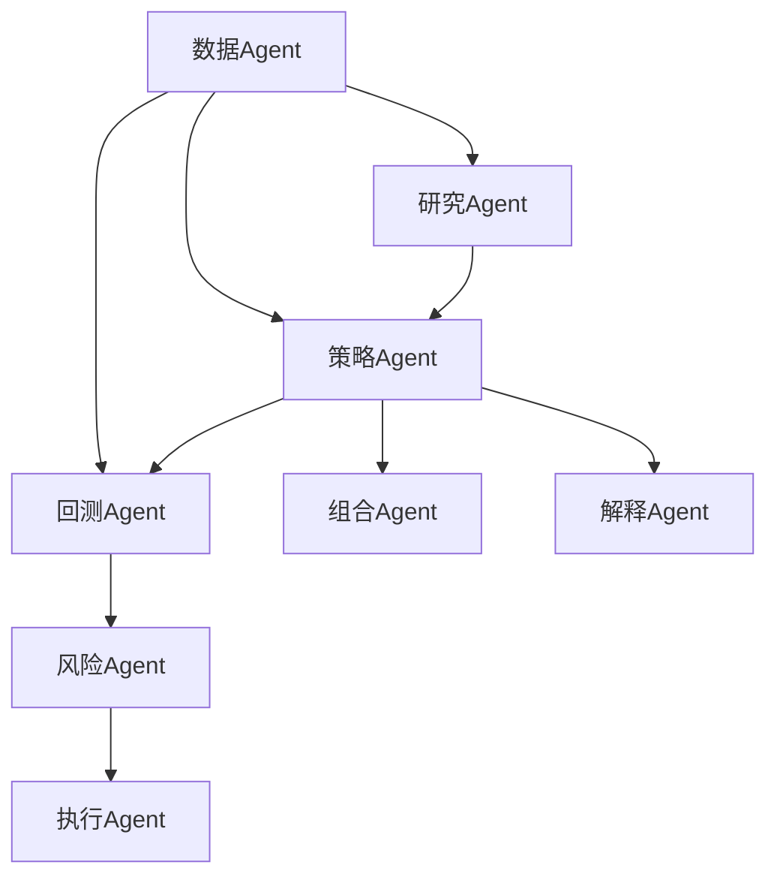
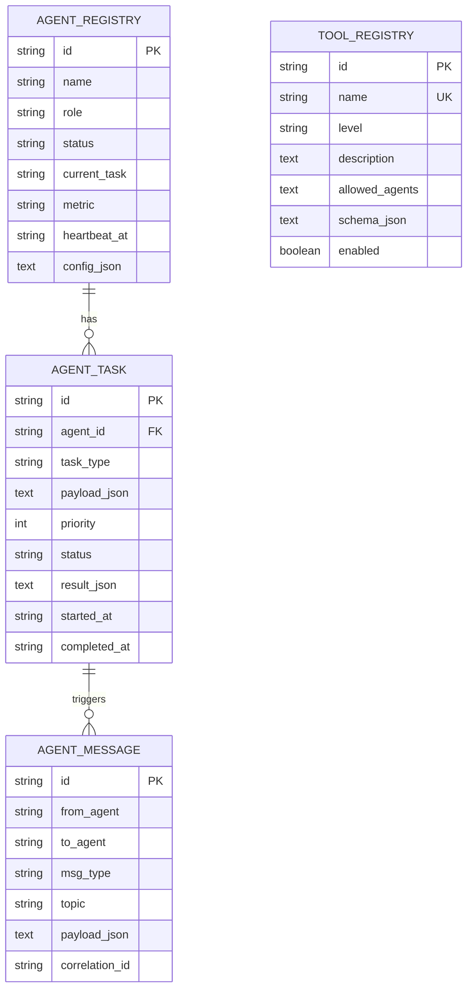
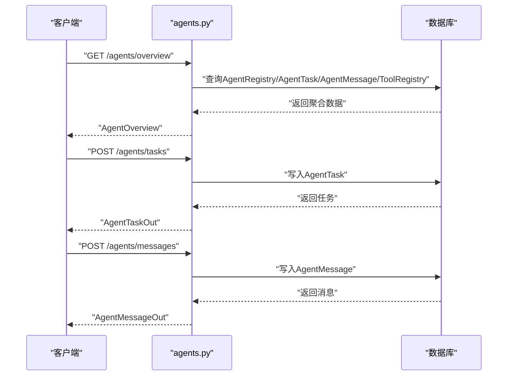
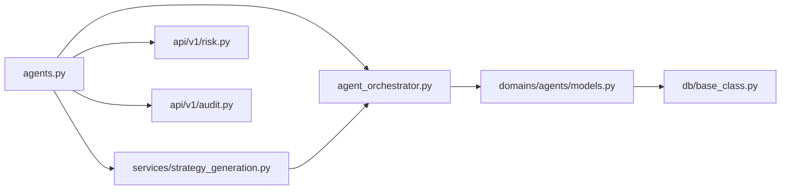

# AI Agent协调机制

<cite>
**本文档引用的文件**
- [backend/app/services/agent_orchestrator.py](file://backend/app/services/agent_orchestrator.py)
- [backend/app/domains/agents/models.py](file://backend/app/domains/agents/models.py)
- [backend/app/domains/agents/schemas.py](file://backend/app/domains/agents/schemas.py)
- [backend/app/api/v1/agents.py](file://backend/app/api/v1/agents.py)
- [backend/app/db/base_class.py](file://backend/app/db/base_class.py)
- [backend/app/db/migrations/versions/20260510_000002_strategy_and_agent_tables.py](file://backend/app/db/migrations/versions/20260510_000002_strategy_and_agent_tables.py)
- [backend/app/services/strategy_generation.py](file://backend/app/services/strategy_generation.py)
- [backend/app/api/v1/dashboard.py](file://backend/app/api/v1/dashboard.py)
- [backend/app/api/v1/risk.py](file://backend/app/api/v1/risk.py)
- [backend/app/api/v1/audit.py](file://backend/app/api/v1/audit.py)
- [backend/app/domains/strategy/state_machine.py](file://backend/app/domains/strategy/state_machine.py)
</cite>

## 目录
1. [简介](#简介)
2. [项目结构](#项目结构)
3. [核心组件](#核心组件)
4. [架构总览](#架构总览)
5. [详细组件分析](#详细组件分析)
6. [依赖分析](#依赖分析)
7. [性能考虑](#性能考虑)
8. [故障排除指南](#故障排除指南)
9. [结论](#结论)
10. [附录](#附录)

## 简介
本文件系统化阐述AI Agent协调机制的设计与实现，重点围绕AgentOrchestrator的调度算法、任务分配策略、消息传递协议与状态同步机制展开。文档同时明确各Agent角色的职责边界：研究Agent、策略Agent、回测Agent、风险Agent、执行Agent、组合Agent、解释Agent与数据Agent，并给出消息格式、事件驱动模式、并发控制与错误传播机制的技术细节。最后提供Agent配置参数、性能监控指标与故障排除指南，帮助开发者与运维人员快速理解与维护该系统。

## 项目结构
本项目的Agent协调机制由三层组成：
- 数据模型层：定义Agent注册表、任务队列与消息表，统一承载状态与元数据。
- 服务层：AgentOrchestrator负责任务派发、结果收尾与跨Agent消息写入。
- API层：对外暴露Agent编排接口，支持任务创建、消息发送与概览查询。

图表来源
- [backend/app/api/v1/agents.py:1-172](file://backend/app/api/v1/agents.py#L1-L172)
- [backend/app/services/agent_orchestrator.py:15-104](file://backend/app/services/agent_orchestrator.py#L15-L104)
- [backend/app/domains/agents/models.py:9-62](file://backend/app/domains/agents/models.py#L9-L62)
- [backend/app/domains/agents/schemas.py:1-78](file://backend/app/domains/agents/schemas.py#L1-L78)
- [backend/app/db/base_class.py:17-31](file://backend/app/db/base_class.py#L17-L31)
- [backend/app/db/migrations/versions/20260510_000002_strategy_and_agent_tables.py:121-293](file://backend/app/db/migrations/versions/20260510_000002_strategy_and_agent_tables.py#L121-L293)

章节来源
- [backend/app/api/v1/agents.py:1-172](file://backend/app/api/v1/agents.py#L1-L172)
- [backend/app/services/agent_orchestrator.py:15-104](file://backend/app/services/agent_orchestrator.py#L15-L104)
- [backend/app/domains/agents/models.py:9-62](file://backend/app/domains/agents/models.py#L9-L62)
- [backend/app/domains/agents/schemas.py:1-78](file://backend/app/domains/agents/schemas.py#L1-L78)
- [backend/app/db/base_class.py:17-31](file://backend/app/db/base_class.py#L17-L31)
- [backend/app/db/migrations/versions/20260510_000002_strategy_and_agent_tables.py:121-293](file://backend/app/db/migrations/versions/20260510_000002_strategy_and_agent_tables.py#L121-L293)

## 核心组件
- AgentOrchestrator：封装任务持久化与角色解析，提供任务派发、任务完成标记与跨Agent消息写入能力。
- AgentRegistry/AgentTask/AgentMessage/ToolRegistry：四类核心数据模型，分别记录Agent身份与状态、任务队列、跨Agent消息与工具权限。
- API接口：提供任务创建、消息发送、概览查询等REST接口；配合WebSocket进行事件广播。
- 策略生成流水线：以事件驱动方式串联各Agent，完成从研究到回测再到风控的闭环。

章节来源
- [backend/app/services/agent_orchestrator.py:15-104](file://backend/app/services/agent_orchestrator.py#L15-L104)
- [backend/app/domains/agents/models.py:9-62](file://backend/app/domains/agents/models.py#L9-L62)
- [backend/app/api/v1/agents.py:93-171](file://backend/app/api/v1/agents.py#L93-L171)
- [backend/app/services/strategy_generation.py:86-289](file://backend/app/services/strategy_generation.py#L86-L289)

## 架构总览
Agent协调机制采用“数据库驱动”的轻量级编排架构：所有任务与消息均持久化至关系型数据库，通过API读写，由策略流水线或外部系统触发事件。Agent角色通过注册表进行绑定，消息类型支持请求/响应/事件/广播，topic用于语义分组，correlation_id用于关联同一流程的多次交互。

图表来源
- [backend/app/api/v1/agents.py:115-159](file://backend/app/api/v1/agents.py#L115-L159)
- [backend/app/services/agent_orchestrator.py:31-104](file://backend/app/services/agent_orchestrator.py#L31-L104)
- [backend/app/services/strategy_generation.py:417-443](file://backend/app/services/strategy_generation.py#L417-L443)

## 详细组件分析

### AgentOrchestrator调度与任务分配
- 角色解析：根据agent_role在AgentRegistry中查找首个匹配的agent_id，若未找到则直接使用传入的agent_role作为目标ID。
- 任务派发：构造AgentTask，设置状态为运行中、记录开始时间与追踪ID，可选写入correlation_id到metadata_json。
- 任务完成：按task_id加载任务，更新状态与结果JSON，记录完成时间。
- 消息发送：构造AgentMessage，支持指定to_agent、msg_type与topic，便于事件驱动与广播。

图表来源
- [backend/app/services/agent_orchestrator.py:21-60](file://backend/app/services/agent_orchestrator.py#L21-L60)

章节来源
- [backend/app/services/agent_orchestrator.py:21-104](file://backend/app/services/agent_orchestrator.py#L21-L104)

### 消息传递协议与事件驱动
- 消息类型：request、response、event、broadcast，分别用于请求应答、事件通知与全量广播。
- 主题topic：按语义分组，如strategy.{stage}、risk.*、execution.*等，便于订阅与过滤。
- 关联ID：correlation_id贯穿同一流程的多条消息，便于端到端追踪。
- 广播机制：策略流水线在阶段完成后通过WebSocket广播事件，前端实时渲染。

图表来源
- [backend/app/services/agent_orchestrator.py:62-104](file://backend/app/services/agent_orchestrator.py#L62-L104)
- [backend/app/services/strategy_generation.py:417-443](file://backend/app/services/strategy_generation.py#L417-L443)
- [backend/app/api/v1/risk.py:235-238](file://backend/app/api/v1/risk.py#L235-L238)

章节来源
- [backend/app/services/agent_orchestrator.py:81-104](file://backend/app/services/agent_orchestrator.py#L81-L104)
- [backend/app/services/strategy_generation.py:417-443](file://backend/app/services/strategy_generation.py#L417-L443)
- [backend/app/api/v1/risk.py:235-238](file://backend/app/api/v1/risk.py#L235-L238)

### Agent角色职责与流水线
- 研究Agent：扫描市场结构，产出候选特征与信号。
- 策略Agent：生成/修改策略代码，进行静态校验与结构化生成。
- 回测Agent：执行样本内/样本外回测与滚动测试，输出回测指标。
- 风险Agent：实时风控审批与熔断管理，对回测指标进行阈值检查。
- 执行Agent：订单路由与执行，支持TWAP/VWAP等执行算法。
- 组合Agent：组合优化与再平衡建议，输出资产配置方案。
- 解释Agent：决策解释与信号溯源，提供可解释性分析。
- 数据Agent：数据质量与偏差检测，保障数据一致性。

图表来源
- [backend/app/db/migrations/versions/20260510_000002_strategy_and_agent_tables.py:159-213](file://backend/app/db/migrations/versions/20260510_000002_strategy_and_agent_tables.py#L159-L213)
- [backend/app/api/v1/dashboard.py:96-110](file://backend/app/api/v1/dashboard.py#L96-L110)

章节来源
- [backend/app/db/migrations/versions/20260510_000002_strategy_and_agent_tables.py:159-213](file://backend/app/db/migrations/versions/20260510_000002_strategy_and_agent_tables.py#L159-L213)
- [backend/app/api/v1/dashboard.py:96-110](file://backend/app/api/v1/dashboard.py#L96-L110)

### 数据模型与状态同步
- AgentRegistry：记录Agent名称、角色、状态、当前任务、指标、心跳与配置。
- AgentTask：任务队列项，包含agent_id、task_type、payload、优先级、状态、结果与时间戳。
- AgentMessage：跨Agent消息，包含from_agent、to_agent、msg_type、topic、payload与correlation_id。
- ToolRegistry：工具注册表，记录工具名称、风险等级、允许的Agent角色与Schema。

图表来源
- [backend/app/domains/agents/models.py:9-62](file://backend/app/domains/agents/models.py#L9-L62)
- [backend/app/db/base_class.py:17-31](file://backend/app/db/base_class.py#L17-L31)

章节来源
- [backend/app/domains/agents/models.py:9-62](file://backend/app/domains/agents/models.py#L9-L62)
- [backend/app/db/base_class.py:17-31](file://backend/app/db/base_class.py#L17-L31)

### API与序列流程
- 任务创建：POST /agents/tasks，接收agent_role、task_type、payload与priority，返回AgentTaskOut。
- 消息发送：POST /agents/messages，接收from_agent、to_agent、topic、payload与msg_type，返回AgentMessageOut。
- 概览查询：GET /agents/overview，返回Agent、任务、消息与工具的聚合视图。

图表来源
- [backend/app/api/v1/agents.py:93-171](file://backend/app/api/v1/agents.py#L93-L171)

章节来源
- [backend/app/api/v1/agents.py:93-171](file://backend/app/api/v1/agents.py#L93-L171)

### 并发控制与错误传播
- 并发控制：AgentRegistry.status字段用于表达Agent的活跃/空闲/错误/暂停状态；API层通过状态映射提供可视化提示。
- 错误传播：策略生成流水线根据异常信息推断失败阶段（如risk、backtest、code.validation、code.generation），并发出对应失败事件，确保上层可观测与可追溯。
- 事务与一致性：AgentOrchestrator在任务与消息写入时使用异步会话提交，保证原子性；BaseModel统一注入trace_id与metadata_json，便于端到端追踪。

章节来源
- [backend/app/services/agent_orchestrator.py:15-104](file://backend/app/services/agent_orchestrator.py#L15-L104)
- [backend/app/domains/agents/models.py:9-21](file://backend/app/domains/agents/models.py#L9-L21)
- [backend/app/services/strategy_generation.py:313-334](file://backend/app/services/strategy_generation.py#L313-L334)
- [backend/app/db/base_class.py:17-31](file://backend/app/db/base_class.py#L17-L31)

## 依赖分析
- 组件耦合：AgentOrchestrator仅依赖数据模型与通用时间/追踪工具，保持低耦合；API层通过依赖注入获取数据库会话，职责清晰。
- 外部集成：策略流水线通过WebSocket广播事件，与前端/监控系统解耦；风险API支持熔断触发与恢复广播。
- 潜在循环：未发现循环依赖；数据模型与服务层分离良好。

图表来源
- [backend/app/api/v1/agents.py:1-172](file://backend/app/api/v1/agents.py#L1-L172)
- [backend/app/services/agent_orchestrator.py:15-104](file://backend/app/services/agent_orchestrator.py#L15-L104)
- [backend/app/domains/agents/models.py:9-62](file://backend/app/domains/agents/models.py#L9-L62)
- [backend/app/db/base_class.py:17-31](file://backend/app/db/base_class.py#L17-L31)
- [backend/app/services/strategy_generation.py:86-289](file://backend/app/services/strategy_generation.py#L86-L289)
- [backend/app/api/v1/risk.py:225-272](file://backend/app/api/v1/risk.py#L225-L272)
- [backend/app/api/v1/audit.py:1-258](file://backend/app/api/v1/audit.py#L1-L258)

章节来源
- [backend/app/api/v1/agents.py:1-172](file://backend/app/api/v1/agents.py#L1-L172)
- [backend/app/services/agent_orchestrator.py:15-104](file://backend/app/services/agent_orchestrator.py#L15-L104)
- [backend/app/domains/agents/models.py:9-62](file://backend/app/domains/agents/models.py#L9-L62)
- [backend/app/db/base_class.py:17-31](file://backend/app/db/base_class.py#L17-L31)
- [backend/app/services/strategy_generation.py:86-289](file://backend/app/services/strategy_generation.py#L86-L289)
- [backend/app/api/v1/risk.py:225-272](file://backend/app/api/v1/risk.py#L225-L272)
- [backend/app/api/v1/audit.py:1-258](file://backend/app/api/v1/audit.py#L1-L258)

## 性能考虑
- 数据库索引：AgentTask与AgentMessage均对关键字段建立索引（agent_id、to_agent、correlation_id等），提升查询与广播效率。
- 任务优先级：AgentTask支持priority字段，可在消费端按优先级调度，避免高优任务被低优任务阻塞。
- 异步会话：AgentOrchestrator使用异步数据库会话，减少I/O等待；建议在高并发场景下结合连接池与限流策略。
- 广播开销：WebSocket广播仅在事件发生时触发，topic与correlation_id有助于前端侧过滤，降低带宽压力。
- 迁移与种子：迁移脚本一次性写入Agent与工具种子数据，减少运行期初始化成本。

## 故障排除指南
- 任务未出现：检查AgentRegistry中对应角色的Agent是否处于idle或active状态；确认API返回的任务ID是否正确。
- 消息未到达：核对AgentMessage的to_agent与topic；确认WebSocket订阅是否正确；检查correlation_id是否一致。
- 风控拦截：查看策略流水线是否发出risk.failed事件；核对回测指标是否超出阈值；必要时手动触发熔断恢复。
- 审计与合规：通过审计API导出CSV并校验哈希链完整性；关注工具注册表中的风险等级与授权范围。
- 策略状态机：确认策略状态转换是否符合预定义的合法路径，避免非法跳转导致流程中断。

章节来源
- [backend/app/api/v1/audit.py:198-245](file://backend/app/api/v1/audit.py#L198-L245)
- [backend/app/domains/strategy/state_machine.py:4-23](file://backend/app/domains/strategy/state_machine.py#L4-L23)
- [backend/app/services/strategy_generation.py:313-334](file://backend/app/services/strategy_generation.py#L313-L334)

## 结论
该Agent协调机制以数据库为核心，结合事件驱动与WebSocket广播，实现了低耦合、可扩展且可观测的多Agent协作框架。通过标准化的消息格式、明确的角色分工与完善的审计与风控集成，系统能够在复杂量化交易场景中稳定运行。建议在生产环境中进一步完善任务优先级调度、消息去重与幂等处理，并持续优化广播粒度与前端渲染性能。

## 附录

### Agent配置参数与字段说明
- AgentRegistry
  - name：Agent名称
  - role：角色（research、strategy、backtest、risk、execution、portfolio、explain、data）
  - status：状态（active/idle/error/paused）
  - current_task：当前任务描述
  - metric：指标字符串
  - heartbeat_at：心跳时间
  - config_json：配置JSON
- AgentTask
  - agent_id：目标Agent ID
  - task_type：任务类型
  - payload_json：任务载荷
  - priority：优先级
  - status：状态（pending/running/completed/failed）
  - result_json：结果JSON
  - started_at/ended_at：时间戳
- AgentMessage
  - from_agent/to_agent：发送方/接收方
  - msg_type：消息类型（request/response/event/broadcast）
  - topic：主题
  - payload_json：消息体
  - correlation_id：关联ID
- ToolRegistry
  - name：工具名称（唯一）
  - level：风险等级（low/medium/high）
  - description：描述
  - allowed_agents：允许的Agent角色数组（JSON）
  - schema_json：Schema定义
  - enabled：是否启用

章节来源
- [backend/app/domains/agents/models.py:9-62](file://backend/app/domains/agents/models.py#L9-L62)
- [backend/app/domains/agents/schemas.py:6-78](file://backend/app/domains/agents/schemas.py#L6-L78)