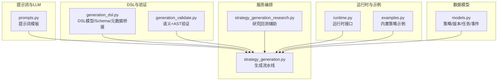
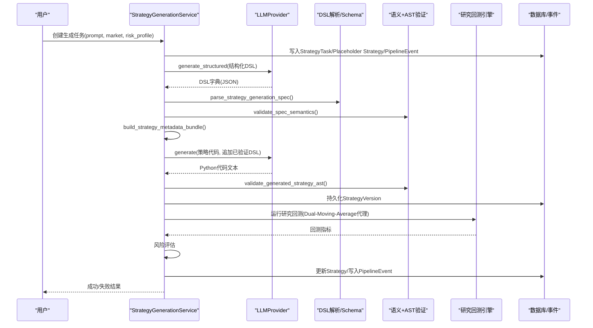
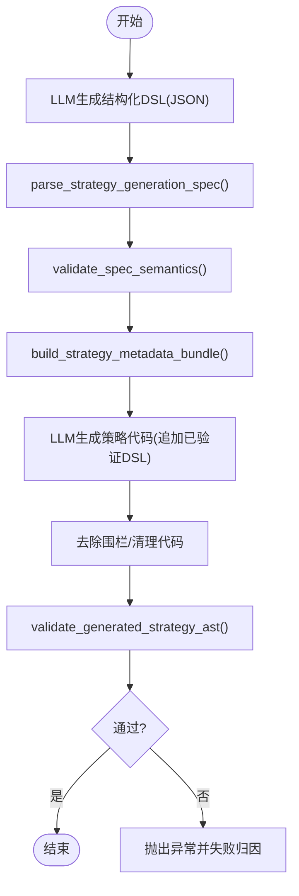
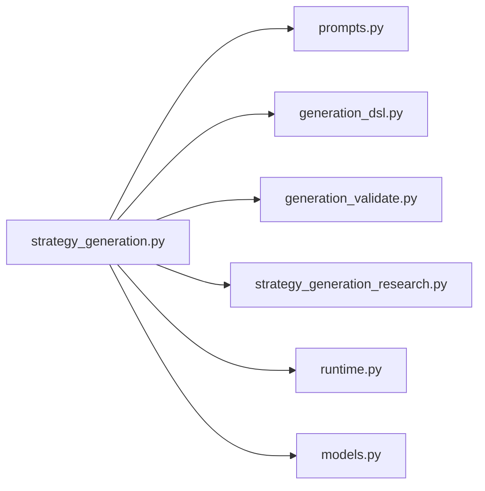

# DSL与代码生成

<cite>
**本文引用的文件**
- [generation_dsl.py](file://backend/app/domains/strategy/generation_dsl.py)
- [generation_validate.py](file://backend/app/domains/strategy/generation_validate.py)
- [prompts.py](file://backend/app/integrations/llm/prompts.py)
- [strategy_generation.py](file://backend/app/services/strategy_generation.py)
- [strategy_generation_research.py](file://backend/app/services/strategy_generation_research.py)
- [runtime.py](file://backend/app/domains/strategy/runtime.py)
- [examples.py](file://backend/app/domains/strategy/examples.py)
- [models.py](file://backend/app/domains/strategy/models.py)
- [test_strategy_generation_dsl.py](file://backend/tests/domains/test_strategy_generation_dsl.py)
- [test_strategy_generation_validate.py](file://backend/tests/domains/test_strategy_generation_validate.py)
- [test_strategy_generation_e2e.py](file://backend/tests/services/test_strategy_generation_e2e.py)
- [2026-05-11-phase2-llm-dsl.md](file://doc/log/2026-05-11-phase2-llm-dsl.md)
- [2026-05-11-phase2-generation-validate.md](file://doc/log/2026-05-11-phase2-generation-validate.md)
</cite>

## 目录
1. [引言](#引言)
2. [项目结构](#项目结构)
3. [核心组件](#核心组件)
4. [架构总览](#架构总览)
5. [详细组件分析](#详细组件分析)
6. [依赖分析](#依赖分析)
7. [性能考虑](#性能考虑)
8. [故障排查指南](#故障排查指南)
9. [结论](#结论)
10. [附录](#附录)

## 引言
本文件面向“策略生成规范的DSL解析与代码生成”主题，系统性梳理从自然语言到结构化DSL再到Python策略代码的全链路流程。重点包括：
- DSL语法结构与JSON Schema定义
- 语义与AST双重验证规则
- 自然语言到DSL的提示词工程与模型温度调优
- DSL到Python策略代码的生成算法与静态检查
- 错误恢复与流水线失败分类
- 示例与调试技巧

## 项目结构
围绕策略生成的核心代码主要分布在以下模块：
- DSL定义与JSON Schema生成：generation_dsl.py
- DSL语义与AST验证：generation_validate.py
- LLM提示词与结构化输出：prompts.py
- 策略生成服务编排：strategy_generation.py
- 研究回测辅助（参数映射与默认研究集合）：strategy_generation_research.py
- 运行时接口与内置策略示例：runtime.py、examples.py
- 数据模型：models.py
- 单元测试与端到端测试：多处test_*.py

图表来源
- [prompts.py:1-94](file://backend/app/integrations/llm/prompts.py#L1-L94)
- [generation_dsl.py:1-144](file://backend/app/domains/strategy/generation_dsl.py#L1-L144)
- [generation_validate.py:1-216](file://backend/app/domains/strategy/generation_validate.py#L1-L216)
- [strategy_generation.py:1-584](file://backend/app/services/strategy_generation.py#L1-L584)
- [strategy_generation_research.py:1-81](file://backend/app/services/strategy_generation_research.py#L1-L81)
- [runtime.py:1-240](file://backend/app/domains/strategy/runtime.py#L1-L240)
- [examples.py:1-368](file://backend/app/domains/strategy/examples.py#L1-L368)
- [models.py:1-84](file://backend/app/domains/strategy/models.py#L1-L84)

章节来源
- [generation_dsl.py:1-144](file://backend/app/domains/strategy/generation_dsl.py#L1-L144)
- [generation_validate.py:1-216](file://backend/app/domains/strategy/generation_validate.py#L1-L216)
- [prompts.py:1-94](file://backend/app/integrations/llm/prompts.py#L1-L94)
- [strategy_generation.py:1-584](file://backend/app/services/strategy_generation.py#L1-L584)
- [strategy_generation_research.py:1-81](file://backend/app/services/strategy_generation_research.py#L1-L81)
- [runtime.py:1-240](file://backend/app/domains/strategy/runtime.py#L1-L240)
- [examples.py:1-368](file://backend/app/domains/strategy/examples.py#L1-L368)
- [models.py:1-84](file://backend/app/domains/strategy/models.py#L1-L84)

## 核心组件
- DSL模型与JSON Schema
  - 定义策略类型、因子、过滤器、调仓频率、头寸与风控规则，并通过Pydantic严格校验，禁止未知字段。
  - 提供DSL到历史元数据键的映射，便于落库与UI展示。
- 语义与AST验证
  - 依据风险画像与市场限制进行参数范围校验。
  - 通过AST扫描拒绝未来函数使用（负移位、负变化率等）。
- LLM提示词与结构化输出
  - 两阶段提示：先结构化DSL，再基于已验证的DSL生成策略代码。
  - 温度参数固定为低噪声值，确保输出稳定。
- 生成服务编排
  - 端到端流水线：研究扫描、DSL生成与校验、代码生成与校验、版本持久化、研究回测、风险评估、发布。
  - 失败阶段自动识别与归因，记录PipelineEvent并回滚状态。

章节来源
- [generation_dsl.py:78-144](file://backend/app/domains/strategy/generation_dsl.py#L78-L144)
- [generation_validate.py:48-216](file://backend/app/domains/strategy/generation_validate.py#L48-L216)
- [prompts.py:57-94](file://backend/app/integrations/llm/prompts.py#L57-L94)
- [strategy_generation.py:445-514](file://backend/app/services/strategy_generation.py#L445-L514)
- [models.py:9-84](file://backend/app/domains/strategy/models.py#L9-L84)

## 架构总览
下图展示了从自然语言到策略代码与回测的关键交互：

图表来源
- [strategy_generation.py:132-373](file://backend/app/services/strategy_generation.py#L132-L373)
- [prompts.py:57-94](file://backend/app/integrations/llm/prompts.py#L57-L94)
- [generation_dsl.py:98-144](file://backend/app/domains/strategy/generation_dsl.py#L98-L144)
- [generation_validate.py:107-216](file://backend/app/domains/strategy/generation_validate.py#L107-L216)
- [strategy_generation_research.py:15-81](file://backend/app/services/strategy_generation_research.py#L15-L81)

## 详细组件分析

### DSL语法与JSON Schema
- 字段与约束
  - 策略类型：rule/ml/portfolio
  - 因子：名称、类型、描述、参数字典
  - 过滤器：字段、操作符、值（支持between/in）
  - 调仓频率：1d/1w/2w/1m
  - 头寸规则：总敞口、单只权重上限、最小/最大持仓数
  - 风控规则：最大组合回撤、个股止损、行业权重上限
- 关键校验
  - extra="forbid"禁止未知字段
  - between必须为长度2列表，in必须为非空列表
  - max_positions >= min_positions
  - 非portfolio策略至少需要一个因子
- JSON Schema生成
  - 通过model_json_schema()输出给LLM结构化生成

章节来源
- [generation_dsl.py:14-18](file://backend/app/domains/strategy/generation_dsl.py#L14-L18)
- [generation_dsl.py:20-96](file://backend/app/domains/strategy/generation_dsl.py#L20-L96)
- [generation_dsl.py:103-106](file://backend/app/domains/strategy/generation_dsl.py#L103-L106)
- [test_strategy_generation_dsl.py:17-64](file://backend/tests/domains/test_strategy_generation_dsl.py#L17-L64)

### DSL到Python策略代码的生成算法
- 两阶段提示词
  - 先以结构化DSL提示词生成JSON，再将已验证的DSL作为附加内容追加到策略代码提示词中，要求生成的类与DSL保持一致。
- 代码清理
  - 去除可能的Markdown围栏，仅保留纯Python代码。
- AST静态检查
  - 必须存在至少一个类定义
  - 类必须继承RuleBasedStrategy或BaseStrategy，并实现对应方法集
  - 禁止未来函数：负移位、负变化率、负滚动等

图表来源
- [strategy_generation.py:445-514](file://backend/app/services/strategy_generation.py#L445-L514)
- [generation_validate.py:107-216](file://backend/app/domains/strategy/generation_validate.py#L107-L216)

章节来源
- [prompts.py:57-94](file://backend/app/integrations/llm/prompts.py#L57-L94)
- [strategy_generation.py:445-514](file://backend/app/services/strategy_generation.py#L445-L514)
- [generation_validate.py:107-216](file://backend/app/domains/strategy/generation_validate.py#L107-L216)

### AST静态检查机制与代码验证规则
- AST扫描要点
  - 禁止负移位(shift/n_periods)
  - 禁止负变化率(pct_change/diff)
  - 禁止负滚动(np.roll/roll)
- 接口契约
  - RuleBasedStrategy：generate_signals + risk_check
  - BaseStrategy：generate_signals + rebalance
- 未来函数防护
  - 通过关键字与模式匹配识别未来数据使用迹象

章节来源
- [generation_validate.py:154-216](file://backend/app/domains/strategy/generation_validate.py#L154-L216)
- [runtime.py:175-204](file://backend/app/domains/strategy/runtime.py#L175-L204)

### 自然语言到DSL的转换与提示词工程
- 提示词设计
  - 系统提示限定输出格式、可用列、风险约束与禁止未来函数
  - 用户提示包含市场、风险画像与用户描述
  - 结构化DSL提示强调snake_case键、因子/过滤器形态、调仓频率与风控块
- 模型温度
  - 代码生成阶段使用低温度（0.2）保证一致性
- 输出格式标准化
  - 结构化输出通过JSON Schema约束
  - 代码输出去除围栏，仅保留类定义

章节来源
- [prompts.py:3-25](file://backend/app/integrations/llm/prompts.py#L3-L25)
- [prompts.py:57-94](file://backend/app/integrations/llm/prompts.py#L57-L94)
- [strategy_generation.py:456-462](file://backend/app/services/strategy_generation.py#L456-L462)

### 研究回测与参数映射
- 参数映射
  - 将DSL中的position_rules与factors映射为内置Dual-Moving-Average策略参数，作为研究回测代理
- 默认研究集合
  - 基于数据库中每日K线数量选择足够样本的标的作为研究集合

章节来源
- [strategy_generation_research.py:15-47](file://backend/app/services/strategy_generation_research.py#L15-L47)
- [strategy_generation_research.py:49-81](file://backend/app/services/strategy_generation_research.py#L49-L81)
- [examples.py:21-49](file://backend/app/domains/strategy/examples.py#L21-L49)

### 运行时接口与内置策略
- 运行时接口
  - BaseStrategy定义initialize/generate_signals/rebalance生命周期
  - StrategyContext/StrategyState/StrategySignal/RebalancePlan等数据结构
- 内置策略示例
  - DualMovingAverageStrategy/MomentumStrategy/MeanReversionStrategy
  - 用于对照与回归测试

章节来源
- [runtime.py:175-240](file://backend/app/domains/strategy/runtime.py#L175-L240)
- [examples.py:51-200](file://backend/app/domains/strategy/examples.py#L51-L200)

## 依赖分析
- 组件耦合
  - StrategyGenerationService依赖LLM提示词、DSL解析、验证模块、研究回测辅助与运行时接口
  - generation_dsl与generation_validate相互独立但共同服务于生成阶段
- 外部依赖
  - LLMProvider（OpenAI/Anthropic/Mock）
  - SQLAlchemy（数据库访问）
  - Pydantic（结构化校验）

图表来源
- [strategy_generation.py:1-584](file://backend/app/services/strategy_generation.py#L1-L584)
- [prompts.py:1-94](file://backend/app/integrations/llm/prompts.py#L1-L94)
- [generation_dsl.py:1-144](file://backend/app/domains/strategy/generation_dsl.py#L1-L144)
- [generation_validate.py:1-216](file://backend/app/domains/strategy/generation_validate.py#L1-L216)
- [strategy_generation_research.py:1-81](file://backend/app/services/strategy_generation_research.py#L1-L81)
- [runtime.py:1-240](file://backend/app/domains/strategy/runtime.py#L1-L240)
- [models.py:1-84](file://backend/app/domains/strategy/models.py#L1-L84)

## 性能考虑
- LLM调用成本控制
  - 使用结构化输出减少重生成概率
  - 固定低温度降低输出波动带来的重复调用
- 验证阶段优化
  - AST扫描复杂度与代码规模线性相关，建议控制单类代码体量
  - 过滤器与因子数量上限在DSL层即受控
- 数据访问
  - 研究回测前的默认集合查询使用聚合与分组，注意索引与数据量

## 故障排查指南
- 常见失败阶段与原因
  - DSL结构错误：未知字段、between/in格式不正确、因子缺失
  - 语义冲突：单票权重/回撤上限超限、因子窗口越界、非法市场
  - AST违规：缺少类/接口不匹配、未来函数使用
  - 代码生成失败：LLM结构化输出失败或代码不符合接口契约
  - 回测失败：无有效K线、数据范围不足
- 失败归因与事件
  - 服务根据异常类型与消息关键词自动判定失败阶段，并写入PipelineEvent
  - 失败时回滚策略状态至draft，保留诊断信息

章节来源
- [strategy_generation.py:308-373](file://backend/app/services/strategy_generation.py#L308-L373)
- [test_strategy_generation_e2e.py:214-247](file://backend/tests/services/test_strategy_generation_e2e.py#L214-L247)

## 结论
该系统通过“结构化DSL优先”的方式，将LLM输出收敛到受控形状，配合严格的语义与AST验证，确保生成策略在接口契约、参数范围与未来函数方面均符合规范。研究回测代理与特征溯源进一步完善了从意图到可审计落地的闭环。建议在生产环境中持续完善未来函数白名单与更丰富的因子参数校验，并扩展真实回测引擎以统一策略接口。

## 附录

### DSL语法示例与JSON Schema
- DSL字段与取值范围
  - 策略类型：rule/ml/portfolio
  - 因子类型：momentum/value/quality/volatility/size/custom
  - 操作符：eq/ne/gt/gte/lt/lte/between/in
  - 调仓频率：1d/1w/2w/1m
  - 头寸规则：总敞口与单只权重在[0,1]，最小/最大持仓数在[1,500]
  - 风控规则：最大组合回撤在(0,1]，止损与行业权重在(0,1]或None
- JSON Schema生成
  - 通过model_json_schema()输出，键名采用snake_case，与提示词约束一致

章节来源
- [generation_dsl.py:14-96](file://backend/app/domains/strategy/generation_dsl.py#L14-L96)
- [generation_dsl.py:103-106](file://backend/app/domains/strategy/generation_dsl.py#L103-L106)

### 代码生成模板与接口契约
- RuleBasedStrategy模板
  - generate_signals(data: pd.DataFrame) -> pd.Series
  - risk_check(signals: pd.Series, portfolio: dict) -> pd.Series
- BaseStrategy模板
  - generate_signals(context, bars, state) -> Sequence[StrategySignal]
  - rebalance(context, signals, state) -> RebalancePlan

章节来源
- [prompts.py:5-25](file://backend/app/integrations/llm/prompts.py#L5-L25)
- [runtime.py:175-204](file://backend/app/domains/strategy/runtime.py#L175-L204)

### 调试技巧
- 使用Mock LLM Provider进行端到端回归测试
- 在生成阶段打印已验证的DSL JSON，核对与生成代码的一致性
- 通过单元测试覆盖边界条件（between/in、因子窗口、未来字段检测）
- 在本地导入少量K线进行研究回测验证

章节来源
- [test_strategy_generation_dsl.py:85-96](file://backend/tests/domains/test_strategy_generation_dsl.py#L85-L96)
- [test_strategy_generation_validate.py:12-148](file://backend/tests/domains/test_strategy_generation_validate.py#L12-L148)
- [test_strategy_generation_e2e.py:87-213](file://backend/tests/services/test_strategy_generation_e2e.py#L87-L213)