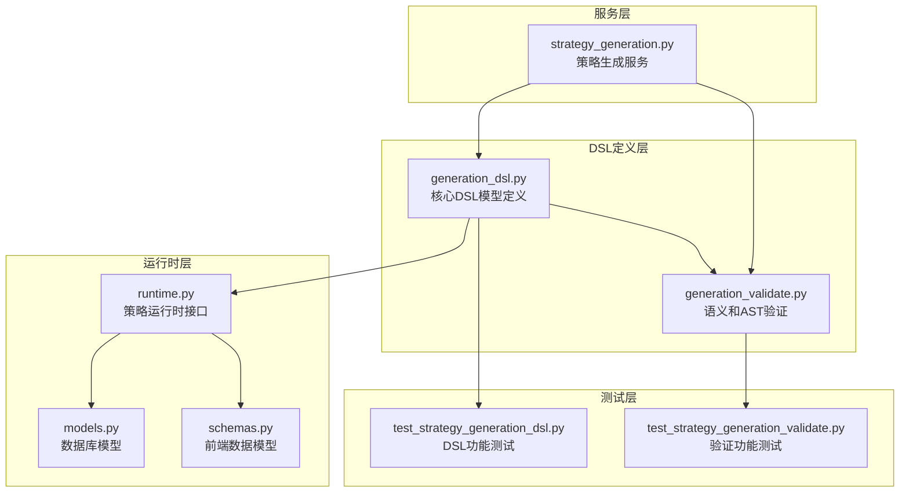
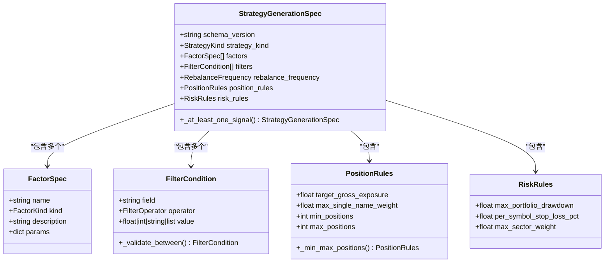
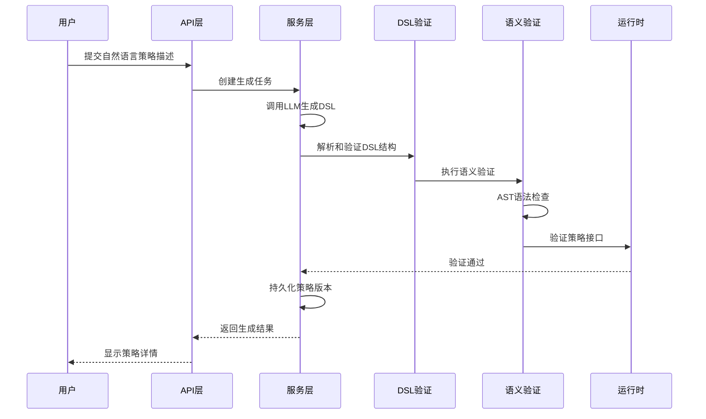
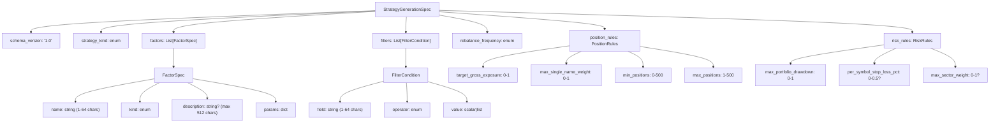
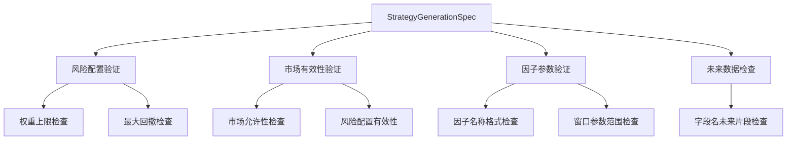
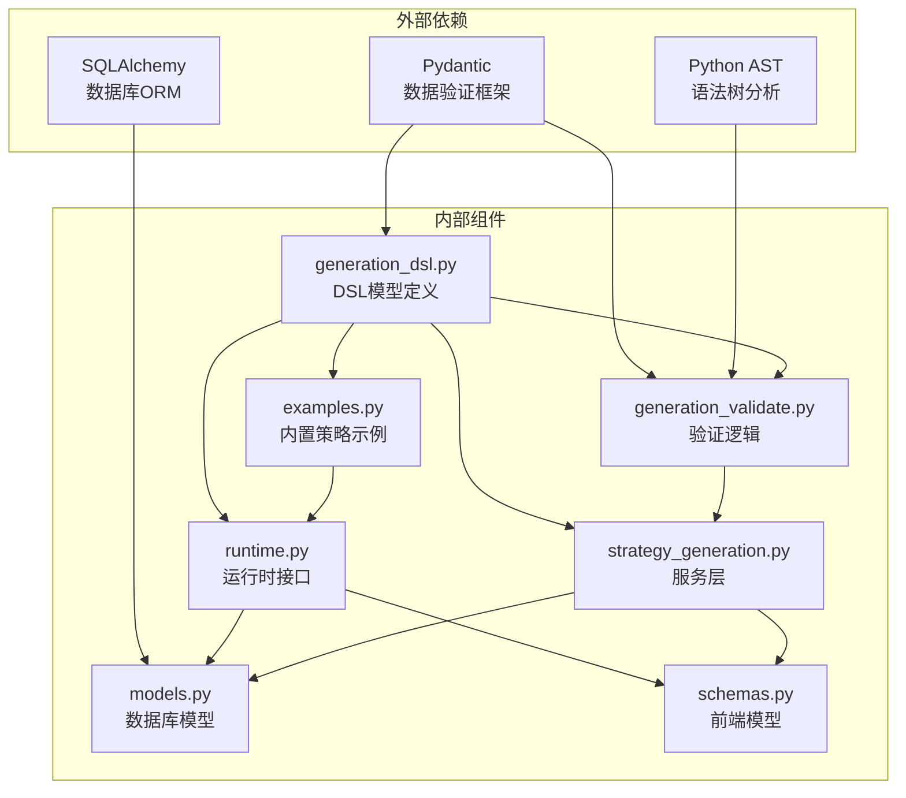

# DSL语法定义

<cite>
**本文档引用的文件**
- [generation_dsl.py](file://backend/app/domains/strategy/generation_dsl.py)
- [generation_validate.py](file://backend/app/domains/strategy/generation_validate.py)
- [test_strategy_generation_dsl.py](file://backend/tests/domains/test_strategy_generation_dsl.py)
- [test_strategy_generation_validate.py](file://backend/tests/domains/test_strategy_generation_validate.py)
- [examples.py](file://backend/app/domains/strategy/examples.py)
- [runtime.py](file://backend/app/domains/strategy/runtime.py)
- [models.py](file://backend/app/domains/strategy/models.py)
- [schemas.py](file://backend/app/domains/strategy/schemas.py)
- [strategy_generation.py](file://backend/app/services/strategy_generation.py)
</cite>

## 目录
1. [简介](#简介)
2. [项目结构](#项目结构)
3. [核心组件](#核心组件)
4. [架构概览](#架构概览)
5. [详细组件分析](#详细组件分析)
6. [依赖关系分析](#依赖关系分析)
7. [性能考虑](#性能考虑)
8. [故障排除指南](#故障排除指南)
9. [结论](#结论)
10. [附录](#附录)

## 简介

本文件详细解析了AI策略生成DSL（Domain Specific Language）的完整语法定义。该DSL用于将自然语言描述转换为结构化的策略规范，支持规则型、机器学习型和组合型策略的生成。系统通过严格的JSON Schema验证确保策略规范的完整性和一致性，同时提供语义验证和AST验证来防止未来数据泄漏等风险。

## 项目结构

DSL语法定义主要分布在以下关键文件中：



**图表来源**
- [generation_dsl.py:1-144](file://backend/app/domains/strategy/generation_dsl.py#L1-L144)
- [generation_validate.py:1-216](file://backend/app/domains/strategy/generation_validate.py#L1-L216)

**章节来源**
- [generation_dsl.py:1-144](file://backend/app/domains/strategy/generation_dsl.py#L1-L144)
- [generation_validate.py:1-216](file://backend/app/domains/strategy/generation_validate.py#L1-L216)

## 核心组件

### StrategyGenerationSpec 根模型

`StrategyGenerationSpec` 是DSL的根模型，定义了完整的策略规范结构：



**图表来源**
- [generation_dsl.py:78-96](file://backend/app/domains/strategy/generation_dsl.py#L78-L96)
- [generation_dsl.py:20-29](file://backend/app/domains/strategy/generation_dsl.py#L20-L29)
- [generation_dsl.py:31-49](file://backend/app/domains/strategy/generation_dsl.py#L31-L49)
- [generation_dsl.py:51-66](file://backend/app/domains/strategy/generation_dsl.py#L51-L66)
- [generation_dsl.py:68-76](file://backend/app/domains/strategy/generation_dsl.py#L68-L76)

**章节来源**
- [generation_dsl.py:78-96](file://backend/app/domains/strategy/generation_dsl.py#L78-L96)

## 架构概览

DSL系统的整体架构采用分层设计，确保从自然语言到可执行策略的完整转换流程：



**图表来源**
- [strategy_generation.py:132-200](file://backend/app/services/strategy_generation.py#L132-L200)
- [generation_dsl.py:98-106](file://backend/app/domains/strategy/generation_dsl.py#L98-L106)
- [generation_validate.py:48-87](file://backend/app/domains/strategy/generation_validate.py#L48-L87)

## 详细组件分析

### 数据类型定义

#### 策略类型枚举（StrategyKind）

策略类型决定了策略的生成方式和行为特征：

| 类型 | 描述 | 特征 |
|------|------|------|
| `"rule"` | 规则型策略 | 基于明确的交易规则和信号生成器 |
| `"ml"` | 机器学习策略 | 使用机器学习模型进行预测和决策 |
| `"portfolio"` | 组合型策略 | 由多个子策略或资产组成的投资组合 |

#### 因子类型分类（FactorKind）

因子类型定义了策略中使用的信号或指标类别：

| 类型 | 描述 | 示例场景 |
|------|------|----------|
| `"momentum"` | 动量因子 | 趋势跟踪、价格动量分析 |
| `"value"` | 价值因子 | 估值指标、相对价值比较 |
| `"quality"` | 质量因子 | 公司基本面质量评估 |
| `"volatility"` | 波动率因子 | 风险度量、均值回归策略 |
| `"size"` | 规模因子 | 市值大小影响、流动性考虑 |
| `"custom"` | 自定义因子 | 用户自定义的特定因子 |

#### 过滤器操作符（FilterOperator）

过滤器操作符定义了市场筛选的逻辑关系：

| 操作符 | 描述 | 参数要求 | 示例 |
|--------|------|----------|------|
| `"eq"` | 等于 | 标量值 | `{"field": "sector", "operator": "eq", "value": "tech"}` |
| `"ne"` | 不等于 | 标量值 | `{"field": "country", "operator": "ne", "value": "US"}` |
| `"gt"` | 大于 | 数值 | `{"field": "pe", "operator": "gt", "value": 15}` |
| `"gte"` | 大于等于 | 数值 | `{"field": "market_cap", "operator": "gte", "value": 1000000000}` |
| `"lt"` | 小于 | 数值 | `{"field": "debt_equity", "operator": "lt", "value": 0.5}` |
| `"lte"` | 小于等于 | 数值 | `{"field": "beta", "operator": "lte", "value": 1.2}` |
| `"between"` | 在范围内 | 两元素数组 | `{"field": "price", "operator": "between", "value": [10, 50]}` |
| `"in"` | 在集合中 | 非空列表 | `{"field": "symbol", "operator": "in", "value": ["AAPL", "MSFT", "GOOGL"]}` |

#### 重平衡频率（RebalanceFrequency）

重平衡频率定义了策略重新调整持仓的时间间隔：

| 频率 | 含义 | 适用场景 |
|------|------|----------|
| `"1d"` | 每日 | 高频交易、日内策略 |
| `"1w"` | 每周 | 中期趋势策略 |
| `"2w"` | 每两周 | 季节性策略 |
| `"1m"` | 每月 | 长期价值投资策略 |

### 字段约束和验证规则

#### StrategyGenerationSpec 根模型约束

| 字段名 | 类型 | 必填 | 默认值 | 约束条件 | 验证逻辑 |
|--------|------|------|--------|----------|----------|
| `schema_version` | `"1.0"` | 是 | `"1.0"` | 严格匹配 | 固定值验证 |
| `strategy_kind` | `StrategyKind` | 是 | 无 | 枚举值 | 类型检查 |
| `factors` | `List[FactorSpec]` | 否 | `[]` | 最大长度32 | 列表长度限制 |
| `filters` | `List[FilterCondition]` | 否 | `[]` | 最大长度64 | 列表长度限制 |
| `rebalance_frequency` | `RebalanceFrequency` | 否 | `"1d"` | 枚举值 | 默认值设置 |
| `position_rules` | `PositionRules` | 否 | 自动生成 | 对象验证 | 嵌套模型验证 |
| `risk_rules` | `RiskRules` | 否 | 自动生成 | 对象验证 | 嵌套模型验证 |

#### FactorSpec 因子规格约束

| 字段名 | 类型 | 必填 | 默认值 | 约束条件 | 验证逻辑 |
|--------|------|------|--------|----------|----------|
| `name` | `str` | 是 | 无 | 长度1-64字符 | 长度范围检查 |
| `kind` | `FactorKind` | 是 | 无 | 枚举值 | 类型和取值验证 |
| `description` | `str` | 否 | `None` | 最大长度512字符 | 可选字段验证 |
| `params` | `dict[str, float|int|str]` | 否 | `{}` | 任意键值对 | 参数字典验证 |

#### FilterCondition 过滤条件约束

| 字段名 | 类型 | 必填 | 默认值 | 约束条件 | 验证逻辑 |
|--------|------|------|--------|----------|----------|
| `field` | `str` | 是 | 无 | 长度1-64字符 | 字段名验证 |
| `operator` | `FilterOperator` | 是 | 无 | 枚举值 | 操作符验证 |
| `value` | `float|int|string|list` | 是 | 无 | 根据操作符动态验证 | 条件验证 |

#### PositionRules 仓位规则约束

| 字段名 | 类型 | 必填 | 默认值 | 约束条件 | 验证逻辑 |
|--------|------|------|--------|----------|----------|
| `target_gross_exposure` | `float` | 否 | `1.0` | `0.0 ≤ x ≤ 1.0` | 范围检查 |
| `max_single_name_weight` | `float` | 否 | `0.1` | `0.0 < x ≤ 1.0` | 范围检查 |
| `min_positions` | `int` | 否 | `1` | `0 ≤ x ≤ 500` | 范围检查 |
| `max_positions` | `int` | 否 | `50` | `1 ≤ x ≤ 500` | 范围检查 |

#### RiskRules 风控规则约束

| 字段名 | 类型 | 必填 | 默认值 | 约束条件 | 验证逻辑 |
|--------|------|------|--------|----------|----------|
| `max_portfolio_drawdown` | `float` | 否 | `0.2` | `0.0 < x ≤ 1.0` | 范围检查 |
| `per_symbol_stop_loss_pct` | `float` | 否 | `None` | `0.0 < x ≤ 0.5` | 可选字段范围检查 |
| `max_sector_weight` | `float` | 否 | `None` | `0.0 < x ≤ 1.0` | 可选字段范围检查 |

### JSON Schema 定义

DSL的完整JSON Schema定义如下：



**图表来源**
- [generation_dsl.py:78-106](file://backend/app/domains/strategy/generation_dsl.py#L78-L106)

### 验证规则详解

#### 结构验证（Pydantic模型）

所有DSL模型都采用严格的结构验证：

1. **额外字段拒绝**：启用`extra="forbid"`确保无未知字段
2. **类型强制**：每个字段都有明确的类型定义
3. **长度限制**：字符串字段有最大长度限制
4. **数值范围**：数值字段有合理的上下界

#### 语义验证

语义验证确保策略规范符合业务逻辑和风险管理要求：



**图表来源**
- [generation_validate.py:48-87](file://backend/app/domains/strategy/generation_validate.py#L48-L87)

#### AST验证

AST验证防止生成代码中的未来数据泄漏：

| 检查类型 | 检测模式 | 防护机制 |
|----------|----------|----------|
| 负数位移 | `.shift(-1)`, `.shift(periods=-1)` | 拒绝负数参数 |
| 负数变化率 | `.pct_change(-1)`, `.diff(-1)` | 拒绝负数周期 |
| 负数滚动 | `np.roll(..., -5)` | 检测负数常量 |
| 未来字段名 | 包含`_t+`, `next_`, `future_`等 | 字段名模式匹配 |

**章节来源**
- [generation_validate.py:107-216](file://backend/app/domains/strategy/generation_validate.py#L107-L216)

## 依赖关系分析

DSL系统各组件之间的依赖关系如下：



**图表来源**
- [generation_dsl.py:12-17](file://backend/app/domains/strategy/generation_dsl.py#L12-L17)
- [generation_validate.py:14-17](file://backend/app/domains/strategy/generation_validate.py#L14-L17)

**章节来源**
- [generation_dsl.py:12-17](file://backend/app/domains/strategy/generation_dsl.py#L12-L17)
- [generation_validate.py:14-17](file://backend/app/domains/strategy/generation_validate.py#L14-L17)

## 性能考虑

### 验证性能优化

1. **延迟验证**：使用Pydantic的延迟验证减少不必要的计算
2. **短路检查**：在早期阶段快速失败，避免后续复杂验证
3. **缓存策略**：对重复的验证结果进行缓存

### 内存管理

1. **数据类冻结**：使用`frozen=True`确保不可变性
2. **槽优化**：使用`slots=True`减少内存占用
3. **映射代理**：使用`MappingProxyType`保护内部状态

## 故障排除指南

### 常见错误类型

| 错误类型 | 触发条件 | 解决方案 |
|----------|----------|----------|
| 结构验证错误 | JSON Schema不匹配 | 检查字段类型和必需字段 |
| 语义验证错误 | 业务规则冲突 | 调整风险配置或参数范围 |
| AST验证错误 | 未来数据泄漏 | 修改代码避免负数位移 |
| 市场配置错误 | 不支持的市场代码 | 使用允许的市场代码 |

### 调试技巧

1. **逐步验证**：先验证基本结构，再进行语义检查
2. **日志记录**：启用详细的验证日志输出
3. **单元测试**：编写针对性的测试用例验证边界条件

**章节来源**
- [test_strategy_generation_dsl.py:30-65](file://backend/tests/domains/test_strategy_generation_dsl.py#L30-L65)
- [test_strategy_generation_validate.py:31-59](file://backend/tests/domains/test_strategy_generation_validate.py#L31-L59)

## 结论

本DSL语法定义提供了完整的策略生成框架，通过严格的结构验证、语义验证和AST验证确保策略的安全性和有效性。系统支持多种策略类型和复杂的参数配置，同时提供了完善的错误处理和调试机制。该设计既保证了灵活性，又确保了系统的稳定性和安全性。

## 附录

### DSL语法示例

#### 最小化规则策略示例

```json
{
  "schema_version": "1.0",
  "strategy_kind": "rule",
  "factors": [
    {
      "name": "ret_20d",
      "kind": "momentum",
      "params": {"window": 20}
    }
  ]
}
```

#### 完整策略配置示例

```json
{
  "schema_version": "1.0",
  "strategy_kind": "rule",
  "factors": [
    {
      "name": "roe",
      "kind": "quality",
      "description": "净资产收益率",
      "params": {"min": 0.15}
    },
    {
      "name": "pe_rank",
      "kind": "value",
      "params": {"max_pct": 30}
    }
  ],
  "filters": [
    {
      "field": "market_cap",
      "operator": "gte",
      "value": 5000000000
    },
    {
      "field": "pe_ttm",
      "operator": "between",
      "value": [5, 40]
    }
  ],
  "rebalance_frequency": "1w",
  "position_rules": {
    "target_gross_exposure": 0.95,
    "max_single_name_weight": 0.08,
    "min_positions": 5,
    "max_positions": 40
  },
  "risk_rules": {
    "max_portfolio_drawdown": 0.18,
    "per_symbol_stop_loss_pct": 0.08,
    "max_sector_weight": 0.35
  }
}
```

### 字段说明表格

#### 根模型字段说明

| 字段名 | 类型 | 必填 | 默认值 | 说明 |
|--------|------|------|--------|------|
| `schema_version` | `"1.0"` | 是 | `"1.0"` | DSL版本标识 |
| `strategy_kind` | `StrategyKind` | 是 | 无 | 策略类型 |
| `factors` | `List[FactorSpec]` | 否 | `[]` | 因子列表 |
| `filters` | `List[FilterCondition]` | 否 | `[]` | 过滤条件列表 |
| `rebalance_frequency` | `RebalanceFrequency` | 否 | `"1d"` | 重平衡频率 |
| `position_rules` | `PositionRules` | 否 | 自动生成 | 仓位控制规则 |
| `risk_rules` | `RiskRules` | 否 | 自动生成 | 风险控制规则 |

#### FactorSpec 字段说明

| 字段名 | 类型 | 必填 | 默认值 | 说明 |
|--------|------|------|--------|------|
| `name` | `str` | 是 | 无 | 因子名称 |
| `kind` | `FactorKind` | 是 | 无 | 因子类型 |
| `description` | `str` | 否 | `None` | 因子描述 |
| `params` | `dict[str, float|int|str]` | 否 | `{}` | 参数配置 |

#### FilterCondition 字段说明

| 字段名 | 类型 | 必填 | 默认值 | 说明 |
|--------|------|------|--------|------|
| `field` | `str` | 是 | 无 | 数据字段名 |
| `operator` | `FilterOperator` | 是 | 无 | 比较操作符 |
| `value` | `float|int|string|list` | 是 | 无 | 比较值 |

#### PositionRules 字段说明

| 字段名 | 类型 | 必填 | 默认值 | 说明 |
|--------|------|------|--------|------|
| `target_gross_exposure` | `float` | 否 | `1.0` | 目标总杠杆率 |
| `max_single_name_weight` | `float` | 否 | `0.1` | 单个股票权重上限 |
| `min_positions` | `int` | 否 | `1` | 最小持仓数量 |
| `max_positions` | `int` | 否 | `50` | 最大持仓数量 |

#### RiskRules 字段说明

| 字段名 | 类型 | 必填 | 默认值 | 说明 |
|--------|------|------|--------|------|
| `max_portfolio_drawdown` | `float` | 否 | `0.2` | 最大组合回撤 |
| `per_symbol_stop_loss_pct` | `float` | 否 | `None` | 单股止损百分比 |
| `max_sector_weight` | `float` | 否 | `None` | 行业权重上限 |