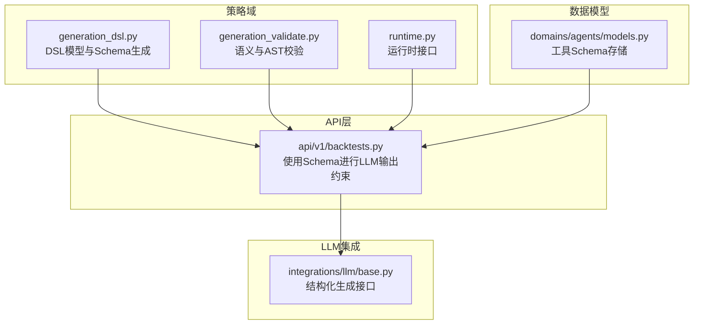
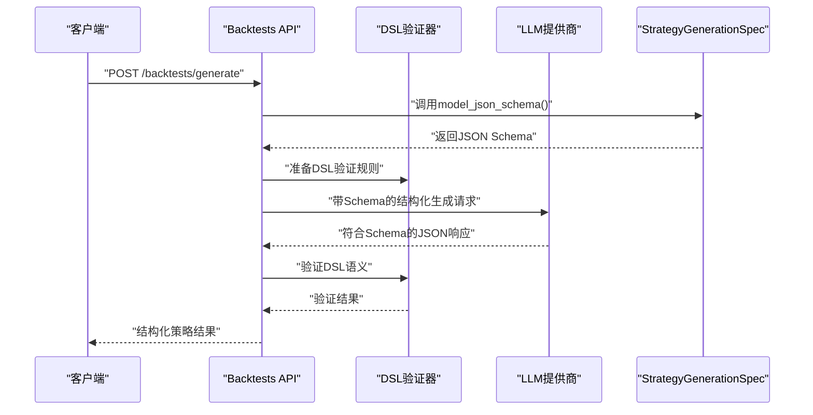
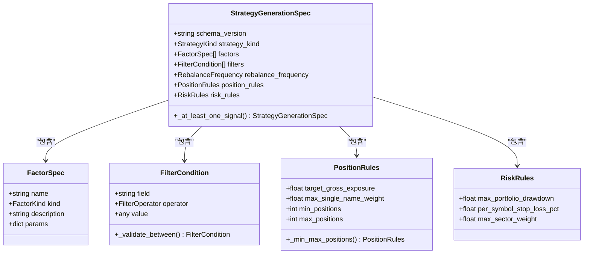
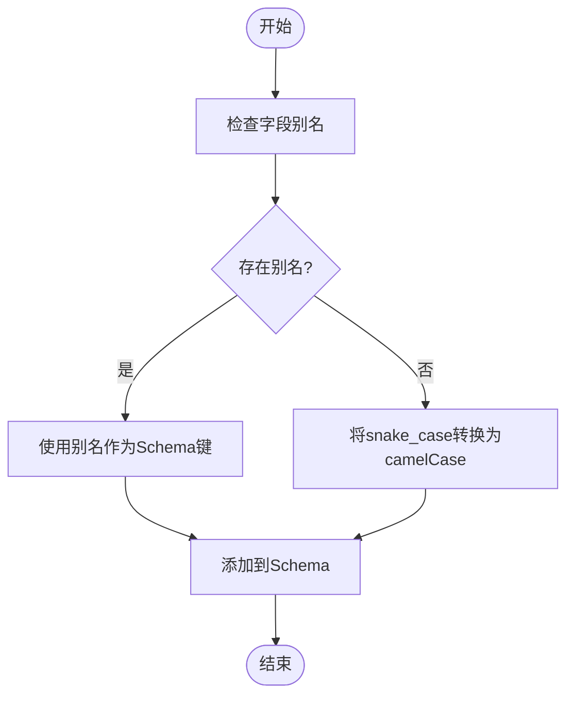
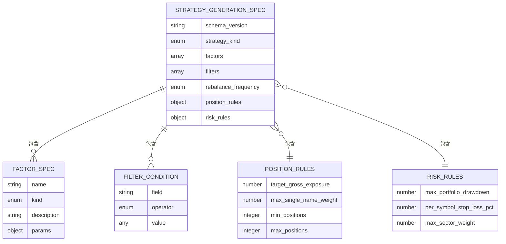
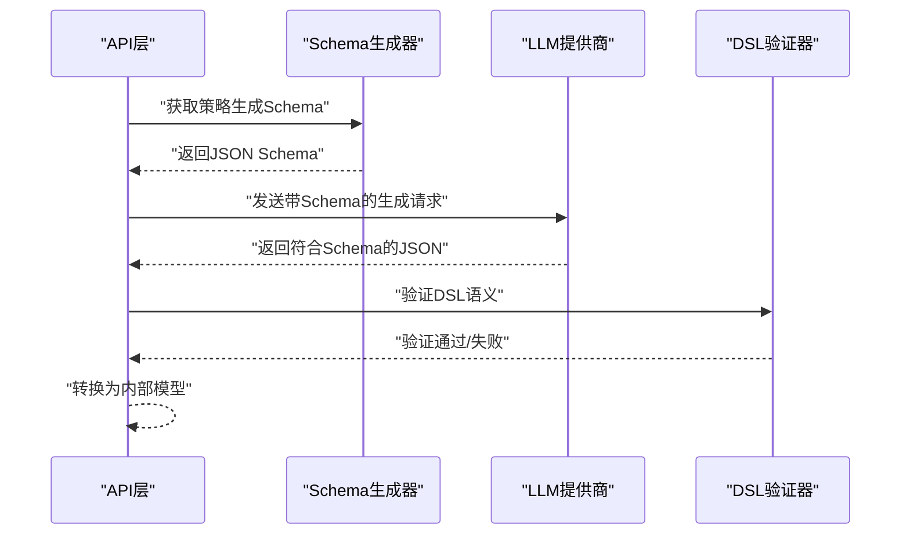
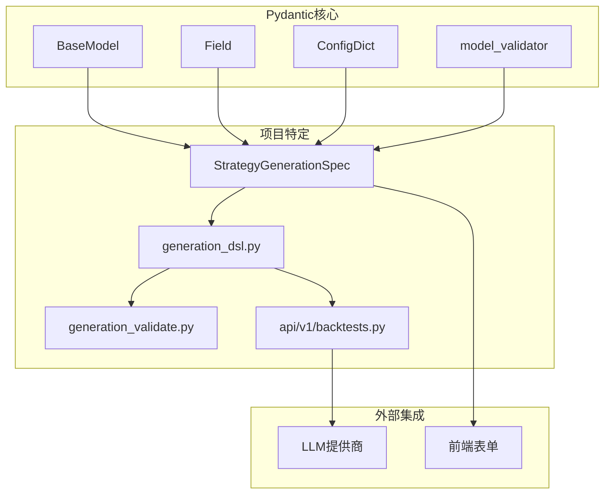

# JSON Schema生成

<cite>
**本文档引用的文件**
- [generation_dsl.py](file://backend/app/domains/strategy/generation_dsl.py)
- [generation_validate.py](file://backend/app/domains/strategy/generation_validate.py)
- [runtime.py](file://backend/app/domains/strategy/runtime.py)
- [models.py](file://backend/app/domains/agents/models.py)
- [base.py](file://backend/app/integrations/llm/base.py)
- [backtests.py](file://backend/app/api/v1/backtests.py)
- [strategy/schemas.py](file://backend/app/domains/strategy/schemas.py)
- [backtest/schemas.py](file://backend/app/domains/backtest/schemas.py)
- [execution/schemas.py](file://backend/app/domains/execution/schemas.py)
</cite>

## 目录
1. [简介](#简介)
2. [项目结构](#项目结构)
3. [核心组件](#核心组件)
4. [架构概览](#架构概览)
5. [详细组件分析](#详细组件分析)
6. [依赖关系分析](#依赖关系分析)
7. [性能考虑](#性能考虑)
8. [故障排除指南](#故障排除指南)
9. [结论](#结论)
10. [附录](#附录)

## 简介
本文件深入解析本项目中基于Pydantic模型的JSON Schema生成机制，重点围绕`model_json_schema()`函数如何从Pydantic模型动态生成JSON Schema定义。文档将详细说明以下方面：
- snake_case命名约定的转换规则
- 字段约束在Schema中的映射
- 枚举类型的处理方式
- 嵌套对象的Schema结构
- Schema在LLM结构化输出中的作用
- 与前端表单验证的集成
- 版本兼容性管理
- 最佳实践与调试技巧

## 项目结构
本项目的JSON Schema生成主要集中在策略域（Strategy Domain）的DSL定义中，通过Pydantic模型自动推导Schema，并在API层用于LLM结构化输出约束。

**图表来源**
- [generation_dsl.py:1-144](file://backend/app/domains/strategy/generation_dsl.py#L1-L144)
- [generation_validate.py:1-216](file://backend/app/domains/strategy/generation_validate.py#L1-L216)
- [runtime.py:1-240](file://backend/app/domains/strategy/runtime.py#L1-L240)
- [backtests.py:480-500](file://backend/app/api/v1/backtests.py#L480-L500)
- [models.py:51-62](file://backend/app/domains/agents/models.py#L51-L62)
- [base.py:60-74](file://backend/app/integrations/llm/base.py#L60-L74)

**章节来源**
- [generation_dsl.py:1-144](file://backend/app/domains/strategy/generation_dsl.py#L1-L144)
- [backtests.py:480-500](file://backend/app/api/v1/backtests.py#L480-L500)

## 核心组件
本项目的核心JSON Schema生成能力由以下组件构成：

### 1. DSL模型定义
策略域的DSL模型通过Pydantic定义了完整的结构约束，包括：
- 基础类型约束（字符串长度、数值范围）
- 复杂对象嵌套（因子、过滤器、风控规则）
- 枚举类型（策略种类、因子种类、操作符等）

### 2. Schema生成函数
`strategy_generation_json_schema()`函数直接委托给Pydantic的`model_json_schema()`方法，确保Schema与模型定义保持同步。

### 3. LLM集成点
API层在调用LLM结构化生成时，将生成的Schema作为约束条件传递给LLM提供商。

**章节来源**
- [generation_dsl.py:78-106](file://backend/app/domains/strategy/generation_dsl.py#L78-L106)
- [backtests.py:488](file://backend/app/api/v1/backtests.py#L488)

## 架构概览
下图展示了从Pydantic模型到JSON Schema再到LLM输出的完整流程：

**图表来源**
- [generation_dsl.py:103-105](file://backend/app/domains/strategy/generation_dsl.py#L103-L105)
- [generation_validate.py:48-86](file://backend/app/domains/strategy/generation_validate.py#L48-L86)
- [base.py:60-74](file://backend/app/integrations/llm/base.py#L60-L74)

## 详细组件分析

### DSL模型与Schema生成
DSL模型是整个Schema生成的核心，包含以下关键特性：

#### 模型类层次结构

**图表来源**
- [generation_dsl.py:20-96](file://backend/app/domains/strategy/generation_dsl.py#L20-L96)

#### 字段约束映射
DSL模型中的各种约束在Schema中得到精确映射：

| Pydantic约束 | JSON Schema映射 | 示例 |
|-------------|----------------|------|
| `Field(..., min_length=1, max_length=64)` | `"type": "string"` + `"maxLength": 64` | 因子名称 |
| `Field(default=0.0003, ge=0.0, le=0.5)` | `"type": "number"` + `"minimum": 0.0` + `"maximum": 0.5` | 手续费率 |
| `Field(default_factory=list, max_length=32)` | `"type": "array"` + `"maxItems": 32` | 因子列表 |
| `Literal["1d", "1w", "2w", "1m"]` | `"enum": ["1d","1w","2w","1m"]` | 再平衡频率 |

**章节来源**
- [generation_dsl.py:20-96](file://backend/app/domains/strategy/generation_dsl.py#L20-L96)

### snake_case命名约定转换
项目采用snake_case作为内部字段命名规范，Schema生成过程中会自动转换为camelCase以匹配前端期望：

#### 命名转换规则

**图表来源**
- [strategy/schemas.py:80-105](file://backend/app/domains/strategy/schemas.py#L80-L105)
- [backtest/schemas.py:94-119](file://backend/app/domains/backtest/schemas.py#L94-L119)

**章节来源**
- [strategy/schemas.py:80-105](file://backend/app/domains/strategy/schemas.py#L80-L105)
- [backtest/schemas.py:94-119](file://backend/app/domains/backtest/schemas.py#L94-L119)

### 枚举类型处理
项目使用Python的`Literal`类型定义枚举值，在Schema中转换为JSON Schema的`enum`：

#### 枚举映射示例
- `StrategyKind = Literal["rule", "ml", "portfolio"]` → `"enum": ["rule","ml","portfolio"]`
- `FactorKind = Literal["momentum", "value", "quality", "volatility", "size", "custom"]` → 六个枚举值
- `FilterOperator = Literal["eq", "ne", "gt", "gte", "lt", "lte", "between", "in"]` → 八个操作符

**章节来源**
- [generation_dsl.py:14-17](file://backend/app/domains/strategy/generation_dsl.py#L14-L17)

### 嵌套对象Schema结构
复杂对象通过Pydantic的嵌套模型自动展开为完整的Schema结构：

#### 嵌套结构示例

**图表来源**
- [generation_dsl.py:78-96](file://backend/app/domains/strategy/generation_dsl.py#L78-L96)

**章节来源**
- [generation_dsl.py:78-96](file://backend/app/domains/strategy/generation_dsl.py#L78-L96)

### LLM结构化输出约束
Schema在LLM输出约束中发挥关键作用：

#### 结构化生成流程

**图表来源**
- [generation_dsl.py:103-105](file://backend/app/domains/strategy/generation_dsl.py#L103-L105)
- [generation_validate.py:48-86](file://backend/app/domains/strategy/generation_validate.py#L48-L86)

**章节来源**
- [generation_dsl.py:103-105](file://backend/app/domains/strategy/generation_dsl.py#L103-L105)
- [generation_validate.py:48-86](file://backend/app/domains/strategy/generation_validate.py#L48-L86)

### 前端表单验证集成
Schema不仅用于LLM约束，还可直接用于前端表单验证：

#### 集成模式
- **实时验证**：前端根据Schema动态生成验证规则
- **错误提示**：基于Schema的约束信息提供用户友好的错误消息
- **UI渲染**：根据Schema类型自动选择合适的输入控件

**章节来源**
- [strategy/schemas.py:129-141](file://backend/app/domains/strategy/schemas.py#L129-L141)

### 版本兼容性管理
项目通过`schema_version`字段实现Schema版本控制：

#### 版本管理策略
- **向后兼容**：新增可选字段不影响现有Schema
- **向前兼容**：严格模式下拒绝未知字段
- **版本迁移**：通过独立的转换函数处理版本差异

**章节来源**
- [generation_dsl.py:83](file://backend/app/domains/strategy/generation_dsl.py#L83)

## 依赖关系分析
Schema生成涉及多个层面的依赖关系：

**图表来源**
- [generation_dsl.py:12-12](file://backend/app/domains/strategy/generation_dsl.py#L12-L12)
- [generation_validate.py:18-18](file://backend/app/domains/strategy/generation_validate.py#L18-L18)
- [backtests.py:488](file://backend/app/api/v1/backtests.py#L488)

**章节来源**
- [generation_dsl.py:12-12](file://backend/app/domains/strategy/generation_dsl.py#L12-L12)
- [generation_validate.py:18-18](file://backend/app/domains/strategy/generation_validate.py#L18-L18)

## 性能考虑
- **Schema缓存**：避免重复生成相同Schema
- **延迟加载**：仅在需要时生成Schema
- **内存优化**：合理使用`default_factory`减少内存占用
- **验证优化**：在API层进行快速验证，减少后续处理开销

## 故障排除指南
### 常见问题与解决方案

#### 1. Schema不一致问题
**症状**：前端验证失败或LLM输出不符合预期  
**排查步骤**：
1. 检查模型字段定义是否正确
2. 验证`model_config`设置
3. 确认别名映射是否准确

#### 2. 枚举值验证失败
**症状**：出现"枚举值不在允许列表中"错误  
**解决方法**：
- 检查`Literal`定义是否完整
- 确认前端传入值与后端枚举一致

#### 3. 嵌套对象验证错误
**症状**：嵌套对象字段报错  
**排查要点**：
- 检查子模型的`extra="forbid"`设置
- 验证嵌套对象的必填字段

**章节来源**
- [generation_dsl.py:23-23](file://backend/app/domains/strategy/generation_dsl.py#L23-L23)
- [generation_validate.py:48-86](file://backend/app/domains/strategy/generation_validate.py#L48-L86)

## 结论
本项目通过Pydantic的强类型系统实现了可靠的JSON Schema生成机制。关键优势包括：
- **类型安全**：编译时检查确保Schema与模型一致性
- **自动推导**：无需手动维护Schema，减少维护成本
- **灵活扩展**：支持复杂的嵌套结构和约束条件
- **生态集成**：无缝对接LLM和前端验证系统

建议在实际使用中重点关注版本管理和性能优化，确保Schema生成的高效性和稳定性。

## 附录

### 最佳实践清单
- 使用`extra="forbid"`确保严格的字段验证
- 合理使用`Field`的约束参数
- 为复杂对象定义清晰的别名映射
- 实施Schema版本控制策略
- 缓存生成的Schema以提升性能

### 调试技巧
- 利用`model_json_schema()`的`ref_template`参数自定义引用格式
- 使用`model_validate()`进行Schema验证测试
- 在开发环境启用详细的错误信息
- 定期对比生成的Schema与预期结果