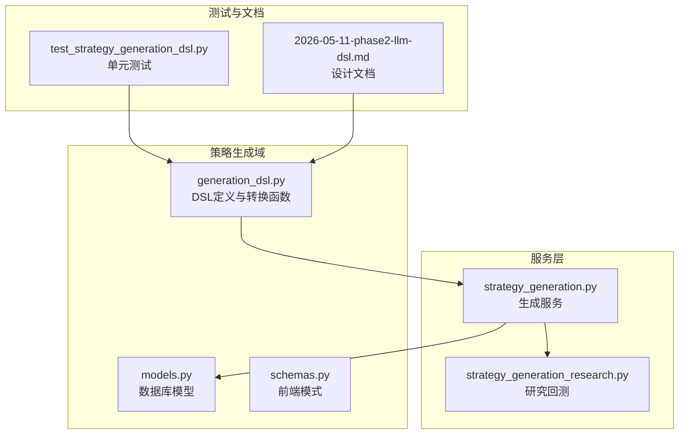
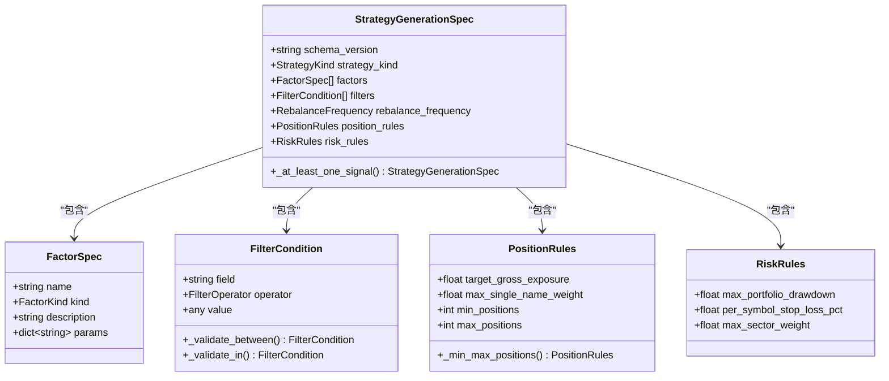
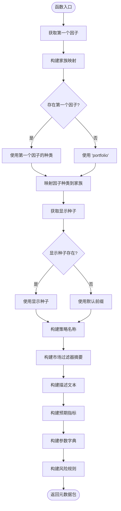
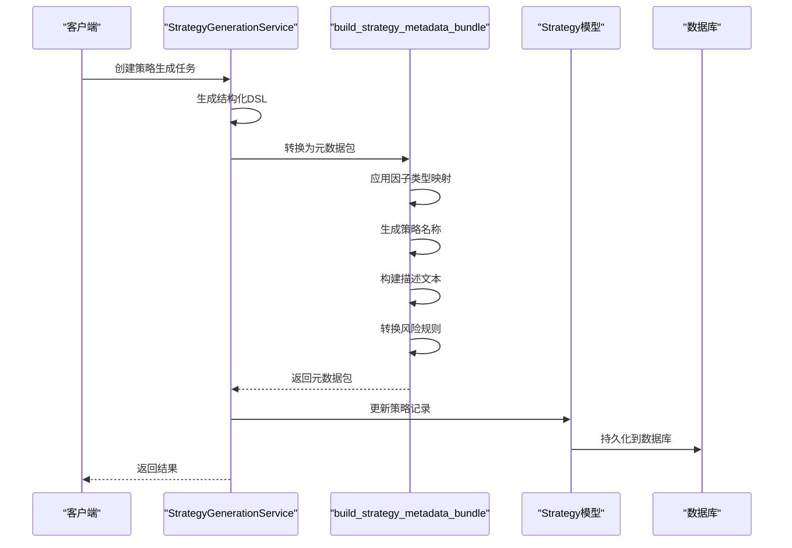
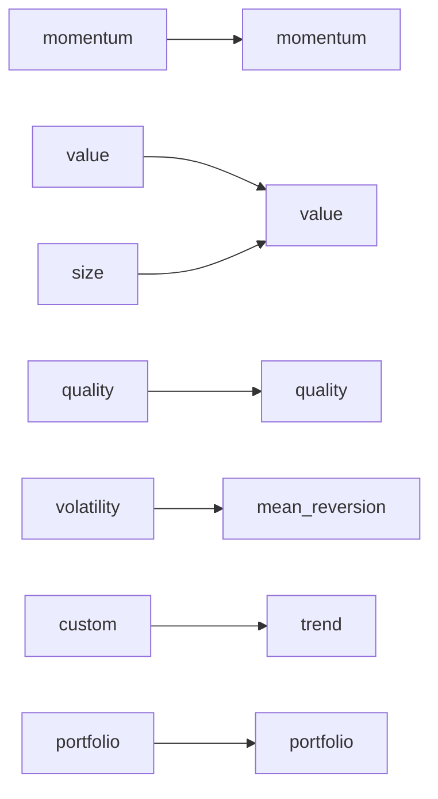
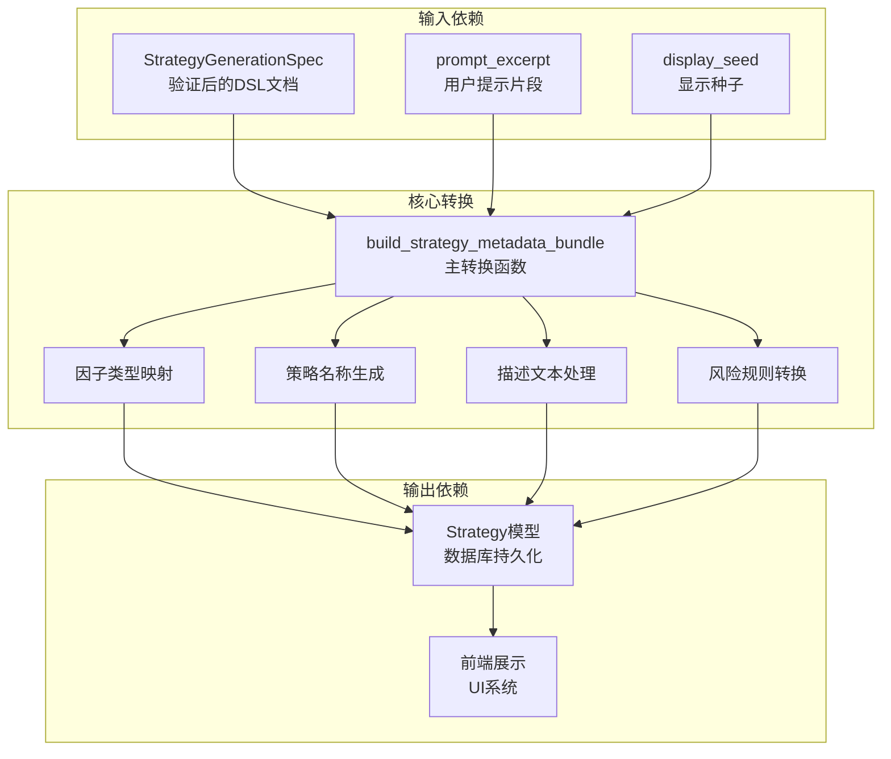

# 元数据包转换

<cite>
**本文档引用的文件**
- [generation_dsl.py](file://backend/app/domains/strategy/generation_dsl.py)
- [strategy_generation.py](file://backend/app/services/strategy_generation.py)
- [models.py](file://backend/app/domains/strategy/models.py)
- [schemas.py](file://backend/app/domains/strategy/schemas.py)
- [test_strategy_generation_dsl.py](file://backend/tests/domains/test_strategy_generation_dsl.py)
- [2026-05-11-phase2-llm-dsl.md](file://doc/log/2026-05-11-phase2-llm-dsl.md)
- [strategy_generation_research.py](file://backend/app/services/strategy_generation_research.py)
</cite>

## 目录
1. [简介](#简介)
2. [项目结构](#项目结构)
3. [核心组件](#核心组件)
4. [架构概览](#架构概览)
5. [详细组件分析](#详细组件分析)
6. [依赖关系分析](#依赖关系分析)
7. [性能考虑](#性能考虑)
8. [故障排除指南](#故障排除指南)
9. [结论](#结论)

## 简介

本文档深入解析了 `build_strategy_metadata_bundle` 函数如何将验证后的DSL文档转换为传统元数据格式。该转换过程是策略生成流水线的关键环节，负责将结构化的策略意图从现代DSL格式映射到传统的元数据键值对，以便与现有的持久化和UI系统兼容。

该转换过程涉及多个重要方面：
- 因子类型到家族映射规则
- 策略名称生成逻辑
- 描述文本截取策略
- 风险规则的转换映射
- 显示种子的作用机制
- 前缀截断的边界处理
- 兼容性设计考虑

## 项目结构

策略元数据包转换功能主要分布在以下文件中：

**图表来源**
- [generation_dsl.py:1-144](file://backend/app/domains/strategy/generation_dsl.py#L1-L144)
- [strategy_generation.py:1-584](file://backend/app/services/strategy_generation.py#L1-L584)

**章节来源**
- [generation_dsl.py:1-144](file://backend/app/domains/strategy/generation_dsl.py#L1-L144)
- [strategy_generation.py:1-584](file://backend/app/services/strategy_generation.py#L1-L584)

## 核心组件

### DSL数据模型

策略生成DSL定义了严格的数据结构，确保下游管道可以依赖稳定的契约：

**图表来源**
- [generation_dsl.py:20-95](file://backend/app/domains/strategy/generation_dsl.py#L20-L95)

### 元数据包转换函数

`build_strategy_metadata_bundle` 是核心转换函数，负责将DSL文档映射到传统元数据格式：

**图表来源**
- [generation_dsl.py:108-144](file://backend/app/domains/strategy/generation_dsl.py#L108-L144)

**章节来源**
- [generation_dsl.py:108-144](file://backend/app/domains/strategy/generation_dsl.py#L108-L144)

## 架构概览

策略元数据包转换在整个系统中的位置如下：

**图表来源**
- [strategy_generation.py:445-514](file://backend/app/services/strategy_generation.py#L445-L514)
- [generation_dsl.py:108-144](file://backend/app/domains/strategy/generation_dsl.py#L108-L144)

## 详细组件分析

### 因子类型到家族映射规则

因子类型到家族的映射是转换过程的核心逻辑之一。映射规则如下：

| 因子类型 | 家族 | 说明 |
|---------|------|------|
| momentum | momentum | 动量因子保持不变 |
| value | value | 价值因子保持不变 |
| quality | quality | 质量因子保持不变 |
| volatility | mean_reversion | 波动率因子映射到均值回归 |
| size | value | 规模因子映射到价值因子 |
| custom | trend | 自定义因子映射到趋势 |

**图表来源**
- [generation_dsl.py:120-127](file://backend/app/domains/strategy/generation_dsl.py#L120-L127)

**章节来源**
- [generation_dsl.py:120-127](file://backend/app/domains/strategy/generation_dsl.py#L120-L127)

### 策略名称生成逻辑

策略名称生成遵循以下优先级顺序：

1. **首选方案**：使用第一个因子的名称，最多32个字符
2. **备选方案**：如果不存在因子，则使用 `AI-` 前缀加上显示种子的前6个字符
3. **最终方案**：如果显示种子也为空，则使用 `AI-` 前缀加上随机标识符

名称生成的具体实现逻辑确保了：
- 名称长度控制（最多32个字符）
- 唯一性保证（基于显示种子）
- 可读性优化（保留有意义的因子名称）

**章节来源**
- [generation_dsl.py:129](file://backend/app/domains/strategy/generation_dsl.py#L129)

### 描述文本截取策略

描述文本的生成和截取遵循以下规则：

1. **来源选择**：优先使用用户提示片段（prompt_excerpt）
2. **长度限制**：最多100个字符
3. **回退机制**：如果提示片段为空，则使用生成的策略名称
4. **最终回退**：如果名称也为空，则使用策略名称或显示种子

这种设计确保了描述文本始终有合理的内容，同时控制了存储空间的使用。

**章节来源**
- [generation_dsl.py:132](file://backend/app/domains/strategy/generation_dsl.py#L132)

### 市场过滤器摘要构建

市场过滤器摘要通过以下方式构建：

1. **过滤器提取**：从前5个过滤器中提取字段和操作符信息
2. **格式化**：每个过滤器格式为 `"field:operator"` 的形式
3. **连接**：使用逗号和空格连接所有过滤器
4. **默认值**：如果没有过滤器，则使用 "unspecified"

这种摘要提供了策略适用市场的简洁描述。

**章节来源**
- [generation_dsl.py:130-131](file://backend/app/domains/strategy/generation_dsl.py#L130-L131)

### 风险规则转换映射

风险规则的转换非常直接，采用一对一的映射关系：

| DSL字段 | 元数据字段 | 类型 | 说明 |
|---------|------------|------|------|
| max_portfolio_drawdown | expected_max_dd | float | 最大投资组合回撤 |
| per_symbol_stop_loss_pct | per_symbol_stop_loss_pct | float | 单个股票止损百分比 |
| max_sector_weight | max_sector_weight | float | 最大行业权重 |

**章节来源**
- [generation_dsl.py:140-142](file://backend/app/domains/strategy/generation_dsl.py#L140-L142)

### 显示种子的作用机制

显示种子（display_seed）在元数据包转换中发挥重要作用：

1. **唯一性保证**：确保没有因子时的策略名称唯一性
2. **可追溯性**：提供从原始任务到生成策略的关联线索
3. **调试支持**：便于问题排查和审计跟踪

显示种子通常来源于策略生成任务的ID，经过截断处理后用于生成策略名称。

**章节来源**
- [generation_dsl.py:112](file://backend/app/domains/strategy/generation_dsl.py#L112)

### 前缀截断的边界处理

系统实现了多层边界控制以确保数据完整性：

1. **策略名称**：最多32个字符
2. **描述文本**：最多100个字符  
3. **市场过滤器摘要**：最多128个字符
4. **参数字典**：完整保存（无长度限制）

这些边界控制确保了：
- 数据库字段大小限制
- UI显示效果
- 存储空间优化
- 性能考虑

**章节来源**
- [generation_dsl.py:129-137](file://backend/app/domains/strategy/generation_dsl.py#L129-L137)

### 兼容性设计考虑

元数据包转换在设计时充分考虑了向后兼容性：

1. **字段映射**：新DSL字段到传统元数据字段的明确映射
2. **默认值**：合理的默认值确保向后兼容
3. **长度控制**：严格的长度限制适应不同系统的约束
4. **类型安全**：Pydantic验证确保数据类型正确性

**章节来源**
- [generation_dsl.py:114-143](file://backend/app/domains/strategy/generation_dsl.py#L114-L143)

## 依赖关系分析

**图表来源**
- [generation_dsl.py:108-144](file://backend/app/domains/strategy/generation_dsl.py#L108-L144)
- [strategy_generation.py:520-535](file://backend/app/services/strategy_generation.py#L520-L535)

**章节来源**
- [generation_dsl.py:108-144](file://backend/app/domains/strategy/generation_dsl.py#L108-L144)
- [strategy_generation.py:520-535](file://backend/app/services/strategy_generation.py#L520-L535)

## 性能考虑

元数据包转换函数具有以下性能特征：

1. **时间复杂度**：O(n)，其中n是过滤器数量（最多64个）
2. **空间复杂度**：O(n)，用于存储过滤器摘要
3. **常数因子**：由于字符串截断和映射操作，常数因子较小
4. **内存使用**：主要消耗在字符串处理和字典构建上

优化建议：
- 过滤器数量有限制（最多64个），实际性能影响很小
- 字符串截断操作在Python中效率很高
- 字典构建和JSON序列化是主要的性能瓶颈

## 故障排除指南

### 常见问题及解决方案

1. **因子类型映射错误**
   - 检查因子种类是否在支持列表中
   - 确认映射字典的完整性

2. **策略名称为空**
   - 验证是否有有效的因子名称
   - 检查显示种子是否正确传递

3. **描述文本截断异常**
   - 确认提示片段不为空
   - 检查字符编码问题

4. **风险规则转换失败**
   - 验证风险规则对象的有效性
   - 检查数值范围约束

**章节来源**
- [test_strategy_generation_dsl.py:67-83](file://backend/tests/domains/test_strategy_generation_dsl.py#L67-L83)

### 调试技巧

1. **启用详细日志**：在转换函数中添加调试信息
2. **单元测试覆盖**：使用现有测试用例验证转换逻辑
3. **边界条件测试**：测试空值、超长字符串等边界情况
4. **集成测试**：验证整个转换流水线的正确性

**章节来源**
- [test_strategy_generation_dsl.py:1-127](file://backend/tests/domains/test_strategy_generation_dsl.py#L1-L127)

## 结论

`build_strategy_metadata_bundle` 函数成功地实现了从现代DSL格式到传统元数据格式的转换。该实现具有以下特点：

1. **设计精良**：清晰的映射规则和边界控制
2. **兼容性强**：充分考虑了向后兼容性需求
3. **性能优秀**：高效的字符串处理和字典构建
4. **易于维护**：模块化的设计和完善的测试覆盖

该转换机制为策略生成流水线提供了稳定的基础，确保了新旧系统的无缝集成。通过合理的映射规则和边界控制，系统能够在保持功能完整性的同时，满足各种约束条件。