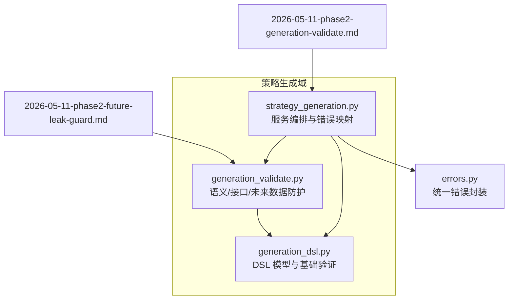
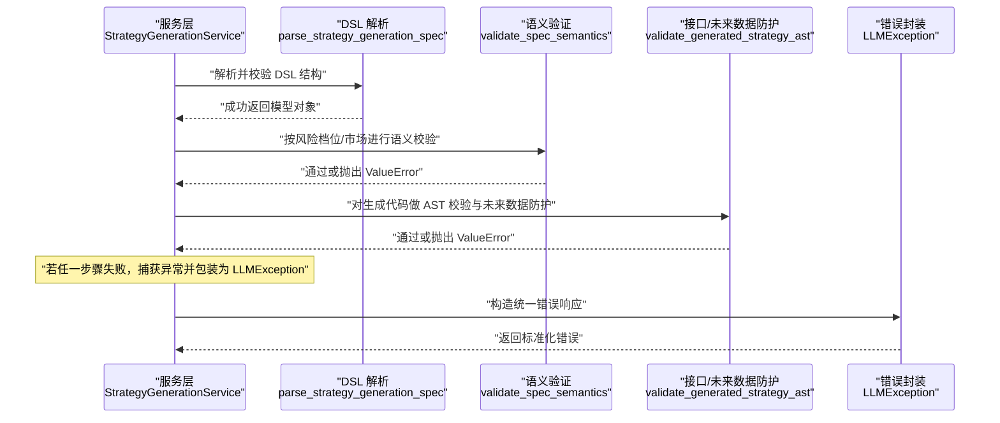
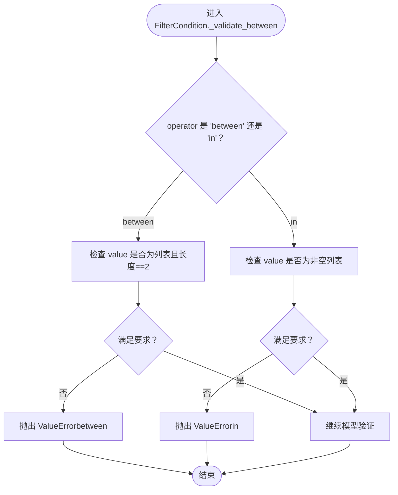
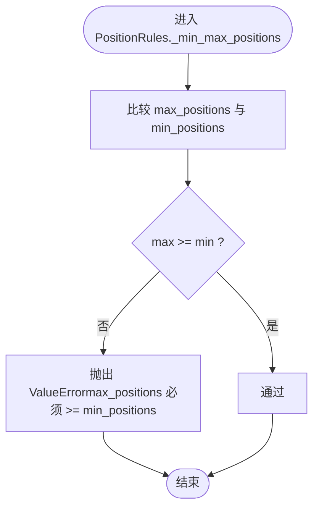
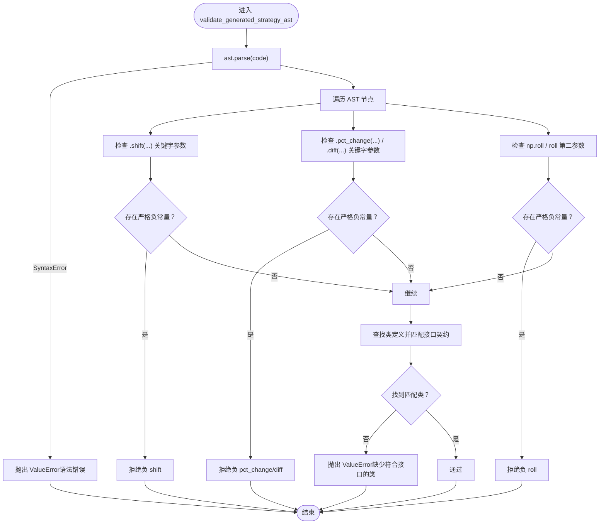
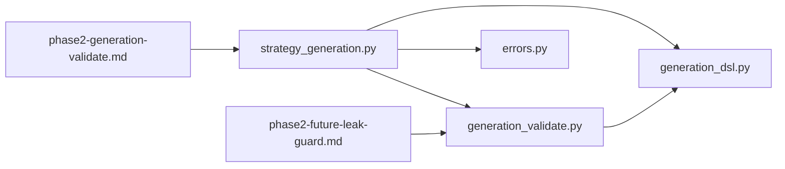

# 语义验证机制

<cite>
**本文引用的文件**
- [generation_dsl.py](file://backend/app/domains/strategy/generation_dsl.py)
- [generation_validate.py](file://backend/app/domains/strategy/generation_validate.py)
- [test_strategy_generation_validate.py](file://backend/tests/domains/test_strategy_generation_validate.py)
- [strategy_generation.py](file://backend/app/services/strategy_generation.py)
- [errors.py](file://backend/app/core/errors.py)
- [2026-05-11-phase2-generation-validate.md](file://doc/log/2026-05-11-phase2-generation-validate.md)
- [2026-05-11-phase2-future-leak-guard.md](file://doc/log/2026-05-11-phase2-future-leak-guard.md)
</cite>

## 目录
1. [引言](#引言)
2. [项目结构](#项目结构)
3. [核心组件](#核心组件)
4. [架构总览](#架构总览)
5. [组件详解](#组件详解)
6. [依赖关系分析](#依赖关系分析)
7. [性能考量](#性能考量)
8. [故障排查指南](#故障排查指南)
9. [结论](#结论)
10. [附录](#附录)

## 引言
本文件系统性阐述本项目的“语义验证机制”，聚焦于以下目标：
- 解析 Pydantic 模型验证器的工作原理与自定义验证规则实现方式
- 详述 between 与 in 操作符的特殊验证逻辑、仓位规则的最小/最大值约束、至少一个因子的强制要求等业务规则
- 说明验证器的执行顺序、错误信息格式化与用户友好提示设计
- 提供验证失败的常见场景与解决方案

## 项目结构
围绕策略生成的语义与结构化验证，相关代码主要分布在如下模块：
- generation_dsl.py：定义 DSL 核心数据模型与 Pydantic 验证规则（含 between/in 校验、仓位规则校验、至少一个因子等）
- generation_validate.py：补充语义与接口层面的验证（风险档位上限、市场限制、因子参数范围、未来数据泄露防护、AST 接口契约）
- strategy_generation.py：服务层编排，串联 DSL 解析与语义/接口验证，并将异常映射为统一错误
- errors.py：统一错误封装与响应格式
- 文档日志：phase2-generation-validate.md 与 phase2-future-leak-guard.md 明确了验证目标、边界与与流水线的衔接

图表来源
- [generation_dsl.py:1-144](file://backend/app/domains/strategy/generation_dsl.py#L1-L144)
- [generation_validate.py:1-216](file://backend/app/domains/strategy/generation_validate.py#L1-L216)
- [strategy_generation.py:1-200](file://backend/app/services/strategy_generation.py#L1-L200)
- [errors.py:1-118](file://backend/app/core/errors.py#L1-L118)
- [2026-05-11-phase2-generation-validate.md:1-43](file://doc/log/2026-05-11-phase2-generation-validate.md#L1-L43)
- [2026-05-11-phase2-future-leak-guard.md:1-31](file://doc/log/2026-05-11-phase2-future-leak-guard.md#L1-L31)

章节来源
- [generation_dsl.py:1-144](file://backend/app/domains/strategy/generation_dsl.py#L1-L144)
- [generation_validate.py:1-216](file://backend/app/domains/strategy/generation_validate.py#L1-L216)
- [strategy_generation.py:1-200](file://backend/app/services/strategy_generation.py#L1-L200)
- [errors.py:1-118](file://backend/app/core/errors.py#L1-L118)
- [2026-05-11-phase2-generation-validate.md:1-43](file://doc/log/2026-05-11-phase2-generation-validate.md#L1-L43)
- [2026-05-11-phase2-future-leak-guard.md:1-31](file://doc/log/2026-05-11-phase2-future-leak-guard.md#L1-L31)

## 核心组件
- DSL 模型与基础验证
  - FilterCondition：校验 between/in 操作符的值类型与长度
  - PositionRules：校验最小/最大仓位约束与暴露度范围
  - StrategyGenerationSpec：强制至少一个因子（portfolio 类型除外）
- 语义与接口验证
  - validate_spec_semantics：基于风险档位与市场的上限校验、因子参数范围校验、过滤字段的未来数据提示
  - validate_generated_strategy_ast：AST 解析、接口契约校验、未来数据泄露模式拦截
- 服务编排与错误映射
  - StrategyGenerationService：在生成阶段调用 DSL 解析与语义/接口验证，失败时统一包装为 LLMException 并记录流水线事件

章节来源
- [generation_dsl.py:31-96](file://backend/app/domains/strategy/generation_dsl.py#L31-L96)
- [generation_validate.py:48-104](file://backend/app/domains/strategy/generation_validate.py#L48-L104)
- [strategy_generation.py:172-193](file://backend/app/services/strategy_generation.py#L172-L193)

## 架构总览
下面的序列图展示了从服务层到验证层再到错误处理的整体流程。

图表来源
- [strategy_generation.py:172-193](file://backend/app/services/strategy_generation.py#L172-L193)
- [generation_dsl.py:98-100](file://backend/app/domains/strategy/generation_dsl.py#L98-L100)
- [generation_validate.py:48-104](file://backend/app/domains/strategy/generation_validate.py#L48-L104)

## 组件详解

### Pydantic 验证器工作原理与自定义规则
- 基础字段约束
  - 使用 Field 的 ge/le/gt/lt/max_length/min_length 等参数实现范围与长度约束
  - 使用 ConfigDict(extra="forbid") 禁止未知字段，确保下游契约稳定
- 自定义模型级验证
  - model_validator(mode="after") 在字段赋值完成后执行，用于跨字段一致性校验与业务规则
- 执行顺序
  - 字段级验证先于模型级验证
  - 多个模型级验证器按定义顺序依次执行，任一失败即终止

章节来源
- [generation_dsl.py:20-96](file://backend/app/domains/strategy/generation_dsl.py#L20-L96)

### between 与 in 操作符的特殊验证逻辑
- between
  - 要求 value 为包含两个元素的列表，且每个元素为标量
  - 用于限定连续区间的过滤条件
- in
  - 要求 value 为非空列表
  - 用于多值集合过滤
- 错误信息
  - 当类型或长度不满足要求时，抛出 ValueError，提示具体操作符与期望格式

图表来源
- [generation_dsl.py:40-48](file://backend/app/domains/strategy/generation_dsl.py#L40-L48)

章节来源
- [generation_dsl.py:40-48](file://backend/app/domains/strategy/generation_dsl.py#L40-L48)

### 仓位规则的最小/最大值约束与强制因子要求
- 仓位规则（PositionRules）
  - 最大单只权重：必须大于 0 且不超过 1
  - 最小/最大持仓数量：均在有效范围内，且 max_positions ≥ min_positions
  - 目标总杠杆暴露：范围 [0, 1]
- 至少一个因子（StrategyGenerationSpec）
  - 除 strategy_kind 为 "portfolio" 外，必须至少包含一个因子
- 错误信息
  - 当 min/max 顺序不合法时，明确提示“max 必须不小于 min”
  - 当因子数量不足时，提示“除非是 portfolio，否则至少需要一个因子”

图表来源
- [generation_dsl.py:61-65](file://backend/app/domains/strategy/generation_dsl.py#L61-L65)

章节来源
- [generation_dsl.py:51-96](file://backend/app/domains/strategy/generation_dsl.py#L51-L96)

### 语义验证：风险档位上限与市场限制
- 风险档位上限
  - 单票最大权重上限：conservative ≤ 0.05、balanced ≤ 0.10、aggressive ≤ 0.20
  - 组合最大回撤上限：conservative ≤ 0.12、balanced ≤ 0.20、aggressive ≤ 0.35
- 市场限制
  - 市场必须属于 {A, US, HK, crypto}，空字符串跳过校验
- 因子参数范围
  - 因子名称：ASCII 字母开头，允许字母/数字/下划线，长度 1..64
  - 参数键：window/lookback/days/period 必须为数值且在 [1, 252] 之间
- 过滤字段未来数据提示
  - 若 filters[].field 包含未来日期相关片段（如 _t+、t+1、next_、forward_、_fwd、future_、lead_、tomorrow），则拒绝
- 错误信息
  - 明确指出违反的上限类型与具体数值，便于定位问题

章节来源
- [generation_validate.py:48-104](file://backend/app/domains/strategy/generation_validate.py#L48-L104)
- [2026-05-11-phase2-generation-validate.md:7-24](file://doc/log/2026-05-11-phase2-generation-validate.md#L7-L24)

### 接口与未来数据防护：AST 验证
- AST 解析与接口契约
  - 生成代码必须包含至少一个类定义
  - 若基类为 RuleBasedStrategy：需定义 generate_signals 与 risk_check
  - 若基类为 BaseStrategy：需定义 generate_signals 与 rebalance
- 未来数据泄露拦截
  - 拦截 shift/negative periods、pct_change/diff/negative periods、np.roll/roll with negative second arg
  - 仅对可判定为严格负常量的调用拒绝，避免误伤动态表达式
- 错误信息
  - 语法错误、缺失接口、未来数据使用等均有明确提示

图表来源
- [generation_validate.py:107-216](file://backend/app/domains/strategy/generation_validate.py#L107-L216)

章节来源
- [generation_validate.py:107-216](file://backend/app/domains/strategy/generation_validate.py#L107-L216)
- [2026-05-11-phase2-future-leak-guard.md:12-31](file://doc/log/2026-05-11-phase2-future-leak-guard.md#L12-L31)

### 服务层编排与错误映射
- 编排步骤
  - 解析 DSL → 语义校验（风险/市场/因子参数/过滤字段）→ 接口与未来数据防护 → 持久化版本
- 错误映射
  - 将 ValueError 包装为 LLMException，设置统一 code/message/status_code
  - 根据错误消息关键词（如 risk、backtest、validation、dsl、ast、generation）推断失败阶段并记录流水线事件

章节来源
- [strategy_generation.py:172-193](file://backend/app/services/strategy_generation.py#L172-L193)
- [strategy_generation.py:313-334](file://backend/app/services/strategy_generation.py#L313-L334)
- [errors.py:13-36](file://backend/app/core/errors.py#L13-L36)

## 依赖关系分析
- generation_dsl.py 与 generation_validate.py 双向协作
  - DSL 定义基础模型与字段约束，validate 提供语义与接口增强
- strategy_generation.py 依赖 DSL 与 validate，并将异常统一转换为 LLMException
- 文档日志明确验证目标与与流水线的衔接，确保实现与预期一致

图表来源
- [strategy_generation.py:1-200](file://backend/app/services/strategy_generation.py#L1-L200)
- [generation_dsl.py:1-144](file://backend/app/domains/strategy/generation_dsl.py#L1-L144)
- [generation_validate.py:1-216](file://backend/app/domains/strategy/generation_validate.py#L1-L216)
- [errors.py:1-118](file://backend/app/core/errors.py#L1-L118)
- [2026-05-11-phase2-generation-validate.md:1-43](file://doc/log/2026-05-11-phase2-generation-validate.md#L1-L43)
- [2026-05-11-phase2-future-leak-guard.md:1-31](file://doc/log/2026-05-11-phase2-future-leak-guard.md#L1-L31)

章节来源
- [strategy_generation.py:1-200](file://backend/app/services/strategy_generation.py#L1-L200)
- [generation_dsl.py:1-144](file://backend/app/domains/strategy/generation_dsl.py#L1-L144)
- [generation_validate.py:1-216](file://backend/app/domains/strategy/generation_validate.py#L1-L216)
- [2026-05-11-phase2-generation-validate.md:1-43](file://doc/log/2026-05-11-phase2-generation-validate.md#L1-L43)
- [2026-05-11-phase2-future-leak-guard.md:1-31](file://doc/log/2026-05-11-phase2-future-leak-guard.md#L1-L31)

## 性能考量
- 验证复杂度
  - 字段级约束为 O(1)，模型级验证通常线性于字段数量
  - 语义校验对 factors/filters 的遍历为 O(n+m)
  - AST 遍历为 O(N)，N 为节点数
- 优化建议
  - 将常量集合（如未来字段片段）预编译为集合或冻结集，降低查找成本
  - 对大规模 filters/factors 的校验可考虑分批或并行（注意 Pydantic 验证的线程安全与幂等性）

## 故障排查指南
- 常见失败场景与定位
  - 单票权重超限：检查 position_rules.max_single_name_weight 与风险档位上限
  - 组合回撤超限：检查 risk_rules.max_portfolio_drawdown 与风险档位上限
  - 因子 window/lookback/days/period 超界：确认数值类型与范围 [1, 252]
  - 过滤字段疑似未来数据：检查 filters[].field 是否包含未来日期相关片段
  - 生成代码接口不满足：确认是否存在 RuleBasedStrategy/BaseStrategy 的类，且具备所需方法
  - 未来数据使用：避免 shift(-k)/pct_change(-n)/diff(-n)/roll(..., -k)
- 解决方案
  - 调整风险/市场参数至允许范围
  - 规范因子命名与参数键值
  - 修改过滤字段为当前可观察列
  - 补充缺失的类与方法，或移除未来数据相关调用
- 用户友好提示
  - 服务层根据错误内容映射失败阶段（如 static_check、risk、backtest、code_gen），便于前端展示与追踪

章节来源
- [test_strategy_generation_validate.py:1-148](file://backend/tests/domains/test_strategy_generation_validate.py#L1-L148)
- [strategy_generation.py:313-334](file://backend/app/services/strategy_generation.py#L313-L334)

## 结论
本项目的语义验证机制通过“结构化 DSL + 语义/接口 + 未来数据防护”的三层校验，确保策略生成结果在形状、业务含义与数据使用上的正确性。Pydantic 的模型级验证与自定义规则提供了强约束，配合服务层统一错误映射与流水线事件记录，实现了可追溯、可诊断、可修复的闭环。

## 附录
- 相关文档
  - [2026-05-11-phase2-generation-validate.md:1-43](file://doc/log/2026-05-11-phase2-generation-validate.md#L1-L43)
  - [2026-05-11-phase2-future-leak-guard.md:1-31](file://doc/log/2026-05-11-phase2-future-leak-guard.md#L1-L31)
- 测试参考
  - [test_strategy_generation_validate.py:1-148](file://backend/tests/domains/test_strategy_generation_validate.py#L1-L148)