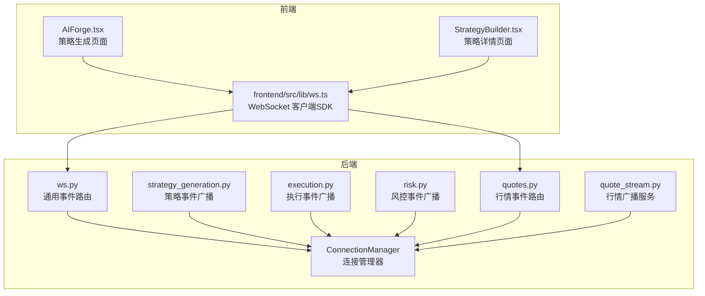
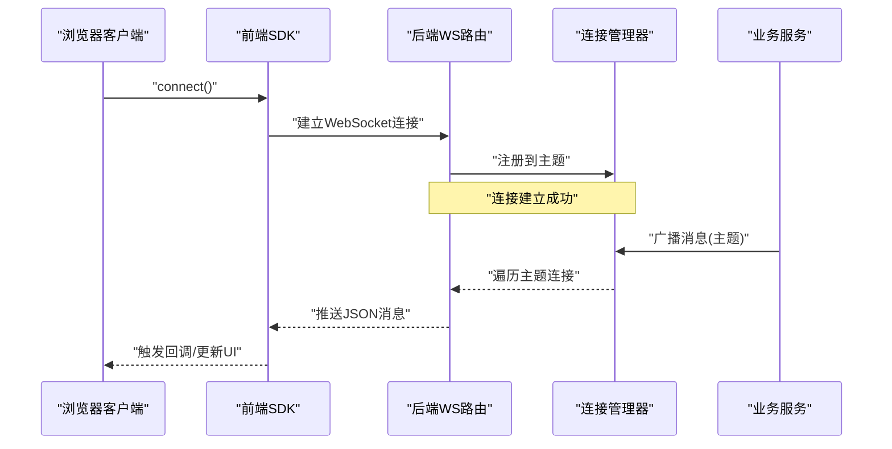
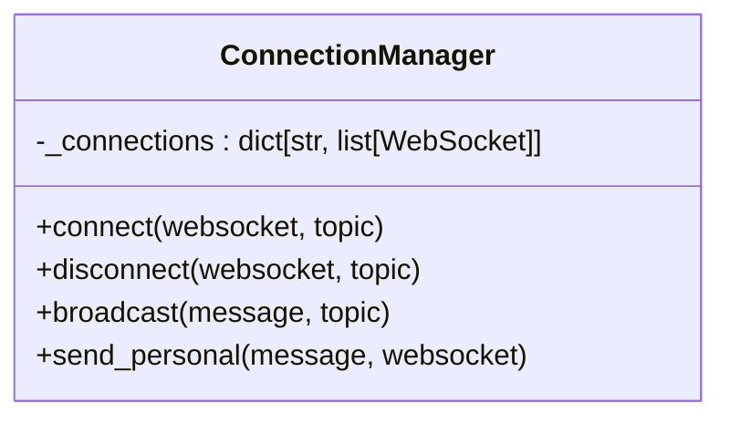
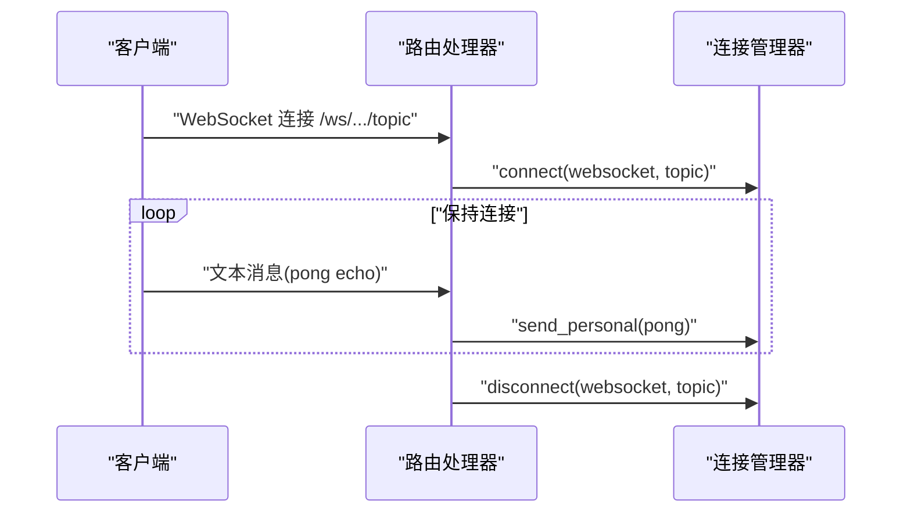
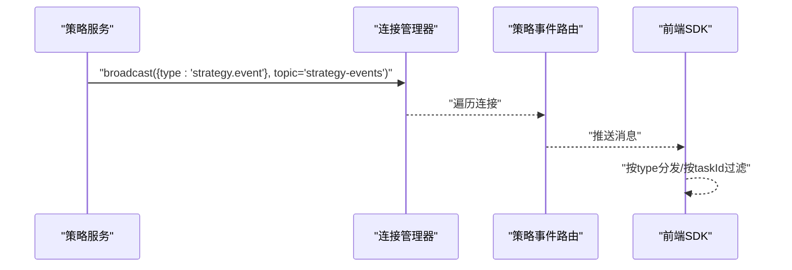
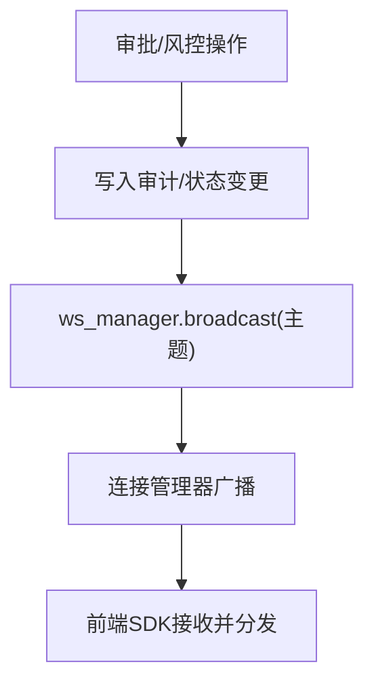
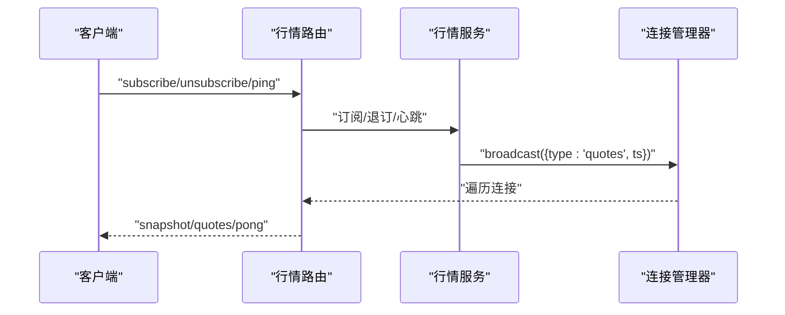
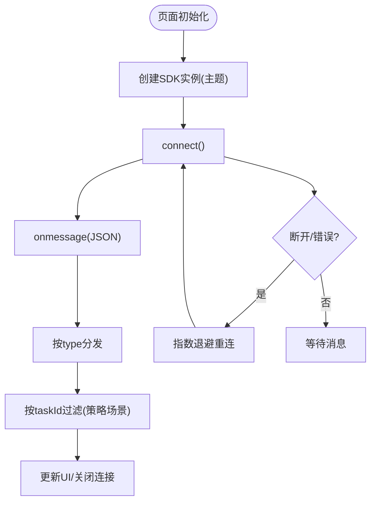
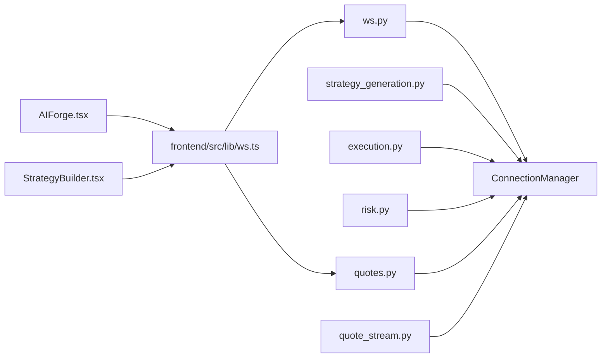

# 实时广播机制

<cite>
**本文档引用的文件**
- [backend/app/core/websocket.py](file://backend/app/core/websocket.py)
- [backend/app/api/v1/ws.py](file://backend/app/api/v1/ws.py)
- [backend/app/api/v1/quotes.py](file://backend/app/api/v1/quotes.py)
- [backend/app/services/strategy_generation.py](file://backend/app/services/strategy_generation.py)
- [backend/app/api/v1/execution.py](file://backend/app/api/v1/execution.py)
- [backend/app/api/v1/risk.py](file://backend/app/api/v1/risk.py)
- [backend/app/services/quote_stream.py](file://backend/app/services/quote_stream.py)
- [frontend/src/lib/ws.ts](file://frontend/src/lib/ws.ts)
- [frontend/src/screens/Strategy/AIForge.tsx](file://frontend/src/screens/Strategy/AIForge.tsx)
- [frontend/src/screens/Strategy/StrategyBuilder.tsx](file://frontend/src/screens/Strategy/StrategyBuilder.tsx)
- [backend/app/core/logging.py](file://backend/app/core/logging.py)
</cite>

## 目录
1. [简介](#简介)
2. [项目结构](#项目结构)
3. [核心组件](#核心组件)
4. [架构总览](#架构总览)
5. [详细组件分析](#详细组件分析)
6. [依赖关系分析](#依赖关系分析)
7. [性能考虑](#性能考虑)
8. [故障排查指南](#故障排查指南)
9. [结论](#结论)
10. [附录](#附录)

## 简介
本文件系统性阐述本项目的实时广播机制，覆盖策略生成过程中的实时事件广播、WebSocket 连接管理、消息格式设计与客户端订阅机制。内容包括：
- 广播消息结构定义、主题分类、过滤规则与去重策略
- 客户端 SDK 使用方法、错误重连机制、心跳检测与性能优化
- 前端集成示例、调试工具与监控指标建议

## 项目结构
实时广播涉及后端 WebSocket 管理器、API 路由处理器、业务服务广播点以及前端 SDK 与页面组件。

**图表来源**
- [backend/app/core/websocket.py:10-44](file://backend/app/core/websocket.py#L10-L44)
- [backend/app/api/v1/ws.py:12-50](file://backend/app/api/v1/ws.py#L12-L50)
- [backend/app/services/strategy_generation.py:556-583](file://backend/app/services/strategy_generation.py#L556-L583)
- [backend/app/api/v1/execution.py:244-279](file://backend/app/api/v1/execution.py#L244-L279)
- [backend/app/api/v1/risk.py:234-271](file://backend/app/api/v1/risk.py#L234-L271)
- [backend/app/api/v1/quotes.py:85-128](file://backend/app/api/v1/quotes.py#L85-L128)
- [backend/app/services/quote_stream.py:140-152](file://backend/app/services/quote_stream.py#L140-L152)
- [frontend/src/lib/ws.ts:27-94](file://frontend/src/lib/ws.ts#L27-L94)
- [frontend/src/screens/Strategy/AIForge.tsx:35-142](file://frontend/src/screens/Strategy/AIForge.tsx#L35-L142)
- [frontend/src/screens/Strategy/StrategyBuilder.tsx:425-465](file://frontend/src/screens/Strategy/StrategyBuilder.tsx#L425-L465)

**章节来源**
- [backend/app/core/websocket.py:1-45](file://backend/app/core/websocket.py#L1-L45)
- [backend/app/api/v1/ws.py:1-50](file://backend/app/api/v1/ws.py#L1-L50)
- [frontend/src/lib/ws.ts:1-95](file://frontend/src/lib/ws.ts#L1-L95)

## 核心组件
- 连接管理器（ConnectionManager）
  - 维护按主题分组的 WebSocket 列表
  - 提供连接接入、断开、广播与单播能力
- WebSocket API 路由
  - 定义通用事件流与领域事件流端点
  - 统一处理连接生命周期与错误
- 业务服务广播点
  - 策略生成、执行审批、风控告警、行情推送等模块在关键节点广播消息
- 前端 SDK
  - 封装自动重连、主题订阅、消息分发与连接状态查询
- 前端页面组件
  - 在策略生成与详情页订阅并消费相应主题消息

**章节来源**
- [backend/app/core/websocket.py:10-44](file://backend/app/core/websocket.py#L10-L44)
- [backend/app/api/v1/ws.py:12-50](file://backend/app/api/v1/ws.py#L12-L50)
- [frontend/src/lib/ws.ts:27-94](file://frontend/src/lib/ws.ts#L27-L94)

## 架构总览
实时广播采用“主题驱动”的连接管理与消息分发模式：后端按主题维护连接列表，业务模块通过统一管理器向该主题广播；前端以主题为单位建立连接，SDK 负责消息分发与重连。

**图表来源**
- [backend/app/core/websocket.py:16-41](file://backend/app/core/websocket.py#L16-L41)
- [backend/app/api/v1/ws.py:12-25](file://backend/app/api/v1/ws.py#L12-L25)
- [frontend/src/lib/ws.ts:40-68](file://frontend/src/lib/ws.ts#L40-L68)

## 详细组件分析

### 连接管理器（ConnectionManager）
- 主题管理
  - 使用字典按主题维护连接列表，支持多主题并行
- 连接生命周期
  - 接入：接受连接并加入对应主题
  - 断开：从主题移除连接，并记录日志
- 广播与单播
  - 广播：对主题内所有连接发送消息，异常连接将被清理
  - 单播：向指定连接发送消息

**图表来源**
- [backend/app/core/websocket.py:10-44](file://backend/app/core/websocket.py#L10-L44)

**章节来源**
- [backend/app/core/websocket.py:10-44](file://backend/app/core/websocket.py#L10-L44)

### WebSocket API 路由
- 通用事件路由
  - 为每个主题构造处理器，维持连接并在断开或异常时清理
  - 支持简单的“pong”回显用于保活
- 领域事件路由
  - 策略事件、执行事件、风控事件分别绑定不同主题
  - 执行与风控模块直接使用统一管理器进行广播

**图表来源**
- [backend/app/api/v1/ws.py:12-25](file://backend/app/api/v1/ws.py#L12-L25)
- [backend/app/api/v1/ws.py:28-50](file://backend/app/api/v1/ws.py#L28-L50)

**章节来源**
- [backend/app/api/v1/ws.py:12-50](file://backend/app/api/v1/ws.py#L12-L50)

### 策略生成事件广播
- 广播时机
  - 策略流水线阶段推进时调用内部广播方法
- 消息结构
  - 类型：strategy.event
  - 关键字段：任务ID、阶段、事件、进度、代理、策略ID、明细、时间戳
- 主题：strategy-events

**图表来源**
- [backend/app/services/strategy_generation.py:556-583](file://backend/app/services/strategy_generation.py#L556-L583)
- [backend/app/api/v1/ws.py:34-37](file://backend/app/api/v1/ws.py#L34-L37)
- [frontend/src/lib/ws.ts:34-38](file://frontend/src/lib/ws.ts#L34-L38)

**章节来源**
- [backend/app/services/strategy_generation.py:556-583](file://backend/app/services/strategy_generation.py#L556-L583)
- [frontend/src/lib/ws.ts:27-94](file://frontend/src/lib/ws.ts#L27-L94)

### 执行与风控事件广播
- 执行事件
  - 审批通过/拒绝时广播 approval_update
  - 主题：execution-events
- 风控事件
  - 触发/恢复时广播 circuit_breaker
  - 主题：risk-events

**图表来源**
- [backend/app/api/v1/execution.py:244-279](file://backend/app/api/v1/execution.py#L244-L279)
- [backend/app/api/v1/risk.py:234-271](file://backend/app/api/v1/risk.py#L234-L271)

**章节来源**
- [backend/app/api/v1/execution.py:244-279](file://backend/app/api/v1/execution.py#L244-L279)
- [backend/app/api/v1/risk.py:234-271](file://backend/app/api/v1/risk.py#L234-L271)

### 行情事件路由与广播
- 客户端协议
  - 订阅/退订：{"action": "subscribe"/"unsubscribe", "symbols": [...]}
  - 心跳：{"action": "ping"} → {"type": "pong"}
  - 首次订阅返回快照 snapshot
- 广播内容
  - 定期推送 quotes，包含时间戳
- 服务层
  - 后台服务负责轮询与增量计算，最终通过管理器广播

**图表来源**
- [backend/app/api/v1/quotes.py:85-128](file://backend/app/api/v1/quotes.py#L85-L128)
- [backend/app/services/quote_stream.py:140-152](file://backend/app/services/quote_stream.py#L140-L152)

**章节来源**
- [backend/app/api/v1/quotes.py:85-128](file://backend/app/api/v1/quotes.py#L85-L128)
- [backend/app/services/quote_stream.py:140-152](file://backend/app/services/quote_stream.py#L140-L152)

### 前端 SDK 与页面集成
- SDK 能力
  - 自动重连：指数退避，上限30秒
  - 主题订阅：按 type 分发，支持通配符
  - 连接状态查询
- 页面集成示例
  - 策略生成：订阅 strategy-events，按 taskId 过滤，更新状态与进度
  - 策略详情：订阅 strategy-events，解析 detail 中的策略ID

**图表来源**
- [frontend/src/lib/ws.ts:27-94](file://frontend/src/lib/ws.ts#L27-L94)
- [frontend/src/screens/Strategy/AIForge.tsx:35-142](file://frontend/src/screens/Strategy/AIForge.tsx#L35-L142)
- [frontend/src/screens/Strategy/StrategyBuilder.tsx:425-465](file://frontend/src/screens/Strategy/StrategyBuilder.tsx#L425-L465)

**章节来源**
- [frontend/src/lib/ws.ts:27-94](file://frontend/src/lib/ws.ts#L27-L94)
- [frontend/src/screens/Strategy/AIForge.tsx:35-142](file://frontend/src/screens/Strategy/AIForge.tsx#L35-L142)
- [frontend/src/screens/Strategy/StrategyBuilder.tsx:425-465](file://frontend/src/screens/Strategy/StrategyBuilder.tsx#L425-L465)

## 依赖关系分析
- 后端耦合
  - API 路由依赖连接管理器
  - 业务服务依赖连接管理器进行广播
  - 行情模块同时依赖路由与后台服务
- 前端耦合
  - 页面组件依赖 SDK，SDK 依赖后端主题
- 外部依赖
  - FastAPI WebSocket
  - structlog 日志

**图表来源**
- [backend/app/api/v1/ws.py:12-50](file://backend/app/api/v1/ws.py#L12-L50)
- [backend/app/core/websocket.py:10-44](file://backend/app/core/websocket.py#L10-L44)
- [backend/app/services/strategy_generation.py:556-583](file://backend/app/services/strategy_generation.py#L556-L583)
- [backend/app/api/v1/execution.py:244-279](file://backend/app/api/v1/execution.py#L244-L279)
- [backend/app/api/v1/risk.py:234-271](file://backend/app/api/v1/risk.py#L234-L271)
- [backend/app/api/v1/quotes.py:85-128](file://backend/app/api/v1/quotes.py#L85-L128)
- [backend/app/services/quote_stream.py:140-152](file://backend/app/services/quote_stream.py#L140-L152)
- [frontend/src/lib/ws.ts:27-94](file://frontend/src/lib/ws.ts#L27-L94)
- [frontend/src/screens/Strategy/AIForge.tsx:35-142](file://frontend/src/screens/Strategy/AIForge.tsx#L35-L142)
- [frontend/src/screens/Strategy/StrategyBuilder.tsx:425-465](file://frontend/src/screens/Strategy/StrategyBuilder.tsx#L425-L465)

**章节来源**
- [backend/app/api/v1/ws.py:12-50](file://backend/app/api/v1/ws.py#L12-L50)
- [frontend/src/lib/ws.ts:27-94](file://frontend/src/lib/ws.ts#L27-L94)

## 性能考虑
- 广播效率
  - 广播循环遍历主题连接，异常连接会被清理，避免连接泄漏
- 心跳与保活
  - 通用路由支持 pong 回显；行情路由支持 ping/pong
- 前端重连
  - SDK 使用指数退避，上限30秒，减少风暴效应
- 建议
  - 对高频主题（如行情）可考虑消息合并与去抖
  - 前端按需订阅，避免无意义的主题订阅
  - 后端可根据连接数限制与资源使用情况调整日志级别

**章节来源**
- [backend/app/core/websocket.py:27-41](file://backend/app/core/websocket.py#L27-L41)
- [backend/app/api/v1/ws.py:16-18](file://backend/app/api/v1/ws.py#L16-L18)
- [backend/app/api/v1/quotes.py:119-120](file://backend/app/api/v1/quotes.py#L119-L120)
- [frontend/src/lib/ws.ts:57-67](file://frontend/src/lib/ws.ts#L57-L67)

## 故障排查指南
- 常见问题
  - 连接无法建立：检查路由路径与协议（ws/wss），确认后端日志
  - 消息未到达：确认主题是否正确、前端是否订阅、是否按 taskId 过滤
  - 重连频繁：检查网络波动与后端异常日志
- 日志与可观测性
  - 后端使用结构化日志，连接/断开事件会记录主题与连接数
  - 建议在生产环境启用 JSON 渲染，便于日志采集与检索
- 调试步骤
  - 前端：打开浏览器开发者工具 Network → WebSocket，观察帧与重连行为
  - 后端：关注 ws_connected/ws_disconnected 日志条目

**章节来源**
- [backend/app/core/logging.py:11-41](file://backend/app/core/logging.py#L11-L41)
- [backend/app/core/websocket.py:16-25](file://backend/app/core/websocket.py#L16-L25)
- [frontend/src/lib/ws.ts:40-68](file://frontend/src/lib/ws.ts#L40-L68)

## 结论
本项目的实时广播机制以主题为中心，结合统一的连接管理器与多端点路由，实现了策略、执行、风控与行情等领域的事件推送。前端 SDK 提供了自动重连、主题订阅与消息分发能力，页面组件可按需订阅并消费消息。整体架构清晰、扩展性强，适合在多领域事件场景下演进。

## 附录

### 消息格式与主题一览
- 策略事件
  - 主题：strategy-events
  - 类型：strategy.event
  - 关键字段：taskId、stage、event、progress、agent、strategyId、detail、timestamp
- 执行事件
  - 主题：execution-events
  - 类型：approval_update
  - 关键字段：approval_id、status、symbol、side、qty
- 风控事件
  - 主题：risk-events
  - 类型：circuit_breaker
  - 关键字段：level、status、name
- 行情事件
  - 主题：quotes（行情专用）
  - 类型：snapshot/quotes/pong
  - 关键字段：data、ts

**章节来源**
- [backend/app/services/strategy_generation.py:556-583](file://backend/app/services/strategy_generation.py#L556-L583)
- [backend/app/api/v1/execution.py:244-279](file://backend/app/api/v1/execution.py#L244-L279)
- [backend/app/api/v1/risk.py:234-271](file://backend/app/api/v1/risk.py#L234-L271)
- [backend/app/api/v1/quotes.py:85-128](file://backend/app/api/v1/quotes.py#L85-L128)