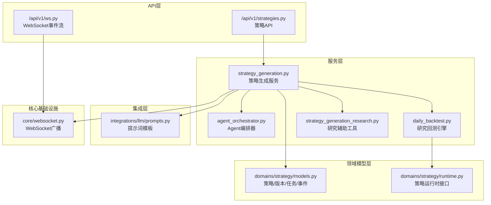
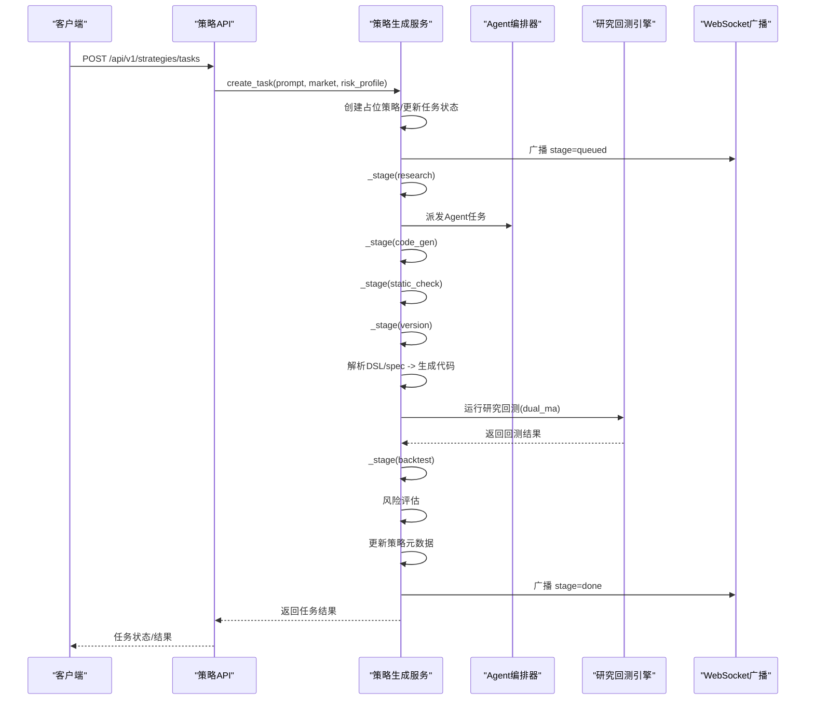
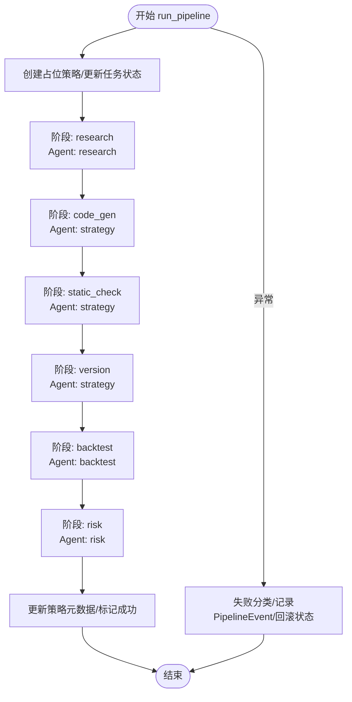
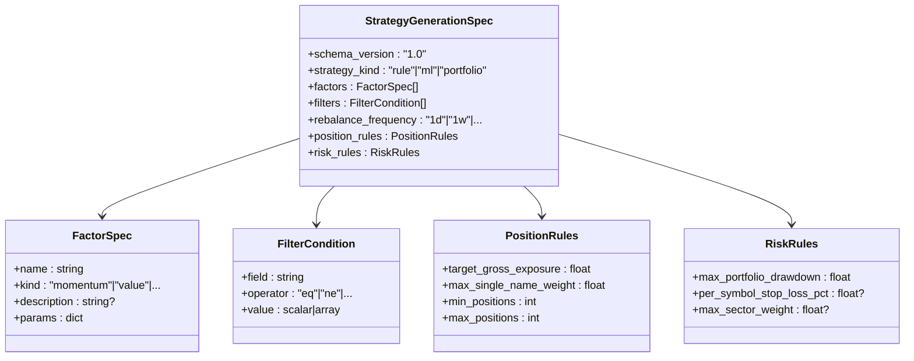
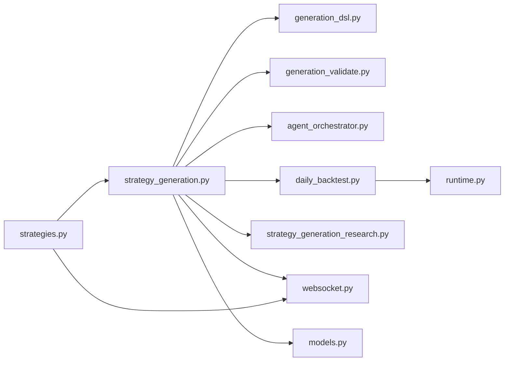

# 策略生成服务

<cite>
**本文档引用的文件**
- [strategy_generation.py](file://backend/app/services/strategy_generation.py)
- [generation_dsl.py](file://backend/app/domains/strategy/generation_dsl.py)
- [generation_validate.py](file://backend/app/domains/strategy/generation_validate.py)
- [strategy_generation_research.py](file://backend/app/services/strategy_generation_research.py)
- [strategies.py](file://backend/app/api/v1/strategies.py)
- [prompts.py](file://backend/app/integrations/llm/prompts.py)
- [agent_orchestrator.py](file://backend/app/services/agent_orchestrator.py)
- [models.py](file://backend/app/domains/strategy/models.py)
- [daily_backtest.py](file://backend/app/services/daily_backtest.py)
- [ws.py](file://backend/app/api/v1/ws.py)
- [websocket.py](file://backend/app/core/websocket.py)
- [runtime.py](file://backend/app/domains/strategy/runtime.py)
- [test_strategy_generation_e2e.py](file://backend/tests/services/test_strategy_generation_e2e.py)
</cite>

## 目录
1. [简介](#简介)
2. [项目结构](#项目结构)
3. [核心组件](#核心组件)
4. [架构总览](#架构总览)
5. [详细组件分析](#详细组件分析)
6. [依赖关系分析](#依赖关系分析)
7. [性能考虑](#性能考虑)
8. [故障排除指南](#故障排除指南)
9. [结论](#结论)
10. [附录](#附录)

## 简介
本指南面向策略生成服务的开发者与使用者，系统性阐述从自然语言到策略代码的完整转换流程。该服务以“任务驱动”的流水线为核心，包含七阶段处理：研究扫描、代码生成、静态检查、版本持久化、回测验证、风险评估与发布流程。同时，文档深入解析AI Agent协作机制、提示词工程、错误处理策略与实时广播机制，并提供服务接口使用示例、性能优化建议与故障排除指南。

## 项目结构
策略生成服务位于后端目录，采用分层架构：
- API层：FastAPI路由，提供策略任务创建、查询、事件流等接口
- 服务层：策略生成服务协调流水线，Agent编排器调度Agent任务，回测引擎执行研究回测
- 领域模型层：策略、版本、任务、流水线事件等数据模型
- 集成层：LLM提供商抽象、市场数据适配器
- 核心基础设施：WebSocket广播、审计日志、追踪ID

图表来源
- [strategies.py:160-605](file://backend/app/api/v1/strategies.py#L160-L605)
- [strategy_generation.py:86-374](file://backend/app/services/strategy_generation.py#L86-L374)
- [agent_orchestrator.py:15-105](file://backend/app/services/agent_orchestrator.py#L15-L105)
- [daily_backtest.py:185-372](file://backend/app/services/daily_backtest.py#L185-L372)
- [strategy_generation_research.py:15-81](file://backend/app/services/strategy_generation_research.py#L15-L81)
- [models.py:9-84](file://backend/app/domains/strategy/models.py#L9-L84)
- [runtime.py:175-229](file://backend/app/domains/strategy/runtime.py#L175-L229)
- [prompts.py:1-94](file://backend/app/integrations/llm/prompts.py#L1-L94)
- [ws.py:28-50](file://backend/app/api/v1/ws.py#L28-L50)
- [websocket.py:10-45](file://backend/app/core/websocket.py#L10-L45)

章节来源
- [strategies.py:160-605](file://backend/app/api/v1/strategies.py#L160-L605)
- [strategy_generation.py:86-374](file://backend/app/services/strategy_generation.py#L86-L374)

## 核心组件
- 策略生成服务：负责流水线编排、事件广播、失败分类与恢复
- DSL解析与校验：将自然语言意图解析为结构化策略规范，并进行语义与AST校验
- Agent编排器：按角色派发任务、记录结果、跨Agent消息传递
- 研究回测引擎：加载真实日线数据，执行内置策略（如双均线），产出指标与轨迹
- WebSocket广播：向订阅者推送策略流水线事件
- 数据模型：策略、版本、任务、流水线事件等持久化实体

章节来源
- [strategy_generation.py:86-374](file://backend/app/services/strategy_generation.py#L86-L374)
- [generation_dsl.py:78-144](file://backend/app/domains/strategy/generation_dsl.py#L78-L144)
- [generation_validate.py:48-216](file://backend/app/domains/strategy/generation_validate.py#L48-L216)
- [agent_orchestrator.py:15-105](file://backend/app/services/agent_orchestrator.py#L15-L105)
- [daily_backtest.py:185-372](file://backend/app/services/daily_backtest.py#L185-L372)
- [websocket.py:10-45](file://backend/app/core/websocket.py#L10-L45)
- [models.py:9-84](file://backend/app/domains/strategy/models.py#L9-L84)

## 架构总览
策略生成服务采用“流水线+事件驱动”的架构模式：
- API接收自然语言描述，创建生成任务
- 流水线按阶段推进，每个阶段产生PipelineEvent并触发Agent任务
- 回测引擎基于真实市场数据进行研究回测
- WebSocket广播实时通知前端状态变化
- 失败时根据异常类型归类到具体阶段，确保可观测性与可追溯性

图表来源
- [strategies.py:301-314](file://backend/app/api/v1/strategies.py#L301-L314)
- [strategy_generation.py:132-374](file://backend/app/services/strategy_generation.py#L132-L374)
- [agent_orchestrator.py:31-105](file://backend/app/services/agent_orchestrator.py#L31-L105)
- [daily_backtest.py:285-372](file://backend/app/services/daily_backtest.py#L285-L372)
- [websocket.py:27-42](file://backend/app/core/websocket.py#L27-L42)

## 详细组件分析

### 策略生成服务（StrategyGenerationService）
职责与流程
- 任务生命周期管理：创建、运行、失败处理与状态回滚
- 流水线阶段编排：研究扫描、代码生成、静态检查、版本持久化、回测验证、风险评估、发布
- 事件与广播：每阶段持久化PipelineEvent并广播至WebSocket
- Agent协作：通过AgentOrchestrator派发任务、完成任务、发送消息
- 回测集成：调用DailyBacktestEngine执行研究回测，产出指标并写入数据库
- 风险控制：依据风险画像限制最大回撤与最低夏普比率

关键实现要点
- 阶段推进：_stage方法统一处理事件持久化、Agent派发、消息发送与广播
- 失败分类：根据异常信息关键词自动识别失败阶段（risk/backtest/static_check/code_gen/pipeline）
- 元数据映射：build_strategy_metadata_bundle将DSL映射为UI/持久化兼容字段
- 版本持久化：StrategyVersion保存代码快照与参数Schema

图表来源
- [strategy_generation.py:132-374](file://backend/app/services/strategy_generation.py#L132-L374)

章节来源
- [strategy_generation.py:86-374](file://backend/app/services/strategy_generation.py#L86-L374)

### DSL解析与策略规范（generation_dsl.py）
目标
- 将自然语言意图转化为结构化的StrategyGenerationSpec
- 严格校验字段与取值范围，保证下游稳定契约
- 提供JSON Schema用于LLM结构化输出约束

关键点
- 字段定义：策略类型、因子、过滤条件、再平衡频率、头寸规则、风控规则
- 校验规则：禁止未知键、位置上限校验、过滤器字段不得包含未来导向片段
- 元数据映射：build_strategy_metadata_bundle将DSL映射为历史兼容字段

图表来源
- [generation_dsl.py:78-144](file://backend/app/domains/strategy/generation_dsl.py#L78-L144)

章节来源
- [generation_dsl.py:78-144](file://backend/app/domains/strategy/generation_dsl.py#L78-L144)

### 代码与DSL校验（generation_validate.py）
目标
- 语义校验：确保DSL与风险画像、市场匹配（头寸上限、最大回撤、因子参数范围）
- AST校验：阻止未来函数/前瞻偏误（负移位、roll负位移、pct_change/diff负周期等）
- 合同校验：要求生成类继承RuleBasedStrategy或BaseStrategy并实现必要方法

章节来源
- [generation_validate.py:48-216](file://backend/app/domains/strategy/generation_validate.py#L48-L216)

### Agent编排器（agent_orchestrator.py）
职责
- 角色到Agent ID解析
- AgentTask持久化与完成标记
- AgentMessage发送与关联trace_id

章节来源
- [agent_orchestrator.py:15-105](file://backend/app/services/agent_orchestrator.py#L15-L105)

### 研究回测引擎（daily_backtest.py）
职责
- 加载日线数据，构建交易日序列
- 执行内置策略（如dual_ma），计算交易成本与滑点
- 计算收益曲线、指标（年化回报、最大回撤、夏普、胜率、换手率等）
- 持久化BacktestTask/Run/Metric/EquityPoint/Trades

章节来源
- [daily_backtest.py:185-372](file://backend/app/services/daily_backtest.py#L185-L372)

### 研究辅助工具（strategy_generation_research.py）
职责
- 将DSL映射为dual_ma参数（窗口、头寸上限、总杠杆）
- 发现默认研究标的与日期范围（基于已有日线数据）

章节来源
- [strategy_generation_research.py:15-81](file://backend/app/services/strategy_generation_research.py#L15-L81)

### 实时广播（ws.py + websocket.py）
职责
- WebSocket连接管理与主题订阅
- 广播策略流水线事件到前端
- 支持多主题：events、strategy-events、execution-events、risk-events

章节来源
- [ws.py:28-50](file://backend/app/api/v1/ws.py#L28-L50)
- [websocket.py:10-45](file://backend/app/core/websocket.py#L10-L45)

### API接口（strategies.py）
职责
- 创建策略任务并异步运行流水线
- 查询任务状态、事件流、策略详情与版本
- 提供概览视图（仪表板数据）

章节来源
- [strategies.py:301-314](file://backend/app/api/v1/strategies.py#L301-L314)
- [strategies.py:463-509](file://backend/app/api/v1/strategies.py#L463-L509)

## 依赖关系分析

图表来源
- [strategy_generation.py:22-56](file://backend/app/services/strategy_generation.py#L22-L56)
- [strategies.py:43-43](file://backend/app/api/v1/strategies.py#L43-L43)

章节来源
- [strategy_generation.py:22-56](file://backend/app/services/strategy_generation.py#L22-L56)
- [strategies.py:43-43](file://backend/app/api/v1/strategies.py#L43-L43)

## 性能考虑
- 异步I/O与数据库事务：服务层使用AsyncSession，避免阻塞；批量提交与刷新减少往返
- 回测成本建模：内置佣金、印花税、滑点参数，合理设置以贴近真实环境
- 数据加载优化：按日期与符号索引查询日线数据，避免全表扫描
- 广播去抖：WebSocket广播在连接异常时自动清理无效连接，降低广播开销
- 提示词温度：代码生成阶段使用较低温度以提升一致性
- 缓存与特征溯源：特征存储与血缘链路在最佳努力原则下写入，不影响主流程

## 故障排除指南
常见问题与定位
- 无市场数据导致回测失败：检查是否已导入日线数据；研究辅助工具会抛出明确异常
- DSL语义不合规：位置上限或最大回撤超过风险画像阈值；修正DSL参数
- 生成代码存在前瞻偏误：AST校验会拒绝负移位、roll负位移等模式
- Agent派发失败：确认AgentRegistry中是否存在对应角色的Agent
- WebSocket断连：检查连接管理器与前端重连逻辑

诊断步骤
- 查看PipelineEvent：定位失败阶段与事件
- 审计日志：核对动作与结果色调（绿色/红色）
- 回测任务/运行状态：确认BacktestTask/Run是否完成
- 特征与血缘：验证特征集、使用记录与血缘边是否存在

章节来源
- [strategy_generation.py:308-374](file://backend/app/services/strategy_generation.py#L308-L374)
- [test_strategy_generation_e2e.py:214-247](file://backend/tests/services/test_strategy_generation_e2e.py#L214-L247)

## 结论
策略生成服务通过严格的DSL约束、稳健的代码与DSL校验、可控的研究回测与实时事件广播，实现了从自然语言到可执行策略的自动化流水线。其模块化设计便于扩展与维护，适合在生产环境中持续迭代与演进。

## 附录

### 服务接口使用示例
- 创建策略任务
  - 方法：POST /api/v1/strategies/tasks
  - 请求体：包含prompt、market、riskProfile
  - 响应：返回任务ID与初始状态
- 查询任务状态
  - 方法：GET /api/v1/strategies/tasks/{task_id}
  - 响应：包含进度、阶段、错误信息等
- 获取策略详情与版本
  - 方法：GET /api/v1/strategies/{strategy_id}
  - 响应：包含策略元数据、版本列表、最近事件
- 实时事件流
  - WebSocket：/api/v1/ws/strategy-events
  - 主题：strategy-events

章节来源
- [strategies.py:301-314](file://backend/app/api/v1/strategies.py#L301-L314)
- [strategies.py:317-334](file://backend/app/api/v1/strategies.py#L317-L334)
- [strategies.py:463-509](file://backend/app/api/v1/strategies.py#L463-L509)
- [ws.py:34-37](file://backend/app/api/v1/ws.py#L34-L37)

### 提示词工程要点
- 系统提示：明确Python类必须满足的接口契约、数据列可用性、风险画像约束与前瞻偏误禁令
- 用户提示：包含市场、风险画像与用户描述
- 结构化输出：先生成DSL规范（JSON Schema约束），再生成策略代码（附加DSL JSON）

章节来源
- [prompts.py:3-94](file://backend/app/integrations/llm/prompts.py#L3-L94)