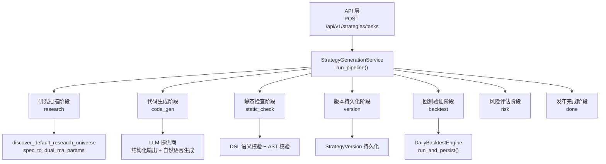
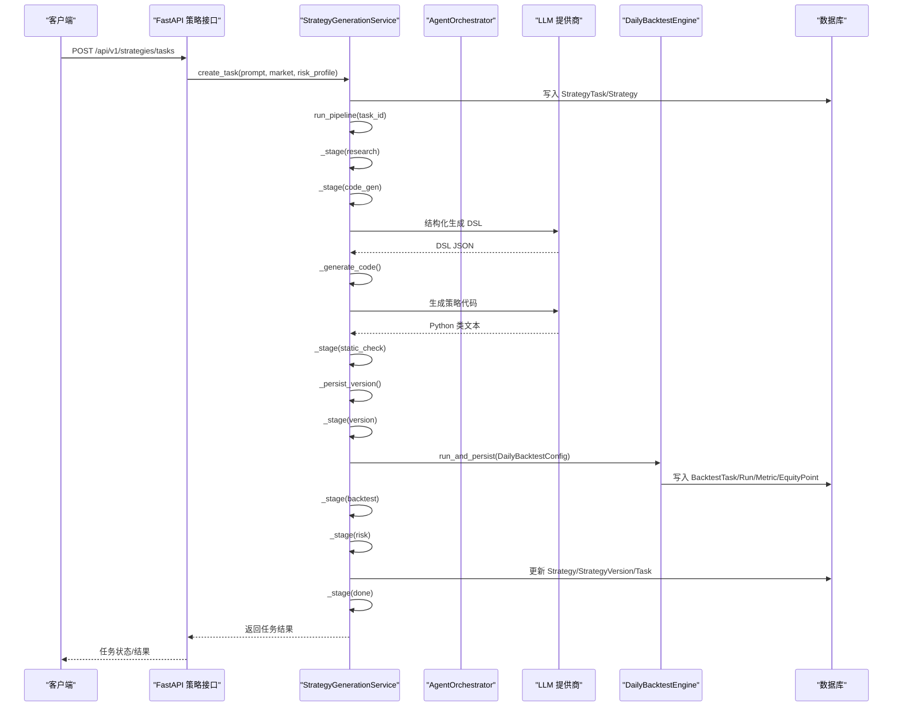
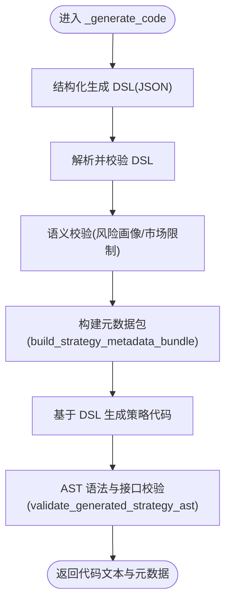
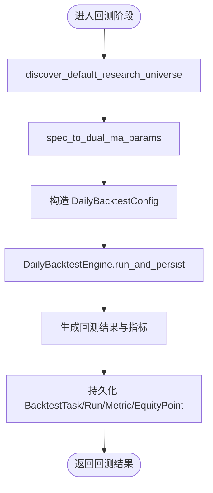
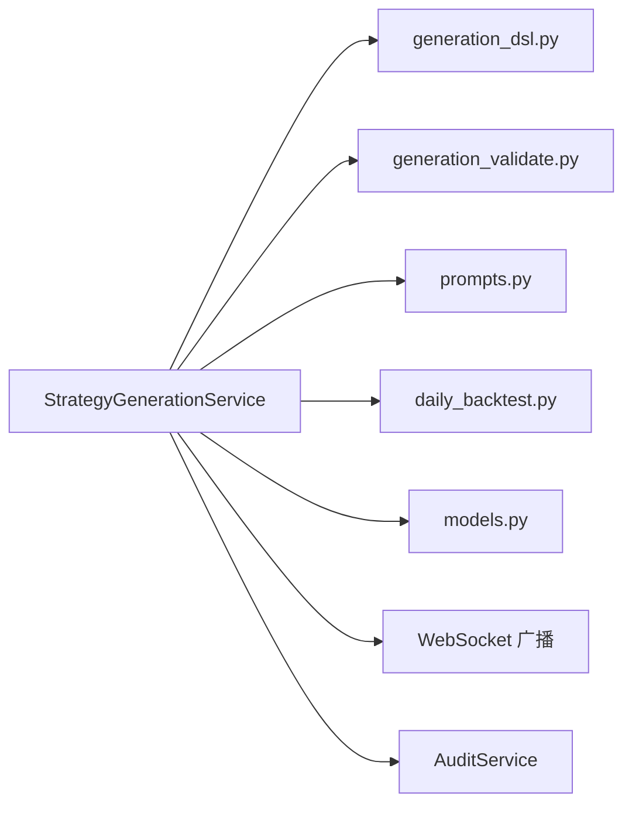

# 策略生成流水线阶段

<cite>
**本文引用的文件**
- [backend/app/services/strategy_generation.py](file://backend/app/services/strategy_generation.py)
- [backend/app/services/strategy_generation_research.py](file://backend/app/services/strategy_generation_research.py)
- [backend/app/services/daily_backtest.py](file://backend/app/services/daily_backtest.py)
- [backend/app/domains/strategy/models.py](file://backend/app/domains/strategy/models.py)
- [backend/app/domains/strategy/generation_dsl.py](file://backend/app/domains/strategy/generation_dsl.py)
- [backend/app/domains/strategy/generation_validate.py](file://backend/app/domains/strategy/generation_validate.py)
- [backend/app/integrations/llm/prompts.py](file://backend/app/integrations/llm/prompts.py)
- [backend/app/api/v1/strategies.py](file://backend/app/api/v1/strategies.py)
- [backend/tests/services/test_strategy_generation_e2e.py](file://backend/tests/services/test_strategy_generation_e2e.py)
</cite>

## 目录
1. [简介](#简介)
2. [项目结构](#项目结构)
3. [核心组件](#核心组件)
4. [架构总览](#架构总览)
5. [详细阶段分析](#详细阶段分析)
6. [依赖关系分析](#依赖关系分析)
7. [性能考虑](#性能考虑)
8. [故障排查指南](#故障排查指南)
9. [结论](#结论)
10. [附录](#附录)

## 简介
本文件系统性梳理“策略生成流水线”的七个阶段，面向研发与非技术读者，逐阶段说明任务内容、AI Agent 角色、进度百分比、事件类型与详细信息格式，并解释阶段间依赖、错误处理与状态转换逻辑。同时给出关键配置参数、超时与重试策略建议，帮助在生产环境中稳定运行。

## 项目结构
围绕策略生成流水线的关键代码分布在以下模块：
- 流水线编排与事件广播：StrategyGenerationService
- 研究回测辅助：discover_default_research_universe、spec_to_dual_ma_params
- 回测引擎：DailyBacktestEngine 及其配置类
- DSL 定义与校验：StrategyGenerationSpec、parse_strategy_generation_spec、build_strategy_metadata_bundle、validate_* 系列
- LLM 提示词模板：STRATEGY_SPEC_* 与 STRATEGY_GENERATION_* 模板
- API 入口：创建任务、触发流水线、查询结果
- 数据模型：Strategy、StrategyVersion、StrategyTask、PipelineEvent

图表来源
- [backend/app/api/v1/strategies.py:301-314](file://backend/app/api/v1/strategies.py#L301-L314)
- [backend/app/services/strategy_generation.py:132-373](file://backend/app/services/strategy_generation.py#L132-L373)
- [backend/app/services/daily_backtest.py:285-371](file://backend/app/services/daily_backtest.py#L285-L371)
- [backend/app/services/strategy_generation_research.py:49-81](file://backend/app/services/strategy_generation_research.py#L49-L81)
- [backend/app/domains/strategy/generation_validate.py:107-216](file://backend/app/domains/strategy/generation_validate.py#L107-L216)
- [backend/app/integrations/llm/prompts.py:1-94](file://backend/app/integrations/llm/prompts.py#L1-L94)

章节来源
- [backend/app/api/v1/strategies.py:301-314](file://backend/app/api/v1/strategies.py#L301-L314)
- [backend/app/services/strategy_generation.py:132-373](file://backend/app/services/strategy_generation.py#L132-L373)

## 核心组件
- StrategyGenerationService：负责流水线编排、阶段事件记录、Agent 调度、WebSocket 广播与失败归因。
- DailyBacktestEngine：执行研究回测，产出指标并持久化到数据库。
- StrategyGenerationSpec 与校验器：约束 DSL 结构与语义，确保与风险画像一致。
- LLM 提示词：先结构化生成 DSL，再基于 DSL 生成策略代码。
- 数据模型：Strategy、StrategyVersion、StrategyTask、PipelineEvent 支撑状态与审计。

章节来源
- [backend/app/services/strategy_generation.py:86-584](file://backend/app/services/strategy_generation.py#L86-L584)
- [backend/app/services/daily_backtest.py:185-371](file://backend/app/services/daily_backtest.py#L185-L371)
- [backend/app/domains/strategy/generation_dsl.py:78-144](file://backend/app/domains/strategy/generation_dsl.py#L78-L144)
- [backend/app/domains/strategy/generation_validate.py:48-216](file://backend/app/domains/strategy/generation_validate.py#L48-L216)
- [backend/app/domains/strategy/models.py:9-84](file://backend/app/domains/strategy/models.py#L9-L84)

## 架构总览
下图展示从自然语言到最终发布的完整调用序列，包括事件广播与 Agent 交互。

图表来源
- [backend/app/api/v1/strategies.py:301-314](file://backend/app/api/v1/strategies.py#L301-L314)
- [backend/app/services/strategy_generation.py:132-373](file://backend/app/services/strategy_generation.py#L132-L373)
- [backend/app/services/daily_backtest.py:285-371](file://backend/app/services/daily_backtest.py#L285-L371)

## 详细阶段分析

### 阶段一：研究扫描阶段（research）
- 任务内容
  - 初始化占位策略与任务状态，准备流水线上下文。
  - 记录阶段事件，推进进度至 15%，标记 AI Agent 角色为“research”。
- AI Agent 角色
  - 角色名：research；事件主题：strategy.research。
- 进度百分比
  - 15%
- 事件类型与详细信息
  - 事件：research.scan
  - 详情：包含数据源列表（如 macro、sector_rotation），用于后续回测与特征工程。
- 依赖关系
  - 依赖数据库会话以写入 PipelineEvent。
- 错误处理与状态转换
  - 此阶段为预处理，异常将由上层统一捕获并归类到失败阶段。
- 配置参数与超时
  - 无显式超时参数；若需扩展，可在 _stage 中增加超时控制。
- 重试策略
  - 无自动重试；失败时由 run_pipeline 的异常分支统一处理。

章节来源
- [backend/app/services/strategy_generation.py:161-170](file://backend/app/services/strategy_generation.py#L161-L170)
- [backend/app/services/strategy_generation.py:377-444](file://backend/app/services/strategy_generation.py#L377-L444)

### 阶段二：代码生成阶段（code_gen）
- 任务内容
  - 使用 LLM 提供商生成结构化 DSL，随后基于 DSL 生成策略 Python 类。
  - 记录生成字符数与模型信息，推进进度至 35%。
- AI Agent 角色
  - 角色名：strategy；事件主题：strategy.code。
- 进度百分比
  - 35%
- 事件类型与详细信息
  - 事件：code.generated
  - 详情：包含生成字符数与模型名称。
- 依赖关系
  - 依赖 LLM 提供商；依赖提示词模板；依赖 _generate_code 实现。
- 错误处理与状态转换
  - 任何 LLM 生成失败或中间异常均向上抛出，由 run_pipeline 统一归类。
- 配置参数与超时
  - 温度参数固定为 0.2；可按需调整温度与超时。
- 重试策略
  - 无自动重试；失败时由 run_pipeline 的异常分支统一处理。

图表来源
- [backend/app/services/strategy_generation.py:445-514](file://backend/app/services/strategy_generation.py#L445-L514)
- [backend/app/domains/strategy/generation_validate.py:107-216](file://backend/app/domains/strategy/generation_validate.py#L107-L216)
- [backend/app/domains/strategy/generation_dsl.py:108-144](file://backend/app/domains/strategy/generation_dsl.py#L108-L144)
- [backend/app/integrations/llm/prompts.py:57-94](file://backend/app/integrations/llm/prompts.py#L57-L94)

章节来源
- [backend/app/services/strategy_generation.py:172-182](file://backend/app/services/strategy_generation.py#L172-L182)
- [backend/app/services/strategy_generation.py:445-514](file://backend/app/services/strategy_generation.py#L445-L514)

### 阶段三：静态检查阶段（static_check）
- 任务内容
  - 执行多项静态检查：AST 解析、DSL 语义、策略接口契约、未来数据泄漏防护。
  - 推进进度至 50%。
- AI Agent 角色
  - 角色名：strategy；事件主题：strategy.static_check。
- 进度百分比
  - 50%
- 事件类型与详细信息
  - 事件：code.static_check_passed
  - 详情：包含检查项列表（如 ast.parse、dsl_semantics、strategy_interface、future_data_guard）。
- 依赖关系
  - 依赖 generation_validate 模块的 validate_* 函数。
- 错误处理与状态转换
  - 任一检查失败将导致流水线终止并归类为 static_check 失败。
- 配置参数与超时
  - 无显式超时参数。
- 重试策略
  - 无自动重试；失败时由 run_pipeline 的异常分支统一处理。

章节来源
- [backend/app/services/strategy_generation.py:184-193](file://backend/app/services/strategy_generation.py#L184-L193)
- [backend/app/domains/strategy/generation_validate.py:48-216](file://backend/app/domains/strategy/generation_validate.py#L48-L216)

### 阶段四：版本持久化阶段（version）
- 任务内容
  - 将策略代码与元数据快照为 StrategyVersion，以便回测引用。
  - 推进进度至 40%（注意：此阶段进度低于 static_check，体现“先生成再持久化”的顺序）。
- AI Agent 角色
  - 角色名：strategy；事件主题：strategy.version。
- 进度百分比
  - 40%
- 事件类型与详细信息
  - 事件：version.created
  - 详情：包含新创建的版本 ID。
- 依赖关系
  - 依赖 StrategyVersion 模型与持久化逻辑。
- 错误处理与状态转换
  - 持久化失败将导致流水线终止并归类为 version 失败。
- 配置参数与超时
  - 无显式超时参数。
- 重试策略
  - 无自动重试；失败时由 run_pipeline 的异常分支统一处理。

章节来源
- [backend/app/services/strategy_generation.py:195-205](file://backend/app/services/strategy_generation.py#L195-L205)
- [backend/app/services/strategy_generation.py:537-554](file://backend/app/services/strategy_generation.py#L537-L554)
- [backend/app/domains/strategy/models.py:30-42](file://backend/app/domains/strategy/models.py#L30-L42)

### 阶段五：回测验证阶段（backtest）
- 任务内容
  - 基于默认研究标的与时间窗口，使用内置 dual_ma 策略进行研究回测。
  - 将回测结果映射为流水线字典，推进进度至 75%。
  - 同步尝试更新特征库与血缘链路（尽力而为，不阻塞主流程）。
- AI Agent 角色
  - 角色名：backtest；事件主题：strategy.backtest。
- 进度百分比
  - 75%
- 事件类型与详细信息
  - 事件：backtest.completed
  - 详情：包含回测关键指标（如夏普、最大回撤、年化收益、累计收益、胜率、换手率、OOS 评分、置信度、backtestTaskId、backtestRunId、研究策略名与日期范围）。
- 依赖关系
  - 依赖 DailyBacktestEngine；依赖 discover_default_research_universe 与 spec_to_dual_ma_params。
- 错误处理与状态转换
  - 回测数据不足或引擎异常将导致 backtest 失败；异常会被归类并记录。
- 配置参数与超时
  - 初始资金、交易成本假设、滑点等在 DailyBacktestConfig/BacktestCostConfig 中定义；未见显式超时参数。
- 重试策略
  - 无自动重试；失败时由 run_pipeline 的异常分支统一处理。

图表来源
- [backend/app/services/strategy_generation.py:207-262](file://backend/app/services/strategy_generation.py#L207-L262)
- [backend/app/services/daily_backtest.py:285-371](file://backend/app/services/daily_backtest.py#L285-L371)
- [backend/app/services/strategy_generation_research.py:49-81](file://backend/app/services/strategy_generation_research.py#L49-L81)

章节来源
- [backend/app/services/strategy_generation.py:207-262](file://backend/app/services/strategy_generation.py#L207-L262)
- [backend/app/services/daily_backtest.py:148-284](file://backend/app/services/daily_backtest.py#L148-L284)
- [backend/app/services/strategy_generation_research.py:15-46](file://backend/app/services/strategy_generation_research.py#L15-L46)

### 阶段六：风险评估阶段（risk）
- 任务内容
  - 基于回测指标与任务风险画像，执行风险阈值检查（最大回撤与夏普比率）。
  - 推进进度至 90%。
- AI Agent 角色
  - 角色名：risk；事件主题：strategy.risk。
- 进度百分比
  - 90%
- 事件类型与详细信息
  - 事件：risk.passed 或 risk.flagged
  - 详情：包含是否通过与回测指标。
- 依赖关系
  - 依赖 _check_risk 与风险上限表（按保守/平衡/激进划分）。
- 错误处理与状态转换
  - 若不满足风险阈值，流水线终止并归类为 risk 失败。
- 配置参数与超时
  - 无显式超时参数。
- 重试策略
  - 无自动重试；失败时由 run_pipeline 的异常分支统一处理。

章节来源
- [backend/app/services/strategy_generation.py:264-277](file://backend/app/services/strategy_generation.py#L264-L277)
- [backend/app/services/strategy_generation.py:516-518](file://backend/app/services/strategy_generation.py#L516-L518)

### 阶段七：发布完成阶段（done）
- 任务内容
  - 将策略元数据与回测结果写入 Strategy，更新任务状态为 succeeded，推进进度至 100%。
  - 记录最终事件：strategy.published。
- AI Agent 角色
  - 角色名：strategy；事件主题：strategy.done。
- 进度百分比
  - 100%
- 事件类型与详细信息
  - 事件：strategy.published
  - 详情：包含策略 ID 与版本 ID。
- 依赖关系
  - 依赖 _update_strategy_from_meta 与数据库提交。
- 错误处理与状态转换
  - 成功后不再回滚；失败则由 run_pipeline 的异常分支统一处理。
- 配置参数与超时
  - 无显式超时参数。
- 重试策略
  - 无自动重试；失败时由 run_pipeline 的异常分支统一处理。

章节来源
- [backend/app/services/strategy_generation.py:279-299](file://backend/app/services/strategy_generation.py#L279-L299)
- [backend/app/services/strategy_generation.py:520-535](file://backend/app/services/strategy_generation.py#L520-L535)

## 依赖关系分析
- 流水线编排强依赖：
  - LLM 提供商：生成 DSL 与策略代码。
  - 回测引擎：执行研究回测并持久化结果。
  - 数据模型：支撑策略、版本、任务与事件的持久化。
- 阶段内耦合：
  - code_gen 依赖 generation_dsl 与 generation_validate。
  - backtest 依赖 research 辅助函数与回测引擎。
  - risk 依赖 backtest 输出指标。
- 外部集成：
  - WebSocket 广播：向前端推送事件。
  - 审计日志：记录任务生命周期关键动作。

图表来源
- [backend/app/services/strategy_generation.py:22-57](file://backend/app/services/strategy_generation.py#L22-L57)
- [backend/app/domains/strategy/generation_dsl.py:1-144](file://backend/app/domains/strategy/generation_dsl.py#L1-L144)
- [backend/app/domains/strategy/generation_validate.py:1-216](file://backend/app/domains/strategy/generation_validate.py#L1-L216)
- [backend/app/integrations/llm/prompts.py:1-94](file://backend/app/integrations/llm/prompts.py#L1-L94)
- [backend/app/services/daily_backtest.py:1-800](file://backend/app/services/daily_backtest.py#L1-L800)
- [backend/app/domains/strategy/models.py:1-84](file://backend/app/domains/strategy/models.py#L1-L84)

章节来源
- [backend/app/services/strategy_generation.py:86-584](file://backend/app/services/strategy_generation.py#L86-L584)

## 性能考虑
- LLM 生成
  - 温度参数固定为 0.2，保证输出稳定性；若需提升多样性，可适度提高温度并配合超时控制。
- 回测性能
  - 研究回测使用内置 dual_ma，计算开销可控；若回测标的与时间跨度扩大，建议分批或并行化（当前实现为串行）。
- 数据加载
  - 回测前需确保市场数据充足；数据缺失将直接导致回测失败。
- 广播与审计
  - WebSocket 广播与审计日志为幂等操作，对主流程影响较小；建议在高并发场景下限流或异步化。

## 故障排查指南
- 常见失败阶段与事件
  - risk.failed：风险阈值不满足。
  - backtest.failed：回测数据不足或引擎异常。
  - code.validation_failed：DSL 语义或 AST 校验失败。
  - code.generation_failed：LLM 生成失败。
  - pipeline.failed：其他未知异常。
- 归因规则
  - run_pipeline 根据异常消息关键词自动识别失败阶段，并写入 PipelineEvent。
- 策略回退
  - 失败时占位策略状态回退为 draft，便于重新生成。
- 排查步骤
  - 查看 PipelineEvent 列表，定位失败阶段与错误详情。
  - 检查回测任务与运行记录，确认数据可用性。
  - 校验 DSL 与生成代码是否符合接口契约。

章节来源
- [backend/app/services/strategy_generation.py:308-373](file://backend/app/services/strategy_generation.py#L308-L373)
- [backend/tests/services/test_strategy_generation_e2e.py:214-247](file://backend/tests/services/test_strategy_generation_e2e.py#L214-L247)

## 结论
该策略生成流水线以“DSL 驱动 + 研究回测 + 风险阈值”的方式，确保从自然语言到可执行策略的稳健落地。各阶段职责清晰、事件可观测、失败可归因。建议在生产环境引入 LLM 超时与重试、回测并行化与缓存、以及更细粒度的阶段级超时与重试策略，以进一步提升吞吐与稳定性。

## 附录

### 阶段汇总与关键参数
- 研究扫描（research）
  - 进度：15%
  - 事件：research.scan
  - 详情：sources
- 代码生成（code_gen）
  - 进度：35%
  - 事件：code.generated
  - 详情：chars, model
- 静态检查（static_check）
  - 进度：50%
  - 事件：code.static_check_passed
  - 详情：checks
- 版本持久化（version）
  - 进度：40%
  - 事件：version.created
  - 详情：versionId
- 回测验证（backtest）
  - 进度：75%
  - 事件：backtest.completed
  - 详情：指标字典（含夏普、最大回撤、年化收益、累计收益、胜率、换手率、OOS 评分、置信度、backtestTaskId、backtestRunId、研究策略名与日期范围）
- 风险评估（risk）
  - 进度：90%
  - 事件：risk.passed/risk.flagged
  - 详情：approved, metrics
- 发布完成（done）
  - 进度：100%
  - 事件：strategy.published
  - 详情：strategyId, versionId

### 关键配置与建议
- LLM
  - 温度：0.2（稳定）
  - 建议：为不同阶段设置独立超时；对生成失败启用指数退避重试。
- 回测
  - 初始资金：1,000,000.0
  - 交易成本：佣金、印花税、最低佣金、滑点
  - 建议：根据市场类型调整滑点与最小佣金；对长跨度回测采用分批或并行。
- 风险阈值
  - 最大回撤上限随风险画像变化（保守/平衡/激进）
  - 夏普比率下限：0.8
  - 建议：允许用户自定义阈值并记录到 PipelineEvent。