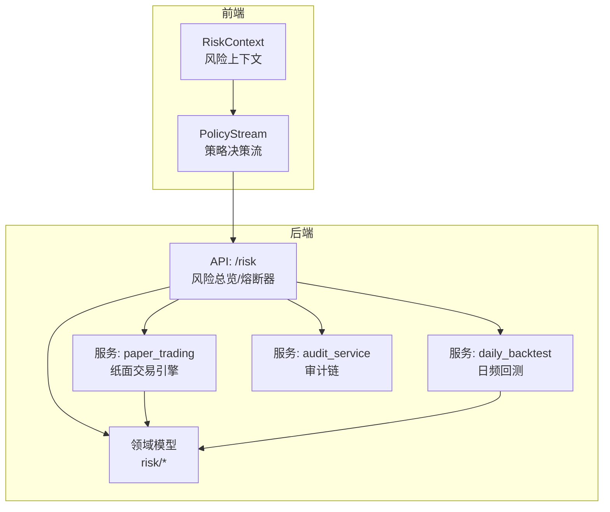
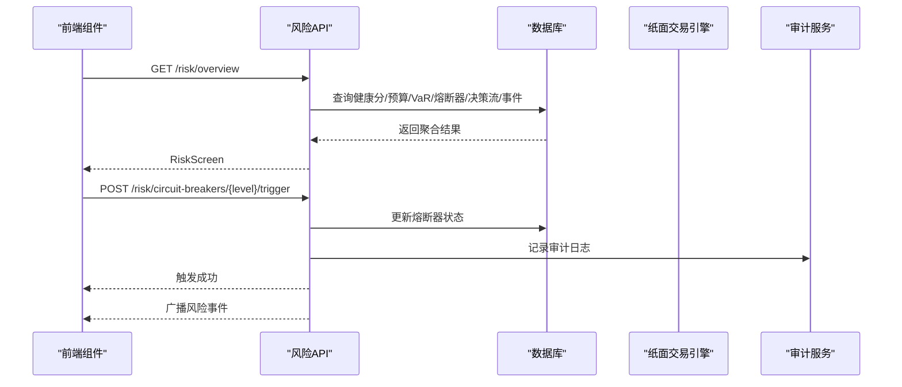
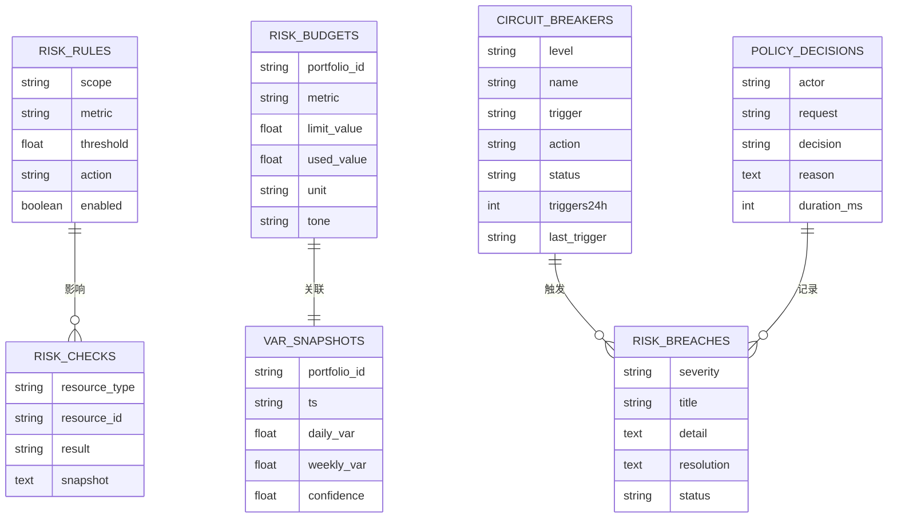
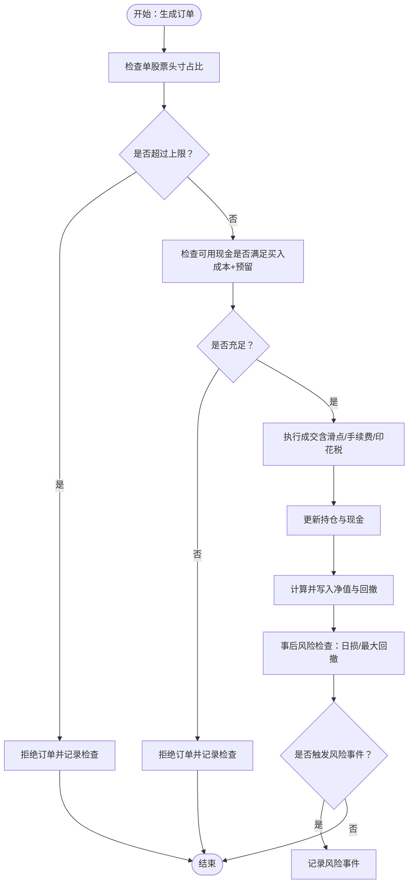
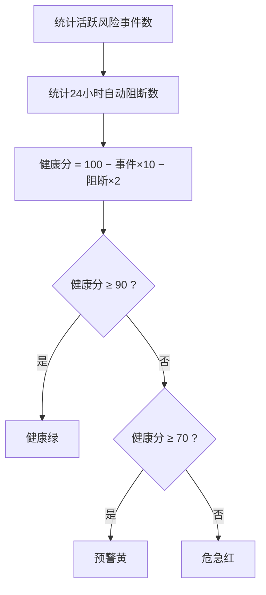
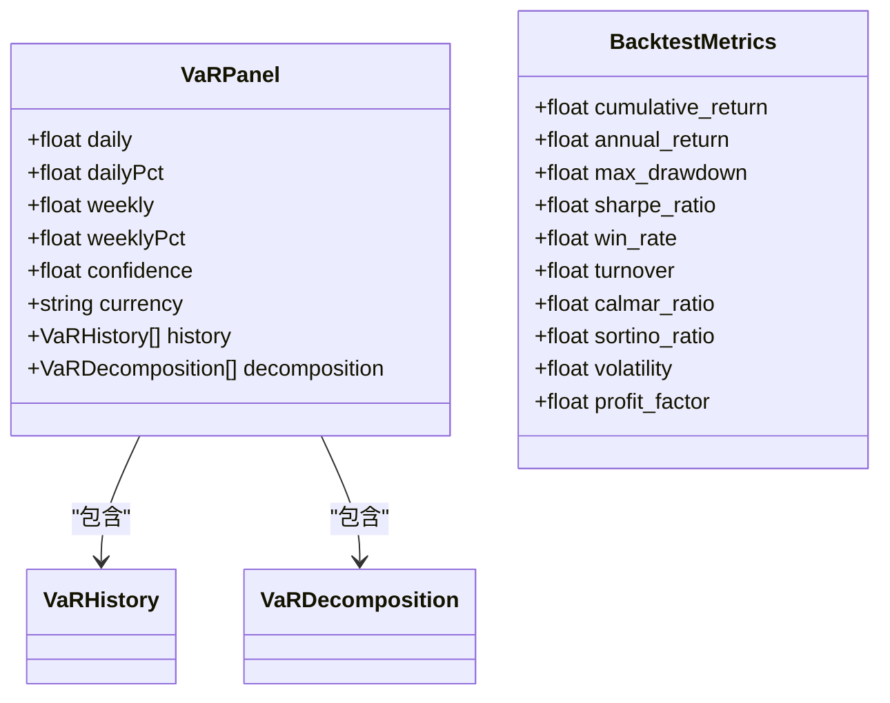
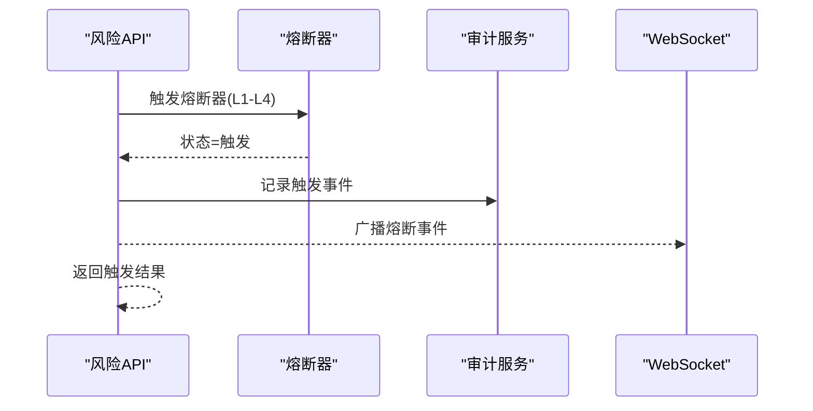
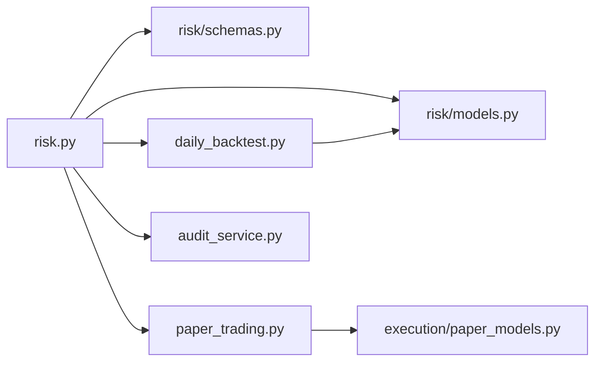

# 风险评估与控制

<cite>
**本文引用的文件**
- [backend/app/api/v1/risk.py](file://backend/app/api/v1/risk.py)
- [backend/app/domains/risk/models.py](file://backend/app/domains/risk/models.py)
- [backend/app/domains/risk/schemas.py](file://backend/app/domains/risk/schemas.py)
- [backend/app/services/paper_trading.py](file://backend/app/services/paper_trading.py)
- [backend/app/domains/execution/paper_models.py](file://backend/app/domains/execution/paper_models.py)
- [backend/app/services/daily_backtest.py](file://backend/app/services/daily_backtest.py)
- [backend/app/services/audit_service.py](file://backend/app/services/audit_service.py)
- [frontend/src/contexts/RiskContext.tsx](file://frontend/src/contexts/RiskContext.tsx)
- [frontend/src/screens/Risk/PolicyStream.tsx](file://frontend/src/screens/Risk/PolicyStream.tsx)
- [backend/app/db/migrations/versions/20260513_000001_execution_risk_portfolio.py](file://backend/app/db/migrations/versions/20260513_000001_execution_risk_portfolio.py)
</cite>

## 目录
1. [简介](#简介)
2. [项目结构](#项目结构)
3. [核心组件](#核心组件)
4. [架构总览](#架构总览)
5. [详细组件分析](#详细组件分析)
6. [依赖关系分析](#依赖关系分析)
7. [性能考量](#性能考量)
8. [故障排查指南](#故障排查指南)
9. [结论](#结论)
10. [附录](#附录)

## 简介
本文件系统化梳理风险评估与控制系统的设计与实现，覆盖风险阈值配置、动态风险检查算法、风险评分计算与自动控制机制。重点解释不同风险配置文件的参数含义、最大回撤限制、夏普比率阈值与风险等级划分；阐述风险评估的实时监控、异常检测与自动阻断机制；并提供风险配置最佳实践、调优指南与应急处理方案。

## 项目结构
该系统由后端 API、领域模型与服务层、前端上下文与展示组件构成，围绕“策略运行 → 预交易检查 → 执行成交 → 风险监测 → 熔断与告警”的闭环展开。

图表来源
- [backend/app/api/v1/risk.py:188-207](file://backend/app/api/v1/risk.py#L188-L207)
- [backend/app/domains/risk/models.py:1-101](file://backend/app/domains/risk/models.py#L1-L101)
- [backend/app/services/paper_trading.py:76-134](file://backend/app/services/paper_trading.py#L76-L134)
- [backend/app/services/daily_backtest.py:185-283](file://backend/app/services/daily_backtest.py#L185-L283)
- [backend/app/services/audit_service.py:32-81](file://backend/app/services/audit_service.py#L32-L81)

章节来源
- [backend/app/api/v1/risk.py:1-273](file://backend/app/api/v1/risk.py#L1-L273)
- [backend/app/domains/risk/models.py:1-101](file://backend/app/domains/risk/models.py#L1-L101)
- [backend/app/domains/risk/schemas.py:1-96](file://backend/app/domains/risk/schemas.py#L1-L96)
- [backend/app/services/paper_trading.py:1-634](file://backend/app/services/paper_trading.py#L1-L634)
- [backend/app/domains/execution/paper_models.py:1-133](file://backend/app/domains/execution/paper_models.py#L1-L133)
- [backend/app/services/daily_backtest.py:1-899](file://backend/app/services/daily_backtest.py#L1-L899)
- [backend/app/services/audit_service.py:1-109](file://backend/app/services/audit_service.py#L1-L109)
- [frontend/src/contexts/RiskContext.tsx:1-13](file://frontend/src/contexts/RiskContext.tsx#L1-L13)
- [frontend/src/screens/Risk/PolicyStream.tsx:1-42](file://frontend/src/screens/Risk/PolicyStream.tsx#L1-L42)

## 核心组件
- 风险总览 API：聚合健康分、预算使用、VaR、熔断器状态、策略决策流与风险事件。
- 风控规则与检查：支持按账户/组合/策略/订单维度配置阈值与动作（告警/阻断/熔断）。
- 纸面交易引擎：每日信号生成、预交易检查、成交执行、净值更新与事后风险事件。
- 回测指标：提供最大回撤、夏普比率等关键指标用于策略评估与阈值设定参考。
- 审计链：对风险相关操作进行不可篡改记录，支撑合规与追溯。

章节来源
- [backend/app/api/v1/risk.py:188-207](file://backend/app/api/v1/risk.py#L188-L207)
- [backend/app/domains/risk/models.py:9-101](file://backend/app/domains/risk/models.py#L9-L101)
- [backend/app/services/paper_trading.py:314-577](file://backend/app/services/paper_trading.py#L314-L577)
- [backend/app/services/daily_backtest.py:702-799](file://backend/app/services/daily_backtest.py#L702-L799)
- [backend/app/services/audit_service.py:32-81](file://backend/app/services/audit_service.py#L32-L81)

## 架构总览
系统采用“数据驱动 + 事件驱动”的架构：API 层负责聚合与对外展示；领域模型承载规则与状态；服务层实现业务流程；审计服务保障可追溯性。前端通过上下文与组件消费风险数据，形成闭环。

图表来源
- [backend/app/api/v1/risk.py:188-272](file://backend/app/api/v1/risk.py#L188-L272)
- [backend/app/services/audit_service.py:38-81](file://backend/app/services/audit_service.py#L38-L81)

## 详细组件分析

### 风险阈值配置与规则模型
- 配置项
  - 作用域：账户/组合/策略/订单
  - 指标：最大回撤、日损失、头寸限额、VaR 等
  - 阈值：数值型阈值
  - 动作：告警、阻断、熔断开关
  - 状态：启用/禁用
- 风控检查记录：记录每次检查的结果（通过/观察/失败）及快照
- 风控预算：按指标分配限额与使用量，带单位与状态色
- VaR 快照：记录日/周 VaR、置信度与时间戳
- 熔断器：分级（L1-L4）、触发条件、动作、状态与24小时触发次数
- 风控事件：严重级别、标题、详情、处置建议与状态
- 策略决策：策略引擎决策流，包含执行者、请求、决策、原因与耗时

图表来源
- [backend/app/domains/risk/models.py:9-101](file://backend/app/domains/risk/models.py#L9-L101)
- [backend/app/db/migrations/versions/20260513_000001_execution_risk_portfolio.py:177-203](file://backend/app/db/migrations/versions/20260513_000001_execution_risk_portfolio.py#L177-L203)

章节来源
- [backend/app/domains/risk/models.py:9-101](file://backend/app/domains/risk/models.py#L9-L101)
- [backend/app/domains/risk/schemas.py:6-96](file://backend/app/domains/risk/schemas.py#L6-L96)
- [backend/app/db/migrations/versions/20260513_000001_execution_risk_portfolio.py:177-203](file://backend/app/db/migrations/versions/20260513_000001_execution_risk_portfolio.py#L177-L203)

### 动态风险检查算法（纸面交易）
- 预交易检查
  - 单股票头寸上限：基于期初净值的比例限制
  - 现金底仓：保留至少一定比例的现金作为流动性缓冲
  - 价格有效性与买卖许可：过滤无效或停牌标的
- 事后风险事件
  - 日内最大亏损超过阈值（示例：当日净值较前一日跌幅超阈值）
  - 最大回撤超过阈值（示例：创新高以来回撤超阈值）

图表来源
- [backend/app/services/paper_trading.py:314-577](file://backend/app/services/paper_trading.py#L314-L577)

章节来源
- [backend/app/services/paper_trading.py:314-577](file://backend/app/services/paper_trading.py#L314-L577)
- [backend/app/domains/execution/paper_models.py:108-133](file://backend/app/domains/execution/paper_models.py#L108-L133)

### 风险评分计算与健康状态
- 健康分 = max(0, 100 − 活跃风险事件数 × 10 − 24小时自动阻断数 × 2)
- 健康状态分级
  - ≥90：健康（绿色）
  - ≥70：预警（黄色）
  - <70：危急（红色）
- 其他指标：待办审批数、最近一次事件、熔断开关状态

图表来源
- [backend/app/api/v1/risk.py:39-71](file://backend/app/api/v1/risk.py#L39-L71)

章节来源
- [backend/app/api/v1/risk.py:39-71](file://backend/app/api/v1/risk.py#L39-L71)

### VaR 与风险指标
- VaR 面板：包含日/周 VaR、置信度、历史序列与分解（策略贡献）
- 回测指标：最大回撤、夏普比率、卡玛比率、索提诺比率、波动率、换手率、胜率等
- 夏普比率阈值：可用于策略筛选与风控阈值设定（示例：低于某阈值触发观察/阻断）

图表来源
- [backend/app/domains/risk/schemas.py:45-54](file://backend/app/domains/risk/schemas.py#L45-L54)
- [backend/app/services/daily_backtest.py:97-110](file://backend/app/services/daily_backtest.py#L97-L110)

章节来源
- [backend/app/domains/risk/schemas.py:45-54](file://backend/app/domains/risk/schemas.py#L45-L54)
- [backend/app/services/daily_backtest.py:702-799](file://backend/app/services/daily_backtest.py#L702-L799)

### 自动控制与熔断机制
- 熔断器分级（L1-L4）：定义触发条件与动作，支持手动触发与恢复
- 策略决策流：记录策略引擎的允许/拒绝/需审批/修改等决策，便于审计与可视化
- 审计链：对风险相关操作进行哈希链记录，确保不可篡改

图表来源
- [backend/app/api/v1/risk.py:210-239](file://backend/app/api/v1/risk.py#L210-L239)
- [backend/app/services/audit_service.py:38-81](file://backend/app/services/audit_service.py#L38-L81)

章节来源
- [backend/app/api/v1/risk.py:210-272](file://backend/app/api/v1/risk.py#L210-L272)
- [backend/app/services/audit_service.py:32-81](file://backend/app/services/audit_service.py#L32-L81)

### 实时监控与前端展示
- 风险上下文：为前端组件提供 Mock 数据入口
- 策略决策流：展示实时决策与统计（允许/拒绝/审批/修改），并标注平均耗时

章节来源
- [frontend/src/contexts/RiskContext.tsx:1-13](file://frontend/src/contexts/RiskContext.tsx#L1-L13)
- [frontend/src/screens/Risk/PolicyStream.tsx:1-42](file://frontend/src/screens/Risk/PolicyStream.tsx#L1-L42)

## 依赖关系分析
- API 对领域模型与服务层存在直接依赖，负责数据聚合与对外输出
- 纸面交易引擎依赖市场数据、策略运行器与成本模型，完成下单、成交与净值更新
- 回测服务提供指标计算能力，为阈值设定与策略评估提供依据
- 审计服务独立于业务流程，提供不可篡改的审计链

图表来源
- [backend/app/api/v1/risk.py:1-273](file://backend/app/api/v1/risk.py#L1-L273)
- [backend/app/domains/risk/models.py:1-101](file://backend/app/domains/risk/models.py#L1-L101)
- [backend/app/domains/risk/schemas.py:1-96](file://backend/app/domains/risk/schemas.py#L1-L96)
- [backend/app/services/paper_trading.py:1-634](file://backend/app/services/paper_trading.py#L1-L634)
- [backend/app/domains/execution/paper_models.py:1-133](file://backend/app/domains/execution/paper_models.py#L1-L133)
- [backend/app/services/daily_backtest.py:1-899](file://backend/app/services/daily_backtest.py#L1-L899)
- [backend/app/services/audit_service.py:1-109](file://backend/app/services/audit_service.py#L1-L109)

章节来源
- [backend/app/api/v1/risk.py:1-273](file://backend/app/api/v1/risk.py#L1-L273)
- [backend/app/services/paper_trading.py:1-634](file://backend/app/services/paper_trading.py#L1-L634)
- [backend/app/services/daily_backtest.py:1-899](file://backend/app/services/daily_backtest.py#L1-L899)
- [backend/app/services/audit_service.py:1-109](file://backend/app/services/audit_service.py#L1-L109)

## 性能考量
- 预交易检查与事后检查均为轻量级计算，主要瓶颈在数据库查询与审计写入
- VaR 与回测指标计算复杂度与样本长度成正比，建议在离线任务中定期生成并缓存
- WebSocket 广播仅在熔断器状态变更时触发，频率可控
- 建议对高频查询建立索引（如状态、时间戳、严重级别等）

## 故障排查指南
- 熔断器无法触发/恢复
  - 检查是否存在对应级别的熔断器记录
  - 确认状态流转是否符合预期（armed/triggered/cooldown）
  - 查看审计日志是否记录了相应事件
- 风控事件未产生
  - 检查预交易检查与事后检查的阈值设置
  - 确认市场数据与价格有效性
- 健康分异常
  - 核对活跃风险事件数与24小时自动阻断数统计
  - 检查策略决策流中的拒绝记录
- 审计链校验失败
  - 使用审计服务提供的链验证接口，定位首个断裂点

章节来源
- [backend/app/api/v1/risk.py:210-272](file://backend/app/api/v1/risk.py#L210-L272)
- [backend/app/services/audit_service.py:83-109](file://backend/app/services/audit_service.py#L83-L109)

## 结论
该系统以清晰的领域模型与服务层实现风险阈值配置、动态检查与自动控制，结合回测指标与审计链，形成从策略到执行再到风控的完整闭环。通过分级熔断器与策略决策流，既能保证实时响应，又能满足合规与可追溯要求。

## 附录

### 风险配置最佳实践
- 阈值设定
  - 最大回撤：建议以回测历史的最大回撤分布分位数为基准，结合组合规模设定
  - 日损失：可参考波动率与VaR，结合流动性缓冲设定
  - 头寸上限：按资产集中度与流动性设定，避免单一资产冲击
  - 夏普比率：作为策略筛选与阈值设定参考，低夏普策略应提高监控强度
- 分级熔断
  - L1/L2：观察/预警，自动阻断较少
  - L3/L4：阻断/熔断，快速止损
- 预交易检查
  - 现金底仓与头寸上限优先级高于其他检查
  - 价格有效性与买卖许可作为硬约束
- 审计与可视化
  - 所有风险相关操作均应记录审计链
  - 前端策略决策流应显示决策统计与平均耗时

### 调优指南
- 参数敏感性
  - 回撤阈值与阻断强度成反比，需平衡风险与收益
  - 夏普比率阈值过严可能导致策略无法执行，过松则失去控制意义
- 性能优化
  - 将VaR与回测指标纳入定时任务，减少在线计算压力
  - 对热点查询建立索引，提升响应速度
- 运维建议
  - 定期复盘熔断器触发原因，调整阈值与动作
  - 对策略决策流进行抽样审计，确保自动化决策合理

### 应急处理方案
- 熔断器触发
  - 立即冻结对应级别的交易权限，进入cooldown
  - 通知风控与合规团队，制定恢复方案
- 大额回撤
  - 触发L3/L4熔断，强制平仓并限制新开仓
  - 启动应急预案，评估市场风险与流动性
- 审计链异常
  - 立即隔离问题节点，重新生成审计链
  - 对历史数据进行一致性校验，必要时回滚