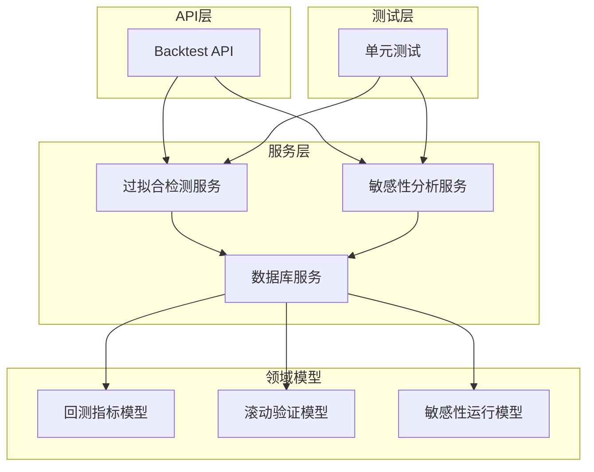
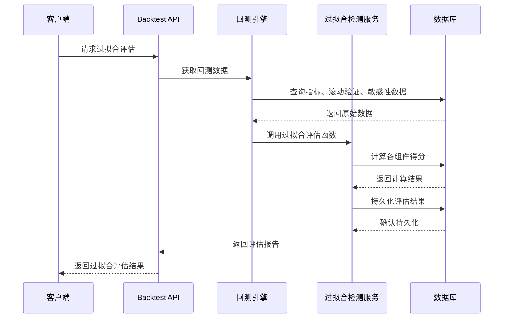
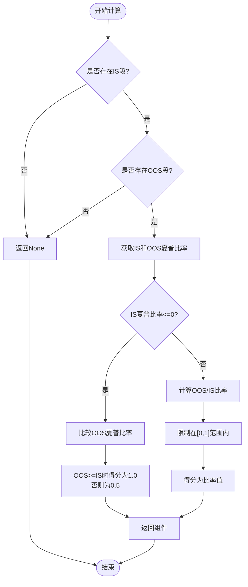
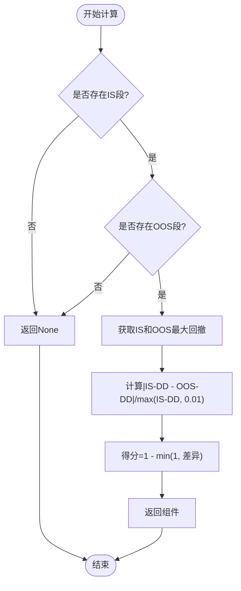
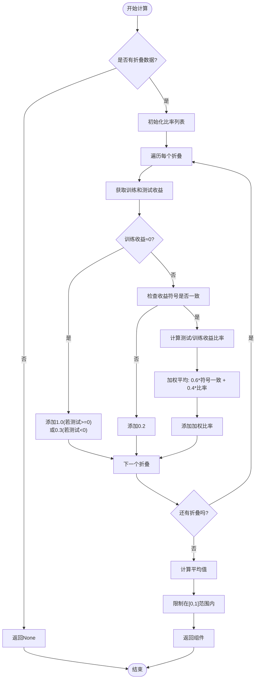
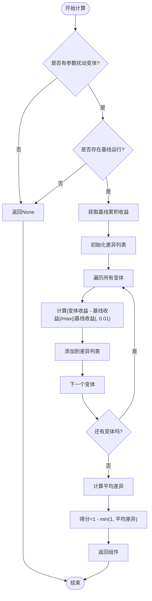
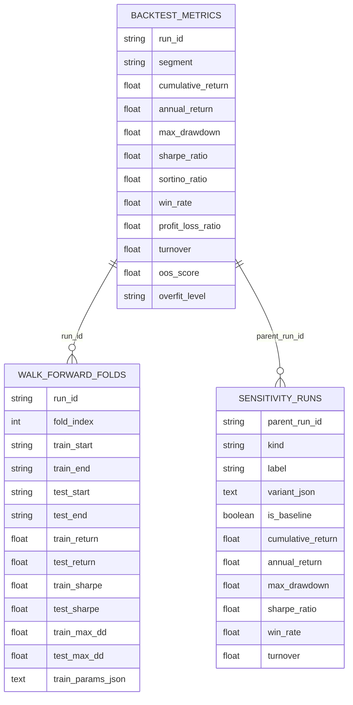
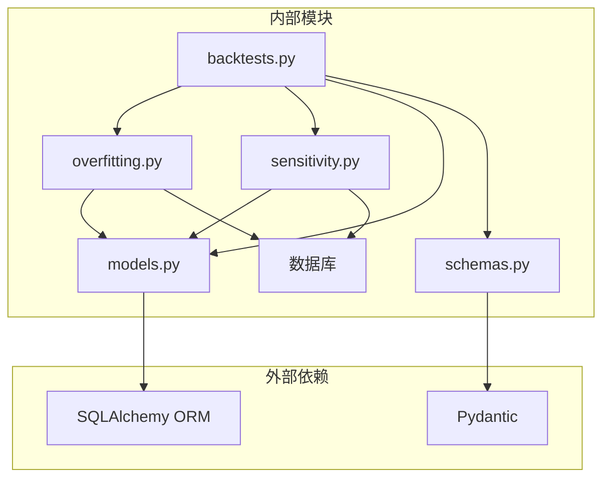
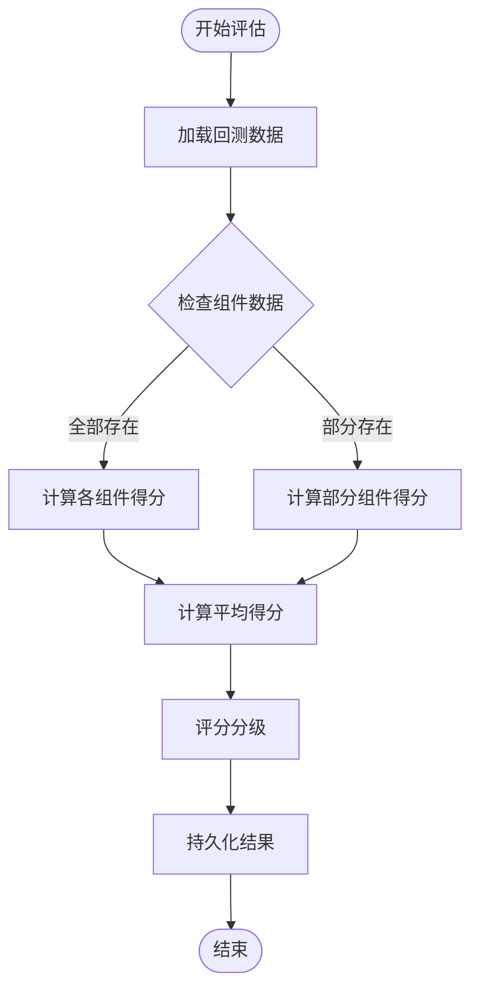

# 过拟合检测服务

<cite>
**本文档引用的文件**
- [overfitting.py](file://backend/app/services/overfitting.py)
- [test_overfitting.py](file://backend/tests/services/test_overfitting.py)
- [models.py](file://backend/app/domains/backtest/models.py)
- [schemas.py](file://backend/app/domains/backtest/schemas.py)
- [backtests.py](file://backend/app/api/v1/backtests.py)
- [sensitivity.py](file://backend/app/services/sensitivity.py)
- [daily_backtest.py](file://backend/app/services/daily_backtest.py)
- [65eb0814322d_walk_forward_folds.py](file://backend/app/db/migrations/versions/65eb0814322d_walk_forward_folds.py)
</cite>

## 目录
1. [简介](#简介)
2. [项目结构](#项目结构)
3. [核心组件](#核心组件)
4. [架构概览](#架构概览)
5. [详细组件分析](#详细组件分析)
6. [依赖关系分析](#依赖关系分析)
7. [性能考虑](#性能考虑)
8. [故障排查指南](#故障排查指南)
9. [结论](#结论)
10. [附录](#附录)

## 简介
本项目提供了一个完整的过拟合检测服务，用于评估量化策略在回测过程中的过拟合风险。该服务通过四个核心信号维度进行综合评估：样本内外样本收益对比、最大回撤一致性、滚动验证连续性和参数敏感性稳定性，并将结果映射到0-100分的评分体系中，最终分为低、中、高三个风险等级。

该服务不仅支持传统的样本外验证（IS/OOS），还集成了滚动验证（Walk-Forward）和参数敏感性分析，为用户提供全面的过拟合风险评估。同时，服务提供了灵活的阈值设定和预警机制，帮助用户及时发现和应对潜在的过拟合问题。

## 项目结构
过拟合检测服务位于后端应用的服务层，采用模块化设计，主要包含以下核心模块：

**图表来源**
- [overfitting.py:1-168](file://backend/app/services/overfitting.py#L1-L168)
- [backtests.py:1-1160](file://backend/app/api/v1/backtests.py#L1-L1160)

**章节来源**
- [overfitting.py:1-168](file://backend/app/services/overfitting.py#L1-L168)
- [models.py:1-155](file://backend/app/domains/backtest/models.py#L1-L155)

## 核心组件
过拟合检测服务由四个核心组件构成，每个组件都针对不同的过拟合风险维度：

### 1. 样本内外样本收益对比组件
该组件评估样本内（IS）和样本外（OOS）的夏普比率衰减情况，反映策略在不同时间段的表现一致性。

### 2. 最大回撤一致性组件
通过比较IS和OOS阶段的最大回撤，评估策略在不同市场环境下的风险控制能力。

### 3. 滚动验证连续性组件
基于Walk-Forward验证的训练-测试窗口收益连续性，确保策略在时间序列上的稳定性。

### 4. 参数敏感性稳定性组件
通过参数扰动实验，评估策略对参数变化的敏感程度，识别过度拟合特定参数组合的风险。

**章节来源**
- [overfitting.py:51-126](file://backend/app/services/overfitting.py#L51-L126)

## 架构概览
过拟合检测服务采用分层架构设计，实现了清晰的关注点分离：

**图表来源**
- [backtests.py:731-895](file://backend/app/api/v1/backtests.py#L731-L895)
- [overfitting.py:129-167](file://backend/app/services/overfitting.py#L129-L167)

## 详细组件分析

### 过拟合检测算法实现
过拟合检测服务的核心算法基于四个独立的信号组件，每个组件都有其特定的计算逻辑和阈值设定：

#### 样本内外样本收益对比算法
该算法通过计算样本外收益与样本内收益的比率来评估策略的泛化能力：

**图表来源**
- [overfitting.py:51-69](file://backend/app/services/overfitting.py#L51-L69)

#### 最大回撤一致性算法
该算法通过计算IS和OOS阶段最大回撤的相对差异来评估风险控制的一致性：

**图表来源**
- [overfitting.py:72-84](file://backend/app/services/overfitting.py#L72-L84)

#### 滚动验证连续性算法
该算法评估Walk-Forward验证中训练和测试窗口收益的一致性：

**图表来源**
- [overfitting.py:87-106](file://backend/app/services/overfitting.py#L87-L106)

#### 参数敏感性稳定性算法
该算法通过参数扰动实验评估策略对参数变化的敏感程度：

**图表来源**
- [overfitting.py:109-126](file://backend/app/services/overfitting.py#L109-L126)

**章节来源**
- [overfitting.py:51-126](file://backend/app/services/overfitting.py#L51-L126)

### 数据模型设计
过拟合检测服务依赖于完善的数据库模型设计，主要包括以下核心表：

**图表来源**
- [models.py:33-118](file://backend/app/domains/backtest/models.py#L33-L118)

**章节来源**
- [models.py:33-118](file://backend/app/domains/backtest/models.py#L33-L118)

### API接口设计
过拟合检测服务通过RESTful API提供访问接口，主要包括：

1. **报告接口**：`GET /api/v1/backtests/{task_id}/report`
   - 返回完整的回测报告，包含过拟合评估结果

2. **评估接口**：`GET /api/v1/backtests/{task_id}/overfit`
   - 专门获取过拟合评估结果

3. **实时评估接口**：`GET /api/v1/backtests/{task_id}/overfit`
   - 可以重新计算和更新过拟合评估

**章节来源**
- [backtests.py:731-895](file://backend/app/api/v1/backtests.py#L731-L895)

## 依赖关系分析
过拟合检测服务的依赖关系呈现清晰的单向依赖结构：

**图表来源**
- [overfitting.py:19-26](file://backend/app/services/overfitting.py#L19-L26)
- [backtests.py:11-53](file://backend/app/api/v1/backtests.py#L11-L53)

**章节来源**
- [overfitting.py:19-26](file://backend/app/services/overfitting.py#L19-L26)
- [backtests.py:11-53](file://backend/app/api/v1/backtests.py#L11-L53)

## 性能考虑
过拟合检测服务在设计时充分考虑了性能优化：

### 1. 异步数据库操作
服务使用异步SQLAlchemy会话进行数据库操作，避免阻塞I/O操作，提高并发处理能力。

### 2. 智能缓存策略
- 使用字典缓存IS/OOS指标数据，避免重复查询
- 滚动验证数据按折叠索引排序，便于快速访问
- 敏感性分析结果按父运行ID关联，减少JOIN操作

### 3. 内存优化
- 使用生成器表达式处理大量数据
- 及时释放不需要的数据引用
- 控制单次查询的数据量

### 4. 批量操作
- 将多个评估组件的计算合并为一次数据库查询
- 支持批量持久化评估结果

**章节来源**
- [overfitting.py:129-167](file://backend/app/services/overfitting.py#L129-L167)

## 故障排查指南

### 常见问题及解决方案

#### 1. 过拟合评估结果异常
**症状**：评估结果为0分或异常高分
**可能原因**：
- 缺少必要的回测数据
- 数据库连接异常
- 参数配置错误

**解决步骤**：
1. 检查回测任务是否成功完成
2. 验证数据库连接状态
3. 确认参数配置的合理性

#### 2. 滚动验证数据缺失
**症状**：滚动验证组件显示为None
**可能原因**：
- 未执行滚动验证分析
- 数据库迁移未完成
- 折叠数量不足

**解决步骤**：
1. 确认已执行滚动验证
2. 检查数据库迁移状态
3. 增加折叠数量

#### 3. 敏感性分析失败
**症状**：参数敏感性组件无法计算
**可能原因**：
- 敏感性分析未执行
- 基线运行数据缺失
- 参数扰动实验失败

**解决步骤**：
1. 重新执行敏感性分析
2. 检查基线运行数据
3. 验证参数扰动配置

**章节来源**
- [test_overfitting.py:50-108](file://backend/tests/services/test_overfitting.py#L50-L108)

### 性能监控指标
建议监控以下关键指标来评估过拟合检测服务的性能：

1. **响应时间**：单次评估的平均响应时间
2. **数据库查询次数**：每次评估的数据库查询数量
3. **内存使用**：服务的内存占用情况
4. **并发处理能力**：同时处理的评估请求数量

## 结论
过拟合检测服务通过四个维度的综合评估，为量化策略提供了全面的过拟合风险识别能力。服务采用模块化设计，具有良好的扩展性和维护性。通过合理的阈值设定和预警机制，用户可以及时发现和应对潜在的过拟合问题，提高策略的泛化能力和实际表现。

该服务的成功实施依赖于：
- 完善的数据模型设计
- 清晰的算法逻辑
- 合理的性能优化策略
- 有效的监控和故障排查机制

## 附录

### 配置选项
过拟合检测服务支持以下配置选项：

| 配置项 | 类型 | 默认值 | 描述 |
|--------|------|--------|------|
| 低风险阈值 | int | 70 | 评分≥70为低风险 |
| 中等风险阈值 | int | 40 | 评分40-69为中等风险 |
| 高风险阈值 | int | 0 | 评分<40为高风险 |

### 评估流程

### 测试策略
服务包含完整的单元测试，覆盖以下场景：
- 完整信号组合的评估
- 部分信号缺失的情况
- 边界条件和异常处理

**章节来源**
- [test_overfitting.py:50-108](file://backend/tests/services/test_overfitting.py#L50-L108)