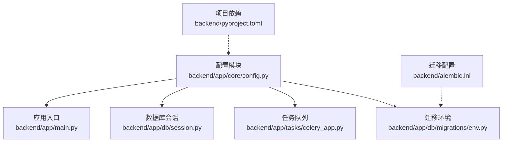
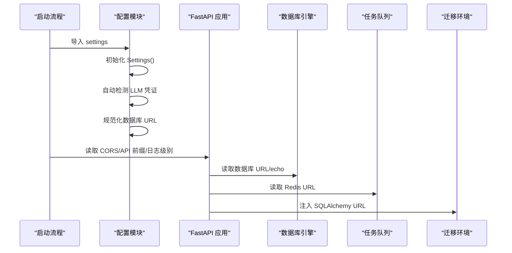
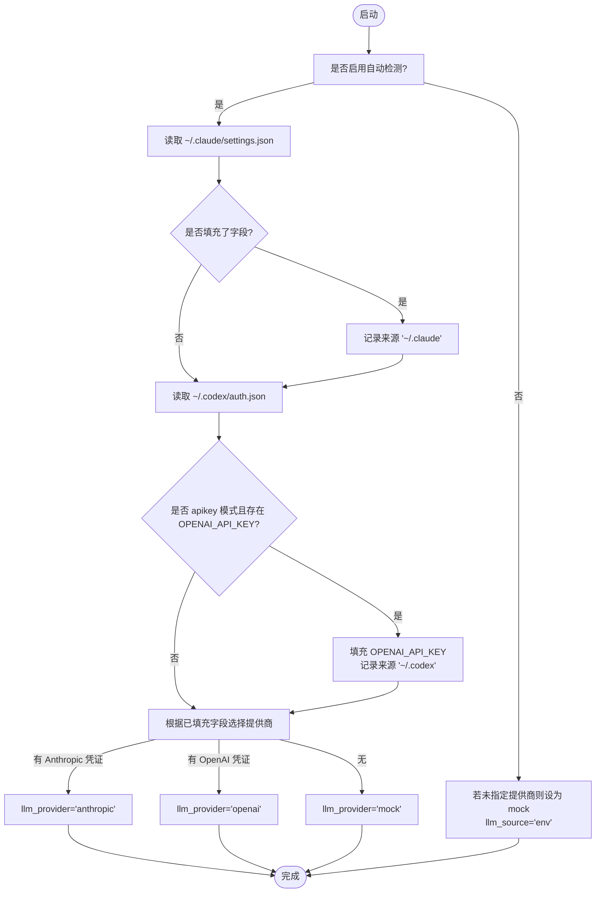
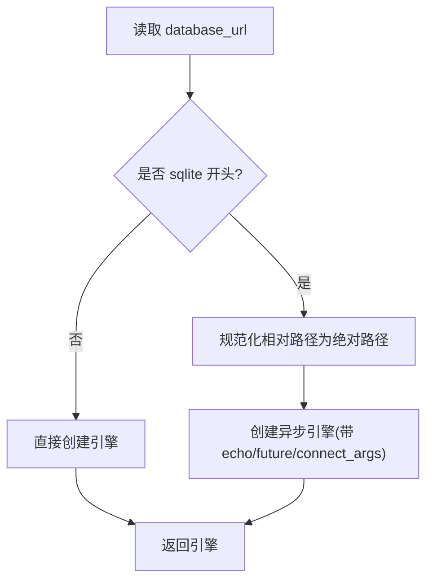
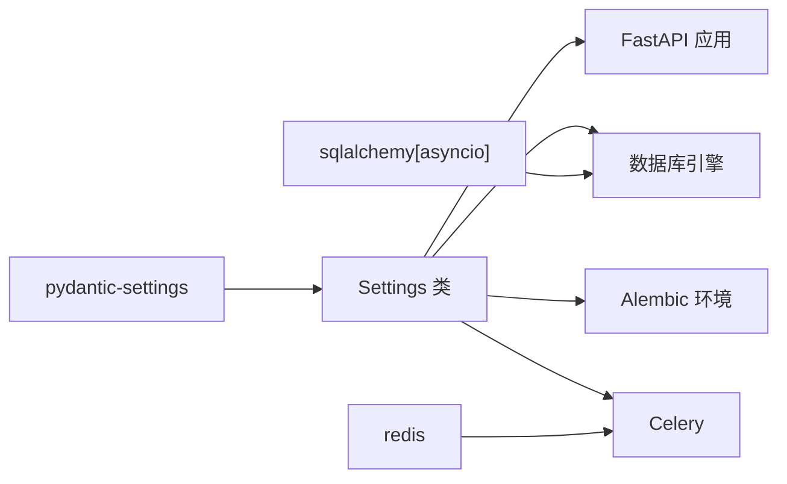

# 配置管理

<cite>
**本文引用的文件**
- [backend/app/core/config.py](file://backend/app/core/config.py)
- [backend/app/main.py](file://backend/app/main.py)
- [backend/app/core/security.py](file://backend/app/core/security.py)
- [backend/app/db/session.py](file://backend/app/db/session.py)
- [backend/app/tasks/celery_app.py](file://backend/app/tasks/celery_app.py)
- [backend/app/db/migrations/env.py](file://backend/app/db/migrations/env.py)
- [backend/alembic.ini](file://backend/alembic.ini)
- [backend/pyproject.toml](file://backend/pyproject.toml)
</cite>

## 目录
1. [简介](#简介)
2. [项目结构](#项目结构)
3. [核心组件](#核心组件)
4. [架构总览](#架构总览)
5. [详细组件分析](#详细组件分析)
6. [依赖关系分析](#依赖关系分析)
7. [性能考虑](#性能考虑)
8. [故障排除指南](#故障排除指南)
9. [结论](#结论)
10. [附录](#附录)

## 简介
本文件系统性梳理 llmine-quant 后端的配置管理体系，重点围绕 Pydantic Settings 的配置模型展开，覆盖以下主题：
- 环境变量加载与配置文件解析（.env）
- 自动检测机制（Claude/Codex 凭证注入）
- 安全配置（密钥、JWT 过期时间、算法）
- 数据库连接配置（含 SQLite 绝对路径规范化）
- Redis 缓存配置（Celery 任务队列）
- CORS 跨域配置
- API 前缀配置
- 配置优先级规则、默认值与生产环境最佳实践
- 常见配置错误与排障建议

## 项目结构
配置相关的核心位置集中在 backend/app/core/config.py，并在多个运行入口中被消费：
- 应用入口：FastAPI 应用在 main.py 中读取配置并注册中间件、路由与生命周期钩子
- 数据库引擎：session.py 使用配置中的数据库 URL 和 echo 参数
- 任务队列：celery_app.py 使用配置中的 Redis URL 作为 Broker/Backend
- 迁移工具：alembic.ini 与 env.py 协同，从配置注入 SQLAlchemy URL

图表来源
- [backend/app/core/config.py:48-196](file://backend/app/core/config.py#L48-L196)
- [backend/app/main.py:39-58](file://backend/app/main.py#L39-L58)
- [backend/app/db/session.py:10-21](file://backend/app/db/session.py#L10-L21)
- [backend/app/tasks/celery_app.py:11-31](file://backend/app/tasks/celery_app.py#L11-L31)
- [backend/app/db/migrations/env.py:55-59](file://backend/app/db/migrations/env.py#L55-L59)
- [backend/alembic.ini:58](file://backend/alembic.ini#L58)
- [backend/pyproject.toml:12](file://backend/pyproject.toml#L12)

章节来源
- [backend/app/core/config.py:1-196](file://backend/app/core/config.py#L1-L196)
- [backend/app/main.py:1-65](file://backend/app/main.py#L1-L65)
- [backend/app/db/session.py:1-34](file://backend/app/db/session.py#L1-L34)
- [backend/app/tasks/celery_app.py:1-42](file://backend/app/tasks/celery_app.py#L1-L42)
- [backend/app/db/migrations/env.py:46-84](file://backend/app/db/migrations/env.py#L46-L84)
- [backend/alembic.ini:1-111](file://backend/alembic.ini#L1-L111)
- [backend/pyproject.toml:1-78](file://backend/pyproject.toml#L1-L78)

## 核心组件
- 配置类 Settings：集中定义所有运行时配置项，包含应用元信息、数据库、Redis、安全、CORS、API 前缀、分页、市场数据提供商、LLM 提供商与自动检测开关等
- 自动检测函数 _auto_detect_credentials：从用户主目录的 Claude/Codex 配置文件中自动填充 LLM 凭证，遵循显式环境变量优先原则
- 数据库 URL 归一化函数 _normalize_sqlite_database_url：确保相对 SQLite 路径解析稳定
- 全局 settings 实例：在模块导入时完成初始化、自动检测与 URL 规范化

章节来源
- [backend/app/core/config.py:48-108](file://backend/app/core/config.py#L48-L108)
- [backend/app/core/config.py:110-172](file://backend/app/core/config.py#L110-L172)
- [backend/app/core/config.py:177-195](file://backend/app/core/config.py#L177-L195)
- [backend/app/core/config.py:193-195](file://backend/app/core/config.py#L193-L195)

## 架构总览
下图展示配置在系统中的流向与耦合关系：

图表来源
- [backend/app/core/config.py:193-195](file://backend/app/core/config.py#L193-L195)
- [backend/app/main.py:39-58](file://backend/app/main.py#L39-L58)
- [backend/app/db/session.py:10-21](file://backend/app/db/session.py#L10-L21)
- [backend/app/tasks/celery_app.py:11-12](file://backend/app/tasks/celery_app.py#L11-L12)
- [backend/app/db/migrations/env.py:55-59](file://backend/app/db/migrations/env.py#L55-L59)

## 详细组件分析

### 配置类 Settings 与字段解析
- 字段分类与用途
  - 应用元信息：环境、应用名、版本、日志级别
  - 数据库：URL、echo
  - Redis：URL
  - 安全：密钥、JWT 过期分钟数、算法
  - CORS：允许的源列表
  - API：前缀、幂等键请求头
  - 分页：默认页大小、最大页大小
  - 市场数据：提供商、轮询间隔、令牌
  - LLM：提供商、超时、最大 token 数、Anthropic/OpenAI 相关字段、自动加载开关、来源标注
- 环境变量与 .env 文件
  - 通过 Pydantic Settings 的 env_file 与编码设置，从 .env 加载键值
- 默认值与类型约束
  - 所有字段均提供合理默认值，便于本地开发与最小化配置

章节来源
- [backend/app/core/config.py:48-108](file://backend/app/core/config.py#L48-L108)
- [backend/pyproject.toml:12](file://backend/pyproject.toml#L12)

### 自动检测机制（Claude/Codex）
- 检测顺序与优先级
  - 显式环境变量/ .env 优先
  - Claude settings.json（Bearer-style 或代理）次之
  - Codex auth.json（仅 apikey 模式可用）再次之
  - 若未指定提供商且无凭证，则回退到 mock
- 检测范围
  - Anthropic：认证令牌、API Key、基础 URL、模型
  - OpenAI：API Key、基础 URL、模型
- 结果标注
  - llm_source 记录实际填充来源，便于可观测性

图表来源
- [backend/app/core/config.py:110-172](file://backend/app/core/config.py#L110-L172)

章节来源
- [backend/app/core/config.py:22-43](file://backend/app/core/config.py#L22-L43)
- [backend/app/core/config.py:110-172](file://backend/app/core/config.py#L110-L172)

### 数据库连接配置与 SQLite URL 规范化
- URL 来源
  - 优先使用 .env/环境变量；若为空则采用内置默认值
- SQLite 特殊处理
  - 将相对路径锚定到 backend 包根目录，避免不同工作目录导致的文件不一致
- 引擎参数
  - echo 控制 SQL 输出
  - SQLite 场景下关闭线程检查以兼容异步驱动

图表来源
- [backend/app/core/config.py:177-195](file://backend/app/core/config.py#L177-L195)
- [backend/app/db/session.py:10-21](file://backend/app/db/session.py#L10-L21)

章节来源
- [backend/app/core/config.py:177-195](file://backend/app/core/config.py#L177-L195)
- [backend/app/db/session.py:10-21](file://backend/app/db/session.py#L10-L21)

### Redis 缓存配置（Celery）
- Broker/Backend URL
  - 默认使用配置中的 redis_url，否则回退到本地默认地址
- 任务队列行为
  - JSON 序列化、UTC 时区、延迟确认、任务跟踪等

章节来源
- [backend/app/tasks/celery_app.py:11-31](file://backend/app/tasks/celery_app.py#L11-L31)
- [backend/app/core/config.py:62](file://backend/app/core/config.py#L62)

### CORS 跨域配置
- 允许的源来自配置项 cors_origins，默认包含前端常用开发端口
- 在应用启动时注册 CORSMiddleware

章节来源
- [backend/app/core/config.py:70](file://backend/app/core/config.py#L70)
- [backend/app/main.py:49](file://backend/app/main.py#L49)

### API 前缀配置
- API v1 前缀由配置项 api_v1_prefix 决定
- FastAPI 文档路径与路由前缀均基于该配置

章节来源
- [backend/app/core/config.py:73](file://backend/app/core/config.py#L73)
- [backend/app/main.py:42-58](file://backend/app/main.py#L42-L58)

### 安全配置（JWT）
- 密钥、过期时间、算法均来自配置
- 用于生成与解码访问令牌

章节来源
- [backend/app/core/security.py:24-37](file://backend/app/core/security.py#L24-L37)
- [backend/app/core/config.py:65-67](file://backend/app/core/config.py#L65-L67)

### 迁移工具（Alembic）集成
- 通过 env.py 将 settings 中的数据库 URL 注入到 Alembic 配置
- 处理 Windows 绝对路径中的百分号转义问题

章节来源
- [backend/app/db/migrations/env.py:55-59](file://backend/app/db/migrations/env.py#L55-L59)
- [backend/alembic.ini:58](file://backend/alembic.ini#L58)

## 依赖关系分析
- 配置模块依赖
  - Pydantic Settings：提供 .env 解析与类型校验
  - SQLAlchemy/Asyncio：数据库引擎创建
  - Redis：Celery Broker/Backend
- 运行时耦合
  - FastAPI 应用、数据库会话、任务队列、迁移环境均依赖全局 settings
- 外部依赖
  - pyproject.toml 指定 pydantic-settings、sqlalchemy[asyncio]、redis 等

图表来源
- [backend/pyproject.toml:12](file://backend/pyproject.toml#L12)
- [backend/app/core/config.py:17](file://backend/app/core/config.py#L17)
- [backend/app/db/session.py:3](file://backend/app/db/session.py#L3)
- [backend/app/tasks/celery_app.py:5](file://backend/app/tasks/celery_app.py#L5)

章节来源
- [backend/pyproject.toml:1-78](file://backend/pyproject.toml#L1-L78)
- [backend/app/core/config.py:17](file://backend/app/core/config.py#L17)

## 性能考虑
- 数据库 echo 默认关闭，避免生产环境产生冗余日志
- SQLite 在异步场景下禁用线程检查，减少连接开销
- Redis 作为任务队列缓存，建议使用集群部署以提升吞吐与可用性
- CORS 允许通配符头部与方法，便于开发阶段调试，生产应按需收紧

## 故障排除指南
- 数据库文件未找到或路径不一致
  - 症状：不同工作目录下数据库文件不一致
  - 处理：确保使用绝对路径或依赖 SQLite URL 规范化逻辑
  - 参考：[backend/app/core/config.py:177-195](file://backend/app/core/config.py#L177-L195)
- Alembic 迁移失败（Windows 百分号转义）
  - 症状：绝对 SQLite 路径包含 % 字符导致解析错误
  - 处理：使用 env.py 对 URL 进行百分号转义
  - 参考：[backend/app/db/migrations/env.py:55-59](file://backend/app/db/migrations/env.py#L55-L59)
- CORS 跨域失败
  - 症状：浏览器跨域请求被拒绝
  - 处理：核对 cors_origins 是否包含前端域名与端口
  - 参考：[backend/app/core/config.py:70](file://backend/app/core/config.py#L70)，[backend/app/main.py:49](file://backend/app/main.py#L49)
- LLM 提供商未生效
  - 症状：未按预期调用 Anthropic 或 OpenAI
  - 处理：确认环境变量优先级；必要时关闭自动检测并显式设置 llm_provider
  - 参考：[backend/app/core/config.py:110-172](file://backend/app/core/config.py#L110-L172)
- Redis 连接失败
  - 症状：任务无法入队或结果无法回写
  - 处理：检查 redis_url 是否可达，确认 Broker/Backend URL 一致
  - 参考：[backend/app/tasks/celery_app.py:11-12](file://backend/app/tasks/celery_app.py#L11-L12)
- API 文档路径异常
  - 症状：/docs 或 /redoc 404
  - 处理：确认 api_v1_prefix 与 docs_url/redoc_url 的组合是否正确
  - 参考：[backend/app/main.py:42-44](file://backend/app/main.py#L42-L44)

## 结论
本配置体系以 Pydantic Settings 为核心，结合 .env 文件与自动检测机制，实现了灵活、可维护且易于扩展的配置管理。通过明确的优先级规则与默认值策略，既满足本地开发便捷性，又为生产部署提供了清晰的边界。建议在生产环境中严格设置敏感配置项（如密钥、数据库与 Redis URL），并按需收紧 CORS 与日志级别。

## 附录

### 配置优先级与默认值一览
- 优先级（从高到低）
  - 显式环境变量/ .env
  - Claude settings.json
  - Codex auth.json（apikey 模式）
  - mock（当未指定提供商且无凭证时）
- 关键默认值（节选）
  - 数据库 URL：默认 PostgreSQL（可被 SQLite 覆盖）
  - Redis URL：默认本地 Redis
  - CORS 源：默认包含前端常用开发端口
  - API 前缀：/api/v1
  - 安全：默认密钥与 HS256 算法
  - 日志级别：INFO

章节来源
- [backend/app/core/config.py:58-108](file://backend/app/core/config.py#L58-L108)
- [backend/app/core/config.py:110-172](file://backend/app/core/config.py#L110-L172)

### 生产环境配置最佳实践
- 必须设置
  - secret_key：高强度随机字符串
  - database_url：生产数据库连接串
  - redis_url：生产 Redis 集群连接串
  - llm_provider：显式指定（如 anthropic/openai）
- 建议设置
  - log_level：WARN 或 ERROR
  - database_echo：关闭
  - cors_origins：限定为生产域名
  - api_v1_prefix：自定义前缀并配合反向代理
- 安全加固
  - 禁用 mock 提供商
  - 使用 HTTPS 与 TLS
  - 限制 CORS 与允许的方法/头部