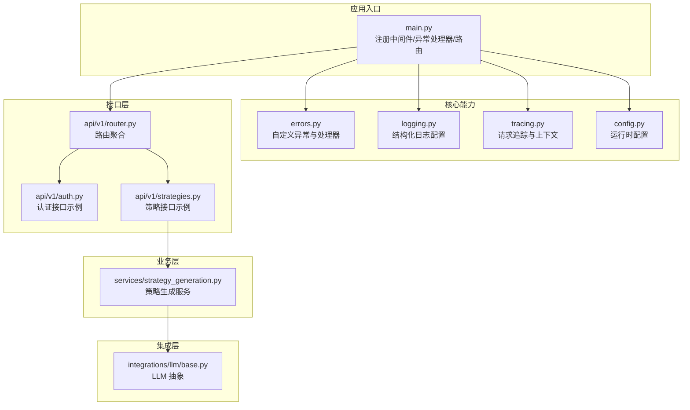
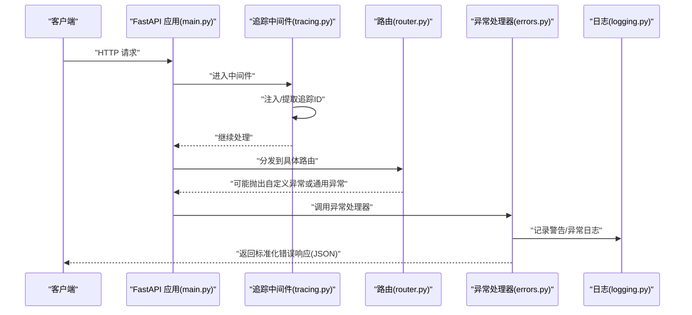
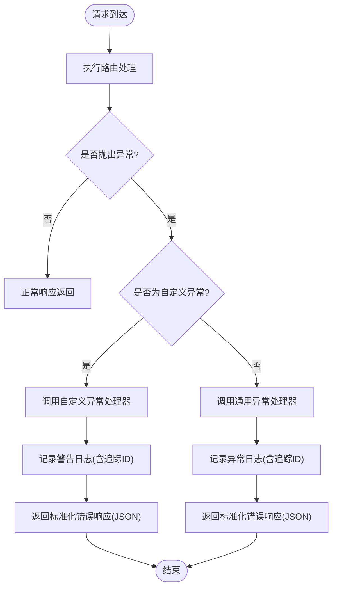
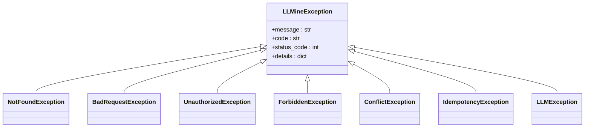
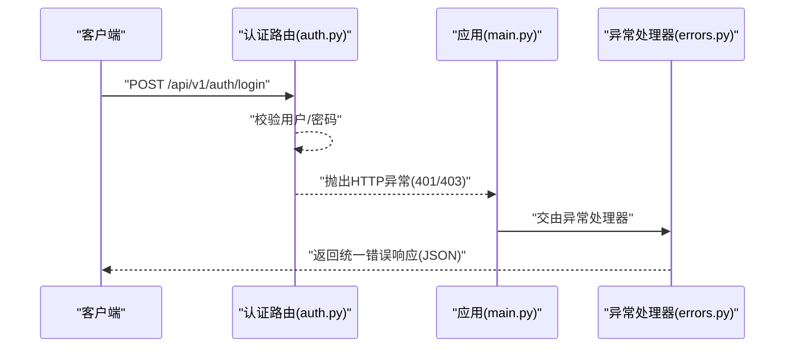
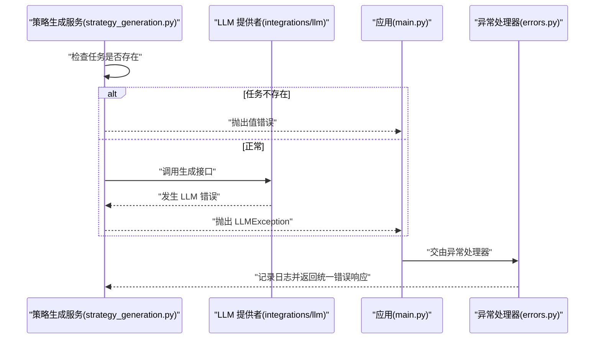
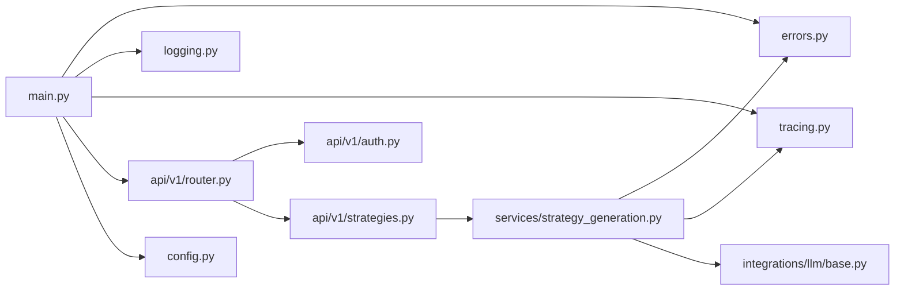

# 错误处理与异常管理

<cite>
**本文引用的文件**
- [backend/app/core/errors.py](file://backend/app/core/errors.py)
- [backend/app/core/logging.py](file://backend/app/core/logging.py)
- [backend/app/core/tracing.py](file://backend/app/core/tracing.py)
- [backend/app/main.py](file://backend/app/main.py)
- [backend/app/api/v1/router.py](file://backend/app/api/v1/router.py)
- [backend/app/api/v1/auth.py](file://backend/app/api/v1/auth.py)
- [backend/app/api/v1/strategies.py](file://backend/app/api/v1/strategies.py)
- [backend/app/services/strategy_generation.py](file://backend/app/services/strategy_generation.py)
- [backend/app/integrations/llm/base.py](file://backend/app/integrations/llm/base.py)
- [backend/app/core/config.py](file://backend/app/core/config.py)
</cite>

## 目录
1. [简介](#简介)
2. [项目结构](#项目结构)
3. [核心组件](#核心组件)
4. [架构总览](#架构总览)
5. [详细组件分析](#详细组件分析)
6. [依赖关系分析](#依赖关系分析)
7. [性能考量](#性能考量)
8. [故障排查指南](#故障排查指南)
9. [结论](#结论)
10. [附录](#附录)

## 简介
本文件系统性梳理 llmine-quant 后端的错误处理与异常管理体系，覆盖统一异常处理机制、自定义异常类设计、错误响应格式、API 层与业务层的异常捕获策略、系统级异常管理、错误日志记录与分类、错误恢复策略，并提供最佳实践、调试技巧与监控建议，帮助开发者构建健壮的应用。

## 项目结构
后端采用 FastAPI 应用入口集中注册中间件与异常处理器，核心错误处理与日志、链路追踪分别位于 core 子包；API 路由在 v1 下聚合；业务服务在 services 中实现；LLM 集成在 integrations 中，遵循统一异常约定。

图表来源
- [backend/app/main.py:39-65](file://backend/app/main.py#L39-L65)
- [backend/app/core/errors.py:73-118](file://backend/app/core/errors.py#L73-L118)
- [backend/app/core/logging.py:11-41](file://backend/app/core/logging.py#L11-L41)
- [backend/app/core/tracing.py:49-87](file://backend/app/core/tracing.py#L49-L87)
- [backend/app/api/v1/router.py:23-40](file://backend/app/api/v1/router.py#L23-L40)
- [backend/app/api/v1/auth.py:47-194](file://backend/app/api/v1/auth.py#L47-L194)
- [backend/app/api/v1/strategies.py:162-200](file://backend/app/api/v1/strategies.py#L162-L200)
- [backend/app/services/strategy_generation.py:86-200](file://backend/app/services/strategy_generation.py#L86-L200)
- [backend/app/integrations/llm/base.py:31-75](file://backend/app/integrations/llm/base.py#L31-L75)

章节来源
- [backend/app/main.py:39-65](file://backend/app/main.py#L39-L65)
- [backend/app/core/errors.py:13-118](file://backend/app/core/errors.py#L13-L118)
- [backend/app/core/logging.py:11-41](file://backend/app/core/logging.py#L11-L41)
- [backend/app/core/tracing.py:13-87](file://backend/app/core/tracing.py#L13-L87)
- [backend/app/api/v1/router.py:23-40](file://backend/app/api/v1/router.py#L23-L40)

## 核心组件
- 自定义异常体系：以统一基类为根，派生出资源未找到、请求非法、未授权、禁止访问、冲突、幂等冲突、LLM 错误等类型，确保错误语义清晰且可被统一处理。
- 统一异常处理器：针对自定义异常与通用异常分别输出标准化 JSON 响应，包含错误码、消息、细节与链路追踪 ID。
- 结构化日志：基于 structlog 输出 JSON 或控制台日志，支持时间戳、堆栈信息、环境级别等。
- 请求追踪：中间件注入/提取追踪 ID，贯穿日志与异常响应，便于端到端问题定位。
- 配置驱动：通过配置项控制日志级别、环境、CORS、API 前缀等，影响异常处理与日志输出形态。

章节来源
- [backend/app/core/errors.py:13-118](file://backend/app/core/errors.py#L13-L118)
- [backend/app/core/logging.py:11-41](file://backend/app/core/logging.py#L11-L41)
- [backend/app/core/tracing.py:13-87](file://backend/app/core/tracing.py#L13-L87)
- [backend/app/core/config.py:48-104](file://backend/app/core/config.py#L48-L104)

## 架构总览
下图展示从客户端请求到异常处理与日志记录的关键路径，包括中间件注入、异常捕获、统一响应与日志输出。

图表来源
- [backend/app/main.py:49-54](file://backend/app/main.py#L49-L54)
- [backend/app/core/tracing.py:49-87](file://backend/app/core/tracing.py#L49-L87)
- [backend/app/core/errors.py:73-118](file://backend/app/core/errors.py#L73-L118)
- [backend/app/core/logging.py:11-41](file://backend/app/core/logging.py#L11-L41)

## 详细组件分析

### 统一异常处理机制
- 异常注册：应用启动时注册两类异常处理器，分别处理自定义异常与通用异常。
- 自定义异常响应：包含错误码、消息、细节与追踪 ID；同时写入结构化日志并记录警告级别。
- 通用异常响应：捕获未预期异常，返回内部错误码与追踪 ID，并记录异常堆栈。

图表来源
- [backend/app/main.py:52-54](file://backend/app/main.py#L52-L54)
- [backend/app/core/errors.py:73-118](file://backend/app/core/errors.py#L73-L118)

章节来源
- [backend/app/main.py:52-54](file://backend/app/main.py#L52-L54)
- [backend/app/core/errors.py:73-118](file://backend/app/core/errors.py#L73-L118)

### 自定义异常类设计
- 基类：统一承载消息、错误码、状态码与细节字段，便于上层统一消费。
- 派生类：覆盖常见 HTTP 状态码与业务错误场景，如未找到、请求非法、未授权、禁止、冲突、幂等等；LLM 错误映射到网关错误状态码。
- 设计要点：错误码与状态码分离，便于前端区分业务错误与系统错误；细节字段用于携带上下文信息（如字段校验失败详情）。

图表来源
- [backend/app/core/errors.py:13-71](file://backend/app/core/errors.py#L13-L71)

章节来源
- [backend/app/core/errors.py:13-71](file://backend/app/core/errors.py#L13-L71)

### 错误响应格式
- 字段规范：code、message、details、trace_id。
- 一致性：所有错误响应均包含 trace_id，便于跨服务串联定位。
- 可扩展：details 字段可用于承载结构化错误上下文（例如字段名、期望值、建议修复方式等）。

章节来源
- [backend/app/core/errors.py:87-95](file://backend/app/core/errors.py#L87-L95)
- [backend/app/core/errors.py:110-118](file://backend/app/core/errors.py#L110-L118)

### API 层错误处理
- FastAPI 内置异常：认证与权限相关的典型场景使用 HTTPException，配合标准状态码与 WWW-Authenticate 头。
- 示例：登录接口对凭据错误与账户禁用分别返回未授权与禁止访问；注册接口对重复邮箱返回冲突。
- 统一性：这些异常最终由全局异常处理器接管，保证响应格式一致。

图表来源
- [backend/app/api/v1/auth.py:57-64](file://backend/app/api/v1/auth.py#L57-L64)
- [backend/app/api/v1/auth.py:98-99](file://backend/app/api/v1/auth.py#L98-L99)
- [backend/app/main.py:52-54](file://backend/app/main.py#L52-L54)
- [backend/app/core/errors.py:73-118](file://backend/app/core/errors.py#L73-L118)

章节来源
- [backend/app/api/v1/auth.py:47-194](file://backend/app/api/v1/auth.py#L47-L194)

### 业务逻辑异常捕获与系统级异常管理
- 业务服务：策略生成服务在任务不存在时抛出值错误，最终由全局异常处理器捕获并返回统一错误响应。
- LLM 集成：LLM 提供者抽象定义了生成接口，当底层 LLM 调用出现网络或解析异常时，服务层可抛出 LLMException，统一走异常处理流程。
- 系统级：数据库会话、外部依赖异常等均作为通用异常被捕获，避免泄漏至客户端。

图表来源
- [backend/app/services/strategy_generation.py:134-137](file://backend/app/services/strategy_generation.py#L134-L137)
- [backend/app/services/strategy_generation.py:12-13](file://backend/app/services/strategy_generation.py#L12-L13)
- [backend/app/integrations/llm/base.py:50-74](file://backend/app/integrations/llm/base.py#L50-L74)
- [backend/app/main.py:52-54](file://backend/app/main.py#L52-L54)
- [backend/app/core/errors.py:73-118](file://backend/app/core/errors.py#L73-L118)

章节来源
- [backend/app/services/strategy_generation.py:86-200](file://backend/app/services/strategy_generation.py#L86-L200)
- [backend/app/integrations/llm/base.py:31-75](file://backend/app/integrations/llm/base.py#L31-L75)

### 错误日志记录、分类与恢复策略
- 日志配置：根据环境选择 JSON 渲染器或控制台渲染器，统一输出时间戳、级别、消息与堆栈信息。
- 分类：自定义异常按业务语义分类（未找到、冲突、LLM 错误等），通用异常用于兜底。
- 恢复：对于幂等性场景，可利用幂等键避免重复提交；对于 LLM 错误，可在重试策略与降级方案之间权衡。

章节来源
- [backend/app/core/logging.py:11-41](file://backend/app/core/logging.py#L11-L41)
- [backend/app/core/errors.py:59-71](file://backend/app/core/errors.py#L59-L71)

### 错误响应与追踪 ID 的使用
- 追踪 ID 注入：中间件从请求头读取或生成追踪 ID，并在日志与响应头中回传。
- 前后端协同：客户端可将 X-Trace-ID 透传给下游服务，形成端到端链路。

章节来源
- [backend/app/core/tracing.py:49-87](file://backend/app/core/tracing.py#L49-L87)

## 依赖关系分析
- 应用入口依赖核心模块：注册中间件与异常处理器，加载配置。
- 异常处理器依赖追踪模块获取追踪 ID，并依赖日志模块进行记录。
- API 路由依赖各领域路由；业务服务依赖异常与追踪模块；LLM 集成依赖抽象接口。

图表来源
- [backend/app/main.py:39-65](file://backend/app/main.py#L39-L65)
- [backend/app/core/errors.py:73-118](file://backend/app/core/errors.py#L73-L118)
- [backend/app/core/logging.py:11-41](file://backend/app/core/logging.py#L11-L41)
- [backend/app/core/tracing.py:49-87](file://backend/app/core/tracing.py#L49-L87)
- [backend/app/api/v1/router.py:23-40](file://backend/app/api/v1/router.py#L23-L40)
- [backend/app/api/v1/auth.py:47-194](file://backend/app/api/v1/auth.py#L47-L194)
- [backend/app/api/v1/strategies.py:162-200](file://backend/app/api/v1/strategies.py#L162-L200)
- [backend/app/services/strategy_generation.py:86-200](file://backend/app/services/strategy_generation.py#L86-L200)
- [backend/app/integrations/llm/base.py:31-75](file://backend/app/integrations/llm/base.py#L31-L75)
- [backend/app/core/config.py:48-104](file://backend/app/core/config.py#L48-L104)

章节来源
- [backend/app/main.py:39-65](file://backend/app/main.py#L39-L65)
- [backend/app/core/errors.py:73-118](file://backend/app/core/errors.py#L73-L118)
- [backend/app/core/tracing.py:49-87](file://backend/app/core/tracing.py#L49-L87)

## 性能考量
- 异常路径开销：异常处理与日志记录会带来额外 IO 与序列化成本，建议仅在必要时记录详细上下文。
- 日志级别：生产环境使用 JSON 渲染器，减少控制台格式化开销；合理设置日志级别避免过度打印。
- 追踪 ID：仅在需要时生成新 ID，避免频繁分配；在高并发场景下注意上下文传递的轻量性。

## 故障排查指南
- 快速定位：优先查看响应中的 trace_id，结合日志检索同一 trace_id 的完整链路。
- 常见错误：
  - 400/401/403：检查请求参数、认证与权限。
  - 404：确认资源 ID 是否存在。
  - 409：处理冲突（如重复注册、幂等键冲突）。
  - 502：LLM 提供商不可用或超时，检查网络与密钥配置。
- 调试技巧：
  - 在开发环境启用控制台渲染器，便于快速阅读。
  - 对关键业务流程埋点，记录 trace_id 与 correlation_id，便于回溯。
  - 使用健康检查端点确认应用存活与版本信息。
- 监控建议：
  - 将错误码与 trace_id 上报到监控平台，建立告警阈值。
  - 对 LLM 错误与通用异常分别统计，识别系统稳定性趋势。

章节来源
- [backend/app/core/errors.py:73-118](file://backend/app/core/errors.py#L73-L118)
- [backend/app/core/logging.py:11-41](file://backend/app/core/logging.py#L11-L41)
- [backend/app/main.py:61-65](file://backend/app/main.py#L61-L65)

## 结论
本项目通过“统一异常基类 + 全局异常处理器 + 结构化日志 + 请求追踪”的组合，实现了清晰、一致、可观测的错误处理体系。API 层与业务层均遵循统一约定，既提升了开发效率，也增强了系统的可维护性与可诊断性。建议在后续迭代中持续完善错误分类与恢复策略，强化监控与告警，进一步提升系统可靠性。

## 附录
- 最佳实践清单
  - 所有业务异常尽量使用自定义异常类，明确错误码与状态码。
  - 在异常处理器中记录结构化日志，包含 trace_id、路径、方法与错误详情。
  - 对幂等性操作使用幂等键，避免重复提交引发的副作用。
  - 对 LLM 调用失败进行分级处理：可重试、降级或提示用户。
  - 在生产环境使用 JSON 日志渲染器，便于日志采集与检索。
  - 对关键路径埋点 trace_id 与 correlation_id，形成端到端链路。